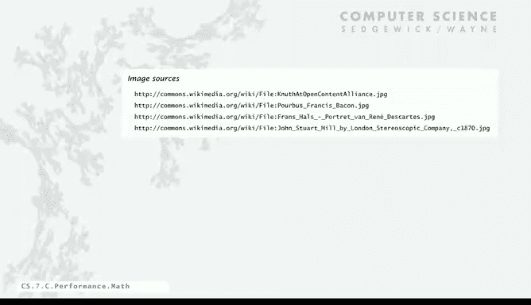

# 028：数学模型

## 概述

在本节课中，我们将学习如何为计算机程序的运行时间建立数学模型。我们将了解唐纳德·克努特提出的方法，通过分析程序使用的操作及其执行频率来推导运行时间的公式。我们还将学习如何使用波浪号（~）表示法来简化公式，重点关注增长最快的项。最后，我们将看到数学模型如何与实验观察相结合，形成理解程序性能的科学方法。

---

## 数学模型的概念

运行实验是一种方法，但我们现在要探讨一个更强大的理念：我们可以建立描述程序性能的数学模型。这些模型可以作为验证工具，也是理解程序的更好方式。

因此，问题是：我们能否为计算机程序的运行时间写出一个精确的公式？

在20世纪60年代，普遍的观点是“不能”，因为这太复杂了。计算机是极其复杂的设备，建立这样的模型会非常困难。但在60年代末，克努特证明我们实际上可以做到这一点。他撰写了一系列四本书，为许多重要的计算机算法建立了模型。

他的想法非常直接：
1.  确定程序完成工作所需执行的操作集合。
2.  找出每个操作的成本。在那个年代，有手册会精确告诉你每条指令需要多少时间。如今，找出成本取决于系统软件等因素。
3.  找出每个操作的执行频率。这取决于输入数据和算法本身。
4.  通过将所有操作的“成本乘以频率”相加，得到总成本。

是的，这可能很复杂，但也有方法获得有用的近似值，这使得即使在今天，建立数学模型也是可行且有用的。这就是我接下来要讨论的内容。

---

## 热身：OneSum 问题分析

作为热身，我们来看如何解决 OneSum 问题。问题是在数组中找出零的个数。这里只有一个 `for` 循环，我们只是计算数组中零的数量。

如果我们分析这个程序并分解其操作，首先要注意的是，像 `count++` 这样的指令的执行次数取决于输入。如果数组中没有零，它可能执行零次；如果全是零，则可能执行 n 次。对于像这样的程序，我们必须考虑这种复杂性。

那么，这个程序总运行时间的数学公式是什么？

在这种情况下，我们将其分解为七种操作：函数调用/返回、变量声明、赋值语句、比较（`i <= N`）、相等比较（`a[i] == 0`）、数组访问（`a[i]`）以及递增操作（`i++` 和 `count++`）。对于每一种操作，我们可以估算其执行成本。这里有一些艺术处理的成分：几十年前，你可以确切地说明这些成本，因为计算机必须精确地在规定时间内完成操作；如今，这些数字可能有一些灵活性，但你仍然可以通过研究和实验来获得精确值。

这是每个操作的成本。在最右边的列中，是每个操作的执行次数。只有一次函数调用/返回，两次变量声明，等等。有 `n+1` 次小于比较，`n` 次等于比较，`n` 次数组访问。至于递增操作，你必须递增 `i`，也必须递增 `count`，而 `count` 可能在 0 到 n 之间变化，所以这个次数是变量。

因此，总运行时间就是将这些成本与频率相乘然后相加。结果是 `C * n + 26.5`，其中 `C` 是一个介于 2 到 2.5 之间的数字，具体取决于输入。

如果我们假设输入中零很少见，我们可以说大约是 `2n + 26.5`。这就是克努特方法论的一个例子：确定每个操作的成本，确定执行频率，相乘并相加。

---

## 更复杂的例子：TwoSum 问题

现在，让我们看一个稍微复杂一点的例子：TwoSum 问题。我们想找出数组中相加为零的数对。我们使用一个双重嵌套的 `for` 循环。我们知道有更快的解决方法，但我们的主题是研究程序本身，而不是寻找最快解决问题的方法。

让我们尝试为这个 TwoSum 程序的总运行时间推导一个公式。

同样，我们使用类似的表格，但现在操作的频率更复杂。在 0 到 n 之间有 `n*(n-1)/2` 个不同的 `(i, j)` 数对，这就是右边这些频率表达式的来源。推导这些细节的步骤目前不那么重要，但精确计算它们很繁琐。无论如何，我们得到了这个表格，一旦知道了那个核心数字，你就可以算出其他的。

我们可以把它们加起来，现在我们对运行时间有了一个更复杂的定义，因为递增操作次数的变量会影响所有项。你可以得出一个公式，但我们需要稍微简化一下计算。

我们将要做的是：专注于公式中增长最快、最显著的部分，忽略其他所有项。为此，我们使用一种称为“波浪号表示法”的符号。

---

## 简化公式：波浪号表示法

波浪号表示法的含义是：`f(n) ~ g(n)` 表示当 `n` 趋近于无穷大时，`f(n)` 与 `g(n)` 的比值趋近于 1。

它并没有精确说明趋近于 1 的速度有多快，但对于我们现在进行的这类计算来说，它非常有用。

例如，如果我有一个公式 `(5/4)*n^2 + (1/3)*n + 53/2`，随着 `n` 增长，第一项的增长速度远远快于其他两项，所以我们直接说它 `~ (5/4)*n^2`。

为了看看有多接近，假设 `n = 1000`，左边的值是 `1,253,027.5`，右边的值是 `1,250,000`，误差在 0.3% 以内。这对于我们理解程序运行时间的目的来说，绝对足够精确了。

其理念是：如果 `n` 很大，那么我们忽略的项就微不足道；如果 `n` 非常小，那么所有项都微不足道，也就不那么重要了。通过舍弃小项，我们能更容易地处理这些公式。

那么对于 TwoSum，我们可以假设 `count` 不大（这通常是实际情况，相加为零的数对不会太多），这将成为一个低阶项，从而消除了我们对输入的依赖。现在我们可以说，该程序运行时间 `~ (5/4)*n^2` 纳秒。

这就是我们可以为运行时间写下的那种表达式，只包含增长最快的一项。

---

## 应用波浪号表示法：ThreeSum 问题

最后，让我们为 ThreeSum 问题应用波浪号操作。即使在计算频率时，我们也可以忽略低阶项，因为我们最终会乘以一个常数并相加。再次假设 `count` 不大，以将输入从方程中移除。

所有计算基于 `C(n, 3) ~ n^3 / 6`。现在这些计算变得容易得多，相乘并相加后，我们立即得到 `~ n^3 / 2` 纳秒。

这就是我们仅仅通过查看程序推导出的数学公式。这个模型告诉我们，根据计算机和程序的特性，运行时间应该是 `~ n^3 / 2` 纳秒。

你可能还记得，我们的实验假设几乎完全吻合：`484 * n^3` 纳秒。当我们的数学模型与实验模型一致时，这是一个非常好的情况。

---

## 科学方法的背景

这实际上就是科学方法的全部内容，由17世纪及以后的欧洲数学家和科学家发展起来。其核心理念是：
1.  观察自然界的某个特征。
2.  提出一个与观察或实验一致的模型，这就是假设。
3.  使用该假设预测事件。
4.  通过进一步的观察来验证这些预测。
5.  验证并完善，直到我们的假设与观察结果一致。

这个模型可以来自实验，也可以是一个数学模型。对于程序，我们研究的“自然世界特征”是程序在计算机上运行所需的时间。

我们拟合曲线以获得运行时间的公式，这对于预测很有用，但对于解释则不然。通过数学分析，我们研究算法，得到一个作为 `n` 的函数的运行时间公式，这真正帮助我们理解算法在做什么，同时也是对模型的另一种验证。

因此，当我们能做到像这个案例一样，既运行实验又建立一致的数学模型时，我们就可以对我们基于该理解所做的理解和预测拥有相当大的信心。

确实，有时我们可能需要一些高等数学，我们稍后会讨论。但数学模型的优势在于，它几乎适用于任何计算机。

好消息是，通常我们的数学模型比其他科学领域更容易构建，因为我们研究的对象——计算机程序——是由相对较少的原语（如循环和条件语句）构建而成的。虽然有时可能很复杂，但通常可以说比其他科学领域更容易。我们将在下一节中进一步探讨。

---

## 总结

本节课中，我们一起学习了如何为程序运行时间建立数学模型。我们了解了克努特的分析方法，即通过识别操作、成本和频率来推导公式。我们引入了波浪号表示法来简化公式，专注于主导项。通过分析 OneSum、TwoSum 和 ThreeSum 问题，我们看到了如何将这种方法应用于实际代码。最后，我们认识到将数学模型与实验观察相结合，是理解和预测程序性能的强大科学方法。