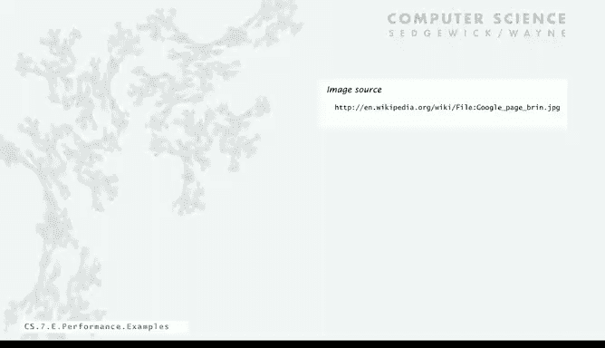

# 030：熟悉示例 📊

在本节课中，我们将学习如何通过实验和简单的“翻倍测试”来分析程序的运行时间和内存使用情况。我们将通过两个熟悉的程序示例——赌徒破产问题和优惠券收集问题——来演示这一过程，并最终理解如何评估一个算法是否能够高效地解决大规模问题。

---

## 通过实验分析运行时间

上一节我们讨论了算法分析的理论模型。本节中，我们来看看如何通过实际运行程序来验证这些模型。

我们可以在程序中插入计时代码，通过测量不同输入规模下的运行时间，来推断程序的增长阶数。以下是具体步骤：

1.  在程序开始和结束时记录时间。
2.  选择一个初始输入规模 `n`，运行程序并记录时间 `T(n)`。
3.  将输入规模翻倍至 `2n`，再次运行并记录时间 `T(2n)`。
4.  计算时间比 `T(2n) / T(n)`。这个比值可以帮助我们判断增长阶数。

### 赌徒破产问题示例

我们想知道，从1000美元开始，每次赌1美元，需要多长时间才能模拟出翻倍到2000美元的概率？

我们插入计时代码，并运行程序。为了获得更稳定的结果，我们进行多次试验（例如100次）并取平均时间。

以下是实验数据：

*   初始赌注 `n = 1000`， 运行时间 `T(1000)`。
*   将赌注翻倍至 `n = 2000`， 运行时间 `T(2000)`。
*   计算比值 `T(2000) / T(1000) ≈ 4`。
*   继续翻倍至 `n = 4000`， 比值 `T(4000) / T(2000)` 也接近 `4`。

观察到的比值稳定在 `4` 左右，这与我们之前的数学模型（运行时间与 `n²` 成正比）相符。因为当 `n` 翻倍时，`(2n)² = 4n²`，所以时间大约变为 `4` 倍。

利用这个规律，我们可以外推预测更大规模问题的运行时间。例如，要模拟 `n = 1,000,000` 的情况，我们需要将时间乘以 `4` 的若干次方。计算表明，这大约需要 **480万秒**（约两个月）。这个结果告诉我们，对于百万级的问题，当前的算法可能不切实际。

### 优惠券收集问题示例

现在，我们想知道模拟收集100万张不同优惠券需要多长时间。

采用同样的计时方法，我们得到以下数据：

*   `n = 125,000`， 时间约 `7` 秒。
*   `n = 250,000`， 时间约 `14` 秒。
*   `n = 500,000`， 时间约 `31` 秒。

观察时间比值，它大约为 `2`。这意味着当问题规模翻倍时，运行时间也大约翻倍。这与 `n log n` 的增长阶数相符，因为对于 `n log n` 型算法，翻倍后的增量因子主要由 `n` 的系数决定，比值趋近于 `2`。

因此，我们可以预测模拟 `n = 1,000,000` 张优惠券大约需要 **1分钟**。

---

## 分析内存使用情况

除了运行时间，程序的内存需求也可能成为瓶颈。在优惠券收集问题中，当 `n` 非常大时，可能会在耗尽时间之前先耗尽内存。

在Java中，内存的基本可寻址单位是**字节**（`byte`，8位）。了解不同数据类型占用的字节数对估算内存使用至关重要。

以下是Java中基本数据类型的典型内存占用：

*   `boolean`: **1字节**
*   `char`: **2字节** (Unicode)
*   `int`: **4字节**
*   `float`: **4字节**
*   `long`: **8字节**
*   `double`: **8字节**

对于数据结构，例如数组，会有额外的开销。一个包含 `n` 个 `int` 的数组大约占用 `4n + 16` 字节。一个 `n` 行 `n` 列的二维 `double` 数组则大约占用 `8n²` 字节。

例如，一个 `2000 x 2000` 的 `double` 型二维数组大约需要 `32 MB` 内存。通过这样的估算，我们可以判断程序在给定内存限制下能处理的数据规模上限。

---

## 总结与启示

本节课中我们一起学习了如何结合实验、数学分析和“翻倍测试”来评估程序的性能。

总结起来，评估一个程序能否解决大规模问题，可以遵循以下路径：

1.  **进行实验**：使用翻倍测试等方法，了解程序的运行时间增长趋势。
2.  **判断可扩展性**：
    *   如果运行时间增长缓慢（如 `log n`、`n`、`n log n`），说明算法**具有良好的可扩展性**。若想解决更大问题，可以考虑升级硬件。
    *   如果运行时间增长过快（如 `n²`、`n³` 或指数级），说明算法**可扩展性差**。此时应寻找更高效的算法。
3.  **迭代优化**：如果找到更好的算法，就回到第一步重新评估，形成一个“分析-优化”的循环。

性能分析至关重要。一个著名的例子是谷歌的创始人拉里·佩奇和谢尔盖·布林。他们早期在构建网页索引和排名系统时，最初也通过增加硬件来解决问题。但真正让他们改变世界的是发明了更优的算法——**PageRank**。这个案例深刻说明，面对海量数据问题，一个高效的算法往往比单纯的硬件升级更具决定性力量。