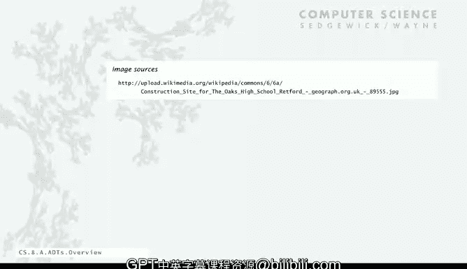

# 计算机科学：以目的为导向的编程（Java）：31：抽象数据类型概述


在本节课中，我们将要学习抽象数据类型（ADT）的基本概念。我们将了解什么是ADT，为什么需要它，以及如何在Java程序中使用它。我们将以字符串为例，回顾我们已经接触过的ADT使用方法，并展望后续将学习的更复杂的数据类型。

---

## 抽象数据类型的基本定义

上一节我们介绍了编程的基础元素。本节中，我们来看看数据类型的核心定义。

一个**数据类型**是一组值以及定义在这组值上的一组操作。我们之前已经学习过Java的一些内置数据类型，例如 `int` 和 `double`。

在Java的原始类型中，值直接映射到机器表示，操作直接映射到机器指令。因此，使用这些类型的程序非常高效。

然而，我们需要编写程序来处理机器未内置的其他类型数据。例如，颜色、图片、字符串、复数、向量和矩阵等。为了做到这一点，我们使用**抽象数据类型**。

抽象数据类型是一个数据类型，它包含一组明确定义的值和操作，但其**表示对客户端是隐藏的**。这一点非常重要，我们将经常回顾。

这导致了一种被称为**面向对象编程**的编程风格。在面向对象编程中，我们将创建并使用自己的数据类型。

---

## 对象与变量

在面向对象编程中，我们操作持有数据类型值的对象。程序中的变量将引用这些对象。

以下是几个即将讨论的ADT例子：

*   **颜色**：其值由三个8位整数表示。操作包括获取颜色分量、调亮或调暗。
*   **图片**：它是颜色的二维数组。操作包括获取或设置图片中像素的值。
*   **字符串**：它是一个字符序列。我们可以对字符串执行许多操作，并且存在许多围绕字符串的重要程序。

对于所有这些数据类型，最佳实践是使用表示被隐藏的抽象数据类型。

这样做的主要影响是：**客户端可以在不了解实现细节的情况下使用ADT**。他们只需要知道如何使用其操作。

---

## 客户端与实现

在本讲座中，我们将讨论如何为几个有用的ADT编写客户端程序。具体来说，我们**不会**讨论实现细节。我们将编写利用这些ADT的程序，而无需了解其内部表示。

在下一讲中，我们将讨论如何实现你自己的抽象数据类型。

---

## 以字符串为例

让我们快速看一下字符串，因为它是一个我们已经使用过的抽象数据类型。

我们大致知道它们在机器内部是如何表示的，但我们的程序并不真正依赖于任何特定的表示。

我们将字符串定义为一个Unicode字符序列。Java的String ADT允许我们编写操作字符串的程序，但其确切表示是隐藏的。即使Java改变了其实现，我们的程序仍然可以工作。

我们已经使用了许多字符串操作，例如获取长度、获取子字符串等。我们将在本讲座后面更详细地讨论这些。

---

## 使用ADT的关键要素

基本思想是，我们需要知道三件事才能使用一个抽象数据类型。实际上，我们已经在字符串的上下文中这样做了。

以下是使用抽象数据类型编写客户端程序至关重要的三个要素：

1.  **数据类型的名称**：在Java中，这是一个大写的名称，例如 `String`（首字母大写）。
2.  **如何构造新对象**：以及如何将变量与这些对象关联。
3.  **如何对给定对象应用操作**。

让我们通过一个简单的字符串代码示例来具体说明，这类似于“Hello World”，但包含一些字符串操作。

```java
String s = new String(“Hello World”);
String t = s.substring(0, 5);
```

*   **构造对象**：我们使用关键字 `new` 来调用**构造函数**，从而创建一个新对象。构造函数是一种创建新对象的特殊方法。我们使用数据类型名称（如 `String`）来指定要创建哪种类型的对象以及调用哪个构造函数。
*   **关联变量**：通过赋值语句将新构造的对象与一个变量（如 `s`）关联。
*   **应用操作（调用方法）**：我们使用对象名（如 `s`），后跟点运算符 `.`，然后是要调用的方法名（如 `substring`）。这表示我们要对该特定对象应用一个操作。

我们将看到更多这样的例子。这里只是指出，我们已经在对抽象数据类型执行基本操作，现在我们可以转向更有趣的例子。

---

## 总结




本节课中，我们一起学习了抽象数据类型（ADT）的核心概念。我们明确了ADT是一种对客户端隐藏其内部表示的数据类型。我们回顾了使用ADT的三个关键要素：类型名称、对象构造和方法调用，并以字符串为例进行了说明。理解“表示隐藏”是掌握面向对象编程和构建模块化、可维护程序的重要基础。在接下来的课程中，我们将深入探讨如何实际使用和实现各种有用的ADT。