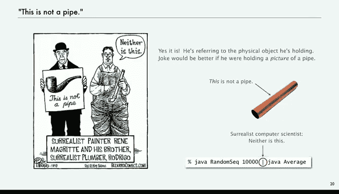

# 032：颜色处理 🎨


在本节课中，我们将学习如何定义和使用一个表示颜色的抽象数据类型。我们将了解颜色的基本概念，学习如何通过RGB值创建和操作颜色，并探索几个实际应用，例如计算颜色的亮度、检查颜色兼容性以及将彩色图像转换为灰度图。

---

## 什么是颜色？

颜色是眼睛对电磁辐射产生的一种感觉。但在编程的上下文中，我们关心的是一个允许我们操作颜色的抽象数据类型。

颜色的值由三个8位整数表示，分别代表红色、绿色和蓝色的强度。每个分量的取值范围是0到255。通过混合这三种颜色，我们可以在显示器或打印页面上得到相应的颜色。

*   **纯红色**：`(255, 0, 0)`
*   **纯绿色**：`(0, 255, 0)`
*   **纯蓝色**：`(0, 0, 255)`
*   **黑色**：`(0, 0, 0)`
*   **白色**：`(255, 255, 255)`

如果三个分量值相同，则得到的是灰度色。

---

## 颜色的API

一个抽象数据类型的API首先定义其构造函数，然后是可供客户端程序调用的方法。对于颜色数据类型，其API可能包含以下操作：

*   **构造函数**：`Color(int r, int g, int b)` - 用给定的RGB值创建一个颜色对象。
*   **获取分量值**：`getRed()`, `getGreen()`, `getBlue()` - 返回颜色的红、绿、蓝分量值。
*   **调整颜色**：`brighter()`, `darker()` - 使颜色变亮或变暗。
*   **字符串表示**：`toString()` - 返回颜色的字符串表示，便于打印。
*   **比较颜色**：`equals(Color that)` - 判断当前颜色是否与另一个颜色相同。

这些方法使我们能够编写操作颜色的Java程序。

---

## 应用示例：绘制阿尔伯斯方块

约瑟夫·阿尔伯斯是20世纪的艺术家，他通过绘制嵌套的不同颜色方块来研究颜色关系。我们的目标是编写一个程序来生成阿尔伯斯方块。

程序需要六个命令行参数，前三个是第一个颜色的RGB值，后三个是第二个颜色的RGB值。程序将绘制两个并排的方块，展示两种颜色的不同组合效果。

以下是实现该程序的核心步骤：

1.  从命令行参数读取两组RGB值。
2.  使用颜色构造函数创建两个`Color`对象。
3.  使用`StdDraw.setPenColor()`方法设置画笔颜色。
4.  通过简单的几何计算，绘制大小不同的嵌套方块。

```java
// 示例代码结构
Color c1 = new Color(r1, g1, b1); // 创建第一个颜色
Color c2 = new Color(r2, g2, b2); // 创建第二个颜色

// 绘制左侧方块
StdDraw.setPenColor(c1);
StdDraw.filledSquare(0.25, 0.5, 0.2); // 大方形
StdDraw.setPenColor(c2);
StdDraw.filledSquare(0.25, 0.5, 0.1); // 小方形

// 绘制右侧方块（颜色互换）
StdDraw.setPenColor(c2);
StdDraw.filledSquare(0.75, 0.5, 0.2);
StdDraw.setPenColor(c1);
StdDraw.filledSquare(0.75, 0.5, 0.1);
```

这个简单的客户端程序展示了我们如何计算一种新型数据——颜色，而不仅仅是Java内置的基本类型数字。

---

## 计算颜色亮度

颜色的单色亮度是量化颜色明亮程度的一种方法，在许多应用中都很重要。亮度有一个标准计算公式，它是RGB值的线性组合：

**亮度公式**：`Y = 0.299 * R + 0.587 * G + 0.114 * B`

由于权重之和为1，计算出的亮度值也在0到255之间。

我们可以编写一个静态方法来计算亮度：

```java
public static double luminance(Color c) {
    int r = c.getRed();
    int g = c.getGreen();
    int b = c.getBlue();
    return 0.299 * r + 0.587 * g + 0.114 * b;
}
```

这个方法接收一个`Color`对象作为参数，使用其`get`方法获取分量值，然后根据公式计算并返回亮度值。

---

## 应用一：颜色兼容性（可读性）

在屏幕上显示文本时，字体颜色和背景颜色的搭配影响可读性。一个经验法则是：两种颜色的亮度差绝对值应大于128，以确保文本清晰可辨。

我们可以编写一个方法来检查两种颜色是否兼容：

```java
public static boolean areCompatible(Color a, Color b) {
    double lumA = luminance(a);
    double lumB = luminance(b);
    return Math.abs(lumA - lumB) > 128.0;
}
```

例如，白色背景上使用黑色文字（亮度差255）非常清晰，而红色背景上使用蓝色文字（亮度差小）则可能难以阅读。

---

## 应用二：转换为灰度

将彩色转换为灰度是一个常见操作。我们已经知道，当RGB三个分量值相同时，得到的是灰度色。对于一个给定的颜色，其对应的灰度值就是它的亮度。

以下方法接收一个颜色，并返回其对应的灰度颜色：

```java
public static Color toGray(Color c) {
    int y = (int) Math.round(luminance(c)); // 计算亮度并四舍五入为整数
    return new Color(y, y, y); // 用亮度值创建新的灰度颜色
}
```

---

## 抽象与对象引用

在面向对象编程中，Java如何内部表示颜色（例如，是将三个值打包成一个整数，还是分开存储）对我们来说是隐藏的。我们只通过定义好的API（如构造函数和`get`方法）与颜色对象交互。这种表示与操作的分离是抽象数据类型的主要优势。

对象引用类似于变量名，它指向存储实际值的内存地址。我们通过引用（变量名）来操作对象，并使用点运算符调用对象的方法。

> 这引出了一个关于抽象的有趣思考：在Java中，我们说`Color c;`，这里的`c`不是一个颜色，而是一个对颜色对象的引用。这就像比利时艺术家雷内·马格利特的名画《形象的叛逆》所表达的：“这不是一个烟斗”（这是一幅烟斗的画）。同样，在代码中，我们操作的是现实世界概念的抽象模型。

---

## 总结




本节课我们一起学习了颜色的抽象数据类型。我们了解了如何通过RGB值定义颜色，并利用API创建和操作颜色对象。通过绘制阿尔伯斯方块的例子，我们实践了颜色的使用。我们还探讨了颜色的两个重要应用：计算亮度以评估颜色兼容性（确保文本可读性），以及将彩色图像转换为灰度图。最后，我们讨论了抽象数据类型的核心思想——将数据的表示与操作分离，这是面向对象编程的强大工具，让我们能够构建现实世界概念的抽象模型。