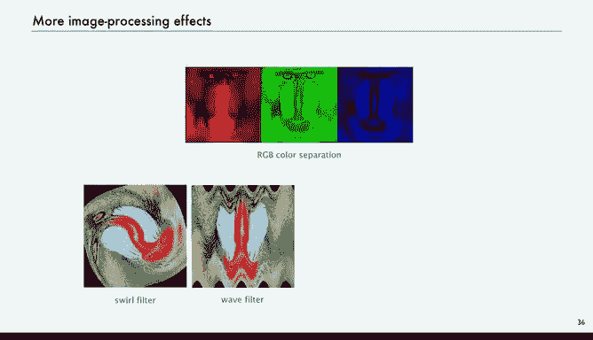
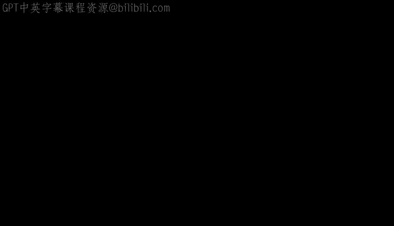

# 计算机科学：以目的为导向的编程（Java）：33：图像处理 🖼️


在本节课中，我们将学习如何使用抽象数据类型进行图像处理。我们将了解“图片”这一数据类型，并编写程序来操作和转换图像，例如将彩色照片转换为灰度图或缩放图像。

---

## 图片数据类型 📄

上一节我们介绍了颜色数据类型，本节中我们来看看一个更高级的应用：图片。图片数据类型本质上是一个二维的像素数组。

**核心概念**：一个 `Picture` 对象的值是一个二维的颜色数组。
```java
Color[][] pixels; // 图片由像素的二维数组表示
```

我们将其视为具有行和列的网格，左上角的坐标是 `(0, 0)`。每个像素由其列索引（`col`）和行索引（`row`）定位。图片有特定的宽度（列数）和高度（行数）。

基于此，我们可以定义对图片执行的操作。

以下是图片数据类型支持的主要操作：

*   **构造函数**：`Picture(String filename)` - 从指定文件（如JPG）创建新图片。
*   **构造函数**：`Picture(int width, int height)` - 创建指定尺寸的空白图片。
*   **获取属性**：`width()` 和 `height()` - 返回图片的宽度和高度。
*   **获取像素颜色**：`get(int col, int row)` - 返回指定列和行处像素的颜色。
*   **设置像素颜色**：`set(int col, int row, Color color)` - 将指定位置像素的颜色设置为给定颜色。
*   **显示图片**：`show()` - 在窗口中显示图片。
*   **保存图片**：`save(String filename)` - 将图片保存到文件。

通过这些简单的操作，我们无需关心图片在系统内部的具体表示方式，就能编写程序处理图像。

---

## 灰度转换示例 ⚫⚪

现在，让我们应用这些操作来完成一个具体任务：将彩色图像转换为灰度图像。

以下是实现此功能的Java程序核心逻辑：
```java
// 导入必要的库
import java.awt.Color;

public class Grayscale {
    public static void main(String[] args) {
        // 1. 从文件创建源图片
        Picture source = new Picture(args[0]);

        // 2. 遍历每个像素
        for (int col = 0; col < source.width(); col++) {
            for (int row = 0; row < source.height(); row++) {
                // 获取当前像素的颜色
                Color color = source.get(col, row);
                // 计算其灰度值
                Color gray = Color.toGray(color);
                // 将源图片中该像素设置为灰度值
                source.set(col, row, gray);
            }
        }
        // 3. 显示处理后的图片
        source.show();
    }
}
```

**程序解析**：
1.  程序从命令行参数指定的文件创建 `Picture` 对象。
2.  使用嵌套的 `for` 循环遍历图片的每一个像素。
3.  对于每个像素，使用 `get` 方法获取其颜色，然后调用 `Color.toGray` 方法（假设存在）计算对应的灰度颜色。
4.  使用 `set` 方法将原位置像素的颜色替换为计算出的灰度颜色。
5.  循环结束后，调用 `show` 方法显示处理后的灰度图像。

这个程序展示了图像处理的基本模式：遍历每个像素，并根据某种规则计算其新值。

---

## 图像变换练习 🔄

理解了基本模式后，我们通过几个小练习来加深理解。

以下是几个图像变换代码片段及其效果分析：

*   **练习1：无操作**
    ```java
    for (int col = 0; col < pic.width(); col++)
        for (int row = 0; row < pic.height(); row++)
            pic.set(col, row, pic.get(col, row));
    ```
    **效果**：这段代码什么也没做。它将每个像素设置为其当前颜色，因此图片保持不变。

*   **练习2：有缺陷的上下翻转**
    ```java
    for (int col = 0; col < pic.width(); col++)
        for (int row = 0; row < pic.height(); row++)
            pic.set(col, row, pic.get(col, pic.height() - 1 - row));
    ```
    **效果**：这段代码试图上下翻转图片，但存在逻辑错误。因为它直接在原图上修改，当处理下半部分像素时，其源像素（来自上半部分）已经被覆盖，导致结果不正确。

*   **练习3：正确的上下翻转**
    ```java
    Picture source = new Picture(args[0]);
    int width = source.width();
    int height = source.height();
    Picture target = new Picture(width, height); // 创建新的空白目标图片

    for (int col = 0; col < width; col++)
        for (int row = 0; row < height; row++)
            // 将目标图片的(col, row)像素设置为源图片的(col, height-1-row)像素颜色
            target.set(col, row, source.get(col, height - 1 - row));

    target.show();
    ```
    **效果**：这段代码能正确创建图片的上下翻转副本。关键在于它创建了一个新的 `target` 图片对象来存放结果，避免了对源图片数据的覆盖。

这些练习强调了图像处理中的一个重要原则：**原地修改**（直接改变原图）与**创建副本**（生成新图）的区别。许多变换需要创建新图片来保存结果。

---

## 图像缩放技术 📏

现在，我们来看一个更实用的应用：图像缩放。我们希望编写一个程序，能任意改变图像的宽度和高度。

缩放的核心思想是：为目标图片中的每个像素，在源图片中找到一个对应的“源像素”来获取颜色。这需要通过比例计算来映射坐标。

以下是实现图像缩放的Java程序：
```java
public class Scale {
    public static void main(String[] args) {
        // 从文件读取源图片
        Picture source = new Picture(args[0]);
        // 从命令行获取目标宽度和高度
        int targetWidth = Integer.parseInt(args[1]);
        int targetHeight = Integer.parseInt(args[2]);

        // 创建空白的目标图片
        Picture target = new Picture(targetWidth, targetHeight);

        // 遍历目标图片的每个像素
        for (int targetCol = 0; targetCol < targetWidth; targetCol++) {
            for (int targetRow = 0; targetRow < targetHeight; targetRow++) {
                // 关键步骤：将目标坐标按比例映射回源图片坐标
                // 公式：sourceCol = targetCol * (sourceWidth / targetWidth)
                // 公式：sourceRow = targetRow * (sourceHeight / targetHeight)
                int sourceCol = targetCol * source.width() / targetWidth;
                int sourceRow = targetRow * source.height() / targetHeight;

                // 从源图片获取映射位置的颜色
                Color color = source.get(sourceCol, sourceRow);
                // 为目标图片的当前像素设置该颜色
                target.set(targetCol, targetRow, color);
            }
        }
        // 显示缩放后的图片
        target.show();
    }
}
```

**程序解析**：
1.  程序读取源图片，并获取期望的目标尺寸。
2.  创建一个指定尺寸的空白目标图片。
3.  对于目标图片中的每一个像素 `(targetCol, targetRow)`，通过比例公式计算其在源图片中对应的位置 `(sourceCol, sourceRow)`。
4.  从源图片的对应位置获取颜色，并将其设置到目标图片的当前像素。
5.  循环结束后，显示缩放后的目标图片。

这种缩放方法称为“最近邻插值”，它简单快速，但放大时可能产生锯齿状边缘。更高级的方法（如双线性插值）会考虑周围多个像素的颜色进行平滑过渡，但计算也更为复杂。

---

## 更多图像特效 🌈

掌握了图像处理的基本框架后，你可以实现各种各样的特效。

以下是几种常见的图像特效，其实现都基于“遍历并计算每个像素新值”的模式：

*   **颜色分离**：分别提取并显示图像的红、绿、蓝通道。
*   **漩涡滤镜**：根据像素到图像中心的距离和角度，扭曲其颜色，产生漩涡效果。
*   **波浪滤镜**：使用正弦或余弦函数偏移像素位置，模拟波浪扭曲。
*   **毛玻璃滤镜**：为每个像素随机从其附近的小区域内选择一个颜色，产生模糊、失焦的效果。

这些特效的计算逻辑可能不同，但程序结构是相似的：遍历像素，根据其位置、原始颜色或邻居像素的信息，通过一个数学公式或算法计算出新的颜色值。

你可以在教科书或课程网站上找到这些滤镜的具体实现代码，并尝试用自己手机拍摄的照片进行实验。

---





本节课中我们一起学习了图像处理的基础。我们认识了 `Picture` 这个抽象数据类型，它封装了像素的二维数组以及相关的操作。我们学习了如何遍历图像像素，并实现了灰度转换和图像缩放。更重要的是，我们掌握了图像处理的核心模式：**为目标图像的每个像素，通过某种映射或计算，确定其应有的颜色**。利用这个模式，你可以创造出无数有趣的图像特效。