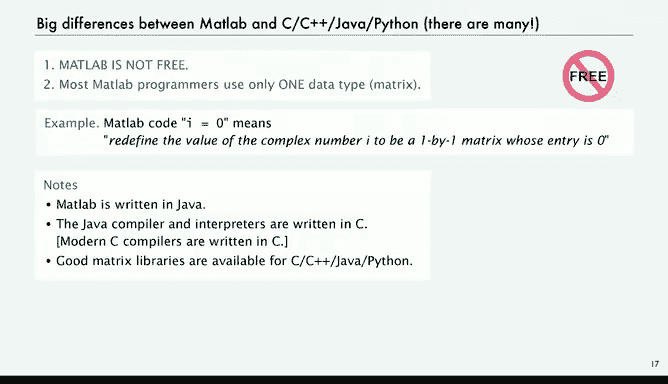
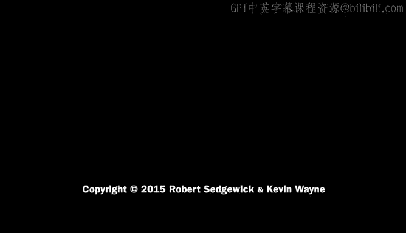

# 计算机科学：以目的为导向的编程（Java）｜P39：流行编程语言 🗣️💻


在本节课中，我们将把已学到的Java知识置于更广阔的编程语言背景中。我们将探讨几种流行的编程语言，通过一个具体的编程示例来比较它们在语法、设计和用途上的差异，帮助你理解不同语言的特点和适用场景。

## 巴别塔的故事与编程语言多样性

上一节我们介绍了编程语言多样性的概念。本节中，我们来看看一个关于语言起源的寓言——巴别塔的故事。

这个故事讲述了多种语言起源的传说。大洪水之后，天下人使用同一种语言。他们在巴别建造了一座城和一座塔，相信单一语言能让他们实现任何想象。但上帝不同意，于是变乱了天下人的语言。

这个故事引发我们思考：为何需要多种语言？答案是，文化差异和多种语言的繁衍是文明的基础之一。这与编程世界类似，不同任务需要不同的工具（编程语言）。

## 编程任务的不同解决方案

正如从一地到另一地有多种交通方式（如轮滑鞋、自行车、汽车、飞机），解决编程问题也有多种语言选择。

以下是几种解决编程问题的不同方式：
*   C
*   Java
*   MATLAB
*   C++
*   Python
*   Ruby
*   OCaml

这个列表强调了一个核心观点：**不同的语言适合不同的任务**。我们将在后续内容中结合具体语言来讨论这一点。

## 示例程序：三数之和

作为本教程的运行示例，我们将使用在性能讲座中研究过的“三数之和”程序。该程序的目标是：从标准输入读取一组整数值，找出所有和为0的三元组。

以下是Java版本的代码：
```java
public class ThreeSum {
    public static void main(String[] args) {
        int n = Integer.parseInt(args[0]);
        int[] a = new int[n];
        for (int i = 0; i < n; i++) a[i] = StdIn.readInt();
        for (int i = 0; i < n; i++)
            for (int j = i+1; j < n; j++)
                for (int k = j+1; k < n; k++)
                    if (a[i] + a[j] + a[k] == 0)
                        StdOut.println(a[i] + " " + a[j] + " " + a[k]);
    }
}
```
程序流程如下：
1.  从命令行获取整数 `n`。
2.  创建一个可容纳 `n` 个整数的数组。
3.  从标准输入读取这些整数。
4.  使用三重循环检查所有三元组之和是否为零。
5.  打印出符合条件的元组。

运行示例：
```bash
javac ThreeSum.java
java ThreeSum 8 < 8ints.txt
```
假设 `8ints.txt` 包含 `30 -30 -20 -10 40 0 10 5`，程序将输出和为0的四组三元组。

## C语言版本

现在，我们来看看如何用C语言实现相同的功能。C语言与Java的主要区别在于它没有数据抽象和对象，程序只是一组静态方法。

以下是C语言版本的“三数之和”程序，与Java不同的部分已高亮：
```c
#include <stdio.h>
#include <stdlib.h>
int main(int argc, char *argv[]) {
    int i, j, k;
    int n = atoi(argv[1]);
    int *a = malloc(n * sizeof(int));
    for (i = 0; i < n; i++) scanf("%d", &a[i]);
    for (i = 0; i < n; i++)
        for (j = i+1; j < n; j++)
            for (k = j+1; k < n; k++)
                if (a[i] + a[j] + a[k] == 0)
                    printf("%d %d %d\n", a[i], a[j], a[k]);
    return 0;
}
```
主要区别：
1.  **库引入**：使用 `#include` 语句引入标准库（如 `stdio.h`）。
2.  **数组创建**：使用 `malloc` 在运行时动态分配数组内存。
3.  **输入/输出**：使用 `scanf` 进行输入（需使用 `&` 取地址符），使用 `printf` 进行输出。
4.  **命令行参数**：使用 `atoi` 将字符串转换为整数。
5.  **指针操作**：`*` 和 `&` 涉及指针操作（将在课程第二部分详细讨论）。

编译与运行：
```bash
cc threeSum.c -o a.out
./a.out 8 < 8ints.txt
```
程序将产生与Java版本相同的输出。

## C++语言版本

了解了C语言后，我们来看看C++。C++由Bjarne Stroustrup于1989年引入，旨在为C语言添加数据抽象功能，最初被称为“带类的C”，体现了当时日益普及的面向对象编程思想。

你可以像使用C一样使用C++，但语法更友好。以下是C++版本的“三数之和”：
```cpp
#include <iostream>
using namespace std;
int main(int argc, char *argv[]) {
    int i, j, k;
    int n = atoi(argv[1]);
    int *a = new int[n];
    for (i = 0; i < n; i++) cin >> a[i];
    for (i = 0; i < n; i++)
        for (j = i+1; j < n; j++)
            for (k = j+1; k < n; k++)
                if (a[i] + a[j] + a[k] == 0)
                    cout << a[i] << " " << a[j] << " " << a[k] << endl;
    return 0;
}
```
主要区别：
1.  **库与输入/输出**：使用 `iostream` 库，输入用 `cin >>`，输出用 `cout <<`。
2.  **数组创建**：使用 `new int[n]`，语法更接近Java。
3.  **指针操作**：仍然涉及指针操作（`*a`）。

编译与运行：
```bash
c++ threeSum.cpp -o a.out
./a.out 8 < 8ints.txt
```
C++广泛用于计算基础设施，因为它结合了C的简洁性和面向对象编程的强大功能。其主要挑战在于指针操作和后期加入的泛型支持。

## 内存管理：C/C++ vs. Java

C/C++与Java的一个重大区别在于内存管理。

在C/C++中，程序员负责内存分配和释放。程序显式调用函数（如 `malloc`/`free` 或 `new`/`delete`）来获取和释放内存。这可能导致一种称为“内存泄漏”的严重错误。

示例：
```c
double *a = malloc(5 * sizeof(double)); // 分配5个double的内存
// ... 使用数组 a ...
free(a); // 释放内存
a = malloc(10 * sizeof(double)); // 重新分配10个double的内存
```
在Java中，系统通过**自动垃圾回收**机制管理内存。系统跟踪所有对象引用，并自动回收程序中无法再访问的内存。程序员无需手动管理。
```java
double[] a = new double[5]; // 分配数组
// ... 使用数组 a ...
a = new double[10]; // 系统会在某个时刻自动回收第一个数组的内存
```
尽管早期人们担心垃圾回收效率低，但如今其开销已微不足道。自动内存管理极大地减轻了程序员的负担，避免了因内存管理错误导致的程序崩溃。

## Python语言版本

许多人问为何不用Python教学。Python是一种解释型语言，既可以作为交互式计算器使用，也可以像Java一样编写脚本。

首先，Python可以作为高级计算器使用：
```python
>>> 2 + 2
4
>>> import math
>>> (1 + math.sqrt(5)) / 2
1.618033988749895
```
以下是Python版本的“三数之和”程序：
```python
import sys
import stdio
n = int(sys.argv[1])
a = [0] * n
for i in range(n):
    a[i] = stdio.readInt()
for i in range(n):
    for j in range(i+1, n):
        for k in range(j+1, n):
            if a[i] + a[j] + a[k] == 0:
                print(a[i], a[j], a[k])
```
运行：
```bash
python threeSum.py 8 < 8ints.txt
```
与Java/C的主要区别：
1.  **无大括号**：使用缩进来定义代码块。
2.  **无类型声明**：Python在运行时进行类型检查。
3.  **数组创建**：使用 `[0] * n` 创建具有n个零的列表。
4.  **循环**：`for i in range(n):` 表示i从0迭代到n-1。
5.  **输入/输出**：使用不同的I/O库（如 `sys`, `stdio` 或内置函数）。

## 解释器 vs. 编译器

Python与Java/C的一个重要区别在于其执行模型，这引出了**解释器**与**编译器**的核心概念。

*   **编译器**（如 `javac`, `cc`, `c++`）：将整个源代码程序一次性翻译成机器码（或Java中的字节码）。
    *   流程：`源代码` -> **编译器** -> `机器码/字节码` -> 执行
*   **解释器**（如 `python`）：模拟一个机器来运行你的代码。它逐行读取源代码，解释并立即执行，同时跟踪变量状态。
    *   流程：`源代码` -> **解释器**（逐行解释执行）

Python是解释型语言，它在运行时进行类型检查。这意味着只有在实际执行到某行代码，并对数据进行操作时，系统才会检查类型是否匹配。

**优点**：易于编写小型程序，无需繁琐的类型声明。
**缺点**：对于大型复杂程序，缺乏编译时类型检查可能带来风险。一个常见的场景是：程序在小数据集上调试通过，但在大数据集上运行很长时间后，可能因为一个深藏的类型错误而崩溃，导致前功尽弃。

因此，虽然Python非常适合快速原型设计和小型计算任务，但对于大型、关键的任务，拥有编译时类型检查和更高执行效率的Java等语言可能是更稳妥的选择。

## MATLAB语言版本

MATLAB广泛用于科学计算和工程领域。它也是一种独立的编程语言。

以下是MATLAB版本的“三数之和”：
```matlab
n = str2double(argv{1});
a = zeros(1, n);
for i = 1:n
    a(i) = input('');
end
for i = 1:n
    for j = i+1:n
        for k = j+1:n
            if a(i) + a(j) + a(k) == 0
                fprintf('%d %d %d\n', a(i), a(j), a(k))
            end
        end
    end
end
```
主要区别：
1.  **索引**：数组索引从1开始（`1:n`）。
2.  **块结束**：使用 `end` 关键字标记代码块结束，而非大括号。
3.  **I/O**：使用 `input` 和 `fprintf`。

MATLAB的核心设计目标是矩阵处理。例如：
```matlab
A = [1 3 5; 2 4 7]; % 2x3 矩阵
B = [-5 8; 3 9; 4 0]; % 3x2 矩阵
C = A * B; % 矩阵乘法
disp(C)
```
**MATLAB与之前语言的主要区别**：
1.  **非免费**：需要购买许可证。
2.  **以矩阵为中心**：其核心数据类型是矩阵，所有操作都围绕矩阵进行。例如，`i = 0` 实际上会将复数 `i` 重新定义为一个值为0的1x1矩阵，这可能并非用户本意。同样缺乏严格的编译时类型检查。

值得注意的是，MATLAB本身是用Java编写的。虽然它专为矩阵处理优化，但其他语言（如Java、C++、Python）也拥有强大的矩阵库，可以完成类似任务。

## 总结与展望

本节课中，我们一起学习了多种流行编程语言，并通过“三数之和”示例比较了Java、C、C++、Python和MATLAB。

我们探讨了以下核心差异：
*   **语法风格**：大括号 vs. 缩进，类型声明 vs. 动态类型。
*   **执行模型**：**编译器** vs. **解释器**。
*   **内存管理**：手动管理（C/C++） vs. **自动垃圾回收**（Java）。
*   **设计哲学**：通用系统编程（C/C++/Java）、快速脚本与原型（Python）、专用数值计算（MATLAB）。



最重要的是，**学习第一门编程语言是最关键的一步**。一旦掌握了编程的基本思想和结构，学习其他语言将变得容易得多。在计算机领域，你很可能需要并能够学会多种语言，根据不同的任务选择最合适的工具。



现在，你已经具备了在C、C++、Python、MATLAB等多种语言中编写程序的基础。虽然每种语言都有其细节需要学习，但你已经跨过了最主要的门槛。