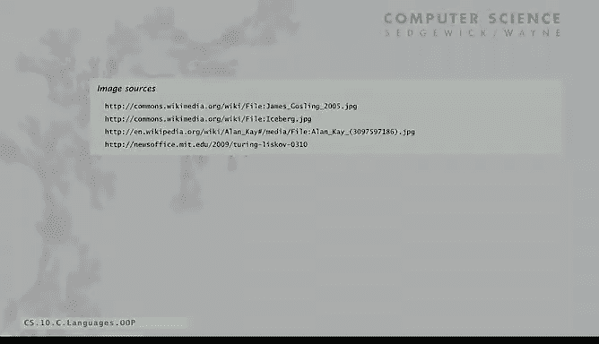
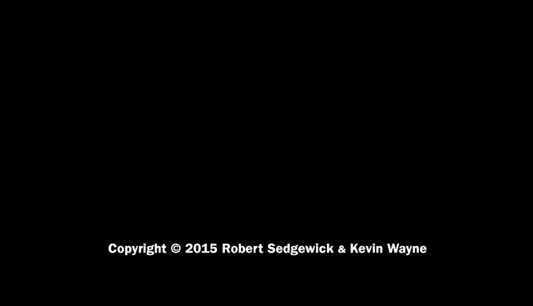

# 计算机科学：以目的为导向的编程（Java）：P41：面向对象编程 🧩

在本节课中，我们将要学习面向对象编程的核心思想、其关键特性、历史背景以及它对现代软件开发的影响。我们将探讨它如何作为一种编程范式，帮助我们更有效地模拟现实世界并构建复杂、可靠的程序。

---

## 编程范式的对比

上一节我们介绍了编程风格的概念，本节中我们来看看面向对象编程。在编程风格的语境中，讨论面向对象编程绝对有价值。

它与计算早期流行的过程式编程风格有着截然不同的哲学理念。其核心思想是：软件是对现实世界的模拟。我们了解现实世界的运作方式，并设计软件来近似地建模现实世界。这是一种表达计算的合理方式。

*   在过程式编程中，我们命令计算机“做这个”、“做那个”，这类似于动词。
*   在面向对象编程中，我们拥有数据类型，我们识别事物。世界中的事物拥有属性（知道些什么），并且能执行操作（做些什么）。这就是面向对象编程的全部内容。

---

## 面向对象编程的核心问题

对于任何编程风格，其核心问题都是：是否易于编写程序？是否易于发现错误和维护？是否正确和高效？

需要大量经验才能真正根据这些目标来评估一种编程风格。可以说，在过去的几十年里，面向对象编程因其对这些问题给出了良好答案而兴起。

以下是面向对象编程的一些关键特性：

*   **封装**：它真正实现了封装。我们可以隐藏所编写代码的细节，使程序更健壮。我们编写的模块能准确表达需要完成的计算，并且可以被广泛复用。
*   **自动类型检查**：它使得广泛的自动类型检查成为可能，从而避免和发现程序中的错误。对象的行为被严格定义，其中很多都可以被自动检查。这是一个重要的特性。
*   **代码复用**：特别是封装，意味着我们可以构建庞大的库并复用代码。我们之前讨论过这一点。
*   **数据不可变性**：对于不变的数据，我们可以真正使事物保持稳定。这一点我们之前没有过多强调，但在此作为一个要点提及。

---

## 争议与现状

现在我想指出，围绕面向对象编程存在许多深刻、困难且有争议的问题。如果你想深入了解支持与反对它的各种论点及其不同含义，这当然值得，但请注意，你可能会发现更多问题而非答案。人们仍在争论这些话题，我们将在下一节看到一个很好的例子。

它是否使编写和维护正确高效的程序变得容易？由于你尚未用其他风格进行太多编程，但通过我们所讨论的封装式模块化程序方法，我们希望它确实能帮助你构建正确高效的大型程序。专家们对此肯定仍在持续辩论。

尽管如此，Java编程依然广泛存在，Java生态非常庞大。因此，我们无疑正在从这种方法中获益，其成就远超如果我们仅使用纯粹的过程式程序（如果C++和Java没有出现的话）。C++和Java无疑是主流的编程语言，它们都拥抱了面向对象编程。

---

## 历史背景

有一点历史背景：实际上，面向对象编程自20世纪60年代就已存在。事实上，**Ole-Johan Dahl**和**Kristen Nygaard**因真正发明了面向对象编程而获得了图灵奖。他们是为了模拟而发明的，开发了一种名为**Simula**的编程语言，旨在模拟现实世界中发生的事情。他们的对象确实是为了工程和科学目的，试图模拟现实世界中的对象及其在时间和空间中的作用。他们还研究了关于面向对象程序的形式化推理思想，这为今天非常有用的自动错误检查奠定了基础。

然后在20世纪70年代，在施乐帕洛阿尔托研究中心，**Alan Kay**开发了一种名为**Smalltalk**的编程语言，真正推动了面向对象编程的广泛应用。我们稍后会谈到Alan，他是一位很有远见的人。

大约在同一时期（20世纪70年代），**Barbara Liskov**开发了**CLU**编程语言。这是一项惊人的贡献，真正开创了我们本课程所强调的**数据抽象**焦点，它是Java、C++等许多语言的基础。所以，这不是凭空出现的东西，而是真正的研究贡献，来自真正有创造力、有才华且勤奋的人们。

---

## 远见者：Alan Kay

我想特别提一下Alan Kay，因为我认为任何学生都应该了解这样的人物。在20世纪70年代，一台典型的计算机会占据整个房间，顺便说一句，这台计算机的能力远不及你现在的移动设备。

但那时，在施乐帕洛阿尔托研究中心，第一台个人电脑正在开发中，这本身就是一个了不起的故事。那个东西大约有如今大学生宿舍里放啤酒的小冰箱那么大。

然而在同一时间，Alan Kay正在研究一个叫做**Dynabook**的东西。他的想法是，每个人都应该能够携带一个像笔记本一样的小东西，上面有键盘，可以完成他们需要的所有计算。而Dynabook的关键特性就是面向对象编程软件——Smalltalk。也就是说，Dynabook的所有软件都是用Smalltalk构建的。

人们当时在Alto电脑上编写Smalltalk代码，但这些代码实际上是为下一代设备——Dynabook准备的。那是在20世纪70年代，当时主要的大学和公司还在使用占据整个房间的大型机。所以，这是一位远见者，他说我们将从满屋子的计算机发展到……当然，这就是我们现在拥有的。现代笔记本电脑或移动设备与Alan Kay在40或50年前设想的Dynabook没有太大区别。顺便说一句，你笔记本电脑或移动设备上的软件就是面向对象编程软件。

以下是Alan Kay的两句名言，我非常喜欢：
*   在20世纪70年代，他说：“**预测未来最好的方式就是去发明它。**”他无疑就是做到了这一点的人。
*   然后在世纪之交前夕，他说：“**计算机革命还没有发生。**”我认为当时大多数人都认为计算机革命已经基本结束了，因为每个人都有一台电脑。

我认为这些话在今天仍然适用。我们甚至还没有开始看到计算对世界的影响，而人们现在正在学习编程，这意味着你将在这个过程中扮演角色。所以，当你面对下一个计算任务时，想想像Alan Kay这样的人。

---

## 总结

本节课中我们一起学习了面向对象编程的核心思想。我们了解了它是一种通过模拟现实世界中的“对象”（具有属性和行为）来组织代码的范式。我们探讨了其**封装**、**代码复用**和**自动类型检查**等关键优势，也认识到围绕它存在的一些争议。通过回顾其历史，我们看到了从Simula、Smalltalk到现代Java/C++的发展脉络，以及像Alan Kay这样的远见者如何塑造了今天的计算世界。面向对象编程是现代软件开发的基石，理解它对于构建复杂、可靠的系统至关重要。