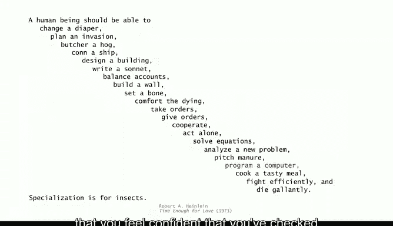
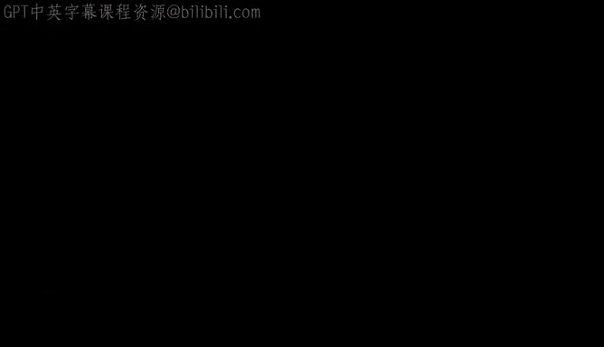

# 043：函数式编程 🧮


在本节课中，我们将要学习一种全新的编程风格——函数式编程。我们将探讨其核心概念、优势，并通过简单的例子来理解它与我们之前学习的命令式编程有何不同。

## 概述

函数式编程是一种将计算视为函数求值的编程风格。它与我们目前讨论的编程方式完全不同。在函数式编程中，函数是“一等公民”，可以作为参数传递、作为返回值，或者被存储为数据。这种风格避免了副作用，使得程序更易于推理其正确性，并且支持并发计算。

## 函数式编程的核心概念

上一节我们介绍了函数式编程的基本思想，本节中我们来看看它的具体特点和优势。

函数式编程的核心在于将函数视为基本构建块。其最纯粹的形式完全避免了编程中的副作用，这使得推理程序的正确性变得更加容易。它采用了一种“按需执行”的模型，重点在于**我想要计算什么**，而不是**我将如何计算**。

函数式编程的主要优势，也是我们现在可以在 Java 8 及更高版本中利用的，是函数成为了“一等公民”。这意味着：
*   函数可以作为其他函数的**参数**或**返回值**。
*   函数可以像数据一样被**存储**。

这开启了一个全新的编程世界。我们经常可以看到，与其它编程风格相比，函数式编程能写出更紧凑的代码。同时，使用函数式风格推理代码的正确性也更为容易。

另一个重要方面是它对**并发**的支持，即在多个处理器上编程。在现代，人们编写的程序需要在大量处理器上运行。函数式风格并不详细规定如何一步步执行计算，而只是**指定计算是什么**。这种结构足够简单，使得系统能够自行决定如何将计算分配到不同的处理器上。

## 函数作为参数的例子

以下是函数作为参数或返回值的一些熟悉例子。

当我们研究牛顿法时，我们希望找到一个函数值为零的点，并利用该函数的导数。这个计算最好用函数式程序来表达。你希望有一个函数来寻找根（牛顿法），你需要将一个函数作为参数传入，然后牛顿法所做的就是求值这个函数来得到答案。

又例如排序（我们将在课程第二部分详细学习），你需要传入一个函数作为参数，这个函数定义了如何比较两个待排序的元素。

## 简单的函数式编程示例

让我们看一些简单的函数式编程示例来入门。

这是一个打印平方数表的 Python 程序。显然，它可以扩展到任何类型的函数。

在 Python 中，我们这样定义一个计算参数平方的函数：
```python
def square(x):
    return x * x
```
这就是一个完整的平方函数定义。

现在，我们可以编写另一个函数，它接受一个函数和一个序列作为参数：
```python
def print_table(f, sequence):
    for x in sequence:
        print(x, f(x))
```
这个函数接受一个函数作为参数，并在其 for 循环的索引变量上求值该函数。它是一个为给定范围内的每个值打印函数值表的函数。

如果我们用第一个参数 `square` 函数和第二个参数 `range(10)`（即序列 0 到 9）调用这个函数，就会得到一个平方数表。我们可以使用同一个 `print_table` 函数，定义 `cube` 或任何其他函数。我们可以在那个函数中用任何表达式替换 `x * x`。这是对该计算的一种非常紧凑的表达。

这是一个展示函数式编程实用性的简单例子。

## 强大的高阶函数操作

现在，我们可以看看更强大的操作，即操作函数的函数。以下是两个非常重要且广泛使用的基本操作。

第一个是 **map** 操作。它接受一个函数和一个列表作为参数。`map(f, sequence)` 的结果是将序列中的每个 `x` 替换为 `f(x)`。

这是一个 map 的图示。假设我们有 `square` 函数和另一个 `odd` 函数（返回 `2*x + 1`）。如果我们打印 `map(odd, range(10))` 和 `map(square, range(10))`，我们将分别得到奇数和平方数。

map 函数可以看作是 for 循环的一种紧凑表达。

但是，如果我们将它与 **reduce** 操作结合使用，功能会更强大。reduce 也接受一个函数和一个参数列表。在其经典形式中，它的作用是：如果你传入一个函数 `f` 和一个列表，它将返回 `f(列表的第一个元素, reduce(f, 列表的其余部分))`。这里的 `car` 是列表第一个元素的缩写，`cdr` 是列表中除第一个元素外所有元素的缩写，这个术语来自 McCarthy 在 50 年代提出的 Lisp 语言。

通过一个例子更容易理解。假设我们有函数 `plus` 和 `odd`。如果我们计算 `reduce(plus, map(odd, range(10)))`，结果会打印出 100。这是如何得到的呢？它相当于将列表中的所有数字相加。前 N 个奇数的和是 N 的平方，正如我们在早期课程中学到的。

这就是 map 和 reduce 的组合。同样，代码极其紧凑，它是一种表达**计算是什么**，而不是**如何做计算**的方式。你可以想象，对于一个巨大的范围，系统有可能找出如何将计算分解到多个并行处理器上。这就是为什么这类函数式编程在现代系统中被广泛使用。

## 学习函数式编程的理由

让我们回到学习编程语言的理由上来。函数式编程无疑提供了新的东西。

*   **提供新东西**：如果你不了解函数式编程，它绝对能为你提供新的视角和工具。
*   **与同事协作**：如今在华尔街等地，也有函数式编程的工作岗位。
*   **比 Java 更适合手头的应用**：在并行性很重要、需要紧凑表达计算或需要证明程序正确性的场景下，函数式编程确实更胜一筹。
*   **智力挑战**：从这个角度出发开发计算和程序，尤其是函数式编程，本身就是一种智力挑战。事实上，麻省理工学院多年的 CS 导论课程都是用 Scheme（一种纯函数式语言）教授的。
*   **学习计算相关知识的机会**：它绝对引入了一种新的编程风格，并让你对计算有更深的了解。

函数式编程有许多现代应用，例如谷歌的 MapReduce 处理器，就是一个基于函数式编程思想构建的大规模计算引擎。

不仅如此，它与理论计算机科学有着深刻而直接的联系（我们将在课程第二部分稍作讨论）。和许多其他事物一样，不同类型的编程风格和环境吸引着不同类型的人。一旦你深入函数式编程，你可能会发现它如此有趣，以至于深陷其中。

## 总结与展望

本节课中我们一起学习了函数式编程的基本概念、优势以及简单示例。我们了解到，函数作为一等公民、避免副作用以及强调“做什么”而非“怎么做”是其核心特点。这种风格使得代码更紧凑、更易于推理，并天然支持并发。

现在，让我们回到“巴别塔”的比喻：文化差异和多种语言的繁衍是文明的基础。这个比喻相当贴切。如果我们只有一种能做任何想象的编程语言，我们会更好吗？语言的繁衍，难道不正是编程文明的基础吗？这不是一个新想法。事实上，Gene Sammon 在 1969 年的书中就提到了这个观点，当时封面上已经列出了 120 种语言。如今定义的语言数量，肯定有成千上万种。毫无疑问，学习更多语言是学习更多计算知识的基础。



这就是我们课程的第一部分。我们希望通过这门课程，你能自信地勾选“为计算机编程”这一项技能。



我们期待在第二部分与你相见，在那里我们将学习更多关于计算的意义，并回答诸如“我的程序如何在计算机上工作？”以及“我能用计算机解决哪些类型的问题？”等问题。