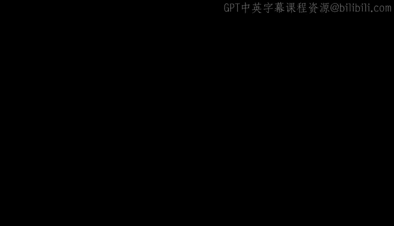
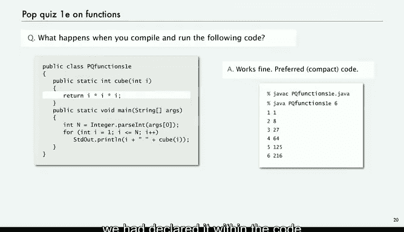
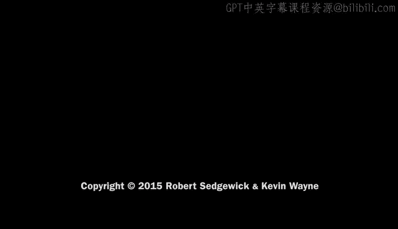

# 普林斯顿大学《计算机科学：以目的为导向的编程（Java）｜Computer Science： Programming with a Purpose》中英字幕 - P17：17_05_02_基本概念_2.zh_en - GPT中英字幕课程资源 - BV1Jp421R78R

Today's topic is a very important one as we address more sophisticated applications。

 our programs get bigger and bigger and the problem of organizing the program so that we can maintain it easily and add new code is a very important one。

 The topic of functions in libraries is the mechanism that we use to help us maintain and organize our programs。

Let's look at some basic concepts。This is our basic building blocks for programming that we talked about and we're quite near the top now。

 what we want to talk about today is ways to reuse codes by developing it as independent modules so that we can build big programs from small pieces。

The idea is called modular programming， and it's been around for a long time。

 what we want to do is organize programs at independent modules that still do a job together。

And the reason that we want to do that is that it's easier to share and reuse code and to build bigger programs。

People build huge programs with modular programming， where teams work together。

 and what we need is tools to make the pieces fit well together。

Now this has been an idea that's been around for a long time and it's really kind of a holy grail in software development there's a lot of difficulties and ideas can conflict and really get highly technical in the real world so we have to navigate that as beginning programmers。

For now， for this lecture we're going to start with a very simple definition。

 we're going to talk about libraries and a library is nothing more than a set of functions for the purposes of this lecture。

Actually， there's quite a bit more to it that we'll learn about in a few lectures and a dot Java file can be a set of functions。

 but it can be more， so for now we're going to just talk of them as doing the same thing because we want to talk about modular programming。

Java files that contain sets of functions later on， we'll look at how modules implement data types。

 which is a more general concept that even better supports modular programming。

So we're talking about Java functions are also known as static methods。

 and so that's like a mathematical function， it takes some input arguments。

 it returns an output value， and it might cause some side effects。It's like a mathematical function。

 but it's more general because of the side effects。

And so you're familiar with the use of mathematical functions to calculate formulas in what programmers do is use functions to build modular programs。

 you're going to use them for both and we'll have examples like that in this lecture。

So we've already seen plenty of examples so far。 we've been using MA that random and Ma thatt abs and sine cosine tangent so forth and integer up parson of all those sorts of functions that are built in to Java。

We've also been using our IO libraries。Which are sets of。sStatic methods， libraries。

 a set of functions， and that's what RIO libraries are。

 and all those methods that we talked about for standard input output draw are examples of sets of functions in Java libraries。

And let alone you've been defining a function called Maine。

 and we'll get into the details of that in just a second。

So let's look at the anatomy of a function or Java。 it's called a static method。

 So this is the square root function that we implemented in the early lecture。

 So it's got a name S QR 2。It's got arguments， every argument needs a type and a name。

 and those come in parentheses after the function name。

 it's got a return value that the value the function produces， and that has to have a type。

So in this case， it returns a value of type double。All of that together。

 put public static in front of it， is called the Me signature。

Tells you what you need to know in order to use it or to call it。And then there's code。

 there's Java code， which is the body of the method， this is the body of square root。

 and we looked at implementing that code when we first talked about while loops using Newton's method。

The last thing in the code usually is a return statement。

 and it's just the word return followed by a value of the return type。

So that's all the pieces of a method， and now we'll take a look at how it works。But first。

 let's put it together into a dot Java file， library is a set of functions。

 dot Java file is a library， so this is a mod a library named Newton。 Java。

 so it's got the same name， the file name is same as the class name。So that's Newton in this case。

 and then this library consists of two functions， the square root method， and the main method。

 and we'll look at how those interact。In just a second。

Now we're just using this square root from lecture2 just to illustrate the basics。

 you can use math that square root， but right now don't worry about the technical details we're going to be talking about the flow of control and it'll come back to you as we go through it。

Our key point for this lecture is that functions provide a brand new way to control the flow of execution。

When you look in detail， it seems a little complicated。

 but the use is very natural if you compare it to mathematical functions again。

 the idea is we want to be able to reason about what our program is doing and encapsulating small pieces of the computation and functions is going to help us do that。

So in order to really understand what's going on， we have to talk about the concept of scope。

The scope of a variable is the code that can refer to that variable by name。

 and when we have sets of functions， you can't refer to every variable anywhere。

 such a variable would be called a global variable and we don't use those。In a Java library。

 a variable scope is the code following its declaration in the same block。So for example。

 the argument variables C and EPS in this function square root。

 their scope is all the code inside that function， the code following its declaration。

 which is in this case is in the signature in the same block。T， its scope。

 is only the statements following it， can't refer to T in that code before it's declared。

And you can't refer to any of those variables in this code down here， it's in a different block。

It's got to be in the same block and it's got to be after it so here we've got an array A declared in mainine and we've got some energyteger variables I。

 you can't refer to those in square root， they're out of scope they're in a different block。

And we have two eyes's， they're actually different variables， each one is for its own for loop。

 but they' are actually different variables named I。So each variable。

 what we want to try to do is limit the scope as much as possible so that we can understand what the program' is doing。

If you could refer to a variable in code way away in another different block。

 it's very difficult to understand what's happening with the code in that block。

 so we try to keep the scope low as much as we possibly can， small blocks of code。

And functions help us do that。So let's look at the flow of control for a function call。

This is the Newton program with the two methods and the point of this main program is to read in a bunch of arguments。

 and then for each argument it goes through and computes the square root and then prints it out。

So the idea is when you call square root in the main program。

 it transfers control to the function code。It declares the argument variables。

 initializes them with the values that you gave， then executes all the function code。

Then when the function is done， it returns right back to the calling code。

 the statement right after the call with the return value assigned in place of the function name in the calling code。

 so supposed to compute the square root and then assign the value to x。

We'll look at this in much more detail in the next slide， but this is the basic overview。

 this is called pass by value， other languages and systems use other methods。

 but this is the one that we use in Java。Now， one thing。

 all the programs that we've written so far they somehow run， how do they run。

 the operating system calls Maine when we invoke our program with the Java command。

 so Ma is a function that's called by the operating system and it arguments。

 the command line arguments are supplied with precisely the same mechanism as the values of C and EPS are provided to square root。

Okay， so let's do a trace of the flow of control for this function。

 So suppose we call this with the command line arguments，1，2， and 3。

So this code here picks off those command line arguments and puts them in an array， array of doubles。

 so I goes from0，1 and  two and picks off those three command line arguments and puts them in an array。

Now we go into the second for loop， which is going to go through and compute and print out the square root of each one of those numbers。

 So now we start with I equals 0。 That's a different I。 remember， not really consequential。

 A of I is 1。0。And so now we're supposed to compute the square root of 1。

0 and assign that to x in order to do that we go up into the square root code where now D gets that value 1。

0 now t gets that value C， and then in this case there's nothing to do so we just drop out of that while loop and return the value 1。

0。And what happens there is then x gets assigned that value。

Now we go to this next statement and print that out。

 and so that's the first result that's printed out and we go back to the for loop， increment I。

 pick out the value 2。0 and then go back up to the square root code。And now in the square root code。

 we can trace the operation of that code to compute the square root of 2。

 it keeps computing averaging C over T and T as we talked about in lecture 2。

 and eventually it gets to a point where it breaks out of the while loop。

 it's got a good approximation to the square root of 2， returns that value back to the main。

That value now gets assigned to x， and then that's the value that's printed out as the second value。

Back to the four loop for I equals 3， i equals2， we get the next number a of I equals 3 and then call square root of 3。

 and again we stay in the loop for a while， to compute the square root of 3 and eventually break out of the y loop。

 we have a value to return， return that value， assign it to x and then print it。

So that's a trace of the flow of control for computing the square root using a square root function。

 now we go and we're done with the array and we end the execution。

This is a much more complicated flow of control when we look at it in that detail。

 but it's very natural to understand what this code is doing we have said in the main that we want to print out the square root within that loop and pretty natural to assume that what's going to happen is it's going to execute that code to go ahead and compute the square root。

So let's just look at just a couple of details to to discuss the way arguments are passed in functions。

 so here's a really simple example that's supposed to compute the- well it says cube and it does i times i times I。

 it prints， takes a value n from the command line and it prints a table of the integers from one to n and their cubes。

 and it does so by defining a function cube that takes I as an argument computes i times I times I and assigns it to J and returns J。

So and again， you could do this for any function that you might want to implement。

 and that's an actually a fine computation to do for lots of applications。Okay， what about this one？

What happens when we compile and run this code？And you have to think about that a little bit。

 this really， these quizzz questions are really about scope。

So what happens in this one is it's not even going to compile because it's like declaring the same variable twice when we declare int I as the argument can't declare int I again。

 it'll say it's already defined。So that one won't even compile。What about this one？Again。

 I'm going think a little bit about scope Well this isn't about scope。

 this is you got to have a return statement function。

 the int says int cube says I'm going to return an int value。

 but there's no code to return anything so that won't even compile。

 it says you're missing a return statement。Compiler is your friend， even for functions。

 So what about this one。 So now we return it。So this one works。

 the I in cubed is declared and initialized as an argument， it's different from the eye in main。

But we don't like to write code that changes function arguments， even though it works。

 it's a little bit confusing in some programming environments that might not work。

 so we call that bad style， so instead it works okay， but instead we prefer this style。It'sComp code。

 We're going to。Just do our computation with that variable just as if we had declared it within the code block and it produces the answer。

So those are just a couple of examples， simple examples showing how to implement and use functions。

 We'll look at some more complicated examples next。

