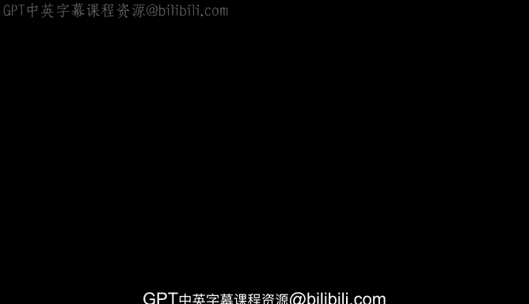
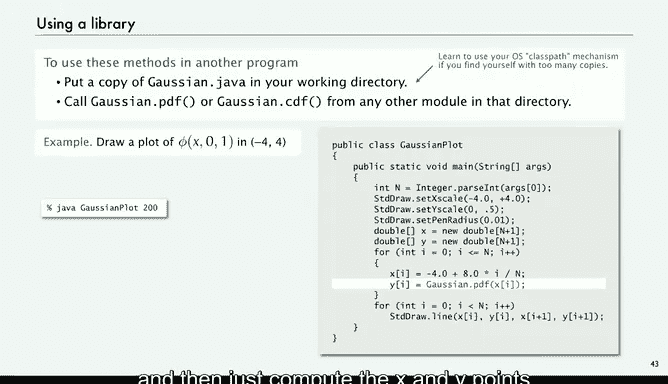
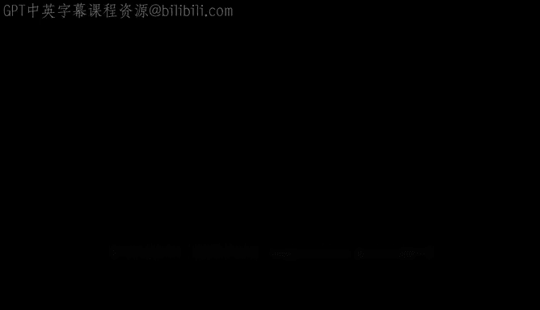

# 普林斯顿大学《计算机科学：以目的为导向的编程（Java）｜Computer Science： Programming with a Purpose》中英字幕 - P19：19_05_04_应用-高斯分布.zh_en - GPT中英字幕课程资源 - BV1Jp421R78R

Next， we're going to look at another application that illustrates the utility of being able to define our own functions。

 and that's to write programs to work with the Gaussian distribution。

You're familiar with the Gaussian distribution， it's a mathematical model。

 the so called bell curve that has been used successfully for centuries to fit experimental observations in lots of contexts。

This is the function， it's called the Gaussian probability density function and it's phi of x equals 1 over squared to 2 pi e to the minus x squared over 2。

 and this is a plot of the function， and it's centered around zero。

 that's the mean and the standard deviation measures how it spreads and that's 1。

So this is the scores of SATs in some year and it pretty well matches this experimental data if we adjust the parameters。

 we take a mean of 1019 and standard deviation from the experimental data， 209。

 then plot the Gaussian function with those parameters。

 two parameter Gaussian is 1 over sigma squared to 2 pi e to the minus x over mu squared。

 x minus mu squared over2 sigma squared， then it scales the function to match your experimental data。

 you know the mean in the sample standard deviation。

 it its experimental observations so often when writing programs that process data we want to work with the Gaussian distribution Gaussian probability density function and there's good math behind it。

 but for now。NeI that that's the formula for phi of x and with a little math to get the two argument version that's scaled。

 subtract the mean divide by sigma， apply fee and then divide by phi。

So that's all the math that you need， just a definition and a little algebra。

So Gaussian distribution arises everywhere and these are just some examples from papers pulled off the web if you're studying polystyrene particles in glycerol or laserbean propagation or optical tweezers or oxidase patches in the visual cortex Gaussian distribution arises I don't know if I believe this one predicted US oil production that doesn't sound too Gaussian to me。

 but people try to fit it anyway and German money while Gaus was German and actually have the curve on their money。

So we want to work with it， so is it there in Java math library， do I have math。 fee？

And the answer is no and so why not it's so important why isn't it there Well maybe the answer is that you could do it yourself so you can create a class Gaussian and you can define a function。

 we'll call it PDF the probability density function and all we have to do is implement that math formula1 over squared to2 pi e to the minus x squared over 2。

So that's math dot x minus x squared over2 divided by math that square root two times math that pi。

 it's as simple as that。So again， we're calling a function another module。

 we've been doing that for a while。And then if you want the three argument version。

 then we use that one appropriately now。In Java， if you have a function signature。

 two function signatures with differing number of arguments， they can have the same name。

And that's useful in this case， but all we do is use the other one and just apply it with the argument x minus be over sigma and then divide the result by sigma。

So and we'll look at some more functions in a minute。

 but I think the point is that if there's any math functions that you need。

 you can define libraries yourself that implement those functions。

In that an example of modular programming， you don't want to put this math code in every program that does the Gaussian。

 you just want the program to act as if the function is implemented。So we put this in a module。

 Gaussian dot Java， and now you can call these functions with Gaussian。 PDF and so forth。In a way。

 with libraries， any user can extend the Java system to include the functions that are appropriate for the application at hand。

 It's a very powerful idea。Now there's another Gaussian function called the a cumulative distribution function。

 so that one is if you have a particular point on the x axis。

 you might ask what percentage of the total is less than or equal to that？

And that's the same as what's the area of the curve to left of a certain point。

That's called the Gaussian cumulative distribution function， and that's useful in applications。

 and this is what it looks like。It's the whatever squared2 pi integral from minus infinitefinity to the z e minus x squared over to dx。

 so and that's useful to know it has a similar but simpler three argument version where you just have to evaluate it at x minus mu over sigma。

So that's the math for the cumulative distribution function and it's typical to apply so in our year you had to get an 820 to be a division  I athlete and you might say。

 well what fraction of test takers didn't qualify well that's the answer is given by the Gaussian CDF for that data with that average and that standard deviation in this case about 17%？

So maybe you want to write code that uses the Gaussian cumulative distribution function to be able to compute information like this。

So what do we do with that， well， there isn't a closed form for that。

 it was expressed in terms of an integral， how we're going to implement that。

And the answer is well there is a Taylor series that is very accurate and actually this is the way that most math functions are implemented on computers。

 in this case， there's math that shows that phi of z is one half， the CD is one half。

 the PDF times this series which gets the terms get smaller and smaller， pretty quickly。

So we can just write code that implements this math formula。And so if it's 8。

 if it's less than minus-8， it's so small as to be negligible and if it's bigger than8。

 it's so close to1 as the difference is negligible so we start with a compute this sum and this just implements this formula where we compute each term by multiplying by z squared and then dividing by the next odd number and that's what we do as long as we're getting anywhere if we add something and it's still the same then we can stop and then what we're supposed to return is a half plus what we computed times the PDF and it turns out that this result is accurate to 15 places。

And then again， if you want to do the three argument1。

 it's just the other one minus the mean divided by sigma。

So a pretty small amount of code and we can implement that now from a point of view of a program that's using this。

 it doesn't know how we implement it， it just wants to get compute with the answer。

And so we're able to protect that client from having to deal with all these details and it's a nice way to organize a computation to keep this knowledge in this one place and the bottom line is you have a thousand years of math formulas to work with they're not all going to be implemented for you。

 but when you need to use them you can encapsulate them yourself so that you can write programs that take use of them in a coherent way。

So that's our summary， here's a library for Gaussian distribution functions。

 we've got the PDFF both forms and the CDF both forms。

 and the best practice is to include in every library a main function that at least tests all the code might as well have it do something useful。

 so in this case it takes as argument， the mean is standard deviation from。

That you're interested in in then the cutoff point and it prints out the fee value。

 the cumulative distribution value for that。 So anybody asks you what fraction all you need to know is the three numbers and you can get the percentage。

So we actually use this code to evaluate randomness and submitted programs when they're supposed to have randomness but anyway。

 really the bottom line is that for any future program that you have。

 if you've got a number of related functions like say of this nature。

 you can build them into a module and then use them。

 that's the really important concept about libraries。

Now so how do we actually use the library well you've sort of been doing that。

 but libraries that you write yourself， if they're in the same directory。

 yourre working directory as your other program then you just have a copy of it there there's also your operating system can you can set it up so that you can work with only one copy and you can find details on the book site then if it's there。

 then you can just use those functions from any other module in that directory and we were doing that already for play that note in other examples。

So this is just so well， I really want to just draw a plot of it using standard draw。

 so this is just code just a regular main function that I want to write and I'm going to set up my drawing and。

Just go through and use that PDF function， and I'm going to sample it according to an argument taken from the command line and then just compute the X and Y points using CDF and I can make a plot so that's samples 200 of the Gaussian PDF。

That's just an example， and we'll see another example later on。

 so very easy to use a library that you've created。It's really， again， an easy way for you。

 any user to extend the Java system。

