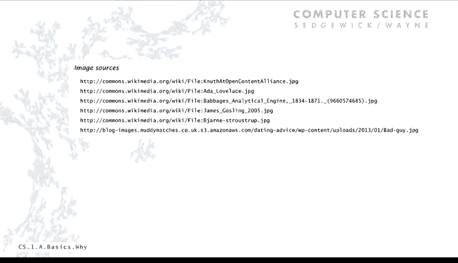
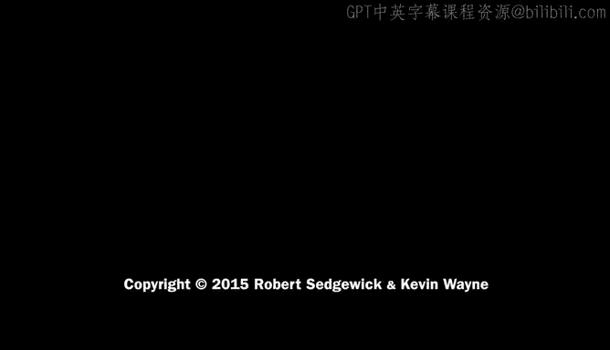

# 普林斯顿大学《计算机科学：以目的为导向的编程（Java）｜Computer Science： Programming with a Purpose》中英字幕 - P1：01_01_02_为什么学习编程.zh_en - GPT中英字幕课程资源 - BV1Jp421R78R

Today we're going to talk about what you need to know in order to get started programming。

 it's quite a bit of information， but I think you'll find that it all comes pretty naturally and also we'll talk about some historical context just to make it a little bit more interesting and engaging。

Okay， as a matter of fact， let's start with a question， why program at all？

Here's a quote from a science fiction novel where the author lists all the things that really every human being should be able to do。

 I don't know if we all agree that we need to know how to die gallantly and so forth。

 but I think the point is that everyone should know how to program a computer and that's really the point of view that we take in this course。

 so that's the first thing computers are onipresent and it's something that everybody should be able to control。

Really what you need to know how to program for is to really get the computer to do what you want it to do now an naive ideal that you might think is。

 well why not just tell the computer what you want to do like in this example here please simulate the motion of in heavenly bodies subject to Newton's laws it would be nice if we could get a computer to do that actually you're going to write a program to do this in a little while。

 but it's really naive to expect a computer to really be able to do that。

Another alternative is maybe there's a prepackd solution or an app that does。

 it's fine to have an app if it does， if it does what you want done。

 and we all have our computers and our mobile device all littered with apps of all different types。

 but there's lots of things that there's no app for what programming enables you to do is to make a computer do really anything you want well almost anything and we'll talk at the end of the course a little bit about the limitations。

And people have realized this for a long， long time on the right is one of the first computers Babbage's analytical engine。

 and one of the first programmers was actually a woman named Ada Lovelace。

 that's a quite interesting story that you might be interested in looking up。

So how do we tell a computer what to do， that's programming？The thing is it's not just for exports。

 it's a natural， satisfying and creative experience just like writing a sonnet or a paragraph。

 it's actually easier， but the thing about programming is it enables accomplishments that wouldn't be otherwise possible and we're going to see lots of examples to that。

And not only that， it's just a whole new intellectual endeavor that's stimulating just by itself。

 even if there wasn't actually accomplishing anything。

Now there's some challenges in order to get started。

 and that's what we're going to be talking about at the beginning of the course。

 you need to learn what computers can do。You need to learn a programming language。

 which is a way of communicating with the computer。

It's not so easy sometimes to tell a computer what to do。

 and we often find ourselves in this kind of situation。

 but I think a more positive way to look at it is quote from Don Canoe， a leading computer scientist。

Instead of imagining that our main task is to instruct a computer what to do。

 what we should do is concentrate on explaining to a human what we want a computer to do。

 I think he's talking about really what an ideal programming language would be like。

 but let's look at it in a little more detail。Now there are plenty of different ways to tell a computer what to do when you use an app。

 you're kind of telling a computer what to do at the lowest level。

 which we examine later on in part two of the course， there's machine language。

 which is the computer's language， It's very easy for the computer。

 but it's pretty detailed and very error prone for a human to do it。

 and this is the kind of code that illustrates machine languages is to add two numbers and we'll have a lecture on that in the second part of the course。

There's natural language， as I mentioned， that's easy for the human。

 but that's pretty error prone for the computer and there's plenty of great examples of that。

 just getting the computer to understand what you're saying， kids make nutritious snacks。

 red tape holds up new bridge。Police squad helps dog bite victim。

 local high school dropouts cut in half。 These are actual newspaper headlines。

 And you can imagine the challenges felt by researchers trying to get the computer to understand natural language like this。

 So instead， what we use is something in between called a high levell programming language。

 It's kind of a compromise。 It's the same sort of difficulty for both the computer and the human。

 And the last several decades have shown it's an acceptable tradeoff to for to get us to be able to tell computers what to do。

 and this is a Java program that similar to those that we're going to be writing in this course。Now。

 but which high level language actually there's a long。

 long list there's hundreds and hundreds of high level languages that have been developed。

 and one of our big choices in developing this course is choosing an appropriate one。And so again。

 there's a naive ideal that there's a single programming language that works for all purposes。

 that's just not something that can be realized and for the same kinds of reasons that there's no single natural language for us all to communicate with。

And we'll talk about that later again， in the course。

So our choice is the Java programming language developed by James Gosling a couple of decades ago。

 The reason we。Cose Java is that it's widely used。 It's widely available。

 and it's been continuously under development for going on 25，30 years。 Now。

 It embraces a full set of modern programming abstractions that now people understand and know are useful。

 It's got a lot of help， automatic checks to help us make sure that our programs are correct。

And there's a huge economy built around Java， it's very， very widely deployed it's in the Mars Rover。

 it's in cell phones dis， web servers， medical devices。

 supercomputers there's millions of developers of Java programs and billions of devices that run Java。

 so you're not going to go far without finding that your Java knowledge is useful so that's the reason that we chose Java。

Now there's facts of life and no language is perfect and there's things about Java that each one of us could think about improving。

 this is a famous quote by Yrn Strausstrip who's a developer of another programming language C++。

 he saysThere's only two kinds of programming languages。

 those that people always gripe about in those that nobody uses。

So there's going to be problems with Java or not saying that。

 but you do have to start with some specific language in Java as our choice。Now。

 our approach is to use a minimal subset of Java that really many。

 many of the constructs that we use are found in other languages and if you do move or use another language in the future。

 you'll find that a lot of our code is still useful。

Really what we're trying to do is develop general programming skills that are applicable to many。

 many different languages， it's not about the language once you've taken a course like this and learned one general purposepo programming language well。

 you'll find that it's not difficult to move to another one。

 so long as the course doesn't spend its time obsessing about detailed properties of the language and we're definitely not going to do that。

So let's just take a look at the vocabulary。 sometimes people compare learning a programming language to learning a natural language。

 but it's actually much， much easier， that's what this slide is supposed to say there's only a few different types of things we're going to talk about all of these things later in today's lecture and then a few more in the next couple of lectures but this is pretty much all the words that you're going to use in your Java programs almost all the programs you write are going to be made up of symbols like this plus variable names that we create ourselves。

 So the language vocabulary itself is quite limited and you'll find not difficult to learn all these things and then these things are the tools that you need to write a very。

 very broad class of programs。Your programs are going to be these plus some identifiers that you make up and that's it。

So here's your first program。 It's called Hello World。

 Everybody writesHello World as their first program since at least the 70s。So for Java。

 this program is just going to be typed into a text file。

 you could type it in an email use an editor and we'll talk about that mechanics in just a minute。

 it's just text and it's got this specific text in it。

 the most annoying thing about Java from this perspective is the braces but theyre necessary that's kind of how you can tell it's a program and not an email message。

The thing hello world is the program name in Java， that program name is the same as the file name that appears right before the dot Java。

And then there's a thing called a mean method and all our programs have mean methods and we'll talk about exactly what that is。

 and then this program has the body of the main method is a single Java statement that says。

 in this case， print this line of text out。We go through those elements because every program that you write or at least the next several are going to have these same elements。

You're going to have a program that you make up myprogram。 Javava。

 you'll name it my program or whatever else you want to name it。

 and it's going to have a main method and you just type that exact text to get a main method and then there's going to be a sequence of statements and we'll talk about what statements are in what they do。

But all of this later later in the course we'll learn about what all these things actually mean right now you say just make sure that you get exactly those characters and they say to you。

 this is my program and that's all。Okay， so。Let's do just a quick quiz question on this thing。

 your first program。You've all run from our first assignments， you've run this program。

 hellelloorld do Javava and it printed out hellello worldorld。

 what happens if you type in your program and you get this error message that says main method not public。

Well。Or this other one that says invalid method declaration return type required well in these cases。

 well the first ones pretty clear it must have forgotten the word public and that's all it's telling you what to do so you put in the word public。

So other one's a little more complicated。 We go back to hellello World Java to see what it says and match against it。

 oh， we forgot to put the word void， not sure what that means， but need the word void。

So you'll get a few error messages like this at the beginning。

 and then you realize that really you need to type in the exact text that we give in the template。嗯。

Here's another thing about Hello World， here's three different versions of Hello World。

 this is the way that I just showed it on the slide。

 this is the way that on the right way that Kevin wrote it for our online materials on the book site。

 and then there's another way that you could write it。

And the thing about these different versions is that the color and the actual font。

 the comments all the extra space， they're not part of the Java language we use those to as a matter of style depending on the context。

 they're all the same program as far as Java goes and I'll talk a little bit more about that in a minute。

呃。thinghing is that depends on the context， different styles are going to be appropriate for programs the same way is true for a novel or a magazine article or whatever else。

 we're going to talk about building a program in an integrated development environment and as I just mentioned we have programs published on our website called the book site。

 there's programs in the book， there's programs that I'm showing you on the slides。

 there's your own code， those are all different context and so you can and sometimes people do insist on a very consistent style on Program。

And while， if we really wanted to completely enforce a style and say your program must look like our bookite programs。

 it kind of stifles creativity a little bit， but I think the more important thing is that people get confused about the difference between the style and the language doesn't matter how many spaces you indent your statements or whether you put the braces on the same line or not。

And those are not part of the language。 Those are the style。

 and enforcing a style gets people confused。On the other hand。

 we do like to usually emphasize consistent style if you use the same style all the time it makes it a little easier to spot errors in your programs the main thing is it makes it easier for other people to read and use the code so usually in a group of programmers or in a class people agree on using some kind of consistent style so that they don't get confused by differences in style。

 but it's not so different than writing essays in a class and so forth。

 often a teacher will insist on certain style to make it easier to grade sometimes the development environment insist on a style to give you visual cues to make it easier to write your program that's another reason。

So usually for a student， what we say is what you want to do is to listen to the person that's assigning your grade。

 or if you're at work， maybe your boss， there's somebody that wants a style。

 then you pay attention to that style， otherwise my advice is to at least put a little creativity into it and put your own stamp on your programming style。

