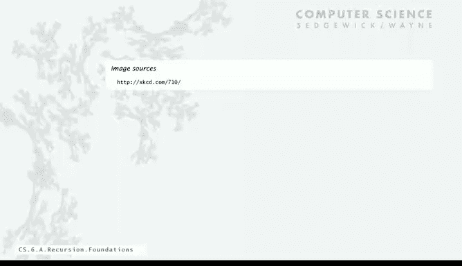
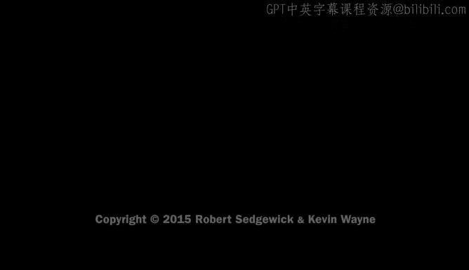

# 普林斯顿大学《计算机科学：以目的为导向的编程（Java）｜Computer Science： Programming with a Purpose》中英字幕 - P21：21_06_02_基础原理.zh_en - GPT中英字幕课程资源 - BV1Jp421R78R

Today we're going to talk about recursion when a function calls itself。

It's a little bit mind bending to think about it first。

 but it's actually a powerful and useful programming technique。

Let's begin by talking about some mathematical foundations of recursion。So first of all。

 just what is recursion， Well， as I mentioned， it's when something is specified in terms of itself。

Here's an example of a recursive image。So why should we learn recursion Well。

 it represents a new way of thinking that's really fundamental in computer science。

 but not only that， as I mentioned， it provides a powerful programming paradigm it helps us reason about computation about the correctness of our programs。

 and it really gives some really deep insights into the nature of computation and you'll see some examples of that in today's lecture。

There's a lot of computational artifacts that are just naturally self referential。

 This is an example of a tree where a tree is defined in terms of a node and it's got subtes which are also trees。

So you're used to using a file system where you have folders and the folders contain folders。

 the concept of a folder refers to itself， we'll see fractal graphical patterns and we've seen some of those before。

 and then there's so- calledled divide and conquer algorithms where we solve problems by breaking them into smaller parts and using recursion。

So just as a simple starting example， we're going to look at a recursive program to convert an integer to binary。

So the idea behind a recursive program is， so you want to function of a positive integer N。

And we have two components。 So the first is what's called the base case where we just， if n is small。

 we just return a value。And the second one' is called the reduction step。

 if we assume that the function works for smaller values of its argument。

 figure out a way to use the function to compute the return value for n argument that we have。

And here's an example of this integer binary conversion program。

 So this is going to be a static method of function that returns a string and takes an integer N as argument。

So if I we'll assume that that's a positive in bigger or equal to one。So if n equals one。

 then we just return the string 1。 So that's the base case。Otherwise。

 the way we can solve this problem is to use the function to convert string the integer in over 2 to a string。

And then add on to that the last bit now this automatically gets converted to a string because that plus is a concatenation operator between two strings in Java。

 so we convert the n over 2 to a string and then we append the last bit。And that's it。

 that's the whole program。 So if we take a main that takes an integer from the command line and then call convert n。

 that's our function and very simple function for converting an integer from decimal that we type into binary or whatever internal representation。

The computer wants to use。 So that's our example。 And we'll look at this one in more detail。

 in just a second。So one of the interesting things about this is just convincing ourselves that the method is correct。

AndThat's really what recursion buys us is a reasonable way to convince ourselves that the method is correct。

And the technique that we use is called mathematical induction。

 and that's the kind of technique for mathematical proofs that parallels recursion。

 so let's look in more detail。You learned a mathematical induction somewhere in school。

 and will quickly review it。 So to prove a statement involving an integer N， first。

 you prove a base case， you prove it for some specific values of n。

 and then the induction step is to assume that it's all true for all integers less than N and use that fact to prove it for N。

So here's a simple example， some of the first odd integers is n squared。

So that's true for n equals 1， and one equals 1。So now we assume that we'll do the induction step。

 the n odd integer is 2 n minus1。 so we're going to let that sum of the first n integers be this variable piece of n。

1 plus 3 plus 5， the first n odd integers。So we're going to assume that T sub n minus1 equals n minus1 squared。

And if we do that， and then we add to n -1， then it's just a little simple algebra prove that it's n squared。

 That's mathematical induction to show that the sum of first node integers is n squared。

 Now Here's an alternate graphic proof。 if you still don't believe it。 But really， the point is。

 is you for you to check this idea of proving a statement by induction。 prove it for the base case。

 And then in the induction step， assume it's true for small n。 and then use that to prove it for n。

So that's how we can prove a recursive program， correct。 So that's what we laid out for recursion。

 And this is what we laid out for induction there entirely parallel intentionally。

So if we have a recursive program like our program that's supposed to convert an integer n to binary string that represents it。

 we can do the correctness proof by induction so we want to prove that convert computes the binary representation of n to do that。

 it works for n equals1 returns the string1 and then the induction step is if you add if n is even and you add is0 to the end of it n is2 n over2 so that's going to work。

 that works for n over two it's going to work for n and if it's odd you add a1 and again if it works for n over  two。

 it's going to work for n that's a proof that this program works now we're not going to always do formal induction proofs。

 but we will informally think about convincing ourselves that recursive programs work in this way。

Now what actually happens when we make a recursive call that's also we're thinking about now we're not going to go into this in detail。

 but still the idea is that in modern programming systems any function call involves certain mechanics。

And in a sense， because those mechanics exist， we really get recursion for free。

 So let's look at that in a little more detail。So anytime a function is called。

 the system has to save the values of all variables and where the call came from somewhere。

 and that's what we assume to happen when a function gets called when we get back from the function。

 everything should be the same。Then it has to initialize the values of the argument variables。

 transfer control to the function， and then when the function is done。

 it has to restore all that environment and assign the return value where the function call was and then transfer control back to the calling code。

And because systems do these operations for any function call。

 doesn't matter if the function calls itself。 So let's look at what happens with convert。

Well call it with 26。 So calling convert with an argument of 26 results in a calling itself with an argument of 13。

So that's a call for 13， it has to when 13 remembers it has to remember to substitute the string that it gets for that call of 13 and then append to0。

 and that's the way that the function call mechanism works doesn't really matter at each level that the function is calling itself。

So 6，13 calls 6，6 calls 3， three calls one。And then one finally returns the one。

 and what's that mean， that means where the call convert one came， we put the value1。

So now we're going to return one plus1， so that's the binary representation of three。

 which is just11， and that's what we put for convert3。And so six， we concatenate those two strings。

 replace the call to convert six with that， and we get the binary representation of6 there。

 and then we append to 1 and that's the binary representation of 13 and then finally put that together to get the binary representation of 26。

 which gets printed out。We get recursion for free in modern systems。Now。

 if there's plenty of possible bugs with recursion that it's worthwhile to point out right at the beginning。

Debugging recursive programs can be a bit of a challenge there really are loops。

 and we'll talk about that some more。So one bad thing to do would be to not have a base case。

So a bad of n calls bad of n minus1 and what's going to happen here is that it's just going to keep calling itself。

 we'll talk about that what happens just a second or a similar thing is if you don't if maybe you have a base case。

 but you didn't really check your program fully to make sure that it has a convergence guarantee。

So in this case， if you call this function with n equals 2。

 then it's going to call itself with n equals 2 again and get in the loop calling itself again。

 This happens with induction2， but with recursion， the computers checking what we do。

Both of these cases lead to infinite recursive loops and that's bad things。

 bad news and in old systems it would really create havoc and it would be difficult to stop the computer from dealing with this and so you have to check it on your system just like when we looked with what happens when you have an infinite loop in a four or a while you get infinite loop with situations like this and you better know how to stop it and nowadays you don't have to pull the plug maybe a control C will do the job for you。

And we make that requirement that we have to have a convergence guarantee just so we can convince ourselves that it stops。

 It's not so clear always。 what goes on， This is a classic example called the Col sequence。

And this is a very simply defined integer sequence。 It's a function of n if n is one， stop。

 if n is even divide by 2， if n is odd， multiply by3 and add one。

And that's what the sequence looks like。So one thing about this is that it's not always getting smaller。

 if you multiply by3 and add one， it's definitely not getting smaller。

Now you could write a recursive program for printing out the colot sequence n equals1 you've done if it's even。

 you call it for N over  two， and otherwise you call it for 3 n plus one。So。

It's a fine recursive program。 The question is， can we convince ourselves whether it stops or not to it for seven。

 and you get that sequence。And the amazing fact is that actually nobody knows whether this function terminates for all values of N a lot of people have spent a lot of time mathematicians trying to understand whether or not this thing always terminates。

 so simple program with recursion can lead to a behavior that nobody even knows what it is。

Usually what we do is ensure termination by only calling for small N。

 and we're certainly going to do that for all the recursive programs that we write in this course。

That's the Internet cartoon related to the Colettetz conjecture。So。

Eventually your friends will stop calling to see if you want to hang out if you try it for。

 you can try it for a relatively small value and get pretty long sequence。

