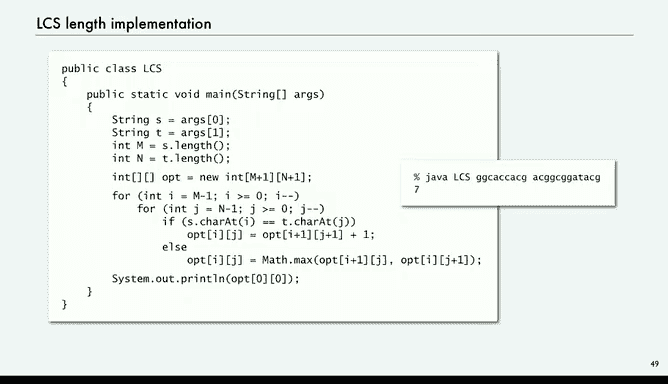
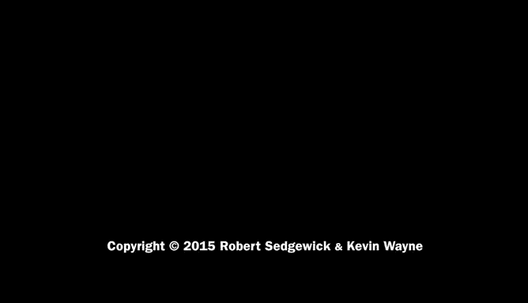

# 普林斯顿大学《计算机科学：以目的为导向的编程（Java）｜Computer Science： Programming with a Purpose》中英字幕 - P25：25_06_06_动态规划.zh_en - GPT中英字幕课程资源 - BV1Jp421R78R

Next we're going to look at dynamic programming， which is a very important programming paradigm that's widely used in operations research in other fields。

 we're not going to be able to do much other than give an example and show relationship to recursion。

 but the relationship to recursion is very important and having an idea of what dynamic programming is is very important for any programmer。

One the way we're going to think of it is as an alternative to recursion that avoids recomputation in an organized way。

And recursion， you think of the computation going from the top down。

 we start with a big problem and break it into smaller problems。

The alternative that dynamic programming represents is to work on the computation from the bottom up。

 do the small cases first and then combine them to so solve the small subproble and then save the solutions and use those solutions to build bigger solutions this was pioneered by Richard Bellman in the 1950s and is very effective in a broad variety of domains。

So in the context of Fibonacci numbers， computing the Fibonacci numbers。

 what this means is just use an array and to hold your answers。

 so we're going to save solutions of small subproblem。

 set the first two entries in the array to what they ought to be。

 and then just go through the array for each value of I using the previous computed subproblems to compute the answer it's as simple as that solve the small subproblems。

 use the ones you've already solved to build bigger and bigger solutions。And again。

 this one obviously doesn't have the exponential waste pitfall。

 it computes the Fibonacci numbers in just an additions or whatever it takes。

So that's another quick way to get the Fibonacci numbers。Now， in this case。

 this computation is much simpler than the recursive one。

 and there are some cases where recursive solutions involving memization are simpler， but people who。

Applied dynamic programming to scientific problems。

 find that the organized use of solved small subproblem is a natural way to approach many problems。

The key advantage over the recursive solution is that you're pretty sure that you're addressing each subproblem only once。

So we're going to look at an example called the longest common Subequence problem。

 and this is a problem that at first thought you might think would be extremely difficult to compute。

 so let me introduce it。So a sub sequence。 So we have a string S and a sub sequenceequence of this string is any string that you can get by just deleting characters from S and packing the rest together。

So if we have this string， GCA， CCAC G， So CA is a subsence。 Well， any substr is a sub sequenceence。

 just delete the other characters， but you can delete some characters and you might think about how is this one going to be。

Well， we delete the second character， we have GC， and then A。

 and then we delete the two C's and we get another A。

 and then that's how we get that sub sequenceence。And so forth， there are a lot of subsequences。

 in fact， you can maybe lay over a binary number on each character to say whether you're deleting it or not。

 and that means that there's two to the n subs sequenceequences in a string of length in。

And so just for these examples， here's the proofs that those are sub sequenceequences。

You pick some subset of the letters and put them together。 That's a sub sequenceequence。

Here's another string， so this one， so if it's got5G's。

 you could put the5Gs together as a sub sequence and so forth。And again。

 here's the proof that those are subsequences。 So youve got two strings。

 you have a huge number of subsequences of the strings， an exponential number for both strings。

 and the computational problem involves what's called the longest common subs sequenceequences。

 What's the longest string that's a sub sequenceequence of both those strings。In this case。

 it's this one， G GC， AAC G。So our goal is to find an efficient algorithm to compute the LCS。

 Actually， we're just going to do the length of the LCCS。

 but it's not much more difficult to get the actual sequence。Now again。

 you would think with all those possible subsequences to consider that this would be a computationally intractable problem and it's quite surprising that it's actually fairly easy to solve and it's important there's numerous scientific applications where this measure of the similarity of two strings is important with DNA sequences we don't always get them exactly the way we want them and this measure is a very important way to know whether the relationship between different sequences and there's many。

 many other applications， there's also computational applications like how many edits would it take to get from one string to the other and many other related problems。

So now's how we're going to solve this problem， we're going to use dynamic programming。So actually。

 we're just going to do the length just to simplify it for the lecture。

So in the approach we're going to use is work with the end of the strings and remember with dynamic programming what we they want to do is solve small subproble and then put those solutions together to solve bigger ones。

It's recursive， but from the bottom up so what we're going to do is keep track of the length of the longest common sub sequenceequence of the tails of the two strings。

 and we're going to have a twodiional array， opti J that gives the longest common subsequences of the tail of S starting at I and the tail of T starting at J。

And it turns out there are just three cases to consider as long as we have already computed the answer for smaller strings。

So while the first one is easy， if either one of the strings are empty。

 then they have no common sub sequenceence because one of the strings has nothing in it。

 So if we're at the end of either one， then our subproblem of size0， the answer is0。

 that's the length of the longest common subsequence。Otherwise。

 a case to consider is if S of I equals t of J。 so that's the character at the front of the two tails。

 if those are equal， in that case， if we've already computed the answer for the strings。

 the tails without those characters， then we're going to have a longer subsequence because we can add this new character that matches and get a longer sub sequenceequence。

 so just as an example， if I equals6 and j equals7。

 then the tail of s for our example is ACG and the tail of T for our example is A ACG。

So the longest common sub sequenceequence without the A's at the front is just CG。

 So that means the longest common sub sequenceequence with the A's at the front is AC CG。

 It's as simple as that。 So that's if the characters are equal。And if the characters are not equal。

 well then adding those two different characters at the front， there's only two possibilities。

 one of them could give us a longer common sub sequenceence or the other one。

 and that's just compute the maximum。 So again from our example， say I equals 6 and j equals4。

 So now we have two tails where the leading characters are different。

So now we've already computed the answer for all small tails。

 so we know that if we forget the C on the second string。

 then we know the LCS that's already computed or the length of it in this case is three。So。

And we know the one， if we delete the first character of the other string that's also already computed。

 and one they may be the same length or one of thems longer。 in either case。

 that any sub sequenceence of those smaller strings is also a sub sequenceence of the slightly bigger string。

 So we take the maximum of that。 And that's the length of the that's the longest common subs sequenceequence of the strings that we're interested in。

 Those are the only three cases。So all we have to do is arrange the order of the computation so that we're sure that we already have computed the answer to the smaller subproble for the next problem that we want to consider。

So we set up an array， we've got our string T up here at the top and our string S over there at the left and so at the ends we have all zeros and all we do is work backwards through this array well so since both strings end in a G the longest common sub sequenceequence when we're only considering the 1G at the end of s is1 so it doesn't get interested until we get to this case here and that's a case where they both of the tail start with C。

And so the length of the longest common sub sequenceence is。If you take off both those Cs。

 which is the one diagonal one down from that and add one。

In the next case is the other case where their leading characters are different。

 and then we looked at the one to the right and the one to below which are already computed and take the larger one。

So all we do is proceed through the array from bottom to top from right to left every time we need an answer。

 it's either one that's diagonally below or one， the maximum of one to the right and one to below。

 and we've already computed those。These are the numbers that you get for this string this pair of strings and the final result is that the length of the longest common subequence is seven。

 and we can recover the sub sequenceequence itself with a similar computation。

And here's the implementation， it's not recursive， it's based on saving all the answers in the twodiional array and this is just in Java code exactly the process that I just described。

 we go backwards through the arrays if the characters are equal， we compute IJ from i+ 1j+1。

 otherwise we take the max， and then when we're done we just print out 00。

So if you run this program for examples， you get seven。

Amazly simple solution to this problem that seemed to comparing exponential a number of things against one another。

 a very persuasive example of the power of dynamic programming and if you want to see the code that actually prints the LCS itself。

 you can look at the LCS。 Java on the book site，So dynamic programming and recursion are not toys。

 they're broadly useful approaches to solving problems and in both cases you're combining solutions to smaller subproblems in one case you do all the small problems and combine them to do bigger ones。

 that's dynamic programming and the other case you take your big problem and break it down into little ones。

And you need to learn both of these because they represent new modes of thinking and give us powerful programming paradigms to solve difficult problems。

 and they both give us some real insight into the nature of computation and have been successfully used for decades in all kinds of scientific applications。

advantagetages of recursion is it's pretty easy often to figure out how to decompose。

 and it's very easy to reason about correctness。On the other hand， dynamic programming。

 you don't have to worry about exponential waste， you could often have a recursive solution with memorization。

 but it's hard to get much simpler for an example， like we just did for the longest common sub sequenceequence。

Pitfalls in recursion， as we've talked about is exponential waste might be there。

 and it's not always necessarily so simple to figure out how to decompose things。

For dynamic programming， you need that bigger array to save all the subpro。

 doesn't work if you have real valued arguments so well。

 and sometimes it's challenging to determine the order of computation。

But definitely need to consider both of these approaches and you'll encounter them over and over again as you take more advanced courses in computing。

