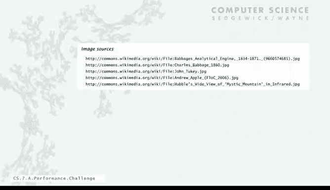
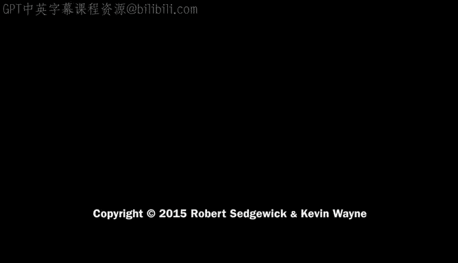

# 普林斯顿大学《计算机科学：以目的为导向的编程（Java）｜Computer Science： Programming with a Purpose》中英字幕 - P26：26_07_02_挑战概述.zh_en - GPT中英字幕课程资源 - BV1Jp421R78R

Well， we've already covered a great deal of techniques and programming。

 but now today we want to cover something that's very important when you're going to be using computers to solve large problems and that's performance。

So let's begin with the basic challenge and this challenge has been with us since the very early days of computing。

 In fact， it goes back to Babbage who built this machine called the difference engine that's a mechanical machine that was going to perform arithmetic operations like multiplications。

 this is actually a copy that was built in the 90s at the British Science Museum。

 London Science Museum， and here's what Babbage said， as soon as an analytical engine exists。

 it will necessarily guide the future course of the science。Whenever any result is sought by its aid。

 the question will arrive by what course of calculation can these results be arrived at by the machine in the shortest time。

In this machine， if you look at it， it actually has a crank and so really Babbage's question was how many times do you have to turn the crank to get your answer and really that's what we're talking about today is how can we be sure that we're getting the results in maybe not the shortest time but at least a reasonable amount of time and it's a very important thing to have in mind when we're crafting programs to solve scientific and commercial problems。

So the more modern version of this， this is our review where we were in program development。

 where we test our program， you know we edit， compile， run and test。

 and then after a while we start using it to solve a practical problem。But really。

 if it won't solve the practical problem， it might be just because it's too slow。

 it's too inefficient， so we want to talk today about how might you understand its performance characteristics so that you can approve it and actually address the practical problem。

The key insight behind this was developed by Canuth in the 1970s。

 who pointed out that it really is feasible and actually productive to use the scientific method to understand performance。

 and that's what we're going to talk about today。So there's a lot of reasons to study program performance。

 here's three in particular， so one is we want to just predict the behavior of our program。

 we want to know if it'll finish at all， is it in a loop or is it just taking a long time and actually usually we want to know when will my program finish。

But we also might want to compare algorithms and implementations and we want to know， well。

 I've got a program that works， but if I change it in this way will it make my program faster or how can I make my program faster。

 that's another reason that we might want to study performance。

So making a distinction between the word algorithm and the word program。

 an algorithm is the general method for solving a problem that's suitable for implementation as a program。

And we're going to study a lot of algorithms in this course， and if you take more CS courses。

 you'll see plenty of them， this is our book on algorithms and we have two courses on algorithms later on online。

呃。So really what we want to do is with studying performance of algorithms and programs is to develop a basis for understanding the problem and for designing new algorithms or maybe setting parameters that make the algorithms work best this is really where we get at new technology problems that we could solve with a clever algorithm that couldn't otherwise be solved or addressed at all or research problems that we can feasibly address with a good algorithm that we could not feasibly address without it。

 and I'll give some examples of this later on。So we had some fairly complicated programs。

 this is our。AGmbler simulation that we did early on is an example of nested loops and if you run this for large values of the parameters。

 it might take quite a while to run and the question is when is it going to finish or how long is it going to take to finish and that's just one example。

 for many， many of the programs and algorithms we consider we want to have some idea of when they're going to finish。

So just to motivate this further i'll give some specific examples so first one is the in body simulation problem we looked at a program for doing that on a display but。

More generally， the value of n could be really large。

 like astrophysicists are interested in studying these interactions for huge， huge values of n。

And the algorithm that we looked at to solve this problem took time proportional to n squared。

So it's that we call that quadratic time and we'll talk about that as the problem size increases。

 the time increases as a function of n squared。Well， in the 70s。

 this became a problem because that value way， way exceeded the limit on the available amount of time that was available in a computer。

 can run your fastest computer for a year and you still can't solve the problem for a values of N that you'd like to solve it。

But the success story is an algorithm known as the Barnes's Hu algorithm that solves the problem in N log N steps and therefore enabled scientists ever since then and they still used this algorithm to push their understanding of this problem to huge。

 huge values of An really enabling new research on understanding properties to the universe this algorithm was actually invented in research started by Andrew Ael。

 who's a professor at Princeton， but did this for his senior thesis as an undergraduate。

So that's a perfect example of the importance of finding an efficient algorithm to solve a problem。

Here's another one， the discrete Fourier transform。

 and this is a very fundamental calculation in signal processing。

 we're going to break down a waveform into its periodic components。And again。

 the straightforward algorithm for solving this problem is quadratic in the problem size。And again。

 that algorithm quickly hit the limit of available time on computers even as early as the 50s and '60s。

So you couldn't really do this to address the commercial problems that people cared about。

But it turns out there's an algorithm known as the FFT， the fast Fourier transform。

 and actually has origins in classical mathematics dating back to Gauss but was popularized by Johnki Couly and Tki in the 1950s and that algorithm uses N logN steps and so therefore ever since that time people have been able to push the size of problems they could solve FFTs on to a very huge limit way below the limit on available time and that's the basis for a lot of the technology that we have surrounding us from MRI machines to。

Music players and game players and cell phones is based on our ability to solve this problem quickly。

 another example of the importance of having a fast algorithm。

So really the design of fast algorithms is a subject of a later course。

 but for now what we want to do is at least provide a basis for how you can understand the performance characteristics of your programs。

Now I need one technical thing， we use binary logarithms in a lot of our analyses and I just want to get this notation out of the way。

 so the binary logarm of a number is the number x such that two to the x equals n and it grows very slowly and any computer scientist knows this。

 this is the number of bits that it is needed to express n in binary so any computer scientist knows that two to the 10 is about100 so the binary logarithm of2 to the 10th is about 10 is exactly 102 to the 20th is about a million binary log is 20 and a billion is 30 so that's just a really quick computer science calculation when we say log think a billion think 30 it's a much smaller number than a billion。

It is the main point， so like when we had this convert recursive convert program that computes that converts a number from decimal to binary or prints out the binary representation。

 thats actually the largest integer equal to log n is the number of bits there。

 and we write that as a floor of log n this largest integer lessary log n。

And we can prove that by induction and we did actually talk about do actually talk about that later on。

So the number of bits in the binary representation of n is about binary log of n and that it arises often in the study of recursive problems and including like the FFT and the Barnes Hu。

 so this divide in half idea is what kind of brings out a logarithm and we'll see examples of that later on in the course。

So what we're going to use as an example to study performance is called the3 sum problem。

 and it's a very simple problem， given n integers， we want to know how many of the triples those integers sum to0 that could be positive or negative。

Now there's other processes that we might want to perform on those triples。

 but for now for simplicity， we're just going to count them。

 let's say our problem is to find out how many there are so this problem actually turns out to be a very。

Fundamental problem in computational geometry， that's computer algorithms to process geometric algorithms。

So like if you want to know if three points， if you have a bunch of points and if you want to know if some of them are colonlinear。

 you have to be able to solve this problem or even does a polygon fit inside another that's you can imagine important in robot planning and other types of applications like there's no way to fit that rectangle inside that polygon or that star but that star actually turns out fits in there in order to be able to solve that problem need to be able to solve this three sum problem we want to talk about the details of that that's just motivating the idea that a simple problem like this can be important in lots of practical applications。

 a very long list of applications where people want to be able to solve this problem efficiently。So。

This is just the setup for it。 So we want to have a。

methodethod count that takes an array has argument and returns the number of triples of elements in that array that's sum to zero and our test client will read the array and then call the count function。

So for example， with those six integers， 30， minus 30， minus20 minus10， 40 and 0。

 there's three triples that sum to0， 30 minus 30 and 0， 30， minus 20 minus10， minus 30。

 minus 10 and 40 out of all the triples， those are the ones that sum to0。

So that's the behavior that we want from our implementation， so now we'll look at implementation。

So the question is， we can we actually solve this problem for if we have a million points and plenty of these applications。

 you might have a million points？Now we're not going to study that problem。

 that question is actually kind of open， but we'll look at the simple brute force algorithm for solving this just as an example for understanding performance of programs。

So what this algorithm is going to do is process all possible triples and then just keep a counter and when the sum is zero。

 it'll increment the counter。So we get our number of elements， initialize our counter to0。

 and then we have triple4 loops for i from 0 to n from J from i plus1 to n for K from J plus1 to n。

 so we keep I less than J less than k to avoid processing the triples multiple times。

That's already a simple performance improvement， and then we test if those three。

 AI AJ and AK sum to zero， and if they do we increment our count， and then that's what we return。

So that's a brute force algorithm that implements the。It solves the three sum problem。

So here's a simulation of this a trace of this thing running。

 first value that we try is i equals 0 j equals 1 k equals 2， doesn't sum to0， then we increment k。

And then in black are the ones that do sum to zero， so Is 0， J1， K5， sums to0。

 then we're done with K， and we increment J and so forth。

So this trace shows that we enumerate all triples and we find the ones that actually sum to zero。

So our goal now is going to be to try to understand something about the performance of this program Could we run this program for n equals a million and solve this problem for a million numbers。

 that's what we're going to want to look at next。How much time was it going to take for a million？

Now， one thing to notice right away is that there are N choose 3 triples with I less than J less than K。

 And so that's going to definitely come into the analysis。

