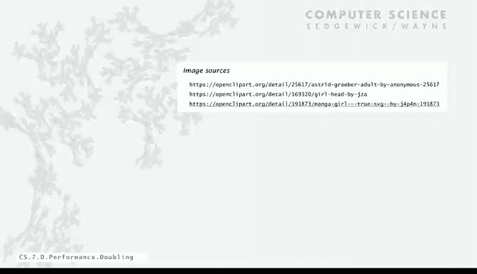

# 普林斯顿大学《计算机科学：以目的为导向的编程（Java）｜Computer Science： Programming with a Purpose》中英字幕 - P29：29_07_05_倍增法.zh_en - GPT中英字幕课程资源 - BV1Jp421R78R

So the example that I've given involving the experiments development of mathematical models is relatively detailed and doesn't seem like something that you might want to do for every program that you write。

 but there is something that you can do that's very simple and that you should do for every program that's going to consume a considerable amount of resources and that's what we're going to talk about next it's called the doubling method for analyzing performance。

So a key question that definitely comes to mind is。

 is it really true that the running time of my program is going to satisfy a power law。

 it's going to be proportional to a constant times N to another constant。

And the answer is absolutely there's a very good chance of that there's some that don't。

 but there's a really good chance that yours will with a caveat that there might be a factor of log n to some small power。

So how can I say that so confidently well， for one thing is we've studied lots and lots of specific algorithms and we've observed this for many。

 many algorithms with rigorous mathematical models backed up by performance studies。

 that's what Canus works all about and that's what you can learn about in algorithms。

And the other thing is that， as I mentioned， we use simple constructs to build programs and I'll give some more examples of that。

Also， the data that we process often is pretty simply structured or at least has characteristics of simply structured data and in fact。

 deeper mathematics shows a connection between the models and really a big variety of discrete structures also including programs。

 so there's a lot of mathematical analysis and knowledge beyond the basic hypothesis that your program is going running time your program is going to satisfy a power law。

So at least for the moment， let's assume that。So now if that's the case。

 if I think the running time of my program is proportional to a constant times n to another constant。

What I want to do is。Take advantage of that and there's a consequence and that consequence of that is if I take the ratio of the running time for a value n and twice that value。

 then it's going to be2 to the B and you just plug in a times2 n to the B over a times n to the B。

 everything cancels except for2 to the B。So。take the ratio of the running time as you're doubling in。

 that's going to approach a constant， and we don't even need to calculate A to find out how fast the running time is growing。

And calculating A was something that was pretty complicated。

And that was the thing that depended on the machine anyway。

 so here's the method that we're going to use to figure out how fast the running time of a program is going to increase so again we start with the moderate size。

 take the running time， double the size repeat why you can afford it and then just take the ratios of the running time and verify that they approach a constant and then by。

You can extraculation once you know that constant， then you can just multiply to estimate the next running time so like in our three sum example。

 again， we run it for 2000。Rio of our running times is 8 for 4000， 7。

75 it's about 8 and that checks with our math model because2 cubed equals 8 so B equals 3 so the running time should be proportionate to a constant times 2 cube。

 but the thing is if we now run it for 16，000 and it took four minutes to solve it for 8，000。

 we can figure out that the running time for 16，000 is going to be 8 times that four minutes or about a half hour。

So while you're waiting for it to run， just look at the ratios of the previous running time and just multiply by that to figure out what the next running time。

 then you could just go right ahead and multiply in this case by eight to the seventh to get your predicted running time for a million。

That's a very simple method for estimating how long your program is going to take for a large number of inputs。

 so that is the bottom line is it's often really easy to meet the challenge of predicting performance。

Run this doubling method， figure out what the ratio is and then extrapolate that's something you can do for any program that you run。

 It's a lot easier than even while you're waiting for the program to finish。

 you might as well do this and you'll have a much better understanding of it。Now。

If we ignore the constant A， what we're talking about is what's called the order of growth of a function。

And generally we think of the order of the growth as a property of the algorithm。

 not the computer or the system， that is that constant A is different on an old computer， old system。

 new computer new system， it might be lower， but really the method that we're using to solve the problem is going to determine that order of growth。

And again， we know that from experimental validation， I ran the program 50 years ago and run it now。

 I still get the same order of growth， we expect if you have a computer that's x times faster and you run the same program which should finish x times faster and also when we doing the mathematical model。

 the thing that are depend on the machine in the system is all constants。

 so they all roll up into one big constant so the order of growth is not a property of the computer or the system。

And that's a useful way to think about it。Because it means we can classify algorithms or methods that we use to solve problems by their order of growth。

And again， for many， many programs， we know the order growth of the running time is into a power times log in to some other power。

And here we use log instead of log base two because the constant doesn't matter。

So and these immediately follow sometimes from the structure of the program， for example。

 if you have a program that's simply a for loop that's。Going through something n times。

 then that's running the order growth of the running time of that program is going to be proportional to N。

 and we call that linear。If you have nested four loops， again， with constant stuff going on inside。

 then that's going to be proportional to n squared， do we call that quadratic。Or triple4 loops。

 it's N cubed and that's what we saw for three some， but this applies to many， many other programs。

If we have something like the convert program that converted in a number to binary and we see plenty of algorithms like this。

 where we solve a problem by solving doing some work and solving a problem half the size。

 then we get log n performance。If we do two problems of size n over two。

 then we get n log n performance and we'll see examples of these later on。

If we do two problems of size n minus1， then we get exponential performance。

 those types of algorithms we can't run for very big n。

 but we might as well put them on for the categorization。

So we think of algorithms as falling into these general categories and again， many。

 many algorithms have been studied both empirically and mathematically。

 and we know that indeed they do。And it's important to be aware we'll see some examples later on。

 it's really important to be aware of these。The shape of the slope of the line is going to be the exponent of n and you can see the log factor doesn't make that much difference。

 they're very close， what makes a difference is the exponent of n， this is in the log log plot。

And then the factor for the doubling method is just two to the slope。or two to the exponent。

 and so what that says， if the input size doubles， that the amount that's the factor that you multiply by it to get the increase in running time。

so it's very important to know these general parameters because you'll see them from many of the programs that you write if you run your program and take the ratio of running times and it seems like it's going to four then you can say okay it's quadratic and there's not many other cases than these so it's good to know these classifications we can look at more detail but certainly you want to have that idea。

So if you have a map model that tells you the order growth。

 we can use the doubling method to validate it， or if you don't。

 you just use the doubling method to get a good estimate of the order of growth and that kind of analysis should be done for any kind of program that's trying to solve a large problem where performance is an issue。

No。There's a really important implication of this because we have this idea called Moore's Law that's held for many decades now。

 whereas it says that。Pututer power that we have increases by roughly a factor of two every two years。

But the thing is when the computer power increases， say the speed of the computer。

 also the size of the memory increases and that means the size of the problem that you want to attack also doubles so the question is when that happens。

 what's the effect on what you're going to spend to get your problem solved and this is a very common situation you get a bigger computer you fill it with a bigger problem。

 say weather prediction or bank processing transactions or cryptography certainly you get a faster computer with more memory you're going to want to load up the memory and solve the bigger problem but if you just do this simple math you'll see what goes on so if my running time say is is N cubed A cubed today say for the threesome problem then in two years I get。

Computer that's twice as fast， so that means the running time is a over 2。

Times then now but my problem is twice as big so it's 2N cube。

 so to solve that it's going to take four times as long to solve my problem in two years it's a bigger problem but it's going to take four times as long。

 so if you just look at this for common orders of growth for different problem。

 if I have a linear or an analog n algorithm， it's going to cost me about the same to solve my bigger problem with my bigger faster computer in two years。

 but if I have a quadratic algorithm it's going to cost me twice as much or if I have a cubic algorithm it's going to cost me four times as much。

Four years from now it's going to cost me 16 times as much if I have a cubic algorithm。

 this is an unexpected effect because budgets， people's budgets don't go up at this kind of scale。

 and it means that the person who's using a linear or an analog and algorithm is still going to be able to get the job done。

 they're progressing with Moore's law， they're following technological process progress and getting bigger problems solved with their bigger faster computers。

 but if you're using a quadratic or a cubic algorithm。

 you're not you're falling behind by a factor of two or four every two years。

You absolutely can't afford to use a quadratic algorithm or worse to address an increasing problem size。

 and that's a very important insight for everyone developing software to attack large problems to have。

So。This is just a summary of meeting the challenge。 Here's Bob again。

 who went to the hackathon and he says， well， my program's not finished yet。

 I think I go get a pizza。And Adam Alice says， well， mine's taken too long to run。

 but I think I'll run a doubling experiment and Bob comes back from his pizza and it's still running and Alice said。

 well， it showed that I had a higher order growth than I expected。

 so I fixed it found it and fix the bug and now I'll go get pizza。So again。

 if you have an understanding of what your program is doing。

 and you can easily get that with good insight with doubling experiments。

It's something that you really should do， the best practice is to have some kind of realistic experiments for debugging anyway。

 so you might as well get some idea about performance and that's way better than having no idea and absolutely performance matters in really quite a few situations。

Now there are plenty of caveats， the story is not always as simple as I've laid out。

 sometimes we can't really meet the challenge of predicting performance well like as I mentioned before。

 maybe there's other apps running on the computer and what about the log factor well actually the log factor doesn't matter in the long run you still get the doubling ratio associated with the exponent of N。

And what about my computers got a cache， it's got multiple processors， your model's too simple Well。

 we'll make the model more complicated What about if I have n log n plus 100 n that needs to be more terms maybe yeah well we can refine the model in that way what happens if the leading term oscillates you said it was a constant actually there's cases that we know where the term oscillates and a algorithm analyst would say you should be lucky to get that one because that's really interesting kind of program to study。

Or maybe your input model is too simple， my real input data is totally different well you should get an understanding of what your input is then。

 but still it's true that the doubling method that we've outlined is very simple and it's robust in the face of many。

 many of these challenges so these are not reasons to avoid it。

YouGo ahead and use it and maybe use it to uncover one of these caveats and a lot of times it'll be strong enough to go right through them。

