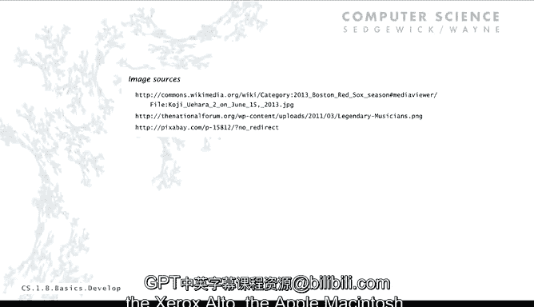

# 普林斯顿大学《计算机科学：以目的为导向的编程（Java）｜Computer Science： Programming with a Purpose》中英字幕 - P2：02_01_03_程序开发流程.zh_en - GPT中英字幕课程资源 - BV1Jp421R78R

Next we're going to talk about program development。

 This is kind of a complicated topic to talk about right at the beginning。

 but we do it at the beginning because every student writes a hellello World program。

 but the actual process they use to get that program into existence in running is completely different for lots and lots of students in many。

 many different ways how to actually get the program running。

 and so what I want to do to answer the inevitable questions that we get about which way to develop a program is more appropriate。

 I want to put this in a little bit of historical context and also a little bit of understanding of the process of developing any program。

So just taking a high level view。Program development in most programming languages is kind of a three step process with some feedback。

So the first thing you do is edit your program， you create it by typing text on your computer's keyboard and eventually you get a text file like hello worldld。

 Java。Then the second thing you do is compile the program that's translating it from this text format to an executable file suitable for the computer。

We use a program called the Java compiler， and that creates a thing called Java Btecode file。

 which is called helloorld。class and will be saved on your computer in the same file as hello worldld。

 Javava。And that's the one that the computer is going to run。 Now。

 sometimes there'll be a mistake in what you typed like we looked at the example of leaving off the word public and so forth。

 That's the compiler telling you that's not really a legal Java program and you have to go back to step one to fix it and then recompile it。

You want to keep doing that until you have a legal Java program that the compiler can turn into a ICCO file like Helloor Doc class。

And then the third step is you run your program and then that's using another part of the Java system called the Java runtime that we evoke from the command line by just typing Java and then the program name and the result of that is that gives themic code to the Java machine that virtual machine that's working on your computer and the end result is your program's output Now again。

 maybe your program isn't doing exactly what you thought it was doing and there might be a state a mistake if there's a mistake in the program then you have to go back to step1 to fix it in this case。

 you've got a legal Java program but it's doing the wrong thing you still have to go back and fix change the text file and then recompile it and then run it again to see if there's no mistakes。

So it's a little three step process with feedback where usually you edit， compile and run。

 and if there's ever a mistake， you have to go back and edit again， that's program development。

Now this isn't so unusual， any creative process has this kind of refinement and development。

 so this is like music， there's compose it and rehearse it and play it and you know you have the same type of feedback any kind of creative process is going to have the same thing maybe there's a few more steps but it's the same basic idea。

 but with programming there's a big difference because we can use the computer to help get this done。

 the computer can help us find mistakes。And so what we talk about in this process is the idea of a program development environment。

 thats software that we use for editing， compiling and running programs。Now theres two。

 there's a lot of different ways to think about program development environments。

 but I want to talk about two time tested options， one of them called usinging virtual programs。

 and that's an approach that works for many different languages and systems。

 it's very effective even for beginners and it's very simple and concise。

And there's another approach called integratedrated development environmentvironment。

 which is often specific to a particular language or family of languages。

 sometimes it's useful for beginners and it gives a variety of useful tools。

Most of you use one of these two approaches to get your first program going and we'll use them for later programs。

 so I want to talk in a little detail about both in a historical context and then compare and contrast them。

So this is an extremely short history and again， historical context is really useful in computer science because one thing is we're always using old software。

 a great deal of the software that's part of our computational infrastructure was written decades ago。

 it's surprising and a bit scary， but it's true。Not only software。

 often new computers emulate old computers so that the old software can run。

 so we have to know about the old hardware and the old software and a lot of the concepts and in the designs that were developed five or six decades ago are really good and we depend on them all the time。

So that's true for program development so in the beginning， the first computers。

 people developed programs just using switches and lights on the front panel of the computer and we'll talk about that in the second part of this course。

Without much delay， different types of input output devices like punched cards came into existence。

 and that's a different way of interacting with computers that people use for quite some time in the 60s and the 70s。

Before long there was the idea of a terminal connected to a computer and I'll talk a little bit about each one of these on a slide and it's closer to what I talked about with the virtual terminal we have an editor。

 a compiler runtime and terminal it's kind of what we use and then we actually we use a virtual terminal on a laptop and I'll talk about that and then there's integrated development environment and pretty much since the mid-70s these two approaches that I'm going to talk about have really been in widespread use。

So just a slide on each one of those somewhere around 1970。

 this is an example of a PDP8 computer on the heart of the computer is the little panel in the middle there that I've blown up here and the feature of this was for significant amount of program development was you interacted with the computer using the switches at the bottom in the lights at the top that was effective but a pretty inconvenient way to program but people definitely program that way and we'll see a lot of detail on that in the second part of the course。

The first thing that happens is people said， well， this is too inconvenient。

 we need better input output devices and one thing that worked for a long time was punch cards for input and a line printer for output so you had a a machine that looked kind of like a keyboard but it would for every line of your program it would create a punch card and so your program would be a physical deck of punch cards you get a box。

 a box that hold 2000 cards， so a good sizeized programs。

 2000 line program and you'd actually write with a magic marker on the cards the different parts of a program。

And then there's a huge computer that everybody shared and over on the right is a card reader。

 operator put the cards in there and then your program would be in the computer。

 and then it would print out the result on a line printer。

So maybe your parents or even your grandparents， when they learned how to program in college。

 they use punch cards in the line printer， they can tell you about it。Before very long。

 what we wound up using， say in the late 70s and 80s。

 even a little bit into the 90s was terminals that connected to a big computer so you didn't have to go to the computer center you could sit and you had your own keyboard for input and your own display for output if you wanted to print。

 you had a maybe fool around a little bit but the thing was that there were many users could share the same computer。

 so a small organization could have one computer and then everybody could have a terminal in their office that they could use to create the text that made up their program and then to invoke the compiler in the editor。

 but all kind of sharing the same computer and that was a welcome development because it got everybody computing in their offices。

Now with personal computers nowadays what we do is use virtual terminals。

 but virtual terminal just means that we're using the old software that was developed for those terminal devices what the keystrokes mean and the output that it gives to the computer in a terminal window in your computer is precisely the same as those physical VT100 terminals that was one that was widely used so this is just what my screen usually looks like when I'm programming there's a virtual terminal for the editor and then I have a different virtual terminal that I use to compile run and examine the output I usually also have a virtual TV set maybe with a Red Sox game on it virtual TV set virtual terminal you get the idea so I can type Java C hello worldorld。

 Java in a。terminal and then I can type Java hellello world to run it and then I can see the output so really this whole setup which is on my personal computer is using old software in a convenient way but it's a fine way to at a compile and run programs in many many professional programmers work in this way you can have multiple programs displayed on a big screen and you can have multiple virtual terminals going to run them in different context and so forth but this basic idea has held up at least since the 1980s and plenty of people still use it。

Another idea is this idea of a customized application for developing a program in a particular language。

 so called integrated development environment。This is one called Dr。 Java and there's other ways。

 other integrated development environments that are appropriate for Java program。

 one of the downsides of integrated development environments that I'll talk about is that they come and go like languages come and go whereas virtual terminal you can use the same environment for many。

 many different languages。So anyway it's got a button in there。

 it's an application for developing Java programs， so it's got a button for compile and a button for run and then it's got a command line where you can also see the output so it's just a different approach to developing programs。

So what are the pros and cons of these two different approaches well as I mentioned virtual terminals works with any language。

 you can be doing things controlling the computer without programming and Java you can be programming in some other language of evoking other commands are deleting and moving around files and many。

 many other things in your virtual terminal so lots as I mentioned。

 lots of professionals use virtual terminals for programming development and other ways to control the computer it really has withstood that test of time if you've got something that's been in continuous use since 1970 it's probably good for something。

Now the thing about an integrated development environment。

 some people feel is you've got language specific tools that make it a little easier。

 a little more convenient to develop your program， you have line numbers。

 you have color highlighting and other things like that people do create system independent integrated development environment so a new computer comes along use the same environment。

 at least in theory although as I mentioned they come and go and these types of systems are used by professionals to create particularly to create huge programs and also they've got a lot of error checking and hints and other things like that that can be helpful for beginners。

So the problem with virtual terminals is that if you have a huge program， a really long program。

 lots of different modules， you might need the help of something that understands something about the programming language that you're writing in。

And so the IDE would be better and you're dealing with a bunch of independent applications。

 the terminal， the editor， the Java runtime and so forth。

 so anytime any one of those changes you have to deal with it。

And maybe people feel maybe you're working at too low a level when you do the virtual terminal。

So for integrated development environment， for hellello world。

 that's really a lot of machinery to fire up for short programs and when you're learning first couple of years。

 you're basically writing short programs it might be kind of overkill。

It's a huge application that has to be learned and maintain if there's a new version of your operating system in the application。

 you know then these are complicated applications， so you might be problems as time wears on with integrated development environment and a lot of times it's specific to the language。

 new version of the language comes out， the IDE might not catch up or you move to a new version of your system。

 your old ID might not work and those types of problems are definitely there。

So because they're so simple and concise and precise， we talk about terminals。

Mostly in the lectures and in the book because there's too much information if we were to show a program in an IDE for assignments。

 a lot of people are going to recommend that you use IDEs。

 although you'll find plenty of programmers and bosses that'll say， oh， just use virtual terminals。

 you'll be fine。So those are the trade offs， we have many students that use both either system。

 and that's the story on program development。So what are the lessons that every computer's got a program development environment and actually multiple that let us go through this cycle of editing。

 compiling， and running。Using virtual terminals， using integrated development environments have worked for both of them have worked for decades all the way from the first personal computers like the Xerox Alto or the Apple Macintosh all the way up to today's computers。

