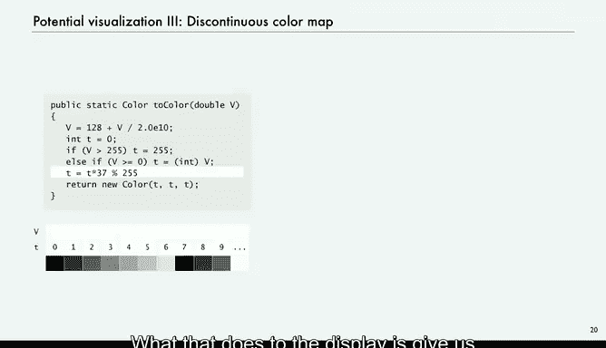

# 普林斯顿大学《计算机科学：以目的为导向的编程（Java）｜Computer Science： Programming with a Purpose》中英字幕 - P36：36_09_03_点电荷模拟.zh_en - GPT中英字幕课程资源 - BV1Jp421R78R

Our first example is the charge class that we wrote a client for in the previous lecture。

 so we're talking about a point charge which is an idealized model of a particle that has electric charges。

What we're going to do is use an abstract data type that allows us to write Java programs that manipulate point charges so our programs are directly manipulating objects of our new class of data。

So the values are going to be a position， X Y， and an electrical charge。

 so the position is a pair of doubles， the electrical charge is a double value。

So here's an example of two point charges and for simplicity。

 we keep the position in the unit square， and then those are the values of the electrical charge。

So that's the set of values， position in a charge， and the operations are first we have a constructor that creates a new charge。

 with a given position， given XY position， and a given charge value， electrical charge value。

Then one of the operations is a method called potential at that returns a double value。

 and what it returns is some other point X Y， it gives the electrical potential at that point due to our charge。

And then string representation， every class we have a string representation。

 and we do that because in Java， if you provide an object as an argument to one of the print statements。

 it'll automatically call the two string and give a string representation of that object and that's very useful in debugging。

Okay， so in order to give life to this abstract data type。

 we want to talk about a little bit about the physical world。Just a little bit。

 this is not a course in physics， so potential is to measure the effect of a point charge on its surprise and on its surrounding。

It increases as the charge value increases， so if you have more value。

 you got more potential and it decreases in proportion to the inverse of the distance from the charge。

 that's where're working in two dimensions， so it's the inverse of the distance。

 if it was three dimensions， it would be inverse of the distance squared。So mathematically。

 if we've got a point charge at a particular point， Rx RY， and it's got a charge Q。

And we've got another point， X Y， we let R be the distance between our point X， Y and the charge。

And then we want to come up with a formula for the potential at the point due to the charge。

 and we use the notation capital v sub C of Xy， potential at the point X Y due to the charge。

And there's the equation， it increases linearly with the charge and it decreases in proportion to the inverse of the distance1 over R。

 and there's a constant and that constant in the real world turns out to be 8。99 times 10 of a ninth。

That's a normalizing factor and so that's what we use for the potential and another key point is that if we have a lot of charges。

 then we can get add up the potentials due to all the charges to get the total potential at some point。

When multiple charges are present， the potential at the point is the sum of the potentials due to the individual charges。

So now， that's what we need to know about the real world。

 And now we can implement our charge and we can write some clients。By the way。

 there's many similar laws that hold， for example， the in body problem that we've considered is an inverse square law a three dimensional and gravitational force。

So this is representative of many situations。Okay， so let's get going on the implementation。

 so the best practice is to start with a test client and we talked about this in general in modular programming。

 but in particular for implementing an ADT， it's a really good idea to understand what you expect the code to do before you write it。

So。Here's the test client for charge， we might want to do something like create a new charge。

 and we give it xY values between0 and1 and a potential value。

Maybe we're going to print it out that tests the two string method because it automatically invokes two string。

And then we also then maybe want to print out the potential at some other point due to that charge。

So that's a reasonable test client that tests the constructor and both of the methods。

 and that's what you always want to try to do in a test client。

And so now we take our formula and maybe do a little math by hand。

 and so these are judiciously chosen so that the x distance is 0。3 and the y distance is 0。

4 and so the distance between those 2。 is 0。3 squared plus 0。4 squared equals 0。

5 so that's what R is， and so we multiply our constant 8。99 times 10 to the  ninth and then Q is 2。

1 and r is 0。5 it should give us 3。6 times 10 to the 11th。

So that's what we figure out by hand so that when now when we run this code。

 we expect it to first give a string representation of the charge。

 which is it's electric potential value and then the coordinates of the point and then on the next line we want it to present this 3。

6 times 10 to the 11 so that's what we expect。So that's our test client。

 and so that's one part of the job done， so now we have to consider the rest of the implementation。

Okay， instance variables， so those are the data type values。

 so we have a position XY and we have a charge， we could define a data type for points and make that our value。

 but for simplicity we'll just use regular doubles X Y coordinates for the position R X and RY and also for the electrical charge。

That's the instance variables。Now these things have modifiers that we haven't really seen much before。

 so there's private， and what private does is denies clients access to these variable names。

And that's very important， that's what makes the data type abstract。

 the implementation is hidden from the client， the client can't see these variable names。

 if we choose some other representation of the charge。

 we're free to do it as long as the methods work as advertised in the API。

So that's what makes the data type abstract， we make the instance variables private hidden from the client。

And the other one is final and that one also is important for many different kinds of data types and we'll talk about be talking about that more later what it does is it disallows any change in value after the objects constructed it so the data types immutable things don't change and that's if you're representing something in the real world like a charge。

 it's not really going to change so that's we document that with final and also in our code。

 we don't change the value well we couldn't if we document it with final。

So we'll be talking more about that later。So the key to object oriented programming is to understand that these instance variable values are not defined just this one place。

 every object has instant instance variable values， and there might be lots of objects。

Every single one of them has the same instance variables。sameme types of instance variables。

 but they're different values。 object holds data type values。Okay， the constructor。

 how do we create and initialize new objects？Well it's quite simple， we just take as argument。

 whatever we need in order to create the object， in this case it just doubles with some value that the client knows and all we do is take those values and assign them to our instance variables。

Simple constructor in this case， but usually we try to keep our constructors simple like this。

 although many times we do more complicated things。

So the point of these is that this code refers to instance variables。

 but there's no declaration of the type of those variables the way that we would have in a static method。

 and that's because theyre instance variables and they're declared as instance variables in the class。

 but not within the constructor。If there's a variable reference in the constructor。

 which hasn't been declared， that means that it's an instance variable in the class。

 and Java knows the type from that。And so what clients do is they use the new keyword to invoke constructors。

 they pass arguments to it just as in a method call。

 and this is recalling from the previous lecture where we did this。And then the system。

 creates a new object， gives it that these data type values as dictated by this code。

 and then returns a reference to that object。The representation is hidden， but just to fix ideas。

 to get you thinking about what's underneath this， one way that a charge could be represented is depicted in this diagram。

 so the variable C might refer to a memory address and that memory address is where the data is kept。

If there's another charge， it's going to have another variable and other data。

 return values are reference to a new object。Okay， so now what about the methods。

 so the methods are going to be the ones that define the data type operations that implement the APIs and that work on the data type values？

So in this case we need two methods， potential at and two string， potential at。

 well we've got our constant， we've got dx DY and square root of dx squared plus dy squared is our R and Q is our charge。

 so it's the constant times Q divided by square root of dx and dY。Now again， notice that R X， R。

 Y and Q， this code there's no declaration of them， that's because they're instance variables。

And two string， we print out a string that gives the charge， the word at parentheses and X Y。

And again， that refers to Q， R X and R Y。 The whole key to object oriented programming is to pay attention to these instant variable references in the instance methods。

Those things are values， their types are defined as in the instance variables part of the class and they're associated with the object that was used to invoke the method。

 remember we invoke methods in a data type by giving an object name and then the dot operator and then the method name and can we might have many objects and we can use any one of them to invoke the method。

 every those object has instance variable values and these references are the instance variable values in the object that was used to invoke the method that's the key to understanding object oriented programming。

So that's our complete implementation now， we have our instance variables， we have our constructor。

 we have our two methods， and we have our test client and it's in a text file named Charge。

 Java and we've described every one of these lines of code and if you type Java charge then you test out those two methods。

A completele implementation of an abstract data type that represents electrical charge。Okay。

 so now let's look at a more interesting client now that we have created this data type and let's try to visualize what the potential looks like。

 we're going to need a couple of static methods to get started。

 so one thing is we'll have a file that includes our point charges。

 our positions and values and we'll just read those from standard in。

So now we can use charge just like any other type， and what we want out of this method is to return on array of charges。

 say one per line on standard input。So we want to return an array of charges。

 we just say chargege array， recharges。Take a list of charges and the number of charges will be the first thing in the file。

 so that'll be in。And then we create a new an array of size n of charges and then for I from 0 n minus1。

 we'll read the Xy position and the charge position。

 create a new charge and store that in A of I A of I is an array of charges and that creates new charge with those values。

 so now we have n charges all with different values， the ones given in the input file。

 and then we just return that array。So that's a static method that gets us an array of charges off values in standard input。

The other thing we want to do is take the potential values at various points and convert them to a color。

All this means is take this a double value V and convert it to an8 bit integer and we'll use gray scale since we understand that。

So that's what this does。's we take 128 and this two times 10 to the  tenth0th that we're going to say our potentials are not going to be any bigger than that and then we'll。

Set it to0 and set the potential the color value that we're going to return is going to be 0。

 itll be 255 if the where it gets bigger than 255 after it's scaled。And otherwise。

 we take the double value and just make it an in， and this gives us a number just an8 bit integer between 0 and 255。

And then we'll return a gray scale of that color of that value。 So that's just takes of potential。

 scales it to between 0 and 255 and returns a color。 That's the gray that has that value。

So with these two helper methods， then we have an interesting test client that's going to display。

 visualize the potential at all the points inside the unit square。In gray scale。

 so that's recharge in two color， those are the ones that we talked about。

 and so our main method is going to read the charges。

 we'll make a new picture this makes it 800 by 800。And then for every pixel。

 we want to assign that pixel of value and what's the value going to be。 Well。

 we'll start out with a potential of zero for every charge we're going to go and。

Rescale to get our X， Y positions。So those are x y to the unit square between0 and 1 just by scaling by size。

 and then we'll just add to our running potential， the potential at that point。

And then we'll set the pixel and we turn it upside down because the zero zero is in the top left corner。

To that color。So if we take this input file， which has three charges， 1 at。5，1。63 minus100。

 one in the center with a charge of 40 and one slightly up over to the right with a charge of 20。

 and we run this thing。This method then will assign every pixel a gray scale value that shows us the potential。

 And that's what we get。Pty interesting visualization from really such a small amount of code has all to do with the idea of writing programs that work with objects of a type that we created ourselves。

So now we can do more here's the nine charges， and that's some of them are positive。

 some of them are negative。 the black ones are negative and the white ones are positive and get a big black one close to the center and so forth。

prettyty interesting display for such a small amount of code and this is data driven now if you want to study charges of whatever type you can get good visualization。

Here's an example where we might be able to move the charge。 This involves a modification number one。

 the instance variables of this charge are not final anymore。 and number two。

 we put code in to follow the mouse。But we get a pretty interesting visual display of what might happen if charges move around。

Really kind of surprising that we can get such an instructive display from the really small amount of code that we've considered so far。

run that positive one right through the middle of the。Negative one。

And so you can download this code and this kind of data from the book site or make up your own data and have some interesting displays。

And here's another very simple thing that can show the potential in an instructive way。

If we change the color to once we get between a number between 0 and 255。

 we'll just make it discontinuous， so it's not smoothly from white to black that line the next to last line multiplied by 37。

 take the remainder divided by 255 still gives a number between 0 and 55。

 but it skips by 37 and what that does to the display is give us immediately the lines of equal potential in a very graphic and instructive way。

You could write programs to try to compute these curves and plot them。

 but this is a really simple computer scientist way to do it。

And this is all possible because we were able to define our own data type and write programs that manipulate it。

