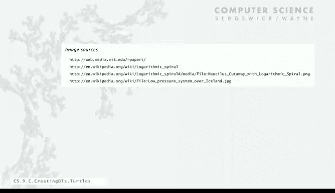

# 普林斯顿大学《计算机科学：以目的为导向的编程（Java）｜Computer Science： Programming with a Purpose》中英字幕 - P37：37_09_04_海龟绘图法.zh_en - GPT中英字幕课程资源 - BV1Jp421R78R

Now we're going to take a look at another abstract data type that is a pretty interesting way to give us a simple way to create interesting graphical pictures。

The idea is it's called turtle graphics， so what a turtle is it's an idealized model of a plotting device and it was developed by Seymour Pepper quite a while ago。

 actually as an idea for teaching children about computing。So what we're going to do。

 we actually considered using Trtle graphics for our basic standard draw model， but we chose not to。

 but with abstract data types， we can implement it so we're going to write an abstract data type that lets us write Java programs that manipulate turtles。

So we think about a turtle that it has a pen and its actually will represent it graphically with little bug。

And what turtles have， their set of values is a position in an orientation that's pointed in a certain direction。

So it might be in the middle of the screen， again， between 0 and1 pointing up or x 。25 y 。

75 pointing up into the left。Or down low， pointing almost right。

Every turtle at any time has its set of values as its position and its orientation。

In the operations that a turtle can perform。 Well， first of all。

 we have to be able to create a turtle and we create it with x Y and angle same way as for charges。

 A turtle can turn left a certain amount。 We give it a。

Number of degrees counterclockwise that it should turn。And it can go forward a certain amount。

 and when it goes forward， it draws a line。 turtleles get a pen underneath it， and that's it。

 those are the only operations that a turtle can perform。And remarkably。

 this turns into a sophisticated drawing device。So again。

 we're going to implement a turtle abstract data type by doing instance variables constructors。

 methods and a test client。And so we want to implement the test client first。

 so what we're going to do is implement a test client that draws a triangle。

So we'll create a new tunnel down at the left corner， pointing to the right。

And then we'll instruct it to go forward one unit。And when it goes forward， it draws a line。

And then we want it to turn left，120 degrees。And now it's pointing up that way。 We go forward again。

Drawing a line， turn left 120 degrees again。Go forward。And draws the line to complete the triangle。

 That's our test client。 That's what we expect the turtle to do。

 And we'll have a turn left again just to reorign itself to be ready for the next challenge。

Turtle test plan。 That's the first thing that we implement。

 So you can see that with a sequence of turn left and go forward instructions。

 you can think about creating different interesting kinds of drawings。For example。

 this client drew the triangle and never had to compute square root of three。

 so that's why maybe for just thinking about controlling this turtle can get children to think about computation。

 that was Papper's idea。Okay， so what do we need now， We need a constructor。 So constructor。

 probably you can imagine， is's very simple， similar to the charge constructor。

We have our instance variables， well we can do instance ver as a constructor at the same time in this case they're not final。

 the whole point of the turtle is for the values to change。

 and then the constructor just sets them just as before。

So these two are very much like our charge client。We have instance variables。

 we provide variables to the instructors，ll set those to the values of the instance variables。

 and every turtle now has its own instance variables。So now we got next we have to do the methods。

 we have two methods， we have to turn left and go forward。So turn left， just add Dlta to the angle。

 the one line implementation。Go forward。 That's actually where the math gets done。

 We keep track of the old X and Y coordinates。And then the distance that we have to go times the cosine of the angle。

 and it has to be in radiance in， in in Javas math function。

 So you can do this math to figure out the。Change in X。

 Y coordinate if you want to go a distance D of the angle， and that's just doing that math。

And now we use standard draw to draw a line from the old position to the new position。

And notice this x plus equals y plus equals， that changes the value of the instance variables for that turtle。

 that's what brings it to the next thing。 and again。

 this code in here inside the method is referring to X and Y without having declared them that's because they're instance variables。

So those are our methods and now we have the availability of a turtle graphics package with just this simple interface。

 that's the full implementation summarize just as before， instance variables， constructor methods。

 and then a test client that draws a triangle。So here's an example of something we can do with a turtle that's very simple。

 we can draw an end gun。We'll take the value n from the command line and so the angle we want is 360 over n if n was 3 it was 120 and 4 it'll be 90 and so forth and then this just computes a step size that means that the thing will fit inside the unit square and I'll skip that math for now。

We create a new turtle。X coordinate halfway through y coordinate0 and then angle over two actually。

 and then n times we just say go forward， turn left， and that's it。Amazingly。

 so if we say three that's going to draw the triangle with that orientation， if we say seven。

 or if we say 1440， we get almost a circle。And again， a pretty simple small amount of code。

 you might have to do quite a bit of math to figure out where to put these points to draw an endG just using standard draw itself。

And we can actually get an even more interesting client just by changing this just a little bit。

In this case， we suppose that we have kind of a lazy turtle or maybe a turtle that gets tired and we can take as a command line argument。

 the degree to which the turtle gets tired and what that does is mean every time we tell it to go a certain distance it goes just a little bit less according to this decay parameter。

 and then we spin around the end gone lots of times。

 but since it's going a little bit less each time， we actually get something that spirals in to the middle。

And that's kind of a strange look with a triangle and with a seven gun。

 that's already an interesting pattern， and that's with a circle with a slow decay。

This figure is called Epira Mirabals， and again， you might think about how you would try to plot that just using a standard drug with turtle graphics。

 It's really just a simple modification of our engon code。And this brings us to nature。

 this pattern actually appears often in nature， it's the shape of a nautilus shell。

 it's the shape of a hurricane， that can go right or left， actually galaxies or even in architecture。

 people use sp of Mi ballas， so modeling these kinds of situations is something that we can easily do with a turtle。

 which is an abstraction that we just created for doing drawings。just before moving on。

 and we gonna give a quick pop quiz on object oriented programming。 This code has a serious bug。

 What is it。If you put a declaration of something that you intend to be an instance variable。

 it creates a new local variable with the same name， and that's different from the instance variable。

That's called shadowing in this case， when you say double x equals x0。

 the instance variable isn't changed at all。The variable local variable x with inside the constructor is changed。

 but then when the constructor exits that has no effect。This is called again。

 shadowing and everyone should stand up and repeat this pledge saying I will not shadow instance variables。

 That means don't declare them inside the constructor。

 This is a very insidious and difficult bug and every beginning programmer when they write their first few object oriented programmes will make this mistake。

 and it's a difficult one to trace。 The instant variable values just don't change and it's hard to figure out why just looking at the code。

