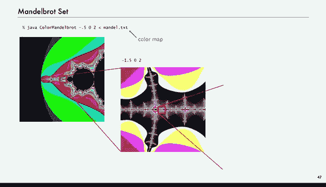
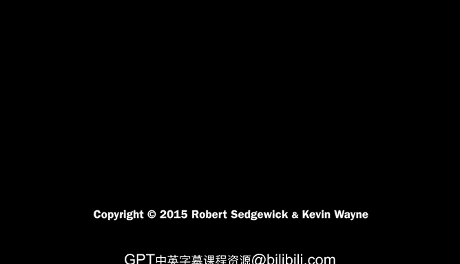

# 普林斯顿大学《计算机科学：以目的为导向的编程（Java）｜Computer Science： Programming with a Purpose》中英字幕 - P38：38_09_05_复数运算.zh_en - GPT中英字幕课程资源 - BV1Jp421R78R

We're going to finish off this lecture by talking about an abstract data type for implementing complex numbers。

This is almost ultimate abstraction mathematically。

 so what we're going to talk about is complex numbers， the number of the form A plus B。

 where A and B are real values and I is defined to be the square root of minus1。

NowThis is really a quintessential mathematical abstraction that dates back to the 18th century to Euler and koshi。

And they complex numbers are imaginary， but they give insight into real world problems that we wouldn't be able to easily address otherwise。

So to write programs to manipulate imaginary numbers is actually something that's actually quite relevant to the real world。

So if you're not familiar， we'll do a quick crash course。

 all you do to perform algebraic operations on complex numbers is just use real algebra。

 but whenever you see i squared， replace it by minus1 and then collect terms。So for example。

 to add 3 plus4 I and minus2 plus3i， we just use regular algebra。

 3 plus minus2 is 1 and 4 plus3 is 7， and we have1 plus 7 I。To multiply， it's more complicated。

Three times minus2 is minus6。And then4 I times 3 i is 12 i squared， I squared is minus1。

 that's minus 12， minus-6 was minus-12 is minus18。And then the other term comes from cross multiplying three times 3 i is 9 i minus2 times 4i is minus8 I。

 and so 9 I minus8i is I。So just with regular algebra and collecting turns or replacing i squared by minus1。

 we can perform algebraic operations or arithmetic operations on complex numbers。

The other thing that's relevant about complex numbers iss called the magnitude or absolute value。

And that's just the square root of a squared plus B squared。 So the magnitude of 3 plus4 I is 5。

And there's many， many applications of complex numbers in signal processing， control theory。

 quantum mechanics， even understanding the performance of algorithms。

 we need to know about properties of complex numbers。

So now we want to develop an abstract data type for complex numbers。

On Java programs that manipulate them。 So what are the values。

 The value of a complex number is the real part and the imaginary part。

 So 3 plus 4 I would use double values，3 and 4， minus-2 and 2 and so forth。

And then what operations do we want to perform？We want to be able to create a complex number。

 we want to be able to add another complex number to this number and multiply this number by another complex number。

Compute the absolute value， the magnitude。And do a string representation。

With this API we can write programs that manipulate complex numbers and that's very useful in all these applications。

 some programming languages have a complex number type built in because it's so useful。

 Java does not， but we can implement one as a Java class。So let's do the implementation again。

 according to the same methodology that we've been using， we're going to need instance variables。

 constructors methods and a test client， we'll start with a simple test client。

 create two complex numbers。Print them out。 A equals plus a。

 Then that calls the two string method and B equals plus B。 That calls the two string method。

And then print out the product and that's going to test out all the methods because in order to do the product you have to do a plus。

So if we。Called this test client those values are built in it makes those two numbers and multiply them that's the way we expect this program to behave Okay。

 so let's take a look at the instance variables in the constructor and again having done a turtle in the point charge is' very similar in this case we are going to use immutable numbers when you create a complex number。

 it's a complex number， it's not going to change same way when you create an integer or double in Java program you don't expect its value to change。

We might have a variable that has a value。 we might have an object that has a value。

 but in complex numbers， they're not going to change。So here's how we create it， same way as before。

 instance variables in constructor and pretty much the same as before。

As as in tutle and and as in charge。Okay， now let's look at the methods。

 And given all the definitions that we have， the methods are quite straightforward to。Add。

Another complex B to this complex， we do the computation for the real part and the imaginary part。

 and then we create a new complex number and return that。Now there's a little bit。

 you might want to say that。To make it more clear， you might want to be saying a do R instead of just R。

 and there's a way to do that because the Java keyword， this refers to this object。

 the object that was used to invoke this method， so you can say complex a equals this and then say a do R。

 we chose not to do that， but that's an alternate design for this code。And for times。

 that's the manipulation that we talked about before where you can go ahead and do the cross multiplication and figure out the values of the real and imaginary parts of the product。

And then return， again， new complex with those parts。So quite simple。

 And then we've also done the test client， client， and there's absolute value as well。

And probably should have tested that with our test client， and there's two strings。

So that's a full implementation of a complex number data type。There's a summary of it。

 and it's got the expected behavior again， very similar to the other ones that we've done。

So as our last client， we're going to talk about a fascinating mathematical object called the Mandelbrot set。

It's a set of complex numbers was discovered by Benoy Manbout quite a while ago。

 several decades ago now， and it's really actually rather remarkable that he discovered it。

 It has to really involved with computation， as you'll see， we'll get to this diagram in a minute。

 So what we often do with complex numbers is represent a complex number X plus Y I by a point X Y in the plane。

And so that makes sense for the absolute value is the distance from the origin to the point。

So for Manelbro set is a specific definition， if the point is in the set， we color it black。

 and if it's not in the set， we color it white。So for this example， say there's this point。

 x equals minus a half y equals 0。 that one's in the set。

 so it's black and all these points kind of around the origin are black。

And then points outside here say1 plus I， that one's not in the set。

So very for every point in the plane， there's a well defined rule for whether it's in the set or not in the set。

But the challenge is there's not a simple formula for testing whether a number is in the set。

 we have to deploy computation and actually even the computation we employ。

 there's approximations as we'll see。So how are we going to plot this， Well。

 I have to tell you what the rule is。It's really defined by an algorithm and that's a really interesting concept we're used to mathematical things being defined by equations or formulas in this case it's really defined by an algorithm and that's got interesting ramifications so I have to tell you what it means for a complex number to be in the set or not and this is the test we have this iterative formula。

Where given z0， then we define z1 to be z0 squared plus z0， z2 to be z1 squared plus z0 and so forth。

 continue iterating that if the absolute value of that sequence of numbers diverges to infinity。

 then z0 is not in the set， that's the definition。Otherwise， it's in the set。

 so what we have to know is for any given point， does this it diverge to infinity or not？

So for example， if we take our minus1 half plus0 I point and we keep iterating。

And we can do the calculations， but we'll do a simpler one in a minute。In this case。

 it turns out to be always between minus a half and0 and so。And we can prove that。

 and that means that that point is in the set， does not diverge to infinity。On the other hand。

 if we take this point， one plus I and here's where you can check the math if you want。

1 plus I squared plus1 plus I，1 plus2 I plus I squared plus1 plus I I squared is minus1 cancels out one of the ones。

 that's1 plus3 I。Or if we take 1 plus3 i squared plus1 plus I。

 you can check the math that's minus7 plus 7 i。This one。

 we can see that it's starting to get bigger and bigger。

 and actually this one can prove that it diverges to infinity。

 so that value 1 plus I is not in the set。That's a definition。

 and it's really an algorithmic definition。 You have to do this iteration。 And you have to know。

 does the thing get go grow without bound or not， does the absolute value of the number grow without bound or not。

So that's the next challenge is to figure out how how to actually plot this。

 And there's some definitely some practical issues。

 First one is we can't draw infinitely many points。 We can only draw a finite number of points。

And the second one is we can't find out just by iteration whether the thing goes to infinity or not。

So what we're going to have to resort to in order to plot the set is some kind of approximate solution。

 So for the first issue， what we're going to do is just take an end by end grid of points in the plane and just sample。

We can take n to be big to get a detailed picture if we want， but it's finite， so n squared points。

And if you want more detail， you can zoom in and stay tuned'll see so we could take one of these little blocks and do an end by N grid inside that little block and we'll see examples of that in a minute。

You're never going to get infinitely many points， but you can get down to very， very high precision。

And for the second issue， well， there's a couple of there's actually a proven fact that if you get to the point where the absolute value is bigger than two。

 then you can prove that diverges and it's not in the set。 So if we get bigger than two。

 we know it's not in the set。We never definitively know that it's in the set because we can't get to infinity。

 but what we'll say is if we go 255 times and we haven't got over two， we're going plot it black。

 It's probably we're gonna think it's in the set or or anyway。

 we're going to at least plot the points that you iterate 255 times and never got one that's bigger than two。

So now you have to note that in order to plot this。

 we're really doing quite a bit of computation for every one of those points。

 you're doing this iteration and this iteration involves operation on complex numbers。

 it's a lot of computation。 and I'll come back to this。

 that's why I say it's a amazing that Manelbrot discovered this。

 and I have to try to imagine his surprise as he did some of these computations for very small values of n。

Alright， so let's look at the at the visualization。

 So first one we want is just a function that returns white if a number is not in the set and returns black if well。

 iterates 255 times。So that's a complex client。 It's going to return a color。

Take this argument our starting point。And for 255 times， first of all。

 it's going to check if the absolute value of our number is bigger than two if it is returns white。

Otherwise， we say z gets z times z and z gets z plus z0。And that's an iteration。Go through that。

 And if we haven't returned yet， that means we go 255 times。 We never got a value bigger than two。

 That's when we return black。So that's the function we're going to use to determine the color that we assign to any point or any complex number。

In in a minute， we'll see you can get a more dramatic picture by using grays or colors picked from a color table。

 So if you want to do gray scale， you just return 255 minus T。 So if you got above 2 right away。

You'll have one color。 And if it takes you all but 255， you have a much closer to white。

 So we'll see that' returns a much more dramatic picture。

 allowing one color for each possible time that we got bigger than two。

Could have gotten bigger than two。So that static method， M A And D。

 we're just going to use to assign a color to a point。And with that。

 we have another of our picture visualizations。 We're going to take the。We're going to plot。

Take a point in the plane and then a size， which is a square。

 what's the dimension of the square centered at that point。

 and that's in the whole plane we can specify any point in any square and we'll take all of those from the command line。

And then we'll also take n。 That is the size of our picture。 How many pixels do we want to see。

And we'll make a new picture and by end pitcher。And then， as usual， for every pixel。

 that's for every column in every row。We're going to scale to get our x and y and that's the standard scaling to convert our X and Y into points in the plane。

And then we're going to。Create a new complex， which is our starting point from that x and y。

 So if we're right at the center， then x0， y 0 is the points x C， Y C that we put in。

And then we're going to create a color from that helper function for that point。

 and we're going to set the pixel to that color again。

 turning Y coordinate upside down because zero zeros at the top in pictures。

And then show the whole picture， that's a client that uses complex numbers to visualize the mantlebro set。

Now I'm just going to try to take you through what Manelbrot maybe experienced。

 so this is the kind of picture that you get with 32 by 32 in the 70s and 60s when he's working on these things。

 that's about as many points as he could afford to plot。

 And you can think of Moore's law going on as he got faster and bigger computers and could do more points it maybe do 64 and the thing starts to come into a little bit sharper focus。

Or 1，28 now。Or 2，56。 So now we're talking about really a lot of points。

So this is getting up to millions of computations is going to take a while on an old computer。

 particularly when you consider everything that goes into each point， and that's 512。

So this short program with the complex visualization immediately gives insight into this fascinating set。

 And this is only really the beginning of the story。If we start to put in our gray scale。

 so change that help or function to return a gray scale instead of just black or white。呃。

Then we get same kind of thing。 You can't really see the gray。

 but here's one thing that we can do is let's pick a little area there。 So that's a tiny little area。

 and we'll blow that up to the whole screen。So coordinates of that point is 0。1 and minus 0。637。

 and we'll make 10 times we'll blow it up 100 times by saying the size of our square is going to be 0。

01。Get this amazing pattern。 And that's completely different。

And you can pick anywhere on here and blow that up and you'll get another amazing pattern or we can go to color and instead of assigning a gray scale for the zero to 255。

 we can pick 255 colors that we like and put them in a file and then just pick one of those colors when we get we get eye iterations。

 we pick the eyed color。And you start getting a drawing like that。And if you blow up that one。

Seems to be more interested and blow up that one。

People have zoomed in on the Mandelbrot set for many， many orders of magnitude。

 up to 100 orders of magnitude you can find on the web。

 movies of people zooming in all this interest in this simply defined set。

And these are just the kinds of images that you might get。Or that one。

 all of this from that simple program that iterates complex numbers。

So that's really the ultimate client in terms of abstract data types。

So the summary is with object oriented programming， you can create your own data types。

 you can use them in your programs and manipulate objects that have data type values。

And really what it does is it helps us simulate the physical world。

 Often objects are meant to model real world objects。

 sometimes we have to struggle to make it reflect reality。

 but we've seen plenty of examples with charged， particle， color。

 sound and genome that allow us to compute with models of the real world。

 That's the real benefit of object oriental programming。And really。

 it helps us extend the Java language to include the data types that we need。

 Java can't possibly have a data type for every possible application。

 but it does have us a way a way for us to add our own abstractions。

 That's what a Java class does for us。And we've seen lots of examples of it just in this lecture and we'll see many。

 many more examples because we're moving to a new level of programming。

You've come a long way in just nine lectures from Hello world to programs that can manipulate color and pictures and charge objects and complex numbers。

 Our goal in this course was to open up a whole new world of programming for you and with this addition of object oriented programming。

 we think we've satisfied that goal。

