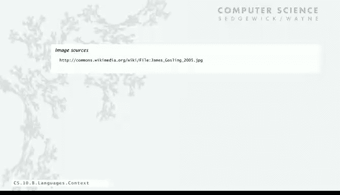

# 普林斯顿大学《计算机科学：以目的为导向的编程（Java）｜Computer Science： Programming with a Purpose》中英字幕 - P40：40_10_03_Java语言背景.zh_en - GPT中英字幕课程资源 - BV1Jp421R78R

Now let's take a look at Java in the context of these other languages that we've discussed。

This slide is from one of the early lectures in this course why do we use Java。

 while it's widely used widely available， it's been under development for several decades。

 it's got all the modern abstractions and it has a lot of automatic checks for mistakes and programs which are really useful for all programmers but particularly beginning programmers。

And Java is the Java economy is huge， it's using all kinds of devices for all kinds of applications nowadays。

 from supercomputing to medical devices to your phone to the Mars Rover， millions of developers。

 billions of devices。So why do we use it in this course Well here's our checklist by comparison with these other languages that we described。

 they were all widely used and they were all widely available， although you have to pay for MATLAP。

But they don't all have really a full set of modern abstractions。 C doesn't have objects。

 Matlab kind of has objects， and Python has modern abstractions。

 but you might not say that it embraces them without going into too much detail。

Modern libraries and systems， probably in C++ you could say it although as time marches on in the internet economy and mobile computing and so forth。

 really Java's the one that's got the modern libraries and systems。

Mat Lavin and Python are maybe plugged in who will give them checks。Automatic checks for bugs， 12。

 they all do it to some extent， but we're going to call compile time type checking really a must for CNC+ plus they get the check X because of the problem with memory leaks。

So anyway， lots of these points are debatable but we use Java in this course。

 because from our point of view， there's check marks all the way across。

So that's fine and so is Java perfect why should we learn another programming language Well there's lots of reasons to learn a new programming language。

 it might be that it offers something totally new you might get a job or work in a research group where everybody else is writing programs in that language and you need to interface with them so entirely possible that you need to learn a new programming language for that reason。

 as soon as you get a job or change jobs。It could be that the new programming language is better than Java for the application at hand。

 there might be something that a particular language is very particularly suited for or built for for the application that you're working at。

Often， a good reason to learn a new programming language is just the intellectual challenge。

 In the second part of this course， we have an imaginary machine language。

 It's fun to program in that language。 and that's true of many programming languages。

Sometimes there's an opportunity to really learn something about computation by studying another programming language or another point of view。

Or maybe there's just a new style of programming that you don't know that you would be introduced to in this language。

 so there's plenty of reasons and most people can expect to learn new programming languages as time wears on。

This is just some examples from things that I can remember like off the top of my head in the 1960s we wrote programs in assembly language where we had to pick one of 256 instructions and every line of code we wrote corresponded to a machine instruction so C was definitely something new in that context that was a high levelvel language where we could write things like if and while and we could use functions in libraries and reuse codes and all kinds of things。

 definitely worth learning something new and then by the 1990s the idea of data abstraction became very。

 very important which allowed us to write really big software programs that could share libraries and make use of extensive libraries and now in this millennium there's all。

Of things offered by new programming languages that are built for the web。

 for developing for the web that use scripting and directly interpret for behavior and web type development projects。

 those are just a few examples。I do want to talk just for a bit about programming styles because we'll talk about completely there's different one at the end of this lecture and then there's object or program that we've already talked about the most natural is procedural where we just execute one instruction after the other that usually we compile our programs into machine language and machine language is kind of procedural so that's what C was and that's what Java as we taught it before we get the objects is like。

So Python in modern web development languages like Ruby are usually interpreted。

 it's like command execution， it's like what we type at the command line， compile this program。

 move this file and so forth， you can write procedural type programs in scripted languages like we did with Python。

 but usually interpret it， it's just a different programming style how you expect to be using it。

Now there's also special purpose languages that are optimized around certain data types like the Postscript programming languages optimized around graphics。

 and we'll talk about that in part two of the course or MATLb optimized around matrices and that's going to lead to a completely different style if you're reading only worrying about a couple data types for most of the code that you write。

And then object oriented programming languages we'll talk about in more detail in the next segment and it really is a different style and it took a long time for a lot of programmers to adapt to it and there's still plenty of programmers out there that haven't taken the time to really learn object orient。

 how to make use of object oriented programming effectively。

 so already with this course you're head of a huge fraction of people out there doing programming。

And then there's functional languages and we'll talk about that in the last segment where we treat computation as the evaluation of functions and it's got a lot of interesting ramifications and it's a completely different programming style that many people are embracing nowadays。

 it's kind of analogous to Java's automatic memory management winning out over the explicit memory management and CNC++ people were worried about efficiency。

 but in the end the convenience definitely won out in many people feel the same way about functional programming languages in many ways it's easier to express computations for lots of applications in these languages so it's definitely worthwhile to look at and we will at the end of this lecture。

