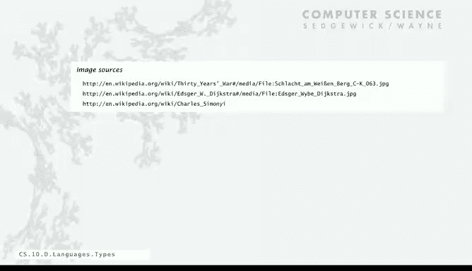

# 普林斯顿大学《计算机科学：以目的为导向的编程（Java）｜Computer Science： Programming with a Purpose》中英字幕 - P42：42_10_05_类型检查.zh_en - GPT中英字幕课程资源 - BV1Jp421R78R

We can't leave the topic of object orient programming without digging in a little deeper on tight checking。

So we've talked about and emphasized throughout Java。

 the idea of static or compile time type checking。All variables must have declared types and the system checks for type errors at compile time cant even run your program unless the system knows that operations that you're specifying are compatible with the types of variables that are involved。

The alternative is called dynamic or runtime type checking， which is what they do in Python。

Java also does summer and timetime checking， but let's talk about this contrast。

In the idea is that the values， not the variables have defined types in the system。

 therefore can check just when it's time to perform an operation just in time that it's got the right types。

And so these are two dramatically different approaches to looking for type errors and question would be。

 which is best， of course you can never multiply a string by a double value that's an error and the question is。

 should you find out a compile time or run time。I I have to say that there's ongoing religious wars about this。

 some people say static typing is just not worth the trouble it's too much of a pain to have to type the values specify the values of all your variables and check that on the other hand maybe the compiled code that we get out as much more efficient if we know that the types are okay。

 maybe the code is more reliable if it's carefully type checkedcked。

 maybe but on the other hand maybe there's a lot of advanced features like like generic types that we want to write programs that work on many different types of data。

 maybe it's too hard to use with static typing and there's many many， many。

 many other questions that come up and people still really argue vociferously on both sides and I'll give you an example。

So one idea is that while type checking is one way to look for errors。

 but another thing that we can do， we have computers。

 we can test our programs by writing a program to produce a lot of inputs and check our programs against the inputs that we produce。

 we automate program testing。And even in the 60s， Dyktra， who's a character that we've seen before。

 said this about program testing。It can be a very effective way to show the presence of bugs。

 but it's hopelessly inadequate for showing their absence。

And Dyster was a pioneer in the idea of trying to ensure through mathematical reasoning that programs would be correct。

 static typing can really play an important role in that。By contrast。

 there's plenty of people out there nowadays and you can find them all over the web。

Here's a typical example， since static type checking can't cover all possibilities。

 you will need automated testing。Once you have automated testing， static type checking is redundant。

When I saw that quote， I showed it to my colleague， Dave Walker， who's a world expert in this field。

 and here's the response that he wrote。Dear random Python blogger。

 why don't you think of static type checking as a complementary form of completely automated testing to augment your other testing techniques？

I actually don't know of any other testing infrastructure that is as automated。

 fast and responsive as a type checker， but I'd be happy to learn。By the way。

 type checking is a special kind of testing that scales perfectly to software of arbitrary size。

 because it checks that the composition of two modules is O based only on their interfaces without reexamining their implementations。

Conventional testing doesn't scale the same way。Also。

 did you know that type checking is capable of guaranteeing the absence of certain classes of bugs？

That is particularly important if you want your system to be secure， Python can't do that。

The idea is that programming the way we've taught it with modular programming that are put together to make larger programs with static type checking really enables this kind of approach where we use the power the computer to help us reason about what our programs are supposed to do。

 specify as much as we can what we think they're supposed to do。

 and with the idea of composing modules to get proofs about bigger and bigger programs is an extremely powerful one in modern systems。

I didn't give the random Python blogger a chance to respond to Dave。

 my personal opinion is that there are way， way， way。

 way too many possibilities for inputs for automated testing to be effective at all。

 so I'm with Dave。And I'll just finish off with an old story from early programming languages。

 so at the beginning with machine languages， there was not much support for types and that was one of the actual innovations of C。

And Charles Simononei who was a programmer in the 1970s at Xerox Park。

 had the idea of making a program easier to understand by encoding the type in the variable name itself we don't even do that in modern languages there were some old languages that did that the fourran language if a variable was Ij orK it was an integer。

 otherwise it was a floating point value， but Charles say。

 well I have to write programs that deal with strings and other types of data。

 I'm going to put the type in the first few characters of a variable name。

 now again we had tiny computers and there were limits and so you could only have an eight character limits so it'd leave out the vowels and then trunket so a typical variable name in Charles's code would be ARR U8 FBN。

And so that's an array of eight bit integers that are unsigned and the variable name is short for Fibonacci and to Charles it was much more important to know the type than to have a clue of what the variable name was and he and teams of programs that worked with him wrote huge programs based on this system and when you think about it。

 you look at a line of code， knowing the type of the variable just reading the code that's evolved that's a useful thing to have when debugging。

 you can just type check while you reading the code and sure it's got this problem with short vowless verbal names but Charles used that to great advantage he actually built the first version of Microsoft Word using code like this and I tell the story just to teach the lesson that type checking really has always been。

Important in large software systems。 that's not something that can be ignored or that will go away。

