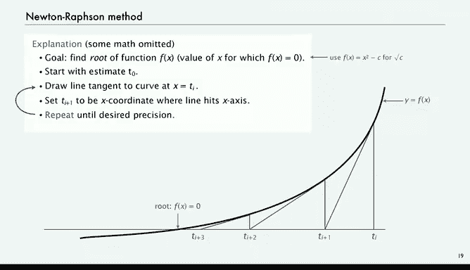

# 普林斯顿大学《计算机科学：以目的为导向的编程（Java）｜Computer Science： Programming with a Purpose》中英字幕 - P6：06_02_03_循环语句-while语句.zh_en - GPT中英字幕课程资源 - BV1Jp421R78R

Next， we're going to look at the wild statement or wild loops that really take us to infinity and computation。

The point of the while loop is to execute certain statements repeatedly until certain conditions are met。

So like the if statement， we evaluate a boolean expression。 If it's true。

 we execute a sequence of statements。And then we just repeat that。

Until it's the case that the bullolean expression is not true。

So here's a simple example that we're going to look at in a lot more detail that shows a wild statement with curly braces and three statements that get executed as long as the Boolean expression is true and we'll look at this one in more detail in a minute。

This is what the control flow looks like。 It's like a straight line program。

 except that there's a loop back for the case。Once the statements are done。

 there's a loop back to check the bullolean expression。

 and if the bullolean expression is eventually false。

 then we go and continue the control flow after the wild statement。

It's a very natural way to express the computation that you want to repeat again and again。

 and let's look more closely at what happens。So this is that same code wrapped in a full Java program with the main and so forth。

 it takes as from the command line， an integer that we put in a variable n and then sets two variables I and V and goes into a while loop。

 what this program does is print powers of two nowadays if you Google powers of  two。

 you might come across this key。So what happens， so we said I to zero and Vta 1。

 here's a trace of this program in operation。Do the Boolean expression。 I less than or equal to n。

 In this case， n is 6。 I' is less than or equal to n。 So the statement is true。

 So we go ahead and perform the statements inside the while loop。

 The first thing says to print out the value of V。 So that's one。

Then we increment I to 2 and we multiply v by 2 that gives us the next power of 2 and then we check is I less than or equal to n。

 it's still less than or equal to n so we print out V that's the next power of 2 increment I compute the next power of2。

 are we at I equals 6 yet no it's still true that I is less than or equal to 6 so we go ahead and print V increment I compute the next power of 2 and we just keep doing this until we get to I equals 6 now we're at 4。

We print out 16， now we're at 5， compute 32， it's still true， print out the 32。

 now we're at 6 and we compute 64， it's still true， so we print it out。Now we get to I equals7。

 we go ahead and compute the next power2， but now we test is I less or equal to 7。

 in this case it's false， so that means we do not do the statements in the Y loop and we just go to the end and that's the end of this program。

So that's a program that prints powers of two， and can put any integer N in and get a list of the powers of two。

And that's prototypical of lots of different programs where you might want to print out a value and then a function evaluated at that value。

Okay， so just to get used to the idea of a while loop。

 take a look at this code and see if you see anything wrong with it。Well， of course。

 what's missing in this code is the braces， and it's not uncommon for beginning programmers to forget about the braces in some programming languages like Python。

 it's enough to indent。 you don't need the braces， but in Java， you definitely need the braces。

And if you do that make that mistake， it's worthwhile to think about what might happen。

 so that's the next thing is what does this program actually do when we run it？

If you were to type in that program and forget the braces by accident。

 you would have to cope with the situation。Well， what it does is it says it sets i to0。

 I'd say n is6。 as long as0 is less than or equal to n， it's going to print out V。

 That's an infinite loop。 there's no way for it to get out of the loop。

 and if you type compile that program and run it， it'll just keep printing ones。

So one of the first things that you want to think about before writing a program that uses loops is what do you do to stop your machine in the case that it's in an infinite loop？

And old machines would just pull the plug or power off nowadays。

 depending on the computer and the system you're using。

 usually something like control C would work to stop it。

 but that's something that you're going to have to look up for your own particular machine。

Let's look at an actual application where having a while loop is going to be able to enable us to perform a computation。

It's a classic problem called implementing the square root function。

 So how is Matt that square root implemented？So I want to type Java square root of this big8 digit number and I want it to tell me it's 7777 or square root of 2 1。

442136 like that， so how am I going to implement that function well。

 there's a famous method due to Newton for computing square root of C that is a fine method for this problem。

So what we do is we initialize the variables， we call it T sub not here to C。

And then what we're going to do is we're going to compute t sub1， T sub2， T sub 3， and so forth。

 and each time what we're going to do is set the next one to be the average of the previous one and C over that one and we're going to keep going until t sub I is almost equal to C over T sub I up to the desired precision。

Now， notice if we get them to be exactly equal if t equals C over t， then t squared equals C。

 So t is square root of C。 So we're getting towards the square root of C。

 So here's just an example for square root of 2 to 7 places。

 So we start with I equals 0 t sub I equals 2 initialized t 0 to C2 over t sub I is 1。

 and then we average， and that gives us t sub 1。 So 1。

5 is our first approximation to the square root of 2。So then T sub 1 is 1。5，2 over 1。5 is4/3s， 1。333。

 and if we average those we get 1。4166667 that's already square root two to a couple of places。

We do it one more time then T sub 2 is 1。4166667，2 over that is 1。

4117 and we average them and now we have square root of 2 out to about five places and one more iteration gives the square root of 2 out to seven places。

Where T subi and two oversat t sub I are equal out to seven places。

So that's the method that we're going to use and that's a classic method。

 it's important to remember that computation was studied way before the onset of the computer。

 scientists throughout classical antiquity for many centuries have needed to perform computations in order to understand their mathematical and scientific models and without a computer they were very interested in efficient methods because all these calculations were being done by hand。

 so we definitely want to benefit from the knowledge that was developed over the previous centuries about calculations and this is a fine example of that。

So let's look at what the method looks like， and it's just implementing in code using a while loop。

 this basic iteration of the Newton's method。So we're going to take a variable epsilon or capital EPS and say 15 places we have a computer might as well let it run and get us a nice。

 accurate answer。We'll take the number that we want to take the square root of from the command line。

 so that's a double， and that'll be C。And we start our variable T to be C。

And then we just continue doing a while loop， what's the condition where we terminate the while loop。

 that's when t minus c over t say the absolute value of that。

 as long as that's bigger than epsilon times t itself， than we're within epsilon。

We're not within epsilon of the exact answer， so we want to perform the iteration。

And the iteration is just average T over C， C over T and T。 So that's atom and divide by 2。

 and then go ahead and print the answer。So that's Newton's method and that achieves the goal of computing square root。

 in this case， to15 places。A very simple computational method performs an interesting computational problem or solves an interesting computational problem with just a single while loop。

Just I'll omit some math or those of you that are interested in the math can fill in some of the details。

 Why does this method work， It actually works to find the root of any function， F of x。

 that's the value of x for which f of x equals 0。 So for square root would say in this formulation。

 F of x equals x squared minus C。And so this is a drawing of the curve。

 what this method actually does in our general method that reduces to the one that we just showed for square root is draw a line tangent to the curve so that's our first guess we draw a line tangent to the curve and that brings us a little closer to the actual root so that's our next guess and again we draw a line tangent to the curve and eventually and actually rather quickly we get an estimate of the root that's really you can do the math to see the basis for the method and see that the calculation that I just showed for the square root of two gets the job done。

Well it's a little bit of math， but our main point for this section is the while loop is extremely useful for performing computations that required iterated calculation。

