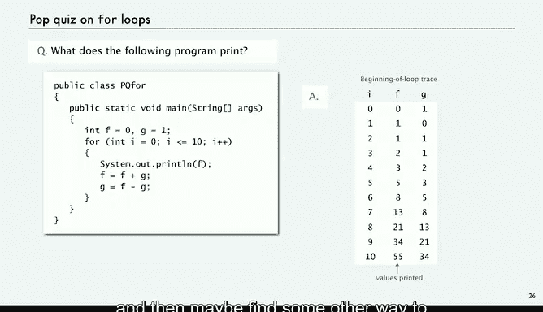

# 普林斯顿大学《计算机科学：以目的为导向的编程（Java）｜Computer Science： Programming with a Purpose》中英字幕 - P7：07_02_04_替代方案-for循环.zh_en - GPT中英字幕课程资源 - BV1Jp421R78R

Now we're going to look at an alternative to the while statement called the for loop。

 it's just another way of formulating loops that sometimes make a program clearer and easier to read。

Just more compact and understandable code。 So over the for loop， it has a number of components。

 The first thing that we do is execute an visualization statement。

Then we evaluate a bullolean expression。 if it's true， we execute a sequence of given statements。

 and then we execute an increment statement， and we repeat that。

And it's a language structure that is set up in this way that is actually equivalent to a while loop。

So here's an example of the use of a four loop to print the powers of  two from 2 to the zero to2 to the n。

Initialization statement， well we have a variable V equals one that's outside the for loop。

 but the for loop itself inside the parentheses has initialization statement， bullolean expression。

 inside the braces， there's a sequence of statements and then the third the last thing inside the parentheses is the increment。

 and it does these things in this order。So actually every for loop has an equivalent while loop where there's an initialization statement that in the case of the while happens right before the while loop。

 there's a boolean expression in both cases that gets tested and there's an increment statement that appears after the sequence of statements within the body of the loop。

And we repeat， so it's just a little bit more compact and understandable code and we'll look at a few examples。

So like here's computing the sum of the first n integers。For equals1。

 I equal n plus plus sum plus equals I， it's very simple computation。

This is a trace and it works just exactly the same way as a while loop。

Compute and factorial same thing with multiplying。 So again。

 very simple computation and naturally expressed with the for loop。Very often in a for loop。

 we have a we're really。Keeping track of something by counting it and so the es1 astic and I++ is quite common。

 so this is just an extension of that， maybe a table of function values and this is2 pi k over n for k from0 through n and that way we can quickly get the values of interest printed out with just one statement that's a for loop。

 here's another example of the use of a for loop， the problem that we looked at last time for printing subdivisions of a ruler。

So we want to print out this  one，2，13，12，14，1， two，13，121。

 so given n inches we want to for every value of I from one to n。

 we want to sandwich I between two copies， let's take a look at what it looks like。

So this is the computation that we looked at last time where we simply had a new statement every time we wanted to expand the thing。

 now we put it within a for loop， we start with a blank for I from one to N。

 we put I between two copies of the last ruler that we computed。So for the last one where I is4。

 in this case we'd already have ruler equal to 1，2，1，3，121， we put a copy of that and that's ruler。

 and then we put the value of I and then we put another copy。And then once we're done。

 we just print out the whole string。So this is just the value of ruler shown in the trace after each value of I。

So type Java ruleer 4， we get our answer that's fine。

 Now what's interesting about this computation and we reflecting about all the time when you use loops is that you can really express a huge amount of computation with a small amount of code in this case pretty easy to produce a huge amount of output with this program。

 it's a tiny program， what happens if you say Java ruler 100。Well。

 you're going to run out of memory because what you're saying is print out two to the 100th minus1 integers in your output。

 and that's way more integers that could possibly be printed out in this universe。

It's worth reflecting on that that's what I meant when we have loops， we're going to infinity。

And just to cement your understanding of loops or to think about it， let's say。

 how do you figure out what this program prints。Well， again， for the first many。

 many loops that you write， what you're going to want to do is trace the operation of the program by writing a table with the values of all the variables as the program proceeds。

 after a while you'll probably see a pattern， or at least develop an understanding of what the loop is supposed to do。

So in this case， here's what it prints out and if you look at those numbers。

 you might recognize the Fibonacci numbers and then maybe you can find some other way to convince yourself that that computation f equals f plus g G equals f minus G actually winds up giving us the Fibonacci numbers。

But for now， it's just another example of the use of a for loop， and we're going to see many。

 many more examples so it's worthwhile to cement your understanding of what a for loop does。

