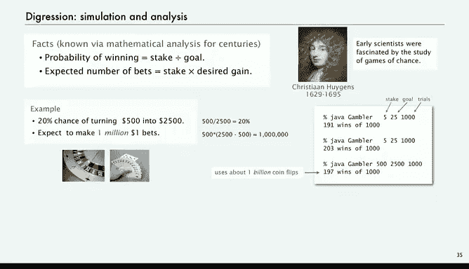
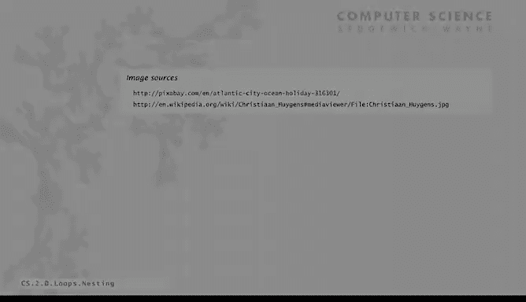

# 普林斯顿大学《计算机科学：以目的为导向的编程（Java）｜Computer Science： Programming with a Purpose》中英字幕 - P8：08_02_05_嵌套结构.zh_en - GPT中英字幕课程资源 - BV1Jp421R78R

Now we're going to amp up things a little bit more even to show the idea of nesting。

 which allows us to build up programs that are much more complicated than the ones we've considered so far and can help us perform useful computations and we'll have a good example of that。

So the idea of nesting is that when we say in a conditional or a loop that you have a sequence of statements as the alternative。

 any one of those statements could itself be a conditional or a loop statement。

This gives us very complex control flows， but still we have the ability to try to understand what they're doing because everything is in terms of just conditionals or loops。

But definitely these types of programs are more challenging to debug than the simple ones we've looked at so far。

This is just an example of some nesting and we'll look at this program in much more detail later。

 so it's in the middle that ifL statement is nested within a while loop and that while loop is nested within a for loop and there's another if statement nested in there so that's what nesting is all about and we'll take a look next it how to put together programs using nesting。

So here's a very simple computation given an income。

 calculate the proper tax rate according to this table， income less than 47。

450 should be 22% and the next highest range should be 25% and so forth。

So one way to attack this problem is to use nested if Elf statements。

So the first one says if income less than 47， 450 rate equals 0。22。

 that's what we're supposed to have。Else， then the incomes bigger than 47， bigger we get to 47，4，50。

 So next we test whether it's less than 1，1，4，6，50 and set the rate appropriately。 and then else。

 then we can consider the next case。 This is nested， if statement to solve this problem。

 if statement within an if statement within an if statement within an if statement。

4 levels of nesting。That's a perfectly well defined way to perform that computation。

Now here's a quick pop quiz， what about this code here seems like sort of the same code。

 but not really you need those else clauses。Without the else clauses。

 the initial three if statements don't do anything at all。 It's just like running the last one。

 So I definitely need those else clauses。Now you notice this time there's no braces and it's possible to write chain if then else is without braces。

 but definitely you want to read in the book about that case because there' its potential that there could be ambiguity in what your program says and so that's just to note we try to avoid a lot of nesting of this sort。

 and if we think there might be ambiguity， we use braces in our code。

To illustrate the use of nesting in an actual application。

 we're going to look at a famous problem known as the gambler's ruin problem。

So I imagine a gambler going off for a weekend to a casino。

And he starts with a certain amount of money， let's call it stake。

 and he's going to just go and place 1 fair bets of $50-50 chance of winning or losing and just keep going there's two possible outcomes。

 one is that the gambler runs out of money， we'll call that a loss， gambler goes broke。

And the other outcome will say the gambler sets a goal。

The outcome is that he actually reaches the goal before going broke。

So whatever gambler would want to know is what's the chances of winning and how many bets until the winner loss。

 that's going to depend on the stake and the goal， and so maybe the gambler would like to know how to set those parameters to fit in all the gambling that he wants in the weekend。

So what we're going to do to study this problem is what's called Monte Carlo simulation。

 we're just going to simulate the process and keep track of the results we'll use the simulated coin flip we already did that with the ifF statement and we're just going to repeat doing that and just keep track of all the statistics to try to get a handle on these two questions for the gambler。

Gaamler's ruin problem。So here's the code that gets this job done of simulating the gambler's ruins problem。

 It's a fair amount of code， and it's got this complicated structure of an if within a while in a four and so forth。

 But if we take look at a look at the constituent parts of the code。

 it's not too difficult to understand what it's doing and it definitely gets this computational problem done。

So first thing we do is get the parameters from the command line。

 so stake is the amount that the gambler starts with goal is the amount that the gambler will declare victory and walk away with and then if we take a third variable which is trials from the command line that's the number of times we're going to run the experiment of starting a gambler out with stake doing fair bets until either he runs out of money or hits goal and usually we' run experiment a lot of times so this for loop has a variable T and all tea's doing is keeping track of the number of trials that we do so say we run a thousand trials t'll go from zero to 1 thousand00 and then run the code inside a thousand times that's our experiment。

We have a variable wins that we keep track of the number of times the gambler's wins。

 and then what we're going to print out is the number of wins out of how many trials and then we can use that to figure out our percentage chance of winning。

So that's a for loop inside the for loop is just run one experiment。

And so we have a variable cache that we start at stake and inside to run the experiment is a while loop as long as cache is bigger than zero and less than goal we flip a coin and so we flip a coin the same as before。

 do a random double between zero and one if it's less than a half we win and otherwise we lose and we decrement cash and we stay within that while loop until either cache is zero or cash is goal So if cache equals goal then we increment wins and keep track of of the wins so one be is that if statement if the goals meant you count the win and then we print the number of wins and trials that's the gambler ruin simulation code and not that complicated when you break down the purpose of each one of the statements。

So if we run this for a stake of five， a goal of 25， and we do 1000 trials。

 we're going to win 191 times out of 1000， that tells us。So that's gambler's ruin simulation。Now。

 actually this one， this particular problem， it's been known for centuries。

 actually back to the 17th century， that you can do mathematical analysis to realize that to prove that the probability that you're going to win is the stake divided by the goal。

So in our case， with a stake of five and a goal of 25， that's a one in five chance of winning or 20%。

And the expected number of bets that you're going to have to make to either win or lose is going to be stake times the desired gain。

 So let's look at some examples， So this is what the math says。

 you have a 20% chance of turning $500 into $2500， $525 is $20%。

 but you're going to have to make a million1 bets to do that so you want to figure out how long it takes to make a bet whether you get this done in a weekend and you only have 20% chance of winning so you can adjust your stake and goal to try to figure out what goes on。

Now we can use our program to test these things。 so this is just for 5 to 25。

 but it's the same ratio。 And yeah， we get about 200 things and then we can test this one too。

 and sure enough， it's about 20% chance of winning。Now。

 what's interesting to notice for this little run here， it's the same code。

 we just ran the parameters higher。 We made a billion coin flips there。

 That's before we were doing just a few computations with this program just by typing it with bigger parameters。

 we did a huge number of coin flips and taking a little time， but not too much on a modern computer。

So the idea of this is that in this case， what we've done with computer simulation is to validate the mathematical analysis。

So for this problem， the analysis is simpler if you happen to know what the math is。

 but if you want to devise a more complicated strategy that says that after you double your money。

 you'll start making $2 bets and then if you get within what close of your goal。

 you make bigger bets or whatever you want， whatever type of strategy you want。

 you probably are not going to be able to do the math but you could still write the program and do the simulation。

So just a digression is that simulation is a very， very powerful tool and can sometimes do things that even mathematical analysis can't。

 the best thing to do might be to do simulation。That's a digression。

 I think our point for this segment is that you can write a pretty complicated and interesting program with what you know now about loops and conditionals。

