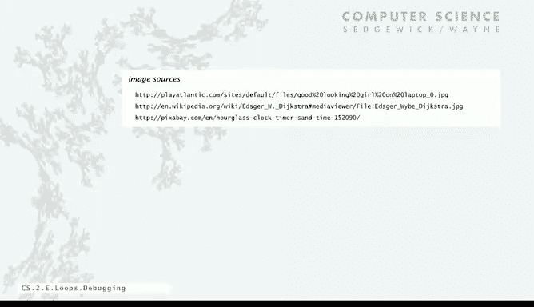

# 普林斯顿大学《计算机科学：以目的为导向的编程（Java）｜Computer Science： Programming with a Purpose》中英字幕 - P9：09_02_06_调试技巧.zh_en - GPT中英字幕课程资源 - BV1Jp421R78R

Okay， we're going to finish off with a topic that's absolutely a must to cover if we're going to be writing programs as complicated as the gambler's ruin simulation。

 and that's debugging。As it turns out， most programmers know well that 99% of the time that you spend developing a program is going to be debugging even for experts。

So what's a bug， a bug is a mistake in a program you are going to make mistakes when you write programs。

 everybody does， it's quite normal and what we're going to talk about is the process of eliminating bugs from programs using the edit compile run cycle that I talked about for programming development already。

This is a quote from one of the first programmers， Maurice Wilkes， who said。

As soon as we started programming， we found out to our surprise。

 it wasn't as easy to get programs right as we had thought。

I can remember the exact instant when I realized that a large part of my life from then on was going to be finding mistakes in my own programs。

 And that's what it is to be a programmer。 We're going to spend time finding mistakes。

So I want to do an example from one of the programs in our book that illustrates a lot of the things that you might encounter while debugging。

 although every process and every sequence of mistakes and corrections is unique。

 this will at least give you some idea of the kinds of things that every programmer。Faces。 now。

 you might say， well， why doesn't the computer just find all the bugs， execute and debug my program。

 please just find the bug to your computer。 Actually。

 there's a profound reason why this is impossible that we'll talk about at the end of the second part of this course。

So bottom line is programming is primarily a process of finding and fixing mistakes。

 and it's a process， and that's what we're going to do in the next example。

So the reason that it's challenging is when we have conditionals in loops， we have a huge。

 huge increase in the number of possible outcomes and the number of possible flows of control in a program。

If we have a program with no loops， there's only one sequence like the ones we talked about in the last lecture。

 just go through and execute all the instructions， but if you have n conditionals in there。

 all of a sudden you have two to the end possible execution sequences and once you add a loop。

 there's no limit on the number of possible things that could happen it's quite profound difference the number of possible outcomes your program has to work for all of them and you have to somehow figure out when it's not where the problem is and like the gambler's ruin situation that we did most programs are even way more complicated with this and they have numerous conditionals in loops with nesting and so there's just really a lot of things that can happen。

Now the good news is that with conditionals and loops。

 we have the structure that really helps us to understand our program and we can reason about them as units and really help them help understand what they're doing。

Initially in old languages and lowlevel languages and machine level languages。

 those types of languages had a branch or a go to statement that really gives arbitrary structure program could just with that you could label a statement and then somewhere else you could have a go to that statement and you would have a structure that was arbitrarily complicated and programmers used to depend on using the go to it wasn't until the late 60s when a famous computer scientist Edco Dyktra argued really persuasively in a famous note called go to considered harmful that really people shouldn't be writing programs with arbitrary structure that conditionals and loops were good enough it took a long time for most programmers to be convinced of that so he says the quality of。

Programr is a decreasing function of the number of go to statements in the programs they produce。

 It took a long time for people to really believe what Dykester was saying。

 but nowadays we don't use go tos very much at all。 Okay， so here's our example。

 The problem is that we're going to solve with this code is factor a large integer in。

So here's a seven digit integer it's two times 2 times 7 times 13 times 13 times 397。

So given any integer we want its factors， if the integer's prime all we get is the one thing。

 and we want this to work for as large integers as we can do。

There's actually a very important application of this from cryptography。

 the cryptoytems that a lot of the world's e-commerce is based on。

 it's based really in the difficulty of factoring， won't get into the detail of that just to motivate that this is not just a math problem。

 this is a problem with very important practical consequences。

 the security of internet commerce depends on the difficulty of factoring large integers。

Now let's look at a simple program for solving it， so what we're going to do is consider each integer I less than n the number that we need to factor。

As long as I divides n evenly， we're going to print it out because it's a factor of n and then we'll just replace n with n over I。

 and that's the rest of it that still has to be factored。

 there might be another factor of I so we'll keep printing out factors of I till there's no more I and then we'll consider the next in I less than n。

So again， the idea that any factor of N overI is a factor of n in I itself might be a factor of N overri。

 that's why it's a wild loop。So that leads to this code here that say。

 I might have typed in when working on an example program for the book。

Take we'll use a along so we can get big integers and we take a along from the command line and then for values of I that are less than n。

 we can check if it divides evenly， that's the remainder you get when n is divided by I as long as that zero printout I and then divide I out of n。

Now this program has bugs， this is an example of debugging a program and we know this program has bugs。

 so let's look at the process of debugging this program。So first thing is。

 and this is you'll find yourself when debugging in this mood quite a bit。

 trying to tell the computer what to do。The first thing is called synyntax errors。

 your program is not going to work properly unless it's a legal Java program and this process Java helps with quite a bit。

 it can help you at least tell you whether or not it's a legal Java program because it can't do much with a program that's not a legal Java program needs for the program to be legal before it can translate it into machine language and execute it。

So what we always do is find the first error， try to compile the program。

 and it'll tell you there's an error， so in this case what happens。

 I try to compile this program and it says it expected a semicolon。Right after the long。

 and sure enough， oops， I forgot my semicolonons people。It happens to everyone。 forgot the semicolon。

 And I said， okay， I forgot that one。 Maybe I forgot some other ones。

 and I go and I check and I add the semicolonons that I need。 So that's the first compiler error。

 So that's good。 So， and then we're gonna repeat until there's no compiler error。

 So let's try it again with that one。it says can't find symbol variable I in the for loop。

 well that's a very helpful error message， I have to declare the type of that variable， it's an int。

 so I got to put in int。And that's nice when it's really nice when the compiler pinpoints the error for you and you can figure out immediately how to fix it as in these examples。

 that's not always the case and then once you get that done。

 then you can compile your program and it doesn't find any errors， that's the first step。

 eliminate the syntax errors in the program。Compil is， your friends， helping you find those errors。

 get rid of them all， and now you have a program that will run。Now。

 this program still has plenty of bugs because it's not going to， but as we'll see。

 it's going to run， but it might not produce the answer that we want。So that's the next thing。

Get rid of the runtime errors Does a program do what you want it to do， It's a legal program。

 but what does it do， you need to run it to find out。

 So that's how we run programs We compile it and then we run it and it says exception Tread Ma array auto bounds exception 0。

So I mentioned this one before， you'll get this one a lot， I still get it a lot。

 it means that again we're going to find the first runtime error and that's the first one。

 that means I forgot to give it the number， I want to factor saying what am I supposed to factor。

 you didn't tell me anything？So that's a runtime error， but that one's easy to fix。

 just fix that one and keep going。 So now I'm going to say， okay。

 I want it to factor in 98 and it says， okay and it' actually tells me the line It says you try to divide by zero on the eighth line And so there's only one place well divide it n equals n slash I but computing the remainder after division is' kind of like dividing So it's that n mod that is causing the problem and sure enough。

 I'm doing it for I equals0 and even maybe later on I get n over I well I didn't expect that0 is a factor I just type0 out of force to habit。

 I really got to start that at20 is not going be a factor of any number and and one's not what we want。

 we want the factor is bigger than1 so we start got to start at2。

 So find the first runtime error fix it and repeat and then maybe you'll find the next one。

Here's the problem， I type job Eors in 98， and it goes in an infinite loop printing out tooth。

I forgot those braces again。 And the only way to figure that out is to study it and say okay。

 what's it doing And it's printing out a lot of twoths So I equals2。 And after a while。

 after to figure out， okay， I forgot the braces。So that's good and now Java Factor is 98 and I got 277 and I'm happy because two times 7 times 7 is 98。

It's not exactly totally right， but we're getting there quite a lot further along than when it was telling us we didn't have any semicolonons。

But there's still some bugs so we have to keep going so we got it to work for one case and that's a huge victory getting it working for one case。

 but really you want it to work for lots of cases， does it always do what you want to do so you have to test it on lots of different inputs and this we get the 98 it's not exactly right because we want a new line after that second7 that's not like perfect output。

But if I type also， if I type factors 5， if I get no nothing， it's not good。 if I type6。

 and don't get the three。That's not good。 so now it's getting a little more complicated。

So what I often do in a situation like this is add some code that prints out values of some of the variables to help me find the first error。

Now， people use debugging systems that help give you values of variables and there are very sophisticated tools available。

 but for a beginning programmer we recommend you want to know the value of a variable。

 put in a print statement that prints it out。So in this case。

I want to print out the value of I and N each time through the loop。

 and maybe when I see those values， I can figure out what's going on。

So when I try to factor five I goes two，3， four， when I do six， I get my two and then it does two。

 three， but doesn't print anything out and I study it for a while and I say， oh okay。

 here's what happens is after we've done dividing out all the factors we might be left with a prime。

We have to print that out。So if it's not one， we have to print out the value of n。

 and then we can do the new line at the same time and fix all these errors。

So find the first error and repeat and in this case， what we need to do is if ends bigger than one。

 print it out on the print line and then otherwise just put on the print line。

So now I type Java factors5 and what happens and this always happens to me and it will happen to you forgot to recompile so I get this fix my error I'm very happy and ready to go and I run the thing and it gives me exactly the same thing as before and every programmer will tell you some story about how they spend hours and hours looking for the bug that they already fixed when all they had to do was recompile it and then run it and then it works fine。

So that's testing the program to get it to work for as many cases as you want。

This program works pretty well。 now。 It's factoring lots of things that I couldn't have otherwise factored。

 It's still got a bug that I want to talk about to finish up。 And that has to do with performance。

So now I have a working program but the question is。

 is it efficient enough to actually solve my problem and so what I want to do is if I'm eventually going to be faced with a big problem。

 I have to test it on increasing problem sizes so for this one I just type a bunch of ones and see if it can factor a bunch more it works fine add more it's going okay but now it gets kind of stuck。

And so。It might work， but it seems to be way too slow。

 so I really wanted to be able to factor numbers that big。

 so I'm going to study the program to try to understand what I could do to make it so that it could solve these big problems。

And in this case you may actually need to change or adjust the method you're using to get it fixed。

 but sometimes we stay in this loop for really long periods of time find a way to improve it to make it better and that's definitely part of the process of developing a program performance bug can be just as bad as other types of bugs。

 So here's the method that we're using and you have to think about this for a while。

 but one thing we can do is we don't have to try all the values of I less than n actually if。

I times I is bigger than N。 We've already tested all the smaller factors。

 There's not going to be a larger one。 We would have already found it if there's one that's larger than the square root of n。

 we would have already found the smaller one。 So we can stop when we get to I times I equals n or I bigger than n over I。

 All that computation is wasted。So to implement the change is just a couple of keystrokes rather than I go into N。

 we just go to N over I。 and then immediately we get that other factor。 that's a big big change。

And now we've got not bad， we can run some big programs that one's prime and so we can just run some experiments and just here's some experiments that first of all that show the effectiveness of this N over eye fixed and so whereas the old one would have taken 21 hours it's still instant and you need some analytic number theory and so forth to get these estimates but to take a calculation from 2。

4 years to 2。7 seconds is definitely worthwhile so with this we can factor up to 18 digit numbers in a reasonable amount of time or maybe even a bit more。

So the lesson of this last thing is that performance really does matter， and by the way。

 internet commerce is still secure because it depends on factoring really huge integers like 200 digit integers and there are plenty of people working on trying to come up with fast algorithms for that that's an interesting aside。

So here's the summary so I talked about last time about program development being a three step process I'd like to say now it's really a four step process we edit。

 we compile， if we find syntax errors， we fix them。

 if we run them if we find semantic or runtime errors we fix those and then go back into the process but then once it's running you really want to test it on realistic and real input data and see if you've got performed is it way slower than it should be or are there ways to improve it and only after you're satisfied that those four steps have gone really well can you consider your program to debbuged and that's when you submit it to be graded or to a boss for some kind of independent testing and improve approval so that's a summary of the process of debugging。

Using a computer is actually quite a bit easier， telling it what to do if you actually know what you're doing and with your eye entering into a process like this with your eyes open is something that you'll find we said at the beginning that program is a satisfying creative process and understanding these aspects of debugging or definitely going to help make it that for you。

