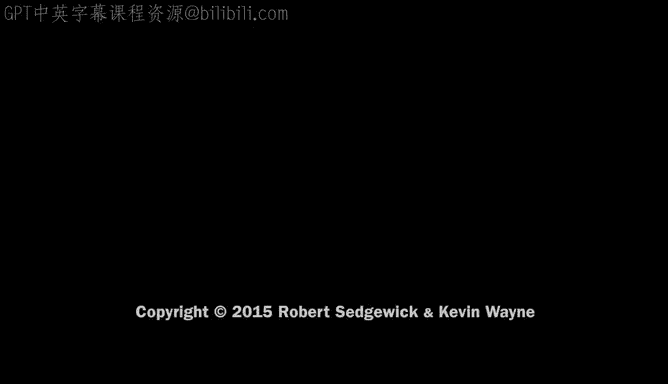

# 普林斯顿大学《计算机科学：算法、理论和机器｜Computer Science： Algorithms, Theory, and Machines》中英字幕 - P10：10_03_06_实现方法.zh_en - GPT中英字幕课程资源 - BV1Ct42177Y6

So with linked lists， a rather powerful data structure， we can actually。

Develop an implementation of the pushdown stack that actually implements our AI API and meets our performance requirements。

So again， push down stacks an idealized model of a lifeos storage mechanism。

 we have an ADT that allows us to write useful Java programs that manipulate stacks。

And that's our API， but we also have performance specifications。

 the operations have to be constant time， the memory use has to be linear in the size of the collection。

 and there have to be no limits within the code on the collection size。

And if implementation doesn't meet these specs， we say it implements some other kind of。

Data structured， but not a push down step。So let's take a look at how we're going to implement it using a linked list。

So that's our choice we're going to use， we're going to hold the collection in a linked list。

So the objects in the stack are going to be nodes in the linked list and we're going to have just a single variable first that points to the node within the linked list。

So what are the instance variables in the constructor that are going to support this use？

So we're going to have a variable first， which is the first thing on the linked list and that's going to get initialized to null。

 and we're going to keep track of the size of the stack in an int variable n。And we need the。

pririvate class node， and we can use generics within that class that allow us to develop this code to hold for a stack to hold any type of data。

And then every node has a next field that has a reference to another node。

 so that's the code that we need for instance variables in constructor。

 our instance variables are reference to the first node and the size of the stack。

Now just there's something that doesn't quite work， that's not really a problem here。

 but it'll come up later or it might come up if you try to imitate this code in other contexts。

 you can't declare an array of generics so you need to cast if you need an array of items for some other more complicated thing you have to cast it from an array of objects and I'll just list that for later reference。

Okay， test client， our test client is the same。Except now we can use the generic stack。

 which we didn't do for the strawman thing that we had before。So that's a test client。

 and so we expect it to work no matter what type of data that we put in。

 we could have a test joint client with integers or whatever else in our implementation would work as well。

So that's what we expect at in the implementation， so now all this left is the methods。

So how are we going to implement the various operations？

So first one is empty one thing we could do is just say is first null。

 if there's no nodes in the link list then the stack's empty since we have N we could also test if n equals zero as well and that's equivalent。

Okay， how do we push a new item onto the stack？What we're going to do is put a new node at the beginning of the list and we looked at that code so that's second gets first。

 first gets a new node， first that item gets the item that we're supposed to put on the top of the stack。

 first do next gets second that's exactly the code that we looked at for adding a new node to the beginning of a list。

And then we increment in because we have a new item on this stack。

So that's the implementation of Pors。And remember first is our instance variable。Pop。

 so what do we want to do for P， the most recently added item to the stack is the first item on the list。

So what we want to do is remove and return the first item on the list。

So in that case we pull off first dot item that's again。

 this is the code that we looked at for list processing。

 say first equals first dot next and that makes first skip that first node and releases it for garbage collection and then since we removed an element from the stack。

 we decrement in and then return the item。That's the implementation of P。

And then size is just return in as before。So it's a bit more complicated than the one liners that we saw with the array representation。

 but the significant difference is that this implementation is going to meet our performance specifications。

So that's the summary， there's the instance variables， there's the nested class for node。

 those are the methods and the test client we already looked at， and it's got the behavior we expect。

Here's a trace showing the new items going on to the front of the link list。

And then being removed from the front of the linked list。

I pop from the beginning and push to the beginning of the list。呃。And just looking at this diagram。

 you can see that the space use is just a multiple of the number of items in the stack always。

 if the thing grows to be a million， there'll be a million nodes there。

 but when it's three there's only three nodes there and that's meeting the performance specification in terms of space。

And that's a trace。So now let's benchmark this against our specifications。

So it completely implements the API that we gave and all operations are constant time。

There were just a couple of statements to add an item to the beginning or remove an item from the beginning。

The memory use is linear in the size of a collection。

 and there's no limits within the code on the collection size。Again。

 at the beginning of this lecture you may have thought that this is a relatively simple problem。

 it's all to bother， but when you think about it， this is actually a profound step in being able to meet performance specifications of this sort and as you saw。

 the ability to do so is extremely important in real-worl applications like the Java virtual machine or postscript and it's all made possible by introducing the concept of a linked data structure。

It's also possible to implement the Q abstraction with a singly linked list and you can see that in the book。

BQ is the same， NQ is a little more complicated， and you can see that in the book。So in summary。

 we've got these two basic data structures that are fundamental abstractions。

 they only differ in the order in which items are removed。

And they have these performance specifications， they really characterize them。

You'll find implementations that claim to be stacks and cut to don't meet these performance specs and they're generally not really acceptable for industrial strength applications。

And what this points out for us is that link structures are really a fundamental alternative to arrays that allow us to do things that we can't do just with arrays。

AndIn particular， we've shown in this lecture， they enable implementations of the stack and Q abstractions that we couldn't meet just with array race。

Next， we're going to talk about symbol tables， which is a more difficult problem that uses doubly length structures again。

 to meet performance specifications and that support a huge range of important applications。

