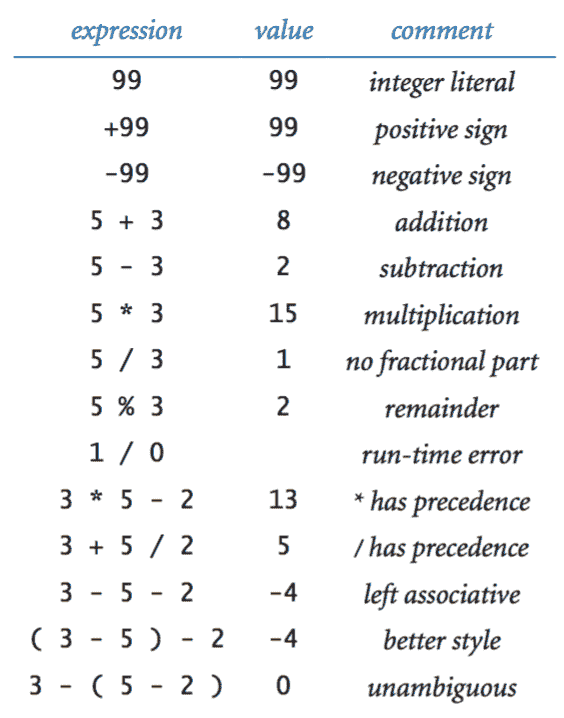

# 1.2   数据的内置类型

> 原文：[`introcs.cs.princeton.edu/java/12types`](https://introcs.cs.princeton.edu/java/12types)

*数据类型*是一组值和在其上定义的一组操作。例如，我们熟悉数字及其上定义的操作，如加法和乘法。在 Java 中有八种不同的内置数据类型，主要是不同类型的数字。我们经常使用系统类型来表示字符字符串，因此我们在这里也考虑它。

> 

**术语。** 我们使用以下代码片段来介绍一些术语：

```java
int a, b, c;
a = 1234;
b = 99;
c = a + b;

```

第一行是一个*声明语句*，声明了三个*变量*的名称为`a`、`b`和`c`，它们的类型为`int`。接下来的三行是*赋值语句*，改变了变量的值，使用了*字面量*`1234`和`99`，以及*表达式*`a + b`，最终`c`的值为`1333`。

**字符和字符串。** `char`是字母数字字符或符号，就像您键入的那些。我们通常不对字符执行任何操作，只是将值赋给变量。`String`是一系列字符。我们对字符串执行的最常见操作称为*连接*：给定两个字符串，将它们连接在一起以生成新的字符串。例如，考虑以下 Java 程序片段：

```java
String a, b, c;
a = "Hello,";
b = " Bob";
c = a + b;

```

第一条语句声明了三个变量的类型为`String`。接下来的三条语句为它们赋值，最终`c`的值为`"Hello, Bob"`。使用字符串连接，Ruler.java 打印了标尺上各个刻度的相对长度。

**整数。** `int` 是介于−2³¹和 2³¹ − 1（−2,147,483,648 到 2,147,483,647）之间的整数。我们经常使用`int`，不仅因为它们在现实世界中经常出现，而且在表达算法时自然产生。Java 内置了用于整数加法、乘法和除法的标准算术运算符，如 IntOps.java 和下表所示：

> 

**浮点数。** `double` 类型用于表示*浮点数*，例如，在科学应用中使用。内部表示类似于科学计数法，因此我们可以在一个巨大的范围内计算实数。我们可以使用带有小数点的数字字符串来指定浮点数，例如，`3.14159`用于数学常数π的六位近似值，或者使用科学计数法表示，例如，`6.022E23`用于阿伏伽德罗常数 6.022 × 10²³。Java 内置了用于双精度加法、乘法和除法的标准算术运算符，如 DoubleOps.java 和下表所示：

> 

Quadratic.java 展示了在计算二次方程的两个根时使用双精度的情况，使用了二次公式。

**布尔值。** `boolean` 类型只有两个值：`true`或`false`。这种明显的简单性是具有欺骗性的——布尔值是计算机科学的基础。为`boolean`定义的最重要的运算符是*and*、*or*和*not*。

+   *and*:  `a && b` 如果`a`和`b`都为真，则为真，否则为假。

+   *or*:  `a || b` 如果`a`或`b`为真（或两者都为真），则为真，否则为假。

+   *not*:  `!a` 如果`a`为假，则为真，否则为假。

尽管这些定义直观且易于理解，但完全指定每个操作的每种可能性在*真值表*中是值得的。

> 

**比较。** *比较*运算符是*混合类型*操作，它们接受一个类型（例如，`int`或`double`）的操作数，并产生类型为`boolean`的结果。这些操作在开发更复杂程序的过程中起着至关重要的作用。

> 

闰年.java 测试一个整数是否对应于公历中的闰年。

## 库方法和 API。

许多编程任务涉及使用 Java 库方法以及内置运算符。*应用程序编程接口*是总结库中方法的表格。

+   *将字符串打印到终端窗口。*

    > 

+   *将字符串转换为原始类型。*

    > 

+   *数学函数。*

    > 

您可以通过键入方法名称，后跟*参数*，用括号括起并用逗号分隔来调用方法。以下是一些示例：

> 

我们经常发现自己使用以下方法之一将数据从一种类型转换为另一种类型。

## 类型转换。

我们经常发现自己使用以下方法之一将数据从一种类型转换为另一种类型。

+   *显式类型转换。* 调用诸如`Math.round()`、`Integer.parseInt()`和`Double.parseDouble()`之类的方法。

+   *自动类型转换。* 对于原始数值类型，当我们使用具有比预期更大值范围的类型的值时，系统会自动执行类型转换。

+   *显式转换。* Java 还具有一些用于原始类型的内置类型转换方法，当您意识到可能会丢失信息时，可以使用这些方法，但必须使用称为*转换*的东西表明您的意图。随机整数.java 读取一个整数命令行参数*n*，并打印介于 0 和*n*−1 之间的“随机”整数。

+   *字符串的自动转换。* 内置类型`String`遵守特殊规则。其中一个特殊规则是，您可以通过使用`+`运算符轻松地将任何类型的数据转换为`String`。

> 

#### 练习

1.  假设`a`和`b`是`int`值。以下语句序列做什么？

    ```java
    int t = a;
    b = t;
    a = b;

    ```

    *解决方案*: 将`a`、`b`和`t`设置为`a`的原始值。

1.  假设`a`和`b`是`int`值。简化以下表达式：`(!(a < b) && !(a > b))`

    *解决方案*: `(a == b)`

1.  *异或*运算符`^`用于`boolean`操作数，如果它们不同则定义为`true`，如果它们相同则定义为`false`。给出此函数的真值表。

1.  为什么`10/3`会得到`3`而不是`3.33333333`？

    *解决方案*: 由于 10 和 3 都是整数字面量，Java 认为不需要类型转换并使用整数除法。如果您希望数字为`double`字面量，则应编写`10.0/3.0`。如果您写`10/3.0`或`10.0/3`，Java 会进行隐式转换以获得相同的结果。

1.  以下每个打印出什么？

    1.  `System.out.println(2 + "bc");` 输出: 2bc

    1.  `System.out.println(2 + 3 + "bc");` 输出: 5bc

    1.  `System.out.println((2+3) + "bc");` 输出: 5bc

    1.  `System.out.println("bc" + (2+3));` 输出: bc5

    1.  `System.out.println("bc" + 2 + 3);` 输出: bc23

    解释每个结果。

1.  解释如何使用二次方程.java 找到一个数字的平方根。

    *解决方案*: 要找到 c 的平方根，找到 x² + 0x - c 的根。

1.  一个物理学生在使用代码时得到了意外的结果

    > ```java
    > double force = G * mass1 * mass2 / r * r; 
    > 
    > ```

    根据公式*F* = *G**m*[1]*m*[2] / *r*²计算值。解释问题并更正代码。

    *解决方案*: 它除以`r`，然后乘以`r`（而不是除以`r *r`）。使用括号：

    > ```java
    > double force = G * mass1 * mass2 / (r * r);
    > 
    > ```

1.  编写一个程序 Distance.java，接受两个整数命令行参数 *x* 和 *y*，并打印从点(*x*, *y*)到原点(0, 0)的欧几里德距离。

1.  编写一个程序 SumOfTwoDice.java，打印两个介于 1 和 6 之间的随机整数的和（例如，掷骰子时可能得到的值）。

1.  编写一个程序 SumOfSines.java，接受一个双精度命令行参数 t（以度为单位），并打印 sin(2t) + sin(3t) 的值。

1.  编写一个程序 SpringSeason.java，从命令行接受两个`int`值`m`和`d`，如果月份`m`的第`d`天在 3 月 20 日（m = 3, d = 20）和 6 月 20 日（m = 6, d = 20）之间，则打印`true`，否则打印`false`。

#### 创意练习

1.  **风寒温度。** 给定温度`t`（华氏度）和风速`v`（英里/小时），国家气象局定义[风寒温度](https://www.weather.gov/safety/cold-wind-chill-chart)为：

    > w = 35.74 + 0.6215 t + (0.4275 t - 35.75) v^(0.16)

    编写一个程序 WindChill.java，接受两个`double`命令行参数`t`和`v`，并打印风寒温度。使用`Math.pow(a, b)`计算 a^b。注意：如果 t 的绝对值大于 50 或者 v 大于 120 或小于 3，则该公式无效（您可以假设您得到的值在该范围内）。

1.  **极坐标。** 编写一个程序 CartesianToPolar.java，将笛卡尔坐标转换为[极坐标](http://mathworld.wolfram.com/PolarCoordinates.html)。您的程序应该在命令行上接受两个实数 x 和 y，并打印极坐标 r 和 θ。使用 Java 方法`Math.atan2(y, x)`，计算 y/x 的反正切值，范围为 -π 到 π。

1.  **星期几。** 编写一个程序 DayOfWeek.java，接受一个日期作为输入，并打印该日期所在的星期几。您的程序应该接受三个命令行参数：`m`（月份）、`d`（日期）和`y`（年份）。对于`m`，使用 1 表示一月，2 表示二月，依此类推。对于输出，星期日打印为 0，星期一打印为 1，星期二打印为 2，依此类推。使用以下公式，适用于公历（其中/表示整数除法）：

    > *y*[0] = *y* − (14 − *m*) / 12
    > 
    > *x* = *y*[0] + *y*[0] / 4 − *y*[0] / 100 + *y*[0] / 400
    > 
    > *m*[0] = *m* + 12 × ((14 − *m*) / 12) − 2
    > 
    > *d*[0] = (*d* + *x* + 31*m*[0] / 12) mod 7

    例如，2000 年 2 月 14 日是星期几？

    ```java
    y0 = 2000 - 0 = 1999
    x = 1999 + 1999/4 - 1999/100 + 1999/400 = 2483
    m0 = 2 + 12*1 - 2 = 12
    d0 = (13 + 2483 + (31*12) / 12) mod 7 = 2528 mod 7 = 1  (Monday)

    ```

1.  **均匀随机数。** 编写一个程序 Stats5.java，打印 5 个介于 0 和 1 之间的均匀随机值，它们的平均值，以及它们的最小值和最大值��使用`Math.random()`，`Math.min()`和`Math.max()`。

1.  **三数排序。** 编写一个程序 ThreeSort.java，从命令行接受三个整数值，并按升序打印它们。使用`Math.min()`和`Math.max()`。

1.  **龙曲线。**  编写一个程序 Dragon.java 来打印绘制[龙曲线](https://en.wikipedia.org/wiki/Dragon_curve)的指令，从 0 到 5 阶。指令是由字符`F`、`L`和`R`组成的字符串，其中`F`表示“向前移动 1 个单位时画线”，`L`表示“向左转”，`R`表示“向右转”。当您将一条纸折叠 n 次，然后展开成直角时，就形成了 n 阶龙曲线。解决这个问题的关键是注意到 n 阶曲线是 n-1 阶曲线后跟一个`L`，后跟以相反顺序遍历的 n-1 阶曲线，然后找出反向曲线的类似描述。

#### 网页练习

1.  编写一个程序 Swap.java，接受两个整数型命令行参数 *a* 和 *b*，并使用第 17 页描述的交换惯用法交换它们的值。在每个赋值语句之后，使用 `System.out.println()` 打印变量的跟踪。

1.  当 `grade` 是一个 `int` 类型的变量时，以下语句会做什么？

    ```java
    boolean isA = (90 <= grade <= 100);

    ```

    *解决方案*：语法错误，因为 `<=` 是一个二元运算符。你可以将表达式重写为 `(90 <= grade && grade <= 100)`。

1.  **RGB 到 YIQ 颜色转换器。** 编写一个程序 `RGBtoYIQ.java`，接受一个 RGB 颜色（三个介于 0 和 255 之间的整数）并将其转换为 [YIQ 颜色](http://en.wikipedia.org/wiki/YIQ)（三个不同的实数 *Y*、*I* 和 *Q*，其中 0 ≤ *Y* ≤ 1，–0.5957 ≤ *I* ≤ 0.5957，–0.5226 ≤ *Q* ≤ 0.5226）。编写一个程序 `YIQtoRGB.java`，应用逆转换。

1.  **CMYK 到 RGB 颜色匹配。** 编写一个程序 `CMYKtoRGB`，读取四个介于 0 和 1 之间的命令行输入 C、M、Y 和 K，并打印相应的 RGB 参数。通过"反转" RGB 到 CMYK 转换公式来设计适当的公式。

1.  以下代码片段会打印什么？

    ```java
    double x = (double) (3/5);
    System.out.println(x);

    ```

    *解决方案*：它会打印 `0.0`，因为整数除法在转换之前进行。

1.  为什么以下程序不会打印 4294967296 = 2³²？

    ```java
    int x = 65536;
    long y = x * x;
    System.out.println(y);

    ```

    *解决方案*：两个 `int` 值的乘积被计算为一个 `int`，然后自动转换为一个 `long`。但是 65536 * 65536 = 2³² 在转换之前会导致 32 位 `int` 溢出。

1.  `(Math.sqrt(2) * Math.sqrt(2) == 2)` 的值是多少？

1.  编写一个程序 DivideByZero.java 来查看当你将一个 `int` 或 `double` ���以零时会发生什么。

    *解决方案*：

    +   `(17 / 0)` 和 `(17 % 0)` 会导致除以零异常；

    +   `(17.0 / 0.0)` 的结果是一个值 `Infinity`；

    +   `(17.0 % 0.0)` 的结果是一个值 `NaN`，代表着"不是一个数字"。

1.  **猜最大数。** 考虑以下游戏。爱丽丝在两张卡上写下 0 到 100 之间的两个整数。鲍勃可以选择其中一张卡并查看其值。查看值后，鲍勃会选择其中一张卡。如果他选择的卡上有最大的值，他就赢了；否则他就输了。为鲍勃设计一种策略（以及相应的计算机程序），以确保他能赢得超过一半的时间。

1.  **斐波那契词。** 编写一个程序 `FibonacciWord.java`，打印出 0 到 10 阶的斐波那契词。f(0) = "a"，f(1) = "b"，f(2) = "ba"，f(3) = "bab"，f(4) = "babba"，一般情况下 f(n) = f(n-1) 后跟 f(n-2)。使用字符串连接。

1.  **标准差。** 修改练习 1.2.30，使其在打印平均值的同时打印样本标准差。

1.  编写一个程序，读取三个参数并打印出如果它们都相等则为 `true`，否则为 `false`。

1.  如果你编译 LeapYear.java 并执行它，会发生什么？

    1.  java LeapYear

    1.  java LeapYear 1975.5

    1.  java LeapYear -1975

    1.  java LeapYear 1975 1976 1977

1.  如果你尝试写下以下表达式，编译器会做什么：

    ```java
    int a = 27 * "three";

    ```

1.  如果你尝试写下以下表达式，编译器会做什么：

    ```java
    double x;
    System.out.println(x);

    ```

    *解决方案*：编译器会抱怨变量 x 可能尚未初始化。`main` 中的变量不会自动初始化。

1.  以下代码片段会打印什么。

    ```java
    int threeInt = 3;
    int fourInt  = 4;
    double threeDouble = 3.0;
    double fourDouble  = 4.0;
    System.out.println(threeInt / fourInt);
    System.out.println(threeInt / fourDouble);
    System.out.println(threeDouble / fourInt);
    System.out.println(threeDouble / fourDouble);

    ```

1.  编写一个程序，接受四个实数型命令行参数 x1、y1、x2 和 y2，并打印出点 (x1, y1) 和点 (x2, y2) 之间的欧几里得距离。使用 `Math.sqrt()`。

1.  编写一个程序 `Ordered.java`，读取三个整数型命令行参数 `x`、`y` 和 `z`。创建一个布尔变量 `b`，如果这三个值是升序或降序排列，则为 `true`，否则为 `false`。打印变量 `b`。

1.  编写一个程序 Divisibility.java，读取两个命令行输入，并在两者都能被 7 整除时打印 `true`，否则打印 `false`。

1.  **三角形的面积。** 编写一个名为`TriangleArea.java`的程序，接受三个命令行输入 a、b 和 c，表示三角形的边长，并使用海伦公式打印三角形的面积：area = sqrt(s(s-a)(s-b)(s-c))，其中 s = (a + b + c) / 2。

1.  **赤道坐标转换为水平坐标。** *赤道坐标系统*被天文学家广泛用于指示星球在天球上的位置。位置由其赤纬δ、时角 H 和纬度φ指定。*水平坐标系统*（也称为 Alt/Az 坐标系统）对于确定天体的落下/升起时间很有用。位置由其高度（与地平线的垂直角）和方位角（水平角）指定。给定一个星星的位置使用赤道坐标，使用下面的公式找到其在水平坐标中的位置。

    ```java
    Altitude = asin (sin φ sin δ  + cos φ cos δ cos H)
    Azimuth  = acos ((cos φ sin δ  - sin φ cos δ cos H) / cos (Altitude) )

    ```

1.  **身体质量指数。** [身体质量指数](http://en.wikipedia.org/wiki/Body_mass_index)（BMI）是一个人体重（以千克为单位）与身高（以米为单位）的平方比率。编写一个名为`BMI.java`的程序，接受两个命令行参数，`weight`和`height`，并打印 BMI。

1.  **温度转换。** 下面的代码片段将从华氏度（F）转换为摄氏度（C）有什么问题？

    ```java
    double C = (F - 32) * (5 / 9);

    ```

1.  **指数。** 下面的代码片段计算`a²`有什么问题，其中`a`是`double`类型？

    ```java
    double b = a²;

    ```

    *解决方案*：在 Java 中，`^`不表示指数（它是逻辑中的异或函数）。使用`a*a`代替。要计算 a^x，使用`Math.pow(a, x)`。请注意，`Math.pow()`返回一个`double`，因此如果上面的示例中的`a`和`b`是整数，则需要显式转换。

1.  以下哪个陈述是合法的？

    ```java
    boolean b = 1;
    boolean b = true;
    boolean b = "true";
    boolean b = True;

    ```

    *解决方案*：只有第二个。

1.  除溢出外，给出一个计算两个整数`a`和`b`的最大值的代码片段，不使用`Math.max()`或`if`。

    ```java
    int max = (a + b + Math.abs(a - b)) / 2;

    ```

1.  **三次多项式的判别式。** 给定三次多项式 x³ + bx² + cx + d 的系数 b、c 和 d，编写一个表达式来计算判别式 b²c² - 4c³ - 4b³d - 27d² + 18bcd。

1.  **重心。** 在一个双体系统中，[重心](http://en.wikipedia.org/wiki/Barycenter)是两个天体围绕其相互轨道的重心。给定两个天体的质量*m*[1]和*m*[2]，以及两个天体之间的最短距离*a*，编写一个程序来计算从第一个（质量更大）天体的中心到重心的距离：*r*[1] = *a* *m*[2] / (*m*[1] + *m*[2])。

    以下是一些示例。质量以地球质量单位表示，距离以千米表示。

    地球-月球：*m*[1] = 1，*m*[2] = .0123，*a* = 384,000，*r*[1] = 4,670，*R*[1] = 6,380。

    冥王星-卡戎：*m*[1] = .0021，*m*[2] = .000254，*a* = 19,600，*r*[1] = 2,110，*R*[1] = 1,150。

    太阳-地球：*m*[1] = 333,000，*m*[2] = 1，*a* = 150,000,000，*r*[1] = 449，*R*[1] = 696,000。

    请注意，如果*r*[1]小于第一个天体的半径*R*[1]，则重心位于第一个天体内部。

1.  **毒括号。** 找到一个合法的 Java 表达式，当您在子表达式周围添加括号以记录在没有括号的情况下将发生的评估顺序时，会导致编译时错误。

    *解决方案*：字面值 2147483648（2³¹）只允许作为一元减号运算符的操作数，即，-2147483648。将其括在括号中，即，-(2147483648)，会导致编译时错误。类似的想法适用于字面值 9223372036854775808L（2⁶³）。

1.  **汽车贷款付款。** 编写一个程序 CarLoan.java，读取三个命令行参数 P、Y 和 R，并计算在 Y 年内支付 P 美元贷款的每月付款额，利率为 R，按月复利。公式是

    ```java
                     P r 
    payment =  ---------------,  where n = 12 * Y, r = (R / 100) / 12
               1  - (1 + r)^(-n)

    ```

    *注意*：在第九章中，我们将考虑更准确计算这个数量的方法，所以在你开始运行在线银行之前，请务必了解舍入误差。

1.  编写一个程序 Trig.java 来展示`Math`库中的各种三角函数，比如`Math.sin()`，`Math.cos()`和`Math.toRadians()`。
