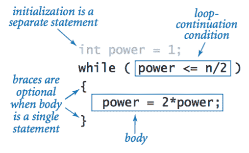
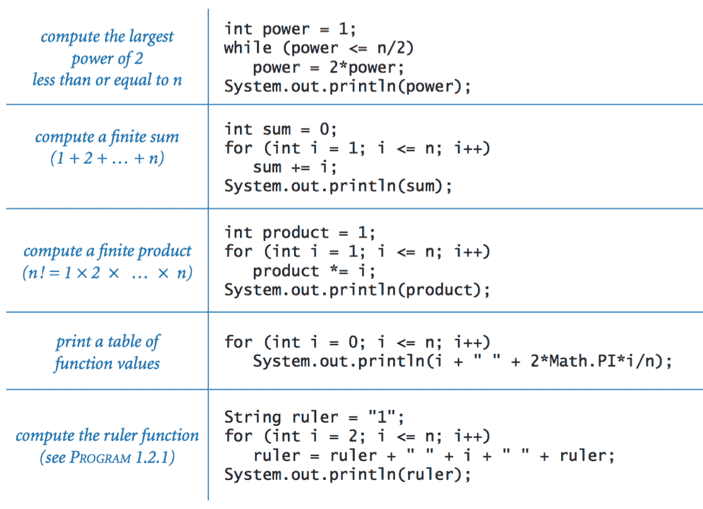

# 1.3   条件和循环

> 原文：[`introcs.cs.princeton.edu/java/13flow`](https://introcs.cs.princeton.edu/java/13flow)

在我们到目前为止检查的程序中，每个语句都按给定的顺序执行一次。大多数程序更复杂，因为语句的顺序和每个语句执行的次数可能会有所不同。我们使用术语*控制流*来指代程序中的语句顺序。

## if 语句。

大多数计算需要针对不同的输入采取不同的行动。

+   以下代码片段使用`if`语句将两个`int`值中较小的值放入`x`，将两个值中较大的值放入`y`，如果需要则交换两个变量中的值。

    > 

+   Flip.java 使用`Math.random()`和`if-else`语句来打印硬币翻转的结果。

+   下表总结了一些典型情况，您可能需要使用`if`或`if-else`语句。

    > 

## While 循环。

许多计算本质上是重复的。`while`循环使我们能够多次执行一组语句。这使我们能够在不编写大量代码的情况下表达冗长的计算。

+   以下代码片段计算小于或等于给定正整数*n*的最大 2 的幂。

    > 

+   TenHellos.java 打印"Hello World" 10 次。

+   PowersOfTwo.java 接受一个整数命令行参数*n*，并打印小于或等于*n*的所有 2 的幂。

## for 循环。

*for 循环* 是另一种 Java 构造，使我们在编写循环时更加灵活。

+   *符号说明。* 许多循环遵循相同的基本方案：将索引变量初始化为某个值，然后使用`while`循环测试涉及索引变量的退出条件，使用`while`循环中的最后一条语句修改索引变量。Java 的`for`循环是表达这种循环的直接方式。

    > 

+   *复合赋值习语。* 习语`i++`是`i = i + 1`的简写表示。

+   *作用域。* 变量的*作用域*是程序中可以通过名称引用该变量的部分。通常，变量的作用域包括声明后面的语句，与声明在同一块中的语句。为此，`for`循环头中的代码被视为与`for`循环主体在同一块中。

## 嵌套。

`if`、`while`和`for`语句与 Java 中的赋值语句或其他语句具有相同的地位；也就是说，我们可以在需要语句的任何地方使用它们。特别是，我们可以在另一个语句的主体中使用一个或多个语句来创建*复合语句*。为了强调嵌套，我们在程序代码中使用缩进。

+   DivisorPattern.java 有一个`for`循环，其主体包含一个`for`循环（其主体是一个`if-else`语句）和一个打印语句。它打印出一个星号模式，其中第*i*行的每个位置都有一个星号，对应于*i*的约数（列也是如此）。

+   MarginalTaxRate.java 计算给定收入的边际税率。它使用几个嵌套的`if-else`语句来从一系列互斥的可能性中进行选择。

## 循环示例。

> 

## 应用。

使用循环和条件语句编程立即为我们打开了计算的世界。

+   *尺规划分。*RulerN.java 接受一个整数命令行参数 n 并打印出尺规划分长度的字符串。这个程序展示了循环的一个基本特征——程序几乎不能再简单了，但它可以产生大量的输出。


+   *有限和。*PowersOfTwo.java 中使用的计算范式是您经常会使用的范式。它使用两个变量——一个作为控制循环的索引，另一个用于累积计算结果。程序 HarmonicNumber.java 使用相同的范式来评估和

    > $$ H_n = \frac{1}{1} + \frac{1}{2} + \frac{1}{3} + \frac{1}{4} + \; \ldots \; + \frac{1}{n} $$

    这些数字，被称为*调和数*，在算法分析中经常出现。

+   *牛顿法。*  Sqrt.java 使用一种经典的迭代技术，称为*牛顿*法，来计算正数*x*的平方根：从一个估计值*t*开始。如果*t*等于*x/t*（直到机器精度），那么*t*等于*x*的平方根，计算完成。如果不是，则通过用*t*和*x/t*的平均值替换*t*来改进估计值。每次执行此更新，我们都会更接近所需的答案。

+   *数字转换。*二进制.java 打印出以命令行参数输入的十进制数的二进制（基数 2）表示。它基于将数字分解为 2 的幂的和。例如，106 的二进制表示是 1101010[2]，这等同于说 106 = 64 + 32 + 8 + 2。要计算*n*的二进制表示，我们按递减顺序考虑小于或等于*n*的 2 的幂，以确定哪些属于二进制分解（因此对应于二进制表示中的 1 位）。

+   *赌徒的毁灭。*  假设一个赌徒进行一系列公平的 1 美元赌注，从 50 美元开始，并继续玩下去，直到她破产或赢得 250 美元。她赢得 250 美元的机会有多大，以及在赢或输之前她可能会做多少赌注？Gambler.java 是一个可以帮助回答这些问题的模拟。它需要三个命令行参数，初始赌注（50 美元），目标金额（250 美元）以及我们想要模拟游戏的次数。

+   *质因数分解。*Factors.java 接受一个整数命令行参数`n`并打印出它的质因数分解。与我们看到的许多其他程序不同（我们可以在几分钟内用计算器或纸和笔完成），这个计算没有计算机是不可行的。

## 其他条件和循环结构。

为了完整起见，我们考虑与条件和循环相关的另外四个 Java 构造。它们使用频率远低于我们一直在使用的`if`、`while`和`for`语句，但了解它们是值得的。

+   *中断语句。* 在某些情况下，我们希望立即退出一个循环，而不让它运行到完成。Java 提供`break`语句来实现这一目的。Prime.java 接受一个整数命令行参数`n`，如果`n`是质数则打印`true`，否则打印`false`。有两种不同的方法可以退出这个循环：要么执行`break`语句（因为`n`不是质数），要么循环继续条件不满足（因为`n`��质数）。

    请注意，`break`语句不适用于`if`或`if-else`语句。在一次[著名的编程错误](http://users.csc.calpoly.edu/~jdalbey/SWE/Papers/att_collapse.html)中，美国电话网络崩溃，因为一个程序员打算使用`break`语句退出一个复杂的`if`语句。

+   *Continue 语句.* Java 还提供了一种跳过循环的下一次迭代的方法：`continue`语句。当在`for`循环的主体内执行`continue`时，控制流直接转移到循环的下一次迭代的增量语句。

+   *Switch 语句.* `if`和`if-else`语句允许一个或两个替代方案。有时，一个计算自然地提出了两个以上的互斥的替代方案。Java 提供了`switch`语句来实现这一目的。NameOfDay.java 接受一个介于 0 和 6 之间的整数作为命令行参数，并使用`switch`语句打印相应的星期几名称（星期日到星期六）。

+   *Do-while 循环.* `do-while`循环与`while`循环几乎相同，只是第一次通过循环时省略了循环继续条件。RandomPointInCircle.java 设置`x`和`y`，使得(`x`, `y`)在以(0, 0)为中心、半径为 1 的圆内随机分布。

    > 

    使用`Math.random()`，我们得到的点在以(0, 0)为中心的 2x2 正方形中随机分布。我们只在这个区域内生成点，直到找到一个位于单位圆内的点为止。我们总是希望生成至少一个点，因此使用`do-while`循环是最合适的。由于我们希望在循环终止后访问它们的值，因此必须在循环外声明`x`和`y`。

我们在本教材中不使用以下两个流程控制语句，但为了完整性起见在此包含它们。

+   *条件运算符.* 条件运算符`?:`是一个三元运算符（三个操作数），它使您能够在表达式中嵌入一个条件。这三个操作数由`?`和`:`符号分隔。如果第一个操作数（一个布尔表达式）为`true`，则结果具有第二个表达式的值；否则具有第三个表达式的值。

    ```java
    int min = (x < y) ? x : y;

    ```

+   *带标签的 break 和 continue 语句.* `break`和`continue`语句适用于最内层的`for`或`while`循环。有时我们希望跳出几层嵌套循环。Java 提供了带标签的 break 和 continue 语句来实现这一点。这里有一个[示例](http://docs.oracle.com/javase/tutorial/java/nutsandbolts/branch.html)。

#### 练习

1.  编写一个程序 AllEqual.java，它接受三个整数命令行参数，并在所有三个参数相等时打印`equal`，否则打印`not equal`。

1.  编写一个程序 RollLoadedDie.java，打印掷一个加载的骰子的结果，使得得���1、2、3、4 或 5 的概率为 1/8，得到 6 的概率为 3/8。

1.  重写 TenHellos.java 以创建一个程序 Hellos.java，该程序将要打印的行数作为命令行参数。您可以假设参数小于 1000。提示：考虑使用`i % 10`和`i % 100`来确定是否使用"st"、"nd"、"rd"或"th"来打印第`i`个 Hello。

1.  编写一个程序 FivePerLine.java，使用一个`for`循环和一个`if`语句，每行打印从 1000 到 2000 的整数，每行五个整数。*提示*：使用`%`运算符。

1.  编写一个程序 FunctionGrowth.java，打印出*ln n*，*n*，*n ln n*，*n²*，*n³*和*2^n*的值表，其中*n* = 16, 32, 64, ..., 2048。使用制表符(`'\t'`字符)来对齐列。

1.  在执行以下代码后，`m`和`n`的值是多少？

    ```java
    int n = 123456789;
    int m = 0;
    while (n != 0) {
       m = (10 * m) + (n % 10);
       n = n / 10;
    }

    ```

1.  以下代码打印出什么？

    ```java
    int f = 0, g = 1;
    for (int i = 0; i <= 15; i++) {
       System.out.println(f);
       f = f + g;
       g = f - g;
    }

    ```

1.  与调和��不同，和 1/1 + 1/4 + 1/9 + 1/16 + ... + 1/n² *确实*会收敛到一个常数，随着*n*趋向无穷。 （实际上，常数是π² / 6，因此可以使用这个公式来估计π的值。）以下哪个 for 循环计算这个和？ 假设`n`是一个初始化为 1000000 的`int`，`sum`是一个初始化为 0 的`double`。

    ```java
    (a) for (int i = 1; i <= n; i++) 
           sum = sum + 1 / (i * i);

    (b) for (int i = 1; i <= n; i++)
           sum = sum + 1.0 / i * i;

    (c) for (int i = 1; i <= n; i++)
           sum = sum + 1.0 / (i * i);

    (d) for (int i = 1; i <= n; i++)
           sum = sum + 1 / (1.0 * i * i);

    ```

1.  修改 Binary.java 以获得一个程序修改`Kary.java`，它接受第二个命令行参数`K`，并将第一个参数转换为基数`K`。 假设基数在 2 到 16 之间。 对于大于 10 的基数，使用字母`A`到`F`表示数字 10 到 15。

1.  编写一个程序代码片段，将正整数`n`的二进制表示放入一个`String`变量`s`中。

#### 创意练习

1.  **拉马努金的出租车。** S.拉马努金是一位以其对数字的直觉而闻名的印度数学家。 有一天，英国数学家 G.H.哈代来医院看望他时，哈代说他的出租车号码是 1729，一个相当乏味的数字。 拉马努金回答说：“不，哈代！不，哈代！这是一个非常有趣的数字。它是唯一的一个可以用两种不同方式的两个立方体的和来表示的最小数字。” 通过编写一个程序 Ramanujan.java，接受一个整数命令行参数 n，并打印小于或等于 n 的所有整数，这些整数可以用两种不同方式的两个立方体的和来表示 - 找到不同的正整数*a*、*b*、*c*和*d*，使得*a³ + b³ = c³ + d³*。 使用四个嵌套的 for 循环。

    现在，车牌号 87539319 似乎是一个相当乏味的数字。 确定它为什么不是。

1.  **校验和。** 国际标准书号（[ISBN](http://mathworld.wolfram.com/ISBN.html)）是一个包含 10 位数字的代码，可以唯一指定一本书。 最右边的数字是一个*校验和*数字，可以根据其他 9 位数字确定，条件是*d[1] + 2d[2] + 3d[3] + ... + 10d[10]*必须是 11 的倍数（这里*d[i]*表示从右边数第 i 位数字）。 校验和数字*d[1]*可以是 0 到 10 之间的任何值：ISBN 约定使用值 X 表示 10。 *示例*：对应于 020131452 的校验和数字是 5，因为它是 0 到 10 之间*d[1]*的唯一值，使得*d[1] + 2*2 + 3*5 + 4*4 + 5*1 + 6*3 + 7*1 + 8*0 + 9*2 + 10*0*是 11 的倍数。 编写一个程序 ISBN.java，它以一个 9 位整数作为命令行参数，计算校验和，并打印 10 位 ISBN 号码。 如果不打印任何前导 0，也没关系。

1.  **指数函数。** 假设`x`是一个正的`double`类型变量。 编写一个程序 Exp.java，使用泰勒级数展开计算 e^x

    > $$ e^ x = 1 + x + \frac{x²}{2!} + \frac{x³}{3!} + \frac{x⁴}{4!} + \ldots $$

1.  **三角函数。** 编写两个程序 Sin.java 和`Cos.java`，使用泰勒级数展开计算*sin x*和*cos x*

    > $$ \sin x = x - \frac{x³}{3!} + \frac{x⁵}{5!} - \frac{x⁷}{7!} + \ldots $$
    > 
    > $$ \cos x = 1 - \frac{x²}{2!} + \frac{x⁴}{4!} - \frac{x⁶}{6!} + \ldots $$

1.  **游戏模拟。** 在游戏节目*让我们做个交易*中，一个参赛者面前有三扇门。其中一扇门后面是一个有价值的奖品，另外两扇门后面是恶作剧礼物。在参赛者选择一扇门后，主持人会打开另外两扇门中的一扇（当然不会揭示奖品）。然后参赛者有机会换到另一扇未打开的门。参赛者应该这样做吗？直觉上，参赛者最初选择的门和另一扇未打开的门同样有可能包含奖品，因此没有动机去换。编写一个程序 MonteHall.java 通过模拟来测试这种直觉。你的程序应该接受一个整数命令行参数*n*，使用两种策略（换门或不换门）玩*n*次游戏，并打印每种策略的成功率。或者你可以[在这里玩游戏](http://www.stat.sc.edu/~west/javahtml/LetsMakeaDeal.html)。

1.  **欧拉幂和猜想。** 1769 年，莱昂哈德·欧拉提出了费马大定理的一个广义版本，猜想至少需要*n*个*n*次幂才能得到一个本身是*n*次幂的和，其中*n* > 2。编写一个程序 Euler.java 来证明欧拉的猜想（直到 1967 年仍然有效），使用五重嵌套循环找到四个正整数，它们的 5 次幂之和等于另一个正整数的 5 次幂。也就是说，找到*a*、*b*、*c*、*d*和*e*，使得*a*⁵ + *b*⁵ + *c*⁵ + *d*⁵ = *e*⁵。使用`long`数据类型。

#### 网络练习

1.  编写一个程序 RollDie.java，生成掷一个公平的六面骰子的结果（1 到 6 之间的整数）。

1.  编写一个程序，接受三个整数命令行参数 a、b 和 c，并打印 a、b 和 c 中不同值的数量（1、2 或 3）。

1.  编写一个程序，接受五个整数命令行参数，并打印*中位数*（第三大的数）。

1.  （难）现在，尝试计算 5 个元素的中位数，使得当执行时，总比较次数不超过 6 次。

1.  如何使用 for 循环创建一个无限循环？

    *解决方案*：`for(;;)`与`while(true)`相同。

1.  以下循环有什么问题？

    ```java
    boolean done = false;
    while (done = false) {
        ...
    }

    ```

    while 循环条件使用`=`而不是`==`，因此是一个赋值语句（这使得`done`始终为`false`，循环体永远不会被执行）。最好避免使用`==`。

    ```java
    boolean done = false;
    while (!done) {
        ...
    }

    ```

1.  以下循环有什么问题，它旨在计算 1 到 100 之间整数的总和？

    ```java
    for (int i = 1; i <= N; i++) {
       int sum = 0;
       sum = sum + i;
    }
    System.out.println(sum);

    ```

    变量`sum`应该在循环外定义。通过在循环内定义它，每次循环时都会初始化一个新的`sum`变量为 0；而且在循环外部无法访问它。

1.  编写一个程序 Hurricane.java，将风速（以英里/小时为单位）作为整数命令行参数，并打印出它是否符合飓风标准，如果是的话，它是 1、2、3、4 还是 5 级飓风。下面是根据[Saffir-Simpson 飓风等级](http://www.marinewaypoints.com/marine/wind.shtml)的风速表。

    > | 类别 | 风速（英里/小时） |
    > | --- | --- |
    > | 1 | 74 - 95 |
    > | 2 | 96 - 110 |
    > | 3 | 111 - 130 |
    > | 4 | 131 - 155 |
    > | 5 | 155 及以上 |

1.  以下代码片段有什么问题？

    ```java
    double x = -32.2;
    boolean isPositive = (x > 0);
    if (isPositive = true) System.out.println(x + " is positive");
    else                   System.out.println(x + " is not positive");

    ```

    *解决方案*：它使用赋值运算符`=`而不是相等运算符`==`。更好的解决方案是写成`if (isPositive)`。

1.  改变/添加一个字符，使得以下程序打印出 20 个 x。有两种不同的解决方案。

    ```java
    int i = 0, n = 20;
    for (i = 0; i < n; i--)
        System.out.print("x");

    ```

    *解决方案*：将 i < n 的条件替换为-i < n。将 i--替换为 n--。（在 C 中，还有第三种解决方案：将<替换为+。）

1.  以下代码片段做什么？

    ```java
    if (x > 0);
        System.out.println("positive");

    ```

    *解决方案*：无论`x`的值如何，由于在`if`语句后面多了一个分号，总是打印`positive`。

1.  **RGB 转 HSB 转换器。** 编写一个名为`RGBtoHSV.java`的程序，该程序接受 RGB 颜色（0 到 255 之间的三个整数）并将其转换为[HSB 颜色](http://en.wikipedia.org/wiki/HSV_color_space)（0 到 255 之间的三个不同整数）。编写一个名为`HSVtoRGB.java`的程序，应用逆转换。

1.  **男孩和女孩。** 一对开始组建家庭的夫妇决定继续生育，直到他们至少有一个性别。通过模拟估计他们将拥有的平均子女数量。还估计最常见的结果（记录 2、3 和 4 个孩子的频率计数，以及 5 个及以上的孩子）。假设男孩或女孩的概率 p 为 1/2。

1.  以下程序做什么？

    ```java
    public static void main(String[] args) {
       int N = Integer.parseInt(args[0]);
       int x = 1;
       while (N >= 1) {
          System.out.println(x);
          x = 2 * x;
          N = N / 2;
       }
    }

    ```

    *解决方案*：打印小于或等于 n 的所有 2 的幂。

1.  **男孩和女孩。** 重复上一个问题，但假设夫妇继续生育，直到他们有另一个与第一个孩子性别相同的孩子。如果 p 与 1/2 不同，您的答案会如何改变？

    *令人惊讶的是，如果 p = 0 或 1，则平均子女数为 2，对于所有其他 p 值，则为 3。但对于所有 p 值，最可能的值是 2。*

1.  给定两个正整数`a`和`b`，以下代码片段在`c`中留下什么结果

    ```java
    c = 0;
    while (b > 0) {
       if (b % 2 == 1) c = c + a;
       b = b / 2;
       a = a + a;
    }

    ```

    *解决方案*：a * b。

1.  使用循环和四个条件语句编写一个程序来打印

    ```java
    12 midnight
    1am
    2am
    ...
    12 noon
    1pm
    ...
    11pm

    ```

1.  以下程序打印什么？

    ```java
    public class Test {
       public static void main(String[] args) {
          if (10 > 5); 
          else; {           
              System.out.println("Here");
          };
       }              
    }   

    ```

1.  爱丽丝抛一枚公平硬币，直到她看到两个连续的正面。鲍勃抛另一枚公平硬币，直到他看到一个正面后面跟着一个反面。编写一个程序来估计爱丽丝比鲍勃少抛硬币的概率？*解决方案*：[39/121](http://math.smsu.edu/~les/Adv51.html)。

1.  重新编写 DayOfWeek.java，使其打印星期几，例如星期日、星期一等，而不是 0 到 6 之间的整数。使用`switch`语句。

1.  **数字转英文。** 编写一个程序，读取介于-999,999,999 和 999,999,999 之间的命令行整数，并打印英文等价物。以下是您的程序应使用的单词的详尽列表：negative, zero, one, two, three, four, five, six, seven, eight, nine, ten, eleven, twelve, thirteen, fourteen, fifteen, sixteen, seventeen, eighteen, nineteen, twenty, thirty, forty, fifty, sixty, seventy, eighty, ninety, hundred, thousand, million。当您可以使用千时，请不要使用百，例如，使用一千五百而不是一千五百。[参考](http://acm.pku.edu.cn/JudgeOnline/showproblem?problem_id=2121)。

1.  **体操评分。** 体操运动员的得分由 6 名评委组成的小组决定，每位评委决定 0.0 到 10.0 之间的得分。最终得分是通过丢弃最高和最低分数，然后对剩余的 4 个分数取平均值来确定的。编写一个名为`GymnasticsScorer.java`的程序，该程序接受代表 6 个分数的 6 个实数命令行输入，并打印它们的平均值，在丢弃最高和最低分数后。

1.  **四分卫评分。** 为了比较 NFL 四分卫，NFL 设计了基于四分卫完成传球次数（A）、传球尝试次数（B）、传球码数（C）、触球传球（D）和拦截（E）的[四分卫评分](http://www.mathnotes.com/aw_quarterback.html)公式如下：

    1.  完成比率：W = 250/3 * ((A / B) - 0.3)。

    1.  每次传球码数：X = 25/6 * ((C / B) - 3)。

    1.  触球比率：Y = 1000/3 * (D / B)

    1.  拦截比率：Z = 1250/3 * (0.095 - (E / B))四分卫评分通过总结上述四个量来计算，但将每个值四舍五入，使其至少为 0，最多为 475/12。编写一个名为`QuarterbackRating.java`的程序，该程序接受五个命令行输入 A、B、C、D 和 E，并打印四分卫评分。使用您的程序计算史蒂夫·杨（Steve Young）在 1994 年创下的纪录赛季（112.8），他完成了 461 次传球中的 324 次，总共 3969 码，投出 35 次触球和 10 次拦截。截至 2014 年，单赛季最高纪录是 2011 年阿伦·罗杰斯（Aaron Rodgers）的 122.5。

1.  **有理数的十进制扩展。**给定两个整数 p 和 q，p/q 的十进制扩展具有无限重复循环。例如，1/33 = 0.03030303....我们使用符号 0.(03)表示 03 无限重复。另一个例子，8639/70000 = 0.1234(142857)。编写一个名为`DecimalExpansion.java`的程序，该程序读取两个命令行整数 p 和 q，并使用上述符号打印 p/q 的十进制扩展。*提示*：使用 Floyd 的规则。

1.  **黑色星期五。**在连续的天数中，没有星期五 13 号出现的最大天数是多少？*提示*：格里高利历每 400 年（146097 天）重复一次，因此您只需要担心 400 年的间隔。

    *解决方案*：426（例如，从 1999 年 8 月 13 日到 2000 年 10 月 13 日）。

1.  **1 月 1 日。**1 月 1 日更有可能是星期六还是星期日？编写一个程序来确定在 400 年间隔中每个日期发生的次数。

    *解决方案*：周日（58 次）比周六（56 次）更有可能。

1.  以下两个代码片段分别做什么？

    ```java
    for (int i = 0; i < N; i++)
       for (int j = 0; j < N; j++)
           if (i != j) System.out.println(i + ", " + j);

    for (int i = 0; i < N; i++)
       for (int j = 0; (i != j) && (j < N); j++)
           System.out.println(i + ", " + j);

    ```

1.  不使用计算机确定打印出的值是多少。从 0、100、101、517 或 1000 中选择正确答案。

    ```java
    int cnt = 0;
    for (int i = 0; i < 10; i++)
       for (int j = 0; j < 10; j++)
          for (int k = 0; k < 10; k++)
             if (2*i + j >= 3*k)
                cnt++;
    System.out.println(cnt);

    ```

1.  重写 Creative Exercise XYZ 中的 CarLoan.java，以便正确处理 0%的利率并避免除以 0。

1.  编写您可以的最短的 Java 程序，该程序接受一个整数命令行参数 n，并在(1 + 2 + ... + n)²等于(1³ + 2³ + ... + n³)时打印`true`。

    *解决方案*：始终打印`true`。

1.  修改 Sqrt.java 以便在用户输入负数时报告错误，并在用户输入零时正常工作。

1.  如果在程序 Sqrt.java 中将`t`初始化为`-x`而不是`x`会发生什么？

1.  **均匀分布的样本标准差。**修改练习 8，以便除了平均值外还打印样本标准差。

1.  **正态分布的样本标准差。**接受一个整数 N 作为命令行参数，并使用第 1.2 节中的 Web 练习 1 打印 N 个标准正态随机变量，以及它们的平均值和样本标准差。

1.  **偏斜骰子。**[斯蒂芬·鲁迪奇]假设您有三个三面骰子。A：{2, 6, 7}，B：{1, 5, 9}，C：{3, 4, 8}。两名玩家掷骰子，值最高者获胜。您会选择哪个骰子？*解决方案*：A 以 5/9 的概率击败 B，B 以 5/9 的概率击败 C，C 以 5/9 的概率击败 A。一定要选择第二个！

1.  **Thue–Morse 序列。**编写一个程序 ThueMorse.java，读取一个命令行整数 n，并打印 n 阶的[Thue–Morse 序列](http://mathworld.wolfram.com/Thue-MorseSequence.html)。前几个字符串是 0、01、0110、01101001。每个后续字符串都是通过翻转前一个字符串的所有位并将结果连接到前一个字符串的末尾而获得的。该序列具有许多惊人的特性。例如，它是一个*无立方体*的二进制序列：它不包含 000、111、010101 或`sss`，其中`s`是任何字符串。它是*自相似*的：如果删除每隔一个位，您将得到另一个 Thue–Morse 序列。它在数学领域以及国际象棋、图形设计、[编织图案](http://www.cs.arizona.edu/patterns/weaving/webdocs/gre_mt.pdf)和音乐作曲中都有出现。

1.  程序 Binary.java 通过去除 2 的幂来打印十进制数 n 的二进制表示。编写一个基于以下方法的替代版本程序 Binary2.java：如果 n 是奇数，则写 1，如果 n 是偶数，则写 0。将 n 除以 2，舍弃余数。重复直到 n = 0，并将答案倒过来读。使用`%`确定 n 是否为偶数，并使用字符串连接以逆序形成答案。

1.  以下代码片段做什么？

    ```java
    int digits = 0;
    do {
       digits++;
       n = n / 10;
    } while (n > 0);

    ```

    *解决方案*：自然数 n 的二进制表示中的位数。我们使用`do-while`循环，因此当 n = 0 时，代码输出 1。

1.  编写一个程序`NPerLine.java`，接受一个整数命令行参数`n`，并打印从 10 到 99 的整数，每行打印 n 个整数。

1.  修改`NPerLine.java`，使其每行打印从 1 到 1000 的整数，每行打印 n 个整数。通过在整数前打印正确数量的空格使整数对齐（例如，1-9 为三个空格，10-99 为两个空格，100-999 为一个空格）。

1.  假设 a、b 和 c 是在 0 和 1 之间均匀分布的随机数。a、b 和 c 形成某个三角形的边长的概率是多少？*提示*：只有当任意两个值的和大于第三个值时，它们才会形成一个三角形。

1.  重复上一个问题，但计算得到的三角形是钝角三角形的概率，假设三个数字是一个三角形。*提示*：三条边长度将形成一个钝角三角形，当且仅当（i）任意两个值的和大于第三个值，且（ii）任意两边长度的平方和大于或等于第三边长度的平方。

    [答案](http://math.smsu.edu/~les/Adv28.html)。

1.  在执行以下代码后，s 的值是多少？

    ```java
    int M = 987654321;
    String s = "";
    while (M != 0) {
       int digit = M % 10;
       s = s + digit;
       M = M / 10;
    }

    ```

1.  在执行以下混乱的代码后，i 的值是多少？

    ```java
    int i = 10;
    i = i++;
    i = ++i;
    i = i++ + ++i;

    ```

    寓意：不要编写这样的代码。

1.  **格式化的 ISBN 号码。** 编写一个程序 ISBN2.java，从命令行参数中读取一个 9 位整数，计算校验位，并打印完全格式化的 ISBN 号码，例如，0-201-31452-5。

1.  **UPC 码。** 通用产品代码（[UPC](http://mathworld.wolfram.com/UPC.html)）是一个 12 位代码，唯一指定一个产品。最低有效位 d[1]（最右边的一位）是一个校验位，通过使以下表达式成为 10 的倍数来唯一确定：

    > (d[1] + d[3] + d[5] + d[7] + d[9] + d[11]) + 3 (d[2] + d[4] + d[6] + d[8] + d[10] + d[12])

    例如，对应于 0-48500-00102（Tropicana Pure Premium Orange Juice）的校验位是 8，因为

    > (8 + 0 + 0 + 0 + 5 + 4) + 3 (2 + 1 + 0 + 0 + 8 + 0) = 50

    并且 50 是 10 的倍数。编写一个程序，从命令行参数读取一个 11 位整数，计算校验位，并打印完整的 UPC。*提示*：使用`long`类型的变量存储 11 位数。

1.  编写一个程序，将风速（以节为单位）作为命令行参数读入，并根据[伯福特风级表](http://boating.ncf.ca/beaufort.html)打印其风力。使用`switch`语句。

1.  **找零钱。** 编写一个程序，读取一个命令行整数 N（便士数），并打印使用美国硬币（仅限 25 美分、10 美分、5 美分和 1 美分）找零的最佳方式（硬币数量最少）。例如，如果 N = 73，则打印

    ```java
    2 quarters
    2 dimes
    3 pennies

    ```

    *提示*：使用贪婪算法。即，尽可能多地发放 25 美分硬币，然后是 10 美分硬币，然后是 5 美分硬币，最后是 1 美分硬币。

1.  编写一个程序 Triangle.java，接受一个命令行参数 N 并打印一个 N-by-N 的三角形图案。

    ```java
    * * * * * *
    . * * * * *
    . . * * * *
    . . . * * *
    . . . . * *
    . . . . . *

    ```

1.  编写一个程序 Ex.java，接受一个命令行参数 N 并打印一个(2N + 1)-by-(2N + 1)的 X 图案。使用两个`for`循环和一个`if-else`语句。

    ```java
    * . . . . . *
    . * . . . * .
    . . * . * . .
    . . . * . . .
    . . * . * . .
    . * . . . * .
    * . . . . . *

    ```

1.  编写一个程序 BowTie.java，接受一个命令行参数 N 并打印一个(2N + 1)-by-(2N + 1)的蝴蝶结图案。使用两个`for`循环和一个`if-else`语句。

    ```java
    * . . . . . * 
    * * . . . * * 
    * * * . * * * 
    * * * * * * * 
    * * * . * * * 
    * * . . . * * 
    * . . . . . * 

    ```

1.  编写一个程序 Diamond.java，接受一个命令行参数 N 并打印一个(2N + 1)-by-(2N + 1)的菱形图案。

    ```java
    % java Diamond 4
    . . . . * . . . . 
    . . . * * * . . . 
    . . * * * * * . . 
    . * * * * * * * . 
    * * * * * * * * * 
    . * * * * * * * . 
    . . * * * * * . . 
    . . . * * * . . . 
    . . . . * . . . . 

    ```

1.  编写一个程序 Heart.java，接受一个命令行参数 N 并打印一个心形。

1.  当 N = 5 时，程序 Circle.java 打印出什么？

    ```java
    for (int i = -N; i <= N; i++) {
       for (int j = -N; j <= N; j++) {
          if (i*i + j*j <= N*N) System.out.print("* ");
          else                  System.out.print(". ");
       }
       System.out.println();
    }

    ```

1.  **季节。** 编写一个名为`Season.java`的程序，接受两个命令行整数 M 和 D，并打印对应于北半球月份 M（1 = 1 月，12 = 12 月）和日期 D 的季节。使用以下表格

    > | 季节 | 从 | 到 |
    > | --- | --- | --- |
    > | 春季 | 3 月 21 日 | 6 月 20 日 |
    > | 夏季 | 6 月 21 日 | 9 月 22 日 |
    > | 秋季 | 9 月 23 日 | 12 月 21 日 |
    > | 冬季 | 12 月 21 日 | 3 月 20 日 |

1.  **星座。** 编写一个名为`Zodiac.java`的程序，接受两个命令行整数 M 和 D，并打印对应于月份 M（1 = 1 月，12 = 12 月）和日期 D 的星座。使用以下表格

    > | 星座 | 从 | 到 |
    > | --- | --- | --- |
    > | 摩羯座 | 12 月 22 日 | 1 月 19 日 |
    > | 水瓶座 | 1 月 20 日 | 2 月 17 日 |
    > | 双鱼座 | 2 月 18 日 | 3 月 19 日 |
    > | 白羊座 | 3 月 20 日 | 4 月 19 日 |
    > | 金牛座 | 4 月 20 日 | 5 月 20 日 |
    > | 双子座 | 5 月 21 日 | 6 月 20 日 |
    > | 巨蟹座 | 6 月 21 日 | 7 月 22 日 |
    > | 狮子座 | 7 月 23 日 | 8 月 22 日 |
    > | 处女座 | 8 月 23 日 | 9 月 22 日 |
    > | 天秤座 | 9 月 23 日 | 10 月 22 日 |
    > | 天蝎座 | 10 月 23 日 | 11 月 21 日 |
    > | 射手座 | 11 月 22 日 | 12 月 21 日 |

1.  **泰拳搏击。** 编写一个程序，通过命令行参数读取泰拳搏击手的体重（以磅为单位），并打印他们的体重级别。使用`switch`语句。

    > | 级别 | 从 | 到 |
    > | --- | --- | --- |
    > | 雏量级 | 0 | 112 |
    > | 超级雏量级 | 112 | 115 |
    > | 幼量级 | 115 | 118 |
    > | 超级雏量级 | 118 | 122 |
    > | 羽量级 | 122 | 126 |
    > | 超级羽量级 | 126 | 130 |
    > | 轻量级 | 130 | 135 |
    > | 超级轻量级 | 135 | 140 |
    > | 欢迎量级 | 140 | 147 |
    > | 超级次中量级 | 147 | 154 |
    > | 中量级 | 154 | 160 |
    > | 超级中量级 | 160 | 167 |
    > | 轻重量级 | 167 | 175 |
    > | 超级轻重量级 | 175 | 183 |
    > | 重量级 | 183 | 190 |
    > | 重量级 | 190 | 220 |
    > | 超级重量级 | 220 | - |

1.  **欧拉幂和猜想。** 1769 年，欧拉推广了费马大定��，并猜想找不到三个 4 次幂的和是 4 次幂，或者四个 5 次幂的和是 5 次幂，等等。这个猜想在 1966 年被详尽的计算机搜索所证伪。通过找到正整数 a、b、c、d 和 e，使得 a⁵ + b⁵ + c⁵ + d⁵= e⁵来证伪这个猜想。编写一个程序 Euler.java，读取一个命令行参数 N，并详尽搜索所有这样的解，其中 a、b、c、d 和 e 小于或等于 N。对于大于 5 的幂，目前没有反例，但您可以加入[EulerNet](http://euler.free.fr/index.htm)，这是一个分布式计算项目，旨在找到第六次幂的反例。

1.  **二十一点。** 编写一个名为`Blackjack.java`的程序，接受三个命令行整数 x、y 和 z，表示您的两张二十一点牌 x 和 y，以及庄家的明牌 z，并打印大西洋城 6 副牌的“标准策略”。假设 x、y 和 z 是 1 到 10 之间的整数，表示从 A 到面牌。根据这些[策略表](http://www.blackjackinfo.com/cgi-bin/bjbse.cgi?game=ac6)报告玩家应该要牌、停牌还是分牌。 （当您学习数组时，您将遇到一种不涉及太多 if-else 语句的替代策略）。

1.  **带加倍的二十一点。** 修改前面的练习以允许*加倍*。

1.  **抛射运动。** 以下方程式给出了弹道导弹的轨迹作为初始角度 theta 和风速的函数：xxxx。编写一个 Java 程序，在每个时间步长 t 打印导弹的（x，y）位置。使用试错法确定如果希望焚烧位于当前位置正东 100 英里处且海拔相同的目标，应该瞄准导弹的角度。假设风速为东风 20 英里/小时。

1.  **世界大赛。** 棒球世界大赛是一场 7 局 4 胜的比赛，第一支赢得四场比赛的球队将赢得世界大赛。假设更强的球队在每场比赛中获胜的概率为 p > 1/2。编写一个程序来估计较弱球队赢得世界大赛的机会，并估计平均需要多少场比赛。

1.  考虑方程（9/4）^x = x^(9/4)。一个解是 9/4。你能使用牛顿法找到另一个解吗？

1.  **排序网络。** 编写一个程序 Sort3.java，其中有三个`if`语句（没有循环），从命令行读取三个整数*a*、*b*和*c*，并按升序打印它们。

    ```java
    if (a > b) swap a and b
    if (a > c) swap a and c
    if (b > c) swap b and c

    ```

1.  **遗忘排序网络。** 说服自己以下代码片段重新排列存储在变量 A、B、C 和 D 中的整数，使得 A <= B <= C <= D。

    ```java
    if (A > B) { t = A; A = B; B = t; }
    if (B > C) { t = B; B = C; C = t; }
    if (A > B) { t = A; A = B; B = t; }
    if (C > D) { t = C; C = D; D = t; }
    if (B > C) { t = B; B = C; C = t; }
    if (A > B) { t = A; A = B; B = t; }
    if (D > E) { t = D; D = E; E = t; }
    if (C > D) { t = C; C = D; D = t; }
    if (B > C) { t = B; B = C; C = t; }
    if (A > B) { t = A; A = B; B = t; }

    ```

    设计一系列语句来对 5 个整数进行排序。你的程序使用了多少个`if`语句？

1.  **最佳遗忘排序网络。** 创建一个程序，使用仅 5 个`if`语句对四个整数进行排序，并使用仅 9 个上述类型的`if`语句对五个整数进行排序。遗忘排序网络对于在硬件中实现排序算法非常有用。你如何检查你的程序对所有输入都有效？

    *解决方案*：Sort4.java 使用 5 次比较交换对 4 个元素进行排序。Sort5.java 使用 9 次比较交换对 5 个元素进行排序。

    *0-1 原则*断言您可以通过检查一个由 0 和 1 序列组成的输入是否正确排序来验证（确定性）排序算法的正确性。因此，要检查`Sort5.java`是否有效，您只需要在 32 个可能的 0 和 1 序列输入上进行测试。

1.  **最佳遗忘排序（具有挑战性）。** 找到一个最佳的排序网络，用于 6、7 和 8 个输入，分别使用 12、16 和 19 个前一个问题中形式的`if`语句。

    *解决方案*：Sort6.java 是对 6 个元素进行排序的解决方案。

1.  **最佳非遗忘排序。** 编写一个程序，使用仅 7 次比较对 5 个输入进行排序。*提示*：首先比较前两个数字，然后比较后两个数字，再比较两组中较大的数字，并标记它们，使得 a < b < d 且 c < d。其次，通过首先与 b 比较，然后根据结果与 a 或 d 比较，将剩余元素 e 插入到链条 a < b < d 的正确位置。第三，通过与 b 比较，然后根据结果与 a 或 d 比较，将 c 插入到涉及 a、b、d 和 e 的链条中的正确位置（知道 c < d）。这使用了 3（第一步）+ 2（第二步）+ 2（第三步）= 7 次比较。这种方法最初由 H.B. Demuth 在 1956 年发现。

1.  **气象气球。** （Etter 和 Ingber，第 123 页）假设 h(t) = 0.12t⁴ + 12t³ - 380t² + 4100t + 220 表示气象气球在时间 t（以小时为单位）后 48 小时内的高度。创建一个表，列出 t = 0 到 48 时的高度。它的最大高度是多少？*解决方案*：t = 5。

1.  以下代码片段会编译吗？如果会，它会做什么？

    ```java
    int a = 10, b = 18;
    if (a = b) System.out.println("equal");
    else       System.out.println("not equal");

    ```

    *解决方案*：它在条件中使用赋值运算符`=`而不是相等运算符`==`。在 Java 中，此语句的结果是一个整数，但编译器期望一个布尔值。因此，程序将无法编译。在某些语言（特别是 C 和 C++）中，此代���片段将将变量 a 设置为 18 并打印`equal`而不会出现错误。

1.  **陷阱 1。** 以下代码片段做什么？

    ```java
    boolean a = false;
    if (a = true) System.out.println("yes");
    else          System.out.println("no");

    ```

    *解决方案*：它打印`yes`。请注意，条件使用=而不是==。这意味着`a`被赋予值`true`。因此，条件表达式评估为`true`。Java 并不免疫于前一个练习中描述的=与==错误。因此，在测试布尔值时，最好使用`if (a)`或`if (!a)`。

1.  **陷阱 2。** 以下代码片段做什么？

    ```java
    int a = 17, x = 5, y = 12;
    if (x > y);
    {
       a = 13;
       x = 23;
    }
    System.out.println(a);

    ```

    *解决方案*：由于`if`语句后面有一个多余的分号，所以始终打印 13。因此，即使`(x <= y)`，赋值语句`a = 13;`也会被执行。拥有一个不属于条件语句、循环或方法的块是合法的（但不常见）。

1.  **陷阱 3。** 以下代码片段做什么？

    ```java
    for (int x = 0; x < 100; x += 0.5) {
        System.out.println(x);
    }

    ```

    *解决方案*：它进入一个无限循环，打印`0`。复合赋值语句`x += 0.5`等同于`x = (int) (x + 0.5)`。

1.  以下代码片段做什么？

    ```java
    int income = Integer.parseInt(args[0]);
    if (income >= 311950) rate = .35;
    if (income >= 174700) rate = .33;
    if (income >= 114650) rate = .28;
    if (income >=  47450) rate = .25;
    if (income >=      0) rate = .22;
    System.out.println(rate);

    ```

    由于编译器无法保证`rate`已初始化，因此无法编译。使用`if-else`代替。

1.  **牛顿法的应用。** 编写一个程序`BohrRadius.java`，找到氢原子 4s 激发态中电子出现概率为零的半径。概率由*(1 - 3r/4 + r²/8 - r³/192)² e^(-r/2)*给出，其中*r*是以玻尔半径（0.529173E-8 厘米）为单位的半径。使用牛顿法。���过在不同的*r*值开始牛顿法，您可以发现所有三个根。*提示*：使用 r= 0、5 和 13 的初始值。*挑战*：解释如果使用初始值 r = 4 或 12 会发生什么。

1.  **Pepys 问题。** 1693 年，塞缪尔·皮皮斯问艾萨克·牛顿，在掷一个公平骰子 6 次时，至少得到一个 1 的概率更大，还是在掷一个公平骰子 12 次时至少得到两个 1 的概率更大。编写一个使用模拟来确定正确答案的程序 Pepys.java。

1.  在 N = 1、2、3、4 和 5 时运行以下循环后，变量 s 的值是多少。

    ```java
    String s = "";
    for (int i = 1; i <= N; i++) {
       if (i % 2 == 0) s = s + i + s;
       else            s = i + s + i;
    }

    ```

    *解决方案*：Palindrome.java。

1.  **身体质量指数。** [身体质量指数](http://en.wikipedia.org/wiki/Body_mass_index)（BMI）是一个人的体重（以千克为单位）与身高（以米为单位）的平方的比值。编写一个名为`BMI.java`的程序，接受两个命令行参数，`weight`和`height`，计算 BMI，并打印相应的 BMI 类别：

    +   饥饿：小于 15

    +   厌食症：小于 17.5

    +   体重不足：小于 18.5

    +   理想：大于或等于 18.5 但小于 25

    +   超重：大于或等于 25 但小于 30

    +   肥胖：大于或等于 30 但小于 40

    +   极度肥胖：大于或等于 40

1.  **雷诺数。** *雷诺数*是惯性力与粘性力的比值，在流体动力学中是一个重要的量。编写一个程序，接受 4 个命令行参数，直径 d、速度 v、密度 rho 和粘度 mu，并打印雷诺数 d * v * rho / mu（假设所有参数都以国际单位制表示）。如果雷诺数小于 2000，则打印`层流`，如果在 2000 到 4000 之间，则打印`过渡流`，如果大于 4000，则打印`湍流`。

1.  **风寒再探。** 练习 1.2.14 中的风寒公式仅在风速高于 3MPH 且低于 110MPH，温度低于 50 华氏度且高于-50 华氏度时才有效。修改您的解决方案，如果用户输入超出允许范围的值，则打印错误消息。

1.  **球面上的点。** 编写一个程序来打印球面上一个随机点的（x，y，z）坐标。使用[Marsaglia 的方法](http://mathworld.wolfram.com/SpherePointPicking.html)：在单位圆中选择一个随机点（a，b），如`do-while`示例中所示。然后，设置 x = 2a sqrt(1 - a² - b²)，y = 2b sqrt(1 - a² - b²)，z = 1 - 2(a² + b²)。

1.  **k 的幂。** 编写一个程序`PowersOfK.java`，将一个整数`K`作为命令行参数，并打印 Java `long`数据类型中所有正幂的`K`。*注意*：常量`Long.MAX_VALUE`是`long`中最大整数的值。

1.  **平方根，再探。** 为什么在 Sqrt.java 中不使用循环继续条件`(Math.abs(t*t - c) > EPSILON)`，而是使用`Math.abs(t - c/t) > t*EPSILON)`？

    *解决方案*：令人惊讶的是，它可能导致不准确的结果甚至更糟。例如，如果你向 SqrtBug.java 提供命令行参数`1e-50`，你会得到`1e-50`作为答案（而不是`1e-25`）；如果你提供`16664444`，你会得到一个无限循环！

1.  当你尝试编译以下代码片段时会发生什么？

    ```java
    double x;  
    if (a >= 0) x = 3.14;
    if (a <  0) x = 2.71;
    System.out.println(x);

    ```

    *解决方案*：它抱怨变量 x 可能尚未初始化（尽管我们清楚地看到 x 将通过两个 if 语句之一进行初始化）。在这里，你可以通过使用 if-else 来避免这个问题。
