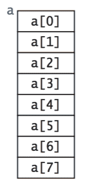
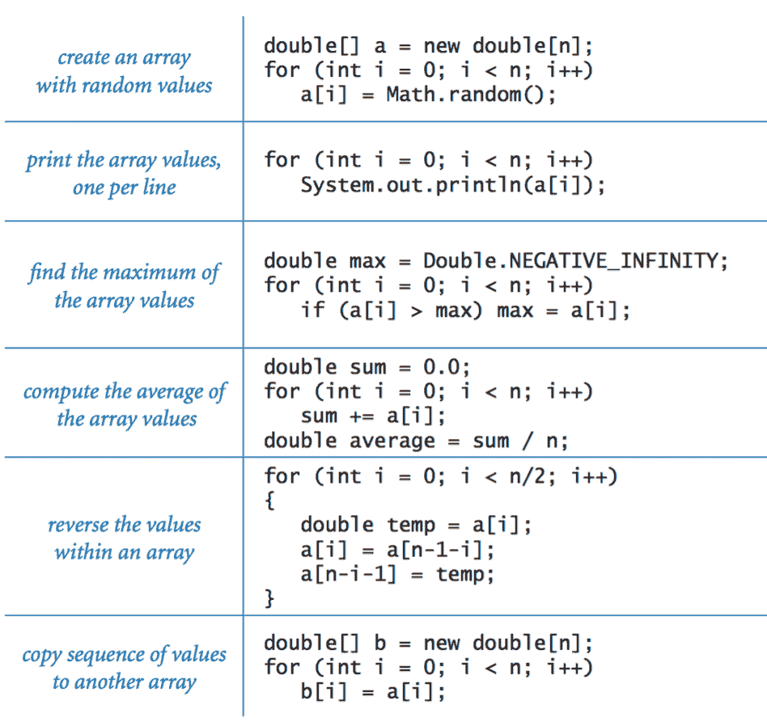
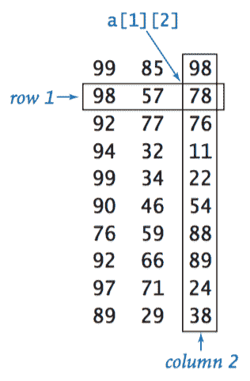

# 1.4   数组

> 原文：[`introcs.cs.princeton.edu/java/14array`](https://introcs.cs.princeton.edu/java/14array)

 在本节中，我们考虑一种称为*数组*的基本构造。数组存储一系列相同类型的值。我们不仅想��储值，还想能够快速访问每个单独的值。我们用来引用数组中单个值的方法是对它们进行编号，然后*索引*它们——如果我们有*n*个值，我们将它们视为从 0 到*n*−1 编号。

## Java 中的数组。

在 Java 程序中创建数组涉及三个不同的步骤：

+   声明数组名称。

+   创建数组。

+   初始化数组数值。

我们通过在数组名称后面的方括号中放置其索引来引用数组元素：代码`a[i]`表示数组`a[]`的第`i`个元素。例如，以下代码创建了一个类型为 double 的 n 个数字的数组，所有元素都初始化为 0：

```
double[] a;                    // declare the array
a = new double[n];             // create the array
for (int i = 0; i < n; i++)    // elements are indexed from 0 to n-1
   a[i] = 0.0;                 // initialize all elements to 0.0

```

## 典型的数组处理代码。

ArrayExamples.java 包含了 Java 中使用数组的典型示例。

> 

## 使用数组进行编程。

在考虑更多示例之前，我们先考虑一些与数组编程相关的重要特性。

+   *基于零的索引。* 我们总是将数组`a[]`的第一个元素称为`a[0]`，第二个称为`a[1]`，依此类推。你可能认为将第一个元素称为`a[1]`，第二个值称为`a[2]`等更自然，但从 0 开始索引有一些优势，并已成为大多数现代编程语言使用的约定。

+   *数组长度。* 一旦我们创建了一个数组，它的长度就是固定的。您可以在程序中使用代码`a.length`引用`a[]`的长度。

+   *默认数组初始化。* 为了节省代码，我们经常利用 Java 的默认数组初始化约定。例如，以下语句等同于本页顶部的四行代码：

    ```
    double[] a = new double[n]; 

    ```

    对于所有数值原始类型，默认初始值为 0，对于布尔类型`boolean`为`false`。

+   *内存表示。* 当您使用`new`创建数组时，Java 会在内存中为其保留空间（并初始化值）。这个过程称为*内存分配*。

+   *边界检查。* 在使用数组编程时，您必须小心。在访问数组元素时使用合法的索引是您的责任。

+   *在编译时设置数组值。* 当我们有一小组我们想要保留在数组中的文字值时，我们可以通过在大括号中列出用逗号分隔的值来初始化它。例如，我们可以在处理扑克牌的程序中使用以下代码。

    ```
    String[] SUITS = {
        "Clubs", "Diamonds", "Hearts", "Spades"
    }; 

    String[] RANKS = {
        "2", "3", "4", "5", "6", "7", "8", "9", "10",
        "Jack", "Queen", "King", "Ace"
    };

    ```

    创建这两个数组后，我们可以使用它们来打印一个随机的卡片名称，比如`梅花皇后`，如下所示。

    ```
    int i = (int) (Math.random() * RANKS.length); 
    int j = (int) (Math.random() * SUITS.length); 
    System.out.println(RANKS[i] + " of " + SUITS[j]); 

    ```

+   *在运行时设置数组值。* 更典型的情况是，当我们希望计算要存储在数组中的值时。例如，我们可以使用以下代码初始化一个长度为 52 的数组，表示一副扑克牌，使用刚刚定义的数组`RANKS[]`和`SUITS[]`。

    ```
    String[] deck = new String[RANKS.length * SUITS.length];
    for (int i = 0; i < RANKS.length; i++) 
        for (int j = 0; j < SUITS.length; j++) 
            deck[SUITS.length*i + j] = RANKS[i] + " of " + SUITS[j]; 
    System.out.println(RANKS[i] + " of " + SUITS[j]); 

    ```

## 洗牌和抽样。

现在我们描述一些有用的算法来重新排列数组中的元素。

+   *交换。* 经常，我们希望在数组中交换两个值。继续我们的扑克牌示例，以下代码交换了位置`i`处的卡片和位置`j`处的卡片：

    ```
    String temp = deck[i]; 
    deck[i] = deck[j]; 
    deck[j] = temp; 

    ```

+   *洗牌。* 以下代码洗牌我们的牌组：

    ```
    int n = deck.length; 
    for (int i = 0; i < n; i++) { 
       int r = i + (int) (Math.random() * (n-i)); 
       String temp = deck[r];
       deck[r] = deck[i];
       deck[i] = temp;
    } 

    ```

    从左到右，我们从`deck[i]`到`deck[n-1]`中选择一张随机卡片（每张卡片同等可能）并将其与`deck[i]`交换。这段代码比看起来更复杂：详情请参阅教科书。Deck.java 包含了创建和洗牌一副扑克牌的完整代码。

+   *无替换抽样*。在许多情况下，我们希望从一个集合中抽取一个随机样本，使得集合中的每个成员在样本中最多出现一次。Sample.java 接受两个命令行参数 `m` 和 `n`，并创建一个长度为 `n` 的*排列*，其中前 `m` 个条目组成一个随机样本。详情请参阅教科书。

### 预先计算的值。

数组的一个简单应用是保存你计算过的值，以供以后使用。例如，假设你正在编写一个使用调和数小值进行计算的程序。实现这样一个任务的一种简单方法是将值保存在一个数组中，代码如���

```
double[] harmonic = new double[n]; 
for (int i = 1; i < n; i++) 
    harmonic[i] = harmonic[i-1] + 1.0/i; 

```

然后简单地使用代码 `harmonic[i]` 来引用任何一个值。以这种方式预先计算值是*时空权衡*的一个例子：通过投资空间（保存值）来节省时间（因为我们不需要重新计算它们）。如果我们需要大量的 n 值，这种方法并不有效，但如果我们需要大量小 n 值的值，这种方法非常有效。

### 简化重复的代码。

作为数组的另一个简单应用的示例，考虑以下代码片段，根据月份的数字（1 代表一月，2 代表二月，依此类推）打印月份的名称。

```
if      (m ==  1) System.out.println("Jan");
else if (m ==  2) System.out.println("Feb");
else if (m ==  3) System.out.println("Mar");
else if (m ==  4) System.out.println("Apr");
else if (m ==  5) System.out.println("May");
else if (m ==  6) System.out.println("Jun");
else if (m ==  7) System.out.println("Jul");
else if (m ==  8) System.out.println("Aug");
else if (m ==  9) System.out.println("Sep");
else if (m == 10) System.out.println("Oct");
else if (m == 11) System.out.println("Nov");
else if (m == 12) System.out.println("Dec");

```

我们也可以使用 `switch` 语句，但一个更紧凑的替代方案是使用一个包含每个月份名称的字符串数组：

```
String[] MONTHS = {
    "", "Jan", "Feb", "Mar", "Apr", "May", "Jun", 
    "Jul", "Aug", "Sep", "Oct", "Nov", "Dec"
};
...
System.out.println(MONTHS[m]);

```

如果你需要在程序的多个不同位置通过其数字访问月份名称，这种技术将特别有用。请注意，我们故意浪费数组中的一个槽（元素 0）以使 `MONTHS[1]` 对应于一月，如所需。

### 优惠券收集器。

假设你有一副洗过的扑克牌，并且你一个接一个地把它们翻面。在你看到每种花色之前，你需要翻多少张牌？这是著名的*收集优惠券*问题的一个例子。一般来说，假设一个交易卡公司发行具有 *n* 种不同可能卡片的交易卡：在你收集到所有 *n* 种可能性之前，你需要收集多少张卡片，假设每张卡片的每种可能性对于你收集的每张卡片都是等可能的？CouponCollector.java 接受一个整数命令行参数 *n* 并模拟这个过程。详情请参阅教科书。

### 埃拉托斯特尼筛法。

[素数计数函数](http://mathworld.wolfram.com/PrimeCountingFunction.html) π(*n*) 是小于或等于 *n* 的素数数量。例如，π(17) = 7，因为前七个素数是 2, 3, 5, 7, 11, 13 和 17。PrimeSieve.java 接受一个整数命令行参数 *n* 并使用[埃拉托斯特尼筛法](http://mathworld.wolfram.com/SieveofEratosthenes.html)计算 π(*n*)。详情请参阅教科书。

## 二维数组。

在许多应用中，组织信息的一种自然方式是使用一个按照矩形组织的数字表，并在表中引用行和列。对应于这种表的数学抽象是*矩阵*；相应的 Java 构造是二维数组。

+   *Java 中的二维数组*。要引用二维数组 `a[][]` 中第 `i` 行和第 `j` 列的元素，我们使用记法 `a[i][j]`；要声明一个二维数组，我们在类型名称后添加另一对方括号；要创建数组，我们在类型名称后指定行数，然后是列数（都在方括号内），如下所示：

    ```
    double[][] a = new double[m][n]; 

    ```

    我们将这样的数组称为*m 行 n 列数组*。按照惯例，第一个维度是行数，第二个维度是列数。

+   *默认初始化。* 与一维数组一样，Java 将数字数组中的所有条目初始化为 0，布尔数组中的所有条目初始化为`false`。二维数组的默认初始化很有用，因为它比一维数组需要更多的代码。要访问二维数组中的每个元素，我们需要嵌套循环：

    ```
    double[][] a; 
    a = new double[m][n]; 
    for (int i = 0; i < m; i++) 
       for (int j = 0; j < n; j++) 
          a[i][j] = 0; 

    ```

+   *内存表示。* Java 将二维数组表示为一个数组的数组。一个具有`m`行和`n`列的矩阵实际上是一个长度为`m`的数组，其中每个条目都是长度为`n`的数组。在 Java 的二维数组中，我们可以使用代码`a[i]`来引用第 i 行（这是一个一维数组）。支持不规则数组。

+   *在编译时设置值。* 以下代码初始化了 11 行 4 列的数组`a[][]`：

    ```
    double[][] a = { 
        { 99.0, 85.0, 98.0, 0.0 }, 
        { 98.0, 57.0, 79.0, 0.0 }, 
        { 92.0, 77.0, 74.0, 0.0 }, 
        { 94.0, 62.0, 81.0, 0.0 }, 
        { 99.0, 94.0, 92.0, 0.0 }, 
        { 80.0, 76.5, 67.0, 0.0 }, 
        { 76.0, 58.5, 90.5, 0.0 }, 
        { 92.0, 66.0, 91.0, 0.0 }, 
        { 97.0, 70.5, 66.5, 0.0 }, 
        { 89.0, 89.5, 81.0, 0.0 },
        {  0.0,  0.0,  0.0, 0.0 }
    };

    ```

+   *不规则数组。* 二维数组中的所有行不需要具有相同的长度要求，一个具有非统一长度行的数组称为*不规则数组*。不规则数组的可能性需要更多的注意来编写数组处理代码。例如，这段代码打印了一个不规则数组的内容：

    ```
    for (int i = 0; i < a.length; i++) { 
        for (int j = 0; j < a[i].length; j++) {
            System.out.print(a[i][j] + " ");
        }
        System.out.println();
    }

    ```

+   *多维数组。* 相同的���示法适用于具有任意维数的数组。例如，我们可以使用以下代码声明和初始化一个三维数组

    ```
    double[][][] a = new double[n][n][n];

    ```

    然后通过类似`a[i][j][k]`的代码引用一个条目。


## 矩阵操作。

在科学和工程中的典型应用中，涉及使用矩阵操作数执行各种数学操作。例如，我们可以如下*相加*两个*n*乘*n*的矩阵：

```
double[][] c = new double[n][n];
for (int i = 0; i < n; i++) {
    for (int j = 0; j < n; j++) {
        c[i][j] = a[i][j] + b[i][j];
    }
}

```

类似地，我们可以*相乘*两个矩阵。矩阵`a[]`和`b[]`的乘积中的每个条目`c[i][j]`是通过计算`a[]`的第 i 行与`b[]`的第 j 列的点积来计算的。

```
double[][] c = new double[n][n];
for (int i = 0; i < n; i++) {
    for (int j = 0; j < n; j++)  {
        for (int k = 0; k < n; k++)  {
            c[i][j] += a[i][k]*b[k][j];
        }
    }
}

```

## 避免自我交叉的行走。

SelfAvoidingWalk.java 是将二维数组应用于化学的一个应用。详情请参阅教科书。

#### 练习

1.  描述并解释当您尝试编译一个程序 HugeArray.java 时会发生什么，其中包含以下语句：

    ```
    int n = 1000;
    int[] a = new int[n*n*n*n];

    ```

1.  编写一个代码片段，将一维字符串数组中的值顺序颠倒。不要创建另一个数组来保存结果。*提示*：使用文本中用于交换两个元素的代码。

    *解决方案。*

    ```
    int n = a.length;
    for (int i = 0; i < n/2; i++) {
        String temp = a[n-i-1];
        a[n-i-1] = a[i];
        a[i] = temp;
    }

    ```

1.  以下代码片段有什么问题？

    ```
    int[] a;
    for (int i = 0; i < 10; i++)
       a[i] = i * i;

    ```

    *解决方案：* 它没有使用`new`为`a[]`分配内存。该代码导致`variable might not have been initialized`编译时错误。

1.  以下代码片段打印什么？

    ```
    int[] a = { 1, 2, 3 };
    int[] b = { 1, 2, 3 };
    System.out.println(a == b);

    ```

    *解决方案：* 它打印 false。`==`运算符比较（内存地址的）两个数组是否相同，而不是它们对应的值是否相等。

1.  编写一个程序 Deal.java，它接受一个整数命令行参数`n`，并从洗牌后的牌组中打印`n`个扑克牌手（每手五张牌），用空行分隔。

1.  编写一个程序 HowMany.java，它接受可变数量的命令行参数并打印它们的数量。

1.  编写一个程序 DiscreteDistribution.java，它接受可变数量的整数命令行参数，并按照第`i`个命令行参数的比例打印整数`i`。

1.  编写一个代码片段 Transpose.java，在不创建第二个数组的情况下对一个方形的二维数组进行转置。

#### 创意练习

1.  **糟糕的洗牌。** 假设在我们的洗牌代码中，你选择一个在 0 到 n-1 之间的随机整数，而不是在 i 到 n-1 之间选择一个。证明结果的顺序不可能是 n!种可能性之一。对这个版本运行上一个练习的测试。

    *部分解决方案：* 当 n = 3 时，所有 3! = 6 种结果都是可能的，但有些更有可能：

    | ABC | ACB | BAC | BCA | CAB | CBA |
    | --- | --- | --- | --- | --- | --- |
    | 4/27 | 5/27 | 6/27 | 4/27 | 5/27 | 3/27 |

    当[PlanetPoker](https://www.datamation.com/entdev/article.php/616221/How-We-Learned-to-Cheat-at-Online-Poker-A-Study-in-Software-Security.htm)使用一个只能生成可能的 52!中约 200,000 个洗牌的破损洗牌算法时发生了什么。

1.  **逆排列。** 编写一个程序 InversePermutation.java，从`n`个命令行参数中读取 0 到`n-1`的整数的一个排列，并打印*逆排列*。（如果排列在一个数组`a[]`中，其*逆排列*是数组`b[]`，使得`a[b[i]] = b[a[i]] = i`。）确保检查输入是否是有效的排列。

1.  **哈达玛矩阵。** n 阶哈达玛矩阵 H(n)是一个布尔矩阵，具有这样一个显著的特性，即任意两行在恰好 n/2 位上不同。（这个特性使其在设计*纠错码*时非常有用。）H(1)是一个 1 阶矩阵，其中唯一的元素为 true，对于 n > 1，H(2n)通过将四个 H(n)的副本对齐在一个大正方形中获得，然后反转右下角的 n 阶副本中的所有元素，如下例所示（T 代表 true，F 代表 false，如常）。

    ```
    H(1)  H(2)    H(4)
    -------------------
     T    T T   T T T T
          T 0   T 0 T 0
                T T 0 0
                T 0 0 T 

    ```

    编写一个程序 Hadamard.java，接受一个命令行参数 n 并打印 H(n)。假设 n 是 2 的幂。

1.  **随机漫步者。** 假设有 n 个随机漫步者，从一个 n 乘 n 的网格的中心开始，每次移动一步，选择向左、向右、向上或向下的概率相等。编写一个程序 RandomWalkers.java 来帮助制定和测试有关在所有单元格被触及之前所需步数的假设。

1.  **生日问题。** 假设人们进入一个空房间，直到有一对人共享生日。平均来说，有多少人会进入才会有匹配？编写一个程序 Birthday.java 来模拟一个实验。编写一个程序 Birthdays.java 来重复实验多次并估计平均值。假设生日是在 0 到 364 之间均匀随机的整数。

1.  **二项式系数。** 编写一个程序 BinomialDistribution.java，构建并打印一个二维不规则数组 a，使得`a[n][k]`包含抛掷 n 次硬币时获得恰好 k 个正面的概率。接受一个命令行参数以指定 n 的最大值。这些数字被称为*二项分布*：如果将第 i 行中的每个条目乘以 2^n，就得到*二项式系数*—(x+1)^n 中 x^k 的系数—排列在*帕斯卡三角形*中。要计算它们，从`a[n][0] = 0.0`开始对所有 n，`a[1][1] = 1.0`，然后按行从左到右计算值，`a[n][k] = (a[n-1][k] + a[n-1][k-1]) / 2`。

    ```
    Pascal's triangle   Binomial distribution
    --------------------------------------------
    1                   1 
    1 1                 1/2  1/2 
    1 2 1               1/4  1/2  1/4 
    1 3 3 1             1/8  3/8  3/8  1/8 
    1 4 6 4 1           1/16 1/4  3/8  1/4  1/16

    ```

#### 网页练习

1.  **生日问题。** 修改 Birthday.java 以计算两个人生日相差不超过一天的概率。

1.  **高于平均水平。** 90%的大学新生认为自己高于平均水平。编写一个程序`AboveAverage.java`，它接受一个命令行参数 n，从标准输入读取 n 个整数，并打印严格高于平均值的值的比例。

1.  **随机排列。** 编写一个程序 Permutation.java，使其接受一个命令行参数 N，并打印整数 0 到 N-1 的一个随机排列。同时打印排列的*棋盘可视化*。例如，排列{ 4, 1, 3, 0, 2 }对应于：

    ```
    4 1 3 0 2
    * * * Q * 
    * Q * * * 
    * * * * Q 
    * * Q * * 
    Q * * * * 

    ```

1.  **8 皇后检查器。** 整数 0 到 n-1 的排列对应于在 n×n 的棋盘上放置皇后，以便没有两个皇后在同一行或列中。编写一个程序`QueensChecker.java`，确定排列是否对应于放置皇后的位置，以便没有两个皇后在同一行、列或*对角线*上。例如，排列{ 4, 1, 3, 0, 2 }是一个合法的放置：

    ```
    * * * Q * 
    * Q * * * 
    * * * * Q 
    * * Q * * 
    Q * * * * 

    ```

    尝试在除了长度为 n 的输入排列`q`之外不使用任何额外数组。*提示*：确定设置 q[i]是否与 q[j]冲突，其中 i < j。

    +   如果 q[i]等于 q[j]：两个皇后放在同一行上

    +   如果 q[i] - q[j]等于 j - i：两个皇后在同一主对角线上

    +   如果 q[j] - q[i]等于 j - i：两个皇后在同一副对角线上

1.  **找到你的啤酒。** 大量的大学生正在参加一个派对。每位客人都在喝一罐啤酒（如果他们未满 21 岁，则为苏打）。一次紧急情况导致灯灭和火警响起。客人们平静地放下他们的啤酒并离开建筑物。当警报响起时，他们重新进入并尝试找回他们的啤酒。然而，灯还是关着，所以每个学生随机拿起一瓶啤酒。至少有一个学生拿到自己原来的啤酒的机会有多大？编写一个程序`MyBeer.java`，接受一个命令行参数 n，并运行 1000 次模拟这个事件，假设有 n 位客人。打印至少有一位客人拿到自己原来啤酒的次数比例。当 n 变大时，这个比例是接近 0 还是 1 还是介于两者之间？

1.  **线性反馈移位寄存器。** 通过使用数组重写线性反馈移位寄存器第一章，使其更加简洁和可扩展，例如，如果移位寄存器中的单元数增加。程序 LFSR.java 使用一个`boolean` *提示*：使用`^`运算符对两个布尔值进行异或操作。

1.  **储物柜。** 你在一个有 100 个开放储物柜的更衣室里，编号从 1 到 100。切换所有偶数的储物柜。通过*切换*，我们的意思是如果是开着的就关闭，如果是关闭的就打开。现在切换所有 3 的倍数的储物柜。重复 4、5、直到 100 的倍数。有多少个储物柜是开着的？*答案*：储物柜 1、4、9、16、25、...、100 将是开着的。一旦看到模式，你可能不需要数组。

1.  **带截止日期的调度。** 假设您有 N 个任务要安排。每个任务需要 1 个单位的时间，并且有一个截止日期，到达截止日期时应该完成任务。如果任务未在截止日期前完成，您将支付 1000 美元的罚款。找到一个最小化罚款的调度方案。*提示*：按照截止日期的顺序安排任务，但不要为无法在截止日期前完成的任务费心。

1.  **日历。** 重复练习 1.33，为给定的月份和年份制作一个日历。使用数组存储一周中的天的名称，月份的名称以及一个月中的天数。

1.  **四子连珠。** 给定一个 N×N 的网格，每个单元格都被'X'、'O'或空占据，编写一个程序来找到水平、垂直或对角线上连续'X'的最长序列。为了测试您的程序，您可以创建一个随机网格，其中每个单元格包含'X'或'O'的概率为 1/3。

1.  **泰拳。** 编写一个程序 KickBoxer.java，接受一个整数体重 w 作为命令行输入，并根据下表打印相应的泰拳体重级别。

    ```
    weight class              from    to
    ------------------------------------
    Fly Weight                   0   112
    Super Fly Weight           112   115
    Bantam Weight",            115   118
    Super Bantam Weight        118   122
    Feather Weight             122   126
    Super Feather Weight       126   130
    Light Weight               130   135
    Super Light Weight         135   140
    Welter Weight              140   147
    Super Welter Weight        147   154
    Middle Weight              154   160
    Super Middle Weight        160   167
    Light Heavy Weight         167   174
    Super Light Heavy Weight   174   183
    Cruiser Weight             183   189
    Super Cruiser Weight       189   198
    Heavy Weight               198   209
    Super Heavy Weight         209

    ```

    使用一个整数数组来存储重量限制，一个字符串数组来存储重量类别（从 Flyweight 到 Super Heavyweight）。

1.  **N 进制计数器。** 编写一个程序，从 0 计数到 N²⁰ - 1 的 N 进制数。使用一个包含 20 个元素的数组。

1.  **地形分析。** 给定一个 N×N 的海拔值网格（以米为单位），*峰值*是一个所有四个相邻单元格都严格较低的网格点。编写一个代码片段，计算给定 N×N 网格中的峰值数量。

1.  **幻方。** 编写��个名为 MagicSquare.java 的程序，从命令行读取一个奇数整数 N，并打印出一个 N×N 的幻方。该方格包含 1 到 N² 之间的每个整数，使得所有行总和、列总和和对角线总和相等。

    ```
    4  9  2    11 18 25  2  9
    3  5  7    10 12 19 21  3
    8  1  6     4  6 13 20 22
               23  5  7 14 16
               17 24  1  8 15

    ```

    一个简单的算法是按升序分配整数 1 到 N²，从底部中间单元格开始。重复将下一个整数分配给右下角对角线相邻的单元格。如果此单元格已分配了另一个整数，则改为使用上方相邻的单元格。使用环绕处理边界情况。

1.  **横幅。** 编写一个名为`Banner.java`的程序，接受一个字符串作为命令行参数，并按照以下方式打印出大字母的字符串。

    ```
    % java Banner "Kevin"
     #    #  ######  #    #     #    #    #
     #   #   #       #    #     #    ##   #
     ####    #####   #    #     #    # #  #
     #  #    #       #    #     #    #  # #
     #   #   #        #  #      #    #   ##
     #    #  ######    ##       #    #    #

    ```

    模仿 Unix 实用程序`banner`。

1.  **选举和社会选择理论。** 多数制（美国总统选举）、决胜选举、顺序决胜选举（澳大利亚、爱尔兰、普林斯顿大学教师委员会）、康多塞。肯尼米排名聚合。阿罗不可能定理。体育、谷歌、元搜索、机器学习等领域的相同思想。

1.  **波达计数。** 1781 年，波达提出了一种用于确定具有 K 选民和 N 候选人的政治选举结果的位置方法。每个选民按照偏好的递增顺序（从 1 到 N）对候选人进行排名。波达的方法为每个候选人分配一个分数，等于他们的排名之和。得分最高的候选人获胜。这在美国职业棒球大联盟中用于确定最有价值球员。

1.  **肯德尔的 tau 距离。** 给定两个排列，肯德尔的 tau 距离是位置不同的对数。"冒泡排序度量"。在前 k 个列表中很有用。在选举理论中，最优的肯尼米排名聚合可以最小化肯德尔的 tau 距离。也可用于使用多个表达谱来排名基因、排名搜索引擎结果等。

1.  **斯皮尔曼的脚距离。** 给定两个排列，斯皮尔曼的脚距离是排列作为向量之间的 L1 距离。在前 k 个列表中很有用。

    ```
    int footrule = 0;
    for (int i = 0; i < N; i++)
        footrule = footrule + Math.abs(p[i] - q[i]);

    ```

1.  **美国邮政条形码。** [POSTNET](http://en.wikipedia.org/wiki/POSTNET)条形码被美国邮政系统用于邮件路由。邮政编码中的每个十进制数字都使用一系列 5 个短线和长线进行编码，以供扫描仪使用，如下所示：

    > | VALUE | ENCODING |
    > | --- | --- |
    > | 0 | `&#124;&#124;╷╷╷` |
    > | 1 | `╷╷╷&#124;&#124;` |
    > | 2 | `╷╷&#124;╷&#124;` |
    > | 3 | `╷╷&#124;&#124;╷` |
    > | 4 | `╷&#124;╷╷&#124;` |
    > | 5 | `╷&#124;╷&#124;╷` |
    > | 6 | `╷&#124;&#124;╷╷` |
    > | 7 | `&#124;╷╷╷&#124;` |
    > | 8 | `&#124;╷╷&#124;╷` |
    > | 9 | `&#124;╷&#124;╷╷` |

    添加第六个校验和数字：通过对原始五位数字进行模 10 求和来计算。此外，将一条长线添加到开头并附加到末尾。编写一个名为 ZipBarCoder.java 的程序，从命令行参数读取一个五位数邮政编码，并打印相应的[邮政条形码](http://www.ams.org/new-in-math/cover/barcodes3.html)。垂直打印代码，而不是水平打印，例如，以下编码 08540（校验位为 7）。

    ```
    *****
    *****
    *****
    **
    **
    **
    *****
    **
    **
    *****
    **
    **
    *****
    **
    *****
    **
    **
    *****
    **
    **
    *****
    *****
    *****
    **
    **
    **
    *****
    **
    **
    **
    *****
    *****

    ```

1.  **美国邮政条形码。** 重复上一个练习，但使用海龟图形绘制输出。

1.  **没有质数的间隙。** 找到最长的连续整数序列，其中没有质数。编写一个名为 PrimeGap.java 的程序，接受一个命令行参数 N，并打印出 2 到 N 之间没有质数的最大整数块。

1.  **哥德巴赫猜想。** 1742 年，克里斯蒂安·哥德巴赫猜想，每个大于 2 的偶数都可以写成两个质数的和。例如，16 = 3 + 13。编写一个程序 Goldbach.java，接受一个命令行参数 N，并将 N 表示为两个质数的和。[哥德巴赫猜想](http://mathworld.wolfram.com/GoldbachConjecture.html)仍未解决，但已知对于所有 N < 10¹⁴都成立。

1.  **排列中的最小值。** 编写一个程序，从命令行接受一个整数 n，生成一个随机排列，打印排列，然后打印排列中从左到右的最小值的次数（元素是迄今为止看到的最小值的次数）。然后编写一个程序，从命令行接受整数 m 和 n，生成长度为 n 的 m 个随机排列，并打印生成的排列中从左到右的最小值的平均次数。*额外学分*：提出一个关于长度为 n 的排列中从左到右的最小值次数的假设函数。

1.  **原地逆置排列。** 重新做练习 1.4.25，但在原地计算排列，即不为逆置排列分配第二个数组。*注意*：这很困难。

1.  **最有可能的点数。** 爱丽丝和鲍勃就是否重复掷骰子直到总和超过 12 而争论不休，13 是否是最有可能的总和？编写一个程序 MostLikelyRoll.java 来模拟这个过程一百万次，并生成一个表格，显示总和为 13、14、15、16、17 和 18 的次数比例。

1.  **螺旋 2D 数组。** 给定一个 2D 数组，编写一个程序 Spiral.java 以螺旋顺序打印出来。

    ```
     1  2  3  4
     5  6  7  8
     9 10 11 12
    13 14 15 16

    1 2 3 4 8 12 16 15 14 13 9 5 6 7 11 10

    ```

1.  **数独验证器。** 给定一个 9x9 的整数数组，检查它是否是数独谜题的有效解：每行、每列和每个块应该包含 9 个整数，且仅出现一次。

    ```
     5 3 4 | 6 7 8 | 9 1 2 
     6 7 2 | 1 9 5 | 3 4 8 
     1 9 8 | 3 4 2 | 5 6 7
    -------+-------+------ 
     8 5 9 | 7 6 1 | 4 2 3 
     4 2 6 | 8 5 3 | 7 9 1 
     7 1 3 | 9 2 4 | 8 5 6 
    -------+-------+------ 
     9 6 1 | 5 3 7 | 2 8 4 
     2 8 7 | 4 1 9 | 6 3 5 
     3 4 5 | 2 8 6 | 1 7 9

    ```

1.  **幂和猜想。** 重新做练习 1.3.x，但预先计算所有相关整数的 5 次幂。评估这样做节省了多少时间。程序 Euler.java 搜索整数解 a⁵ + b⁵ + c⁵ + d⁵= e⁵。

1.  **哈尔小波变换。** 给定长度为 2^n 的数组`a[]`，其[1D 哈尔变换](http://online.redwoods.cc.ca.us/instruct/darnold/LAPROJ/Fall2002/ames/paper.pdf)如下获得：计算 a[2i]和 a[2i+1]的平均值和差值，计算相同长度的数组，包含平均值，然后是差值。然后对平均值（前 2^n-1 个条目）应用相同的技术，依此类推。下面展示了一个有 2³ 个条目的示例。

    ```
     448  768  704  640 1280 1408 1600 1600  (original)
     608  672 1344 1600 -160   32  -64    0  (step 1)
     640 1472  -32 -128 -160   32  -64    0  (step 2)
    1056 -416  -32 -128 -160   32  -64    0  (step 3)

    ```

    2^n 乘以 2^n 矩阵的*2D 哈尔小波变换*，通过对每一行应用哈尔小波变换，然后对每一列应用哈尔小波变换获得。哈尔小波变换在信号处理、医学成像和数据压缩中很有用。

1.  当您尝试编译具有以下语句的程序时会发生什么？

    ```
    int[] a = new int[-17];

    ```

    它可以干净地编译，但在执行时抛出`java.lang.NegativeArraySizeException`。

1.  **二十一点。** 编写一个程序 Blackjack.java，接受三个命令行整数 x、y 和 z，表示您的两张二十一点牌 x 和 y，以及庄家的明牌 z，并根据大西洋城 6 副牌的“标准策略”打印出来。假设 x、y 和 z 是 1 到 10 之间的整数，表示从 A 到面牌。根据这些[策略表](http://www.blackjackinfo.com/cgi-bin/bjbse.cgi?game=ac6)报告玩家应该要牌、停牌还是分牌。使用三个 2D 布尔数组编码策略表。

    修改`Blackjack.java`以允许*加倍*。

1.  **玻尔兹曼分布。**这里有一个简单的模型来近似统计物理中的玻尔兹曼分布：生成 1 到 10 之间的 100 个随机整数。如果总和恰好为 200，则保留此试验。重复此过程，直到满足条件的试验达到 1,000 次。现在绘制每个 10 个整数出现次数的直方图。

1.  **双随机。**编写一个程序来读取一个 N×N 的实数矩阵，并在矩阵是*双随机*时打印`true`，否则打印`false`。如果所有行和列的和都为 1，则矩阵是*随机*的。由于涉及浮点数，允许和在 1-ε和 1+ε之间，其中ε= 0.000000001。

1.  假设`b[]`是一个包含 100 个元素的数组，所有条目都初始化为 0，并且`a[]`是一个包含 N 个元素的数组，每个元素都是介于 0 和 99 之间的整数。以下循环的效果是什么？

    |

    ```
    for (j = 0; j < N; j++)
       b[a[j]]++;

    ```

    |

1.  修改 RandomStudent.java 以便它存储一个名为`isFemale`的布尔类型的并行数组，其中元素 i 如果学生 i 是女性则为`true`，否则为`false`。现在，随机打印一个男学生和一个女学生。*提示*：使用`do-while`循环生成随机整数，直到得到一个索引男学生的整数。

1.  以下哪些需要使用数组。对于每个输入来自标准输入，包含 N 个介于 0.0 和 1.0 之间的实数。

    1.  打印最大的元素。

    1.  打印最大和最小的元素。

    1.  打印中位数元素。

    1.  打印出现频率最高的元素。

    1.  打印元素的平方和。

    1.  打印 N 个元素的平均值。

    1.  打印最接近 0 的元素。

    1.  打印所有大于平均值的数字。

    1.  以递增顺序打印 N 个元素。

    1.  以随机顺序打印 N 个元素。

    1.  打印直方图（例如，大小为 0.1 的 10 个箱）。

1.  编写一个程序 Yahtzee.java 来模拟掷五个骰子并打印“Yahtzee”，如果所有五个骰子都相同；否则应打印“再试一次”。

1.  修改 DayOfWeek.java 以便它读取一个日期并打印该日期是星期几。您的程序应该接受三个命令行参数，M（月份），D（日期）和 Y（年份）。不要使用任何`if-else`语句；而是使用一个包含一周 7 天名称的字符串数组。

1.  编写一个程序 Pascal.java 来使用一个不规则数组计算帕斯卡三角形。

1.  **将矩阵行和列清零。**给定一个*m*×*n*整数矩阵`a[][]`，如果`a[i][j]`为 0，则将第 i 行和第 j 列设置为 0。不要使用任何额外的数组。

    *解决方案*。首先，检查第 0 行是否有 0，以及第 0 列是否有 0；将此信息记录在两个布尔变量中。接下来，对于每个为 0 的元素`a[i][j]`，将元素`a[i][0]`和`a[0][j]`设置为 0。最后，如果`a[i][0]`或`a[0][j]`中有一个为 0，则将`a[i][j]`设置为 0。
