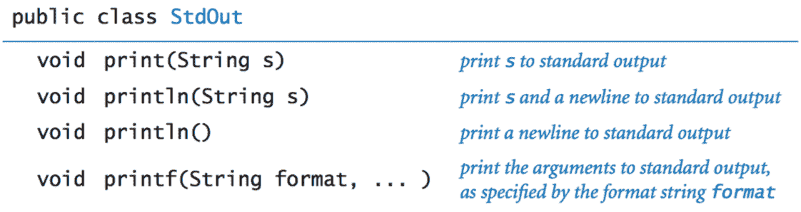
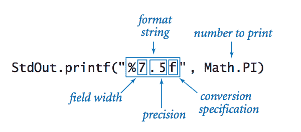
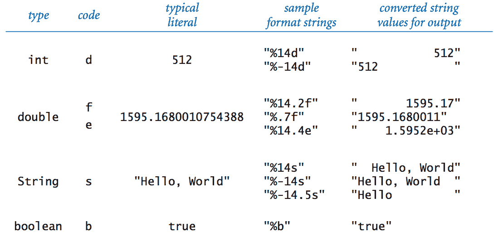
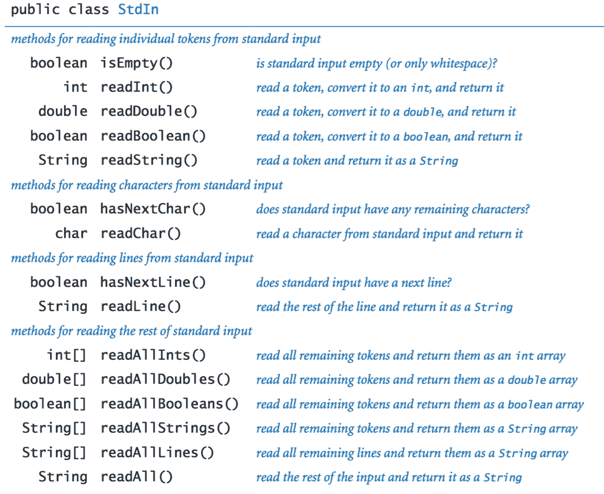
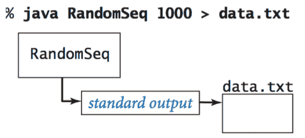
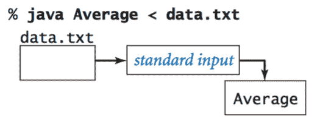
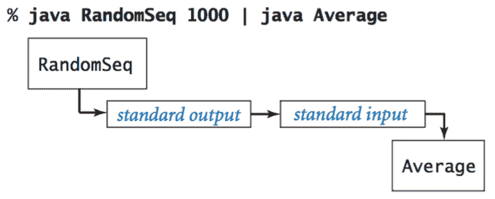
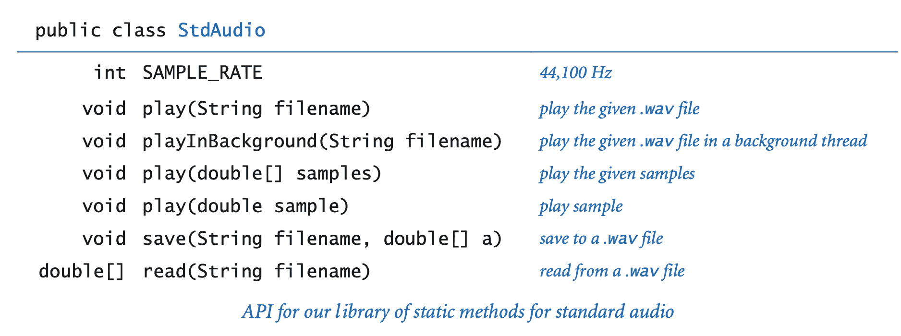

# 1.5 输入和输出

> 原文：[`introcs.cs.princeton.edu/java/15inout`](https://introcs.cs.princeton.edu/java/15inout)

在本节中，我们将扩展我们一直在使用的简单抽象集合（命令行输入和标准输出）以包括*标准输入*、*标准绘图*和*标准音频*，以便我们编写处理任意数量输入的程序并与我们的程序交互；标准绘图使我们能够处理图形；标准音频添加了声音。 

## 俯视图。

一个 Java 程序从命令行接受输入值，并将一串字符作为输出打印出来。默认情况下，命令行参数和标准输出都与一个接受命令的应用程序相关联，我们称之为*终端窗口*。

+   *命令行参数。* 我们所有的类都有一个以`String`数组`args[]`为参数的`main()`方法。该数组是我们键入的命令行参数序列。如果我们打算将参数作为数字处理，我们必须使用`Integer.parseInt()`等方法将其从`String`转换为适当的类型。

+   *标准输出。* 为了在我们的程序中打印输出值，我们一直在使用`System.out.println()`。Java 将结果发送到一个称为*标准输出*的字符抽象流。默认情况下，操作系统将标准输出连接到终端窗口。到目前为止，我们程序中的所有输出都出现在终端窗口中。

RandomSeq.java 使用这个模型：它接受一个命令行参数*n*，并将*n*个介于 0 和 1 之间的随机数序列打印到标准输出。

为了完成我们的编程模型，我们添加以下库：

+   *标准输入。* 从用户那里读取数字和字符串。

+   *标准绘图。* 绘制图形。

+   *标准音频。* 创建声音。

## 标准输出。

Java 的`System.out.print()`和`System.out.println()`方法实现了我们需要的基本标准输出抽象。尽管如此，为了以统一的方式处理标准输入和标准输出（并提供一些技术改进），我们使用在我们的 StdOut 库中定义的类似方法：

> 

Java 的`print()`和`println()`方法是您一直在使用的方法。`printf()`方法使我们能够更好地控制输出的外观。

+   *格式化打印基础知识。* 在其最简单的形式中，`printf()`接受两个参数。第一个参数称为*格式字符串*。它包含一个*转换规范*，描述了如何将第二个参数转换为输出的字符串。

    > 

    格式字符串以`%`开头，并以一个字母的*转换代码*结尾。以下表总结了最常用的代码：

    > 

+   *格式字符串。* 格式字符串可以包含除转换规范之外的字符。转换规范将被参数值替换（按指定的方式转换为字符串），所有剩余字符都将传递到输出。

+   *多个参数。* `printf()`函数可以接受两个以上的参数。在这种情况下，格式字符串将为每个额外的参数有一个额外的转换规范。

这里有更多关于[printf 格式字符串语法](http://docs.oracle.com/javase/8/docs/api/java/util/Formatter.html#syntax)的文档。

## 标准输入。

我们的 StdIn 库从包含一系列由空格分隔的值的*标准输入流*中获取数据。每个值都是一个字符串或来自 Java 的原始类型之一。标准输入流的一个关键特点是，当程序读取值时，它会*消耗*这些值。一旦程序读取了一个值，就不能回退并再次读取它。该库由以下 API 定义：

> 

现在我们详细考虑几个示例。

+   *输入数据。* 当您使用`java`命令从命令行调用 Java 程序时，实际上正在执行三件事：(1) 发出命令以开始执行程序，(2) 指定命令行参数的值，以及(3) 开始定义标准输入流。您在命令行后的终端窗口中键入的字符序列是标准输入流。例如，AddInts.java 接受一个命令行参数`n`，然后从标准输入读取`n`个数字并将它们相加，然后将结果打印到标准输出：

    > 

+   *输入格式。* 如果您在`StdIn.readInt()`期望一个`int`时键入`abc`或`12.2`或`true`，那么它将响应`InputMismatchException`。`StdIn`将连续空格字符的字符串视为一个空格，并允许您用这样的字符串来分隔您的数字。

+   *交互式用户输入。* TwentyQuestions.java 是一个与用户交互的简单程序示例。该程序生成一个随机整数，然后给出线索，让用户尝试猜测数字。这个程序与我们编写的其他程序之间的根本区别在于，用户有能力在程序执行时*改变控制流*。

+   *处理任意大小的输入流。* 通常，输入流是有限的：您的程序遍历输入流，消耗值，直到流为空。但是输入流的大小没有限制。Average.java 从标准输入读取一系列实数并���印它们的平均值。

## 重定向和管道。

对于许多应用程序来说，从终端窗口键入输入数据作为标准输入流是不可行的，因为这样做会限制我们程序的处理能力，限制了我们可以键入的数据量。同样，我们经常希望保存在标准输出流上打印的信息以供以后使用。我们可以使用操作系统机制来解决这两个问题。

+   *将标准输出重定向到文件。* 通过向调用程序的命令添加一个简单的指令，我们可以*重定向*其标准输出到文件，无论是用于永久存储还是在以后的某个时间输入到其他程序中。例如，命令

    > 

    指定标准输出流不要打印在终端窗口中，而是写入一个名为`data.txt`的文本文件。每次调用`StdOut.print()`或`StdOut.println()`都会在该文件的末尾追加文本。在这个例子中，最终结果是一个包含 1,000 个随机值的文件。

+   *从文件重定向标准输入。* 同样，我们可以重定向标准输入，使`StdIn`从文件而不是终端窗口读取数据。例如，命令

    > 

    从文件`data.txt`中读取一系列数字并计算它们的平均值。具体来说，`<`符号是一个指令，通过从文件`data.txt`中读取值来实现标准输入流，而不是等待用户在终端窗口中输入。当程序调用`StdIn.readDouble()`时，操作系统从文件中读取值。将标准输入从文件重定向到文件的能力使我们能够处理来自任何来源的大量数据，仅受我们可以存储的文件大小的限制。

+   *连接两个程序.* 实现标准输入和标准输出抽象的最灵活方式是指定它们由我们自己的程序实现！这种机制称为*管道*。例如，以下命令

    > 

    指定`RandomSeq`的标准输出和`Average`的标准输入流是*相同*的流。

+   *过滤器.* 对于许多常见任务，方便将每个程序视为将标准输入流以某种方式转换为标准输出流的过滤器，RangeFilter.java 接受两个命令行参数，并在标准输出上打印出标准输入中落在指定范围内的数字。

    您的操作系统还提供了许多过滤器。例如，`sort`过滤器将标准输入中的行按排序顺序放置：

    ```java
    % java RandomSeq 5 | sort
    0.035813305516568916 
    0.14306638757584322 
    0.348292877655532103 
    0.5761644592016527 
    0.9795908813988247 

    ```

    另一个有用的过滤器是`more`，它从标准输入读取数据，并在终端窗口中一次显示一个屏幕。例如，如果您键入

    ```java
    % java RandomSeq 1000 | more

    ```

    您将看到尽可能多的数字适合您的终端���口，但更多的数字将等待您按空格键，然后显示每个后续屏幕。

## 标准绘图。

现在我们引入一个简单的抽象来生成绘图作为输出。我们想象一个能够在二维画布上绘制线条和点的抽象绘图设备。该设备能够响应我们的程序以静态方法调用的形式发出的命令，这些命令在 StdDraw 中。主要接口由两种方法组成：*绘图命令*，导致设备执行动作（如绘制线条或绘制点），以及*控制命令*，设置参数，如笔的大小或坐标比例。

+   *基本绘图命令.* 我们首先考虑绘图命令：

    > 

    这些方法几乎是自解释的：`StdDraw.line(x0, y0, x1, y1)`绘制一条连接点(*x*[0], *y*[0])和点(*x*[1], *y*[1])的直线段。`StdDraw.point(x, y)`在点(*x*, *y*)上绘制一个点。默认坐标比例是单位正方形（所有*x*和*y*坐标在 0 和 1 之间）。标准实现在计算机屏幕上的窗口中显示画布，黑色线条和点在白色背景上。

    *您的第一个绘图.* 使用`StdDraw`进行图形编程的`HelloWorld`是在三角形内绘制一个点。Triangle.java 通过三次调用`StdDraw.line()`和一次调用`StdDraw.point()`来实现这一点。

+   *控制命令.* 默认画布大小为 512x512 像素，默认坐标系为单位正方形，但我们经常希望以不同比例绘制图表。此外，我们经常希望绘制不同粗细的线段或不同大小的点。为了满足这些需求，`StdDraw`具有以下方法：

    > 

    例如，两次调用序列

    ```java
    StdDraw.setXscale(x0, x1);
    StdDraw.setYscale(y0, y1); 

    ```

    将绘图坐标设置为一个*边界框*，其左下角在(*x*[0], *y*[0])处，右上角在(*x*[1], *y*[1])处。

    +   *将数据绘制到标准绘图。* PlotFilter.java 从标准输入读取由(*x*, *y*)坐标定义的点序列，并在每个点处绘制一个点。它采用的约定是标准输入的前四个数字指定了边界框，以便它可以缩放绘图。

        > `% **java PlotFilter <**` `USA.txt`
        > 
        > 

    +   *绘制函数图。* FunctionGraph.java 在区间(0, π)中绘制函数*y* = sin(4*x*) + sin(20*x*)。在该区间内有无限多个点，因此我们必须通过在区间内的有限数量的点上评估函数来进行。我们通过选择一组*x*值对函数进行*采样*，然后通过在每个*x*值处评估函数来计算*y*值。通过连接相邻点绘制函数产生了所谓的*分段线性逼近*。

        > 

+   *轮廓和填充形状。* `StdDraw`还包括绘制圆、矩形和任意多边形的方法。每个形状定义了一个轮��。当方法名只是形状名时，轮廓由绘图笔描绘。当方法名以`filled`开头时，命名形状将被实心填充，而不是描边。

    > 

    `circle()`的参数定义了半径为 r 的圆；`square()`的参数定义了以给定点为中心的边长为 2r 的正方形；`polygon()`的参数定义了我们通过线连接的一系列点，包括从最后一个点到第一个点的线。

    > 

+   *文本和颜色。* 为了注释或突出显示绘图中的各种元素，`StdDraw`包括用于绘制文本、设置字体和设置笔墨颜色的方法。

    > 

    在这段代码中，[java.awt.Font](http://docs.oracle.com/javase/8/docs/api/java/awt/Font.html) 和 [java.awt.Color](http://docs.oracle.com/javase/8/docs/api/java/awt/Color.html) 是使用非原始类型实现的抽象，你将在第 3.1 节中了解到。在那之前，我们将细节留给`StdDraw`。默认的墨水颜色是黑色；默认字体是 16 点普通衬线字体。

+   *双缓冲。* `StdDraw`支持一个强大的计算机图形功能，称为*双缓冲*。通过调用`enableDoubleBuffering()`启用双缓冲时，所有绘图都在*离屏画布*上进行。离屏画布不会显示；它只存在于计算机内存中。只有当你调用`show()`时，你的绘图才会从离屏画布复制到*屏幕画布*，然后在标准绘图窗口中显示。你可以将双缓冲看作是收集所有你要绘制的线条、点、形状和文本，然后在请求时同时绘制它们的过程。使用双缓冲的一个原因是在执行大量绘图命令时提高效率。

+   *计算机动画。* 我们对双缓冲最重要的用途是制作*计算机动画*，通过快速显示静态绘图来产生运动的幻觉。我们可以通过重复以下四个步骤来制作动画：

    +   清除离屏画布。

    +   在离屏上绘制对象

    +   将离屏画布复制到屏幕画布。

    +   等待片刻。

    为了支持这些步骤，`StdDraw`有几种方法：

    > 

    动画的“Hello, World”程序是产生一个黑色小球，看起来在画布上移动，并根据弹性碰撞定律反弹。假设小球在位置(*x*, *y*)，我们想要给人一种它移动到新位置，比如(*x* + 0.01, *y* + 0.02)的印象。我们通过四个步骤实现：

    +   将屏幕外画布清空为白色。

    +   在屏幕外画布上的新位置画一个黑色小球。

    +   将屏幕外画布复制到屏幕上画布。

    +   等待片刻。

    为了营造运动的错觉，BouncingBall.java 对小球的整个位置序列执行这些步骤。

    > 

+   *图像。* 我们的标准绘图库支持绘制图片以及几何形状。命令`StdDraw.picture(x, y, filename)`在画布上以(x, y)为中心绘制给定文件名（JPEG、GIF 或 PNG 格式）的图像。BouncingBallDeluxe.java 演示了一个例子，其中弹跳球被一个网球的图像替换。

+   *用户交互。* 我们的标准绘图库还包括方法，以便用户可以使用鼠标与窗口进行交互。

    ```java
    double mouseX()          return x-coordinate of mouse
    double mouseY()          return y-coordinate of mouse
    boolean mousePressed()   is the mouse currently being pressed?

    ```

    +   *第一个例子。* MouseFollower.java 是鼠标交互的`HelloWorld`。它绘制一个蓝色小球，位于鼠标位置的中心。当用户按住鼠标按钮时，小球从蓝色变为青色。

    +   *一个简单的吸引子。* OneSimpleAttractor.java 模拟了一个向鼠标吸引的蓝色小球的运动。它还考虑了阻力。

    +   *许多简单的吸引子。* SimpleAttractors.java 模拟了 20 个蓝色小球向鼠标吸引的运动。它还考虑了阻力。当用户点击时，小球会随机分散。

    +   *弹簧。* Springs.java 实现了一个弹簧系统。

## 标准音频。

StdAudio 是一个可以用来播放和操作声音文件的库。它允许您播放、操作和合成声音。

> 

我们介绍了计算机科学和科学计算中最古老和最重要领域之一的基本概念之一：*数字信号处理*。

+   *音乐会 A。* 音乐会 A 是一个正弦波，被缩放为每秒振荡 440 次。函数 sin(*t*)在*x*轴上每 2π单位重复一次，因此如果我们以秒为单位测量*t*并绘制函数 sin(2π*t* × 440)，我们得到一个每秒振荡 440 次的曲线。振幅（*y*值）对应于音量。我们假设它被缩放到-1 和+1 之间。

+   *其他注意事项。* 一个简单的数学公式描述了色谱音阶上的其他音符。它们在以对数（以 2 为底）刻度均匀分布：色谱音阶上有 12 个音符，我们通过将其频率乘以 2 的(*i*/12)次幂来得到给定音符上方的第*i*个音符。

    > 

    当您将频率加倍或减半时，您在音阶上上升或下降一个八度。例如，880 赫兹比音乐会 A 高一个八度，110 赫兹比音乐会 A 低两个八度。

+   *采样。* 对于数字音频，我们通过以固定间隔对其进行采样来表示曲线，这与我们绘制函数图形时的方式���全相同。我们采样得足够频繁，以便准确表示曲线 - 一个广泛使用的采样率是每秒 44,100 个样本。就是这么简单：我们将声音表示为一组数字（实数，介于-1 和+1 之间）。

    > |  |             |  |
    > | --- | --- | --- |

    例如，以下代码片段演奏 10 秒钟的 A 音调。

    ```java
    int SAMPLING_RATE = 44100;
    double hz = 440.0;
    double duration = 10.0;
    int n = (int) (SAMPLING_RATE * duration);
    double[] a = new double[n+1];
    for (int i = 0; i <= n; i++) {
       a[i] = Math.sin(2 * Math.PI * i * hz / SAMPLING_RATE); 
    }
    StdAudio.play(a); 

    ```

+   *演奏那首曲子。*PlayThatTune.java 是一个示例，展示了我们如何使用`StdAudio`轻松创建音乐。它从标准输入接受音符，按照升降调音阶进行索引，并在标准音频上播放它们。

#### 练习

1.  编写一个名为 MaxMin.java 的程序，从标准输入读取整数（用户输入的数量），并打印出最大值和最小值。

1.  编写一个名为 Stats.java 的程序，接受一个整数命令行参数*n*，从标准输入读取*n*个浮点数，并打印它们的*均值*（平均值）和*样本标准差*（与平均值的差的平方和的平方根，除以*n*−1）。

1.  编写一个名为 LongestRun.java 的程序，读取一系列整数，并打印出出现在最长连续序列中的整数以及序列的长度。例如，如果输入是`1 2 2 1 5 1 1 7 7 7 7 1 1`，则您的程序应该打印`最长连续序列：4 个连续的 7`。

1.  编写一个名为 WordCount.java 的程序，从标准输入读取文本，并打印出文本中的单词数。在这个练习中，单词是由空白字符包围的非空白字符序列。

1.  编写一个名为 Closest.java 的程序，接受三个浮点型命令行参数\(x, y, z\)，从标准输入读取一系列点坐标\((x_i, y_i, z_i)\)，并打印最接近\((x, y, z)\)的点的坐标。请注意，\((x, y, z)\)和\((x_i, y_i, z_i)\)之间的距离的平方为\((x - x_i)² + (y - y_i)² + (z - z_i)²\)。为了效率，不要使用`Math.sqrt()`或`Math.pow()`。

1.  给定一系列对象的位置和质量，编写一个程序来计算它们的质心或*质心*。质心是*n*个对象的平均位置，按质量加权。如果位置和质量由(*x[i]*, *y[i]*, *m[i]*)给出，则质心(*x*, *y*, *m*)由以下公式给出：

    ```java
    m  = *m[1]* + *m[2]* + ... + *m[n]*
    x  = (*m[1]x[1]* +  ... + *m[n]x[n]*) / m
    y  = (*m[1]y[1]* +  ... + *m[n]y[n]*) / m

    ```

    编写一个名为`Centroid.java`的程序，从标准输入读取一系列位置和质量(*x[i]*, *y[i]*, *m[i]*)，并打印出它们的质心(*x*, *y*, *m*)。*提示*：参照 Average.java 模型您的程序。

1.  编写一个名为 Checkerboard.java 的程序，接受一个命令行参数 n，并绘制一个 n×n 的红黑棋盘。将左下角的方块涂成红色。

    > |  |  |  |
    > | --- | --- | --- |

1.  编写一个名为 Rose.java 的程序，接受一个命令行参数 n，并绘制具有 n 个花瓣（如果 n 为奇数）或 2n 个花瓣（如果 n 为偶数）的玫瑰，通过绘制极坐标（r，θ）的函数*r = sin(n × θ)*，其中θ的范围从 0 到 2π弧度。下面是 n = 4、7 和 8 时的期望输出。

    > |  |
    > | --- |

1.  编写一个名为 Banner.java 的程序，从命令行接受一个字符串 s，并以横幅样式显示在屏幕上，从左向右移动，并在到达字符串末尾时回到字符串开头。添加第二个命令行参数以控制速度。

1.  编写一个名为`Circles.java`的程序，在单位正方形的随机位置绘制随机大小的填充圆，生成类似下面的图像。您的程序应该接受四个命令行参数：圆的数量，每个圆为黑色的概率，最小半径和最大半径。

    > 

#### 创意练习

1.  **斯派罗图。** 编写一个程序 Spirograph.java，接受三个命令行参数 R，r 和 a，并绘制生成的斯派罗图。[斯派罗图](https://en.wikipedia.org/wiki/Spirograph)（技术上，是一个外摆线）是通过围绕半径为 r 的固定大圆滚动一个圆形而形成的曲线。如果笔从滚动圆的中心偏移（r+a），则在时间 t 时得到的曲线方程如下

    ```java
    x(t) = (R+r)*cos(t) - (r+a)*cos(((R+r)/r)*t)
    y(t) = (R+r)*sin(t) - (r+a)*sin(((R+r)/r)*t)

    ```

    这样的曲线被畅销玩具所推广，该玩具包含具有齿轮齿的圆盘和小孔，您可以在其中放入笔来追踪斯派罗图。

    为了产生戏剧性的 3D 效果，绘制一个圆形图像，例如 earth.gif 而不是一个点，并显示它随时间旋转。这是当 R = 180，r = 40，a = 15 时产生的斯派罗图的图片。

1.  **时钟。** 编写一个程序 Clock.java，显示模拟时钟的秒、分和时针的动画。使用方法`StdDraw.show(1000)`大约每秒更新一次显示。

    *提示*：这可能是您想要使用`double`与%运算符的罕见时刻 - 它的工作方式符合您的期望。

1.  **示波器。** 编写一个程序 Oscilloscope.java 来模拟示波器的输出并产生利萨如图案。这些图案以法国物理学家朱尔斯·A·利萨如的名字命名，他研究了两个相互垂直的周期性干扰同时发生时产生的图案。假设输入是正弦的，因此以下参数方程描述了曲线：

    ```java
    x = Ax sin (wxt + θx)
    y = Ay sin (wyt + θy)
    Ax, Ay = amplitudes
    wx, wy = angular velocity
    θx, θy = phase factors

    ```

    从命令行获取六个参数 A[x]，w[x]，θ[x]，θ[y]，w[y]和θ[y]。

    例如，下面的第一幅图具有 Ax = Ay = 1，w[x] = 2，w[y] = 3，θ[x] = 20 度，θ[y] = 45 度。另一幅图具有参数（1, 1, 5, 3, 30, 45）

    > |  |  |
    > | --- | --- |

#### 网页练习

1.  **单词和行数统计。** 修改 WordCount.java，从标准输入读取文本并打印出文本中的字符数、单词数和行数。

1.  **降雨问题。** 编写一个程序`Rainfall.java`，逐个读取非负整数（表示降雨量），直到输入 999999，然后打印出值的平均值（不包括 999999）。

1.  **删除重复项。** 编写一个程序`Duplicates.java`，读取一系列整数并将整数打印回去，除非它们连续出现重复值。例如，如果输入是 1 2 2 1 5 1 1 7 7 7 7 1 1，则您的程序应该打印出 1 2 1 5 1 7 1。

1.  **游程编码。** 编写一个程序 RunLengthEncoder.java，使用游程编码对二进制输入进行编码。编写一个程序`RunLengthDecoder.java`，解码游程编码的消息。

1.  **头部和尾部。** 编写程序`Head.java`和`Tail.java`，接受一个整数命令行输入 N，并打印给定文件的前 N 行或后 N 行。（如果文本文件包含<= N 行文本，则打印整个文件。）

1.  **打印随机单词。** 从标准输入读取 N 个单词的列表，其中 N 事先未知，并均匀随机打印出 N 个单词中的一个。不要存储单词列表。而是使用 Knuth 的方法：在读取第 i 个单词时，以 1/i 的概率选择它作为选定的单词，替换前一个冠军。在读取所有数据后打印出幸存的单词。

1.  **凯撒密码。** 尤利乌斯·凯撒使用一种方案向西塞罗发送秘密消息，现在被称为*凯撒密码*。每个字母都被替换为字母表中比它前进 k 个位置的字母（如果需要，可以循环）。下表给出了当 k = 3 时的凯撒密码。

    ```java
    Original:  A B C D E F G H I J K L M N O P Q R S T U V W X Y Z
    Caesar:    D E F G H I J K L M N O P Q R S T U V W X Y Z A B C

    ```

    例如，消息"VENI, VIDI, VICI"被转换为"YHQL, YLGL, YLFL"。编写一个名为`Caesar.java`的程序，它接受一个命令行参数 k，并将 Caesar 密码应用于从标准输入读取的字母序列，其中移位= k。如果一个字母不是大写字母，只需将其打印出来。

1.  **凯撒密码解密。** 如何解密使用凯撒密码加密的消息？*提示*：你不需要再写任何代码。

1.  **奇偶校验。** 当每行和每列的和都是偶数时，布尔矩阵具有*奇偶校验属性*。这是一种简单的纠错码，因为如果在传输中一个位被损坏（位从 0 翻转到 1 或从 1 翻转到 0），它可以被检测和修复。这是一个具有奇偶校验属性的 4 x 4 输入文件：

    ```java
    1 0 1 0
    0 0 0 0
    1 1 1 1
    0 1 0 1

    ```

    编写一个名为 ParityCheck.java 的程序，它将一个整数 N 作为命令行输入，并从标准输入读取一个 N x N 的布尔矩阵，并输出（i）矩阵是否具有奇偶校验属性，或者（ii）指示哪个单个损坏的位（i，j）可以翻转以恢复奇偶校验属性，或者（iii）指示矩阵已损坏（需要更改两个以上的位才能恢复奇偶校验属性）。尽可能少地使用内部存储。提示：你甚至不需要存储矩阵！

1.  **高木函数。** 绘制高木函数：处处连续，无处可导。

1.  **搭便车问题。** 你正在面试 N 位候选人，竞争唯一的美国偶像职位。每分钟你可以看到一个新的候选人，并且你有一分钟的时间来决定是否宣布那个人为美国偶像。一旦你结束面试候选人，就不能改变主意。假设你可以立即用 0 到 1 之间的一个实数对每个候选人进行评分，但当然，你不知道尚未见过的候选人的评分。设计一种策略，并编写一个名为`AmericanIdol`的程序，该程序至少有 25%的机会选择最佳候选人（假设候选人以随机顺序到达），从标准输入读取 500 个数据值。

    *解决方案：* 面试 N/2 分钟，并记录到目前为止看到的最佳候选人的评分。在接下来的 N/2 分钟内，选择第一个评分高于记录评分的候选人。这至少有 25%的机会，因为如果第二好的候选人在前 N/2 分钟到达，最佳候选人在最后 N/2 分钟到达，你将得到最佳候选人。通过在时间 N/e 时切换，可以稍微改进到 1/e = 0.36788。

1.  **嵌套菱形。** 编写一个名为`Diamonds.java`的程序，它接受一个命令行输入 N，并绘制 N 个嵌套的正方形和菱形。下面是 N = 3、4 和 5 时的期望输出。

    > |  |  |  |
    > | --- | --- | --- |

1.  **正多边形。** 创建一个函数来绘制一个以(x, y)为中心，大小为 s 的 N 边形。使用该函数绘制如下图片中的嵌套多边形。

    > 

1.  **凸出的正方形。** 编写一个名为`BulgingSquares.java`的程序，从[Akiyoshi Kitaoka](http://www.ritsumei.ac.jp/~akitaoka/index-e.html)绘制以下光学错觉。尽管所有正方形大小相同，中心似乎向外凸出。

    > 

1.  **螺旋式老鼠。** 假设有 N 只老鼠，它们从一个具有 N 边的正多边形的顶点出发，然后它们各自向最近的其他老鼠（逆时针方向）前进，直到它们全部相遇。编写一个程序来绘制它们追踪的对数螺旋路径，通过绘制旋转和缩小的嵌套 N 边形，就像[这个动画](http://mathworld.wolfram.com/Whirl.html)中所示。

1.  **螺旋。** 编写一个程序来绘制如下所示的螺旋。

    > |  |
    > | --- |

1.  **球体。** 编写一个程序 Globe.java，接��一个实数命令行参数α，并绘制一个参数为α的球形图案。绘制函数*f(θ) = cos(α × θ)*的极坐标（r，θ），θ范围从 0 到 7200 度。下面是α为 0.8、0.9 和 0.95 时的期望输出。

    > |  |  |  |
    > | --- | --- | --- |

1.  **绘制字符串。** 编写一个程序 RandomText.java，接受一个字符串 s 和一个整数 N 作为命令行输入，随机选择一个位置和颜色，将字符串写入 N 次。

    > |  |  |  |
    > | --- | --- | --- |

1.  **2D 随机漫步。** 编写一个程序 RandomWalk.java，模拟一个 2D 随机漫步并动画显示结果。从一个 2N×2N 网格的中心开始。当前位置以蓝色显示；轨迹以白色显示。

    > |  |          |  |          |  |
    > | --- | --- | --- | --- | --- |

1.  **旋转桌子。** 你坐在一个旋转的正方形桌子上（就像一个懒人苏珊），桌子的四个角放着四个硬币。你的目标是翻转这些硬币，使它们要么都是正面要么都是反面，此时会响起一声铃声通知你完成了。你可以选择其中任意两个，确定它们的朝向，并（可选）翻转其中一个或两个。为了增加难度，你被蒙上了眼睛，每次选择两个硬币后桌子都会旋转。编写一个名为`RotatingTable.java`的程序，将硬币初始化为随机朝向。然后，提示用户选择两个位置（1-4），并确定每个硬币的朝向。接下来，用户可以指定要翻转哪一个或哪两个硬币。这个过程重复进行，直到用户解决了谜题。

1.  **旋转桌子求解器。** 写另一个名为`RotatingTableSolver.java`的程序来解决旋转桌子谜题。一种有效的策略是随机选择两个硬币并将它们翻转为正面。然而，如果你非常不走运，这可能需要任意数量的步骤。目标：设计一种策略，最多在 5 步内解决谜题。

1.  **六角形。** [六角](http://mathworld.wolfram.com/GameofHex.html) 是由约翰·纳什在普林斯顿大学攻读研究生时推广的一种双人棋盘游戏，后来由帕克兄弟公司商业化。它在一个呈[11×11 菱形](http://www.wikipedia.org/wiki/Hex_(game))的六边形网格上进行。编写一个名为`Hex.java`的程序来绘制棋盘。

1.  **带阻力的抛体运动。** 编写一个程序 BallisticMotion.java，绘制以速度 v 和角度θ射出的球的轨迹。考虑重力和阻力力。假设阻力力与速度的平方成正比。使用牛顿的运动方程和欧拉-克罗默方法，根据以下方程更新位置、速度和加速度：

    ```java
    v  = sqrt(vx*vx + vy*vy) 
    ax = - C * v * vx          ay = -G - C * v * vy
    vx = vx + ax * dt          vy = vy + ay * dt
     x =  x + vx * dt           y =  y + vy * dt

    ```

    使用 G = 9.8，C = 0.002，将初始速度设为 180，角度设为 60 度。

1.  **心形。** 编写一个程序 Heart.java 来绘制一个粉色的心形：先画一个菱形，然后在左上角和右上角各画两个圆。

    > 

1.  **变色正方形。** 编写一个程序，绘制一个正方形并每秒更改其颜色。

1.  **简谐运动。** 重复上一个练习，但像[这个小程序](http://www.dcs.napier.ac.uk/~andrew/shm/liss3by2.html)中的 Lissajous 图案一样进行动画。例如：A = B = w[x] = w[y] = 1，但在每个时间 t 绘制 100（左右）个点，其中φ[x]范围从 0 到 720 度，φ[x]范围从 0 到 1080 度。

1.  **Bresenham 直线绘制算法。** 要在显示器上绘制从（x1，y1）到（x2，y2）的线段，比如 1024x1024，您需要对连续线进行离散近似，并确定要打开哪些像素。[Bresenham 直线绘制算法](http://www.cs.helsinki.fi/group/goa/mallinnus/lines/bresenh.html)是一个聪明的解决方案，适用于斜率在 0 和 1 之间且 x1 < x2 时。

    ```java
    int dx  = x2 - x1;
    int dy  = y2 - y1;
    int y   = y1;
    int eps = 0;

    for (int x = x1; x <= x2; x++) {
        StdDraw.point(x, y);
        eps += dy;
        if (2*eps >= dx)  {
           y++;
           eps -= dx;
        }
    }

    ```

1.  修改 Bresenham 的算法以处理任意线段。

1.  **米勒的疯狂。** 编写一个程序 Madness.java 来绘制参数方程：

    ```java
    x = sin(0.99 t) - 0.7 cos( 3.01 t)
    y = cos(1.01 t) + 0.1 sin(15.03 t)

    ```

    其中参数`t`以弧度为单位。你应该得到以下复杂图片。通过改变参数进行实验，并生成原始图片。

1.  **Fay 的蝴蝶。** 编写一个程序 Butterfly.java 来绘制极坐标方程：

    ```java
    r = e^(cos t) - 2 cos(4t) + (sin(t/12)⁵)

    ```

    其中参数`t`以弧度为单位。你应该得到一个类似以下蝴蝶状图案的图像。通过改变参数进行实验，并生成原始图片。

    > 

1.  **学生数据库。** 文件 students.txt 包含普林斯顿大学一门入门计算机科学课程中注册的学生名单。第一行包含一个整数 N，指定数据库中的学生人数。接下来的每个 N 行由四个信息组成，以空格分隔：名字，姓氏，电子邮件地址和分组号。程序 Students.java 读取整数 N，然后从标准输入读取 N 行数据，将数据存储在四个并行数组中（一个用于分组号的整数数组，其他字段用于字符串数组）。然后，程序打印出第 4 和第 5 组的学生列表。

1.  **洗牌。** 在 2003 年 10 月 7 日加利福尼亚州州长竞选中，有 135 名官方候选人。为了避免对字母表末尾出现的候选人（Jon W. Zellhoefer）的自然偏见，加利福尼亚选举官员试图以随机顺序排列候选人。编写一个程序 Shuffle.java，它接受一个命令行参数 N，从标准输入读取 N 个字符串，然后以随机顺序将它们打印出来。（加利福尼亚决定[随机化字母表](http://www.cnn.com/2003/ALLPOLITICS/08/12/calif.recall/)而不是打乱候选人。使用这种策略，不是所有 N!可能的结果都是同等可能的，甚至可能！例如，两个姓氏非常相似的候选人将总是相邻。）

1.  **反转。** 编写一个程序 Reverse.java，从标准输入读取任意数量的实数值，并以相反顺序打印它们。

1.  **时间序列分析。** 这个问题研究了时间序列分析中的两种预测方法。移动平均或指数平滑。

1.  **极坐标图。** 创建任何这些[极坐标图](http://www.mapleapps.com/powertools/calcII/html/L27-polarGraphs.html)之一。

1.  **Java 游戏。** 使用`StdDraw.java`实现[Java 无限网](http://javaunlimited.net/games/java4k_2006.php)上的游戏之一。

1.  考虑以下程序。

    |

    ```java
    public class Mystery {
       public static void main(String[] args) {
          int N = Integer.parseInt(args[0]);
          int[] a = new int[M];

          while(!StdIn.isEmpty()) {
             int num = StdIn.readInt();
             a[num]++;
          }

          for (int i = 0; i < M; i++)
             for (int j = 0; j < a[i]; j++)
                System.out.print(i + " ");
          System.out.println();
       }
    }

    ```

    |

    假设文件`input.txt`包含以下整数：

    |

    ```java
    8 8 3 5 1 7 0 9 2 6 9 7 4 0 5 3 9 3 7 6

    ```

    |

    运行以下命令后，数组`a`的内容是什么？

    |

    ```java
    java Mystery 10 < input.txt

    ```

    |

1.  **高低。** 洗一副牌，并发一张给玩家。提示玩家猜测下一张牌是比当前牌更高还是更低。重复直到玩家猜错。游戏节目：????使用了这个。

1.  **弹性碰撞。** 编写一个名为`CollidingBalls.java`的程序，接受一个命令行参数 n，并绘制 n 个弹跳球的轨迹，这些球根据弹性碰撞的法则与墙壁和彼此弹跳。假设所有球的质量相同。

1.  **弹性碰撞与障碍物。** 每个球应该有自己的质量。在中心放一个大球，初始速度为零。布朗运动。

1.  **统计异常值。** 修改 Average.java 以打印出大于平均值 1.5 个标准差的所有值。您需要一个数组来存储这些值。

1.  **视觉错觉。** 创建一个[Kofka 环](http://web.mit.edu/persci/gaz/gaz-teaching/flash/koffka-movie.swf)或 Edward Adelson 收集的其他[视觉错觉](http://web.mit.edu/persci/gaz/gaz-teaching/index.html)之一。

1.  **计算机动画。** 1995 年，詹姆斯·高斯林向 Sun 高管展示了 Java 的潜力，展示了其提供动态和交互式 Web 内容的潜力。当时，网页是固定的，不可交互的。为了展示 Web 的潜力，高斯林展示了旋转 3D 分子、可视化排序例程和公爵在屏幕上翻筋斗的小程序。Java 于 1995 年 5 月正式推出，并在技术领域被广泛采用。互联网将永远不同。

    > 

    程序 Duke.java 读取了 17 个图像 T1.gif 到 T17.gif，并生成了动画。要在您的计算机上执行，请下载这 17 个 GIF 文件并放在与`Duke.java`相同的目录中。（或者，下载并解压文件 duke.zip 或 duke.jar 以提取所有 17 个 GIF。）

1.  **翻筋斗的公爵。** 修改 Duke.java，使其在屏幕上从右向左翻 5 次筋斗，当碰到窗口边界时环绕。重复这个翻筋斗的循环 100 次。*提示*：在显示一系列 17 帧后，向左移动 57 像素并重复。将你的程序命名为 MoreDuke.java。

1.  **Tac（猫的反向拼写）。** 编写一个名为`Tac.java`的程序，从标准输入读取文本行，并以相反顺序打印这些行。

1.  **游戏。** 使用`StdDraw`实现游戏[dodge](http://www.lewpen.com/game/)：在单位正方形内移动一个蓝色圆盘，触碰随机放置的绿色圆盘，同时避开移动的红色圆盘。每次触碰后，添加一个新的移动红色圆盘。

1.  **简谐运动。** 创建一个类似于[Wikipedia](http://en.wikipedia.org/wiki/Image:Simple_harmonic_motion_animation.gif)中的简谐运动动画。

    

1.  **阴阳。** 使用`StdDraw.arc()`绘制一个[阴阳](http://www.krazydad.com/bestiary/bestiary_yinyang.html)。

1.  **二十个问题。** 编写一个名为 QuestionsTwenty.java 的程序，从相反的角度进行 20 个问题的游戏：用户想一个介于 1 和一百万之间的数字，计算机进行猜测。使用*二分查找*确保计算机最多需要 20 次猜测。

1.  编写一个名为`DeleteX.java`的程序，从标准输入读取文本并删除所有字母 X 的出现。要过滤文件并删除所有 X，请使用以下命令运行您的程序：

    ```java
    % java DeleteX < input.txt > output.txt

    ```

1.  编写一个名为`ThreeLargest.java`的程序，从标准输入读取整数，并打印出最大的三个输入。

1.  编写一个名为`Pnorm.java`的程序，接受一个命令行参数 p，从标准输入读取实数，并打印出它们的*p-范数*。向量(x[1]，...，x[N])的 p-范数定义为(|x[1]|^p + |x[2]|^p + ... + |x[N]|^p)的 p 次根。

1.  考虑以下 Java 程序。

    ```java
    public class Mystery {
       public static void main(String[] args) {
          int i = StdIn.readInt();
          int j = StdIn.readInt();
          System.out.println((i-1));
          System.out.println((j*i));
       }
    }

    ```

    假设文件`input.txt`包含

    ```java
    5 1

    ```

    以下命令做什么？

    ```java
    java Mystery < input.txt

    ```

1.  重复上一个练习，但使用以下命令代替

    ```java
    java Mystery < input.txt | java Mystery | java Mystery | java Mystery

    ```

1.  考虑以下 Java 程序。

    ```java
    public class Mystery {
       public static void main(String[] args) {
          int i = StdIn.readInt();
          int j = StdIn.readInt();
          int k = i + j;
          System.out.println(j);
          System.out.println(k);
       }
    }

    ```

    假设文件`input.txt`包含整数 1 和 1。以下命令会做什么？

    ```java
    java Mystery < input.txt | java Mystery | java Mystery | java Mystery

    ```

1.  考虑 Java 程序 Ruler.java。

    ```java
    public class Ruler { 
       public static void main(String[] args) { 
          int n = StdIn.readInt();
          String s = StdIn.readString();
          System.out.println((n+1) + " " + s + (n+1)  + s);
       }
    }

    ```

    假设文件`input.txt`包含整数 1 和 1。以下命令会做什么？

    ```java
    java Ruler < input.txt | java Ruler | java Ruler | java Ruler

    ```

1.  修改 Add.java，以便在用户输入非正整数时，重新要求用户输入两个正整数。

1.  修改 TwentyQuestions.java，以便在用户输入除`true`或`false`之外的内容时，重新要求用户输入响应。提示：在主循环中添加一个`do-while`循环。

1.  **Nonagram.** 编写一个程序来绘制一个[nonagram](http://mathworld.wolfram.com/Nonagram.html)。

1.  **星形多边形。** 编写一个程序`StarPolygon.java`，接受两个命令行输入 p 和 q，并绘制[{p/q}-star polygon](http://mathworld.wolfram.com/StarPolygon.html)。

1.  **完全图。** 编写一个程序，接受一个整数 N，绘制一个 N-gon，其中每个顶点位于半径为 256 的圆上。然后绘制连接每对顶点的灰色线。

1.  **内克立方体。** 编写一个程序`NeckerCube.java`来绘制一个[内克立方体](http://mathworld.wolfram.com/NeckerCube.html)。

1.  如果将`StdDraw.clear(Color.BLACK)`命令移到 BouncingBall.java 中`while`循环开始之前会发生什么？ *答案*：尝试一下，观察给定起始速度和位置的漂亮编织的 3D 图案。

1.  如果将在 BouncingBall.java 中将`StdDraw.show()`的参数更改为 0 或 1000 会发生什么？

1.  编写一个程序，使用两次调用`StdDraw.filledCircle()`来绘制一个宽度为 10 的圆环。

1.  编写一个程序，使用嵌套的`for`循环和多次调用`StdDraw.point()`来绘制一个宽度为 10 的圆环，如下所示。

1.  编写一个程序来绘制奥运五环。![奥运五环 http://www.janecky.com/olympics/rings.html

1.  编写一个程序 BouncingBallDeluxe.java，通过使用`StdAudio`和声音文件 pipebang.wav 在与墙碰撞时播放声音效果来装饰 BouncingBall.java。
