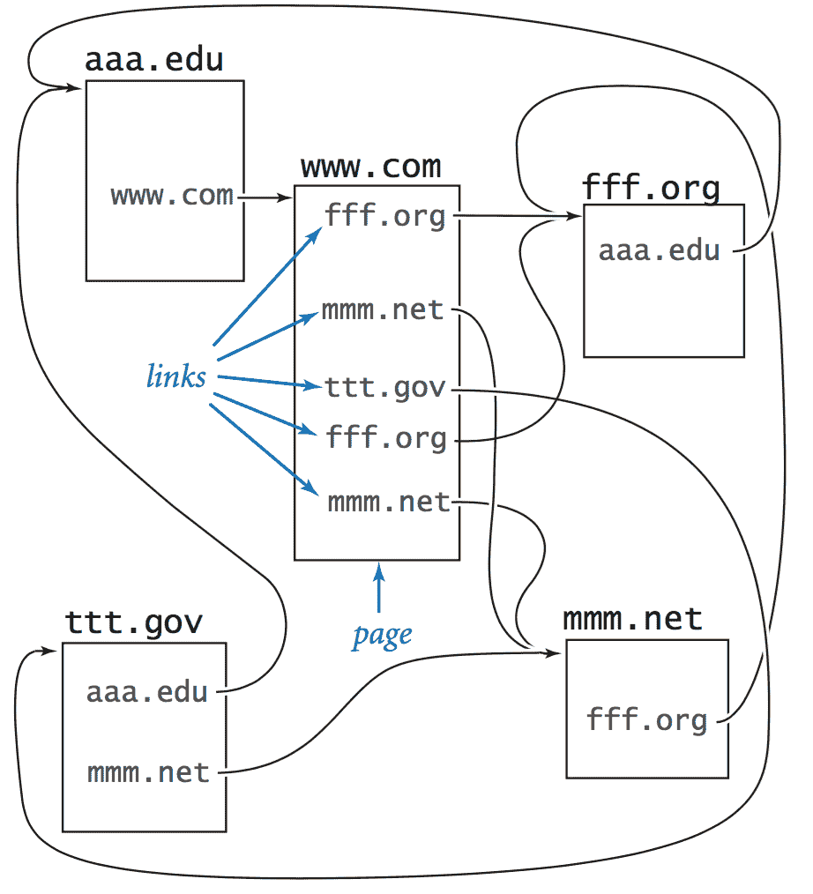
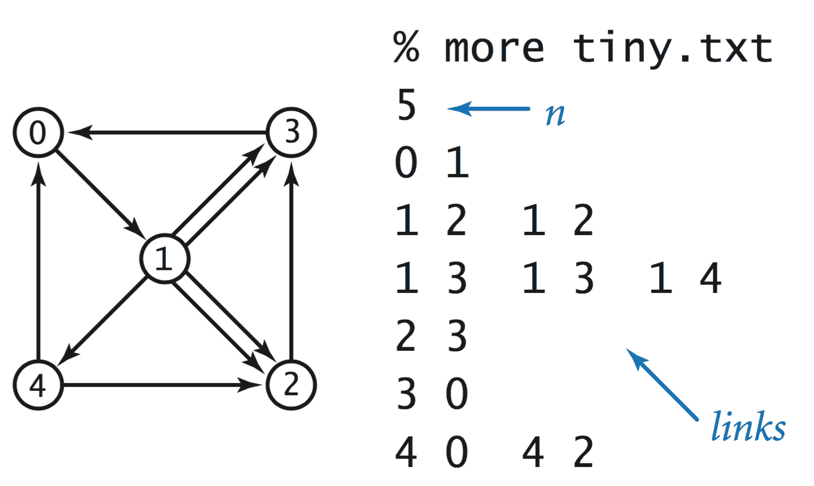
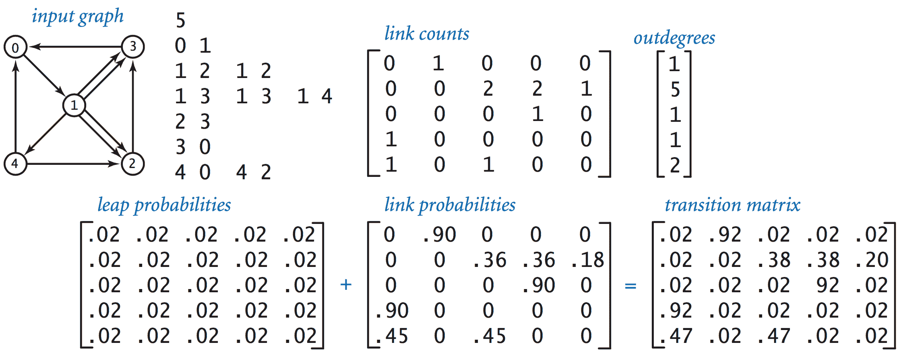
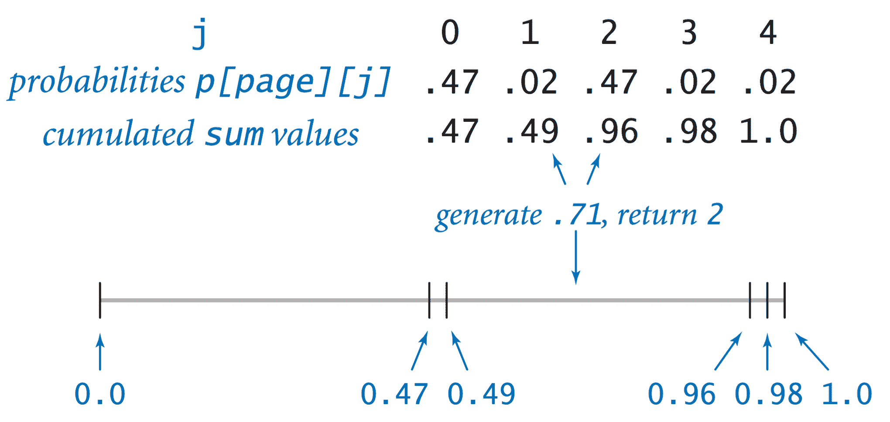
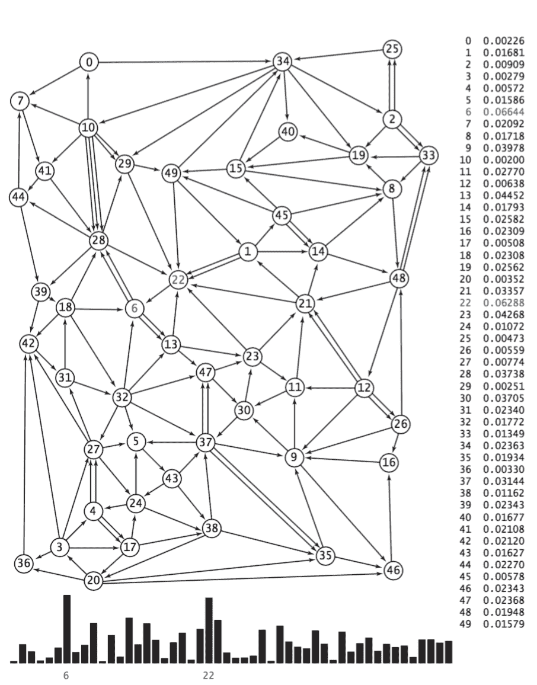
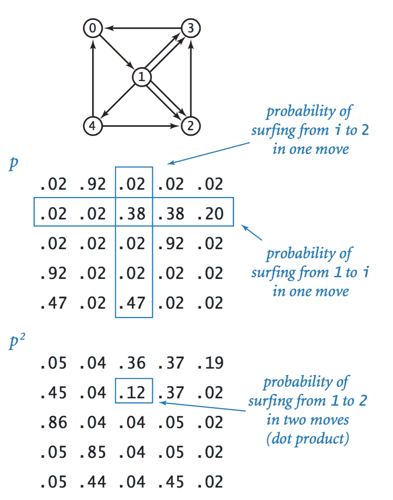
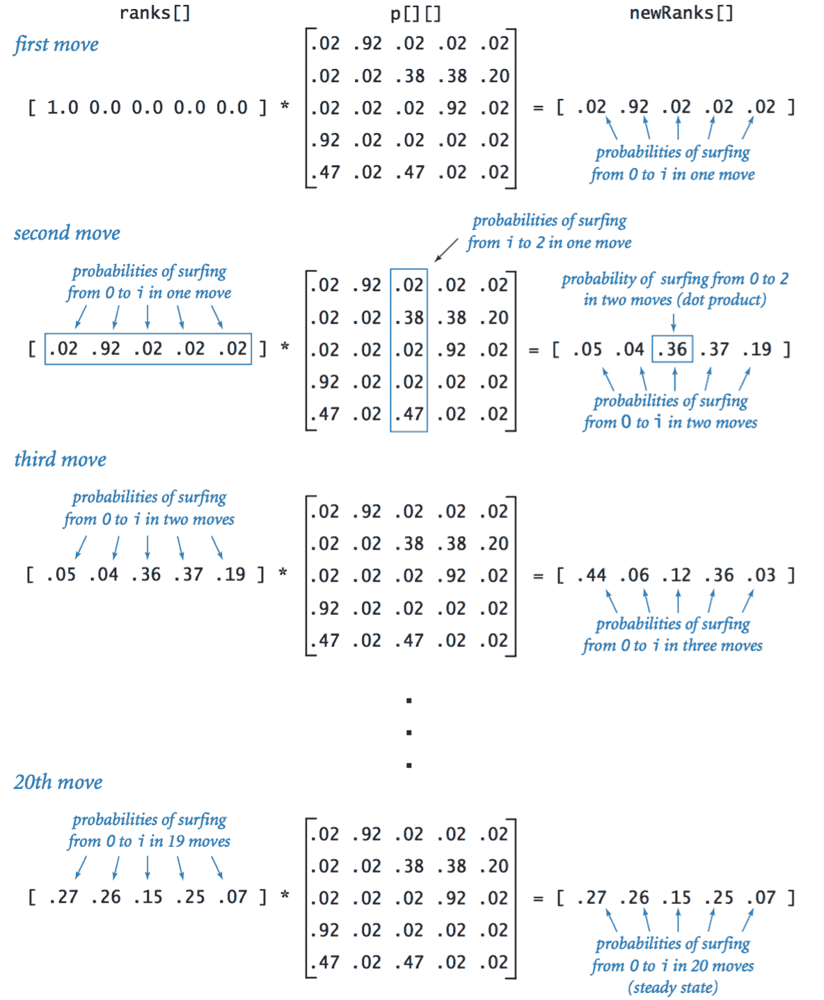

# 1.6   案例研究：   随机网络冲浪者

> 原文：[`introcs.cs.princeton.edu/java/16pagerank`](https://introcs.cs.princeton.edu/java/16pagerank)
> 
> 译者：[飞龙](https://github.com/wizardforcel)
> 
> 协议：[CC BY-NC-SA 4.0](https://creativecommons.org/licenses/by-nc-sa/4.0/)

通过网络进行交流已经成为日常生活的一个重要组成部分。这种交流部分得益于对网络结构的科学研究。我们考虑一个简单的模型，称为*随机冲浪者模型*。我们认为网络是一组固定的页面��每个页面包含一组固定的*超链接*，每个链接引用到其他页面。我们研究一个人（随机冲浪者）从页面到页面随机移动时会发生什么，无论是通过在地址栏中输入页面名称还是通过点击当前页面上的链接。

> 

### 模型。

问题的关键在于指定从页面到页面随机移动的含义。以下直观的*90–10 规则*捕捉了移动到新页面的两种方法：假设 90%的时间随机冲浪者点击当前页面上的随机链接（每个链接被等概率选择），10%的时间随机冲浪者直接转到随机页面（网络上的所有页面被等概率选择）。

你可以立即看出这个模型有缺陷，因为你从自己的经验中知道，真实网络冲浪者的行为并不是那么简单：

+   没有人会以相等的概率选择链接或页面。

+   没有真正的潜力直接冲浪到网络上的每个页面。

+   90–10（或任何固定）的分解只是一个猜测。

+   它没有考虑返回按钮或书签。

尽管存在这些缺陷，但这个模型足够丰富，计算机科学家通过研究它已经学到了很多关于网络性质的知识。

## 输入格式。

我们假设有*n*个网页，编号从 0 到*n*−1，并且我们用这些数字的有序对表示链接，第一个指定包含链接的页面，第二个指定链接指向的页面。我们采用的输入格式是一个整数（*n*的值），后跟一系列整数对（所有链接的表示）。

> 

数据文件 tiny.txt 和 medium.txt 是两个简单的示例。

## 转移矩阵。

我们使用一个二维矩阵，我们称之为*转移矩阵*，完全指定了随机冲浪者的行为。对于*n*个网页，我们定义一个*n*×*n*矩阵，使得第*i*行和第*j*列的条目是随机冲浪者在页面*i*时移动到页面*j*的概率。

> 

Transition.java 是一个从标准输入读取链接并在标准输出上生成相应转移矩阵的过滤器。

## 模拟。

RandomSurfer.java 模拟了随机冲浪者的行为。它读取一个转移矩阵，并根据规则冲浪，从页面 0 开始，并将移动次数作为命令行参数。它计算冲浪者访问每个页面的次数。将该计数除以移动次数得出随机冲浪者最终停留在页面上的概率的估计。这个概率被称为页面的*排名*。

+   *一个随机移动。* 计算的关键是随机移动，由转移矩阵指定：每一行代表一个*离散概率分布*—条目完全指定了随机冲浪者下一步的行为，给出了冲浪到每个页面的概率。

    > 

    RandomSurfer.java 是一个改进版本，使用了我们将在第 2.2 节介绍的两个库方法。

+   *马尔可夫链.* 描述冲浪者行为的随机过程称为 *马尔可夫链*。马尔可夫链具有广泛的适用性，被广泛研究，并具有许多显著和有用的特性。例如，马尔可夫链的一个基本极限定理表明，我们的冲浪者可以从*任何地方*开始，因为随机冲浪者最终落在任何特定页面上的概率对于所有起始页面都是相同的！

+   *页面排名.* 随机冲浪者模拟很简单：它循环执行指定数量的移动，通过图表随机冲浪。增加迭代次数会给出越来越准确的估计，即冲浪者落在每个页面上的概率—*页面排名*。

+   *可视化直方图.* RandomSurferHistogram.java 绘制一个频率直方图，最终稳定到页面排名。

    > 

## 混合马尔可夫链。

直接模拟随机冲浪者的行为以了解网页结构是吸引人的，但可能太耗时。幸运的是，我们可以通过使用线性代数更有效地计算相同的数量。

+   *马尔可夫链的平方.* 随机冲浪者在两步内从页面 *i* 移动到页面 *j* 的概率是多少？第一步移动到一个中间页面 *k*，因此我们计算从 *i* 移动到 *k*，然后从 *k* 移动到 *j* 的概率，对所有可能的 *k* 进行计算并累加结果。这个计算我们之前见过—矩阵-矩阵乘法。

    > 

+   *幂法.* 然后我们可以通过再次乘以 `p[][]` 计算三次移动的概率，通过再次乘以 `p[][]` 计算四次移动的概率，依此类推。然而，矩阵-矩阵乘法是昂贵的，而我们实际上对一个 *向量*–矩阵计算感兴趣。

    > 

    Markov.java 是一个实现，你可以用它来检查我们示例的收敛性。例如，它得到与 RandomSurfer.java 相同的结果（页面排名精确到小数点后两位），但只需进行 20 次向量-矩阵乘法。

#### 问答

**Q.** 如果某个页面没有外链，转移矩阵的行应该是什么？

**A.** 为了使矩阵随机（所有行之和为 1），使得该页面等可能地转移到每个其他页面。

**Q.** Markov.java 收敛需要多长时间？

**A.** Brin 和 Page 报告说，在迭代收敛之前只需要 50 到 100 次迭代。收敛取决于 P λ[2] 的第二大特征值。Web 的链接结构使得 λ[2] 大约等于 α = 0.9。由于 0.9⁵⁰ = 0.005153775207，我们预计在 50 次迭代后会有 2-3 位有效数字。

**Q.** 有关 PageRank 的推荐阅读吗？

**A.** 这里有一篇关于 [PageRank](http://www.ams.org/featurecolumn/archive/pagerank.html) 的精彩文章。

**Q.** 为什么要添加随机页面 / 传送组件？

**A.** 如果不这样做，随机冲浪者可能会陷入图表的某个部分。更多技术原因：使马尔可夫链遍历。

#### 练习

#### 创意练习

#### 网页练习

1.  **滑梯与梯子.** 将经典的 Hasbro 棋盘游戏 *滑梯与梯子* 建模为马尔可夫链。确定如果有两名玩家，第一名玩家获胜的概率。
