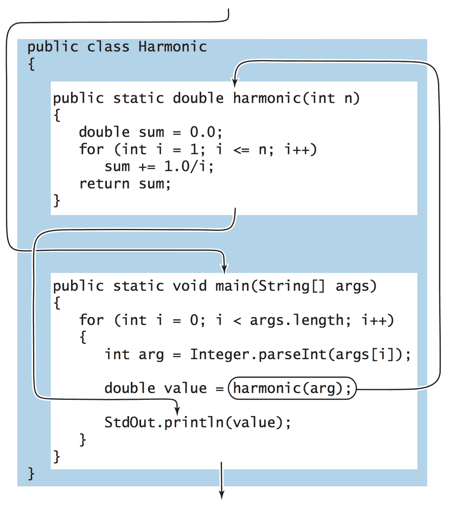
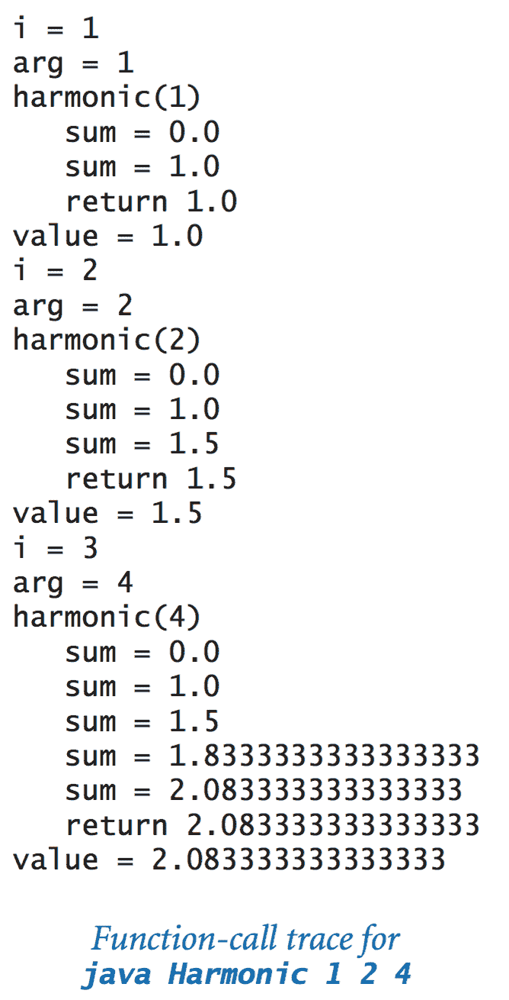
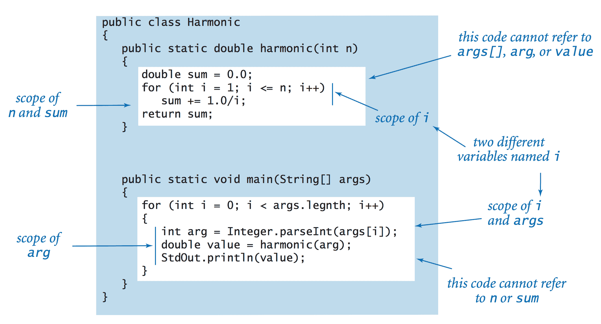
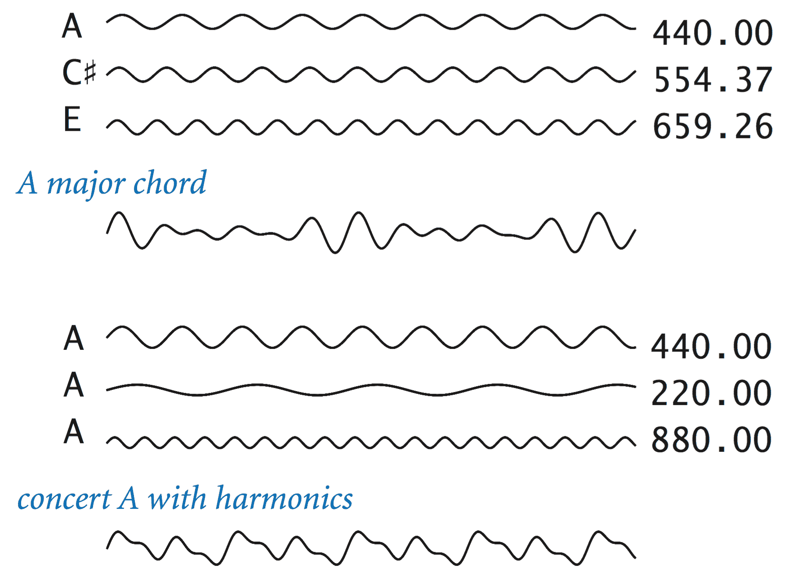
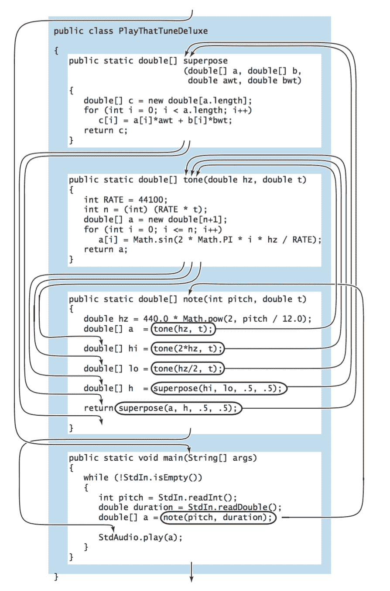
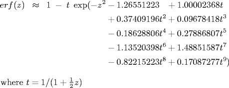

# 2.1   静态方法

> 原文：[`introcs.cs.princeton.edu/java/21function`](https://introcs.cs.princeton.edu/java/21function)

实现函数的 Java 构造称为*静态方法*。

## 使用和定义静态方法。

使用静态方法很容易理解。例如，当你在程序中写入 `Math.abs(a-b)` 时，效果就好像你将该代码替换为 Java 的 `Math.abs()` 方法在传递表达式 `a-b` 作为*参数*时产生的*返回值*。

+   *控制流.* Harmonic.java 包括两个静态方法：`harmonic()` 用于计算谐波数，`main()` 用于与用户交互。

    >              

+   *函数调用跟踪.* 跟踪函数调用的控制流的一种简单方法是想象每个函数在被调用时打印其名称和参数值，在返回之前打印其返回值，并在调用时添加缩进并在返回时减少缩进。

+   *静态方法定义.* 静态方法定义的第一行，称为*签名*，为方法和每个*参数变量*指定名称。它还指定了每个参数变量的*类型*和方法的*返回类型*。在签名之后是方法的*主体*，用大括号括起来。主体由我们在第一章中讨论过的各种语句组成。它还可以包含一个*return 语句*，它将控制传回静态方法被调用的点，并返回计算结果或*返回值*。主体可能声明*局部变量*，这些变量仅在声明它们的方法中可用。

    > 

+   *函数调用.* 静态方法调用只是方法名称后跟其参数，用逗号分隔并用括号括起来。方法调用是一个表达式，因此你可以用它来构建更复杂的表达式。同样，参数是一个表达式—Java 评估表达式并将结果值传递给方法。因此，你可以编写像 `Math.exp(-x*x/2) / Math.sqrt(2*Math.PI)` 这样的代码，Java 知道你的意思。

    > 

## 静态方法的属性。

+   *多个参数.* 像数学函数一样，Java 静态方法可以接受多个参数，因此可以有多个参数变量。

+   *多个方法.* 你可以在一个`.java`文件中定义任意多个静态方法。这���方法是独立的，可以以任何顺序出现在文件中。一个静态方法可以调用同一文件中的任何其他静态方法或 Java 库中的任何静态方法，如`Math`。

+   *重载.* 签名不同的静态方法是不同的静态方法。对两个签名不同的静态方法使用相同的名称称为*重载*。

+   *多个返回语句.* 你可以在方法中放置`return`语句，无论何时需要它们：一旦到达第一个`return`语句，控制就会返回给调用程序。

+   *单个返回值.* Java 方法仅向调用者提供一个返回值，类型与方法签名中声明的类型相同。

+   *作用域.* 变量的*作用域*是程序中可以通过名称引用该变量的部分。在 Java 中的一般规则是，声明在语句块中的变量的作用域仅限于该块中的语句。特别地，在静态方法中声明的变量的作用域仅限于该方法的主体。因此，你不能在一个静态方法中引用在另一个方法中声明的变量。

    > 

+   *副作用。* 一个*纯函数*是一个函数，给定相同的参数，总是返回相同的值，而不产生任何可观察的*副作用*，比如消耗输入、产生输出或者改变系统的状态。函数 `harmonic()` 是一个纯函数的例子。然而，在计算机编程中，我们经常定义函数的*唯一*目的是产生副作用。在 Java 中，一个静态方法可以使用关键字 `void` 作为其返回类型，以指示它没有返回值。

FunctionExamples.java 给出了一些例子。

## 实现数学函数。

 现在我们考虑两个在科学、工程和金融中起重要作用的函数。*高斯（正态）分布函数* 以熟悉的钟形曲线为特征，并由以下公式定义：

> $$ \phi(x) \;=\; \frac{1}{\sqrt{2 \pi}} e^{-x²/2} $$

累积高斯分布函数 \(\Phi(z)\) 被定义为曲线 \(\phi(x)\) 在 *x* 轴上方且在垂直线 *x* = *z* 左侧的面积。

+   *闭式形式。* 在最简单的情况下，我们有一个以 `Math` 库中实现的函数为基础的闭式数学方程来定义我们的函数。这适用于 \(\phi(x)\)。

+   *无闭式形式。* 否则，我们可能需要一个更复杂的算法来计算函数值。这种情况适用于 \(\Phi(z)\)，对于它没有闭式表达式。对于小（或大）的 *z*，值非常接近于 0（或 1）；因此代码直接返回 0（或 1）；否则以下泰勒级数逼近是评估函数的有效基础：

    > $$ \begin{eqnarray*} \Phi(z) &= & \int_{-\infty}^{z} \phi(x) dx \\ & = & \frac{1}{2} \;+\; \phi(z) \; \left(z \;+\; \frac{z³}{3} \;+\; \frac{z⁵}{3 \cdot 5} \;+\; \frac{z⁷}{3 \cdot 5 \cdot 7} \;+\; \ldots \;\; \right) \end{eqnarray*} $$

Gaussian.java 实现了这两个静态方法。

## 使用静态方法来组织代码。

通过定义函数的能力，我们可以在适当时候在程序中定义函数来更好地组织我们的程序。例如，Coupon.java 是 CouponCollector.java 的一个版本，更好地分离了计算的各个组件。

+   给定 *n*，计算一个随机优惠券值。

+   给定 *n*，进行优惠券收集实验。

+   从命令行获取 *n*，然后计算并打印结果。

*每当你可以清晰地在程序中分离任务时，你应该这样做。*

## 传递参数和返回值。

接下来，我们将详细研究 Java 传递参数和从函数返回值的机制。

+   *值传递。* 你可以在函数体中的任何代码中使用参数变量，就像使用局部变量一样。参数变量和局部变量之间唯一的区别是，Java 评估调用代码提供的参数并用结果值初始化参数变量。这种方法称为*值传递*。

+   *数组作为参数。* 当一个静态方法以数组作为参数时，它实现了一个操作相同类型任意数量值的函数。

+   *数组的副作用。* 经常情况下，接受数组作为参数的静态方法的目的是产生副作用（改变数组元素的值）。

+   *数组作为返回值。* 静态方法也可以提供数组作为返回值。

ArrayFunctionExamples.java 给出了一些关于数组作为参数和返回值的函数的例子。

## 声波的叠加。

像 A 调这样的音符具有纯净的声音，不太具有音乐性，因为您习惯听到的声音还有许多其他成分。大多数乐器产生*谐波*（不同八度的相同音符，但不那么响亮），或者您可能演奏和弦（同时演奏多个音符）。要组合多个声音，我们使用*叠加*：简单地将波形相加并重新缩放，以确保所有值保持在−1 和 1 之间。

> 

PlayThatTuneDeluxe.java 是 PlayThatTune 的一个版本，封装了声波计算并添加了谐波。

> 

这里有一些示例数据文件（由各个学生创建）：

+   音阶.txt

+   伊莉莎白.txt

+   通往天堂的阶梯.txt

+   初稿.txt

+   疯狂的.txt

+   国歌.txt

+   阿拉伯舞曲.txt

+   艺人.txt

+   自由鸟.txt

+   tomsdiner.txt

#### 练习

1.  编写一个静态方法`max3()`，它接受三个`int`参数，并返回最大值。添加一个重载函数，使用三个`double`值执行相同的操作。

    *解决方案*：

    ```java
    public static int max3(int a, int b, int c) {
       int max = a;
       if (b > max) max = b;
       if (c > max) max = c;
       return max;
    }

    public static double max3(double a, double b, double c) {
       double max = a;
       if (b > max) max = b;
       if (c > max) max = c;
       return max;
    }

    ```

1.  编写一个静态方法`majority()`，它接受三个`boolean`参数，并在至少两个参数为`true`时返回`true`，否则返回`false`。不要使用`if`语句。

    *解决方案*：

    ```java
    public static boolean majority(boolean a, boolean b, boolean c) {
       return (a && b) || (a && c) || (b && c);
    }

    ```

1.  编写一个静态方法`eq()`，它接受两个`int`数组作为参数，并在数组长度相同且所有对应元素相等时返回`true`，否则返回`false`。

    *解决方案*。ArraysEquals.java。

1.  编写一个静态方法`sqrt()`，它接受一个`double`参数，并返回该数字的平方根。使用牛顿法（参见 Sqrt.java）来计算结果。

    *解决方案*：Newton.java。

1.  考虑下面的静态方法`cube()`。

    ```java
    public static void cube(int i) { 
        i = i * i * i; 
    } 

    ```

    以下`for`循环迭代了多少次？

    ```java
    for (int i = 0; i < 1000; i++) 
       cube(i); 

    ```

    *答案*：只有 1,000 次。

#### 创意练习

1.  **Black–Scholes 期权估值。** [Black–Scholes](http://en.wikipedia.org/wiki/Black-Scholes)公式提供了不支付股息的股票上的欧式看涨期权的理论价值，给定当前股价`s`、行权价`x`、连续复利风险无息率`r`、波动率`σ`和到期时间（年）`t`。该值由以下公式给出

    > $$\Phi(a) - s x e^{-rt} \, \Phi(b)$$

    其中

    > $$ a = \frac{\ln(s/x) + (r + \sigma² / 2) t}{\sigma \sqrt{t}}, \;\; b = a - \sigma \sqrt{t} $$

    编写一个程序 BlackScholes.java，从命令行获取`s`、`x`、`r`、`sigma`和`t`，并打印出 Black-Scholes 值。

1.  **日历。** 编写一个程序 Calendar.java，它接受两个整数命令行参数`m`和`y`，并打印出月份`m`和年份`y`的月度日历，如下例所示：

    ```java
       February 2009
     S  M Tu  W Th  F  S
     1  2  3  4  5  6  7
     8  9 10 11 12 13 14
    15 16 17 18 19 20 21
    22 23 24 25 26 27 28

    ```

    *提示*：参见 LeapYear.java 和练习 1.2.29。

1.  **霍纳法**。编写一个类 Horner.java，其中包含一个名为`evaluate()`的方法，该方法以浮点数数组`xp[]`作为参数，并返回在`x`处评估多项式的结果，其中`p[]`中的元素是系数：

    > $$p_0 + p_1x¹ + p_2x² + \; \ldots \; + p_{n-2}x^{n-2} + p_{n-1}x^{n-1}$$

    使用*霍纳法*，这是一种执行计算的高效方法，建议使用以下括号化：

    > $$p_0 + x (p_1 + x (p_2 + \; \ldots \; + x(p_{n-2} + x p_{n-1}) \ldots))$$

    编写一个测试客户端，其中包含一个使用`evaluate()`计算近似值 e^x 的静态方法`exp()`，使用泰勒级数展开式的前*n*项\(e^x = 1 + x + x²/2! + x³/3! + \ldots\)。您的客户端应该接受一个命令行参数`x`，并将您的结果与`Math.exp()`计算的结果进行比较。

1.  **本福德定律。** 美国天文学家西蒙·纽康布观察到一本编制对数表的书中的一个怪现象：开始的页面比结束的页面脏得多。他怀疑科学家们更多地使用以 1 开头的数字进行计算，而不是 8 或 9，提出了第一位数定律，该定律指出在一般情况下，领先数字更有可能是 1（大约 30%）而不是数字 9（不到 4%）。这种现象被称为[本福德定律](http://mathworld.wolfram.com/BenfordsLaw.html)，现在经常被用作统计测试。例如，美国国税局的法务会计师依靠它来发现[税务欺诈](http://courses.nus.edu.sg/course/mathelmr/080498sci-benford.htm)。编写一个程序 Benford.java，从标准输入读取一系列整数，并制表显示 1-9 中每个数字作为领先数字的次数，将计算分解为一组适当的静态方法。使用您的程序在计算机或网络上的一些信息表上测试该定律。然后，编写一个程序通过生成从$1.00 到$1,000.00 的随机金额来破坏国税局，使其具有您观察到的相同分布。

#### 网页练习

1.  **菱形瓷砖。** 编写一个程序 DiamondTile.java，接受一个命令行参数 N，并创建一个 N×N 的菱形瓷砖。包括静态方法`diamond()`和`filledDiamond()`。

1.  **六边形瓷砖。** 编写一个程序 HexTile.java，接受一个命令行参数 N，并创建一个 N×N 的六边形瓷砖。包括静态方法`hexagon()`和`filledHexagon()`。

1.  **逆高斯累积分布。** 假设 SAT 数学成绩服从均值 500 和标准差的正态分布。估计学生必须获得多高的分数才能成为前 10%。为了做到这一点，您需要找到值*z*，使得Φ(z, 500, 100) = 0.9。*提示:* 使用二分查找。

1.  **SAT 成绩。** 一所著名的东北大学收到 2 万份学生申请。假设这些个体的 SAT 成绩服从均值 1200 和标准差 100 的正态分布。假设大学决定录取 SAT 成绩最好的 5000 名学生。估计仍然会被录取的最低分数。

1.  **投票机。** 假设在一个拥有 1 亿选民的人口中，51%投票给候选人 A，49%投票给候选人 B。然而，投票机容易出错，有 5%的概率产生错误答案。假设错误是独立且随机发生的，5%的错误率足以使紧密选举的结果无效吗？可以容忍什么错误率？

1.  **赌徒的直方图。** 编写一个程序`RandomWalk.java`，接受一个命令行参数 M，并模拟一个从 M 开始的赌徒，下注正好 M 美元。

    1.  运行这个实验 N 次，生成赌徒最终赢得的金额的直方图。

    1.  赌徒最终赢得的金额遵循二项分布，均值为 M，方差为 N/4。该分布可以用具有相同均值和方差的正态分布来近似。生成一个直方图，显示您预期赌徒最终在每个直方图箱中获得的金额的比例。将您的程序组织成几个函数。

1.  **统计抽样。** 编写一个程序 Sampling.java，随机抽取 N 个人并向他们提出一个是/否问题。计算 95%的置信区间。

1.  **二十一点。** 编写一个程序`Blackjack.java`来玩[基本策略](http://www.blackjackcenter.com/blackjack3.html)，或者编写一个程序`BlackjackCounter.java`来实现[高低计数系统](http://www.blackjackcenter.com/blackjack4.html)。

1.  **小波。** 应用于计算机视觉、人类视觉、语音处理、压缩 FBI 指纹数据库、过滤嘈杂数据、检测时间序列中的自相似性、声音合成、计算机图形学、医学成像、分析星系的聚集以及分析湍流。*Haar 函数*由Φ(x) = 1（如果 0 ≤ x < 1/2）、Φ(x) = -1（如果 1/2 ≤ x < 1）和Φ(x) = 0（否则）定义。对于整数 m 和 n，*Haar 基函数*Φm,n = 2^(-m/2) Φ(2^(-m)x - n)。编写一个程序`Haar.java`，它接受���个整数输入 M 和 N，一个实数输入 x，并打印Φm,n。或者可能绘制它？

1.  **Baccarat.** [百家乐](http://www.robohoo.com/baccarat.html)是一种简单的纸牌游戏，在詹姆斯·邦德电影中被浪漫化。当玩家得到九时，庄家宣布“neuf a la banque”。编写一个程序来确定你赢得胜利的机会......

1.  **共线点。** 编写一个函数

    ```java
    public boolean areCollinear(int x1, int y1, int x2, int y2, int x3, int y3)

    ```

    如果三个点（x1，y1），（x2，y2）和（x3，y3）在同一条直线上，则返回`true`，否则返回`false`。

1.  **高斯误差函数。** [误差函数](http://en.wikipedia.org/wiki/Error_function)是在概率、统计和微分方程解决方案中出现的函数。例如，Φ(z) = 1/2 + (1 + erf(z / sqrt(2)))，其中Φ(z)是上面定义的高斯累积分布函数。

    > 

    在[初等函数](http://en.wikipedia.org/wiki/Elementary_function_%28differential_algebra%29)的术语中，积分没有封闭形式的解，因此我们求助于近似。当`z`为非负时，下面的切比雪夫拟合估计精确到 7 个有效数字：

    > 

    如果*z*为负数，则使用*erf(z) = -erf(-z)*的恒等式。实现它的一种特别有效的方法是通过一种称为*霍纳方法*的括号的巧妙使用。编写一个函数`erf()`在 ErrorFunction.java 中，它接受一个实数输入`z`并使用上述公式计算*误差函数*。

1.  **Haversine。** 编写一个函数`haversine()`，它接受一个`double`参数`θ`并返回 haversine(θ) = (sin(θ/2))²。

1.  **土壤温度。** （克利夫·莫勒）假设土壤温度在表面和下面均匀为 Ti（20 摄氏度）。一股冷锋来袭，表面温度 Ts（-15 摄氏度）在可预见的未来保持不变。在暴露于这些条件下 30 天后，10 米深处的土壤温度是多少？在表面以下 5 米处水结冰需要多长时间？挖掘水管的深度是多少，以便在这些条件下暴露 60 天而不结冰？

1.  **Craps.** 计算在 craps 中赢得*pass bet*的概率。以下是 pass bet 的规则。掷两个 6 面骰子，让*x*为它们的和。

    +   如果*x*为 7 或 11，则立即获胜

    +   如果*x*为 2、3 或 12，则立即失败

    +   否则，重复掷两个骰子，直到它们的和为*x*或 7

        +   如果它们的和为*x*，则获胜

        +   如果它们的和为 7，则失败

    程序 Craps.java 接受一个命令行参数 N，并模拟 N 次通过投注。该程序的组织受益于两个辅助函数：`sumOfTwoDice`和`winsPassBet`。这两个函数都有一个有趣的特点-它们不接受任何输入参数。第一个函数模拟掷两个骰子。这返回一个介于 2 和 12 之间的整数，但并非所有值都是等概率的。为了正确模拟概率，我们调用`StdRandom.random(6)`两次，一次生成 1 到 6 之间的数字。然后，我们将这两个值相加。第二个函数返回一个`boolean`值：如果我们赢得通过投注，则返回`true`，否则返回`false`。该函数有几个`return`语句。一旦执行第一个语句，函数将终止并返回给定的返回值。

1.  **音阶。**使用函数`note()`，编写一个程序 Scale.java 来演奏一个大调音阶。

1.  **素数测试。**创建一个名为`isPrime()`的函数，它接受一个整数参数 N，并根据 N 是否为素数返回 true 或 false。

    ```java
    public static boolean isPrime(long N) {
       if (N < 2) return false;
       for (long i = 2; i*i <= N; i++) {
          if (N % i == 0) return false;
       }
       return true;
    }

    ```

1.  **电子资金转账路由号检查。**给定一个 9 位 EFT 路由号 a[1]a[2]a[3]a[4]a[5]a[6]a[7]a[8]a[9]，检查方程式为

    > 3 a[1] + 7a[2] + a[3] + 3a[4] + 7a[5] + a[6] +3a[7] +7a[8] +a[9] mod 10 = 0

    [校验位参考](http://www.augustana.ab.ca/~mohrj/algorithms/checkdigit.html)。

1.  编写一个静态方法`nint()`，它接受一个实数作为参数，并返回最接近的整数。不要使用任何 Math 库函数，而是使用强制转换。

1.  编写一个静态方法`int mod(int a, int n)`，其中`a`是整数，`n`是正整数，并返回模 n。当`a`为正数时，这对应于`a % n`，但如果`a`为负数，则`a % n`返回一个非正整数。

1.  **现值。**

    1.  编写一个名为`fv`的方法，计算如果您以复利利率 r 每期投资 C 美元，T 期后您将拥有的金额。*未来价值*的公式为 C*(1 + r)^T。

    1.  编写一个名为`pv`的方法，计算现在必须投资多少金额，以每期复利利率 r 获得 T 期内的现金流。*现值*的公式为 C/(1 + r)^T。

1.  ACT 是另一种标准化测试。假设测试分数遵循均值为 18，标准差为 6 的高斯分布。还假设参加 SAT 和 ACT 考试的考生是无法区分的。620 分的 SAT 分数和 26 分的 ACT 哪个更好？

1.  编写一个程序 Factorial.java，接受一个整数命令行输入 n，并打印出 n! = 1 * 2 * ... * n。编写一个具有以下签名的函数：

    ```java
    public static long factorial(int n)

    ```

    您的函数能处理的最大 n 值是多少，而不会发生溢出？

1.  以下函数有什么问题？

    ```java
    static int sum(int n) {
        if (n < 0) return;
        double sum = 0.0;
        for (int i = 0; i < n; i++)
           sum = sum + i;
        return sum;
    }

    ```

    *答案*：该函数声明要返回类型为`int`的值。第一个返回语句是错误的，因为它不返回任何内容。第二个返回语句是错误的，因为它返回类型为`double`的值。

1.  以下代码是做什么的？

    ```java
    public static void negate(int a) {
        a = -a;
    }

    public static int main(String[] args) {
        int a = 17;
        System.out.println(a);
        negate(a);
        System.out.println(a);
    }

    ```

    *答案*：它两次打印`17`。一个函数无法改变另一个函数中的基本类型变量的值。

1.  编写一个函数，接受三个实数参数 x、y 和 s，并绘制以(x, y)为中心，边长为 s 的等边三角形。在`main`中多次调用该函数以产生一个有趣的图案。

1.  以下函数中哪个返回其四个输入中的最小值？哪个最容易理解和验证其正确性？

    ```java
    public static int min(int a, int b, int c, int d) {
       // if a is the smallest return it
       if (a <= b && a <= c && a <= d) return a;

       // otherwise, if b is the smallest of b, c, and d, return it
       if (b <= c && b <= d) return b;

       // otherwise, return the smaller of c and d
       if (c <= d) return c;
       return d;
    }

    public static int min(int a, int b, int c, int d) {
       int min = a;
       if (b < min) min = b;
       if (c < min) min = c;
       if (d < min) min = d;
       return min;
    }

    public static int min(int a, int b, int c, int d) {
       if (a < b && a < c && a < d) return a;
       if (b < c && b < d)          return b;
       if (c < d)                   return c;
       return d;
    }

    public static int min(int a, int b, int c, int d) {
       if (a <= b) {
          if (a <= c) {
             if (a <= d)  return a;
             else return d;
          }
          if (c <= d) return c;
          else return d;
       }
       if (b <= c) {
          if (b <= d) return b;
          else return d;
       }
       else if (c <= d) return c;
       return d;
    }

    public static int min(int a, int b) {
       if (a <= b) return a;
       else        return b;
    }
    public static int min(int a, int b, int c, int d) {
       return min(min(a, b), min(c, d));
    }

    ```

1.  您将如何测试前一个练习中的函数是否按照其所声称的那样工作？

    *答案*：你无法希望在每种可能的输入上进行测试，因为有 2¹²⁸种不同的可能输入。相反，根据 a < b，a < c，...，c < d 的 24 种情况中的每一种，测试所有 4！= 24 种情况。或者测试 0、1、2 和 3 的所有 4⁴ 种排列。

1.  以下方法调用有什么问题？

    ```java
    double y = 2.0;
    double x = sqrt(double y);

    ```

    在调用`sqrt()`时重新声明变量`y`。

1.  **锯齿波。** 编写一个程序 SawTooth.java 来绘制 2/pi [sin(1t)/1 + sint(2t)/2 + sin(3t)/3 + ... ]。随着绘制更多项，波形会收敛到一个 [锯齿波](http://en.wikipedia.org/wiki/Sawtooth_wave)。然后使用标准音频播放它。

1.  **方波。** 绘制 4/pi [sin(1*2*pi*t)/1 + sint(3*2*pi*t)/3 + sin(5*2*pi*t)/5 + ... ]。随着绘制更多项，波形会收敛到一个 [方波](http://en.wikipedia.org/wiki/Square_wave)。然后使用标准音频播放它。

1.  编写一个程序来打印 Old McDonald 的歌词。

    ```java
    public static String sing(String animals, String sound) {
       String s = "";
       s += "Old MacDonald had a farm\n";
       s += "E-I-E-I-O\n";
       s += "And on his farm he had some " + animals + "\n";
       s += "With a " + sound + "-" + sound + " here\n";
       s += "And a " + sound + "-" + sound + " there\n";
       s += "Here a " + sound + ", there a " + sound + "\n";
       s += "Everywhere a + sound + "-" + sound + "\n";
       s += "Old MacDonald had a farm\n";
       s += "E-I-E-I-O\n";
       return s;
    }
    ...
    System.out.println(sing("chicks", "cluck"));
    System.out.println(sing("cows",   "moo"));
    System.out.println(sing("pigs",   "oink"));
    System.out.println(sing("cats",   "meow"));
    System.out.println(sing("sheep",  "baa"));
    System.out.println(sing("ducks",  "quack"));
    System.out.println(sing("horses", "neigh"));

    ```

1.  编写一个静态方法 `maxwellBoltzmann()`，它返回一个从 *Maxwell-Boltzmann 分布* 中伪随机值，参数为 σ。为了生成这样的值，取三个均值为 0，标准差为 σ 的高斯随机变量的平方和，然后返回平方根。理想气体中分子的速度具有 Maxwell-Boltzmann 分布，其中参数 σ 与 XYZ 有关。

1.  编写一个静态方法 `reverse1()`，它以字符串数组作为参数，并创建一个按相反顺序排列的新数组（不改变参数数组中的顺序）。编写一个静态方法 `reverse2()`，它以字符串数组作为参数，并颠倒其条目。将你的代码放在一个名为 Reverse.java 的程序中。

1.  当我有两个重载函数时，`f(1, 2)`调用哪个函数？

    ```java
    public static void f(int x, double y) {
       System.out.println("f(int, double)");
    }

    public static void f(double x, int y) {
       System.out.println("f(double, int)");
    }

    ```

    *解决方案*。通常，Java 的类型提升规则会将任一 `int` 参数提升为 `double`。然而，在这种情况下，这将导致两个匹配的重载签名。由于 Java 无法解决这种歧义，Overloaded.java 导致编译时错误。

1.  **高斯随机值。** 尝试使用以下方法生成服从高斯分布的随机变量，该方法基于在单位圆内生成一个随机点，并使用一种 [Box-Muller 变换](http://en.wikipedia.org/wiki/Box-Muller_transform) 的形式。（参见练习 1.2.27 和第 1.3 节末尾关于 do-while 的讨论）。

    ```java
    public static double gaussian() {
       double r, x, y;
       do {
          x = uniform(-1.0, 1.0); 
          y = uniform(-1.0, 1.0); 
          r = x*x + y*y;
       } while (r >= 1 || r == 0);
       return x * Math.sqrt(-2.0 * Math.log(r) / r);
    }

    ```

    接受一个命令行参数 N，并生成 N 个随机数，使用数组 a[20] 计算生成的数字落在 i*.05 和 (i+1)*.05 之间的次数，其中 i 从 0 到 19。然后使用 `StdDraw` 绘制这些值，并将结果与正态钟形曲线进行比较。

    *备注*：这种方法在效率和准确性上优于练习 XYZ 中描述的方法。虽然涉及循环，但 do-while 循环平均只执行 4 / π = 1.273 次。这减少了对超越函数的整体预期调用次数。
