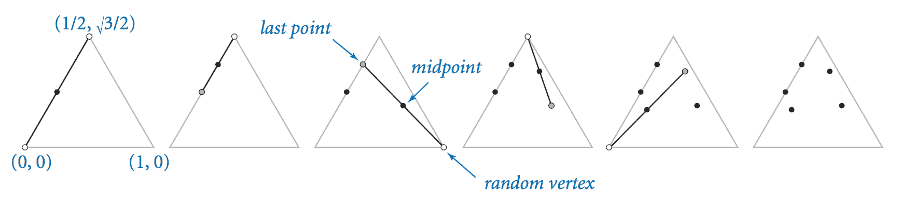

# 2.2   库和客户端

> 原文：[`introcs.cs.princeton.edu/java/22library`](https://introcs.cs.princeton.edu/java/22library)

您编写的每个程序都包含在一个`.java`文件中的 Java 代码。对于大型程序，将所有代码放在一个文件中是受限制和不必要的。幸运的是，在 Java 中很容易引用另一个文件中定义的方法。这种能力对我们的编程风格有两个重要的影响：

+   它允许我们通过开发静态方法库来*扩展 Java 语言*，供任何其他程序使用，每个库都保存在自己的文件中。

+   它实现了*模块化编程*，我们将程序分成静态方法，以某种逻辑方式进行分组。

## 在其他程序中使用静态方法。

要引用另一个类中定义的静态方法，您必须使 Java 可以访问这两个类（例如，通过将它们都放在计算机上的同一目录中）。然后，要调用方法，请在其类名和句点分隔符之前添加。例如，SAT.java 调用 Gaussian.java 中的`cdf()`方法，后者调用`pdf()`方法，后者调用[Math](https://docs.oracle.com/javase/8/docs/api/java/lang/Math.html)中的`exp()`和`sqrt()`方法。

> 

我们描述了有关该过程的几个细节。

+   *public 关键字。* `public`修饰符将方法标识为可供任何其他程序使用。您也可以将方法标识为`private`，但在此时您没有理由这样做。

+   *每个模块都是一个类。* 我们使用术语*模块*来指代我们在单个文件中保留的所有代码。按照惯例，每个模块都是一个 Java 类，保存在与类同名但具有`.java`扩展名的文件中。在本章中，每个类仅仅是一组静态方法。

+   *.class 文件。* 当您编译程序时，Java 编译器会生成一个以类名开头，后跟`.class`扩展名的文件，其中包含您的程序代码，以适合计算机的语言编写。

+   *必要时编译。* 当您编译程序时，Java 通常会编译运行程序所需的所有内容。例如，当您键入`javac SAT.java`时，编译器还会检查自上次编译以来是否修改了`Gaussian.java`。如果是这样，它还会编译`Gaussian`。

+   *多个`main()`方法。* SAT.java 和 Gaussian.java 都有自己的`main()`方法。当您键入`java`后跟类名时，Java 将控制转移到该类中定义的`main()`方法对应的机器代码。

## 库。

我们将那些方法主要用于许多其他程序的模块称为*库*。

+   *客户端。* 我们使用术语*客户端*来指代调用给定库方法的程序。

+   *API。* 程序员通常以客户端和实现之间的*合同*来思考，这是方法应该执行的明确规范。

+   *实现。* 我们使用术语*实现*来描述实现 API 中方法的 Java 代码。

例如，Gaussian.java 是以下 API 的实现：

> 

## 随机数。

StdRandom.java 是一个用于从各种分布生成随机数的库。

> 

## 数组的输入和输出。

StdArrayIO.java 是一个用于从标准输入读取原始类型数组并将其打印到标准输出的库。

> 

## 迭代函数系统。

[迭代函数系统](http://www.cut-the-knot.org/ctk/ifs.shtml)（IFS）是生成分形图像如[谢尔宾斯基三角形](https://en.wikipedia.org/wiki/Sierpinski_triangle)或[巴恩斯利蕨](https://en.wikipedia.org/wiki/Barnsley_fern)的一般方法。作为第一个例子，考虑以下简单过程：从等边三角形的一个顶点开始绘制一个点。然后随机选择三个顶点中的一个，并在刚刚绘制的点与该顶点之间的中点处绘制一个新点。继续执行相同的操作。

> 

Sierpinski.java 模拟这一过程。以下是 1,000、10,000 和 100,000 步后的快照。

> |  |      |  |      |  |
> | --- | --- | --- | --- | --- |

IFS.java 是一个模拟这一过程的数据驱动版本程序的通用化。您可以在输入 sierpinski.txt、barnsley.txt、tree.txt 和 coral.txt 上运行它。

> 

## 标准统计。

StdStats.java 是一个用于统计计算和基本可视化的库。

> 

## 伯努利试验。

Bernoulli.java 计算在抛掷公平硬币*n*次时找到正面的次数，并将结果与预测的高斯分布函数进行比较。根据[中心极限定理](http://mathworld.wolfram.com/CentralLimitTheorem.html)，得到的直方图极好地近似于均值为*n*/2，方差为*n*/4 的高斯分布。

> 

#### 练习

1.  在 Gaussian.java 中添加一个实现了三个参数的静态方法`pdf(x, mu, sigma)`，该方法根据给定的均值μ和标准差σ计算高斯概率密度函数，公式为\(\phi(x, \mu, \sigma)\) = \(\phi((x - \mu) / \sigma) / \sigma\)。还添加一个实现了相关累积分布函数`cdf(z, mu, sigma)`的方法，公式为\(\Phi(z, \mu, \sigma)\) = \(\Phi((z - \mu) / \sigma)\)。

1.  编写一个静态方法库 Hyperbolic.java，根据定义\(\sinh(x) = (e^x - e^{-x}) / 2\)和\(\cosh(x) = (e^x + e^{-x}) / 2\)，实现*双曲*函数，其中\(\tanh(x)\)、\(\coth(x)\)、\(\text{sech}(x)\)和\(\text{csch}(x)\)的定义方式类似于标准三角函数。

1.  在 StdRandom.java 中添加一个方法`shuffle()`，该方法以`double`值数组作为参数，并以随机顺序重新排列它们。实现一个测试客户端，检查数组的每个排列大致相同次数地产生。添加重载方法，接受整数和字符串数组。

1.  开发一个完整的 StdArrayIO.java 实现（实现 API 中指示的所有 12 个方法）。

1.  编写一个实现以下 API 的库 Matrix.java：

    > 

1.  编写一个 Matrix.java 客户端 MarkovSquaring.java，实现第 1.6 节中描述的 Markov.java 版本，但是基于矩阵的平方，而不是迭代向量-矩阵乘法。

#### 创意练习

1.  **Sicherman 骰子。** 假设你有两个六面骰子，一个面标有 1、3、4、5、6 和 8，另一个面标有 1、2、2、3、3 和 4。编写一个程序 Sicherman.java 来比较每个骰子和标准骰子的和值出现概率。使用`StdRandom`和`StdStats`。

    *解决方案*：具有这些属性的骰子称为[Sicherman 骰子](http://www.grand-illusions.com/toyshop/sicherman_dice/)：它们产生与常规骰子相同频率的和（2 的概率为 1/36，3 的概率为 2/36，依此类推）。

#### 网络练习

1.  **样本标准差。** 一系列 n 个观测值的*样本标准差*类似于标准差，只是我们除以*n*−1 而不是*n*。添加一个计算这个量的方法`sampleStddev()`。

1.  **Barnsley 蕨类植物。** 编写一个程序 Barnsley.java，接受一个命令行参数 N，并根据以下规则绘制 N 个点的序列。设(x, y) = (0.5, 0)。然后根据给定的概率将(x, y)更新为以下四个量之一。

    > | 概率 | 新 X | 新 Y |
    > | --- | --- | --- |
    > | 2% | 0.5 | 0.27y |
    > | 15% | -0.139x + 0.263y + 0.57 | 0.246x + 0.224y - 0.036 |
    > | 13% | 0.170x - 0.215y + 0.408 | 0.222x + 0.176y + 0.0893 |
    > | 70% | 0.781x + 0.034y + 0.1075 | -0.032x + 0.739y + 0.27 |

    下面的图片显示了 500、1000 和 10,000 次迭代后的结果。

    > |  |  |  |
    > | --- | --- | --- |

1.  **Black-Scholes。** [Black-Scholes](http://en.wikipedia.org/wiki/Black-Scholes)模型预测时间 t 时的资产价格将为 S' = S exp { (rt - 0.5*sigma²*t + sigma ε sqrt(t) }，其中 epsilon 是标准高斯随机变量。可以使用蒙特卡洛模拟来估计。要估算时间 T 时期权的价值，计算 max(S' - X, 0)并在 epsilon 的许多试验中取平均值。今天期权的价值为 e^-rT * 平均值。欧式看跌期权= max(X - S', 0)。重用函数。将程序命名为 BlackScholes.java。参见练习 2.1.30 中针对此情况的精确公式。

1.  **模拟。** 应用：某种使用`StdRandom`和`StdStats`翻转硬币并分析均值/方差的模拟。[例如：基于[Black-Scholes 对冲模拟](http://dybfin.wustl.edu/teaching/compufin/slides/cfinl5.html)的物理、金融模拟。模拟需要定价依赖于价格路径而不仅仅是到期时间 T 的期权。例如：亚洲平均价格看涨期权= max(0, S_bar - X)，其中 S_bar 是从时间 0 到 T 资产的平均价格。[回顾期权](http://finance.bi.no/~bernt/gcc_prog/recipes/recipes/node14.html) = max(0, S(T) - min_t S_t)。思路：将时间离散化为 N 个期间。] [另一个参考资料](http://www.scieng.ed.ac.uk/Students/Awards/Optionpricing.pdf) 将模拟分解为各种封装为函数的部分。

1.  **火焰分形。** 实现 IFS 的一般化，以生成类似 Water Lilies 的[分形火焰](http://www.flam3.com/)，由[Roger Johnston](http://content.techrepublic.com.com/2346-10878_11-33277.html?tag=gald)。火焰分形与经典 IFS 不同，它使用非线性更新函数（正弦、球形、漩涡、马蹄铁），使用对数密度显示根据它们导致过程的次数对像素进行着色，并根据应用哪个规则到达该点来加入颜色。

1.  **球面上的随机点。** 使用`StdRandom.gaussian()`生成球面或超球面表面上的随机点，方法如下：从高斯分布生成 N 个随机值 x[0]，...，x[N-1]。然后(x[0]/scale, ..., x[N-1]/scale)是 N 维球面上的随机点，其中 scale = sqrt(x[0]² + ... + x[N-1]²)。

1.  **优惠券收集者。** 编写一个模块化程序 CouponExperiment.java，运行实验来估计优惠券收集者问题中感兴趣的数量的值。将您的程序的实验结果与数学分析进行比较，数学分析表明，在找到所有 N 个值之前收集的优惠券的期望数量应该大约是 N 倍第 N 个调和数（1 + 1/2 + 1/3 + ... + 1/N），标准偏差应该大约是 N π / sqrt(6)。

1.  **指数分布。** 在 StdRandom.java 中添加一个名为`exp()`的方法，该方法接受一个参数λ，并返回一个以速率λ为参数的*指数分布*中的随机数。提示：如果*x*是在 0 和 1 之间均匀分布的随机数，则-ln *x* / λ是从速率λ的指数分布中的随机数。
