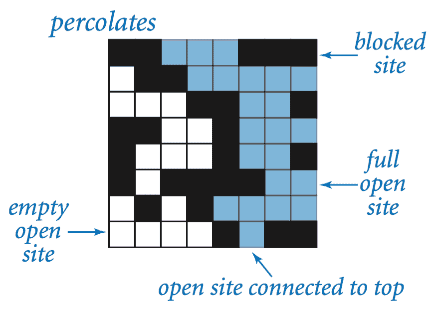
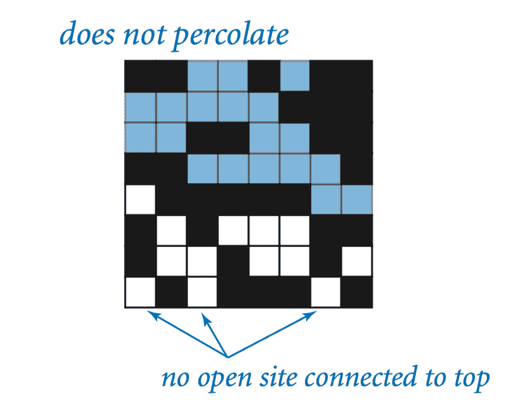
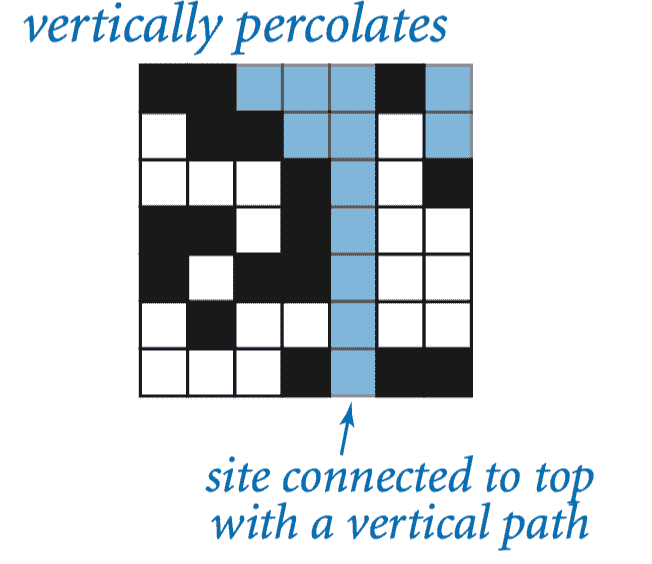
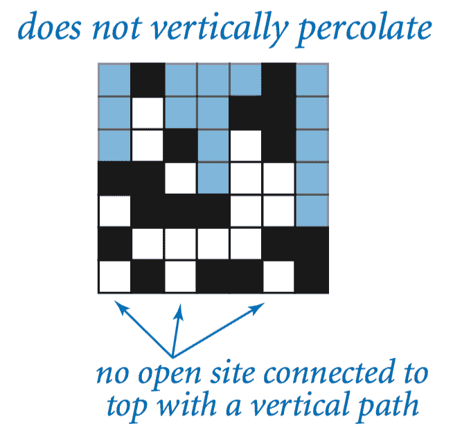
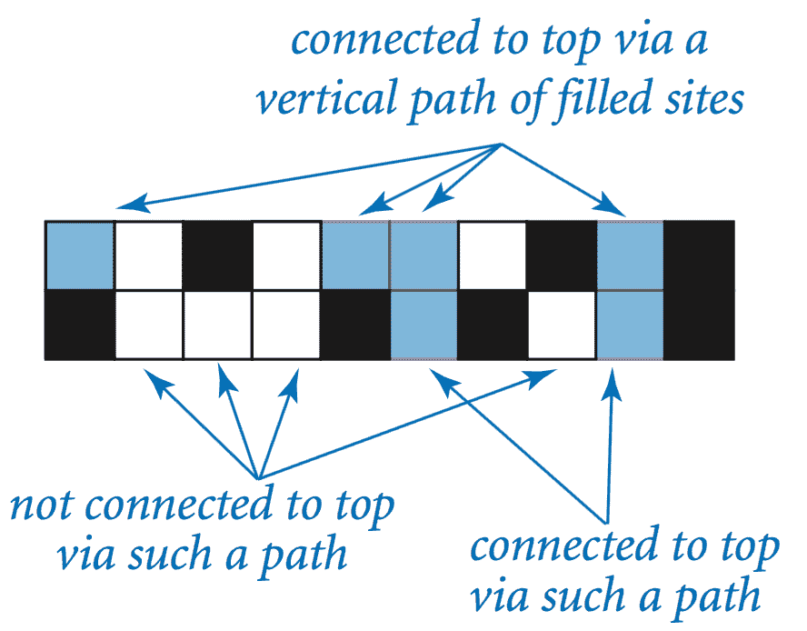
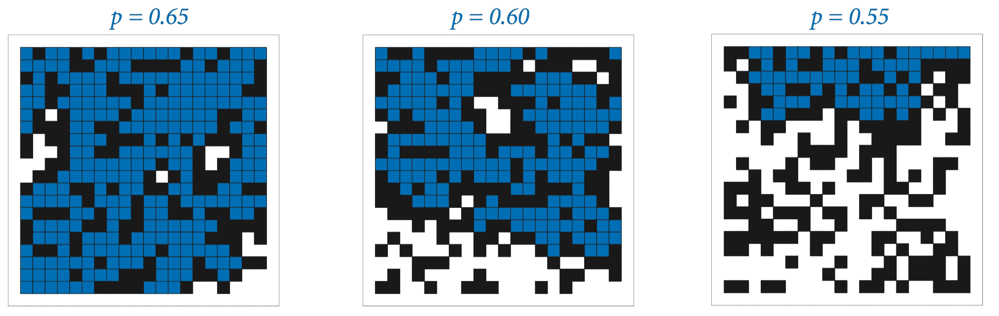
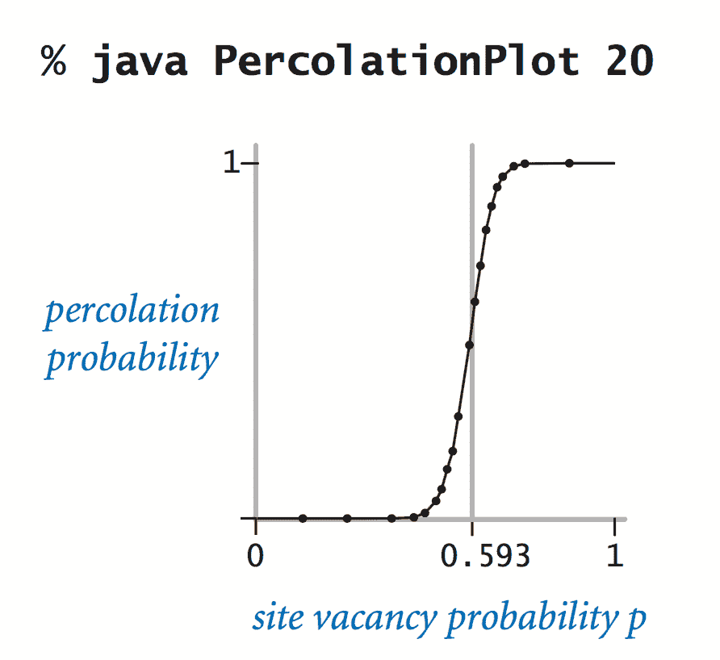
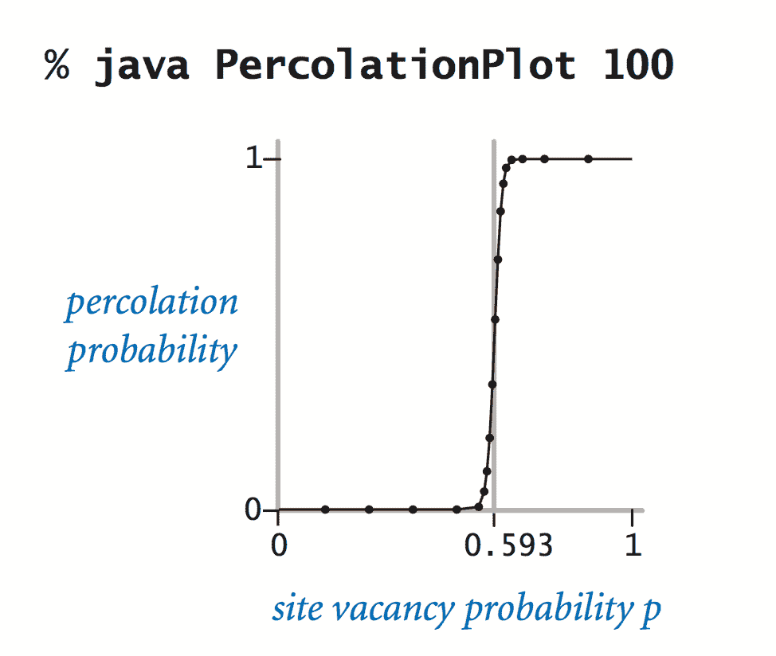
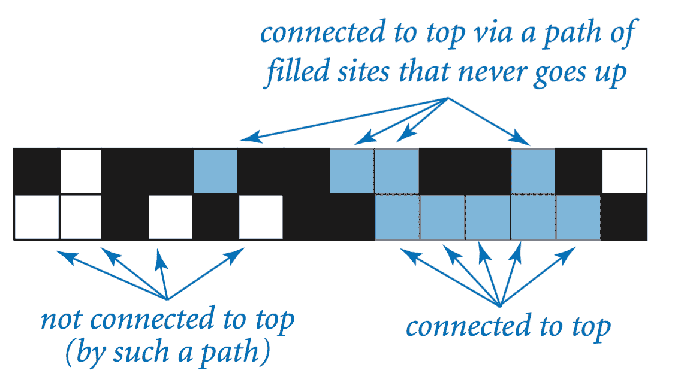

# 2.4   案例研究：渗流

> 原文：[`introcs.cs.princeton.edu/java/24percolation`](https://introcs.cs.princeton.edu/java/24percolation)
> 
> 译者：[飞龙](https://github.com/wizardforcel)
> 
> 协议：[CC BY-NC-SA 4.0](https://creativecommons.org/licenses/by-nc-sa/4.0/)

我们通过考虑开发一个解决有趣科学问题的程序的案例研究来结束我们对函数和模块的研究。作为研究一种称为*渗流*的自然模型的*蒙特卡罗*模拟。

## 渗流。

我们将系统建模为一个*n*×*n*的网格，每个站点要么是*阻塞*的，要么是*开放*的；开放的站点最初是*空的*。一个*满*站点是一个可以通过一系列相邻的（左、右、上、下）开放站点连接到顶行开放站点的开放站点。如果底行有一个满站点，那么我们说系统*渗流*了。

>            

如果站点独立设置为以*空缺概率* *p*开放，那么系统渗流的概率是多少？目前尚未推导出这个问题的数学解。我们的任务是编写计算机程序来帮助研究这个问题。

## 数据表示。

我们的第一步是选择数据的表示。我们使用一个*布尔矩阵* `isOpen[][]` 表示哪些站点是开放的，另一个布尔矩阵 `isFull[][]` 表示哪些站点是满的。

## 垂直渗流。

给定表示开放站点的布尔矩阵，我们如何确定它是否代表一个渗流的系统？目前，我们将考虑一个我们称之为*垂直渗流*的问题的简化版本。简化是将注意力限制在垂直连接路径上。

>            

VerticalPercolation.java 确定通过一些与顶部垂直连接的路径填充的站点，使用简单的计算。

> 

## 数据可视化。

PercolationVisualizer.java 是一个测试客户端，生成随机布尔矩阵并使用标准绘图绘制它们。

> 

## 估计概率。

PercolationProbability.java 估计了具有站点空缺概率*p*的随机*n*×*n*系统渗流的概率。我们将这个数量称为*渗流概率*。为了估计它的值，我们只需运行一些实验。

## 渗流的递归解决方案。

当*任何*从顶部开始并以底部结束的路径（不仅仅是垂直路径）都能完成任务时，我们如何测试系统是否渗流？令人惊讶的是，我们可以用一个基于经典递归方案的紧凑程序来解决这个问题，这个方案被称为*深度优先搜索*。Percolation.java 采用这种方法。有关详细信息，请参阅教科书。

## 自适应绘图。

PercolationPlot.java 将渗流概率作为站点空缺概率*p*的函数绘制为一个*n*×*n*系统。它使用一种递归方法，以相对较低的成本产生一个外观良好的曲线。

>            

曲线支持这样一个假设：存在一个*阈值*值（约为 0.593）：如果*p*大于阈值，则系统几乎肯定渗透；如果*p*小于阈值，则系统几乎肯定不会渗透。随着*n*的增加，曲线逼近一个在阈值处从 0 变为 1 的阶跃函数。这种现象，被称为*相变*，在许多物理系统中都能找到。

#### 练习

1.  创建一个程序 PercolationDirected.java，用于测试*有向*渗透（通过在递归`flow()`方法中省略最后一个递归调用，如文本中所述），然后使用 PercolationPlot.java 绘制有向渗透概率作为站点空缺概率*p*的函数的图表。

#### 创意练习

1.  **非递归有向渗透。** 编写一个非递归程序 PercolationDirectedNonrecursive.java，通过像我们的垂直渗透代码中从顶部到底部移动来测试有向渗透。基于以下计算构建您的解决方案：如果当前行中一组连续的开放站点中的任何站点与上一行的某个满站点相连，则该子行中的所有站点都变为满。

    > 

#### 网络练习

1.  **2x2 渗透。** 验证 2x2 系统渗透的概率是 p²(2 - p²)，其中 p 是一个站点开放的概率。

1.  **立方曲线。** 使用递归细分算法绘制[立方曲线](http://www.ccs.neu.edu/jpt/fhs/)。

1.  **随机漫步。** 术语由匈牙利数学家乔治·波利亚在 1921 年的一篇论文中创造。从 0 开始，以 1/2 的概率向左走，以 1/2 的概率向右走。在 0 处有反射屏障 - 如果粒子碰到 0，它必须在下一步改变方向并返回 1。在*n*处有吸收屏障 - 当粒子碰到状态*n*时停止。估计作为 n 的函数的步数，直到粒子被吸收。

    *解析解*：*n*²。

1.  **三维随机漫步。** 在三维晶格上进行随机漫步，从(0, 0, 0)开始。编写一个程序 Polya.java 来估计在最多一定数量的步骤（比如 1,000 步）之后返回原点的机会。 （在一维和二维中，你肯定会返回；在三维中，概率小于 50%。）在四维晶格上重复练习。 *解决方案*：实际概率（没有对步数的人为限制）被称为[波利亚的随机漫步常数](http://mathworld.wolfram.com/PolyasRandomWalkConstants.html)。对于三维，它略高于 1/3，对于四维，它略低于 1/5。

1.  **避免自交随机漫步。** 模拟在晶格上的随机漫步，直到相交。在所有长度为*n*的避免自交步行（SAW）中，到原点的平均距离是多少？为了节省模拟时间，排除那些曾经向后迈出一步的 SAW。直到至少有一个长度为*n* = 40，*n* = 80 的 SAW 需要多长时间？SAW 的半衰期是多少？为了在模拟中节省更多时间，只允许 SAW 向一个未占用的单元格迈出一步（并重复直到被困住）。关于这些问题几乎没有严格的已知结果，因此模拟是最好的方法。这里有一篇来自《新科学家》的文章。

    著名的 1949 年诺贝尔化学奖得主弗洛里的问题。猜想：在二维中，均方位移的指数为 3/4，在三维中为 3/5。

1.  **自避随机漫步。** 编写一个程序 SelfAvoidingWalk.java 来模拟和展示二维自避随机漫步。自避随机漫步在建模聚合物分子折叠等物理过程中出现。这样的漫步难以用经典数学建模，因此最好通过直接数值模拟来研究。看看多少比例的这种随机漫步最终距离起点超过 R²（比如 30）。

    或者保持长度为*n*的路径。
