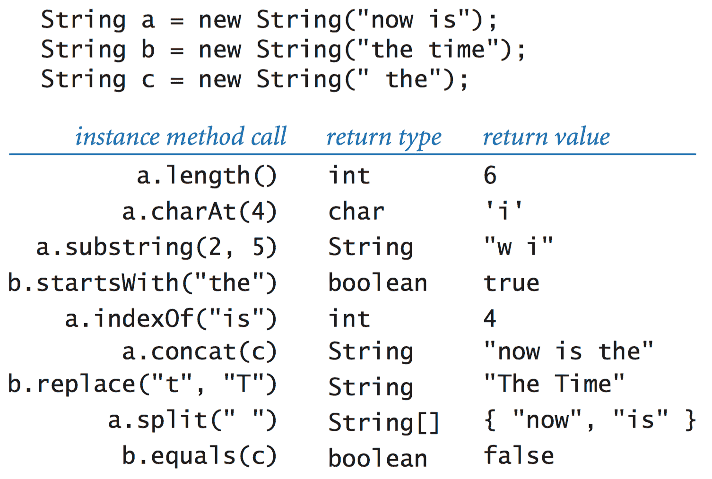

# 3.1   使用数据类型

> 原文：[`introcs.cs.princeton.edu/java/31datatype`](https://introcs.cs.princeton.edu/java/31datatype)
> 
> 译者：[飞龙](https://github.com/wizardforcel)
> 
> 协议：[CC BY-NC-SA 4.0](https://creativecommons.org/licenses/by-nc-sa/4.0/)


*数据类型*是一组值和一组在这些值上定义的操作。���Java 中，您一直在使用原始数据类型，这些数据类型由广泛的适用于各种应用程序的*引用类型*库补充。在本节中，我们考虑用于字符串处理和图像处理的引用类型。

## 字符串。

您已经在使用一个不是原始的数据类型——`String`数据类型，其值是字符序列。我们在*应用程序编程接口*（API）中指定数据类型的行为。这是 Java 的[String](https://docs.oracle.com/javase/8/docs/api/java/lang/String.html)数据类型的部分 API：

> 

第一个条目，与类名相同且没有返回类型，定义了一种特殊的方法，称为*构造函数*。其他条目定义了可以接受参数并返回值的*实例方法*。

> 

+   *声明变量。* 您声明引用类型的变量的方式与声明原始类型的变量的方式完全相同。声明语句不会创建任何内容；它只是说我们将使用变量名`s`来引用一个`String`对象。

+   *创建对象。* 每个数据类型值都存储在一个*对象*中。当客户端调用构造函数时，Java 系统会创建（或*实例化*）一个单独的对象（或*实例*）。要调用构造函数，请使用关键字`new`；后跟类名；后跟构造函数的参数，用括号括起来，用逗号分隔。

+   *调用实例方法。* 引用类型变量和原始类型变量之间最重要的区别是，您可以使用引用类型变量来调用实现数据类型操作的*实例方法*（与我们在原始类型中使用的涉及运算符如`+`的内置语法相反）。

现在，我们考虑各种字符串处理示例。

+   *数据类型操作。* 以下示例说明了`String`数据类型的各种操作。

    > 

+   *代码片段。* 以下代码片段演示了各种字符串处理方法的使用。

    > 

+   *基因组学。* 生物学家使用一个简单的模型来表示生命的基本组成部分，其中字母 A、C、G 和 T 代表生物体 DNA 中的四个碱基。*基因*是一个表示在理解生命过程中至关重要的功能单元的子字符串。PotentialGene.java 以 DNA 字符串作为参数，并根据以下标准确定它是否对应于潜在基因：

    +   它以*起始密码子* ATG 开头。

    +   其长度是 3 的倍数。

    +   它以*终止密码子* TAG、TAA 或 TGA 之一结束。

    +   它没有干扰的终止密码子。

## 颜色。  Java 的[Color](https://docs.oracle.com/javase/8/docs/api/java/awt/Color.html)数据类型使用[RGB 颜色模型](https://en.wikipedia.org/wiki/RGB_color_model)表示颜色值，其中颜色由三个整数（每个介于 0 和 255 之间）定义，表示颜色的红色、绿色和蓝色分量的强度。通过混合红色、蓝色和绿色分量获得其他颜色值。

`Color`数据类型有一个接受三个整数参数的构造函数。例如，您可以编写

```java
Color red      = new Color(255,   0,   0);
Color bookBlue = new Color(  9,  90, 166);

```

用于创建代表纯红色和用于打印本书的蓝色的对象。以下表总结了我们在本书中使用的[Color](https://docs.oracle.com/javase/8/docs/api/java/awt/Color.html) API 中的方法：

> 

这里有一些使用 `Color` 数据类型的示例客户端。

+   *Albers 方块.* AlbersSquares.java 在命令行上以 1960 年代约瑟夫·阿尔伯斯开发的格式显示以 RGB 表示的两种颜色，这种格式彻底改变了人们对颜色的看法。

    > 

+   *亮度.* 现代显示器（如液晶显示器、等离子电视和手机屏幕）上的图像质量取决于一种称为 *单色亮度* 或有效亮度的颜色属性的理解。 它是三种强度的线性组合：如果颜色的红色、绿色和蓝色值分别为 *r*、*g* 和 *b*，则其亮度由以下方程定义

    > $$Y = 0.299r + 0.587g + 0.114b$$

+   *灰度.*  RGB 颜色模型具有这样的特性，即当三种颜色强度相同时，结果颜色位于从黑色（全 0）到白色（全 255）的灰度范围内。 将颜色转换为灰度的简单方法是用其亮度等于其红色、绿色和蓝色值的新颜色替换该颜色。

+   *颜色兼容性.* 亮度值在确定两种颜色是否兼容方面也至关重要，即在另一种颜色的背景上打印文本是否可读。 一个广泛使用的经验法则是前景色和背景色之间的亮度差应至少为 128。

    > 

Luminance.java 是一个静态方法库，我们可以用它来将颜色转换为灰度并测试两种颜色是否兼容。## 图像处理。 *数字图像* 是一个由 *像素*（图像元素）组成的矩形网格，其中每个像素的颜色是单独定义的。 数字图像有时被称为 *光栅* 或 *位图* 图像。 相比之下，我们使用 `StdDraw` 生成的图像（涉及几何对象）被称为 *矢量* 图像。

[Picture](http://introcs.cs.princeton.edu/java/stdlib/javadoc/Picture.html) 数据类型允许您操作数字图像。 值集是一个二维矩阵，其中包含 `Color` 值，并且操作是您可能期望的：创建图像（空白或从文件），将像素的值设置为给定颜色，并提取给定像素的颜色。 以下 API 总结了可用的操作：

> 

大多数图像处理程序都是过滤器，通过扫描源图像中的所有像素，然后执行一些计算来确定目标图像中每个像素的颜色。

+   *灰度.* Grayscale.java 将图像从彩色转换为灰度。

    |  |      |  |
    | --- | --- | --- |

+   *缩放.* Scale.java 接受一个图像文件的名称和两个整数（宽度 *w* 和高度 *h*）作为命令行参数，将图片缩放到 *w*-by-*h*，并显示两个图像。

    |  *600-by-300* |      |  *200-by-400* |
    | --- | --- | --- |

+   *淡入效果.* Fade.java 接受一个整数 *n* 和源图像和目标图像的名称作为命令行参数，并在 *n* 步内从源图像淡入到目标图像。 它使用线性插值策略，其中图像 *i* 中的每个像素是源图像和目标图像中相应像素的加权平均值。

## 输入和输出重访。

在第 1.5 节中，您学习了如何使用标准输入、输出和绘图读取和写入数字和文本。这些限制我们只能处理一个输入文件、一个输出文件和一个绘图文件。通过面向对象编程，我们考虑允许我们在一个程序中处理多个输入流、输出流和绘图的数据类型。

+   *输入流数据类型。*[In](http://introcs.cs.princeton.edu/java/stdlib/javadoc/In.html)是支持从文件和网站以及标准输入流中读取数字和文本数据的[StdIn](http://introcs.cs.princeton.edu/java/stdlib/javadoc/StdIn.html)的面向对象版本。

    > 

+   *输出流数据类型。*[Out](http://introcs.cs.princeton.edu/java/stdlib/javadoc/Out.html)是支持将文本打印到各种输出流的[StdOut](http://introcs.cs.princeton.edu/java/stdlib/javadoc/StdOut.html)的面向对象版本。

    > 

+   *文件连接。*Cat.java 读取指定为命令行参数的多个文件，将它们连接起来，并将结果打印到一个文件中。

+   *屏幕抓取。*StockQuote.java 以纽约证券交易所股票符号作为命令行参数，并打印其当前交易价格。它使用一种称为*屏幕抓取*的技术，其目标是使用程序从网页中提取一些信息。为了报告谷歌的当前股价（纽约证券交易所符号=GOOG），它读取 Web 页面`http://finance.yahoo.com/quote/GOOG`。然后，它使用`indexOf()`和`substring()`来识别相关信息。

+   *提取数据。*Split.java 使用多个输出流将 CSV 文件拆分为单独的文件，每个文件包含一个逗号分隔的字段。

+   *绘图数据类型。*[Draw](http://introcs.cs.princeton.edu/java/stdlib/javadoc/Draw.html)是支持在同一个程序中绘制多个画布的[StdDraw](http://introcs.cs.princeton.edu/java/stdlib/javadoc/StdDraw.html)的面向对象版本。

## 引用类型的属性。

我们总结了一些引用类型的基本属性。

+   *别名。*具有引用类型的赋值语句会创建引用的第二个副本。赋值语句不会创建新对象，只是对现有对象的另一个引用。这种情况被称为*别名*：两个变量引用同一个对象。例如，考虑以下代码片段：

    ```java
    Picture a = new Picture("mandrill.jpg");
    Picture b = a;
    a.set(col, row, color1);   // a updated
    b.set(col, row, color2);   // a updated again

    ```

    在第二个赋值语句之后，变量`a`和`b`引用同一个`Picture`对象。

+   *按值传递。*当你调用一个带有参数的方法时，在 Java 中的效果就好像每个参数都出现在赋值语句的右侧，相应的参数名出现在左侧一样。也就是说，Java 将调用者的参数值的*副本*传递给方法。如果参数值是原始类型，Java 将传递该值的副本；如果参数值是对象引用，Java 将传递对象引用的副本。这种安排被称为*按值传递*。

+   *数组是对象。*在 Java 中，数组是对象。与字符串一样，对数组的某些操作提供了特殊的语言支持：声明、初始化和索引。与任何其他对象一样，当我们将一个数组传递给一个方法或在赋值语句的右侧使用一个数组变量时，我们实际上是在传递数组引用的副本，而不是数组的副本。

+   *对象数组。*当我们创建一个对象数组时，我们需要分两步进行：

    +   使用`new`和方括号语法创建数组。

    +   通过使用`new`调用构造函数为数组中的每个对象创建对象。

    例如，以下代码创建了一个包含两个`Color`对象的数组：

    ```java
    Color[] a = new Color[2];
    a[0] = new Color(255, 255, 0);
    a[1] = new Color(160, 82, 45);

    ```

+   *安全指针。* 在 Java 中，只有一种方式可以创建引用（使用`new`），也只有一种方式可以操作该引用（使用赋值语句）。Java 引用被称为*安全指针*，因为 Java 可以保证每个引用指向指定类型的对象（而不是任意内存地址）。

+   *孤立对象。* 将不同对象分配给引用变量的能力会导致程序可能创建了一个无法再引用的对象。这样的对象被称为*孤立对象*。例如，考虑以下代码片段：

    ```java
    Color a, b;
    a = new Color(160, 82, 45);  // sienna
    b = new Color(255, 255, 0);  // yellow
    b = a;

    ```

    在最后一个赋值语句之后，不仅`a`和`b`引用相同的`Color`对象（sienna），而且不再有引用指向用于初始化`b`的`Color`对象（yellow）。

+   *垃圾收集。* Java 最重要的特性之一是其自动管理内存的能力。这个想法是通过跟踪孤立对象并将它们使��的内存返回到空闲内存池中，使程序员摆脱管理内存的责任。以这种方式回收内存被称为*垃圾收集*，而 Java 的安全指针策略使其能够高效地执行此操作。

#### 练习

1.  编写一个函数`reverse()`，它接受一个字符串作为参数，并返回一个包含与参数字符串相同字符序列但顺序相反的字符串。

    *解决方案*：ReverseString.java。

1.  编写一个程序 FlipX.java，它接受图像文件的名称作为命令行参数，并水平翻转图像。

    |  |      |  |
    | --- | --- | --- |

1.  编写一个程序 ColorSeparation.java，它接受图像文件的名称作为命令行参数，并创建并显示三个`Picture`对象，一个包含红色分量，一个包含绿色分量，一个包含蓝色分量。

    |  |      |  |      |  |
    | --- | --- | --- | --- | --- |

1.  编写一个静态方法`isValidDNA()`，它接受一个字符串作为参数，并仅在其完全由字符`A`、`T`、`C`和`G`组成时返回`true`。

    *解决方案*：

    ```java
    public static boolean isValidDNA(String s) {
        for (int i = 0; i < s.length(); i++) {
            char c = s.charAt(i);
            if (c != 'A' && c != 'T' && c != 'C' && c != 'G')
                return false;
        }

    ```

1.  编写一个函数`complementWatsonCrick()`，它接受一个 DNA 字符串作为参数，并返回其*Watson-Crick 互补*：用`T`替换`A`，用`G`替换`C`，反之亦然。

    *解决方案*：

    ```java
    public static String complementWatsonCrick(String s) {
        s = s.replaceAll("A", "t");
        s = s.replaceAll("T", "a");
        s = s.replaceAll("C", "g");
        s = s.replaceAll("G", "c");
        return s.toUpperCase();
    }

    ```

1.  以下代码片段打印什么？

    ```java
    String string1 = "hello";
    String string2 = string1;
    string1 = "world";
    System.out.println(string2);

    ```

    *解决方案*：`hello`。

1.  以下代码片段打印什么？

    ```java
    String s = "Hello World";
    s.toUpperCase();
    s.substring(6, 11);
    StdOut.println(s);

    ```

    *解决方案*：`Hello, World`。字符串对象是不可变的。

1.  如果一个字符串`s`是字符串`t`的*循环移位*，则当一个字符串的字符被某个位置的循环移动时，它们匹配。例如，`ACTGACG`是`TGACGAC`的循环移位，反之亦然。检测这种条件在基因组序列研究中很重要。编写一个函数`isCircularShift()`，检查给定的两个字符串`s`和`t`是否彼此的循环移位。

    *解决方案*：

    ```java
    public boolean isCircularShift(String s, String t) {
        String s2 = s + s;
        return s2.contains(t);
    }

    ```

1.  以下递归函数返回什么？

    ```java
    public static String mystery(String s) {
        int n = s.length();
        if (n <= 1) return s;
        String a = s.substring(0, n/2);
        String b = s.substring(n/2, N);
        return mystery(b) + mystery(a);
    }

    ```

    *解决方案*：其参数字符串的反转。

1.  假设`a[]`和`b[]`都是由数百万个整数组成的整数数组。以下代码做了什么，需要多长时间？

    ```java
    int[] temp = a;
    a = b;
    b = temp;

    ```

    *解决方案*：它交换了数组，但是通过复制对象引用来实现，因此不需要复制数百万个值。

1.  描述以下函数的效果。

    ```java
    public void swap(Color a, Color b) {
        Color temp = a;
        a = b;
        b = temp;
    }

    ```

    *解决方案*：它没有效果，因为 Java 通过值传递对象引用。

#### 创意练习

1.  **印度密宗密码.** 编写一个过滤器 KamasutraCipher.java，它将两个字符串作为命令行参数（*密钥*字符串），然后从标准输入读取字符串（以空格分隔），按照密钥字符串指定的方式替换每个字母，并将结果打印到标准输出。这个操作是已知的最早的密码系统之一的基础。密钥字符串的条件是��们必须具有相同的长度，并且标准输入中的任何字母必须只出现在其中一个中。例如，如果两个密钥是`THEQUICKBROWN`和`FXJMPSVLAZYDG`，那么我们制作表格

    ```java
    T H E Q U I C K B R O W N
    F X J M P S V L A Z Y D G

    ```

    这告诉我们，在将标准输入过滤到标准输出时，应该将 F 替换为 T，T 替换为 F，H 替换为 X，X 替换为 H，依此类推。消息通过用其对应的字母替换每个字母来进行编码。例如，消息`MEET AT ELEVEN`被编码为`QJJF BF JKJCJG`。接收消息的人可以使用相同的密钥将消息还原。

1.  **色彩研究.** 编写一个程序 ColorStudy.java，显示右侧显示的色彩研究，其中给出了对应于本书中使用的 256 个蓝色级别（按行主序的蓝色到白色）和灰色级别（按列主序的黑色到白色）的 Albers 方块。

    > 

1.  **标题.** 编写一个程序 Tile.java，该程序接受一个图像文件的名称和两个整数*m*和*n*作为命令行参数，并创建一个*m*乘以*n*的图像平铺。

    |  |
    | --- |

1.  **旋转滤镜.** 编写一个程序 Rotation.java，该程序接受两个命令行参数（图像文件的名称和一个实数\(\theta\)），并将图像逆时针旋转\(\theta\)度。要进行旋转，将源图像中每个像素\((s_i, s_j)\)的颜色复制到由以下公式给出的目标像素\((t_i, t_j)\)中：

    > $$ \begin{align} t_i \;&=\; (s_i - c_j) \cos \theta - (s_j - c_j) \sin \theta + c_j \\[1ex] t_j \;&=\; (s_i - c_j) \sin \theta + (s_j - c_j) \cos \theta + c_j \end{align} $$

    其中\((c_i, c_j)\)是图像的中心。

    |  |      |  |
    | --- | --- | --- |

1.  **涡旋滤镜.** 创建涡旋效果类似于旋转，只是角度随着到图像中心的距离的变化而变化。使用与前一个练习中相同的公式，但将\(\theta\)计算为\((s_i, s_j)\)的函数，具体来说是\(\pi/256\)乘以到中心的距离。

    |  |      |  |
    | --- | --- | --- |

1.  **波浪滤镜.** 编写一个过滤器 Wave.java，类似于前两个练习中的过滤器，创建波浪效果，通过将源图像中每个像素\((s_i, s_j)\)的颜色复制到目标像素\((t_i, t_j)\)中，其中

    > $$ \begin{align} t_i \;&=\; s_i \\[1ex] t_j \;&=\; s_j + 20 \sin(2 \pi s_j / 64) \end{align} $$

    添加代码以将振幅（附图中的 20）和频率（附图中的 64）作为命令行参数。

    |  |      |  |
    | --- | --- | --- |

1.  **玻璃滤镜.** 编写一个程序 Glass.java，该程序将图像文件的名称作为命令行参数，并应用*玻璃滤镜*：将每个像素*p*设置为随机相邻像素的颜色（其像素坐标与*p*的坐标最多相差 5）。

    |  |      |  |
    | --- | --- | --- |

    

1.  **数字缩放。**编写一个程序 Zoom.java，接受图像文件的名称和三个数字*s*、*x*和*y*作为命令行参数，并显示一个放大输入图像部分的输出图像。这些数字都在 0 和 1 之间，*s*被解释为比例因子，(*x*, *y*)为输出图像中心点的相对坐标。使用此程序在计算机上的某个数字照片上放大一个相对或宠物。

#### 网络练习（字符串处理）

1.  编写一个函数，接受一个字符串作为输入，并返回字母`e`出现的次数。

1.  给出一个一行 Java 代码片段，将字符串中所有句号替换为逗号。*答案*：`s = s.replace('.', ',')`。

    不要使用`s = s.replaceAll(".", ",")`。`replaceAll()`方法使用*正则表达式*，其中`"."`具有特殊含义。

1.  将所有制表符替换为四个空格。*答案*：`s = s.replace("\t", "    ")`。

1.  编写一个程序，接受一个命令行输入字符串 s，从标准输入读取字符串，并打印出 s 出现的次数。*提示*：使用`equals`而不是`==`来比较引用。

1.  编写一个程序，将一个月份的名称（3 个字母缩写）作为命令行参数读入，并打印出非闰年中该月份的天数。

    ```java

    public static void main(String[] args) {
        String[] months = {
            "Jan", "Feb", "Mar", "Apr", "May", "Jun", 
            "Jul", "Aug", "Sep", "Oct", "Nov", "Dec"
        };
        int[] days = {
            31, 28, 31, 30, 31, 30,
            31, 31, 30, 31, 30, 31
        };
        String name = args[0];
        for (int i = 0; i < months.length; i++)
           if (name.equalsIgnoreCase(months[i]))
              System.out.println(name + " has " + days[i] + " days");
    }

    ```

1.  编写一个程序 Squeeze.java，接受一个字符串作为输入，并移除相邻的空格，最多保留一个空格。

1.  以下哪个或哪些方法将数组`a`中的所有字符串转换为大写？

    ```java
    for (int i = 0; i < a.length; i++) {
       String s = a[i];
       s = s.toUpperCase();
    }

    for (int i = 0; i < a.length; i++) {
       a[i].toUpperCase();
    }

    for (int i = 0; i < a.length; i++) {
       a[i] = a[i].toUpperCase();
    }

    ```

    *答案*：只有最后一个。

1.  描述以下函数返回的字符串，给定一个正整数`n`？

    ```java
    public static String mystery(int n) {
       String s = "";
       while (n > 0) {
           if (n % 2 == 1) s = s + s + "x";
           else            s = s + s;
           n = n / 2;
       }
       return s;
    }

    ```

    *解决方案*：长度为`n`且只包含字符`x`的字符串。

1.  编写一个函数，接受一个字符串`s`和一个整数`n`，并返回一个长度恰好为`n`的新字符串`t`，其中包含`s`（如果其长度大于`n`则截断）后跟一个序列的`'-'`字符（如果`s`的长度小于`n`）。

1.  给定两个长度相同的字符串`s`和`t`，以下递归函数返回什么？

    ```java
    public static String mystery(String s, String t) {
       int n = s.length();
       if (n <= 1) return s + t;
       String a = mystery(s.substring(0, n/2), t.substring(0, n/2));
       String b = mystery(s.substring(n/2, n), t.substring(n/2, n));
       return a + b;
    }

    ```

    *解决方案*：s 和 t 字符的完美洗牌。

1.  编写一个程序，读取一个字符串，并打印出字符串中第��次出现的仅出现一次的字符。例如：ABCDBADDAB -> C。

1.  给定一个字符串，创建一个新的字符串，其中移除所有连续重复的字符。例如：ABBCCCCCBBAB -> ABCBAB。

1.  编写一个函数，接受两个字符串参数`s`和`t`，并返回`s`中第一个出现在`t`中的字符的索引（如果 s 中没有字符出现在 t 中，则返回-1）。

1.  给定一个字符串`s`，确定它是否表示一个网页的名称。假设任何以`http://`开头的字符串都是网页。

    *解决方案*：`if (s.startsWith("http://"))`。

1.  给定一个表示网页名称的字符串`s`，将其分割成多个部分，每个部分由句点分隔，例如，`http://www.cs.princeton.edu`应该分割为`www`、`cs`、`princeton`和`edu`，并移除`http://`部分。使用`split()`或`indexOf()`方法。

1.  给定一个表示文件名的字符串`s`，编写一个代码片段来确定其文件扩展名。*文件扩展名*是最后一个句点之后的子字符串。例如，`monalisa.jpg`的文件类型是`jpg`，`mona.lisa.png`的文件类型是`png`。

    *库解决方案*：此解决方案用于在`Picture.java`中将图像保存到适当类型的文件中。

    ```java
    String extension = s.substring(s.lastIndexOf('.') + 1);

    ```

1.  给定一个表示文件名的字符串`s`，编写一个代码片段来确定其目录部分。这是以最后一个`/`字符（目录分隔符）结尾的前缀；如果没有这样的`/`，则为空字符串。例如，`/Users/wayne/monalisa.jpg`的目录部分是`/Users/wayne/`。

1.  给定一个表示文件名的字符串`s`，编写一个代码片段来确定其基本名称（文件名减去任何目录）。对于`/Users/wayne/monalisa.jpg`，基本名称是`monalisa.jpg`。

1.  编写一个程序，从标准输入读取文本并将其打印回去，将所有单引号替换为双引号。

1.  编写一个程序`Paste.java`，接受任意数量的命令行输入，并连接每个文件的相应行，并将结果写入标准输出。（通常给定文件中的每行长度相同。）`Cat.java`程序的对应程序。

1.  当 N = 5 时，程序 LatinSquare.java 会打印什么？

    ```java
    String alphabet = "ABCDEFGHIJKLMNOPQRSTUVWXYZ";
    for (int i = 0; i < N; i++) {
       for (int j = 0; j < N; j++) {
          char c = alphabet.charAt((i + j) % N);
          System.out.print(c + " ");
       }
       System.out.println();
    }

    ```

    阶数为 N 的拉丁方是一个由 N 个不同符号组成的 N×N 数组，使得每个符号在每行和每���中恰好出现一次。拉丁方在统计设计和密码学中很有用。

1.  以下代码片段会打印什么？

    ```java
    String s = "Hello World";
    s.toUpperCase();
    s.substring(6, 11);
    System.out.println(s);

    ```

    *答案*: `Hello World`。`toUpperCase`和`substring`方法返回结果字符串，但程序忽略了这些，所以`s`从未被改变。要打印出`WORLD`，使用`s = s.toUpperCase()`和`s = s.substring(6, 11)`。

1.  当执行以下代码片段时会发生什么？

    ```java
    String s = null;
    int length = s.length();

    ```

    *答案*：由于`s`为`null`且您试图对其进行解引用，因此会得到`NullPointerException`。

1.  在下面的两个赋值语句之后，x 和 y 的值是多少？

    ```java
    int x = '-'-'-';
    int y = '/'/'/';

    ```

1.  当`c`是`char`类型时，以下语句会做什么？

    ```java
    System.out.println((c >= 'a' && c <= 'z') ||
                       (c >= 'A' && c <= 'Z'));

    ```

    答案：如果`c`是大写或小写字母，则打印`true`，否则打印`false`。

1.  编写一个表达式，测试一个字符是否代表数字`'0'`到`'9'`之间的数字，而不使用任何库函数。

    ```java
    boolean isDigit = ('0' <= c && c <= '9');

    ```

1.  编写一个程序，WidthChecker.java，接受一个命令行参数 N，从标准输入读取文本，并将长度超过 N 个字符（包括空格）的所有行打印到标准输出。

1.  编写一个程序，Hex2Decimal.java，将十六进制字符串（使用 A-F 表示数字 11-15）转换为十进制。

1.  **wget**。编写一个程序 Get.java，将 URL 的名称作为命令行参数，并使用相同的文件名保存引用的文件。

1.  **大写首字母**。编写一个程序，Capitalize.java，从标准输入读取文本，并将每个单词大写（首字母大写，其余字母小写）。

1.  **香农的熵实验**。通过列出句子中的一些字母并提示用户输入下一个符号，重新创建香农对英语语言熵的实验。香农得出结论，字母表中每个字母大约有 1.1 位信息。

1.  **混淆的文本**。一些认知心理学家认为人们根据单词的形状来识别单词。

    > 根据一项在英语大学进行的研究，一个单词中字母的顺序并不重要，重要的是第一个和最后一个字母在正确的位置。其余字母可以是一个混乱，但你仍然可以无障碍地阅读。这是因为我们不是逐个字母阅读，而是整个单词。

    编写一个程序，从标准输入读取文本并将文本打印回去，但是对每个单词中的内部字母进行混淆。编写并使用一个名为`scramble()`的函数，该函数接受一个字符串作为输入，并返回另一个内部字母顺序随机排列的字符串。使用 Shuffle.java 中的洗牌算法进行混洗部分。

1.  **日期格式转换**。编写一个程序，读取形式为 2003-05-25 的日期，并将其转换为 5/25/03。

1.  **英文文本的频率分析。** 编写一个名为`LetterFrequency.java`的程序，从标准输入中读取文本（例如，白鲸），并计算每个 26 个小写字母出现的频率。在分析中忽略大写字母、标点符号、空白等。使用第 2.4 节中的`CharStdIn.java`来读取处理文本文件。

1.  **打印最长单词。** 重复上一个练习，但如果存在并列情况，则打印出所有最长的单词，最多打印 10 个单词。使用一个字符串数组来存储当前最长的单词。

1.  **测试两个文件是否相等。** 编写一个程序，接受两个文本文件的名称作为命令行输入，并检查它��的内容是否相同。

1.  **解析命令行选项。** Unix 命令行程序通常支持*标志*，这些标志配置程序的行为以产生不同的输出，例如，"wc -c"。编写一个程序，从命令行接受任意数量的标志，并运行用户指定的选项。要检查选项，使用类似`if (s.equals("-v"))`的语句。

1.  **大写。** 编写一个名为`Capitalizer.java`的程序，从标准输入中读取文本字符串，并修改每个字符串，使每个单词的第一个字母大写，其他字母小写。

1.  **栅栏置换密码。** 编写一个名为`RailFenceEncoder.java`的程序，从标准输入中读取文本，并打印出奇数位置的字符，然后是偶数位置的字符。例如，如果原始消息是"Attack at Dawn"，那么你应该打印出"Atc tDwtaka an"。这是一种粗糙的加密形式。

1.  **栅栏置换密码。** 编写一个名为`RailFenceDecoder.java`的程序，该程序读取使用栅栏置换密码编码的消息，并通过反转加密过程来打印原始消息。

1.  **斯塞塔利密码。** *斯塞塔利密码*是用于军事目的的第一个密码设备之一。（参见《密码书》，第 8 页有一张漂亮的图片。）它是由公元前 5 世纪的斯巴达人使用的。为了混淆文本，你需要从开头开始打印每第 k 个字符，然后从第二个字符开始打印每第 k 个字符，依此类推。编写一对程序`ScytaleEncoder.java`和`ScytaleDecoder.java`来实现这种加密方案。

1.  **打印最长单词。** 从标准输入读取一个单词列表，并打印出最长的单词。使用`length`方法。

1.  **子序列。** 给定两个字符串`s`和`t`，编写一个程序 Subsequence.java，确定`s`是否是`t`的子序列。也就是说，`s`的字母应该按照相同的顺序出现在`t`中，但不一定是连续的。例如，`accag`是`taagcccaaccgg`的一个子序列。

1.  **圣经密码。** 一些宗教狂热者相信《圣经》包含通过每第 k 个字母阅读出现的隐藏短语，并且这种模式可以用于寻找约柜、治愈癌症和预测未来。这些结果不基于科学方法，数学家已经[揭穿](http://cs.anu.edu.au/~bdm/dilugim/torah.html)了这些结果，并将其归因于非法数据操纵。使用相同的方法，可以在《战争与和平》的希伯来文翻译中找到统计上相似的模式。

1.  **单词链检查器。** 编写一个程序，从命令行读取一个单词列表，并在它们形成*单词链*时打印`true`，否则打印`false`。在单词链中，相邻单词必须在恰好一个字母上有所不同，例如，HEAL, HEAD, DEAD, DEED, DEER, BEER。

1.  **俳句检测器。** 编写一个程序，从标准输入中读取文本，并检查它是否构成一个俳句。俳句由三行组成，分别包含正确数量的音节（5、7 和 5 个）。根据此问题的定义，一个音节是任何连续的元音序列（a、e、i、o、u 或 y）。根据这个规则，*haiku*有两个音节，*purpose*有三个音节。当然，第二个例子是错误的，因为 purpose 中的 e 是不发音的。

1.  **ISBN 号码。** 编写一个程序来检查 ISBN 号码是否有效。回忆校验位。ISBN 号码也可以在任意位置插入连字符。

1.  **最长公共前缀。** 编写一个函数，接受两个输入字符串 s 和 t，并返回这两个字符串的最长公共前缀。例如，如果 s = ACCTGAACTCCCCCC，t = ACCTAGGACCCCCC，那么最长公共前缀是 ACCT。注意，如果 s 和 t 以不同的字母开头，或者一个是另一个的前缀，要小心处理。

1.  **最长互补回文。** 在 DNA 序列分析中，*互补回文*是一个等于其反向互补的字符串。腺嘌呤（A）和胸腺嘧啶（T）是互补的，胞嘧啶（C）和鸟嘌呤（G）也是互补的。例如，ACGGT 是一个互补回文。这样的序列作为转录结合位点，并与基因扩增和遗传不稳定性相关联。给定一个长度为 N 的文本输入，找到文本的最长互补回文子串。例如，如果文本是`GACACGGTTTTA`，那么最长互补回文是`ACGGT`。*提示*：将每个字母视为可能长度为奇数的回文的中心，然后将每对字母视为可能长度为偶数的回文的中心。

1.  **最高密度 C+G 区域。** 给定一个由 A、C、T、G 组成的 DNA 字符串`s`和一个参数`L`，找到一个包含最高比例的 C + G 字符的子串`s`，该子串至少包含`L`个字符。

1.  **循环位移的子字符串。** 编写一个函数，接受两个字符串`s`和`t`，如果`s`是循环字符串`t`的子字符串，则返回`true`，否则返回`false`。例如，`gactt`是循环字符串`tgacgact`的子字符串。

1.  **DNA 转蛋白质。** 蛋白质是由一系列氨基酸（单体）组成的大分子（聚合物）。一些蛋白质的例子包括：血红蛋白、激素、抗体和铁蛋白。自然界中存在 20 种不同的氨基酸。每种氨基酸由三个 DNA 碱基对（A、C、G 或 T）指定。编写一个程序，读取一个蛋白质（由其碱基对指定），并将其转换为一系列氨基酸。使用以下表格。例如，异亮氨酸（I）由 ATA、ATC 或 ATT 编码。

    生命的罗塞塔石。

    ```java
    TTT Phe    TCT Ser    TAT Tyr    TGT Cys
    TTC Phe    TCC Ser    TAC Tyr    TGC Cys
    TTA Leu    TCA Ser    TAA ter    TGA ter
    TTG Leu    TCG Ser    TAG ter    TGG Trp

    CTT Leu    CCT Pro    CAT His    CGT Arg
    CTC Leu    CCC Pro    CAC His    CGC Arg
    CTA Leu    CCA Pro    CAA Gln    CGA Arg
    CTG Leu    CCG Pro    CAG Gln    CGG Arg

    ATT Ile    ACT Thr    AAT Asn    AGT Ser
    ATC Ile    ACC Thr    AAC Asn    AGC Ser
    ATA Ile    ACA Thr    AAA Lys    AGA Arg
    ATG Met    ACG Thr    AAG Lys    AGG Arg

    GTT Val    GCT Ala    GAT Asp    GGT Gly
    GTC Val    GCC Ala    GAC Asp    GGC Gly
    GTA Val    GCA Ala    GAA Glu    GGA Gly
    GTG Val    GCG Ala    GAG Glu    GGG Gly

    ```

    | 氨基酸 | 缩写 | 缩写 |   | 氨基酸 | 缩写 | 缩写 |
    | --- | --- | --- | --- | --- | --- | --- |
    | 丙氨酸 | ala | A |  | 亮氨酸 | leu | L |
    | 精氨酸 | arg | R |  | 赖氨酸 | lys | K |
    | 天冬酰胺 | asn | N |  | 甲硫氨酸 | met | M |
    | 天冬氨酸 | asp | D |  | 苯丙氨酸 | phe | F |
    | 半胱氨酸 | cys | C |  | 脯氨酸 | pro | P |
    | 谷氨酸 | glu | E |  | 丝氨酸 | ser | S |
    | 谷氨酰胺 | gln | Q |  | 苏氨酸 | thr | T |
    | 甘氨酸 | gly | G |  | 色氨酸 | trp | W |
    | 组氨酸 | his | H |  | 酪氨酸 | tyr | Y |
    | 异亮氨酸 | ile | I |  | 缬氨酸 | val | V |

1.  **计数器。** 编写一个程序，从命令行读取一个十进制字符串（例如，56789），并从该数字开始计数（例如，56790，56791，56792）。不要假设输入是 32 位或 64 位整数，而是一个任意精度整数。使用`String`来实现整数（而不是数组）。

1.  **任意精度整数运算。** 编写一个程序，接受两个十进制字符串作为输入，并打印它们的和。使用一个字符串表示整数。

1.  **Boggle。** Boggle 游戏在一个 4x4 的字符网格上进行。有 16 个骰子，每个骰子上有 6 个字母。创建一个 4x4 的网格，其中每个骰子以随机方式出现在一个单元格中，每个骰子随机显示其中的一个字母。

    ```java
    FORIXB MOQABJ GURILW SETUPL CMPDAE ACITAO SLCRAE ROMASH
    NODESW HEFIYE ONUDTK TEVIGN ANEDVZ PINESH ABILYT GKYLEU

    ```

1.  **生成密码。** *密码* 是通过将英文文本混淆而获得的，方法是用另一个字母替换每个字母。编写一个程序来生成 26 个字母的随机排列，并使用它来映射字母。给出示例：不要混淆标点符号或空格。

1.  **Scrabble。** 编写一个程序来确定可以玩的最长合法 Scrabble 单词是什么？要合法，单词必须在官方锦标赛和俱乐部单词列表（TWL98）中，其中包含 TWL98 中介于 2 到 15 个字母之间的所有 168,083 个单词。每个字母代表的瓷砖数量在下表中给出。此外，还有两个 *空白* 可以用来表示任何字母。

    ```java
    a b c d  e f g h i j k l m n o p q r s t u v w x y z -
    9 2 2 4 12 2 3 2 9 1 1 4 2 6 8 2 1 6 4 6 4 2 2 1 2 1 2

    ```

1.  **Soundex。** [Soundex 算法](http://www.archives.gov/research_room/genealogy/census/soundex.html) 是一种根据其发音而不是其拼写方式对姓氏进行编码的方法。发音相同的姓名（例如，SMITH 和 SMYTH）将具有相同的 Soundex 编码。Soundex 算法最初是为了简化人口普查而发明的。它也被家谱学家用来处理具有替代拼写的姓名，并被航空公司接待员用来避免在稍后尝试发音客户姓名时尴尬。

    编写一个程序 Soundex.java，它将两个小写字符串作为参数读入，计算它们的 Soundex，并确定它们是否等价。算法如下：

    1.  保留字符串的第一个字母，但删除所有元音字母以及字母 'h'，'w' 和 'y'。

    1.  使用以下规则为剩余字母分配数字：

        ```java
        1:  B, F, P, V
        2:  C, G, J, K, Q, S, X, Z
        3:  D, T
        4:  L
        5:  M, N
        6:  R

        ```

    1.  如果两个或更多连续的数字相同，则删除所有重复的数字。

    1.  将字符串转换为四个字符：第一个字符是原始字符串的第一个字母，剩下的三个字符是字符串中的前三个数字。如果数字不够，用尾随的 0 填充；如果数字太多，则截断。

1.  **最长单词。** 给定一个单词字典和一个起始单词 s，找到可以从 s 开始形成的最长单词，每次插入一个字母，使得每个中间单词也在字典中。例如，如果起始单词是 `cal`，那么以下是一系列有效单词 `coal`，`coral`，`choral`，`chorale`。[参考链接](http://acm.pku.edu.cn/JudgeOnline/showproblem?problem_id=2138)。

1.  **电话单词。** 编写一个程序 `PhoneWords.java`，它将一个 7 位数字字符串作为命令行输入，从标准输入中读取一个单词列表（例如，字典），并打印出所有可以使用标准电话规则形成的 7 个字母单词（或后跟 4 个字母单词的 3 个���母单词），例如，266-7883 对应于 `compute`。

    ```java
    0:  No corresponding letters
    1:  No corresponding letters
    2:  A B C
    3:  D E F
    4:  G H I
    5:  J K L
    6:  M N O
    7:  P Q R S
    8:  T U V
    9:  W X Y Z

    ```

1.  **Rot13**。Rot13 是一种非常简单的加密方案，用于隐藏一些可能具有冒犯性的帖子的互联网新闻组。它通过将每个小写或大写字母循环移位 13 个位置来工作。因此，字母 'a' 被 'n' 替换，字母 'n' 被 'a' 替换。例如，字符串 "Encryption" 被编码为 "Rapelcgvba." 编写一个程序 ROT13.java，它读取一个字符串作为命令行参数，并使用 Rot13 对其进行编码。

1.  **最长 Rot13 单词。** 编写一个程序，将单词字典读入数组，并确定每个单词对中的最长单词，使得每个单词都是另一个单词的 Rot13，例如，bumpily 和 unfiber。

1.  **Thue-Morse 编织。** 回顾第 2.3 节练习中的[Thue-Morse 序列](http://mathworld.wolfram.com/Thue-MorseSequence.html)。编写一个程序 ThueMorse.java，读取一个命令行输入 N，并在乌龟图形中绘制 N×N 的 Thue-Morse 编织。如果 Thue-Morse 字符串中第 i 位和第 j 位的位不同，则将单元格(i, j)绘制为黑色。下面是 N = 4、8 和 16 的 Thue-Morse 模式。

    |  |  |  |
    | --- | --- | --- |

    由于迷人的不规则性，对于较大的 N，你的眼睛可能很难保持集中。

1.  **重复单词。** 编写一个程序 Repetition.java 来读取一个单词字典列表，并打印出每个字母恰好出现两次的单词，例如，intestines，antiperspirantes，appeases，arraigning，hotshots，arraigning，teammate 等。

1.  **文字转换。** 编写一个程序 TextTwist.java，从命令行读取一个单词和标准输入中的单词字典，并打印出由输入单词中的字母子集重新排列而成的至少四个字母的所有单词。这构成了游戏[Text Twist](http://www.wordplays.com/wordgames/text-twist)的核心。*提示:*通过计算 26 个字母出现的次数来创建输入单词的概要。然后，对于每个字典单词，创建一个类似的概要，并检查每个字母在输入单词中出现的次数是否至少与字典单词中的次数相同。

1.  **单词频率。** 编写一个程序（或多个程序并使用管道），读取一个文本文件，并按频率降序打印出单词列表。考虑将其分成 5 部分并使用管道：读取文本并以小写形式逐行打印单词，排序以将相同的单词放在一起，去除重复项并打印计数，按计数排序。

1.  **VIN 号码。** [VIN 号码](http://www.mathnotes.com/aw_IDnumber.html)是一个用于唯一标识机动车辆的 17 个字符的字符串。它还编码了车辆的制造商和属性。为了防止意外输入错误的 VIN 号码，VIN 号码包含一个检验位（第 9 个字符）。每个字母和数字被分配一个 0 到 9 之间的值。检验位被选择为值的加权和对 11 取模，如果余数为 10，则使用符号`X`。

    ```java
    A B C D E F G H I J K L M N O P Q R S T U V W X Y Z
    1 2 3 4 5 6 7 8 - 1 2 3 4 5 - 7 - 9 2 3 4 5 6 7 8 9

    1st 2nd 3rd 4th 5th 6th 7th 8th 9th 10  11  12  13  14  15  16  17
     8   7   6   5   4   3   2  10   0   9   8   7   6   5   4   3   2

    ```

    例如，部分 VIN 号码 1FA-CP45E-?-LF192944 的��验位为 X，因为加权和为 373，373 mod 11 为 10。

    ```java
     1   F   A   C   P   4   5   E   X   L   F   1   9   2   9   4   4
     1   6   1   3   7   4   5   5   -   3   6   1   9   2   9   4   4
     8   7   6   5   4   3   2  10   -   9   8   7   6   5   4   3   2
    ------------------------------------------------------------------
     8  42   6  15  28  12  10  50   -  27  48   7  54  10  36  12   8

    ```

    编写一个程序 VIN.java，接受一个命令行字符串，并确定它是否是一个有效的 VIN 号码。允许输入大小写字母，并允许插入破折号。进行彻底的错误检查，例如，字符串的长度是否正确，是否使用了非法字符（I，O，Q）等。

1.  **音乐 CD。** 屏幕抓取[MusicBrainz](http://musicbrainz.org)以识别有关音乐 CD 的信息。

1.  **猪拉丁文。** 猪拉丁文是一种供年幼儿童使用的有趣秘密语言。要将一个单词转换为猪拉丁文：

    +   如果以元音字母开头，则在末尾附加“hay”。在单词开头，将 y 视为元音字母，除非后面跟着一个元音字母。

    +   如果以一串辅音字母开头，将辅音字母移到末尾，然后附加“ay”。将跟在 q 后面的 u 视为辅音字母。

    例如，“input”变为“input-hay”，“standard”变为“andard-stay”，“quit”变为“it-quay”。编写一个程序`PigLatinCoder.java`，从标准输入读取一系列单词，并以猪拉丁文形式将它们打印到标准输出。编写一个程序`PigLatinDecoder.java`，从标准输入读取以猪拉丁文编码的一系列单词，并将原始单词打印出来。

1.  **旋转鼓问题。** 应用于伪随机数生成器、计算生物学、编码理论。考虑一个旋转鼓（画一个被分成 16 个段的圆的图片，每个段都是两种类型之一 - 0 和 1）。我们希望任何 4 个连续段的序列都能唯一标识鼓的象限。也就是说，每 4 个连续段应该代表从 0000 到 1111 的 16 个二进制数中的一个。*德布鲁因序列*是一个最短的（循环）字符串，使得每个 n 位比特序列至少出现一次。例如，0000111101100101 是一个 4 阶德布鲁因序列，所有 2⁴ 个可能的 4 位序列（0000、0001、...、1111）都恰好出现一次。编写一个程序 DeBruijn.java，读取一个命令行参数 n，并打印一个 n 阶德布鲁因序列。算法：从 n 个 0 开始。如果形成的 n 元组在序列中尚未出现，则附加一个 1；否则附加一个 0。*提示：*使用`String.indexOf`和`String.substring`方法。

1.  **埃伦费库特-米切尔斯基序列。** *埃伦费库特-米切尔斯基序列*是以"010"开头的二进制序列。给定前 n 位 b[0]、b[1]、...、b[n-1]，b[n]通过找到先前出现的最长后缀 b[j]、b[j+1]、...、b[n-1]来确定（如果出现多次，则取最后一次出现）。然后，b[n]是跟在匹配项后面的位的相反值。0100110101110001000011110110010100100111010001100000101101111100。*提示：*使用`substring()`和`lastIndexOf()`方法。

#### 网页练习（图像处理）

1.  **画家和打印机的色彩三角形。** 创建以下两幅图像。画家三角形的主色调是红色、绿色和蓝色；打印机三角形的主色调是品红、青色和黄色。

    |                |  |                |  |
    | --- | --- | --- | --- |

1.  **两步视觉运动。** 创建[两步视觉运动](http://www.georgemather.com/MotionDemos/TwostrokeMP4.html)或[四步](http://www.georgemather.com/MotionMP4.html)的视觉错觉。

1.  **德瓦洛伊斯的棋盘。** 创建[德瓦洛伊斯的棋盘](http://www.shapirolab.net/Illusions/Checker%20Board.html)或来自[夏皮罗感知实验室](http://www.shapirolab.net/)的其他视觉错觉之一。

1.  **色谱。** 编写一个程序 Spectrum.java，绘制所有 2²⁴ 种可能的颜色，通过为每个红色值绘制一个 256x256 的颜色芯片数组（每个绿色和蓝色值一个）。

1.  **垂直翻转。** 编写一��程序`FlipY.java`，读取一幅图像并进行垂直翻转。

1.  **图片尺寸。** 编写一个程序`Dimension.java`，接受一个图像文件名作为命令行输入，并打印其尺寸（宽×高）。

1.  **抗锯齿。** *抗锯齿*是一种消除用有限数量的像素表示平滑曲线的伪影的方法。一个非常粗糙的方法（也会使图像模糊）是将一个 N×N 像素网格转换为一个(N-1)×(N-1)像素，方法是将原始图像中的每个像素设为四个单元格的平均值。编写一个程序`AntiAlias`，读取一个整数 N，然后读取一个 N×N 的整数数组，并打印抗锯齿版本。[参考](http://acm2003.csc.lsu.edu/problems/prb.php?prob=2)。

1.  **阈值处理。** 编写一个程序 Threshold.java，读取一幅黑白图片的灰度版本，创建并绘制 256 个灰度强度的直方图，并确定像素为黑色和白色的阈值。

1.  **镜像图像。** 读取一个 WxH 图片，并生成一个 2WxH 图片，其中包含原始 WxH 图片和 WxH 图片的镜像。围绕 y 轴重复镜像。或者创建一个 WxH 图片，但围绕中心镜像，删除图片的一半。

1.  **线性滤波器。** *盒子滤波器*或*均值滤波器*通过其 9 个相邻像素（包括自身）的平均值来替换像素(x, y)的颜色。矩阵[1 1 1; 1 1 1; 1 1 1] / 9 被称为*卷积核*。卷积核是要一起平均的像素集。程序 MeanFilter.java 使用`Picture`数据类型实现了一个均值滤波器。

1.  **模糊滤波器。** 使用低通 3x3 均匀滤波器[1/13 1/13 1/13; 1/13 5/13 1/13; 1/13, 1/13, 1/13]。

1.  **浮雕滤波器。** 使用 prewitt 掩模[-1 0 1; -1 1 1; -1 0 1]（东）或[1 0 -1; 2 0 -2; 1 0 -1]，[-1 -1 0; -1 1 1; 0 1 1]（东南），

1.  **锐化滤波器。** 心理物理实验表明，具有更清晰边缘的照片比精确的照片复制更具美感。使用高通 3x3 滤波器。使接近暗像素的亮像素变得更亮；使接近亮像素的暗像素变得更暗。拉普拉斯核。试图捕捉二阶导数为零的区域。[-1 -1 -1; -1 8 -1; -1 -1 -1]

1.  **油画滤波器。** 将像素(i, j)设置为原始图像中曼哈顿距离为 W 的像素中最频繁值的颜色。

1.  **亮度和色度。** 使用 YIQ 颜色空间分解图片：Y（亮度）= 0.299 r + 0.587 g + 0.114 b，I（相位）= 0.596 r - 0.274 g - 0.322 b，Q（象限）= 0.211 r - 0.523 g + 0.312 b。绘制所有 3 幅图像。YIQ 颜色空间被 NTSC 彩色电视系统使用。

1.  **变亮。** 编写一个程序 Brighter.java，该程序接受一个命令行参数，即 JPG 或 PNG 文件的名称，将其显示在窗口中，并显示一个更亮的副本。使用`Color`方法`brighter()`，它返回调用颜色的更亮版本。

    |  |      |  |
    | --- | --- | --- |

1.  **边缘检测。** 目标：形成图像某些特征的数学模型。为了实现这一目标，我们希望检测边缘或线条。*边缘*是图片中一个像素到下一个像素之间强烈对比的区域。边缘检测是图像处理和计算机视觉中��一个基本问题。*Sobel 方法*是一种流行的边缘检测技术。我们假设图像是灰度的。（如果不是，我们可以通过取红色、绿色和蓝色强度的平均值来转换。）对于每个像素(i, j)，我们通过计算两个 3x3*卷积掩模*来计算*边缘强度*。这涉及计算以(i, j)为中心的 3x3 邻域中九个像素的灰度值，将它们乘以 3x3 掩模中的相应权重，并将乘积相加。  

    ```java
    -1 0 +1      +1 +2 +1
    -2 0 +2       0  0  0
    -1 0 +1      -1 -2 -1

    ```

    这产生两个值 Gx 和 Gy。在输出图片中，我们根据灰度值 255 - Sqrt(Gx*Gx + Gy*Gy)对像素(i, j)进行着色。处理边界的方法有很多种。为简单起见，我们忽略这种特殊情况，并将边界像素着色为黑色。程序 EdgeDetector.java 接受图像名称作为命令行输入，并对该图像应用 Sobel 边缘检测算法。

    |  |      |  |
    | --- | --- | --- |
