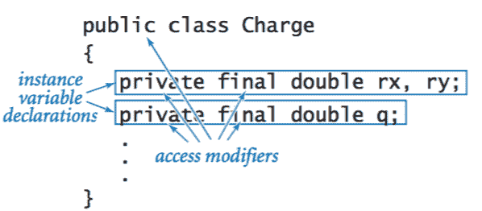
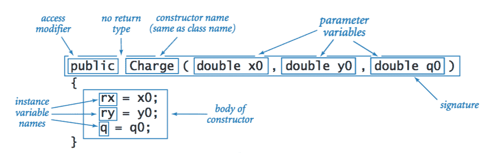
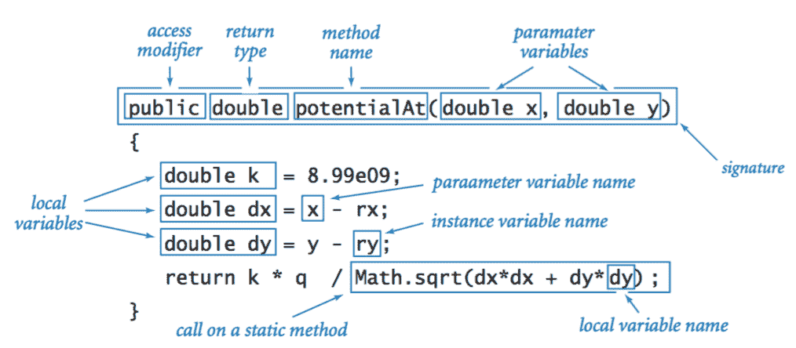
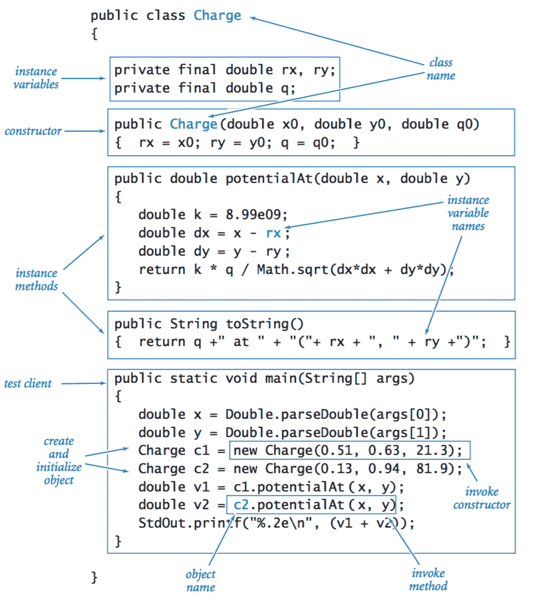
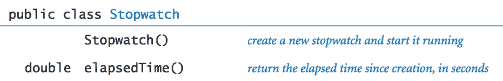

# 3.2   创建数据类型

> 原文：[`introcs.cs.princeton.edu/java/32class`](https://introcs.cs.princeton.edu/java/32class)

在本节中，我们介绍了使我们能够创建用户定义数据类型的 Java 机制。我们考虑了一系列示例，从带电粒子和复数到乌龟图形和股票账户。

## 数据类型的基本元素。

 为了说明这个过程，我们在 Charge.java 中定义了一个用于带电粒子的数据类型。[库仑定律](https://en.wikipedia.org/wiki/Coulomb%27s_law)告诉我们，由于给定带电粒子，点\((x, y)\)处的电势是\(V = kq /r\)，其中\(q\)是电荷值，\(r\)是点\((x, y)\)到电荷的距离，\(k = 8.99 \times 10⁹\)是静电常数。

+   *API。* 应用程序编程接口是与所有客户端的合同，因此是任何实现的起点。

    > 

+   *类。* 在 Java 中，您在`class`中实现数据类型。通常情况下，我们将数据类型的代码放在与类相同名称的文件中，后面跟着`.java`扩展名。

+   *访问修饰符。* 我们将类中的每个实例变量和方法指定为`public`（此实体可被客户端访问）或`private`（此实体不可被客户端访问）。`final`修饰符表示一旦初始化，变量的值将不会改变——其访问是只读的。

+   *实例变量。* 我们声明*实例变量*来表示数据类型的值，方式与声明局部变量相同，只是这些声明出现在类的第一条语句中，而不是在`main()`或任何其他方法中。对于`Charge`，我们使用三个`double`变量——两个用于描述电荷的位置，一个用于描述电荷量。

    > 

+   *构造函数。* 构造函数是创建对象并提供对该对象的引用的特殊方法。当客户端程序使用关键字`new`时，Java 会自动调用构造函数。每当客户端调用构造函数时，Java 会自动

    +   为对象分配内存

    +   调用构造函数代码来初始化实例变量。

    +   返回对新创建对象的引用

    `Charge`中的构造函数很典型：它使用客户端提供的值作为参数来初始化实例变量。

    > 

+   *实例方法。* 要实现实例方法，我们编写的代码与实现静态方法的代码完全相同。唯一的关键区别是实例方法可以对实例变量执行操作。

    > 

+   *方法内的变量。* 我们编写的 Java 代码来实现实例方法使用三种类型的变量。参数变量和局部变量是熟悉的。实例变量完全不同：它们保存类中对象的数据类型值。

    > 

    类中的每个对象都有一个值：实例方法中的代码引用了调用该方法的对象的值。例如，当我们写`c1.potentialAt(x, y)`时，`potentialAt()`中的代码是在引用`c1`的实例变量。

+   *测试客户端。* 每个类都可以定义自己的`main()`方法，我们保留用于单元测试。至少，测试客户端应该调用类中的每个构造函数和实例方法。

总之，在 Java 类中定义数据类型，需要实例变量、构造函数、实例方法和一个测试客户端。

> 

## 秒表。

秒表.java 实现了以下 API：

> 

这是一个简化版本的老式秒表。当你创建一个时，它就开始计时，你可以通过调用方法`elapsedTime()`来询问它已经运行了多长时间。

## 直方图。

 Histogram.java 是一种使用熟悉的绘图方式*直方图*来可视化数据的数据类型。为简单起见，我们假设数据由 0 到 *n*−1 之间的整数值序列组成。直方图计算每个值出现的次数，并为每个值绘制一个柱（高度与其频率成比例）。以下 API 描述了操作：

> 

## 海龟图形。

Turtle.java 是一个用于海龟图形的可变类型，我们可以命令海龟沿直线移动指定距离，或者旋转（逆时针）指定角度。

> 

这里有一些示例客户端：

+   *正多边形。* Ngon.java 接受一个命令行参数 *n* 并使用海龟图形绘制一个正 *n* 边形。通过将 *n* 取得足够大的值，我们可以得到一个对圆的良好近似。

+   *递归图形。* Koch.java 接受一个命令行参数 *n* 并绘制一个 *n* 阶的[Koch 曲线](https://en.wikipedia.org/wiki/Koch_snowflake)。0 阶的 Koch 曲线是一条线段。要形成一个 *n* 阶的 Koch 曲线：

    +   绘制一个 *n*−1 阶的 Koch 曲线

    +   逆时针旋转 60°

    +   绘制一个 *n*−1 阶的 Koch 曲线

    +   顺时针旋转 120°

    +   绘制一个 *n*−1 阶的 Koch 曲线

    +   逆时针旋转 60°

    +   绘制一个 *n*−1 阶的 Koch 曲线

    下面是 0、1、2 和 3 阶的 Koch 曲线。

    > |  |  |  |  |
    > | --- | --- | --- | --- |

+   *奇妙的螺线。*  螺线.java 接受一个整数 *n* 和一个衰减因子作为命令行参数，并指示海龟交替前进和转向，直到它绕自身旋转了 10 次。这产生了一个被称为[对数螺线](https://en.wikipedia.org/wiki/Logarithmic_spiral)的几何形状，它经常出现在自然界中。下面描绘了三个例子：鹦鹉螺壳的腔室、螺旋星系的臂和热带风暴中的云团。

    > |  |    |  |    |  |
    > | --- | --- | --- | --- | --- |
    > | 这张维基百科图片来自[用户 Chris 73](https://en.wikipedia.org/wiki/User:Chris_73)，并可通过[CC by-SA 3.0 许可证](https://creativecommons.org/licenses/by-sa/3.0/)获得。 |  | 照片：NASA 和 ESA   |  | 照片：NASA   |

+   *布朗运动。* 醉海龟.java 绘制了一个迷失方向的海龟所经过的路径，它交替前进和向*随机*方向转向。这个过程被称为[布朗运动](https://en.wikipedia.org/wiki/Brownian_motion)。醉海龟们.java 绘制了许多这样的海龟，它们都四处游荡。

## 复数。

复数是形式为 *x* + *iy* 的数，其中 *x* 和 *y* 是实数，*i* 是-1 的平方根。复数的基本运算是相加和相乘，如下所示：

+   *加法*: \((x_0+iy_0) + (x_1+iy_1) = (x_0+x_1) + i\,(y_0+y_1)\)

+   *乘法*: \((x_0 + iy_0) \cdot (x_1 + iy_1) = (x_0x_1 - y_0y_1) + i\,(y_0x_1 + x_0y_1)\)

+   *幅度*: \(\left | x + iy \right | = \sqrt{x² + y²}\)

+   *实部*: \(\operatorname{Re}(x + iy) = x\)

+   *虚部*: \( \operatorname{Im}(x + iy) = y\)

Complex.java 是一个不可变数据类型，实现了以下 API：

> 

这种数据类型引入了一些新功能。

+   *访问同一类型其他对象的值。* 实例方法 `plus()` 和 `times()` 需要访问两个对象中的值：作为参数传递的对象和用于调用方法的对象。如果我们用 `a.plus(b)` 调用方法，我们可以像往常一样使用名称 `re` 和 `im` 访问 `a` 的实例变量。但是，要访问 `b` 的实例变量，我们使用代码 `b.re` 和 `b.im`。

+   *创建和返回新对象。* 注意 `plus()` 和 `times()` 如何向客户端提供返回值：它们需要返回一个 `Complex` 值，因此它们分别计算所需的实部和虚部，用它们创建一个新对象，然后返回对该对象的引用。

+   *链接方法调用。* 注意 `main()` 如何将两个方法调用链接成一个紧凑的表达式 `z.times(z).plus(z0)`，对应于数学表达式 *z*² + *z*[0]。

+   *最终实例变量。* `Complex` 中的两个实例变量是 `final` 的，这意味着它们的值在创建 `Complex` 对象时设置，并且在该对象的生命周期内不会更改。

## 曼德勃罗集。

[曼德勃罗集](https://www.cs.princeton.edu/~wayne/mandel/mandel.html) 是一组具有许多迷人特性的复数。确定一个复数 \(z_0\) 是否在曼德勃罗集中的算法很简单：考虑复数序列 \(z_0, z_1, z_2, \ldots, z_t, \ldots,\) 其中 \(z_{i+1} = z_i² + z_0\)。例如，以下表格显示了与 \(z_0 = 1 + i\) 对应的序列的前几个条目：

> 

现在，如果序列 \( | z_i |\) 发散到无穷大，那么 \(z_0\) *不* 在曼德勃罗集中；如果序列有界，那么 \(z_0\) 在曼德勃罗集中。对于许多点，测试很简单；对于许多其他点，测试需要更多计算，如下表中的示例所示：

> 

为了可视化曼德勃罗集，我们在指定的正方形内定义一个均匀间隔的 *n*×*n* 像素网格，并在相应点属于曼德勃罗集时绘制黑色像素，不属于时绘制白色像素。

> 

但是我们如何确定一个复数是否属于曼德勃罗集？对于每个复数，Mandelbrot.java 计算其序列中的最多 255 个项。如果幅度超过 2，那么我们可以得出结论该复数不在集合中（因为已知该序列肯定会发散）。否则，我们得出结论该复数在集合中（知道我们的结论偶尔可能是错误的）。

## 商业数据处理。

StockAccount.java 实现了一个数据类型，可能被金融机构用来跟踪客户信息。

> 

#### 练习

1.  开发一个实现 Rectangle.java 的实现，该实现表示具有其左下角和右上角的 *x* 和 *y* 坐标的矩形。不要更改 API。

1.  实现一个支持加法、减法、乘法和除法的数据类型 Rational.java。

    > 

1.  编写一个实现以下 API 的数据类型 Interval.java：

    > 

    区间被定义为线上大于等于 `min` 且小于等于 `max` 的所有点的集合。特别地，`max` 小于 `min` 的区间为空。编写一个客户端，它是一个过滤器，接受一个浮点命令行参数 `x`，并打印所有包含 `x` 的标准输入中的区间（每个由一对双精度值定义）。

1.  编写一个实现以下 API 的数据类型 Point.java：

    > 

1.  修改 Complex.java 中的 `toString()` 方法，使复数以传统格式显示。例如，它应该将值 \(3-i\) 打印为 `3 - i` 而不是 `3.0 + -1.0i`，将值 3 打印为 `3` 而不是 `3.0 + 0.0i`，将值 \(3i\) 打印为 `3i` 而不是 `0.0 + 3.0i`。

1.  编写一个 `Complex` 客户端 RootsOfUnity.java，从命令行接受两个 `double` 值 *a* 和 *b* 以及一个整数 *n*，并打印 \(a + bi\) 的第 *n* 个根。

1.  对 Complex.java 实现以下添加：

    > 

    编写一个测试客户端来测试所有你的方法。

1.  假设你想要为 Complex.java 添加一个以 `double` 值作为参数的构造函数，并创建一个具有该值作为实部（没有虚部）的 `Complex` 数字。你写下以下代码：

    ```java
    public void Complex(double real) {
        re = real;
        im = 0.0;
    }

    ```

    但是语句 `Complex c = new Complex(1.0);` 却无法编译通过。为什么？

    *解决方案*：构造函数没有返回类型，甚至不是 `void`。这段代码定义了一个名为 `Complex()` 的方法，而不是构造函数。移除关键字 `void`。

#### 创意练习

1.  **电势可视化。** 编写一个程序 Potential.java，从标准输入中给定的值创建一个带电粒子数组（每个带电粒子由其 *x* 坐���、*y* 坐标和电荷值指定），并在单位正方形中生成电势的可视化。为此，在单位正方形中采样点。对于每个采样点，计算该点的电势（通过对每个带电粒子的电势求和），并绘制与电势成比例的灰度点。

    |  |          |  |
    | --- | --- | --- |

1.  **四元数。** 在 1843 年，威廉·哈密尔顿爵士发现了一种称为[四元数](http://en.wikipedia.org/wiki/Quaternion)的复数扩展。四元数将三维空间中的旋转概念扩展到四维空间。它们被用于计算机图形学、控制理论、信号处理和轨道力学等领域，例如用于航天器姿态控制系统的指令。与物理学中的 Pauli 自旋矩阵相关。创建一个数据类型 Quaternion.java 来表示四元数。包括四元数的加法、乘法、求逆、共轭和范数运算。

    一个四元数可以用实数四元组 \((a_0, a_1, a_2, a_3)\) 来表示，表示为 \(a_0 + a_1 i + a_2 j + a_3 k\)。其基本恒等式为 \(i² = j² = k² = ijk = -1\)。

    +   *大小*：\( \left \| a \right \| = \sqrt{a_0² + a_1² + a_2² + a_3²} \)

    +   *共轭*：\( a^* = (a_0, -a_1, -a_2, -a_3)\)

    +   *求逆*：\( a^{-1} = (a_0\,/\, \left \| a \right \|², -a_1\,/\, \left \| a \right \|², -a_2\,/\, \left \| a \right \|², -a_3\,/\, \left \| a \right \|²)\)

    +   *求和*：\( a + b = (a_0+b_0, a_1+b_1, a_2+b_2, a_3+b_3)\)

    +   *哈密顿积*：$$ \begin{align} a \times b \; = \; (& a_0b_0 - a_1b_1 - a_2b_2 - a_3b_3, \\ & a_0b_1 + a_1b_0 + a_2b_3 - a_3b_2, \\ & a_0b_2 - a_1b_3 + a_2b_0 + a_3b_1, \\ & a_0b_3 + a_1b_2 - a_2b_1 + a_3b_0) \end{align} $$

    +   *商*：\( a\,/\,b = a^{-1} \times b \)

1.  **龙曲线。** 编写一个程序 Dragon.java，读取一个命令行参数 N，并使用海龟图形绘制 N 阶龙曲线。龙曲线最初由三位 NASA 物理学家（约翰·E·海威、布鲁斯·A·班克斯和威廉·G·哈特）发现，后来由马丁·加德纳在《科学美国人》（1967 年 3 月和 4 月）和迈克尔·克莱顿在《侏罗纪公园》中推广。

    > |  |  |  |  |  |
    > | --- | --- | --- | --- | --- |
    > |  |  |  |  |  |

    这是一个使用两个相互递归函数的复杂程序。

    程序 SequentialDragon.java 是龙曲线的迭代版本。这是一个黑客的天堂。

1.  **希尔伯特曲线。** [填充空间曲线](http://en.wikipedia.org/wiki/Space-filling_curve) 是一个连续的曲线，在单位正方形中通过每一点。编写一个递归的 `Turtle` 客户端 Hilbert.java（或 SingleHilbert.java），生成这些递归模式，这些模式逼近数学家大卫·希尔伯特在 19 世纪末定义的填充空间曲线。

    |  |  |  |  |  |
    | --- | --- | --- | --- | --- |

1.  **高斯波岛。** 编写一个递归的 `Turtle` 客户端 GosperIsland.java，生成这些递归模式。

    |  |  |  |  |  |
    | --- | --- | --- | --- | --- |

1.  **使用牛顿法混沌。** 多项式 \(f(z) = z⁴ - 1\) 在 1, −1, *i*, 和 −*i* 处有 4 个根。我们可以在复平面上使用牛顿法找到这些根：\(z_{k+1} = z_k - f(z_k) \,/ \, f'(z_k)\)。这里 \(f(z) = z⁴ - 1\)，\(f'(z) = 4z³\)。该方法收敛到 4 个根中的一个，取决于起始点 \(z_0\)。编写一个程序 NewtonChaos.java，接受一个命令行参数 *n*，并创建一个以原点为中心、边长为 2 的正方形的 *n*×*n* 图像。根据相应复数收敛到的四个根中的哪一个，将每个像素着色为白色、红色、绿色或蓝色（如果经过 100 次迭代后仍未收敛，则为黑色）。

    > 

1.  **彩色曼德勃罗特图。** 创建一个包含 256 个整数三元组的文件，表示有趣的`Color`值，然后使用这些颜色而不是灰度值来绘制 ColorMandelbrot.java 中的每个像素。读取这些值以创建一个包含 256 个`Color`值的数组，然后使用`mand()`的返回值索引到该数组中。通过在集合的各个位置尝试不同的颜色选择，您可以产生令人惊叹的图像。参见 mandel.txt 以获取示例。

    > |  |           |  |
    > | --- | --- | --- |
    > | `-1.5 -1.0 2.0 2.0` |  | `0.10259 -0.641 0.0086 0.0086` |

1.  **朱利亚集。** 对于给定复数 *c*，*朱利亚集*是与曼德勃罗特函数相关的一组点。我们不是固定 *z* 并变化 *c*，而是固定 *c* 并变化 *z*。那些修改后的曼德勃罗特函数保持有界的点 *z* 属于朱利亚集；那些序列发散到无穷大的点 *z* 不属于该集合。所有感兴趣的点 *z* 都位于以原点为中心的 4x4 方框内。对于 *c* 的朱利亚集是连通的，当且仅当 *c* 在曼德勃罗特集中时！编写一个程序 ColorJulia.java，它接受两个命令行参数 *a* 和 *b*，并使用前面练习中描述的颜色表方法绘制 *c* = *a* + *bi* 的朱利亚集的彩色版本。

    > |  |           |  |
    > | --- | --- | --- |
    > | `-1.25 0.00` |  | `-0.75 0.10` |

#### 网页练习

1.  **IP 地址。** 创建一个用于 IPv4（互联网协议第 4 版）地址的数据类型。IP 地址是一个 32 位整数。

1.  **日期。** 创建一个表示日期的数据类型`Date`。您应该能够通过指定月、日和年来创建一个新的`Date`。它应该支持计算两个日期之间的天数、返回一天落在星期几的方法等。

1.  **定时炸弹。** UNIX 用一个有符号整数表示自 1970 年 1 月 1 日以来的秒数来表示日期。编写一个客户端程序来计算这个日期将发生的时间。在您的日期数据类型中添加一个静态方法`add(Date d, int days)`，返回日期 d 之后指定天数的新日期。请注意，一天有 86,400 秒。

1.  **量子位。** 在量子计算中，*量子位*扮演位的角色。它是一个复数 a + bi，使得|a + bi| = 1。一旦我们测量一个量子位，它就会以概率 a² 成为 1，以概率 b² 成为 0。任何后续的观察都将始终产生相同的值。实现一个数据类型`Qubit`，它具有一个构造函数`Qubit(a, b)`和一个布尔方法`observe`，根据规定的概率返回`true`或`false`。

1.  **生物节律。** *生物节��*是您身体的三个自然周期的伪科学概况：身体（23 天）、情绪（28 天）和智力（31 天）。编写一个程序，接受六个命令行输入 M、D、Y、m、d 和 y，其中 (M、D、Y) 是您的生日的月份（1-12）、日期（1-31）和年份（1900-2100），而 (m、d、y) 是今天的月份、日期和年份。然后根据公式：sin (2 π 年龄 / 周期长度) 在 -1.0 到 1.0 的范围内打印出您的生物节律。使用前面练习中创建的日期数据类型。

1.  **粒子。** 创建一个用于基本或复合粒子（电子、质子、夸克、光子、原子、分子）的数据类型。每个粒子应该有一个实例变量来存储其名称、质量、电荷和自旋（1/2 的倍数）。

1.  **夸克。** 夸克是已知的物质最小的基本构建块。创建一个用于夸克的数据类型。包括一个字段用于其类型（上夸克、下夸克、魅夸克、奇夸克、顶夸克或底夸克）和其颜色（红色、绿色或蓝色）。其电荷分别为 +2/3、-1/3、+2/3、-1/3、+2/3、-1/3。所有夸克的自旋都是 1/2。

1.  **生物节律.** 在一个为期 6 周的时间间隔内，使用海龟图形绘制你的生物节律。识别*临界日*，即你的节律从正向负转变的日子 - 根据生物节律理论，这是你最容易发生事故、不稳定和出错的时候。

1.  **Vector3.** 包括三维向量的法线向量运算，包括*叉乘*。两个向量的叉乘是另一个向量。a 叉乘 b = ||a|| ||b|| sin(theta) n，其中 theta 是 a 和 b 之间的角度，n 是垂直于 a 和 b 的单位法线向量。 (a[1], a[2], a[3]) 叉乘 (b[1], b[2], b[3]) = (a[2] b[3] - a[3] b[2], a[3] b[1] - a[1] b[3], a[1] b[2] - a[2] b[1])。注意 |a 叉乘 b| = 以 a 和 b 为边的平行四边形的面积。叉乘在力矩、角动量和向量算子旋度的定义中出现。

1.  **四维矢量.** 创建一个数据类型用于[四维矢量](http://en.wikipedia.org/wiki/Four-vector)。四维矢量是一个四维向量 (t, x, y, z)，受洛伦兹变换的约束。在狭义相对论中很有用。

1.  **欧几里德点.** 创建一个名为 `EuclideanPoint.java` 的数据类型，表示一个 d 维点。包括一个方法，使得 `p.distanceTo(q)` 返回点 p 和 q 之间的欧几里德距离。

1.  **矢量场.** [矢量场](http://en.wikipedia.org/wiki/Vector_field) 将一个向量与欧几里德空间中的每个点相关联。在物理学中广泛用于模拟运动物体的速度和方向，或者牛顿力的强度和方向。

1.  **饮料机.** 创建一个名为 `SodaMachine` 的数据类型，其中包括 `insertCoin()`、`getChange()`、`buy()` 等方法。

1.  **月份.** 编写一个数据类型 `Month`，表示一年中的十二个月之一。它应该包括月份名称、月份天数和诞生石的字段。

    | 月份 | 天数 | 诞生石 |
    | --- | --- | --- |
    | 一月 | 31 | 石榴石 |
    | 二月 | 28 | 紫水晶 |
    | 三月 | 31 | 海蓝宝石 |
    | 四月 | 30 | 钻石 |
    | 五月 | 31 | 翡翠 |
    | 六月 | 30 | 紫翠石 |
    | 七月 | 31 | 红宝石 |
    | 八月 | 31 | 橄榄石 |
    | 九月 | 30 | 蓝宝石 |
    | 十月 | 31 | 蛋白石 |
    | 十一月 | 30 | 黄玉 |
    | 十二月 | 31 | 蓝锆石 |

1.  **高斯乘法.** 使用仅 3 次浮点乘法（而不是 4 次）实现复数乘法。你可以使用多达 5 次浮点加法。 *答案*: 高斯给出了以下方法来计算 (a + bi)(c + di)。设 x1 = (a + b)(c + d)，x2 = ac，x3 = bd。那么乘积为 x + yi，其中 x = x2 - x3，y = x1 - x2 - x3。

1.  **张量.** 创建一个数据类型用于[张量](http://en.wikipedia.org/wiki/Tensor)。

1.  **联合国国家.** 为联合国国家创建一个名为 `Country` 的数据类型。包括 3 位联合国代码、3 个字母 ISO 缩写、国家名称和首都的字段。编写一个程序 Country.java，读取国家列表并将它们存储在类型为 `Country` 的数组中。使用方法 `String.split` 来帮助解析输入文件。

1.  **区号.** 为北美电话区号创建一个数据类型。包括区号、城市和州名以及两个字母的州缩写。或者为国际电话区号创建一个数据类型。包括区域、代码和国家的字段。

1.  **国会选区.** 为地点、县和国会选区创建一个数据类型。包括地点名称、县名、县代码、邮政编码、国会选区等字段。使用来自[1998 FIPS55-DC3 索引](http://www.itl.nist.gov/fipspubs/55new/nav-top-fr.htm)的数据集：宾夕法尼亚 (2MB) 或所有 50 个州加上哥伦比亚特区和 9 个外围地区 (30MB)。

1.  **纬度和经度。** 对于美国的纬度和经度，使用[TIGER 数据库](http://www.census.gov/geo/www/tiger/)或[www.bcca.org](http://www.bcca.org/misc/qiblih/latlong_us.html)或[地名数据库](http://geonames.usgs.gov/stategaz/index.html)。对于世界其他地区，请使用[earth-info](http://earth-info.nima.mil/gns/html/cntry_files.html)。

1.  **天文学**。有关小行星、流星和彗星的数据。

1.  **财富 1000 强公司。** 创建一个数据类型，用于财富 1000 强。包括公司名称和以百万美元计的销售收入字段。数据取自 2002 年 4 月 15 日《财富》杂志。注意：目前需要解析数据。

1.  **分子量。** 编写一个程序，用户输入一个分子 H2 O，程序计算其分子量。

1.  一些可能有用的数据文件：芳香疗法、营养信息、气象术语词汇表、精神疾病、15 种语言翻译的单词、表情符号词典、常见名字的含义、世界年鉴关于国家的事实。

1.  **学生记录。** 创建一个数据类型 Student.java 来表示初级计算机科学课程中的学生。每个学生记录对象应表示名字、姓氏、电子邮件地址和分组号。包括一个`toString()`方法，返回学生的字符串表示形式，以及一个`less()`方法，通过分组号比较两个学生。

1.  **阻抗。** 阻抗是从直流电路到交流电路的电阻的概括。在交流电路中，组件的*阻抗*测量其在给定频率ω下对电子流动的阻力。阻抗有两个组成部分：电阻和电抗。电路组件的*电阻* R 测量其在给定电压下对电子运动的阻力（对电子运动的摩擦）。电路组件的*电抗* X 测量其在电流和电压波动时存储和释放能量的能力（对电子运动的惯性）。

    在仅有电阻的电路中，电流与电压成正比。然而，对于电容器和电感器，电流和电压之间存在+- 90 度的“相位移”。这意味着当电压波达到最大值时，电流为 0，当电流达到最大值时，电压为 0。为了统一对电阻（R）、电感（L）和电容（C）的处理，方便起见，将阻抗视为复数 Z = R + iX。电感器的阻抗是 iwL，电容器的阻抗是 1/iwC。要确定串联电路元件的阻抗，只需将它们各自的阻抗相加即可。电气工程中的两个重要量是*阻抗的大小*和*相位角度*。大小是 RMS 电压与 RMS 电流的比值 - 它等于复阻抗的大小。*相位角度*是电压领先或滞后于电流的量 - 它是复阻抗的相位。程序 CircuitRLC.java 进行了涉及复数和串联电阻、电感和电容电路的阻抗的计算。

    练习：并联 RLC 电路。1/Z = 1/Z1 + 1/Z2 + ... 1/Zn。

    练习（针对对象）：重复使用阻抗而不是电阻的 RLC 电路的串并联网络

1.  **粒子在流体中的扩散。** 模拟流体中粒子的扩散。参见第 9.8 节中的 BrownianParticle.java。

1.  **电场线。** 迈克尔·法拉第引入了一种称为*电场线*的抽象概念来可视化电场。根据库仑定律，由点电荷 q[i]诱导的点处的电场为 E[i] = k q[i] / r²，方向指向 q[i]如果 q[i]为负，远离 q[i]如果为正。如果有一组 n 个点电荷，点处的电场是 n 个单个点电荷诱导的电场的*矢量和*。我们可以通过在 x 和 y 方向上求和分量来计算它。下图说明了两个相等正点电荷（左）和两个异号点电荷（右）的场线。第二种配置称为*电偶极*：电荷互相抵消，当您远离电荷时，电场迅速减弱。电偶极的例���可以在电荷分布不均匀的分子中找到。振荡的电偶极可用于产生电磁波以传输无线电和电视信号。

    |  |          |  |
    | --- | --- | --- |

    程序 FieldLines.java 绘制出每个电荷发出的 10 条电场线。（我们稍微取了些自由，因为传统上单位面积上的电场线条数应该与电场强度的大小成比例。）每条线从电荷周围的一个 1 像素圆圈开始，以十二等分角度开始。从点电荷 q[i]到点(x, y)处的电场由 E[i] = k q[i] / r²给出，其中 q[i]是电荷 i 的大小，r 是到它的径向距离。由几个电荷产生的电场是每个电场的矢量和，可以通过添加 x 和 y 分量来找到。计算电场强度后，我们沿着矢量场的方向移动并绘制一个点。我们重复这个过程，直到到达区域边界或另一个点电荷。下面的图示说明了几个相等大小的随机电荷的电势和电场线。

    |  |          |  |          |  |
    | --- | --- | --- | --- | --- |

1.  **彩虹色的科赫雪花。**

    *第 n 阶科赫雪花*由三个复制的阶数为 n 的科赫曲线组成。我们依次绘制这三条科赫曲线，但在它们之间顺时针旋转 120°。下面是阶数为 0、1、2 和 3 的科赫雪花。编写一个程序 KochRainbow.java，以连续的彩虹色谱从红色到紫色绘制科赫雪花。

    > |  |  |  |  |  |
    > | --- | --- | --- | --- | --- |

1.  **反向科赫雪花。** *反向科赫雪花*的生成方式与科赫雪花完全相同，只是顺时针和逆时针互换。编写一个名为`AntiKoch.java`的程序，接受一个命令行参数 N，并使用 Turtle 图形绘制阶数为 N 的反向科赫雪花。

    > |  |  |  |  |  |
    > | --- | --- | --- | --- | --- |

1.  **随机科赫雪花。** 生成一个*随机科赫雪花*，与科赫雪花完全相同，只是我们在每一步翻转硬币以生成顺时针和逆时针方向。 

1.  **海龟图形。**

    1.  *明科夫香肠。* (Sausage.java)

        |  |  |  |  |  |
        | --- | --- | --- | --- | --- |

    1.  *Cesaro 破碎的正方形。*

        |  |  |  |  |  |
        | --- | --- | --- | --- | --- |

1.  **更多海龟图形。** 编写一个程序来生成以下每个递归图案。

    1.  *莱维织物。* (Levy.java)

        |  |  |  |  |  |
        | --- | --- | --- | --- | --- |
        |  |  |  |  |  |

    1.  *Fudgeflake。*

        |  |  |  |  |  |
        | --- | --- | --- | --- | --- |
        |  |  |  |  |  |

1.  **海龟图形（困难）。** 编写一个程序来生成以下每个递归图案，而不需要抬起笔或重复跟踪同一线段。

    1.  *谢尔宾斯基箭头。*

        |  |  |  |  |  |
        | --- | --- | --- | --- | --- |

    1.  *谢尔宾斯基曲线。*

        |  |  |  |  |  |
        | --- | --- | --- | --- | --- |

1.  **曼德勃罗特轨迹。** 编写一个交互式程序 Trajectory.java，在复平面中绘制曼德勃罗特迭代中的点序列。如果用户点击(x, y)，则为 z = x + iy 绘制迭代序列。

1.  **更快的曼德勃罗特。** 通过直接执行计算而不是使用`Complex`来加速曼德勃罗特。进行周期性检查或[边界追踪](http://www.geocities.com/CapeCanaveral/5003/mandel.htm)以进一步改进。使用分而治之：选择矩形的 4 个角和几个随机点内部；如果它们都是相同颜色，就用该颜色着色整个矩形；否则将其分成 4 个矩形并递归。

1.  **随机漫步者。** 编写一个数据类型`RandomWalker`，模拟平面上从原点开始的随机漫步者的运动，每一步都是随机的（左、右、上或下）。包括一个移动随机漫步者一步的方法`step()`和一个返回随机漫步者距离原点的距离的方法`distance()`。使用这个数据类型来提出一个关于随机漫步者在 N 步之后离原点多远（作为 N 的函数）的假设。（另见练习 1.x。）

1.  **大有理数。** 创建一个数据类型 BigRational.java 用于正有理数，其中分子和分母可以是任意大的。*提示*：使用[java.math.BigInteger](https://docs.oracle.com/javase/8/docs/api/java/math/BigInteger.html)

1.  **豪华海龟图形。** 以各种方式扩展 Turtle。创建一个添加颜色等功能的`DeluxeTurtle`。添加一个支持错误检查的版本。例如，如果海龟超出指定边界，则抛出`TurtleOutOfBounds`异常。

1.  编写一个程序 FourChargeClient.java，接受一个`double`命令行参数`r`，创建四个`Charge`对象，每个对象距离屏幕中心(0.5, 0.5)的距离为`r`，并打印由这四个电荷组合在位置(0.25, 0.5)处产生的电势。所有四个电荷应具有相同的单位电荷。

1.  当执行程序 Bug1.java 时为什么会创建一个`java.lang.NullPointerException`？

    ```java
    public class Bug1 { 
       private String s;
       public void Bug1()       { s = "hello"; }
       public String toString() { return s.toUpperCase(); }
       public static void main(String[] args) {
          Bug1 x = new Bug1();
          StdOut.println(x);
       }
    }

    ```

    *答案:* 程序员可能打算让无参数构造函数将字符串设置为`hello`。然而，它有一个返回类型(`void`)，所以它是一个普通的实例方法，而不是构造函数。它只是碰巧与类名相同。

1.  当执行程序 Bug2.java 时为什么会创建一个`java.lang.NullPointerException`？

1.  实现一个数据类型`Die`用于掷一个公平的骰子，比如有 6 个面。包括一个修改器方法`roll()`和一个访问器方法`value`。

1.  实现一个可变数据类型`LFSR`用于线性反馈移位寄存器。

1.  实现一个可变数据类型`Odometer`。

1.  **复数三角函数。** 在 Complex.java 中添加支持��数的三角函数和指数函数。

    +   \(\exp(a + ib) = e^a \cos(b) + i \, e^a \sin(b)\)

    +   \(\sin(a + ib) = \sin(a) \cosh(b) + i \cos(a) \sinh(b)\)

    +   \(\cos(a + ib) = \cos(a) \cosh(b) - i \sin(a) \sinh(b)\)

    +   \(\tan(a + ib) = \sin(a + ib) \;/\; \cos(a + ib)\)

1.  实现一个数据类型`VotingMachine`用于计票。包括修改器方法`voteRepublican()`，`voteDemocrat()`和`voteIndependent()`。包括一个访问器方法`getCount()`来检索总票数。

1.  当您尝试编译和执行以下代码片段时会发生什么？

    ```java
    Student x;
    StdOut.println(x);

    ```

    *答案:* 它抱怨`x`可能未初始化，并且无法编译。

1.  当您尝试编译和执行以下代码片段时会发生什么？

    ```java
    Student[] students = new Student[10];
    StdOut.println(students[5]);

    ```

    *答案:* 它编译并打印出`null`。

1.  以下代码片段有什么问题？

    ```java
    int n = 17;
    Dog[] dogs = new Dog[n];
    for (int i = 0; i < n; i++) {
       dogs[i].bark();
       dogs[i].eat();
    }

    ```

    *答案:* 它产生一个`NullPointerException`，因为我们忘记使用`new`来创建每个单独的`Dog`对象。要纠正，添加以下循环在数组初始化语句之后。

    ```java
    for (int i = 0; i < n; i++)
       dogs[i] = new Dog();

    ```

1.  以下代码片段打印什么？

    ```java
    Complex c = new Complex(2.0, 0.0);
    StdOut.println(c);
    StdOut.println(c.mul(c).mul(c).mul(c));
    StdOut.println(c);

    ```

1.  以下交换 Student 对象 x 和 y 的代码片段有什么问题？

    ```java
    Student swap = new Student();
    swap = x;
    x = y;
    y = swap;

    ```

    *答案:* 首先，数据类型`Student`没有无参数构造函数。如果有的话，那么它在技术上是正确的，但`new Student()`这行是多余且浪费的。它为一个新的学生对象分配内存空间，将`swap`设置为该内存地址，然后立即将`swap`设置为`x`的内存地址。分配的内存不再可访问。以下版本是正确的。

    ```java
    Student swap = x;
    x = y;
    y = swap;

    ```

1.  找到使 Mandelbrot 更新公式收敛（z0 = 1/2 + 0i）、周期为 1 循环（z0 = -2 + 0i）、周期为 2 循环（z0 = -1 + 0i）或保持有界而不收敛（z0 = -3/2 + 0i）的输入。

1.  **Point3D。** 创建一个用于三维空间中点的数据类型。包括一个接受三个实数坐标 x、y 和 z 的构造函数。包括计算欧几里得距离、欧几里得距离平方和 L1 距离的方法`distance`、`distanceSquared`和`distanceL1`。

1.  创建一个数据类型 PhoneNumber.java，表示美国电话号码。构造函数应该接受三个字符串参数，区号（3 个十进制数字）、交换机号（3 个十进制数字）和分机号（4 个十进制数字）。包括一个`toString`方法，打印出形式为 (800) 867-5309 的电话号码。包括一个方法，使得`p.equals(q)`返回`true`，如果电话号码 p 和 q 相同，则返回`false`。

1.  重新实现 PhoneNumber.java，但使用三个整数字段来实现。构造函数接受三个整数参数。评论这种方法相对于字符串表示的优缺点。

    *答案*：在时间和内存上更有效率。在构造函数和`toString`方法中处理前导 0 的正确性更加麻烦。

1.  编写一个程序来绘制*均匀场*的场线。在垂直列中排列 N 个等间距带电粒子，带电量为 e，并在另一侧排列 N 个带电量为 -e 的粒子，使得一侧的每个电荷与另一侧对应的电荷对齐。这模拟了平行板电容器内的电场。关于结果电场，你能说些什么？A. 几乎均匀。

1.  **等势面。** 一个*等势面*是所有具有相同电势 V 的点的集合。给定一组 N 个点电荷，通过绘制等势面（又称等势线图），可以直观地可视化电势。程序 Equipotential.java 通过计算每个网格点的电势并检查电势是否在 5V 的倍数的像素范围内来绘制每 5V 画一条线。由于电场 E 衡量了电势的变化量，E * eps 是电势在 1 像素距离内变化的范围。它依赖于辅助程序 DeluxeCharge.java。

    |  |                |  |
    | --- | --- | --- |

    同时绘制场线和等势线也很有趣。场线始终垂直于等势线。

1.  **调色板。** 使用不同的调色板创建曼德勃罗特集和 Julia 集。例如，这种方案是由 Hubert Grassmann 提出的。

    ```java
    Color[] colors = new Color[ITERS];
    for (int t = 0; t < ITERS; t++) {
        // or some other primes
        int r = 13*(256-t) % 256;
        int g =  7*(256-t) % 256;
        int b = 11*(256-t) % 256;
        colors[t] = new Color(r, g, b);
    }

    ```

    并生成一个引人注目的 Julia 集图像

    > 
