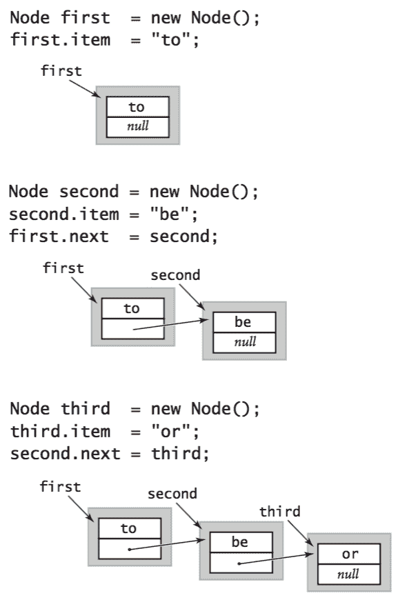

# 4.3   栈和队列

> 原文：[`introcs.cs.princeton.edu/java/43stack`](https://introcs.cs.princeton.edu/java/43stack)

在本节中，我们介绍了两种密切相关的数据类型，用于操作任意大的对象集合：*栈*和*队列*。栈和队列是*集合*概念的特殊情况。每个都由四个操作特征化：*创建*集合，*插入*项目，*移除*项目，以及测试集合是否*为空*。

## 栈。

*栈*是基于后进先出（LIFO）策略的集合。按照传统，我们将栈的*插入*方法命名为`push()`，将栈的*移除*操作命名为`pop()`。我们还包括一个方法来测试栈是否为空，如下所示的 API：

> 

## 栈的数组实现。

使用数组表示栈是一个自然的想法。特别是，我们维护一个实例变量`n`，用于存储栈中的项目数量，以及一个数组`items[]`，用于存储`n`个项目，其中最近插入的项目在`items[n-1]`中，最早插入的项目在`items[0]`中。这种策略允许我们在末尾添加和移除项目而无需移动栈中的其他项目。

+   *固定长度数组实现的字符串栈。*ArrayStackOfStrings.java 实现了这种方法，用于指定构造函数参数的字符串栈的最大容量。要移除一个项目，我们减少`n`然后返回`a[n]`；要插入一个新项目，我们将`a[n]`设置为新项目，然后增加`n`。

    > 

+   *调整大小的字符串栈数组实现。*ResizingArrayStackOfStrings.java 是 ArrayStackOfStrings.java 的一个版本，它动态调整数组`items[]`的长度，以便足够大以容纳所有项目，但不会浪费过多空间。首先，在`push()`中，我们检查是否有空间放置新项目；如果没有，我们创建一个新数组，其长度是旧数组的*两倍*，并将项目从旧数组复制到新数组。类似地，在`pop()`中，我们检查数组是否过大，如果是，则*减半*其长度。

    > 

    这种加倍和减半的策略确保栈永远不会溢出，也永远不会少于四分之一满。

+   *调整大小的通用栈数组实现。*ResizingArrayStack.java 使用调整大小的数组实现了一个通用栈。出于技术原因，在为泛型分配数组时需要进行强制转换。

## 链表。

*单链表*由一系列*节点*组成，每个节点包含对其后继节点的引用（或*链接*）。按照惯例，最后一个节点中的链接为*null*，表示终止列表。通过面向对象编程，实现链表并不困难。我们定义了一个递归性质的节点抽象类：

```java
class Node { 
   String item; 
   Node next; 
} 

```

 一个`Node`对象有两个实例变量：一个`String`和一个`Node`。在这个例子中，`String`是任何我们想要用链表结构化的数据的占位符（我们可以使用任何一组实例变量）；类型为`Node`的实例变量表征了数据结构的链式特性。

+   *链接在一起的链表。*例如，要构建一个包含项目`"to"`、`"be"`和`"or"`的链表，我们为每个项目创建一个`Node`：

    > 

+   *插入。*假设您想要将新节点插入到链表中。最容易这样做的地方是在列表的开头。例如，要在给定链表的开头插入字符串`not`，其第一个节点为`first`，我们将`first`保存在临时变量`oldFirst`中，为`first`分配一个新的`Node`，将其`item`字段分配给`not`，将其`next`字段分配给`oldFirst`。

    > 

+   *移除。*���设您想要从列表中移除第一个节点。这个操作甚至更容易：只需将`first`赋值为`first.next`。

    > 

+   *遍历。*为了检查链表中的每个项目，我们初始化一个循环索引变量`x`，它引用链表的第一个`Node`。然后，我们通过访问`x.item`找到与`x`关联的项目的值，然后更新`x`以引用链表中的下一个`Node`，将其赋值为`x.next`的值，并重复此过程，直到`x`为`null`（表示我们已经到达链表的末尾）。这个过程被称为*遍历*列表，并在这段代码片段中简洁地表达：

    ```java
    for (Node x = first; x != null; x = x.next) 
        StdOut.println(x.item);

    ```

    > 

## 使用链表实现栈。

使用链表表示栈是一个自然的想法。特别是，我们维护一个实例变量`first`，它存储对最近插入的项目的引用。这个策略允许我们在链表的开头添加和移除项目，而无需访问链表中任何其他项目的链接。

+   *字符串栈的链表实现。*LinkedStackOfStrings.java 使用链表来实现字符串栈。该实现基于我们一直在使用的*嵌套类*`Node`。Java 允许我们以这种自然的方式在类实现中定义和使用其他类。我们将嵌套类指定为`private`，因为客户端不需要知道链表的任何细节。

    > 

+   *泛型栈的链表实现。*Stack.java 使用单链表实现了一个泛型栈。

## 队列。

*队列*支持使用先进先出（FIFO）原则的插入和移除操作。按照惯例，我们将队列的插入操作命名为*enqueue*，移除操作命名为*dequeue*，如下所示的 API：

> 

+   *使用链表实现队列。*Queue.java 使用链表实现了一个字符串的 FIFO 队列。与`Stack`类似，我们维护对队列中最近添加的`Node`的引用`first`。为了效率，我们还维护对队列中最近添加的`Node`的引用`last`。

    > 

+   *调整大小的数组实现队列。*ResizingArrayQueue.java 使用调整大小的数组实现了一个队列。它类似于 ResizingArrayStack.java，但更棘手，因为我们需要从数组的两端添加和移除项目。

    > 

### 泛型。

我们已经开发了允许我们构建特定类型的堆栈的堆栈实现，比如`String`。Java 中的一种特定机制，称为*泛型类型*，使我们能够构建由客户端代码指定类型的对象集合。

+   *实现一个通用集合。* 要实现一个通用集合，我们在尖括号中指定一个*类型参数*，比如`Item`，并在我们的实现中使用该类型参数而不是特定类型。例如，Stack.java 是 LinkedStackOfStrings.java 的通用版本。

+   *使用通用集合。* 要使用通用集合，客户端必须在创建栈时指定*类型参数*：

    ```java
    Stack<Integer> stack = new Stack<Integer>();

    ```

### 自动装箱。

我们设计我们的栈是*通用*的，因此它们可以存���任何类型的对象。Java 语言提供的*自动装箱*和*拆箱*功能使我们能够重用*通用*代码与原始类型。Java 提供了称为*包装类型*的内置对象类型，每个原始类型对应一个：[Boolean](https://docs.oracle.com/javase/8/docs/api/java/lang/Boolean.html)、[Integer](https://docs.oracle.com/javase/8/docs/api/java/lang/Integer.html)、[Double](https://docs.oracle.com/javase/8/docs/api/java/lang/Double.html)、[Character](https://docs.oracle.com/javase/8/docs/api/java/lang/Character.html)等。Java 自动在这些引用类型和相应的原始类型之间进行转换，以便我们可以编写如下代码：

```java
Stack<Integer> stack = new Stack<Integer>();
stack.push(17);            // autoboxing  (int -> Integer)
int a = stack.pop();       // unboxing    (Integer -> int)

```

## 迭代。

有时客户端需要逐个访问集合中的所有项目，而不删除它们。为了保持封装性，我们不希望向客户端透露队列（数组或链表）的内部表示。为了适应这种设计模式，Java 提供了*foreach*语句。您应该将以下代码片段中的`for`语句解释为*对于集合中的每个字符串 s，打印 s*。

```java
Stack collection = new Stack<string>();
...
for (String s : stack)
    StdOut.println(s);</string> 
```

以这种方式支持迭代的集合的实现需要实现 Java 的[java.util.Iterator](https://docs.oracle.com/javase/8/docs/api/java/util/Iterator.html)和[java.util.Iterable](https://docs.oracle.com/javase/8/docs/api/java/lang/Iterable.html)接口。有关详细信息，请参阅教科书。

## 栈和队列应用。

栈和队列有许多有用的应用。

+   *算术表达式求值。* 栈的一个重要应用是在*解析*中。例如，编译器必须解析使用*中缀表示法*编写的算术表达式。例如，以下中缀表达式求值为 212。

    ```java
    ( 2 + ( ( 3 + 4 ) * ( 5 * 6 ) ) )

    ```

    Evaluate.java 评估一个完全括号化的算术表达式。

+   *函数调用抽象。* 大多数程序隐式使用栈，因为它们支持实现函数调用的一种自然方式，如下所示：在函数执行的任何时候，将其*状态*定义为所有变量的值*和*指向下一个要执行的指令的指针。实现函数调用抽象的自然方式是使用栈。要调用函数，将状态推送到栈上。要从函数调用返回，从栈中弹出状态以将所有变量恢复为函数调用前的值，并在下一个要执行的指令处恢复执行。

+   *M/M/1 队列。* 最重要的排队模型之一被称为*M*/*M*/1 队列，已被证明可以准确地模拟许多现实情况。它具有三个特性：

    +   有一个服务器—一个 FIFO 队列。

    +   到达队列的间隔时间服从每分钟率为λ的指数分布。

    +   非空队列的服务时间服从每分钟率为μ的指数分布。

    MM1Queue.java 模拟一个*M*/*M*/1 队列，并绘制等待时间的直方图。

+   *负载平衡。*LoadBalance.java 模拟将*n*个项目分配给一组*m*个服务器的过程。对于每个项目，它选择*s*个服务器的样本，并将项目分配给当前项目最少的服务器。

#### 练习

1.  在 ArrayStackOfStrings.java 中添加一个`isFull()`方法。

1.  编写一个过滤器 Reverse.java，从标准输入逐个读取字符串，并以相反顺序打印到标准输出。

1.  编写一个栈客户端 Parentheses.java，从标准输入中读取一串括号、方括号和大括号，使用栈确定它们是否平衡。例如，你的程序应该对`[()]{}{[()()]()}`打印`true`，对`[(])`打印`false`。

1.  当`n`为 50 时，以下代码片段会打印什么？给出当给定正整数*n*时，代码片段的高级描述。

    ```java
    Stack stack = new Stack<integer>();
    while (n > 0) {
        stack.push(n % 2);
        n /= 2;
    }
    while (!stack.isEmpty())
         StdOut.print(stack.pop());
    StdOut.println();</integer> 
    ```

    *解决方案*：打印`n`的二进制表示（当 n 为 50 时为`110010`）。

1.  以下代码片段对队列`queue`做了什么？

    ```java
    Stack stack = new Stack<string>();
    while (!queue.isEmpty())
       stack.push(queue.dequeue());
    while (!stack.isEmpty())
       queue.enqueue(stack.pop());</string> 
    ```

    *解决方案*：颠倒队列中字符串的顺序。

1.  为 Stack.java 添加一个名为`peek()`的方法，该方法返回栈中最近插入的元素（不移除）。

1.  为 Queue.java 和 Stack.java 都添加一个名为`size()`的方法，该方法返回集合中的项目数。

1.  编写一个过滤器 InfixToPostfix.java，将中缀算术表达式转换为后缀表达式。

1.  编写一个程序 EvaluatePostfix.java，从标准输入中获取后缀表达式，对其进行评估，并打印值。（将上一个练习的程序输出导入到此程序中，可实现与 Evaluate.java 相同的行为。）

1.  开发一个数据类型 ResizingArrayQueueOfStrings.java，以固定长度数组实现一个队列，使得所有操作都需要常数时间。

1.  修改 MM1Queue.java 以创建一个程序 MD1Queue.java，模拟一个服务时间固定（确定性）为速率μ的队列。验证该模型的 Little 定律。

1.  开发一个类 StackOfInts.java，使用链表表示（但没有泛型）来实现一个整数栈。编写一个客户端，比较你的实现与`Stack<Integer>`的性能，以确定在你的系统上由于自动装箱和拆箱而产生的性能损失���

#### 链表练习

1.  假设`x`是一个链表节点。以下代码片段的效果是什么？

    ```java
    x.next = x.next.next;

    ```

    *解决方案*：从列表中删除紧随`x`之后的节点。

1.  编写一个名为`delete()`的方法，接受链表中的第一个节点和一个`int`参数`k`，如果存在，则删除链表中的第`k`个节点。

    *解决方案*：

    ```java
    // we assume that first is a reference to the first Node in the list
    public void delete(int k) {
        if (k <= 0) throw new RuntimeException("Invalid value of k");

        // degenerate case - empty linked list
        if (first == null) return;

        // special case - removing the first node
        if (k == 1) {
            first = first.next;
            return;
        }

        // general case, make temp point to the (k-1)st node
        Node temp = first;
        for (int i = 2; i < k; i++) {
            temp = temp.next;
            if (temp == null) return;   // list has < k nodes
        }

        if (temp.next == null) return;  // list has < k nodes

        // change temp.next to skip kth node
        temp.next = temp.next.next;
    }

    ```

1.  假设`x`是一个链表节点。以下代码片段的效果是什么？

    ```java
    t.next = x.next;
    x.next = t;     

    ```

    *解决方案*：在节点`x`之后立即插入节点`t`。

1.  为什么以下代码片段的效果与前一个问题不同？

    ```java
    x.next = t;
    t.next = x.next;

    ```

    *解决方案*：当需要更新`t.next`时，`x.next`不再是原始紧随`x`的节点，而是`t`本身！

#### 创意练习

1.  **约瑟夫问题。** 在古代的约瑟夫问题中，*n*个人处于困境，并同意采取以下策略来减少人口。他们排成一个圆圈（位置编号从 0 到*n*−1），沿着圆圈前进，每隔 m 个人淘汰一个，直到只剩下一个人。传说中，约瑟夫找到了一个位置可以避免被淘汰。编写一个`Queue`客户端 Josephus.java，接受两个整数命令行参数*m*和*n*，并打印人们被淘汰的顺序（从而向约瑟夫展示在圆圈中应该坐在哪里）。

1.  **拓扑排序。** 您需要对服务器上编号为 0 到 n-1 的 n 个作业的顺序进行排序。有些作业必须在其他作业开始之前完成。编写一个程序 TopologicalSorter.java，它接受一个命令行参数 n 和一个有序对作业（i，j）的标准输入序列，然后打印一个整数序列，以便对于输入中的每对（i，j），作业 i 出现在作业 j 之前。首先，从输入中为每个作业构建（1）必须跟随它的作业队列和（2）其*入度*（必须在其之前的作业数）。然后，构建一个所有入度为 0 的节点的队列，并重复删除任何入度为 0 的作业，保持所有数据。这个过程有许多应用。例如，您可以用它来模拟专业课程的先修课程，以便找到一系列要修的课程，以便毕业。

1.  **堆栈的复制构造函数。** 为`Stack.java`的链表实现创建一个新的构造函数，使得`Stack<String> t = new Stack<String>(s)`使`t`引用`Stack s`的一个新的独立副本。您应该能够从`s`或`t`中推送和弹出，而不会影响另一个。

    *递归解决方案*: 为`Node`创建一个复制构造函数，并使用它来创建新的堆栈。

    ```java
    public Node(Node x) {
        item = x.item;
        if (x.next != null)
            next = new Node(x.next);
    }

    public Stack(Stack s) {
        first = new Node(s.first);
    }

    ```

    *非递归解决方案*（未经测试）：

    ```java
    public Node(Node x, Node next) {
        this.x = x;
        this.next = next;
    }

    public Stack(Stack s) {
       if (s.first != null) {
          first = new Node(s.first.value, s.first.next) {
          for (Node x = first; x.next != null; x = x.next)
             x.next = new Node(x.next.value, x.next.next);
       }
    }

    ```

1.  **引用。** 开发一个实现以下 API 的数据类型 Quote.java：为此，定义一个嵌套类`Card`，它保存引语的一个单词，并链接到引语中的下一个单词：

    ```java
    private class Card {
        private String word;
        private Card next;

        public Card(String word) {
            this.word = word;
            this.next = null;
        }
    }

    ```

1.  **循环引用。** 重复上一个练习，但使用*循环链表*。在循环链表中，每个节点指向其后继节点，而列表中的最后一个节点指向第一个节点（而不是 null，如标准的以 null 结尾的链表）。

    *解决方案*: CircularQuote.java

1.  **逆转链表（迭代）。** 编写一个非递归函数，以链表中的第一个`Node`作为参数，并逆转链表，返回结果中的第一个`Node`。

    *解决方案*: 为了实现这一点，我们在链表中保持对三个连续节点的引用，`reverse`、`first`和`second`。在每次迭代中，我们从原始链表中提取节点`first`，并将其插入到逆转后的列表的开头。我们保持`first`是原始列表剩余部分的第一个节点，`second`是原始列表剩余部分的第二个节点，`reverse`是结果逆转列表的第一个节点。

    

    ```java
    public static Node reverse(Node list) {
        if (first == null || first.next == null) return first;
        Node first   = list;
        Node reverse = null;
        while (first != null) {
            Node second = first.next;
            first.next  = reverse;
            reverse     = first;
            first       = second;
        }
        return reverse;
    }

    ```

1.  **逆转链表（递归）。** 编写一个递归函数，以链表中的第一个`Node`作为参数，并逆转链表，返回结果中的第一个`Node`。

    *解决方案*: 假设链表有 n 个元素，我们递归地颠倒最后 n-1 个元素，然后将第一个元素附加到末尾。

    ```java
    public Node reverse(Node first) {
        if (first == null || first.next == null) return first;
        Node second = first.next;
        Node rest = reverse(second);
        second.next = first;
        first.next  = null;
        return rest;
    }

    ```

1.  **列出文件。** 一个文件夹是文件和文件夹的列表。编写一个程序 Directory.java，它以文件夹的名称作为命令行参数，并打印该文件夹中包含的所有文件，每个文件夹的内容递归列出（缩进）在该文件夹的名称下面。

#### 网络练习

1.  编写一个递归函数，以队列作为输入，并重新排列队列，使其顺序颠倒。提示：`dequeue()`第一个元素，递归地颠倒队列，然后将第一个元素入队。

1.  为`Stack`添加一个方法`Item[] multiPop(int k)`，从堆栈中弹出 k 个元素，并将它们作为对象数组返回。

1.  为`Queue`添加一个方法`Item[] toArray()`，将队列中的所有 N 个元素作为长度为 N 的数组返回。

1.  以下代码片段做什么？

    ```java
    IntQueue q = new IntQueue();
    q.enqueue(0);
    q.enqueue(1);
    for (int i = 0; i < 10; i++) {
        int a = q.dequeue();
        int b = q.dequeue();
        q.enqueue(b);
        q.enqueue(a + b);
        System.out.println(a);
    }

    ```

    *斐波那契*

1.  在文字处理器中，您会选择哪种数据类型来实现“撤销”功能？

1.  假设您有一个大小为 N 的单个数组，并希望实现两个堆栈，以便在两个堆栈上的元素总数为 N+1 之前不会溢出。您将如何操作？

1.  假设您在`StackList`的链表实现中使用以下代码实现了`push`。错误在哪里？

    ```java
    public void push(Object value) {
       Node second = first;
       Node first = new Node();
       first.value = value;
       first.next = second;
    }

    ```

    *解决方案:* 通过重新声明`first`，您创建了一个名为`first`的新局部变量，它与名为`first`的实例变量不同。

1.  **使用一个队列实现堆栈。** 展示如何使用一个队列实现堆栈。*提示:* 要删除一个项目，逐个获取队列中的所有元素，并将它们放在末尾，除了最后一个应删除并返回。

1.  **使用堆栈列出文件。** 编写一个程序，将一个目录的名称作为命令行参数，并打印出该目录及其子目录中包含的所有文件。同时打印出每个文件的文件大小（以字节为单位）。使用堆栈而不是队列。使用递归重复，并将程序命名为 DirectoryR.java。修改 DirectoryR.java，以便打印出每个子目录及其总大小。目录的大小等于其包含的所有文件或其子目录包含的所有文件的总和。

1.  **堆栈 + 最大值。** 创建一个数据结构，有效支持堆栈操作（弹出和推入），并返回最大元素。假设元素是整数或实数，以便您可以比较它们。*提示:* 使用两个堆栈，一个用于存储所有元素，另一个用于存储最大值。

1.  **标签系统。** 编写一个程序，从命令行读取一个二进制字符串，并应用以下（00, 1101）标签系统：如果第一个位为 0，则删除前三位并追加 00；如果第一个位为 1，则删除前三位并追加 1101。只要字符串至少有 3 位，就重复此过程。尝试确定以下输入是否会停止或进入无限循环：10010、100100100100100100。使用队列。

1.  **整数集合。** 创建一个表示 0 到 n-1 之间的整数集合（无重复项）的数据类型。支持 add(i)、exists(i)、remove(i)、size()、intersect、difference、symmetricDifference、union、isSubset、isSuperSet 和 isDisjointFrom。

1.  **为书编制索引。** 编写一个程序，从标准输入读取文本文件，并编制一个按字母顺序排列的索引，显示哪些单词出现在哪些行，如以下输入所示。忽略大小写和标点符号。类似于 FrequencyCount，但对于每个单词，维护一个出现位置的列表。

1.  **调整大小数组实现堆栈的复制构造函数。** 在 ArrayStackOfStrings.java 中添加一个复制构造函数

1.  **重新排序链表。** 给定包含 2n 个节点的单链表 x1 -> x2 -> ... -> x_2n，重新排列节点为 x1 -> x2n -> x2 -> x_2n-1 -> x3 -> .... *提示:* 将链表分成两半；颠倒第二个链表中节点的顺序；将两个列表合并在一起。
