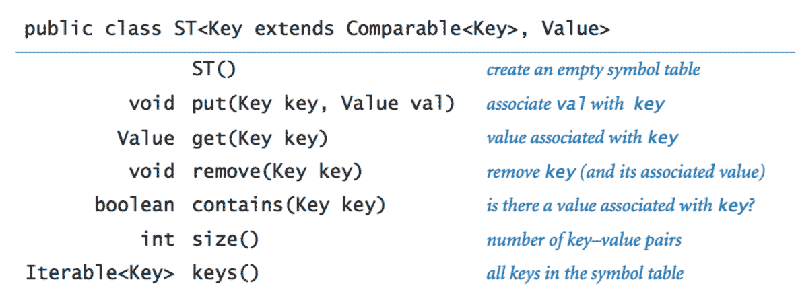
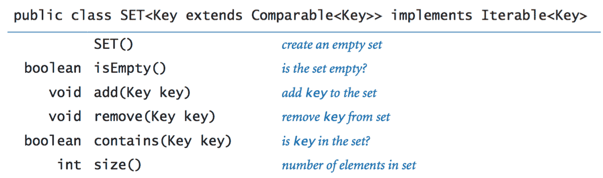

# 4.4   符号表

> 原文：[`introcs.cs.princeton.edu/java/44st`](https://introcs.cs.princeton.edu/java/44st)

*符号表*是一种数据类型，我们用它来将*值*与*键*关联起来。客户端可以通过指定键-值对将条目存储（*put*）到符号表中，然后可以检索（*get*）与特定键对应的值。

## API。

符号表是一组键-值对。我们为键使用通用类型`Key`，为值使用通用类型`Value`。

> 

此 API 反映了几个设计决策：

+   *不可变键。* 我们假设键在符号表中不会改变其值。

+   *替换旧值策略。* 如果将一个已经将另一个值与给定键关联的键-值对插入符号表中，我们采用新值替换旧值的约定。

+   *未找到。* 如果指定的键没有关联的值，则方法`get()`返回`null`。

+   *空键和空值。* 客户端不允许使用`null`作为键或值。这个约定使我们能够实现`contains()`如下：

    ```java
    public boolean contains(Key key) {
        return get(key) != null;
    } 

    ```

+   *移除。* 我们还在 API 中包含了一个方法，用于从符号表中移除一个键（及其关联的值），因为许多应用程序需要这样的方法。

+   *遍历键-值对。* `keys()`方法为客户端提供了一种遍历数据结构中键-值对的方法。

    ```java
    ST st = new ST<string double="">();
    ...
    for (String key : st.keys())
        StdOut.println(key + " " + st.get(key));</string> 
    ```

+   *可哈希键。* Java 包括对符号表实现的直接语言和系统支持。每个类都继承了一个`equals()`方法（我们可以用它来测试两个键是否相同）和一个`hashCode()`方法（稍后我们将对其进行检查）。

+   *可比较键。* 在许多应用程序中，键具有自然顺序并实现了`Comparable`接口。在这种情况下，我们可以支持一系列新操作。

    > 

最常用的键类型是`String`和`Integer`，它们是不可变的、可哈希的和可比较的。

## 符号表客户端。

我们考虑了两个典型示例。两者都依赖于我们的参考符号表实现 ST.java。

+   *字典查找。* 最基本的符号表客户端通过连续的*put*操作构建一个符号表，以支持*get*请求。

    > 

    Lookup.java 从逗号分隔值文件构建一个键-值对集合，然后打印与从标准输入读取的键对应的值。命令行参数是文件名和两个整数，一个指定用作键的字段，另一个指定用作值的字段。

+   *索引。* Index.java 是一个符号表客户端的典型示例，它使用`get()`和`put()`的交错调用序列：它从标准输入读取一系列字符串，并打印一个排序的整数列表，指定每个字符串在输入中出现的位置。

    > 

## 基本实现。

我们简要考虑了两种基本实现，基于我们遇到的两种基本数据结构：调整大小的数组和链表。

+   *顺��搜索。* 也许最简单的实现是将键-值对存储在无序链表（或数组）中，并使用*顺序搜索*。在搜索键时，我们按顺序检查每个节点（或元素），直到找到指定的键或耗尽列表（或数组）。SequentialSearchST.java 使用这种策略实现了一个符号表。

    > 

    这样的实现对于典型客户端的使用是不可行的，例如，当搜索键不在符号表中时，*获取*需要线性时间。


+   *二分查找。* 或者，我们可以使用一个排序（可调整大小）数组来存储键，以及一个并行数组来存储值。由于键是按排序顺序排列的，我们可以使用*二分查找*来搜索键（及其相关值）。BinarySearchST.java 使用这种策略实现了符号表。

    *获取*操作很快（对数级），但*插入*操作通常需要线性时间，因为每次插入新键时，较大的键必须向数组中的更高位置移动一个位置。

要实现一个符号表，以便与`Lookup`和`Index`等客户端一起使用，我们需要一种比链表或调整大小数组更灵活的数据结构。接下来，我们考虑两个这样的数据结构的示例：哈希表和二叉搜索树。

## 哈希表。

*哈希表*是一种数据结构，我们使用*哈希函数*将键分成*m*组，我们期望每组的大小相等。对于每组，我们将键保存在一个无序链表中，并使用顺序搜索。

+   *表示。* 我们维护一个包含*m*个链表的数组，其中第*i*个元素包含所有哈希值为*i*的键的链表（以及它们的相关值）。

    

+   *哈希函数。* 正如我们在第 3.3 节中看到的，每个 Java 类都有一个`hashCode()`方法，将对象映射到整数。我们使用*哈希函数*

    ```java
    private int hash(Key key) {
        return Math.abs(key.hashCode() % m);
    } 

    ```

    将*哈希码*转换为 0 到*m*−1 之间的*哈希值*。以下是当*m*=5 时，*n*=12 个字符串的哈希码和哈希值：

    > 

+   *搜索。* 要搜索键：

    +   计算其哈希值以识别其链表。

    +   遍历该链表中的节点，检查搜索键。

    +   如果搜索键在链表中，则返回相关值；否则返回 null。

+   *插入。* 要插入键-值对：

    +   计算键的哈希值以识别其链表。

    +   遍历该链表中的节点，检查键。

    +   如果键在链表中，则用新值替换当前与键关联的值；否则，创建一个具有指定键和值的新节点，并将其插入到链表的开头。

+   *实现。* HashST.java 是一个完整的实现。它使用调整大小数组来确保每个链表中的平均键数在 1 和 8 之间。

+   *运行时间分析。* 假设哈希函数合理地分布键，HashST.java 实现了*插入*和*获取*的常数（摊销）时间性能。

## 二叉搜索树。

二叉树是递归定义的：它要么为空（null），要么是一个包含指向两个不同二叉树的链接的节点。我们将顶部的节点称为树的*根*，由其左链接引用的节点称为*左子树*，由其右链接引用的节点称为*右子树*。链接都为 null 的节点称为*叶节点*。树的*高度*是从根节点到叶节点的任意路径上的链接数的最大值。                

*二叉搜索树*是一种二叉树，每个节点包含一个键-值对，并且键处于*对称顺序*：节点中的键大于其左子树中每个节点的键，小于其右子树中每个节点的键。

+   *表示.* 要实现 BST，我们从节点抽象的类开始，该类具有对键、值和左右 BST 的引用。键类型必须是可比较的（以指定键的排序），但值类型是任意的。

    ```java
    private class Node {
       private Key   key;
       private Value val;
       private Node  left, right;
    }

    ```

    

+   *搜索.* 假设您想在 BST 中*搜索*具有给定键的节点。递归算法立即显而易见：

    +   如果树为空，则以失败结束搜索。

    +   如果搜索键等于节点中的键，则以成功结束搜索（通过返回与键关联的值）。

    +   如果搜索键小于节点中的键，则在左子树中搜索（递归）。

    +   如果搜索键大于节点中的键，则在右子树中搜索（递归）。

    > 

+   *插入.* 假设您想将新节点插入 BST 中。逻辑与搜索键类似，但实现更加棘手。理解它的关键是意识到只需更改一个链接以指向新节点，并且该链接恰好是在对该键进行不成功搜索时发现为 null 的链接。

    > 

+   *实现.* BST.java 是基于这两个递归算法的完整符号表实现。

## BST 的性能特征。

算法在 BST 上的运行时间最终取决于树的形状，而树的形状取决于键的插入顺序。

+   *最佳情况.* 在最佳情况下，树是完美平衡的（每个节点恰好有两个非空子节点），根节点和每个叶节点之间大约有 lg *n*个链接。在这样的树中，每个*put*操作和*get*请求的成本与 lg *n*或更少成正比。

    > 

+   *平均情况.* 经典的数学推导表明，在从*n*个随机排序的键构建的树中，对于随机*put*或*get*，预期的关键比较次数约为~ 2 ln *n*。

    > 

+   *最坏情况.* 在最坏情况下，每个节点（除一个外）都有一个空链接，因此 BST 本质上是一个带有额外浪费链接的链表，其中*put*操作和*get*请求需要线性时间。不幸的是，这种最坏情况在实践中并不罕见——例如，当我们按顺序插入键时就会出现。

    >                           

+   *红黑树.* 令人惊讶的是，有 BST 变体可以消除这种最坏情况，并保证每次操作的对数性能。平衡。一种流行的变体称为*红黑树*。

## 遍历 BST。

或许最基本的树处理函数被称为*树遍历*：给定一个（对）树，我们希望系统地处理树中的每个节点。对于链表，我们通过跟随单个链接来从一个节点移动到下一个节点来完成此任务。然而，对于树，我们需要做出决策，因为有*两个*链接要跟随。递归立即提供帮助。要处理 BST 中的每个节点：

+   处理左子树中的每个节点。

+   处理根节点。

+   处理右子树中的每个节点。

这种方法被称为*中序*树遍历，因为它按*键排序顺序*处理 BST 中的节点。以下方法按升序打印其参数根节点的 BST 中的键：

```java
private static void traverse(Node x) { 
    if (x == null) return; 
    traverse(x.left); 
    eStdOut.println(x.key); 
    traverse(x.right); 
} 

```

 这段代码作为 BST.java 中`keys()`方法的基础，该方法返回符号表中的所有键，作为一个可迭代对象。

## 有序符号表操作。

二叉搜索树的灵活性和比较键的能力使得可以实现许多有用的额外操作。

+   *最小值和最大值.* 要找到二叉搜索树中最小的键，从根节点开始沿着左链接直到达到`null`。最后遇到的键是二叉搜索树中最小的。同样的过程，尽管是沿着右链接，会导致二叉搜索树中最大的键。

+   *大小和子树大小.* 要跟踪二叉搜索树中节点的数量，BST.java 中保持一个额外的实例变量`n`，用于计算树中节点的数量。或者，保持每个`Node`中一个额外的实例变量*size*，用于计算每个节点根节点的子树中节点的数量。

+   *范围搜索和范围计数.* 使用像`traverse()`这样的递归方法，我们可以返回两个给定值之间的键的可迭代对象。如果我们在每个节点中维护一个实例变量，表示每个节点根节点的子树的大小，我们可以在时间上与二叉搜索树的高度成正比地*计算*两个给定值之间的键的数量。

+   *顺序统计和排名.* 如果我们在每个节点中维护一个实例变量，表示每个节点根节点的子树的大小，我们可以实现一个递归方法，在时间上与二叉搜索树的高度成正比，返回第*k*小的键。同样地，我们可以计算一个键的*排名*，即二叉搜索树中严格小于该键的键的数量。

参考实现 ST.java 实现了我们的[有序符号表 API](http://introcs.cs.princeton.edu/java/code/javadoc/ST.html)用于可比较的键。它将操作委托给[java.util.TreeMap](https://docs.oracle.com/javase/8/docs/api/java/util/TreeMap.html)，这是一个基于红黑树的符号表实现。

## 集合数据类型。

*集合*是一个包含不同键的集合，就像一个没有值的符号表：

> 

参考实现 SET.java 实现了我们的[有序 SET API](http://introcs.cs.princeton.edu/java/code/javadoc/SET.html)用于可比较的键。DeDup.java 是一个客户端，从标准输入读取一系列字符串并打印每个字符串的第一次出现（从而删除重复项）。

#### 练习

1.  开发一个实现 BinarySearchST.java 的符号表 API，该 API 维护键和值的并行数组，保持它们按键排序的顺序。使用二分查找进行*get*操作，并将较大的键-值对移动到右边一个位置进行*put*操作（使用调整大小的数��以保持数组长度与表中键-值对数量成正比）。使用 Index.java 测试你的实现，并验证使用这样的实现对`Index`进行操作所需的时间与输入中字符串数量和不同字符串数量的乘积成正比的假设。

1.  开发一个实现 SequentialSearchST.java 的符号表 API，该 API 维护一个包含键和值的节点链表，保持它们的任意顺序。使用 Index.java 测试你的实现，并验证使用这样的实现对`Index`进行操作所需的时间与输入中字符串数量和不同字符串数量的乘积成正比的假设。

1.  为 HashST.java 实现`contains()`方法。

1.  为 HashST.java 实现`size()`方法。

1.  为 HashST.java 实现`keys()`方法。

1.  修改 HashST.java，添加一个名为`remove()`的方法，接受`Key`参数，并从符号表中删除该键（以及相应的值），如果存在的话。

1.  修改 HashST.java，使用调整大小的数组，使得与每个哈希值关联的列表的平均长度在 1 和 8 之间。

1.  真或假。给定一个 BST，让*x*为叶节点，*p*为其父节点。那么要么（1）*p*的键是大于*x*的键且在 BST 中最小的键，要么（2）*p*的键是小于*x*的键且在 BST 中最大的键。

    *解决方案*：真。

1.  修改 BST.java，添加方法`min()`和`max()`，返回表中最小（或最大）的键（如果不存在这样的键，则返回`null`）。

1.  修改 BST.java，添加方法`floor()`和`ceiling()`，以键作为参数，返回符号表中不大于（不小于）指定键的最大（最小）键（如果不存在这样的键，则返回`null`）。

1.  修改 BST.java，添加一个返回符号表中键值对数量的方法`size()`。使用在每个`Node`中存储根节点的子树中节点数量的方法。

1.  修改 BST.java，添加一个名为`rangeSearch()`的方法，以两个键作为参数，并返回介于两个给定键之间的所有键的可迭代对象。运行时间应与树的高度和范围内键的数量成比例。

1.  修改 BST.java，添加一个名为`rangeCount()`的方法，以两个键作为参数，并返回 BST 中介于两个指定键之间的键的数量。您的方法应该花费与树的高度成比例的时间。*提示*：先完成前一个练习。

1.  编写一个 ST.java 客户端 GPA.java，创建一个符号表，将字母等级映射到数字分数，如下表所示，然后从标准输入读取字母等级列表并计算它们的平均值（GPA）。

    ```java
     A+   A    A-   B+   B    B-   C+   C    C-   D    F 
    4.33 4.00 3.67 3.33 3.00 2.67 2.33 2.00 1.67 1.00 0.00 

    ```

#### 二叉树练习

*这个练习列表旨在让您体验与不一定是 BST 的二叉树一起工作。它们都假设有一个`Node`类，其中包含三个实例变量：一个正的`double`值和两个`Node`引用。*

1.  如果两个二叉树只有键值不同（它们具有相同的形状），则它们是*同构*的。实现一个线性时间的静态方法`isomorphic()`，以两个树引用作为参数，并在它们引用同构树时返回`true`，否则返回`false`。然后实现一个线性时间的静态方法`eq()`，以两个树引用作为参数，并在它们引用相同的树（具有相同键值的同构树）时返回`true`，否则返回`false`。

    ```java
    public static boolean isomorphic(Node x, Node y) {
        if (x == null && y == null) return true;   // both null
        if (x == null || y == null) return false;  // exactly one null
        return isomorphic(x.left, y.left) && isomorphic(x.right, y.right);
    }

    ```

1.  在 BST.java 中添加一个线性时间方法`isBST()`，如果树是 BST，则返回`true`，否则返回`false`。

1.  在 BST.java 中添加一个名为`levelOrder()`的方法，按*层次顺序*打印键：首先打印根节点；然后按从左到右的顺序打印根节点下一级的节点；然后按从左到右的顺序打印根节点下两级的节点；依此类推。*提示*：使用`Queue<Node>`。

1.  计算`mystery()`在一些示例二叉树上返回的值，然后提出关于其行为的假设并加以证明。

    ```java

    public int mystery(Node x) {
        if (x == null) return 0;
        else return mystery(x.left) + mystery(x.right);
    }  

    ```

    *解决方案*：对于任何二叉树，返回 0。

#### 创意练习

1.  **拼写检查。**编写一个`SET`客户端 SpellChecker.java，以命令行参数形式接受包含单词字典的文件名，然后从标准输入读取字符串，并打印出不在字典中的任何字符串。

1.  **拼写校正。** 编写一个`ST`客户端 SpellCorrector.java，作为一个过滤器，用建议的替换词替换标准输入中常见的拼写错误，并将结果打印到标准输出。以一个包含常见拼写错误和更正的文件的文件名作为命令行参数。使用文件 misspellings.txt，其中包含许多常见的拼写错误。

1.  **集合操作。** 在 SET.java 中添加方法`union()`和`intersection()`，接受两个集合作为参数，并分别返回这两个集合的并集和交集。

1.  **频率符号表。** 开发一个支持以下操作的数据类型 FrequencyTable.java：`increment()`和`frequencyOf()`，两者都接受字符串参数。数据类型跟踪使用给定字符串作为参数调用`increment()`操作的次数。`increment()`操作将计数增加 1，`count()`操作返回计数，可能为 0。此数据类型的客户端可能包括网页流量分析器、计算每首歌曲播放次数的音乐播放器、计数电话的电话软件等。

1.  **顺序统计。** 在 BST.java 中添加一个名为`select()`的方法，该方法接受一个整数参数*k*并返回 BST 中第*k*小的键。在每个节点中维护子树大小。运行时间应与树的高度成比例。

1.  **排名查询。** 在 BST.java 中添加一个名为`rank()`的方法，该方法以一个键作为参数并返回 BST 中严格小于`key`的键数。在每个节点中维护子树大小。运行时间应与树的高度成比例。

1.  **稀疏向量。** 如果一个*d*维向量的非零值个数很少，则称其为*稀疏*向量。你的目标是用与其非零值个数成比例的空间表示向量，并且能够在时间与总非零值个数成比例的情况下添加两个稀疏向量。实现一个支持以下 API 的类 ADTs SparseVector.java：

    > 

1.  **稀疏矩阵。** 如果一个*n*×*n*矩阵的非零元素个数与*n*成比例（或更少），则称其为*稀疏*矩阵。你的目标是用与*n*成比例的空间表示矩阵，并且能够在时间与总非零元素个数成比例的情况下添加和相乘两个稀疏矩阵（可能还带有额外的对数*n*因子）。实现一个支持以下 API 的类 SparseMatrix.java：

    > 

#### 网页练习

1.  **树上的函数。** 编写一个函数`count()`，接受一个名为`Node`的参数`x`并返回以`x`为根的子树中节点的数量（包括`x`）。空二叉树中元素的数量为 0（基本情况），非空二叉树中元素的数量等于左子树中元素的数量加上右子树中元素的数量再加 1。

    ```java
    public static int count(TwoNode x) {
       if (x == null) return 0;
       return 1 + count(x.left) + count(x.right);
    }

    ```

1.  **随机元素。** 在 BST 中添加一个符号表函数`random()`，返回一个随机元素。假设 BST 的节点具有整数大小字段，其中包含根节点到返回节点的路径长度中的元素数。运行时间应与从根到返回节点的路径长度成比例。

1.  **马尔可夫语言模型。** 创建一个支持以下两个操作的数据类型：`add`和`random`。`add`方法应在数据结构中插入新项（如果尚不存在）；如果已存在，则应将其频率计数增加一。`random`方法应随机返回一个元素，其中各元素的概率由每个元素的频率加权。

1.  **贝叶斯垃圾邮件过滤器。** 参考[A Plan for Spam](http://www.paulgraham.com/antispam.html)中的想法。这里是获取[测试数据](http://nexp.cs.pdx.edu/~psam/cgi-bin/view/PSAM/WebHome)的地方。

1.  **具有随机访问的符号表。** 创建一个支持插入键值对、搜索键并返回相关值、删除并返回随机值的数据类型。*提示*：结合符号表和随机队列。

1.  **随机电话号码。** 编写一个程序，接受命令行输入 N，并打印 N 个形式为(xxx) xxx-xxxx 的随机电话号码。使用符号表以避免选择相同号码超过一次。使用这个区号列表以避免打印虚假区号。

1.  **长度为 L 的唯一子字符串。** 编写一个程序，从标准输入中读取文本并计算其包含的长度为 L 的唯一���字符串的数量。例如，如果输入是`cgcgggcgcg`，那么长度为 3 的唯一子字符串有 5 个：`cgc`、`cgg`、`gcg`、`ggc`和`ggg`。应用于数据压缩。*提示*：使用字符串方法`substring(i, i + L)`提取第 i 个子字符串并插入符号表。在第一个π的百万位数或π的一千万位数上进行测试。

1.  **伟大的树-列表递归问题**。二叉搜索树和循环双向链表在概念上是由相同类型的节点构建的 - 一个数据字段和对其他节点的两个引用。给定一个二叉搜索树，重新排列引用，使其成为一个循环双向链表（按排序顺序）。Nick Parlante 将其描述为[有史以来设计的最整洁的递归指针问题之一](http://cslibrary.stanford.edu/109/TreeListRecursion.html)。*提示*：从左子树创建一个循环链接列表 A，从右子树创建一个循环链接列表 B，并使根节点成为一个节点的循环链接列表。然后合并这三个列表。

1.  **密码检查器。** 编写一个程序，从命令行读取一个字符串和从标准输入读取一个单词字典，并检查它是否是一个“好”密码。在这里，假设“好”意味着（i）至少有 8 个字符长，（ii）不是字典中的单词，（iii）不是字典中的单词后跟一个数字 0-9（例如，hello5），（iv）不是由一个数字分隔的两个单词（例如，hello2world）。

1.  **反向密码检查器。** 修改前一个问题，使得（ii）-（v）也适用于字典中单词的反向（例如，olleh 和 olleh2world）。*简单解决方案*：将每个单词及其反向插入符号表。

1.  **密码学。** 编写一个程序来读取密码并解密。密码是一种古老的加密形式，称为替换密码，其中原始消息中的每个字母都被另一个字母替换。假设我们只使用小写字母，有 26!种可能性，你的目标是找到一个结果，其中每个单词都是字典中的有效单词。使用 Permutations.java 和回溯。

1.  **频率计数器。** 编写一个程序 FrequencyCounter.java，从标准输入中读取一系列字符串，并*计算*每个字符串出现的次数。

1.  **无序数组符号表。** 编写一个数据类型 SequentialSearchArrayST，使用（无序）调整大小的数组实现符号表。

1.  **非递归二叉搜索树。** 编写一个数据类型 IterativeBST.java，使用二叉搜索树实现符号表，但使用非递归版本的`get()`和`put()`。

1.  **异常过滤器。** 客户端程序 ExceptionFilter.java 从指定为命令行参数的允许列表文件中读取一系列字符串，然后打印标准输入中不在允许列表中的所有单词。

1.  **树重建。** 给定二叉树的以下遍历（只有元素，没有空节点），你能重建这棵树吗？

    1.  先序遍历和中序遍历。

    1.  后序遍历和中序遍历。

    1.  层序遍历和中序遍历。

    1.  先序遍历和层序遍历。

    1.  先序遍历和后序遍历。

    *解决方案*：

    1.  可以。从左到右扫描先序遍历，并使用中序遍历来识别左右子树。

    1.  可以。从右到左扫描后序遍历。

    1.  可以。从左到右扫描层序遍历。

    1.  不行。考虑两棵以 A 为根节点，B 为左或右子节点的树。它们的先序遍历都是 AB，层序遍历也都是 AB。

    1.  不行。与上面相同的反例。

1.  给定某个二叉搜索树的先序遍历（不包括空节点），你能重建这棵树吗？

    *解决方案*：可以。这等同于知道先序遍历和中序遍历。

1.  **突出显示浏览器超链接。** 浏览器通常用蓝色表示超链接，除非已经访问过，此时用紫色表示。编写一个程序 `HyperLinkColorer.java`，从标准输入中读取网址列表，如果是第一次读取该字符串，则输出 `blue`，否则输出 `purple`。

1.  **垃圾邮件黑名单。** 将已知的垃圾邮件地址插入到 SET.java 数据类型中，并使用它来阻止垃圾邮件。

1.  **书籍的倒排索引。** 编写一个程序，从标准输入中读取文本文件，并编制一个按字母顺序排列的索引，显示哪些单词出现在哪些行中，如下所示的输入。忽略大小写和标点符号。

    ```java
    It was the best of times,
    it was the worst of times,
    it was the age of wisdom,
    it was the age of foolishness,

    age 3-4
    best 1
    foolishness 4
    it 1-4
    of 1-4
    the 1-4
    times 1-2
    was 1-4
    wisdom 4
    worst 2

    ```

    *提示*：创建一个符号表，其键是表示单词的 `String`，值是表示单词出现的页码列表的 `Sequence<Integer>`。

1.  **随机生成的身份信息。** 文件 names20k.csv 和文件 names20k-2.csv 每个包含 20,000 个从 [fakenamegenerator.com](http://www.fakenamegenerator.com/index.php) 随机生成的身份信息（编号、性别、名字、中间名、姓氏、街道地址、城市、州、邮编、国家、电子邮件地址、电话号码、母亲的婚前姓、生日、信用卡类型、信用卡号、信用卡到期日）。

1.  **邮编之间的距离。** 编写一个表示地球表面上命名位置（名称、纬度和经度）的数据类型 Location.java。然后，编写一个客户端程序，接受 ZIP 文件名（例如 zips.txt）作为命令行参数，从文件中读取数据，并将其存储在符号表中。然后，重复从标准输入中读取 ZIP 码对，并输出它们之间的大圆距离（以英里为单位）。这个距离用于邮局计算运费。

1.  证明从随机排序的键构建的 BST 中进行随机 *put* 或 *get* 的预期关键比较次数为 ~ 2 ln N。

1.  运行实验来验证文本中关于使用 `BST` 时 *put* 操作和 *get* 请求的索引和查找在表大小对数级别的声明。

1.  **数据库连接。** 给定两个表，[内连接](http://en.wikipedia.org/wiki/Join_(SQL)) 找到两个表之间的“交集”。

    ```java
    Name      Dept ID       Dept     Dept ID
    -----------------       ----------------
    Smith       34          Sales        31
    Jones       33          Engineering  33
    Robinson    34          Clerical     34
    Jasper      36          Marketing    35
    Steinberg   33
    Rafferty    31

    ```

    部门 ID 的内连接如下。

    ```java
    Name      Dept ID   Dept
    -------------------------------
    Smith       34      Clerical
    Jones       33      Engineering
    Robinson    34      Clerical
    Steinberg   33      Engineering
    Rafferty    31      Sales

    ```

1.  **演员和女演员的别名。** 给定包含 演员列表（带有规范名称）及其别名 的 10MB 文件，编写一个程序，从标准输入中读取演员的名称，并打印出他的规范名称。

1.  **分子量计算器。** 编写一个程序 MolecularWeight.java，从 elements.csv 中读取元素及其分子量的列表，然后提示用户输入化学化合物的分子描述（例如，CO.2 或 Na.Cl 或 N.H4.N.O3 = 硝酸铵），并输出其分子量。
