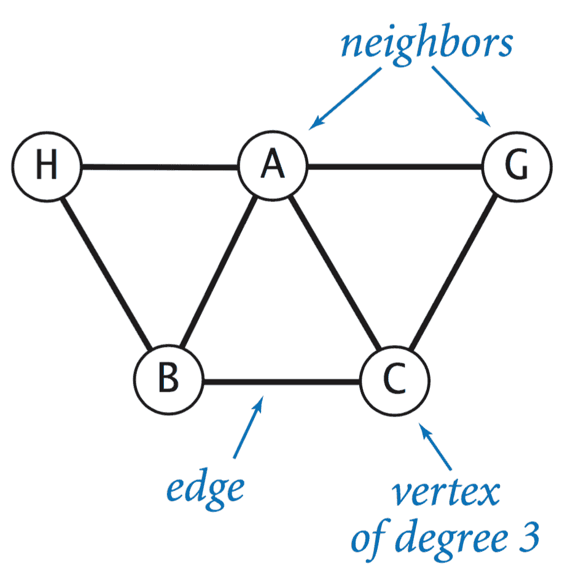
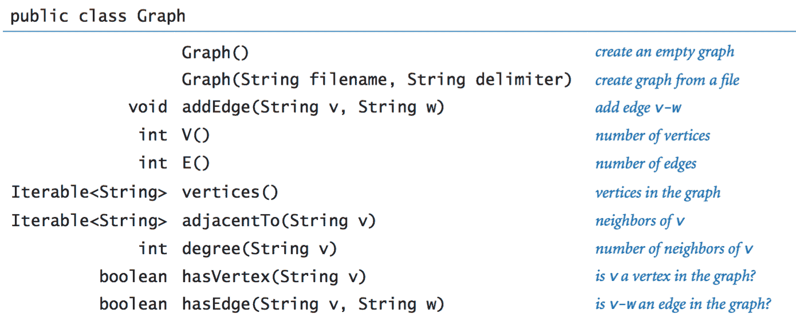
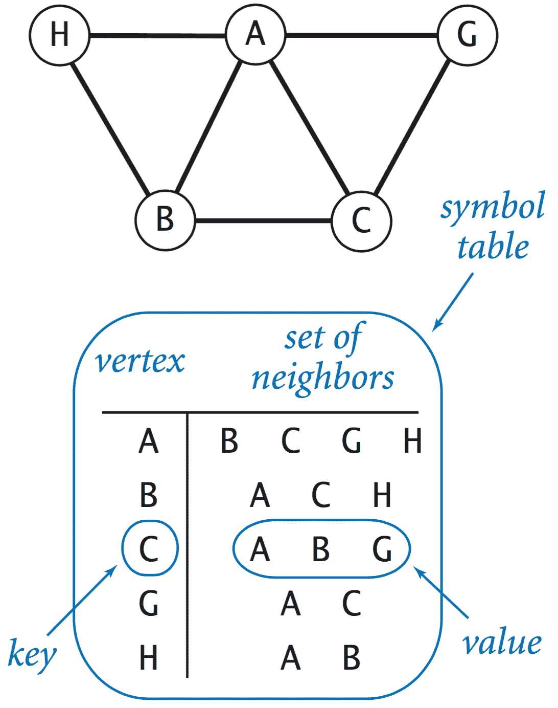
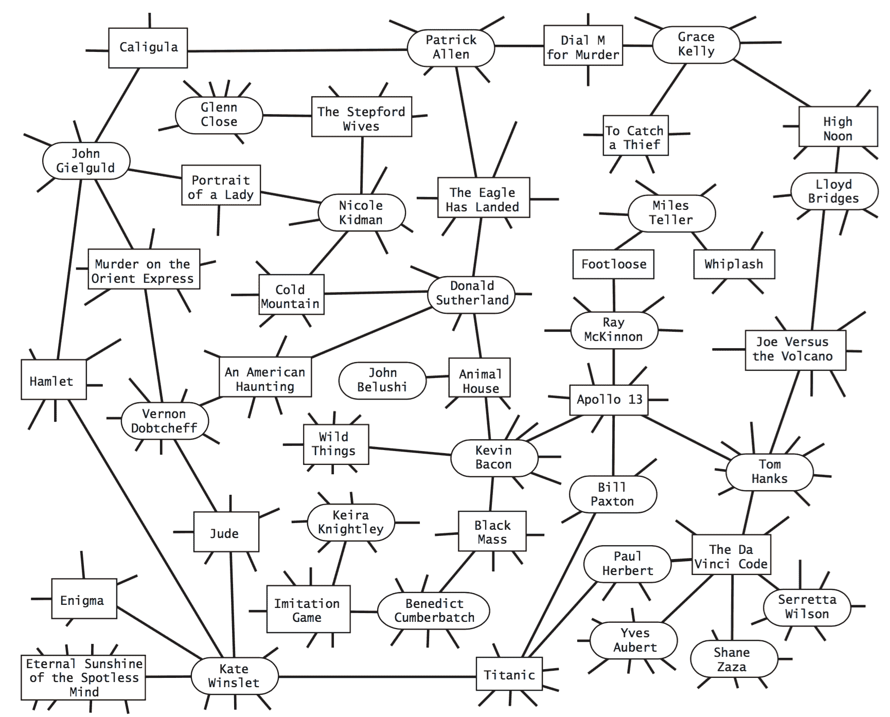
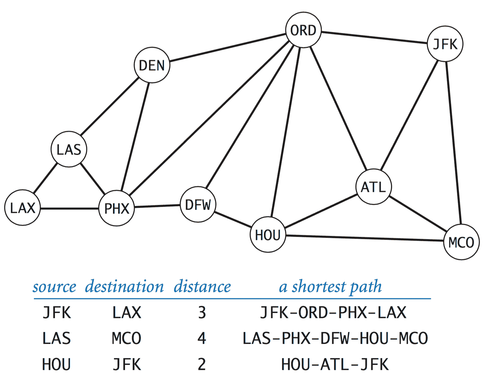
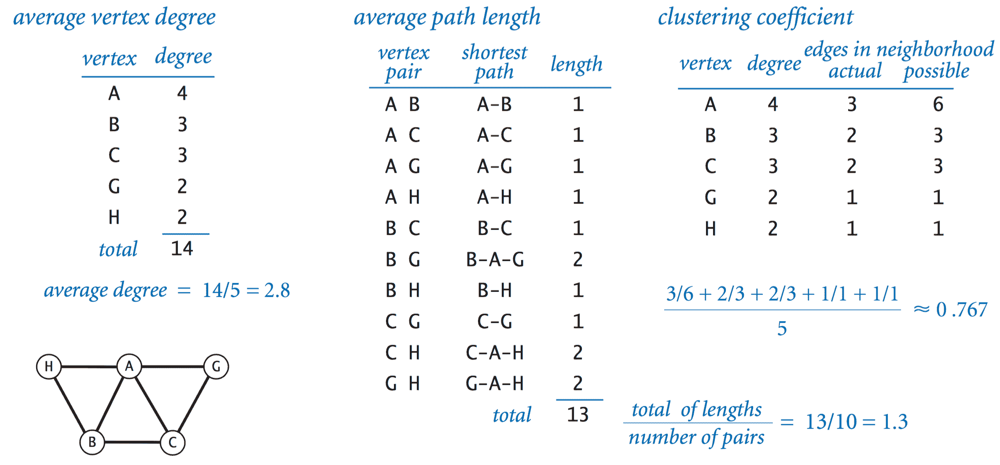
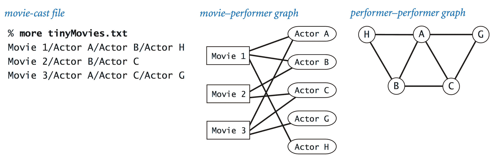

# 4.5   案例研究：小世界现象

> 原文：[`introcs.cs.princeton.edu/java/45graph`](https://introcs.cs.princeton.edu/java/45graph)
> 
> 译者：[飞龙](https://github.com/wizardforcel)
> 
> 协议：[CC BY-NC-SA 4.0](https://creativecommons.org/licenses/by-nc-sa/4.0/)


我们用于研究实体之间成对连接性质的数学模型称为*图*。一些图表现出一种特定属性，称为[小世界现象](https://en.wikipedia.org/wiki/Small-world_network)。这是一个基本概念，即使我们每个人的熟人相对较少，但我们之间存在着相对较短的熟人链���

## 图。

*图*由一组*顶点*和一组*边*组成。每条边代表两个顶点之间的连接。如果两个顶点由一条边连接，则它们是*邻居*，而顶点的*度*是其邻居的数量。下面的列表建议了各种系统，其中图是理解结构的合适起点。

> | 图 | 顶点 | 边 |
> | --- | --- | --- |
> | 循环 | 器官 | 血管 |
> | 骨骼 | 关节 | 骨头 |
> | 神经 | 神经元 | 突触 |
> | 社交 | 人 | 关系 |
> | 流行病学 | 人 | 感染 |
> | 化学 | 分子 | 键 |
> | n 体 | 粒子 | 力 |
> | 遗传 | 基因 | 突变 |
> | 生物化学 | 蛋白质 | 相互作用 |
> | 交通 | 交叉口 | 道路 |
> | 互联网 | 计算机 | 电缆 |
> | 网页 | 网页 | 链接 |
> | 分布 | 发电站 | 输电线 |
> | 机械 | 关节 | 梁 |
> | 软件 | 模块 | 调用 |
> | 金融 | 账户 | 交易 |

## 图数据类型。

图处理算法通常首先通过添加边来构建图的内部表示，然后通过迭代顶点和迭代给定顶点的邻居来处理它。以下 API 支持这样的处理：

> 

## 图实现。

 Graph.java 实现了这个 API。其内部表示是一组集合的符号表：键是顶点，值是邻居的集合（与键相邻的顶点）此表示使用两种数据类型 ST.java 和 SET.java。

我们的实现具有三个重要属性：

+   客户可以高效地遍历图的顶点。

+   客户可以高效地遍历顶点的邻居。

+   空间使用量与边的数量成正比。

## 表演者-电影图。

表演者-电影图包括每个表演者和电影的顶点以及如果表演者出现在电影中则两者之间存在边。

> 

我们提供了一些示例数据文件（使用 UTF-8 编码以与`In`兼容）。文件中的每一行都包括一部电影，后跟出现在电影中的表演者列表，由`/`分隔。

> | 文件 | 描述 | 电影 | 演员 | 边 |
> | --- | --- | --- | --- | --- |
> | cast.06.txt | 2006 年发行的电影 | 8780 | 84236 | 103815 |
> | cast.00-06.txt | 自 2000 年以来的电影发行 | 52195 | 348497 | 606531 |
> | cast.G.txt | MPAA 评级为 G 的电影 | 1288 | 21177 | 28485 |
> | cast.PG.txt | MPAA 评级为 PG 的电影 | 3687 | 74724 | 116715 |
> | cast.PG13.txt | MPAA 评级为 PG-13 的电影 | 2538 | 70325 | 103265 |
> | cast.mpaa.txt | MPAA 评级的电影 | 21861 | 280624 | 627061 |
> | cast.action.txt | 动作电影 | 14938 | 139861 | 266485 |
> | cast.rated.txt | 热门电影 | 4527 | 122406 | 217603 |
> | cast.all.txt | 超过 25 万部电影 | 285462 | 933864 | 3317266 |
> 
> *这些输入文件截至 2006 年 11 月 2 日。数据来自[互联网电影数据库](http://www.imdb.com/interfaces)。*

**倒排索引。** 程序 IndexGraph.java 接受一个查询，查询可以是电影的名称（在这种情况下打印出出现在该电影中的表演者列表）或表演者的名称（在这种情况下打印出该表演者出现在哪些电影中）。

## 图中的最短路径。

在图中给定两个顶点，*路径*是连接它们的一系列边。*最短路径*是所有这样的路径中长度最小的路径。

> 

PathFinder.java 使用一种被称为*广度优先搜索*的经典算法计算图中的最短路径。

## 分离度。

最短路径算法的经典应用之一是在社交网络中找到个体之间的*分离度*。为了明确概念，我们使用电影-表演者。凯文·贝肯是一位出演过许多电影的多产演员。我们为每位出演过电影的表演者分配一个[贝肯数](http://oracleofbacon.org/)：贝肯本人是 0，任何与贝肯同台演出的表演者的凯文·贝肯数为 1，任何其他表演者（除了贝肯）与凯文·贝肯数为 1 的表演者同台演出的表演者的凯文·贝肯数为 2，依此类推。

给定表演者的名称，*凯文·贝肯游戏*是找到一��交替的电影和表演者序列，最终回到凯文·贝肯。令人惊讶的是，PathFinder.java 提供了一个解决方案。

```java
% java PathFinder movies.txt "/" "Bacon, Kevin"
Kidman, Nicole
   Bacon, Kevin 
   Animal House (1978) 
   Sutherland, Donald (I) 
   Cold Mountain (2003) 
   Kidman, Nicole 
distance 2
Hanks, Tom
   Bacon, Kevin 
   Apollo 13 (1995)
   Hanks, Tom
distance 1

```

六度分隔规则表明，大多数演员的凯文·贝肯数不会超过 6。事实上，大多数演员的凯文·贝肯数不会超过 3！

## 小世界图。

科学家们已经确定了一类特别有趣的图，被称为*小世界图*，在自然和社会科学的许多应用中出现。小世界图具有以下三个特性：

+   它们是*稀疏的*：边的数量远小于具有指定顶点数的图的总潜在边数。

+   它们具有较短的*平均路径长度*：如果你随机选择两个顶点，它们之间的最短路径长度很短。

+   它们表现出*局部聚类*：如果两个顶点是第三个顶点的邻居，则这两个顶点很可能是彼此的邻居。

> 

SmallWorld.java 计算图的平均度、平均路径长度和聚类系数。

## 表演者-表演者图。

我们的电影-表演者图不是一个小世界图，因为它是二部图，因此聚类系数为 0。然而，通过将两个表演者连接起来（如果他们出现在同一部电影中）定义的更简单的表演者-表演者图是小世界图的一个经典例子（在丢弃未与凯文·贝肯相连的表演者后）。下面的图示说明了与一个小电影演员文件相关联的电影-表演者和表演者-表演者图。

> 

Performer.java 从我们的电影-演员输入格式的文件中创建一个表演者-表演者图。您可以使用它来验证这样的图是否是小世界图。

#### 练习

1.  在 Graph.java 中添加`V()`和`E()`的实现，分别返回图中的顶点数和边数。

1.  在 Graph.java 中添加一个名为`degree()`的方法，该方法接受一个字符串参数，并返回指定顶点的度。使用此方法找到文件`movies.txt`中出现在最多电影中的表演者。

1.  在 Graph.java 中添加一个名为`hasVertex()`的方法，该方法接受一个字符串参数，并在图中命名一个顶点时返回`true`，否则返回`false`。

1.  在 Graph.java 中添加一个`hasEdge()`方法，它接受两个字符串参数，并在图中指定一条边时返回`true`，否则返回`false`。

1.  *真*或*假*：在广度优先搜索过程中的某个时刻，队列中可能包含两个顶点，一个距离源点为 7，另一个距离为 9。

    *解决方案*：错误。队列最多可以包含两个不同距离*d*和*d* + 1 的顶点。广度优先搜索按照从源点到顶点的距离递增的顺序检查顶点。在检查距离为*d*的顶点时，只有距离为*d*−1 的顶点可以入队。

1.  假设在`PathFinder.java`中使用栈而不是队列进行广度优先搜索。它仍然能够计算从源点到每个顶点的路径吗？它仍然能够计算最短路径吗？

    *解决方案*：是的，不是。

1.  当在`pathTo()`中使用队列而不是栈来形成最短路径时会产生什么影响？

    *解决方案*：它会返回顶点的逆序。

#### 创意练习

1.  **直方图。** 编写一个程序 BaconHistogram.java，打印出凯文·贝肯数的直方图，指示有多少表演者来自 movies.txt 的贝肯数为 0、1、2、3、...。包括那些与凯文·贝肯完全没有联系的人的类别。

    ```java
      #     Freq
    ------------
      0        1
      1     2083
      2   187072
      3   515582
      4   113741
      5     8269
      6      772
      7       93
      8        7
    Inf    28942

    ```

1.  **单词阶梯。** 编写一个程序 WordLadder.java，以两个 5 个字母的字符串作为命令行参数，从标准输入读取 5 个字母单词列表，并打印出一个最短的[单词阶梯](http://en.wikipedia.org/wiki/Word_ladder)，使用标准输入上的单词连接这两个字符串（如果存在）。在单词阶梯链中，两个单词如果只相差一个字母，则相邻。例如，以下单词阶梯连接了`green`和`brown`：

    ```java
    green greet great groat groan grown brown

    ```

    这个游戏最初被称为*doublet*，是由刘易斯·卡罗尔发明的。你也可以尝试在这个 6 个字母单词列表上运行你的程序。

1.  **所有路径。** 编写一个 Graph.java 客户端 AllPaths.java，其构造函数以`Graph`作为参数，并支持计算或打印图中两个给定顶点`s`和`t`之间的*所有*简单路径的操作。*简单*路径是不重复任何顶点的路径。在二维网格中，这样的路径被称为*避免自身的行走*。警告：可能存在指数级的路径，因此不要在大型图上运行此程序。

1.  **有向图。** 实现一个表示*有向*图的 Digraph.java 数据类型，其中边的方向很重要：`addEdge(v, w)`表示从`v`到`w`添加一条边，但不是从`w`到`v`。用两种方法替换`adjacentTo()`：一种是给出具有从参数顶点*到*它们的边的顶点集合，另一种是给出具有从它们*到*参数顶点的边的顶点集合。解释如何修改 PathFinder.java 以在有向图中找到最短路径。

#### 网络练习

1.  **所有最短路径。** 编写一个程序 AllShortestPaths.java，从文件中构建图形，从标准输入读取源-目标请求，并打印出图中从源到目标的最短路径。

1.  **更快的单词阶梯。** 为了加快速度（如果单词列表非常大），不要编写嵌套循环来尝试所有成对的单词，看它们是否相邻。为了处理 5 个字母的单词，首先对单词列表进行排序。只有最后一个字母不同的单词将连续出现在排序列表中。再排序 4 次，但将字母向右循环移动一个位置，以便在一个排序列表中连续出现在第 i 个字母不同的单词。

    使用更大的单词列表尝试这种方法，其中包含不同长度的单词。两个长度不同的单词如果较小的单词与较大的单词相同，减去最后一个字���，则它们是相邻的，例如，brow 和 brown。

1.  **跳棋。** 将跳棋规则扩展到一个 N×N 的跳棋棋盘。展示如何确定一个棋子是否可以在当前移动中变成国王。（使用 BFS 或 DFS。）展示如何确定黑方是否有获胜的着法。（找到一个欧拉路径。）

1.  **组合电路。** 给定其输入，确定组合电路的真值是一个图可达性问题（在有向无环图上）。

1.  **Hex。** Hex 游戏在一个六边形网格上进行...

    +   描述如何使用 BFS 或 DFS 检测白色或黑色谁赢得了比赛。

    +   证明游戏不可能以平局结束。*提示*：考虑从棋盘左侧可达的单元格集合。

    +   证明 Hex 游戏中，如果玩家采取最佳策略，第一位玩家总是能赢。*提示*：如果第二位玩家有一个获胜策略，您可以最初选择一个随机单元格，然后只需复制第二位玩家的获胜策略。在博弈论中，这种技术被称为*策略窃取*。

1.  编写一个程序 MovieStats.java，读取电影数据集并打印出不同演员和电影的数量。

1.  修改 Bacon.java，使用户输入两个演员（每行一个），程序打印两个演员之间的最短链。

1.  修改`Graph.java`，包括一个返回图顶点的`Iterator`的方法`iterator()`。此外，使`Graph`实现`Iterable<String>`接口，以便您可以使用 foreach 遍历图的顶点。

    ```java
    public Iterator<String> iterator() {
       return st.iterator();
    }

    ```

1.  **垃圾回收。** 引用计数 vs. 标记-清除。像 Java 这样的语言中的自动内存管理是一个具有挑战性的问题。分配内存很容易，但发现程序何时完成内存（并回收它）更困难。引用计数：不适用于循环链接结构。标记-清除算法。根 = 局部变量和静态变量。从根运行 DFS，标记所有从根引用的变量，依此类推。然后，进行第二遍：释放所有未标记的对象并取消标记所有标记的对象。或者复制 GC 将所有标记的对象移动到单个内存区域。每个对象使用一个额外的位。JVM 在进行垃圾回收时必须暂停。碎片化内存。

1.  **网络链接的幂律**（Micahel Mitzenmacher）全球网络的入度和出度遵循幂律。可以通过[优先附加](http://citeseer.nj.nec.com/553345.html)过程建模。假设每个网页只有一个外链。每个页面逐一创建，从指向自身的单个页面开始。以概率 p < 1，它链接到现有页面之一，随机选择。以概率 1-p，它链接到具有与该页面的入链数成比例的概率的现有页面。此规则反映了新网页指向热门页面的普遍倾向。编写一个程序来模拟这个过程，并绘制入链数的直方图。*答案*：您应该观察到具有入度 k 的页面比例与 k^(-1 / (1 - p)) 成比例。
