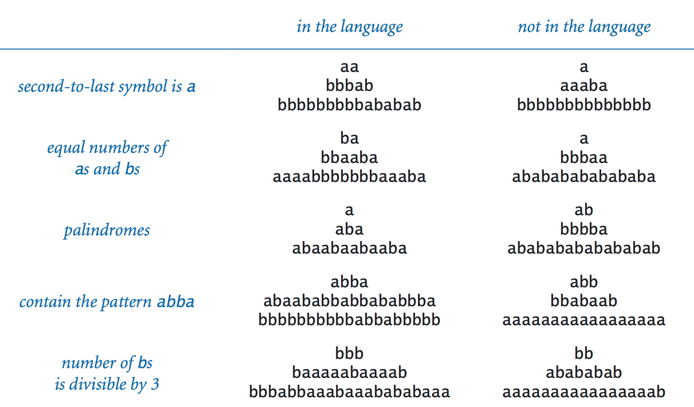
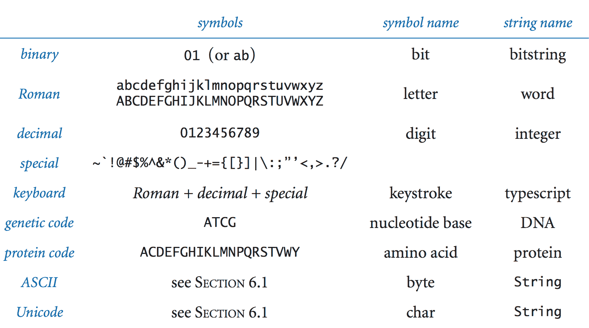
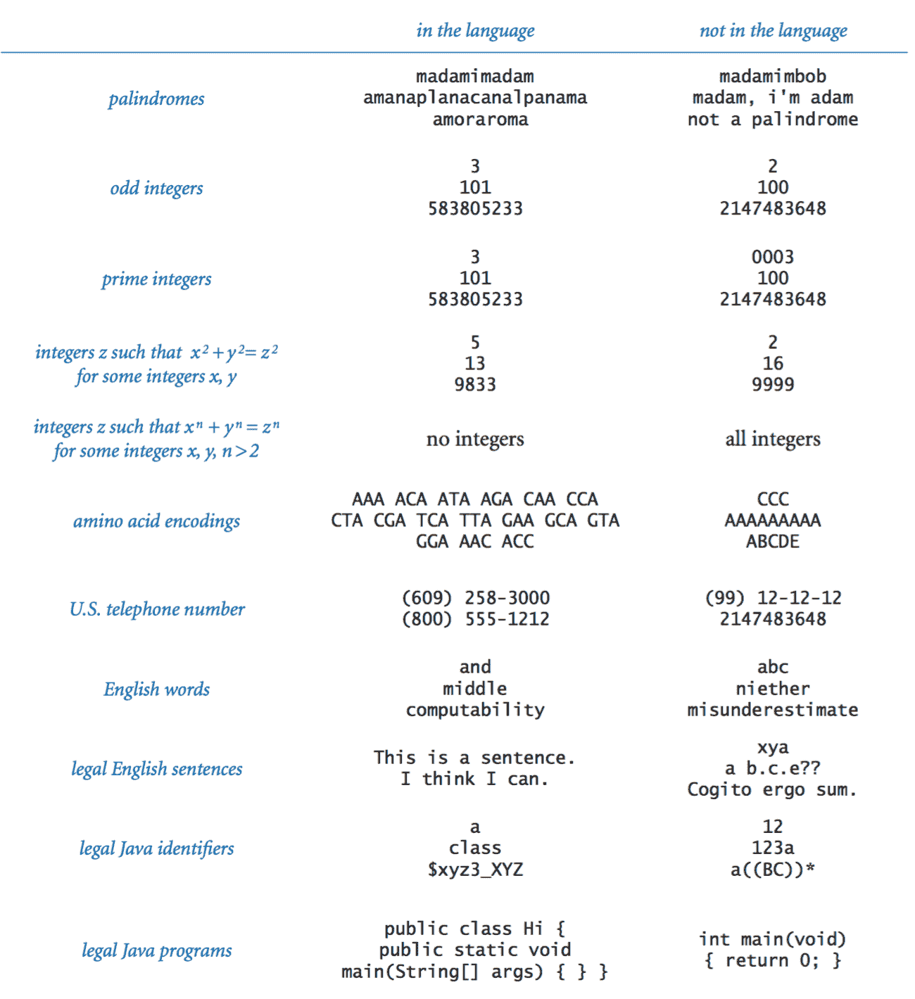
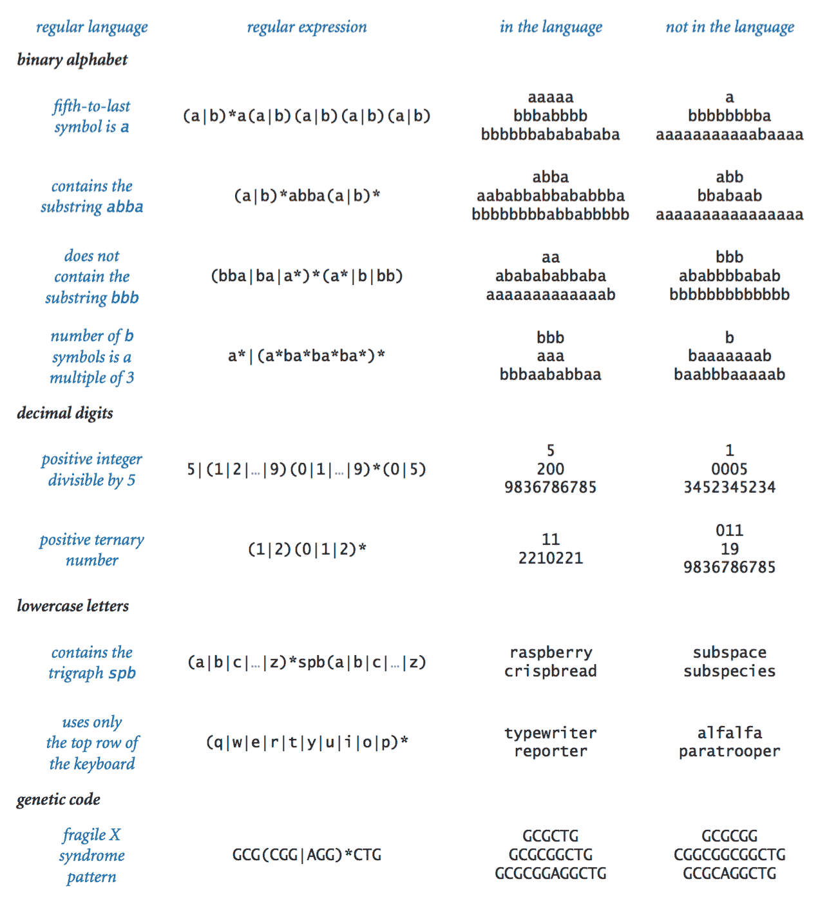
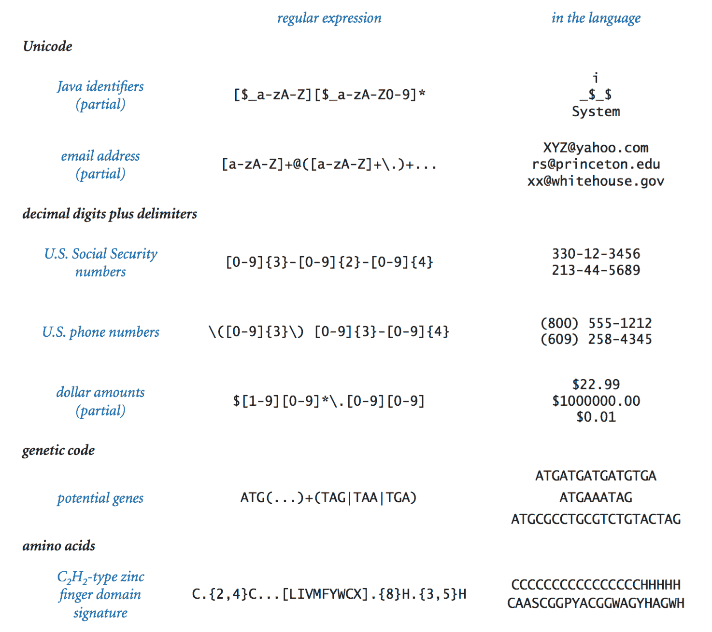
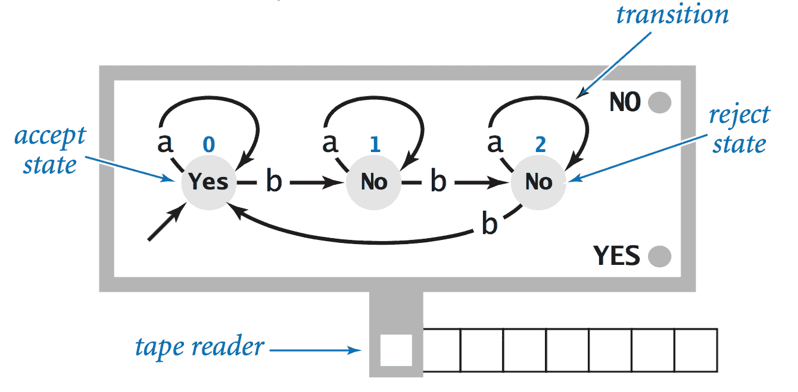
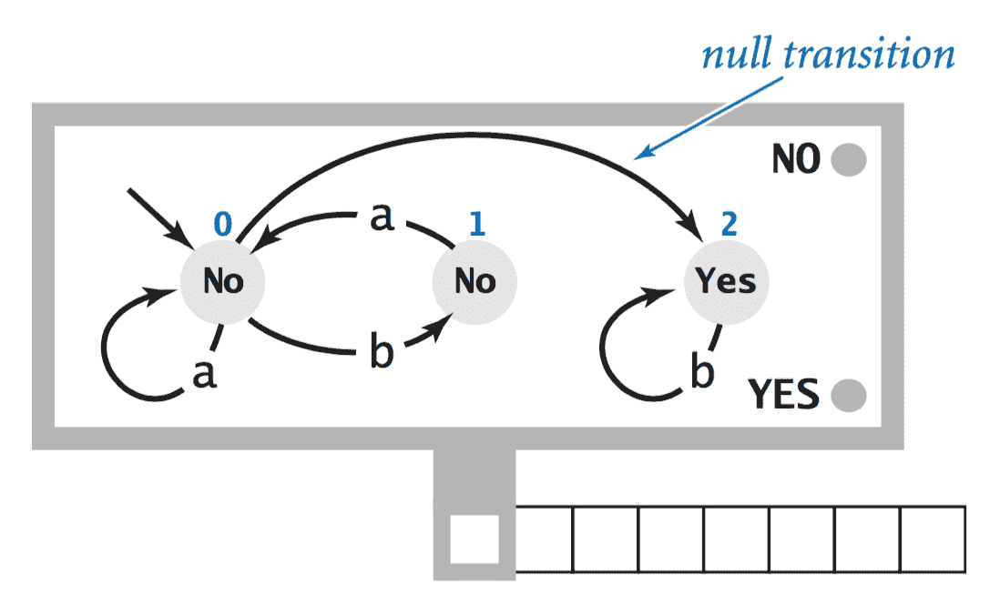
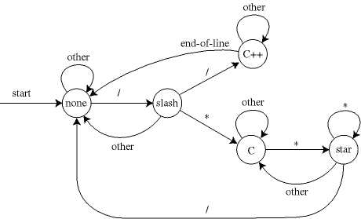

# 5.1   形式语言

> 原文：[`introcs.cs.princeton.edu/java/51language`](https://introcs.cs.princeton.edu/java/51language)
> 
> 译者：[飞龙](https://github.com/wizardforcel)
> 
> 协议：[CC BY-NC-SA 4.0](https://creativecommons.org/licenses/by-nc-sa/4.0/)


在本节中，我们介绍形式语言、正规表达式、确定性有限状态自动机和非确定性有限状态自动机。 

## 基本定义。

我们从一些重要的定义开始。

+   *符号* 是我们的基本构建块，通常是字符或数字。

+   *字母表* 是一组有限的符号。

+   *字符串* 是字母表符号的有限序列。

+   *形式语言* 是一组字符串（可能是无限的），都属于相同的字母表。

现在，我们考虑一些示例。

+   *二进制字符串。* 我们从二进制字母表上的形式语言的示例开始。指定形式语言的最简单方法是列举其字符串。一个复杂之处在于语言可以是大型或无限集合，因此我们经常使用非正式描述。

    > 

+   *其他字母表。* 在处理形式语言时，我们使用适合任务的任何字母表：标准罗马字母表用于处理文本，十进制数字用于处理数字，字母表 { A, T, C, G } 用于处理遗传数据，依此类推。

    > 

    这里是一些关于不同字母表的示例语言：

    > 

+   *规范化问题。* 我们如何完全和准确地定义形式语言？这个任务被称为形式语言的*规范化问题*。我们的非正式英语描述在某些情况下可以胜任，但在其他情况下相当不足。

+   *识别问题。* 给定一个语言 *L* 和一个字符串 *x*，*识别问题*是回答以下问题：*x* 是否在 *L* 中？

## 正规语言。

现在我们考虑一类重要的形式语言，称为*正规语言*，对于这类语言，我们可以解决规范化和识别问题。

+   *基本操作。* 我们使用*并集*、*连接*和*闭包*操作在集合上，以及*括号*，来指定一个正规语言。

    +   两个形式语言 *R* 和 *S* 的*并集* *R* | *S* 是在 *R* 或 *S* 中的字符串的集合（或两者都有）。例如，

        ```java
        { a, ba } | { ab, ba, b } = { a, ab, ba, b }

        ```

        我们在并集中不包括重复项。

    +   两个形式语言 *R* 和 *S* 的*连接* *RS* 是通过将来自 *R* 的字符串附加到来自 *S* 的字符串而创建的所有字符串的集合。例如，

        ```java
        { a, ab } { a, ba, bab } = { aa, aba, abab, abba, abbab }

        ```

        再次，我们在结果中不包括重复项。

    +   形式语言 *R* 的*闭包* *R** 是从 *R* 中的零个或多个字符串的连接。

        ```java
        R* = ε | R | RR | RRR | RRRR | RRRRR | RRRRRR ...

        ```

        请注意，每次我们从 *R* 中取一个字符串时，我们可以自由使用集合中的任何字符串。这里 ε 指的是空字符串——由 0 个字符组成的字符串。

    +   我们使用*括号*或依赖于定义的运算符优先级顺序来指定运算符应该应用的顺序。对于正规表达式，闭包在连接之前执行，连接在并集之前执行。

+   *正规表达式。*  正规表达式（RE）是指定形式语言的符号串。每个正规表达式都是一个字母表符号，指定包含该符号的单例集，或者由以下操作组成（其中 *R* 和 *S* 是 REs）：

    +   *并集* *R* | *S*，指定集合 *R* 和 *S* 的并集，

    +   连接：*RS*，指定集合 *R* 和 *S* 的连接，

    +   闭包：R*，指定集合 *R* 的闭包，

    +   括号：(*R*)，指定与 *R* 相同的集合。

+   *正规语言。* 如果且仅当可以通过正规表达式指定时，形式语言才是*正规*的。以下是一些示例：

    > 

## 广义 REs。

我们对 RE 的定义是一个包含表征正则语言的四个基本操作（连接、并集、闭包和括号）的最小定义。在实践中，对这个集合进行各种添加是有用的。

> 

+   *扩展字母表.* 我们需要一个*转义机制*，允许我们使用元符号`|`、`*`、`(`和`)`来指定 RE 并作为语言字母表中的符号。具体来说，为了将元符号用作字母表中的符号，我们在其前面加上反斜杠字符（`/`）。

+   *简写符号.* 广义 RE 支持许多简写符号，例如以下内容：

    +   通配符符号`.`匹配任何字母表符号。

    +   元符号`^`匹配行的开头，`$`匹配行的结尾。

    +   用方括号`[]`括起的符号列表或范围匹配列表或范围中的任何符号。

    +   如果方括号内的第一个字符是`^`字符，则该规范指的是不在列表或范围内的 Unicode 字符。

    +   由反斜杠后跟字母表符号组成的几个转义序列匹配一组定义的符号。例如，`\s`匹配任何空白符号。

+   *对闭包操作的扩展.* 因此，Java RE 具有以下选项，用于指定对闭包操作的重复次数的限制：

    +   一个或多个：`+`

    +   零个或一个：`?`

    +   恰好*n*次：`{n}`

    +   介于*m*和*n*之间：`{m, n}`

以下表格说明了其中几个简写符号：

> 

Java 包含许多更多的[简写和扩展](http://docs.oracle.com/javase/6/docs/api/java/util/regex/Pattern.html)，我们将不探讨。

## Java 中的正则表达式。

Java 的[String](https://docs.oracle.com/javase/8/docs/api/java/lang/String.html#matches-java.lang.String-)库中的`matches()`方法解决了广义正则表达式的识别问题。如果`s`是任何 Java `String`，`re`是任何正则表达式，那么如果`s`在`re`指定的语言中，则`s.matches(re)`为真，否则为假。

+   *有效性检查.* Validate.java 将一个 RE 作为命令行参数，并对标准输入中的每个字符串打印`Yes`，如果它在 RE 指定的语言中，则打印`No`。

+   *搜索.* Grep.java 将一个 RE 作为命令行参数，并打印标准输入中所有具有 RE 描述的语言中的子字符串的行。

## 确定有限状态自动机。

DFA 是一个由以下组成的抽象机器

+   有限数量的*状态*，每个状态被指定为*接受*状态或*拒绝*状态。

+   一组*转换*指定了机器如何改变状态。每个状态对于字母表中的每个符号都有一个转换。

+   一个*磁带阅读器*最初位于输入字符串的第一个符号处，只能读取一个符号并移动到下一个符号。

我们将每个 DFA 表示为一个有向图，其中接受状态是标记为*Yes*的顶点，拒绝状态是标记为*No*的顶点，每个转换是一个由字母表中的符号标记的有向边。

> 

+   *操作.* 所有 DFA 都从状态 0 开始，输入字符串在磁带上，磁带头位于输入字符串的最左边的符号上。机器通过读取一个符号，将磁带头向右移动一个位置，然后根据刚刚读取的输入符号标记的转换来改变状态来操作。当输入用尽时，DFA 停止。

+   *描述语言。* 每个 DFA*识别*一个形式语言—它接受的所有字符串的集合。例如，上述 DFA 识别所有`b`的数量是 3 的倍数的二进制字符串。

+   *Java 实现。* DFA.java 接受一个 DFA 规范（来自命令行上命名的文件）和一系列来自标准输入的字符串，并打印在给定输入字符串上运行 DFA 的结果。

## 非确定有限状态自动机。

DFA 的行为是*确定性*的：对于每个输入符号和每个状态，都有一个可能的状态转换。*非确定性有限自动机*（NFA）与 DFA 相同，但是去除了离开每个状态的转换的限制，因此

+   允许有多个标记相同符号的转换。

+   允许未标记的状态转换（*空转换*）。跟随空转换不会消耗输入符号。

+   不需要将所有符号包含在离开每个状态的转换中。

如果 NFA 接受一个字符串，则存在*任何*一系列转换可以将机器从起始状态转移到接受状态。

>        

+   在左侧的 NFA 中，当处于状态 0 并读取`a`时，它可以选择留在状态 0 或转移到状态 1。它识别的是倒数第二个符号为`a`的二进制字符串。

+   在右侧的 NFA 中，当它处于状态 0 时，它可以跟随空转换到状态 1，而不消耗输入符号。它识别的是不包含子字符串`bba`的二进制字符串。

## 克林定理。

正则表达式、DFA 和 NFA 之间存在着引人注目的联系，这对实践和理论都有戏剧性的影响。克林定理断言，RE、DFA 和 NFA 是等价的模型，因为它们都表征了正则语言。

+   *RE 识别。* 克林定理为 RE 的识别问题提供了解决方案的基础。

    +   构建与给定 RE 对应的 NFA。

    +   模拟 NFA 对给定输入字符串的操作。

    这是 Java 实现其`matches()`方法所采取的方法。

+   *DFA 能力的限制。* 克林定理还有助于我们阐明一个基本的理论问题：哪些形式语言可以用 RE 描述，哪些不行？例如，包含所有具有相等数量的`a`和`b`符号的二进制字符串的语言不是正则的。

+   *功能更强大的机器。* 定义一个可以识别更多语言的机器的简单方法是向 DFA 添加一个*下推栈*，得到一个称为*下推自动机*（PDA）的机器。

    > 

    开发一个 PDA 来识别具有相等数量的`a`和`b`符号的二进制字符串并不困难。在下一节中，我们将考虑*图灵机*，这是计算机科学核心的抽象机器。

#### 练习

1.  给出一个 RE，指定以下二进制字母表中的每种语言。

    1.  所有字符串除了空字符串

    1.  包含至少三个连续的`b`

    1.  以`a`开头且长度为奇数，或以`b`开头且长度为偶数

    1.  没有连续的`b`

    1.  除了`bb`或`bbb`之外的任何字符串

    1.  以相同符号开头和结尾

    1.  包含至少两个`a`且最多一个`b`

    *解决方案*：`(a|b)(a|b)*`，`(a|b)*bbb(a|b)*`，`a((a|b)(a|b))* | b(a|b)((a|b)(a|b))*`，...

#### 创意练习

1.  **收割机。** 编写一个[Pattern](https://docs.oracle.com/javase/8/docs/api/java/util/regex/Pattern.html)和[Matcher](https://docs.oracle.com/javase/8/docs/api/java/util/regex/Matcher.html)客户端 Harvester.java，它接受文件名（或 URL）和 RE 作为命令行输入，并打印文件中与 RE 匹配的所有子字符串。

1.  **网络爬虫。** 开发一个程序 WebCrawler.java，打印出可以从作为命令行参数给出的网页访问的所有网页。

1.  **搜索和替换。** 编写一个过滤器 SearchAndReplace.java，它接受一个 RE 和一个字符串`str`作为命令行参数，从标准输入读取一个字符串，用`str`替换所有与 RE 匹配的标准输入上的子字符串，并将结果发送到标准输出。首先使用 Java 的`String`库中的`replaceAll()`方法解决问题；然后解决方法是不使用该方法。

#### 网页练习（正则表达式）

1.  给出一个 RE，指定以下每个语言{0, 1}。

    1.  `a`或`bb`或`bab`

    1.  只有`a`

    1.  所有二进制字符串

    1.  以`a`开头，以`a`结尾

    1.  以`aa`结尾

    *答案*：a | bb | bab, a*, (a|b)*, a(a|b)*a | a, (a|b)*aa

1.  编写一个正则表达式来描述字母表{a, b, c}上的输入，这些输入按排序顺序排列。*答案*：a*b*c*。

1.  为以下每组二进制字符串编写一个正则表达式。仅使用基本操作。

    1.  包含至少三个连续的 1

    1.  包含子字符串 110

    1.  包含子字符串 1101100

    1.  不包含子字符串 110

    *答案*：(0|1)*111(0|1)*, (0|1)*110(0|1)*, (0|1)*1101100(0|1)*, (0|10)*1*。最后一个是最棘手的。

1.  为至少有两个 0 但不连续的 0 的二进制字符串编写一个正则表达式。

1.  为以下每组二进制字符串编写一个正则表达式。仅使用基本操作。

    1.  至少有 3 个字符，第三个字符是 0

    1.  0 的数量是 3 的倍数

    1.  奇数长度

    1.  长度至少为 1 且最多为 3

    *答案*：(0|1)(0|1)0(0|1)*,   1* | (1*01*01*01*)*,   (0|1)((0|1)(0|1))*,   (0|1) | (0|1)(0|1) | (0|1)(0|1)(0|1)。

1.  对于以下每个问题，指出正则表达式`0(0 | 1)*1`，`0*101*`，`(1 | 01)*`精确匹配长度为 1000 的位字符串的数量。

1.  编写一个正则表达式，匹配包含以下内容的字母表{a, b, c}的所有字符串：

    1.  以`a`开头并以`a`结尾

    1.  最多一个 a

    1.  至少有两个 a

    1.  偶数个 a

    1.  a 的数量加上 b 的数量是偶数

1.  找出字母按字母顺序排列的长单词，例如`almost`和`beefily`。*答案*：使用正则表达式'^a*b*c*d*e*f*g*h*i*j*k*l*m*n*o*p*q*r*s*t*u*v*w*x*y*z*$'。

1.  编写一个 Java 正则表达式，匹配电话号码，带有或不带有区号。区号应为(609) 555-1234 或 555-1234 的形式。

1.  找出所有以`nym`结尾的英文单词。

1.  找出所有包含三连字母`bze`的英文单词。*答案*：subzero。

1.  找出所有以 g 开头，包含三连字母`pev`且以 e 结尾的英文单词。*答案*：grapevine。

1.  找出所有包含三连字母`spb`且至少有两个 r 的英文单词。

1.  找出可以用标准键盘顶行打出的最长英文单词。*答案*：proprietorier。

1.  找出包含字母 a、s、d 和 f 的所有单词，不一定按顺序。*解决方案*：`cat words.txt | grep a | grep s | grep d | grep f`。

1.  给定一个由 A、C、T 和 G 以及 X 组成的字符串，找到一个字符串，其中 X 匹配任何单个字符，例如，CATGG 包含在 ACTGGGXXAXGGTTT 中。

1.  编写一个 Java 正则表达式，用于 Validate.java，验证形式为 123-45-6789 的社会安全号码。*提示*：使用`\d`表示任何数字。*答案*：`[0-9]{3}-[0-9]{2}-[0-9]{4}`。

1.  修改上一个练习，使`-`成为可选项，这样 123456789 被视为合法输入。

1.  编写一个 Java 正则表达式，匹配所有包含正好五个元音字母且元音字母按字母顺序排列的字符串。*答案*：`[^aeiou]*a[^aeiou]*e[^aeiou]*i[^aeiou]*o[^aeiou]*u[^aeiou]*`

1.  编写一个 Java 正则表达式来匹配有效的 Windows XP 文件名。这样的文件名由除了任意字符序列组成

    ```java
    / \ : * ? " < > |

    ```

    另外，不能以空格或句号开头。

1.  编写一个 Java 正则表达式，匹配有效的 OS X 文件名。这样的文件名由除冒号外的任意字符序列组成。此外，它不能以句点开头。

1.  给定一个表示 IP 地址名称的字符串`s`，采用*dotted quad*表示法，将其分解为其组成部分，例如，255.125.33.222。确保四个字段都是数字。

1.  编写一个 Java 正则表达式，描述形式为 a.b.c.d 的有效 IP 地址，其中每个字母可以表示 1、2 或 3 位数字，并且必须有句点。是的：196.26.155.241。

1.  编写一个 Java 正则表达式，匹配以 4 位数字开头并以两个大写字母结尾的车牌。

1.  编写一个正则表达式，从 DNA 字符串中提取编码序列。它以 ATG 密码子开头，并以终止密码子（TAA、TAG 或 TGA）结尾。[参考](http://bioportal.weizmann.ac.il/course/prog/regexps/5.html)

1.  编写一个正则表达式，检查序列是否以 rGATCy 开头：即，它是否以 A 或 G 开头，然后是 GATC，最后是 T 或 C。

1.  编写一个正则表达式，检查序列是否包含两个或更多次重复的 GATA 四核苷酸。

1.  修改 Validate.java 以使搜索不区分大小写。*提示*：使用嵌入式标志`(?i)`。

1.  编写一个 Java 正则表达式，匹配利比亚独裁���穆阿迈尔·卡扎菲姓氏的各种拼写，使用以下模板：（i）以 K、G、Q 开头，（ii）可选地跟随 H，（iii）后跟 AD，（iv）可选地跟随 D，（v）可选地跟随 H，（vi）可选地跟随 AF，（vii）可选地跟随 F，（vii）以 I 结尾。

1.  编写一个 Java 程序，读取类似`(K|G|Q)[H]AD[D][H]AF[F]I`的表达式，并打印出所有匹配的字符串。这里的符号`[x]`表示字母`x`的 0 或 1 个副本。

1.  为什么`s.replaceAll("A", "B");`不会替换字符串`s`中所有出现的字母 A 为 B？

    *答案*：使用`s = s.replaceAll("A", "B");`。方法`replaceAll`返回结果字符串，但不更改`s`本身。字符串是不可变的。

1.  编写一个程序 Clean.java，从标准输入读取文本并将其打印出来，删除每行末尾的空格，并用 4 个空格替换所有制表符。

    *提示*：使用`replaceAll()`和正则表达式`\s`匹配空格。

1.  编写一个正则表达式，匹配文本`a href ="`和下一个`"`之间的所有文本。*答案*：`href=\"(.*?)\"`。`?`使`.*`变得不贪婪而是勉强。在 Java 中，使用`Pattern.compile("href=\\\"(.*?)\\\"", Pattern.CASE_INSENSITIVE)`来转义反斜杠字符。

1.  编写一个程序 Title.java，提取标签`<title>`和`<\title>`之间的所有文本。`(?i)`使匹配不区分大小写。`$2`指的是第二个捕获的子序列，即`title`标签之间的内容。

    ```java
    String pattern = "(?i)(<title.*?>)(.+?)(</title>)"; 
    String updated =  s.replaceAll(pattern, "$2");

    ```

1.  编写一个正则表达式，匹配在<TD ...>和</TD>标签之间的所有文本。*答案*：`<TD[^>]*>([^<]*)</TD>`

1.  **排列的正则表达式。**找到一组所有 n 个元素的排列的最短正则表达式（仅使用基本操作），其中 n = 5 或 10。例如，如果 n = 3，则语言是 abc、acb、bac、bca、cab、cba。*答案*：困难。解决方案的长度与 n 的指数成正比。

#### Web 练习（DFAs 和 NFAs）

1.  绘制一个接受以 11 结尾的所有比特串的 4 状态 DFA。（每个状态表示到目前为止读入的输入字符串是否以 00、01、10 或 11 结尾。）绘制一个完成相同任务的 3 状态 DFA。

1.  为至少包含一个 0 和至少包含一个 1 的比特串编写一个 DFA。

1.  绘制一个 NFA，匹配所有包含三个 0 的倍数或五个 1 的倍数的字符串。*提示*：使用 3 + 5 + 1 = 9 个状态和一个ε转换。

1.  绘制一个 NFA，识别所有以 aaab 结尾的字符串的语言。

1.  绘制一个 NFA，识别所有倒数第四个字符为 a 的字符串的语言。

1.  绘制一个识别语言的 NFA，该语言的所有字符串的第五个到最后一个字符是 a。

1.  给出一个具有 5 个接受状态的 NFA。写出一个具有仅一个接受状态的等价 NFA。

1.  给出一个具有 ε-转换的 NFA。写出一个没有 ε-转换的等价 NFA。

1.  **一元可除性。** 给定一个接受具有三个 0 的倍数和五个 1 的倍数的比特串的 DFA。

1.  **排列的 DFA。** 找出对于 n = 5 或 10 的所有 n 元素排列集合的最短 DFA。

1.  **Mealy 和 Moore 机。** Mealy：每个转换边上都有输出的 DFA。Moore：每个状态上都有输出的 DFA。

#### 网页练习

1.  **文本到语音合成。** grep 的原始动机。"例如，你如何处理发音多种不同的二合字 ui：fruit, guile, guilty, anguish, intuit, beguine?"

1.  **波士顿口音。** 编写一个程序，将所有的 r 替换为 h，将句子翻译成波士顿版本，如 "Park the car in Harvard yard" 翻译成波士顿版本 "Pahk the cah in Hahvahd yahd"。

1.  **文件扩展名。** 编写一个程序，接受文件名作为命令行参数并打印出其文件类型扩展名。*扩展名* 是最后一个 `.` 后面的字符序列。例如，文件 `sun.gif` 的扩展名是 `gif`。提示：使用 `split("\\.")`；回想一下 `.` 是一个正则表达式元字符，所以你需要转义它。

1.  **反转子域。** 对于网络日志分析，根据子域（如 `wayne.faculty.cs.princeton.edu`）方便地组织网络流量。编写一个程序，读取一个域名并以反向顺序打印出来，如 `edu.princeton.cs.faculty.wayne`。

1.  **银行抢劫。** 你刚刚目击了一起银行抢劫，并得到了逃跑车辆的部分车牌。它以 `ZD` 开头，中间某处有一个 `3`，以 `V` 结尾。帮助警官为这个车牌写一个正则表达式。

1.  **解析带引号的字符串。** 读取一个文本文件并打印出所有带引号的字符串。使用类似 `"[^"]*"` 的正则表达式，但需要担心转义引号。

1.  **解析 HTML。** 一个 >，可选跟随空格，跟随 `a`，跟随空格，跟随 `href`，可选跟随空格，跟随 `=`，可选跟随空格，跟随 `"http://`，跟随直到 `" `的字符，可选跟随空格，然后是一个 `<`。

    ```java
    < \s* a \s+ href \s* = \s* \\"http://[^\\"]* \\" \s* >

    ```

1.  **子序列。** 给定一个字符串 s，确定它是否是另一个字符串 t 的子序列。例如，abc 是 achfdbaabgabcaabg 的子序列。使用正则表达式。现在重复这个过程，不使用正则表达式。答案：(a) a.*b.*c.*，(b) 使用贪婪算法。

1.  **亨廷顿病诊断。** 导致亨廷顿病的基因位于染色体 4 上，并具有 CAG 三核苷酸重复的可变次数。编写一个程序来确定重复次数，并打印出 `will not develop HD` 如果重复次数小于 26，`offspring at risk` 如果次数为 37-35，`at risk` 如果次数在 36 和 39 之间，如果次数大于或等于 40，则打印 `will develop HD`。这就是亨廷顿病在遗传测试中的识别方式。

1.  **重复查找器。** 编写一个程�� `Repeat.java`，它接受两个命令行参数，并在指定的文件中找到第一个命令行参数的最大重复次数。

1.  **字符过滤器。** 给定一组 *坏字符* 的字符串 `t`，例如 `t = "!@#$%^&*()-_=+"`，编写一个函数来读取另一个字符串 `s` 并返回删除所有坏字符的结果。

    ```java
    String pattern = "[" + t + "]";
    String result  = s.replaceAll(pattern, "");

    ```

1.  **通配符模式匹配器。** 在不使用 Java 内置正则表达式的情况下，编写一个程序 Wildcard.java 来查找字典中与给定模式匹配的所有单词。特殊符号*匹配任意零个或多个字符。因此，例如模式"w*ard"匹配单词"ward"和"wildcard"。特殊符号.匹配任何一个字符。您的程序应该将模式作为命令行参数读取，并从标准输入读取单词列表（以空格分隔）。

1.  **通配符模式匹配器。** 重复上一个练习，但这次使用 Java 内置的正则表达式。*警告:*在通配符的上下文中，*与正则表达式的含义不同。

1.  **密码验证器。** 假设出于安全原因，您要求所有密码至少包含以下字符之一

    ```java
    ~ ! @ # $ % ^ & * | 

    ```

    为`String.matches`编写一个正则表达式，如果密码包含所需字符之一，则返回`true`。*答案*："^[^~!@#$%^&*|]+$"

1.  **字母数字过滤器。** 编写一个程序 Filter.java 从标准输入读取文本并消除所有不是空格或字母数字的字符。*答案*这是关键行。

    ```java
    String output = input.replaceAll("[^\\s0-9a-zA-Z]", "");

    ```

1.  **将制表符转换为空格。** 编写一个程序，将 Java 源文件中的所有制表符转换为 4 个空格。

1.  **解析分隔文本文件。** 存储数据库的一种流行方式是在文本文件中每行一个记录，并且每个字段由称为分隔符的特殊字符分隔。

    ```java
    19072/Narberth/PA/Pennsylvania
    08540/Princeton/NJ/New Jersey

    ```

    编写一个程序 Tokenizer.java，该程序读取一个分隔符字符和一个文件名，并在文件中创建一个令牌数组。

1.  **解析分隔文本文件。** 重复上一个练习，但使用`String`库方法`split()`。

1.  **PROSITE 到 Java 正则表达式。** 编写一个程序来读取 PROSITE 模式并打印出相应的 Java 正则表达式。

1.  **拼写错误。** 编写一个 Java 程序来验证这个常见拼写错误列表是否只包含形式为的行

    ```java
    misdemenors (misdemeanors)
    mispelling (misspelling)
    tennisplayer (tennis player)

    ```

    其中第一个单词是拼写错误，括号中的字符串是可能的替换。

1.  **注释剥离器。** 编写一个程序 CommentStripper.java，从标准输入读取 Java（或 C++）程序，删除所有注释，并将结果打印到标准输出。这在 Java 编译器的一部分中很有用。它使用一个 5 状态有限状态自动机来删除`/* */`和`//`样式的注释。它旨在说明 DFA 的强大之处，但要正确剥离 Java 注释，您需要更多状态来处理额外情况，例如，像`s = "/***//*"`这样的引号字符串文字。下面的图片由[David Eppstein](http://www.ics.uci.edu/~eppstein/161/960222.html)提供。

1.  **改进的注释剥离器。** 修改 CommentStripper.java 以正确处理引号字符串内的字符。

1.  **睡一觉吧。** 德国神经学家在《自然》杂志 427 卷（2004 年）第 352 页记录的一项实验假设，睡眠充足的学生比睡眠不足的学生更能解决棘手的问题。他们使用的问题涉及一个由三个数字 1、4 和 9 组成的字符串。"比较"两个相同的数字会产生原始数字；比较两个不同的数字会产生缺失的数字。例如 f(1, 1) = 1, f(4, 4) = 4, f(1, 4) = 9, f(9, 1) = 4。比较输入字符串的前两个数字，然后重复比较当前结果与字符串中的下一个数字。给定一个特定的字符串，你最终得到什么数字？例如，如果输入是字符串 11449494，你最终得到 9。

    ```java
    1 1 4 4 9 4 9 4
        1 9 1 4 4 1 9

    ```
