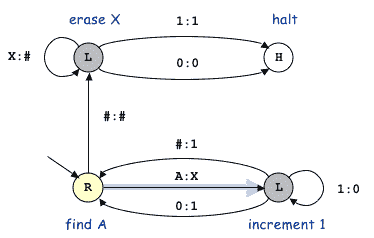
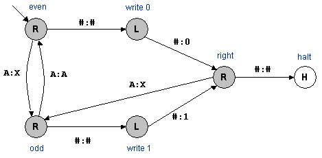

# 5.2   图灵机

> 原文：[`introcs.cs.princeton.edu/java/52turing`](https://introcs.cs.princeton.edu/java/52turing)
> 
> 译者：[飞龙](https://github.com/wizardforcel)
> 
> 协议：[CC BY-NC-SA 4.0](https://creativecommons.org/licenses/by-nc-sa/4.0/)

本节正在大力施工中。

## 图灵机。

图灵机是 20 世纪最美丽和最引人入胜的智力发现之一。图灵机是计算（和数字计算机）的简单且有用的抽象模型，足够一般以包含任何计算机程序。它构成了理论计算机科学的基础。由于其简单的描述和行为，它适合进行数学分析。这种分析导致对数字计算机和计算的更深入理解，包括揭示了有些计算问题根本无法在计算机上解决，无论处理器有多快，内存有多大。

**图灵机模拟器。** 这是一个由 Tom Ventimiglia 在 Bob Sedgewick 和 Kevin Wayne 的监督下用 Java 编写的图灵机模拟器。

+   可执行 jar 文件（[turing.jar](http://introcs.cs.princeton.edu/turing/turing.jar)）。要执行，请在命令行中键入 `java -jar turing.jar`。

+   OS X 应用程序（[Turing.zip](http://introcs.cs.princeton.edu/turing/Turing.zip)）。要执行，请双击 Turing.zip 文件解压缩。双击 Turing.app 启动。

欢迎查看和修改[源代码](http://introcs.cs.princeton.edu/turing/src)以供您自己使用。

**组件。** 阿兰·图灵试图描述一种与人类“计算机”具有相同基本功能的机械设备的最原始模型。在他具有划时代意义的[1936 年论文](http://www.abelard.org/turpap2/tp2-ie.asp)中，阿兰·图灵介绍了一个抽象机器，后来被称为图灵机。该机器由以下组件组成：

+   *纸带* 存储输入、中间结果和输出。纸带是一条任意长的带子，分成单元格。每个单元格存储有限符号字母表中的一个符号。在下面的示例中，我们使用由 0、1、A、X 和 # 组成的 4 个字符字母表。

    > 

+   图灵机的*纸带头*逐个单元格扫描纸带。我们将正在扫描的单元格称为*活动单元格*，其中包含的符号称为*输入符号*。在每个时间步骤中，纸带头读取输入符号，并将其保持不变或用新符号覆盖。在每个时间步骤结束时，纸带头向左或向右移动一个位置。我们用黄色突出显示活动单元格。在下面的示例中，`A` 被替换为 `X`，纸带头向左移动一个单元格。

    > 

+   *控制单元* 相当于现代微处理器中的 CPU。它由一个*状态转换图*组成，这是一张有限的指令表，准确指定了机器在每一步中采取的动作。每个*状态*代表机器的可能配置之一。根据当前状态和输入符号，图灵机用新符号覆盖输入符号并移动到新状态。每个*转换*将一个状态，比如 s，连接到另一个状态，比如 t，并用两个符号，比如 A 和 X 标记：这意味着如果图灵机处于状态 s 并且输入符号是 A，则它将用 X 覆盖 A 并转换到状态 t。每个状态用五种标记之一标记：L（左）、R（右）、Y（是）、N（否）或 H（停止）。进入状态时，图灵机根据状态的标记移动其纸带头或停止。下面是一个具有四个状态的机器的状态转换图示例。

    > 

**执行。** 最初，图灵机从称为*起始状态*的一个特殊状态开始，并且磁带头指向称为*起始单元*的一个特殊单元。对于每个状态和输入符号的组合，最多可能有一个对应的转换；因此��机器的操作是事先完全确定的。（如果从某个输入符号的状态没有可能的转换，则图灵机保持在相同状态并且不覆盖输入符号。）图灵机的每一步如下进行：

+   从活动单元格读取输入符号。

+   查找与当前状态和输入符号相关联的转换规则。

+   用新符号覆盖输入符号。

+   根据转换规则改变当前状态。

+   根据新状态的指定，将磁带头向左或向右移动一个单元。

这些步骤重复进行，直到当前状态标记为 H 以停止，Y（在这种情况下，机器回答是）或 N（在这种情况下，机器回答否）。机器可能永远运行而永远不会达到这些终止状态。

计算必须允许重复动作 - 重复执行动作 A 直到满足某个条件。这相当于保持在一个状态中（并将磁带头向左或向右移动），直到满足某个条件。计算还必须允许自适应动作 - 如果满足某个条件，则执行动作 A；否则执行动作 B。这由根据特定位置磁带头内容的状态转换捕获。

**一个例子：一元转换为二进制。** 我们考虑下面的 4 状态图灵机。当前状态和输入符号用黄色突出显示。我们跟踪其执行。

> 

由于输入符号是 A，图灵机遵循离开当前状态的适当转换箭头 - 标记为 A：X 的箭头。图灵机用 X 覆盖输入符号，将状态更改为右下角的状态，并将磁带头向左移动一个位置（因为新状态标有 L）。下面的插图显示了第一步结束时的图灵机。

> 

由于输入符号现在是#，图灵机遵循离开当前状态的适当转换箭头 - 标记为#：1 的箭头。这将用 1 覆盖当前单元格，将状态更改回左下角的状态，并将磁带头向右移动一个位置（因为新状态标有 R）。

> 

下面是接下来几步后磁带的内容。

> 

（勘误：在第四行中，突出显示的单元格应包含#而不是 1。）

一旦所有的 A 都被 X 覆盖，图灵机会抹去所有的 X（用#覆盖它们）。

> 

**它是如何工作的以及为什么有效。** 上述描述的图灵机将一元转换为二进制。也就是说，如果输入由 n 个连续的 A 组成，那么图灵机会在 A 序列的左侧打印数字 n 的二进制表示（并用 X 覆盖 A）。在上面的示例中，输入由 6 个 A 组成，图灵机将二进制数 110 写入磁带。

要描述如何实现这一点，我们首先回顾一种将二进制整数加 1 的算法：从右向左扫描位，将 1 更改为 0，直到看到 0。然后将 0 更改为 1。

图灵机反复地每次敲掉一个 A 并增加二进制数。我们的图灵机模仿这种策略。初始状态寻找下一个 A，用 X 覆盖它，然后转移到增量状态。增量状态将二进制整数增加一（保持 X 不变，将 1 更改为 0，直到看到 0 或#，将其更改为 1），然后转移到初始状态。当所有的 A 都被 X 覆盖时，清理状态用#替换所有的 X，然后转移到停止状态。

> 

## Java 中的图灵机实现。

我们使用良好的面向对象编程原则封装了主要的图灵机组件（磁带、转换、控制）。

+   *磁带。* 程序`Tape.java`是表示无界图灵机磁带的 ADT。它支持以下操作：将磁带头向左移动，将磁带头向右移动，读取当前单元格中的符号，向当前单元格写入符号。为了实现它，我们使用两个栈（一个用于存储磁带头左侧的所有符号，一个用于右侧）。为了打印出磁带的内容，我们打印出第一个栈的反向，当前元素，然后第二个栈。

+   *状态。* 每个状态都有一个名称和类型（停止、左、右、接受或拒绝）。

+   *转换。* 每个转换都有初始状态的名称、最终状态的名称和要写入磁带的符号。

+   *图灵机。* 我们将图灵机实现为一条磁带，一个状态符号表和一个转换符号表。

**非终止图灵机。** 从理论上讲，我们主要关注执行有限计算然后停止的机器。然而，许多实际应用涉及设计永不终止的程序（操作系统、空中交通管制系统、核反应堆控制系统）或产生无限量输出的程序（网络浏览器、计算π = 3.1415...的程序）。图灵机计算模型扩展到处理这种非终止情况。

图灵机连接物理和数学（图灵最初的动机，计算的热力学）。

#### 练习

1.  当给定磁带启动以下图灵机时，它会做什么...

1.  二进制加法器。

1.  二进制计数器。

1.  二进制回文。

1.  一元乘法。

1.  相同数量的 a 和 b。

1.  3 的倍数或 7 的倍数。

1.  平衡的括号。

1.  2 的幂。

1.  字符串比较。

1.  一元转二进制。将 N 转换为二进制的 3 状态一元转二进制图灵机需要多少步？*答案*：与 N² 成正比。

1.  一元转二进制。设计一个 6 状态的一元转二进制图灵机，将一元数 N 转换为二进制数，时间与 N log N 成正比。*提示*：划掉每隔一个 A。如果 A 的数��是奇数，写入 1；否则写入 0。重复剩下的未划掉的 A。

    > 

1.  交换图灵机上的两个单元。使用状态来编码临时符号。

1.  十六进制转二进制。设计一个将十六进制转换为二进制的图灵机。

1.  **比较器。** 创建一个接受两个由#字符分隔的二进制整数作为输入的图灵机，并在第一个字符串严格小于第二个字符串时接受输入。前一个问题中的图灵机比较两个 N 位整数需要多少步？（每步是一次磁带头的移动。）

1.  **高效比较器。** 创建一个在 N 的多项式时间内运行的比较器。

1.  **按位或。** 创建一个计算其两个长度为 N 的二进制输入的按位或的图灵机。

#### 创意练习

1.  **加倍。** 编写一个将由 k 个连续 1 组成的输入转换为由 2k 个连续 1 组成的输入的图灵机（乘以 2 的一元运算）。提示：在左侧写两个 1，并在右侧删除一个 1。

1.  **复制。** 编写一个图灵机，将由 0 和 1 组成的输入转换为原始输入的两个副本，用符号#分隔。

1.  **朗顿蚂蚁。** 编写一个程序`LangtonsAnt.java`，模拟一个被称为[朗顿蚂蚁](http://mathworld.wolfram.com/LangtonsAnt.html)的二维图灵机，并使用 Turtle 图形来展示结果。

1.  **Turmites。** 创建一些其他二维图灵机或[Turmites](http://mathworld.wolfram.com/Turmite.html)，产生有趣的图案。

1.  **图灵带。** 编写一个程序 Tape.java，实现*一维图灵带*。该带由一系列单元格组成，每个单元格存储一个整数（初始化为 0）。在任何时刻，都有一个*带头*指向其中一个单元格。支持以下接口方法：`moveLeft()`将带头向左移动一个单元格，`moveRight()`将带头向右移动一个单元格，`look()`返回活动单元格的内容，`write(int a)`将活动单元格的内容更改为`a`。*提示*：使用一个`int`表示活动单元格，使用两个栈表示带的左侧和右侧部分。

1.  **图灵机模拟器。** 编写一个程序 TuringMachine.java，模拟一个图灵机。设计程序如下：Tape.java，State.java，Transition.java。

1.  **Collatz 图灵机。** 设计一个图灵机，其输入为二进制整数的二进制表示形式，并重复地将其除以 2（如果是偶数）或乘以 3 并加 1（如果是奇数），直到等于 1。著名的开放猜想是，这台机器对于任何输入都会终止。
