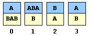

# 5.4   可计算性

> 原文：[`introcs.cs.princeton.edu/java/54computability`](https://introcs.cs.princeton.edu/java/54computability)

本节正在进行重大改造。

在大卫·希尔伯特于 1900 年对国际数学大会的著名演讲中，他断言：

> 拿任何明确未解决的问题来说，比如欧拉-马斯克罗尼常数γ的无理性问题，或者形式为 2^n+1 的无限个素数是否存在的问题。无论这些问题对我们来说看起来多么难以接近，我们在它们面前多么无助，我们仍然坚信，它们的解决必须通过有限数量的纯逻辑过程来实现。

现在我们对算法（图灵机）有了清晰的概念，我们将看到一些计算问题无论可用资源量如何都无法解决。如果存在解决特定问题的算法，则该问题被称为*可解*；否则该问题被称为*不可解*。我们给出几个自然的不可解问题的例子。不可解问题出现在许多领域，包括：元胞自动机、混沌理论、组合数学、运筹学、统计学、物理学、编译器理论、结论论、逻辑、集合论和拓扑学。请注意，不可解性是关于问题的一个非常强烈的陈述 - 它不仅表示科学家们尚未发现该问题的算法，而且这样的发现是不可能的。

**停机问题。** 停机问题是所有不可解问题中最著名的，也是第一个被归类为不可解的问题。*停机问题*的输入是一个图灵机及其输入。目标是确定该图灵机是否会达到停机状态。这比看起来要困难，因为非常简单的图灵机，通常被称为忙碌的海狸，可能执行非常复杂的动作。*N 状态忙碌的海狸*是一个在二进制字母（0 和 1）上定义的 N 状态图灵机，当以全零磁带启动时，在停机前尽可能多地在磁带上留下 1。为了找到即使对于较小的 N 值也能找到忙碌的海狸是一个令人惊讶的艰巨任务。以下这台 8 状态图灵机在磁带上留下 4,098 个 1，并在 47,176,870 步之后停机。

> 

然而，它并不是一个忙碌的海狸。事实上，[Marxen and Buntrock](http://www.drb.insel.de/~heiner/BB/)有一台 8 状态的图灵机（转换为我们的 Minsky 风格符号后），在超过 10⁹⁵步之后，在磁带上留下超过 10⁴⁷个 1，还有一台令人惊讶的 9 状态图灵机，在超过 10¹⁷³⁰步之后，在磁带上留下超过 10⁸⁶⁵个 1，并停止运行。

**Java 中的停机问题。** 我们可以用 Java 编程语言重新表述停机问题。在这里，目标是编写一个程序，比如`Halt.java`，来确定某个静态方法，比如`mystery`，在某个特定输入`x`上是否进入无限循环。这将是一个强大的调试工具。我们都写过进入无限循环的程序。代码中可能存在无限循环的可能通常表示一个 bug。商业软件中的无限循环可能导致愤怒的客户，甚至更糟。如果 Java 编译器能够警告我们的函数可能进入无限循环，那将是很好的。要了解为什么这是一项艰巨的任务，请考虑程序 Perfect.java。它搜索一个奇数[完美数](http://mathworld.wolfram.com/PerfectNumber.html)：一个等于其真因子之和的数（例如，28 是完美的，因为 28 = 1 + 2 + 4 + 7 + 14）。这个程序是否停机（假设我们不会遇到溢出问题）？如果是，我们需要等多久才能得出它进入无限循环的结论？我们可以输入代码并查看结果。如果程序终止，我们可以安全地回答是。主要障碍是确定何时回答否。假设我们在某个时刻停止程序（Ctrl-c）并回答否。也许如果我们让程序运行更长一点，它会自行停机。尽管进行了大量研究，但没有人知道`Perfect.java`是否会停机。数学家已经证明，直到 n 至少为 10³⁰⁰时它才会停机。这是一个极端的例子，但它突显了通过查看给定程序是否终止没有简单方法。相比之下，程序 Cube.java 搜索一个正整数解 313(a³ + b³) = c³。事实证明，`Cube.java`会停机（假设我们不会遇到溢出问题），但直到 c 大于 10¹⁰⁰⁰。事实上，我们可以以相同的方式提出类似费马大定理的数学问题（参见练习 XYZ）。如果停机问题是可解的，那么数学将变得容易。

**停机问题是不可解的。** 我们在下面概述了一个令人震惊的证明，证明不存在或���远不存在解决停机问题的算法。这个证明的思想受到以下悖论的启发。以下陈述是真还是假？*这个句子是假的。*这个悖论的本质是由自指引起的。TM“形式化了一个关于为什么你永远无法拥有完美内省的旧论点：因为如果你可以，那么你可以确定十秒后你将要做什么，然后做其他事情。”（斯科特·亚伦森）我们停机证明的关键思想是将一个程序本身作为输入。

**理发师悖论。** 假设巴里是一个理发师，他声称他给镇上所有（而且只有那些）不给自己剃须的人剃须，并且理发师住在镇上，自己是刮得干净的。巴里会给自己剃须吗？我们可以通过反证法证明这样一个理发师是不存在的...现在我们将同样的逻辑推理应用到 Java 程序中...

*非正式证明。* 由于 Java 编程语言等价于图灵机，我们只需证明我们无法编写一个 Java 程序来解决停机问题。我们考虑接受一些任意输入（比如来自`stdin`）的程序。我们用反证法或*归谬法*这种数学技巧。假设，为了矛盾，存在这样一个停机程序`Halt(P, x)`。（我们将展示这导致一个明显的矛盾，因此我们必须得出结论，这样的程序不存在。）它接受两个输入：一个程序`P`和它的输入`x`。程序`Halt(P, x)`在`P(x)`停机时输出`yes`，否则输出`no`。注意，根据我们的假设，对于任何一对输入，`Halt(P, x)`本身总是停机的。

现在，乐趣开始了。创建一个新程序`Strange(P)`，它以单个程序`P`作为输入。这个新程序调用带有`P`作为*两个*输入的停机程序，即，`Halt(P, P)`。[回顾一下���建其输入副本的图灵机。]将程序作为输入可能看起来有点奇怪，但这是相当常见的。编译器就是这样做的；它们读取 Java 程序作为输入，并输出一个机器语言程序。正如 Marvin Minsky 所观察到的，你不需要太担心为什么我们想要执行这样一种内向的计算。但是，通过考虑一个计算生物学家想要创建自己基因组的完整描述，你可以获得一些直觉！这一点一点都不荒谬。

现在，我们设计程序`Strange(P)`，以便如果`Halt(P, P)`输出`no`，则它立即停机。否则，我们让`Strange(P)`进入无限循环。在 Java 中，`Strange(P)`的代码可能如下所示：

```java
if (Halt(P, P) == true)
   while (true)    // infinite loop
      ;

```

总结

1.  如果`P(P)`不停机，那么`Strange(P)`就会停机。

1.  如果`P(P)`停机，那么`Strange(P)`就不会停机。

现在，我们执行关键步骤：将程序`Strange(P)`*本身*作为输入，即，设置`P = Strange`。让我们看看会发生什么疯狂的事情。语句(a)和(b)现在简化为：

1.  如果`Strange(Strange)`不停机，那么`Strange(Strange)`就会停机。

1.  如果`Strange(Strange)`停机，那么`Strange(Strange)`就不会停机。

这两种情况都导致矛盾。我们唯一能得出的结论是我们假设程序`Halt(P, x)`存在是不可能的。也就是说，停机问题是不可解的！

## 一首诗意的证明。

这里有一首诗，以诗歌的形式证明了停机问题的不可判定性！在诗意的证明中，程序`Strange()`被替换为`Q()`。

**对角线化论证。** 这个证明是对*对角线化论证*的一个例子：我们想象一个二维网格，行由程序 P 索引，列由输入 x 索引，Halt(P, x)是在 P(x)上运行停机程序的结果。对角线条目对应于 Halt(P, P)。证明的本质是确定哪一行对应于程序 Strange。矛盾之处在于我们构造 Strange 使其与网格中的每一行不同（特别是在每个对角线条目上）。

**后果。** 作为任何确定性算法正确性证明的一部分，我们必须证明它在有限步骤后终止。有一些重要的程序类别，可以轻松判断，但停机问题的不可判定性排除了一般规则或公式。每个正确性证明可能需要一个全新的想法（例如，奇完美数程序），而且没有办法（完全）自动化这个过程。

为什么调试很难？以下是不可判定的。

+   *自停机问题。* 给定一个接受一个输入的程序，当给定自身作为输入时是否终止？

+   *全体性问题。* 给定一个接受一个输入的程序，它是否在*所有*输入上停机。3x+1 问题。

+   *程序等价性问题。* 给定两个分别接受一个输入的程序，它们在每个输入上是否产生相同的结果。

+   *死代码消除。* 特定代码是否会被执行？

+   *变量初始化。* 变量在首次引用之前是否被初始化？

+   *内存管理。* 变量是否会再次被引用？

**其他不可解问题。** 以下是一些更多的不可解问题的例子：

+   *赖斯定理。* 说任何图灵机的输入/输出的非平凡性质都是不可判定的元定理。非平凡意味着一些程序具有该属性，而一些程序没有。图灵机在所有输入上是否停机？在无限多个输入上是否停机？在没有输入上是否停机？在至少两个不同长度的输入字符串上是否停机？被接受的字符串集是否是正则语言？两个图灵机是否对完全相同的输入停机？

+   *柴田数。* 图灵机 M 在随机输入上停机的概率是多少？

+   *希尔伯特的第十个问题。* 为了获得一些历史视角，我们重述希尔伯特第十个问题的著名故事。1900 年，大卫·希尔伯特在巴黎国际数学家大会上[提出](http://aleph0.clarku.edu/~djoyce/hilbert/toc.html)了 23 个问题，作为即将到来的世纪的挑战。希尔伯特的第十个问题是*设计一个过程，根据这个过程可以通过有限次操作确定给定的多元多项式是否有整数根*。例如，多项式 f(x,y,z) = 6x³yz² + 3xy² - x³ - 10 有一个整数根，因为 f(5,3,0) = 0，而多项式 f(x,y) = x² + y² - 3 没有整数根。这个问题可以追溯到两千年前的丢番图方程，它涉及到物理学、计算生物学、运筹学和统计学等多个领域。当时，算法没有严格的定义；因此，甚至没有考虑到不可解问题的存在。在 20 世纪 70 年代，希尔伯特的第十个问题以一种非常令人惊讶的方式得到解决：尤里·马季亚塞维奇证明了它是不可解的。也就是说，*不可能*创建一个程序（比如，在 Java 中），它可以读取任意多元多项式作为输入，并返回适当的是-否答案！如果只有一个变量，这个问题是可判定的，但即使有 13 个变量，它也是不可判定的。

+   *一元函数的根。* 如果是单变量函数，希尔伯特的第十个问题是可判定的。然而，如果允许三角函数，那么问题再次变得不可判定。给定一个由多项式（加法、乘法、组合）和正弦项组成的单变量 x 的有理函数 f(x)，是否存在一个 x*使得 f(x*) = 0？[Richardson's theorem](http://mathworld.wolfram.com/RichardsonsTheorem.html) 稍微弱一些但更著名和更早 - 它假设 f(x)是由有理数、π、ln 2、变量 x、加法、乘法、组合、正弦、指数和绝对值函数构建的函数。参考：[Paul Wang](http://portal.acm.org/citation.cfm?doid=321850.321856)。

+   *定积分。* 根查找问题可以用来证明定积分也是不可判定的。给定一个仅涉及多项式和三角函数的函数 f(x)的定积分，f(x)从-∞到+∞的积分是否收敛（极限是否存在）？因此，当我们输入一个定积分时，我们不能期望符号代数软件（如 Maple 或 Mathematica）总是告诉我们答案。即使 f(x) = [(x² + 1)g²(x)]^(-1)，其中 g(x)是涉及多项式和正弦项的有理函数，也是不可判定的。

+   *波斯特对应问题。* 这个涉及字符串的不可解谜题最早由 Emil Post 在 1940 年代分析。问题的输入是`N`种不同的卡片类型。每种卡片类型包含两个字符串，一个在顶部，一个在底部。谜题是将卡片排列成顶部和底部字符串相同（一个`yes`实例），或报告不可能（一个`no`实例）。你可以使用任意数量的每种卡片类型。这是一个有 4 种卡片类型的`yes`实例：

    > 

    以及使用卡片 1、3、0、2 和第二份卡片 1 的对应解决方案。

    > 

    顶部字符串和底部字符串分别为`abababababa`。这是一个有 4 张卡片的`no`实例：

    > 

    为什么这是一个`no`实例？在一个`yes`实例中，解决方案中最左边的卡片的最上方和最下方的字符必须匹配。在这个例子中，没有一张卡片的最左边的顶部和底部字符匹配。因此，没有可能将卡片适当地排列。一般来说，这样一个简单的解释可能不存在。这里有一个由 Andrew Appel 创建的具有挑战性的 11 张卡片实例。

    令人难以置信的是，不可能编写一个 Java 程序，读取一系列`N`种卡片类型，并始终能够正确报告这样的排列是否可能。当然，在某些输入（如上面的两个输入）上，程序可能能够返回正确答案。但是，在某些输入上，程序注定会失败。请注意，如果您只能使用每种类型的一张卡片，那么问题可以通过尝试所有可能性来解决，因为可能性的数量是有限的（尽管非常大）。可解性指的是计算是否可以完成，而不是需要多长时间。

+   *程序等价问题。* *程序等价问题* 是确定两个程序在给定相同输入时是否产生相同输出的问题。显然，初级计算机科学课程的评分员会欣赏这样的程序。更重要的是，通过将其与经过充分测试且无错误的版本（例如，暴力搜索）进行比较，可以在测试新程序（例如，一个新的但复杂的排序算法）时发现其是否存在问题。同样，这个问题是不可解的。

+   *未初始化的变量。* Java 编译器有时会抱怨您可能在变量初始化之前访问局部变量。程序员有时可以保证变量已初始化，但编译器并不“聪明”到能意识到这一点。在下面的示例中，a 将被初始化为 17，因为数组的长度始终是非负的。

    ```java
    public static void main(String[] args) {
        int a;
        if (args.length >= 0) a = 17;
        int b = a * a;
    }

    ```

    为什么编译器不能自行解决这个问题？在这种情况下，它可以。但一般来说，确定变量是否已初始化是不可判定的。编译器会保守地行事，使用“足够”但不是“必要”的测试。

+   *优化编译器（参考：Appel 论文）。* 优化编译器是一种分析您的程序，删除任何无用代码和变量的编译器。死代码消除：程序是否会到达程序中的这一点？寄存器分配：从这一点开始，寄存器 x 中的值是否会影响计算结果？加载/存储调度：这两个引用是否别名（它们是否可能包含指向相同内存位置的指针）？

+   *数据压缩。* 给定一个字符串*s*，找到输出*s*的最短（以字符数衡量）程序。这个问题在信息论和数据压缩中具有基本重要性。这是奥卡姆剃刀的一个正式陈述——*找到适合事实的最简单解释*。曼德勃罗集是一个美丽的例子，它可以用一个简单的程序生成一个复杂的图片。有一个正式的方法可以保证找到这样一个简洁的描述将是很好的。

+   *病毒识别。* Fred Cohen 非正式地将计算机病毒定义为*能够通过修改其他程序以包含可能进化的自身副本来感染其他程序的程序*。他还提供了涉及图灵机的严格定义，并表明确定给定程序是否为病毒是不可解的。

+   *语法中的歧义。* 给定一个上下文无关文法，它是否具有歧义？

+   *矩阵死亡问题。* 给定一个具有整数元素的 N×N 矩阵的有限集合，它们是否可以按某种顺序相乘（可能重复相同矩阵多次）以产生零矩阵？（对于 15 个或更多 3×3 矩阵的集合，或两个 45×45 矩阵的集合，这个问题已经是不可判定的。）

+   *多边形铺砖。* 给定一个多边形，不一定规则或凸，是否可能用该形状的副本铺满整个平面？对于矩形，直角三角形或六边形是可以的。

+   *王瓷砖。* 给定一组[Wang tiles](http://en.wikipedia.org/wiki/Wang_tile)，你能否安排瓷砖的副本覆盖无限平面？

+   *无限带自组装。* 自组装 = “物体自主聚集形成复杂结构的过程。”[参考。](http://www.usc.edu/dept/molecular-science/focs6.pdf) 应用于电路制造，DNA 计算，纳米机器人。给定一组瓷砖，你能否安排瓷砖的副本形成无限带？

+   *群论。* 测试有限呈现群是否可交换是一个不可判定的问题。测试它是否有限，自由或简单也是不可判定的问题。

+   *拓扑学。* 测试两个多面体（通过它们的三角剖分表示）是否同胚是不可判定的。测试两个 n 维流形（使用庞加莱和维布伦的定义）是否同胚对于 n > 3 是不可判定的。

+   *排队论。* （Gamarnik）在维度 d 中，均匀随机行走是否稳定？到达的作业必须沿着图中的某条路径进行处理。如果处理器忙碌，作业将在缓冲区等待。到达时间和处理时间是已知的。如果系统中零件数量始终存在固定的上限，则调度策略是稳定的。广义优先级调度策略是否稳定？

+   *控制论。* 控制论中某些离散时间动力系统（混合系统，分段仿射系统）的全局渐近稳定性（Blondel，Henzinger）。

+   *波动方程。* 参考：Pour-El 和 Richards。三维波动方程的解 u(x, y, z, t)由初始条件和时间 t = 0 时的 du/dt 唯一确定。即使初始数据是可计算值，解在可计算时空点可能达到一个不可计算值。有些微分方程无法数值求解。

+   *动力系统。* 参考：克里斯托弗·摩尔。给定一个广义移位Φ，Φ是否混沌？

**影响。** 无解问题的存在在计算和哲学上有深远的影响。首先，它表明有些语言任何计算机都无法识别。也就是说，所有计算机都有固有的限制。这些问题可能具有巨大的实际意义，包括希尔伯特的第十个问题。我们必须在计算机的限制内工作，通过识别和避免无解问题。其次，*逻辑可以解决任何问题*的整体断言是本质上错误的。如果人脑的运作等同于机器，那么根据丘奇-图灵论题，人脑将不会比图灵机更强大。因此，人类无法解决像停机问题这样的问题。人类可能具有基本限制，就像计算机一样。其他人可能会有不同看法。罗森布卢姆得出结论*人永远无法消除使用自己的聪明才智的必要性，无论他多么聪明地尝试*。

直观地说，可计算性告诉我们要确定程序实际执行的操作，必须运行程序。

**可计算数。** 图灵的主要兴趣之一是定义可计算数 - 那些数字的位数可以通过机械过程描述。例如，可以编写一个图灵机，在磁带的某个指定（只写一次）部分留下π的数字（3, 1, 4, 1, 5 等）。即使π是无理数，在有限步骤后，前 N 位数字会打印在磁带的特殊部分上。其他可计算数的例子包括所有整数，所有有理数，sqrt(2)，所有代数数，sin(10)，erf(.4)，贝塞尔函数的零点等。这基本上包括所有在科学计算中出现的数字。

**可数和不可数的数字。** 决策问题是某个字母表上的字符串的子集。有可数多个图灵机（如整数），但有不可数多个决策问题（如实数）。因此，几乎所有决策问题都是不可判定的。这个论证确立了不可判定问题的存在，但没有构造任何特定的问题，就像我们证明了停机问题的不可判定性一样。同样，只有可数无限多个可计算数，但有不可数多个无理数。因此，大多数无理数是不可计算的。幸运的是，在科学和工程中我们经常遇到的问题和数字是可判定的。当然，这可能是因为这些问题正是我们知道如何应对的问题！

**哥德尔的不完备性定理。** 图灵不可判定性结果是数学基础受到的最震惊的打击之一。1931 年，库尔特·哥德尔证明了自然数的最广泛接受的数学形式化（数学原理）要么是不完备的（不是每个真实陈述都能被证明为真），要么是不一致的（一些假陈述可以被证明为真）。哥德尔的不完备性定理适用于任何足够丰富以包括[皮亚诺公理](http://en.wikipedia.org/wiki/Peano_axioms)的算术的形式数学系统。

**负面结果。** 计算机科学与其他科学的一个区别特征是“下界”和“负面结果”的概念。我们在不可判定性中看到这一点。我们还将在 NP 完全性及其衍生物以及排序的下界中看到这一点。社会和物理科学中的一些伟大成就涉及到不可能性结果。在量子力学中有海森堡的不确定性原理，在经济学中有阿罗不可能定理，在热力学中有卡诺定理。在数学中，有关于寻找 5 次多项式根的不可能性定理，用直尺和圆规三等分角度的不可能性，证明欧几里得平行公设和非欧几里得几何的存在，根号 2 的无理性，林登曼证明π是超越数的。除了数学逻辑（例如，哥德尔的定理）之外，很少有学科有形式化方法来证明这样的负面结果。

#### 练习

#### 创意练习

1.  （霍普克罗夫特，莫特瓦尼和乌尔曼。）对于两个 PCP 实例中的每一个，要么找到一个解决方案，要么说明为什么不可能有这样的解决方案。

    ```java
    0   1    2   3        0    1    2     3
    a   aba  b   bb       abb  ba   bab   bbabaa
    ba  ab   ba  b        bb   bab  abb   babaab

    ```

    *答案*：第一个实例的解决方案是 bababaababb（2-0-2-1-1-3）。第二个实例没有解决方案。请注意，所有卡片底部至少有与顶部相同数量的 b。我们必须从卡片 1 开始，底部比顶部多一个 b。

1.  **PCP 的可解实例。** 即使只允许的符号是 0 和 1，PCP 问题也是不可判定的。设计一个算法，假设只允许的符号是 1，确定 PCP 问题是否是一个是实例。*提示*：需要一些数论。

1.  **3x + 1 函数。** 即使函数只有几行，有时也不容易判断特定函数是否在所有输入上终止。例如，考虑以下*Collatz 函数*对输入`x`是否终止。

    ```java
    void mystery(int x) {
       while (x > 1) {
          if (x % 2 == 1) x = 3*x + 1;
          else            x = x / 2; 
       }
    }

    ```

    在许多输入中，包括 8 和 7，程序终���：

    ```java
    mystery(8):  8 4 2 1
    mystery(7):  7 22 11 34 17 52 26 13 40 20 10 5 16 8 4 2 1   

    ```

    乍一看，这似乎是一个简单的问题。要确定程序是否在任何特定输入上终止，诱人的做法是运行具有给定输入的程序并查看发生了什么。如果程序终止，我们可以安全地回答`yes`。主要障碍是决定何时停止并说`no`。假设我们在某个时刻停止程序并回答`no`。也许，如果我们让程序运行更长一点，它就会终止。没有办法确定。

1.  **196 问题。** 给定一个正整数，将数字颠倒并加到原数上。重复此过程直到得到一个回文数。例如，如果我们从 5280 开始，颠倒是 825，所以下一个数是 5280 + 825 = 6105。下一个数是 6105 + 5016 = 11121。最后一个数是 11121 + 12111 = 23232，因为它是一个回文数。这种[颠倒并加](http://mathworld.wolfram.com/Reverse-Then-AddSequence.html)算法对大多数整数快速终止。没有人知道它是否对 196 终止，尽管已知在前 900 万次迭代中没有终止。

1.  **费马风格问题。** 是否存在一个正整数解来满足 313(a³ + b³) = c³？编写一个名为 Cube.java 的程序，枚举所有整数 a、b 和 c，并检查方程的解。该程序是否会停止（假设没有溢出）？ *答案*：是的，但不要等待，因为最小的反例有超过 1,000 位数！

1.  **费马大定理。** 在 1XYZ 年，费马猜想不存在正整数 a、b、c 和 n，使得 a^n + b^n = c^n，其中 n > 2。编写一个名为 Fermat.java 的程序来搜索反例，并在找到一个时终止。按照 c^n 的增序枚举所有元组 a、b、c 和 n。在 19XY 年，安德鲁·怀尔斯证明了费马大定理，这意味着假设没有溢出，Fermat.java 永远不会终止。

1.  **自指程序。** 自指程序是一个执行时打印自身作为输出的程序。编写一个名为 Quine.java 的 Java 程序，它是一个自指程序。[参考](http://knet.ro/lsantha/)。这里是许多语言中的[自指程序](http://www.nyx.net/~gthompso/quine.htm)列表。

1.  **全字母句。** 编写一个计算机程序，创建形式为“这个计算机生成的全字母句包含 _ 个 a，_ 个 b，...”的真实句子，其中空白处用英文数字代替。

    > 这个计算机生成的全字母句包含六个 a，一个 b，三个 c，三个 d，三十七个 e，六个 f，三个 g，九个 h，十二个 i，一个 j，一个 k，两个 l，三个 m，二十二个 n，十三个 o，三个 p，一个 q，十四个 r，二十九个 s，二十四个 t，五个 u，六个 v，七个 w，四个 x，五个 y 和一个 z。

    参考：[这里](http://rec-puzzles.org/new/sol.pl/language/english/sentences/self.ref/self.ref.letters)

1.  **自停机问题。** 自停机问题：给定一个接受一个输入的程序，当给定自身作为输入时，它是否终止？通过类似于停机问题的论证证明这个问题是不可判定的。

1.  **全体性问题。** *全体性问题*是决定任意图灵机是否在*所有*输入上停机。这样的程序将使我们能够自动检测 Java 程序中的无限循环的可能性。通过展示如果有一个返回`true`或`false`的程序 TOTALITY(P)，取决于图灵机 P 是否在所有输入上停机，证明全体性问题是不可判定的。

    *解决方案*：假设我们想解决停机问题，例如，知道图灵机 Q 在输入 x 上是否停机。创建一个新机器 P，它接受任意输入，忽略它，并在 x 上运行 Q。现在，只有当 Q 在输入 x 上停机时，P 才会在所有输入上停机。因此，我们可以使用 P 来解决停机问题。

1.  **程序等价问题。** 证明程序等价问题是不可判定的。程序等价问题：给定两个程序 P 和 Q，它们对所有可能的输入值产生相同的结果吗？这样的程序意味着优化编译器无法保证找到最优效率的程序，因为可能有更好的版本，但编译器无法确定它们是否等价。

    *解决方案*：我们将注意力限制在没有输出的图灵机上 - 它们要么停机，要么不停机。我们可以轻松构造一个总是停机且不输出任何内容的图灵机 Q。然后 PEQ(P, Q) 仅在 P 对所有可能的输入值停机时输出 true。因此，如果我们有一个 PEQ(P, Q) 子程序，我们就可以解决全面性问题，这是不可判定的。因此 PEQ(P, Q) 也是如此。

1.  **繁忙的海狸和可计算性。** 繁忙的海狸函数 B(n) 被定义为 n 状态图灵机在二进制字母表上可以在初始空白磁带上留下的最大数量的 1，同时仍然停机。函数 B(n) 是不可计算的：不可能编写一个计算机程序，输入一个整数 n 并返回 B(n)。 Jeffrey Shallit 的讲义提供了对这一陈述的[严格证明](http://www.undergrad.math.uwaterloo.ca/~cs360/beaver.ps)。

1.  **一个结果。** 我们对停机问题不可判定性的证明使用了一个输入为自身表示的图灵机。事实上，即使图灵机的输入为空（全为 0），停机问题也是不可判定的。这样的机器被称为*空白磁带图灵机*。此外，即使我们只允许两个符号的字母表（0 和 1），问题也是不可判定的。我们利用 B(n) 的不可计算性来证明这一事实。

    为了推导矛盾，让我们假设我们可以判断任何图灵机 M 在空白磁带上启动时是否停机。鉴于这样的决策者，我们将展示如何计算 B(n)。

    ```java
    INPUT:  integer n

    FOREACH n-state Turing machine M
       -  Check whether or not M halts when started with a blank tape
       -  If it halts, run M until it halts and count how many 1's
          it leaves on the tape

    OUTPUT: the maximum number of 1's left on the tape by any machine

    ```

    该过程将终止，因为只有有限数量的 n 状态图灵机（我们可以按顺序列出它们），而我们只模拟那些停机的图灵机的操作。该过程计算 B(n)，因为所有停机的 n 状态图灵机都被考虑。这个构造意味着我们有一种计算 B(n) 的方法。由于计算 B(n) 是不可判定的，我们最初的假设，即我们可以判断图灵机是否停机，必须是无效的。因此，即使图灵机以空白磁带开始并且在二进制字母表上工作，也不可能编写一个计算机程序来判断图灵机是否会停机。

1.  **变形虫生长。** 假设你在一个罐子里开始有一只变形虫。每分钟，每只变形虫以 25% 的概率变成 0（死亡）、1（不做任何事）、2（分裂成两只）或 3（分裂成三只）只变形虫。变形虫种群最终灭绝的概率是多少？编写一个 Java 程序来模拟这个实验。你如何知道何时停止并得出结论说种群不会灭绝？*答案*：使用概率论，可以计算灭绝概率 = sqrt(2) - 1。使用 Java，没有简单答案。

1.  **60 分钟停机问题。** 是否可能编写一个程序，接受另一个程序及其输入作为输入，并确定它是否会在不到 60 分钟内停机（比如在每秒执行一条机器指令的机器上）？

1.  **佩尔方程。** 佩尔方程是找到方程 x² - Dy² = 1 的整数解 (x, y)，其中 D 是正整数。找到方程 x² - 991y² - 1 = 0 的最小正整数解。*答案*：x = 1, y = 0 是一个平凡解，但最小正整数解是 x = 379516400906811930638014896080，y = 12055735790331359447442538767。

1.  **阿基米德的牛问题。** 在[阿基米德的牛问题](http://www.andrews.edu/~calkins/profess/cattle.htm)的解决中出现了以下问题，这是一个数值问题，在计算机时代之前困扰数学家超过 200 年。找到方程 x² - 4729494y² = 1 的最小正整数解。答案：x = 109931986732829734979866232821433543901088049，y = 50549485234315033074477819735540408986340。
