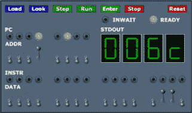
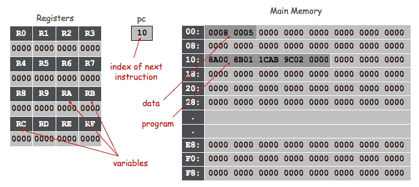
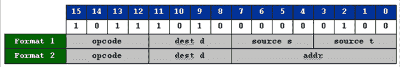

# 6.2   TOY 机器

> 原文：[`introcs.cs.princeton.edu/java/62toy`](https://introcs.cs.princeton.edu/java/62toy)

本节正在建设中。

TOY 是一个虚构的机器（在普林斯顿创建），与古代计算机非常相似。我们今天研究它是因为它具有现代微处理器的基本特征。此外，它展示了简单的计算模型可以执行有用且非平凡的计算。在本文档中，我们描述如何使用和编程 TOY 机器。在 第七章 中，我们描述如何在硬件中构建这样一台机器。

**TOY 机器内部。** TOY 机器由算术逻辑单元、存储器、寄存器、程序计数器、开关、灯和几个按钮 *Load*、*Look*、*Step*、*Run*、*Enter*、*Stop* 和 *Reset* 组成。我们现在描述每个组件的功能。然后，我们将描述如何使用这些组件编写 TOY 机器语言程序。

**为什么学习 TOY。**

+   帮助我们理解计算机的真正工作原理。

+   将 Java 与机器相关联。

+   帮助我们理解 Java 引用和 C 指针。这使我们成为更好的程序员。

+   今天仍然有一些情况需要实际进���机器语言编程（或汇编语言），尤其是视频处理、音频处理和科学计算。程序员希望利用专为多媒体应用设计的先进计算机硬件的快速能力，包括英特尔的 MMX 和 SSE、苹果的 AltiVec 以及图形卡。游戏程序员编写手工调优的汇编程序进行像素着色和纹理映射以优化性能。计算科学家意识到相同的矢量操作同样适用于科学应用，将 FFT 应用于科学数据。

**字长。** TOY 机器有两种存储类型：主存储器和寄存器。每个实体存储一个信息 *字*。在 TOY 机器上，一个字是一个 16 位的序列。通常，我们将这 16 位解释为十六进制整数范围为 `0000` 到 `FFFF`。使用 *二进制补码表示*，我们也可以将其解释为十进制整数范围为 -32,768 到 +32,767。请参阅第 5.1 节以了解数字表示和二进制补码整数的刷新知识。

**主存储器。** TOY 机器有 256 个 *主存储器* 字。每个存储位置都带有唯一的 *存储器地址*。按照惯例，我们使用十六进制整数范围为 `00` 到 `FF`。将存储位置视为邮箱，存储器地址视为邮政地址。主存储器用于存储指令和数据。

**寄存器。** TOY 机器有 16 个 *寄存器*，从 `0` 到 `F` 索引。寄存器与主存储器非常相似：每个寄存器存储一个 16 位字。但是，寄存器提供了比主存储器更快的存储形式。寄存器在计算过程中用作临时空间，并在 TOY 语言中扮演变量的角色。寄存器 0 是一个特殊寄存器，其输出值始终为 0。

**程序计数器。** *程序计数器* 或 `pc` 是一个额外的寄存器，用于跟踪下一条要执行的指令。它存储 8 位，对应于十六进制整数范围为 `00` 到 `FF`。这个整数存储了要执行的下一条指令的内存地址。

**核心转储。** *核心转储* 是在特定时间点机器内容状态的完整列表。核心转储提供了机器的操作记录，并完全确定了机器将要做什么。数据和程序都存储在主存储器中，程序员需要确保数据被视为数据，指令被视为指令。

**输入**。*开关*和*加载*按钮用于将指令和数据输入到机器中。开关的行为就像普通的灯开关：它们要么打开，要么关闭。有 8 个*内存地址开关*可选择 256 个可能的内存地址中的一个。还有 16 个*数据开关*可选择要加载到相应内存位置的 16 位整数。要将数据输入到内存中，您需要设置适当的内存和数据开关，然后按下*加载*按钮。这种繁琐的过程需要为每个内存位置重复。所有寄存器和内存位置最初都是`0000`；程序计数器最初为`10`。

**输出**。*内存地址开关*、*灯*和*查看*按钮用于在程序执行时显示主存储器中一个字的地址和内容。要选择要查看的主存储器中的字，您需要设置 8 个内存地址开关并按下*查看*按钮。现在，8 个地址灯显示所选的内存地址（此刻与地址开关相同）。16 个数据灯显示该内存位置的内容。老程序员通常可以通过盯着内存灯的模式来知道程序的哪一部分正在执行。

**运行机器**。要执行 TOY 程序，您首先需要将程序和数据逐个字地输入到主存储器中，如下所述。然后，您设置程序计数器的初始值：为此，将内存地址开关设置为所需值（通常为`10`）并按下*查看*。现在，您可以按下*运行*或*步进*按钮来启动计算。从这一点开始，TOY 机器以特定、明确定义的方式执行指令。首先，它检查程序计数器的值并获取该内存位置的内容。接下来，它将程序计数器增加 1。（例如，如果程序计数器为`10`，则增加到`11`。）最后，它将此数据解释为指令并根据以下规则执行。每个指令都可以修改各种寄存器、主存储器甚至程序计数器本身的内容。它还可以将整数输出到 LED 标准输出。如果程序需要从标准输入读取值，则*INWAIT*灯会激活，机器会等待用户使用数据开关输入一个 16 位整数，并按下*输入*按钮。执行指令后，整个获取-执行循环会重复，使用程序计数器的新值获取下一条指令。这将永远持续下去，或直到机器执行停机指令。与 Java 一样，可以编写进入无限循环的程序。通过拔掉插头或按下*停止*按钮，始终可以停止 TOY 机器。

**冯·诺伊曼机**。TOY 机器的一个基本特征是将计算机程序存储为数字，数据和程序都存储在*同一*主存储器中。1945 年，普林斯顿学者约翰·冯·诺伊曼首次推广了这种*存储程序模型*或*冯·诺伊曼机*。它使计算机能够执行任何类型的计算，而无需用户物理更改或重新��置硬件。相比之下，要编程 ENIAC 计算机，操作员必须手动插入电缆并设置开关。这是相当繁琐和耗时的。这种存储程序机器的简单但基本思想已被纳入所有现代数字计算机中。

由于程序和数据共享同一空间，机器可以在执行时修改其数据或程序本身。也就是说，代码和数据是相同的，或者至少可以是相同的。当程序计数器引用内存时，内存被解释为指令，当指令引用内存时，内存被解释为数据。将程序视为数据的能力至关重要。考虑一下当您想要从远程位置下载程序时会发生什么，例如，`download.com`。这与接收电子邮件或任何其他数据没有区别。编译器和调试器也是读取其他程序作为输入数据的程序。将程序视为数据并非没有危险。计算机病毒是（恶意的）通过编写新程序或修改现有程序来传播的���序。

事后看来冯·诺伊曼的想法可能显而易见。然而，围绕存储程序模型构建计算机是否能像可以重新布线和重新配置的计算机一样强大并不明显。事实上，只要基本指令集足够丰富（正如 TOY 机器的情况），物理重新配置计算机的能力并不能使您解决更多问题。这是艾伦·图灵关于*Turing 机*的先前工作的结果，我们在第五章中学习过。

## 指令集架构

*指令集架构*（ISA）是 TOY 编程语言和执行程序的物理硬件之间的接口。ISA 指定了主存储器的大小、寄存器数量和每条指令的位数。它还准确指定了机器能够执行的每个指令以及如何解释每个指令位。

**TOY ISA。** TOY 机器有 256 个字的主存储器，16 个寄存器和 16 位指令。有 16 种不同的指令类型；每种指令由`0`到`F`中的一个*操作码*指定。每个指令以完全指定的方式操作内存、寄存器或程序计数器的内容。这 16 个 TOY 指令分为三类：算术逻辑、内存和寄存器之间的传输以及流程控制。下表给出了简要摘要。（这里是 TOY 备忘单的文本版本。）我们稍后会更详细地描述它们。

| OPCODE | 描述 | 格式 | 伪代码 |
| --- | --- | --- | --- |
| 0 | *停止* | - | `exit` |
| 1 | *加* | 1 | `R[d]` |
| 2 | *减* | 1 | `R[d]` |
| 3 | *与* | 1 | `R[d]` |
| 4 | *异或* | 1 | `R[d]` |
| 5 | *左移* | 1 | `R[d]` |
| 6 | *右移* | 1 | `R[d] > R[t]` |
| 7 | *加载地址* | 2 | `R[d]` |
| 8 | *加载* | 2 | `R[d]` |
| 9 | *存储* | 2 | `mem[addr]` |
| A | *间接加载* | 1 | `R[d]` |
| B | *间接存储* | 1 | `mem[R[t]]` |
| C | *分支零* | 2 | `if (R[d] == 0) pc` |
| D | *分支正数* | 2 | `if (R[d] > 0) pc` |
| E | *跳转寄存器* | - | `pc` |
| F | *跳转并链接* | 2 | `R[d]` |

每个 TOY 指令由 4 个十六进制数字（16 位）组成。最前面（最左边）的十六进制数字编码了 16 个操作码中的一个。第二个（从左边数）十六进制数字指的是 16 个寄存器中的一个，我们称之为*目标寄存器*，用`d`表示。最右边的两个十六进制数字的��释取决于操作码。对于*格式 1*操作码，第三和第四个十六进制数字分别被解释为寄存器的索引，我们称之为两个*源寄存器*，用`s`和`t`表示。例如，指令`1462`将寄存器`s` = 6 和`t` = 2 的内容相加，并将结果放入寄存器`d` = 4。对于*格式 2*操作码，第三和第四个十六进制数字（最右边的 8 位）被解释为内存地址，我们用`addr`表示。例如，指令`9462`将寄存器`d` = 4 的内容存储到内存位置`addr = 62`。请注意，格式 1 和格式 2 指令之间没有歧义，因为每个操作码都有唯一的格式。

**现代微处理器和 ISA。** 今天，在现代微处理器上使用了各种 ISA：IA-32（英特尔，AMD），PowerPC（IBM，摩托罗拉），PA-RISC（惠普），以及 SPARC（SUN Microsystems）。这些 ISA 通常访问数百万字的主存储器，每个字长为 32 或 64 位。例如，IA-32 有 8 个 32 位通用寄存器；PowerPC 有 32 个 64 位通用寄存器。指令类型的数量从几十个到几百个不等。ISA 的选择是为了便于构建底层硬件和编译器，同时努力最大化性能并最小化成本。不幸的是，有时为了与过时硬件保持向后兼容性，这两个目标都会被牺牲。总是需要权衡。

TOY 机器具有现代微处理器的所有基本特征。然而，它更容易理解，因为它只有 16 条指令和两种指令格式。相比之下，IA-32（用于英特尔 PC 的那种）有 100 多种指令类型和十几种不同的指令格式。作为一种编程语言，TOY 也比 Java 编程语言简单得多。这使得完全理解更容易，但不一定容易编写代码或调试。*Java 编译器*（例如，`javac`）是一个自动将 Java 代码转换为要在其上执行的计算机的 ISA 的程序。您很快就会体会到在高级语言如 Java 中工作的便利性。

#### Q + A

Q. 古代程序员真的要翻转开关来输入程序吗？

A. 是的。后来他们转向使用打孔卡作为更持久的存储形式。

Q. 寄存器和内存单元之间有什么区别？

A. 两者都存储 16 位整数。然而，在 TOY 机器中，所有计算（加法，减法等）只能在寄存器内容上执行，而不是在主存储器上执行。要在内存单元上执行算术运算，必须先将其转移到寄存器，然后再转回。希望尽可能使寄存器尽快，因此它们通常由比主存储器更昂贵的材料构建，尽管原则上两者只是存储 16 位。这类似于计算机 RAM（稀缺且昂贵）和硬盘驱动器（丰富且便宜）之间的区别。

Q. 今天还在制造特殊用途的计算机或微处理器吗？

A. 是的，因为在硬件中可以比在软件中更快地执行简单操作。恩尼格玛机是二战期间德国人使用的一种专用加密机。艾伦·图灵在布莱切利园领导一个团队建造了图灵破解机，其唯一功能是破解恩尼格玛密码。这里有一个[恩尼格玛套件](http://www.xat.nl/enigma-e/desc/index.htm)，您可以购买来自己组装。一些现代例子包括：信号处理、Deep Blue 用于评估棋盘位置的棋盘芯片、N 体模拟芯片、可以操作 2048 位整数的密码学芯片。天体物理学家使用一种非常专门的芯片来计算粒子之间的牛顿引力。其��最成功的芯片之一是[GRAPE-6](http://grape.astron.s.u-tokyo.ac.jp/~makino/grape6.html)，每块板可以达到一万亿次浮点运算每秒，64 块处理器板可以持续达到 64 万亿次每秒的速度。这可能是世界上最快的计算机，尽管它只擅长这一项专门任务。

Q. 加载地址、加载和间接加载之间有什么区别？

A. 所有三条指令都将某个值加载到寄存器中。Load address 是最简单的：`7C30`将值`0030`加载到寄存器 C 中。Load 和 load indirect 都将某个内存单元的内容复制到寄存器中。假设内存位置`30`包含`AAAA`，内存位置`31`包含`BBBB`，寄存器 A 存储值`0031`。那么`8C30`将值`AAAA`加载到寄存器 C 中，而`AC0A`将值`BBBB`加载到寄存器 C 中。

Q. `E100`和`E1CC`有什么区别？

A. 没有区别。使用操作码`E`时，最后两个十六进制数字被忽略。类似地，使用操作码`A`和`B`时，第三个十六进制数字被忽略。使用操作码`0`时，最后三个十六进制数字被忽略。

Q. 如果寄存器 C 包含一个大于 15 的值，`5ABC`（左移）会发生什么？

A. 由于只有左移 15 个位置才有意义，TOY 只考虑寄存器 C 的最后一个十六进制数字来确定要移位的位数。因此，如果寄存器 C 是`FFFD`（-3），那么左移不会变成右移 3 位。

Q. 如果程序计数器是`FF`会发生什么？

A. 机器将尝试读取存储在内存位置`FF`的任何值。由于`FF`用于标准输入，机器将从标准输入获取下一条指令。然后程序计数器将增加到`00`。对于 TOY 程序员来说，准备编写这样一个意图的程���是极为罕见的。

#### 练习

1.  TOY 机器的总存储位数是多少？包括寄存器、主存储器和程序计数器。

1.  TOY 使用 8 位内存地址，这意味着可以访问 256 个字的内存。一台 32 位机器可以访问多少个字的内存？一台 64 位机器可以访问多少个字的内存？

1.  一台具有 1GB 内存的 Pentium IV 有多少个*字*的主存储器？Pentium IV 是一台 32 位机器。

1.  一台具有 1GB 内存的 Mac G5 有多少个*字*的主存储器？G5 处理器是一台 64 位机器。

1.  给出一个单独的指令，将程序计数器更改为内存地址`15`，而不考虑任何寄存器或内存单元的内容。

    *答案*：`C015`或`F015`。这两个指令都依赖于寄存器 0 始终为`0000`。

1.  列出七个指令（具有不同的操作码），将`0000`放入寄存器 A。

    *答案*：`1A00`，`2Axx`，`3A0x`，`4Axx`，`5A0x`，`6A0x`，`7A00`，其中`x`是任意十六进制数字。

1.  列出三种方式（不同的操作码）将程序计数器设置为`00`，而不改变任何寄存器或内存单元的内容。

    *答案*：`C000`，`E0xy`，`F000`。

1.  列出五个指令（具有不同的操作码），它们是空操作。排除目标寄存器为 0 的情况。

    *答案*：`1xx0`，`1x0x`，`2xx0`，`3xxx`，`5xx0`，`6xx0`，其中`x`是除 0 以外的任意十六进制数字。

1.  列出一个 Format 2 指令，它是一个空操作。

    *答案*：`D0xy`，其中`xy`是任意两位十六进制数字。

1.  列出六种将寄存器 B 的内容赋值给寄存器 A 的方法。

    *答案*：`1AB0`，`1A0B`，`2AB0`，`3ABB`，`4A0B`，`4AB0`，`5AB0`，和`6AB0`。其中`x`是任意十六进制数字。

1.  TOY 中没有*按位或*运算符。（在 Java 中是`|`。）解释如何计算 RC *答案*：`3DAB 4EAB 1CDE`。

1.  TOY 中没有*按位或*运算符（或 Java）。解释如何计算 RC TOY 中没有*按位 nand*运算符（或 Java）。解释如何计算 RC TOY 中没有*按位非*运算符。（在 Java 中是`~`。）解释如何计算 RB *答案*：`7101 2B01 4BAB`或`7101 2B01 2BBA`。

1.  TOY 中没有*绝对值*函数。解释如何计算 RB TOY 中没有*非负分支*运算符。解释如何在寄存器 A 大于或等于 0 时跳转到内存地址`15`。

    *答案*：连续使用正分支和零分支：`CA15 DA15`。

1.  证明*减法*运算符是多余的。也就是说，解释如何通过一系列不涉及操作码 2 的 TOY 指令来计算`RC`。

1.  16 个 TOY 指令中有哪些不使用全部 16 位？ *答案*：halt（仅使用前 4 位），load indirect（不使用第三组 4 位），store indirect（不使用第三组 4 位），jump register（不使用最后 8 位）。

1.  我们根据二进制补码表示法将一些 TOY 整数解释为负数。这只对哪些指令有影响？

    *答案*：*正数分支*将`0001`到`7FFF`之间的整数视为正数。*右移*是有符号移位，因此如果最左边的位是 1，则 1 会被添加到开头。所有其他指令（甚至减法！）不依赖于 TOY 是否具有负整数。

#### 创意练习
