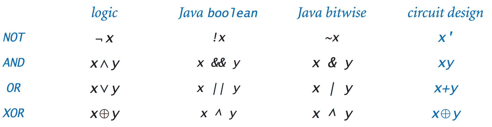
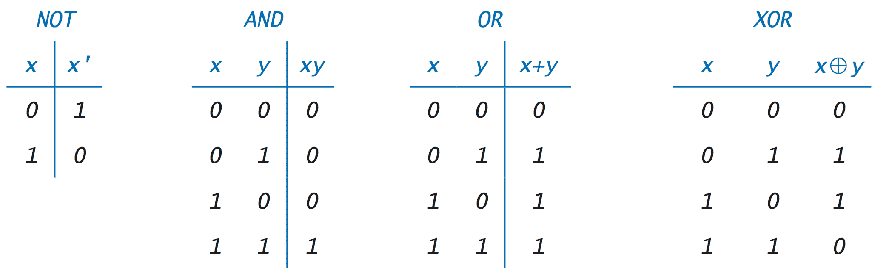
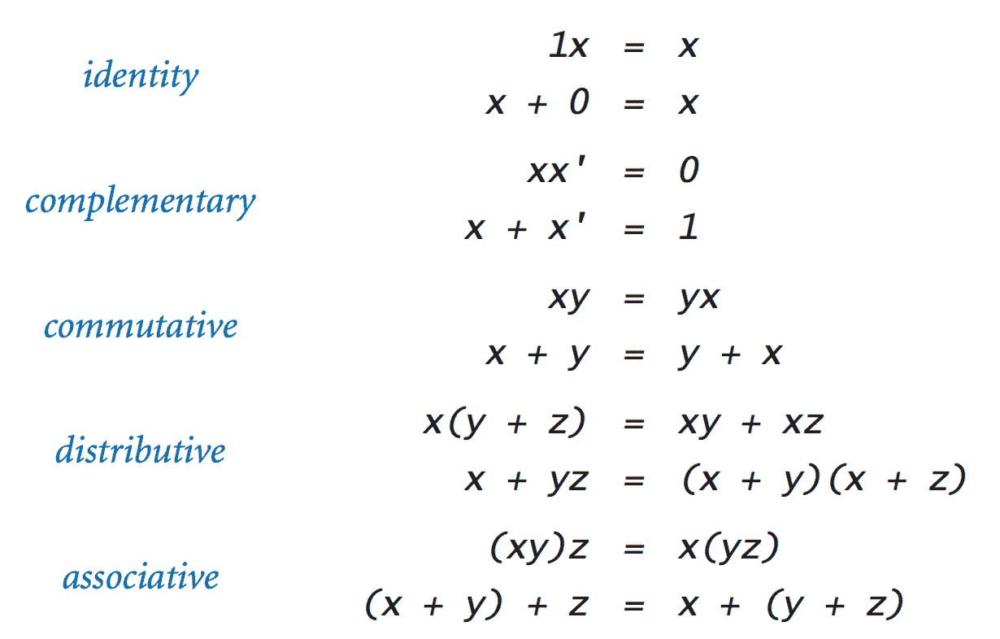
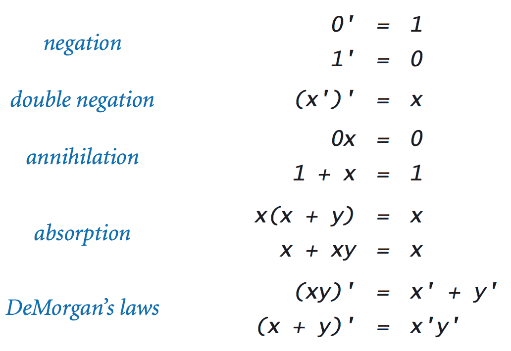
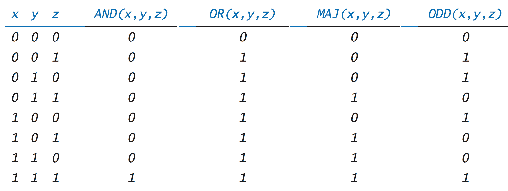
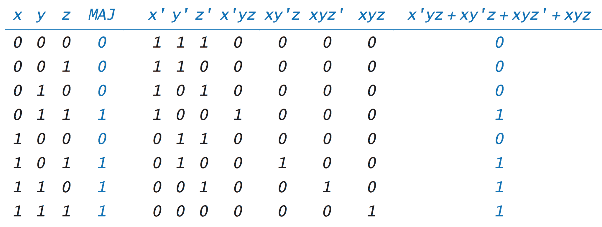
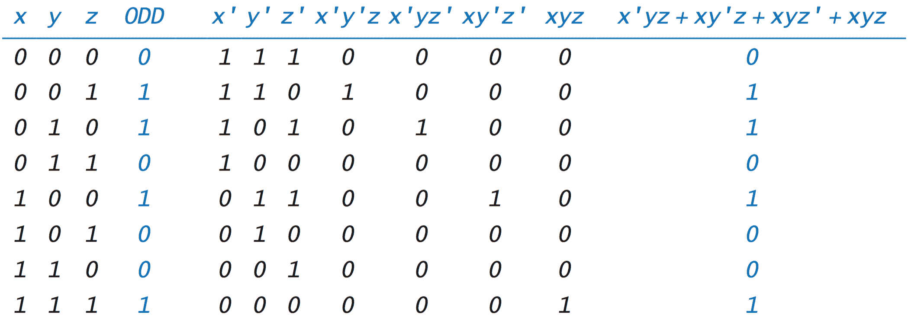

# 7.1   布尔逻辑

> 原文：[`introcs.cs.princeton.edu/java/71boolean`](https://introcs.cs.princeton.edu/java/71boolean)
> 
> 译者：[飞龙](https://github.com/wizardforcel)
> 
> 协议：[CC BY-NC-SA 4.0](https://creativecommons.org/licenses/by-nc-sa/4.0/)

*布尔函数*是将参数映射到值的数学函数，其中范围（函数参数）���定义域（函数值）的允许值只有两个值— `*true*`和`*false*`（或`*0*`和`*1*`）。布尔函数的研究被称为*布尔逻辑*。

## 布尔函数。

要定义任何布尔函数，我们只需指定其在输入的每个可能值上的值。*非*函数是一个具有一个变量的布尔函数。

> $$ \quad\quad\quad\quad\quad\quad \begin{align} NOT(x) &\;=\; \begin{cases} 1 & \text {如果$x$是$0$} \\[1ex] 0 & \text {如果$x$是$1$} \end{cases} \end{align} $$

*与*、*或*和*异或*函数是熟悉的两个变量的布尔函数。

> $$ \quad\quad\quad\quad\quad\quad \begin{align} AND(x, y) &\;=\; \begin{cases} 1 & \text {如果$x$和$y$都是$1$} \\[1ex] 0 & \text {否则} \end{cases} \\ \\ OR(x, y) &\;=\; \begin{cases} 1 & \text {如果$x$或$y$（或两者）是$1$} \\[1ex] 0 & \text {否则} \end{cases} \\ \\ XOR(x, y) &\;=\; \begin{cases} 1 & \text {如果$x$和$y$不同} \\[1ex] 0 & \text {否则} \end{cases} \end{align} $$

+   *符号.* 对于基本布尔函数，存在许多竞争的符号。在本章中，我们主要使用电路设计符号。

    > 

+   *真值表.* 定义布尔函数的一种方法是指定其在参数的每个可能值上的值。我们使用*真值表*以有组织的方式这样做。真值表有一个列用于每个变量，一行用于每个变量值的可能组合，以及一列指定该组合的函数值。

    > 

    一个由*n*个变量组成的函数的真值表有 2^(*n*)行。

+   *布尔代数.* 布尔代数指的是由布尔变量和布尔运算符组成的表达式的符号操作。来自代数的熟悉的*恒等式*、*交换律*、*分配律*和*结合律*以及两个*互补*公理定义了布尔代数的公理。

    > 

    此外，您可以从这些公理中推导出许多其他定律。例如，表中的最后一个条目给出了两个特殊的恒等式，称为*德摩根定律*。

    > 

+   *Java 中的布尔代数.* 您可以以两种不同的方式将布尔代数纳入您的 Java 程序中。

    +   Java 的布尔数据类型：在第 1.2 节中，我们介绍了具有值`*true*`和`*false*`以及使用运算符`&&`、`||`和`!`的`*AND*`、`*OR*`和`*NOT*`操作的布尔操作。

    +   整数值的位操作：在第 6.1 节中，我们讨论了 Java 的位操作，它使用`*AND*`、`*OR*`、`*NOT*`和`*XOR*`运算符对整数值的二进制表示中的每个位进行操作，分别使用运算符`&`、`|`、`~`和`^`。

## 三个或更多变量的布尔函数。

随着变量数量的增加，可能函数的数量急剧增加。有 2⁸个不同的三变量布尔函数，有 2¹⁶个四变量函数，有 2³²个五变量函数，依此类推。几个这样的函数在计算和电路设计中起着关键作用，因此我们现在将对它们进行考虑。

+   *AND 和 OR 函数.* 对于多个参数的`*AND*`和`*OR*`函数的定义从我们的两个参数的定义自然地推广：

    > $$ \quad\quad\quad\quad\quad\quad \begin{align} AND(x_1, x_2, \ldots, x_n) &\;=\; \begin{cases} 1 & \text {如果所有参数都为$1$} \\[1ex] 0 & \text {否则} \end{cases} \\ \\ OR(x_1, x_2, \ldots, x_n) &\;=\; \begin{cases} 1 & \text {如果任何参数为$1$} \\[1ex] 0 & \text {否则} \end{cases} \\ \end{align} $$

+   *多数和奇偶函数。* 我们考虑数字电路设计中出现的另外两个函数：*多数*和*奇偶*函数：

    > $$ \quad\quad\quad\quad\quad\quad \begin{align} MAJ(x_1, x_2, \ldots, x_n) &\;=\; \begin{cases} 1 & \text {如果$1$的参数比$0$的参数多} \\[1ex] 0 & \text {否则} \end{cases} \\ \\ ODD(x_1, x_2, \ldots, x_n) &\;=\; \begin{cases} 1 & \text {如果参数中有奇数个$1$} \\[1ex] 0 & \text {否则} \end{cases} \\ \end{align} $$

+   *布尔表达式。* 与两个变量的布尔函数一样，我们可以使用真值表来明确指定布尔函数。

    > 

    这种表示法对于具有更多变量的函数很繁琐，并且在变量较多时很快失效，因为对于*n*个变量，所需的行数为 2^(*n*)。相反，我们通常更喜欢使用*布尔表达式*来定义布尔函数。例如，很容易验证这两个恒等式：

    > $$ \quad\quad\quad\quad\quad\quad \begin{align} AND(x_1, x_2, \ldots, x_n) &\;=\; x_1 x_2 \ldots x_n \\ \\ OR(x_1, x_2, \ldots, x_n) &\;=\; x_1 + x_2 + \ldots + x_n \end{align} $$

+   *积和表示法。* 布尔代数的一个基本结果是，每个布尔函数都可以用一个使用`*AND*`、`*OR*`和`*NOT*`运算符而没有其他运算符的表达式来表示。例如，考虑以下真值表：

    > 

    由于这两列对于变量的每个值都相等，所以蓝色突出显示的两列代表以下等式的证明：

    > $$\quad\quad\quad\quad\quad\quad MAJ(x, y, z) = x'yz + xy'z + xyz' + xyz$$

    我们可以从布尔函数的真值表中推导出这样的表达式：对于真值表中函数值为 1 的每一行，我们创建一个项，如果输入变量在该行上具有相应的值，则该项为 1，否则为 0。每个项是每个输入变量的乘积（如果该行上的对应条目为 1）或其否定（如果条目为 0）。所有这些项的和给出了函数。

    我们构建的布尔表达式称为函数的*积和表示法*或*合取范式*。作为另一个例子，这是奇偶函数的表格：

    > 
