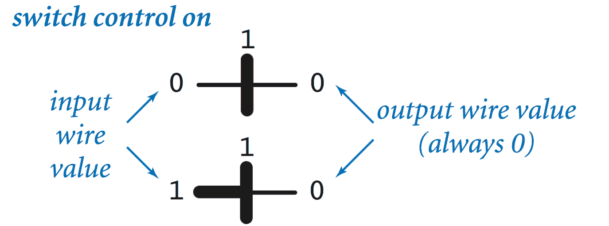

# 7.2   基本电路模型

> 原文：[`introcs.cs.princeton.edu/java/72circuit`](https://introcs.cs.princeton.edu/java/72circuit)

本章节正在大规模施工中。

*电路*是一个相互连接的网络，由*导线*、*电源连接*和*受控开关*组成，将输入导线上的值转换为输出导线上的值。在我们的二维几何表示中，导线对应于平面上绘制的线段；受控开关对应于以特定方式交叉的导线；电路对应于在矩形内绘制的导线。我们通过绘制定义电路边界的矩形来封装电路。输入是终止在边界处的导线；输出则延伸到边界之外。

>        

## 导线。

导线连接到电源，携带值，并连接到电路元素。一些导线被指定为*输入*；另一些被指定为*输出*。每根导线始终处于两种状态之一（0 或 1）。连接的导线必须具有相同的值。当我们跟踪电路中导线的值时，我们用粗线表示值为 1 的导线，用细线表示值为 0 的导线。

## 电源源。

我们假设输入中的一个始终为 1，并使用*电源点*表示连接到电路中任何位置的输入。连接到电源点的导线的值为 1，除非该连接断开。

## 受控开关。

*受控开关*是电路中一个地方，其中*开关控制线*穿过另一根导线然后结束。开关控制线的值变化可以断开与其交叉的导线中的电源连接，从而改变该导线的值。

+   *开/关开关.* 一个*开/关开关*是连接到电源（1）的导线，被开关控制线穿过。如果开关控制线值为 0，则输出导线值为 1；如果控制线值为 1，则输出导线值为 0。

    >        

+   *输入/关闭开关.* 更一般地，我们可以将受控开关视为具有任意输入值（不一定为 1）。从逻辑上讲，开关的操作很简单：如果开关控制线为 0，则输入和输出导线连接，因此具有相同的值（都为 0 或都为 1）；如果开关控制线为 1，则输入和输出导线不连接，因此输出导线的值为 0（无论输入导线的值如何）。

    >        

+   *布局约定.* 在绘制受控开关时，我们不会明确区分输入和输出。在我们所有的电路中，这种区分是清晰的，因为输入始终是连接到电源或另一个开关的导线。

+   *一个物理例子.* 在*继电器*中，控制线连接到一个电磁铁，它吸引一个小金属片，可以连接输入导线和输出导线，但也连接到一个弹簧。如果电磁铁关闭，弹簧保持输入连接到输出；如果电磁铁打开，它施加的力比弹簧更大，以拉动连接件以断开输入和输出之间的连接。

    > 

## 电路。

+   *开关电路分析.*

    >               

+   *组合电路.*

+   *时序电路.*

## 逻辑设计与现实世界。

#### 练习

1.  以下电路的输出将在什么条件下为 0？

    > 

    *解决方案*：只有当所有输入都为 0 时，输出才为 0。这是一个多路或非门。

1.  说明前一个练习中电路输出为 1 的条件。

    *解决方案*：只有当任一输入为 1 时，输出才为 1。这是一个多路或门。

1.  以下电路的输出将在什么条件下为 1？

    > 

    *解决方案*：只有当所有输入都为 1 时，输出才为 1。这是一个多路与门。

1.  说明前一个练习中电路输出为 0 的条件。

    *解决方案*：只有当任一输入为 0 时，输出才为 0。这是一个多路与非门。
