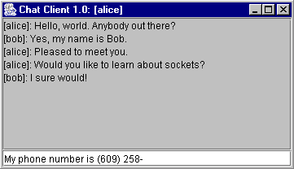
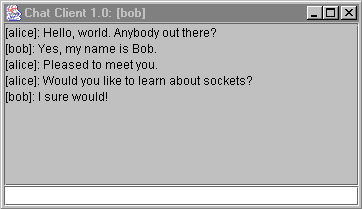

# 8.4 网络

> 原文：[`introcs.cs.princeton.edu/java/84network`](https://introcs.cs.princeton.edu/java/84network)
> 
> 译者：[飞龙](https://github.com/wizardforcel)
> 
> 协议：[CC BY-NC-SA 4.0](https://creativecommons.org/licenses/by-nc-sa/4.0/)


本节正在进行重大改建。

[互联网时间线](http://www.zakon.org/robert/internet/timeline)。

**网络.** 客户端-服务器模型，点对点网络。

**TCP/IP.** 由鲍勃·卡恩（Bob Kahn）和文特·瑟夫（Vint Cerf）创建。

**万维网.** 范尼瓦·布什（Vannevar Bush）是一位有远见的人，他在一篇著名的 1945 年论文[我们可能认为的](http://www.theatlantic.com/unbound/flashbks/computer/bushf.htm)中描述了后来成为互联网的东西。他的论文描述了一种存储信息和使用链接从一条数据到另一条数据的理论模型。泰德·纳尔逊（Ted Nelson）和道格·恩格尔巴特（Doug Englebart）将这个想法发展成了我们现在所知道的超文本。1980 年，[蒂姆·伯纳斯-李](http://www.ibiblio.org/pioneers/lee.html)实现了布什的梦想。他使用 HTML（超文本标记语言）格式化超文本，并编写了一个他称之为*WorldWideWeb*的浏览器和第一个 Web 服务器 info.cern.ch。在 1990 年代中期，使用 WWW 变得流行，现在已经成为日常学生生活中不可或缺的部分。

**协议.**

```java
telnet www.nytimes.com 80
Trying 199.239.136.200...
Connected to www.nytimes.com.
Escape character is '^]'.
GET /2003/12/23/technology/23linux.html HTTP/1.0
Host: www.nytimes.com
Referer: http://news.google.com

```

**Web 服务器.** Java 使与 Web 服务器通信变得容易。数据类型`URL`代表的是*统一资源定位符*。资源可以是文件或网站。要读取网站的内容，请使用我们的`In`类。

```java
In in = new In("http://www.cnn.com");
while (in.hasNextLine()) {
    String line = in.readLine();
    System.out.println(line);
}    

```

**Traceroute.** 我的数据包如何从 A 到 B，需要多长时间才能到达？

> |
> 
> ```java
> % traceroute cornell.edu
> traceroute to cornell.edu (132.236.56.6), 30 hops max, 40 byte packets
>  1  ignition (128.112.139.1)  0.860 ms  0.599 ms  0.653 ms
>  2  fw-mgmt (128.112.138.2)  1.209 ms  0.493 ms  0.532 ms
>  3  csgate-subnet193-192 (128.112.139.193)  1.017 ms  0.957 ms  0.838 ms
>  4  gigagate1.Princeton.EDU (128.112.128.114)  1.070 ms  0.956 ms  0.905 ms
>  5  vgate1.Princeton.EDU (128.112.12.22)  2.498 ms  0.998 ms  1.000 ms
>  6  local.princeton.magpi.net (198.32.42.65)  2.657 ms  2.823 ms  3.699 ms
>  7  remote1.abilene.magpi.net (198.32.42.210)  9.740 ms  5.872 ms  8.518 ms
>  8  nycmng-washng.abilene.ucaid.edu (198.32.8.84)  10.191 ms  9.677 ms  10.253 ms
>  9  nyc-gsr-abilene-nycm.nysernet.net (199.109.4.129)  9.892 ms  9.575 ms  9.620 ms
> 10  nyc-m20-nyc-gsr.nysernet.net (199.109.4.2)  9.997 ms  11.565 ms  11.049 ms
> 11  cornell-nyc-m20.nysernet.net (199.109.5.29)  16.958 ms  16.989 ms  17.246 ms
> 12  core1-msfc-dmz1.cit.cornell.edu (128.253.222.5)  17.504 ms  17.054 ms  17.038 ms
> 13  bb3-msfc-0000-07-vl7.cit.cornell.edu (128.253.222.167)  17.463 ms  18.548 ms  17.245 ms
> 14  cornell.edu (132.236.56.6)  17.142 ms *  17.352 ms
> 
> ```
> 
> **邮件.** 程序 Mail.java 使用套接字在端口 25 上创建一个 SMTP（简单邮件传输协议）客户端。这是一个用于发送电子邮件的简陋程序。如果您更改电子邮件中的发件人和回复地址会发生什么？您可能会惊讶地发现，SMTP 没有身份验证机制，因此您可以使电子邮件看起来像来自任何地方。这被称为*电子邮件欺骗*。欺骗有一些合法用途（例如，希望保持匿名的告密者），但大多数情况下被垃圾邮件发送者用来掩盖他们的身份。如果仔细检查这种伪造电子邮件的邮件头，您可以看到连接到端口 25 的机器的 IP 号码。然而，普通的互联网用户会被欺骗。当然，您不应该在未经收件人事先同意的情况下使用这种欺骗技术。在某些司法管辖区是违法的。*开放中继*是一个 SMTP 电子邮件服务器，处理既不��发件人也不是收件人的邮件。如果`smtp.princeton.edu`是一个开放中继，那么您可以从任何计算机上运行`Mail.java`，即使它在`princeton.edu`域之外。垃圾邮件发送者经常利用这样的开放中继来“洗钱”他们的电子邮件。开放中继使垃圾邮件发送者能够匿名发送大量电子邮件，使用他人的资源。如果您运行 Web 服务器，请确保不要运行开放中继。**回声客户端和服务器.** 程序 EchoClient.java 与服务器建立连接（在端口 4444 上），从标准输入读取行，将它们发送到服务器，并将服务器的响应打印回来。它使用 In.java 和 Out.java。程序 EchoServer.java 是配套的服务器程序。它在端口 4444 上监听来自客户端的连接请求。 （您可以使用从 1024 到 65536 的任何端口；端口 0-1023 保留用于“众所周知”的任务，例如，80 用于 http，21 用于 ftp）。收到请求后，它建立连接，从客户端读取行，并将它们回显给客户端。该语句
> 
> ```java
> ServerSocket serverSocket = new ServerSocket(4444);
> 
> ```
> 
> 创建一个在端口 4444 上监听连接请求的`ServerSocket`。关键行
> 
> ```java
> Socket clientSocket = serverSocket.accept();
> 
> ```
> 
> 使服务器等待直到连接请求到达，然后与客户端创建`Socket`连接。这是一个*阻塞语句*：程序在`accept`方法返回之前停止。服务器代码的另一个关键部分是：
> 
> ```java
> String s;
> while ((s = in.readLine()) != null) {
>     out.println(s);
> }
> 
> ```
> 
> 在这种情况下，`in`是来自客户端的输入流，`out`是发送到客户端的输出流。这个循环不断地从客户端读取字符串并将其回显给客户端。调用`readLine()`是*阻塞*的，因此程序会停止，直到它返回一个`String`。当客户端最终断开连接时，`readLine()`返回`null`，服务器可以继续。要执行服务器和客户端，请先启动服务器，然后执行客户端程序：
> 
> ```java
> OS X, Linux
> -----------
> % java EchoServer &
> % java EchoClient username localhost
> 
> Windows
> -----------
> > start java EchoServer
> > java EchoClient username localhost
> 
> ```
> 
> 程序 ChatClient.java 是`EchoClient.java`的简单 GUI 版本。用户在`JTextField`中输入消息，然后在希望将消息发送到服务器时按下回车键。结果会显示在`JTextArea`中。**线程、死锁和同步。** 两个线程同时运行。当两个（或更多）线程访问共享数据时，会发生*竞争条件*，并且结果行为会因"线程如何调度"而异。通过*锁定*对象来避免竞争条件，以便在对象解锁之前无法被另一个线程调用。一个线程可能需要等待另一个线程完成对对象的操作。可能会导致*死锁*。需要仔细协调。如果不小心，访问相同值的未同步代码块可能会破坏状态（给出示例）。另一方面，如果不小心，访问相同值的同步代码块可能会导致死锁（给出示例）。即使方法`set()`和`get()`是同步的，代码片段`a.set(a.get() + 1)`可能会导致不可预测的行为，如果另一个线程在调用`a.get`和`a.set`之间访问`a`。尽量避免使用线程编程；调试并发错误非常困难。**聊天服务器。** 回声客户端和服务器演示了两个程序通过套接字进行通信。但是，一次只有一个回声客户端可以与服务器通信。程序 ChatServer.java 使用线程允许任意数量的客户端同时连接。此外，它将接收到的每条消息广播给所有连接的客户端。这是一个基本的聊天室。它使用辅助类 Connection.java 和 ConnectionListener.java。对于客户端程序，我们可以完全重用 ChatClient.java，因为它已经完全符合我们的要求：它将消息发送到服务器，并回显服务器传输的所有内容。
> 
> > &#124;  &#124;  &#124;
> > 
> > &#124;   &#124;
> > 
> > &#124;  &#124;  &#124;
> > 
> *线程。* Java 使处理线程变得尽可能简单，但仍然是一个困难的任务，因为执行流程不再那么清晰。*同步。* `Connection.java` 是生产者/消费者关系的一个例子。每个 `Connection` 从客户端读取消息。`ConnectionListener` 从 `Connection` 中提取消息并将其广播给所有客户端。我们必须小心地同步这个活动，以确保每条消息只广播一次。当一条消息从客户端到达时，会调用 `setMessage()` 并设置变量 `message`。当准备将其广播给所有客户端时，会调用 `getMessage()` 来检索字符串。完成后，将 `message` 设置为 `null` 表示已完成消息。为了确保在中间没有 `getMessage()` 之前不会连续调用两次 `setMessage()`，我们使用 `wait()` 和 `notifyAll()` 锁定对象。如果在 `getMessage()` 广播上一条消息之前调用 `setMessage()`，那么 `message` 不是 `null`，因此 `setMessage()` 执行 `wait()` 语句。这会阻止 `setMessage()` 进一步执行，直到另一个方法调用 `notifyAll()`。当 `getMessage()` 处理完一条消息后，将 `message` 设置为 `null` 并调用 `notifyAll()` 解除 `setMessage()` 的阻塞。`synchronized` 关键字确保在特定时间内只有 `getMessage()` 和 `setMessage()` 中的一个方法执行。
> 
> ```java
> public synchronized String getMessage() {
>     if (message == null) return null;
>     String temp = message;
>     message = null;
>     notifyAll();
>     return temp;
> }
> 
> public synchronized void setMessage(String s) {
>     if (message != null) {
>         try                  { wait();               }
>         catch (Exception ex) { ex.printStackTrace(); }
>     }
>     message = s;
> }
> 
> ```
> 
> #### 问答
> #### 
> **Q.** 一个线程能否在已经持有锁的对象上调用同步方法？**A.** 能。Java 锁是可重入的。
> 
> #### 创意练习
> #### 
> 1.  **股票报价。** 编写一个程序，它接受一个命令行参数，即股票的三个字母符号，并查询网站，比如 cbs.marketwatch.com，并打印出股票的当前价格。
> 1.  
> 1.  **Curl.** Curl 是一个 Linux 程序，它以一个网页的名称作为命令行参数，并打印出其内容。
> 1.  
> 1.  **死链接检查器。** 编写一个程序，它以一个网页的 URL 作为命令行参数，并检查页面中的所有超链接是否有效。使用正则表达式来识别超链接。首先，只检查完全指定的 URL，例如以 `http://` 开头的。然后，允许相对超链接。
> 1.  
> |
