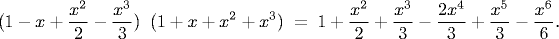
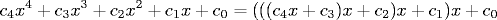
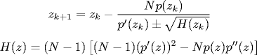
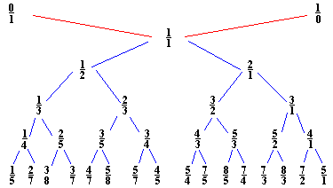

# 9.2   符号方法

> 原文：[`introcs.cs.princeton.edu/java/92symbolic`](https://introcs.cs.princeton.edu/java/92symbolic)
> 
> 译者：[飞龙](https://github.com/wizardforcel)
> 
> 协议：[CC BY-NC-SA 4.0](https://creativecommons.org/licenses/by-nc-sa/4.0/)


本节正在进行重大改造。

## 符号积分.

在初级微积分中，我们学习了各种不同函数的求导和积分规则。求导是一个机械过程，有大约半打通用规则。

+   *和差法则.* (f(x) ± g(x))′ = f′(x) ± g′(x).

+   *乘积法则.* (f(x) g(x))′ = f(x) g′(x) + g(x)f′(x).

+   *商法则.* (f(x)/g(x))′ = (f′(x) g(x) - g′(x) f(x)) / g²(x).

+   *幂法则.* (x^k)′ = kx^(k-1).

+   *链式法则.* (f(g(x))′ = f(g(x)) g′(x).

还有一些特殊函数的规则通常是推导一次然后记忆的，例如，sin(x)的导数是 cos(x)；exp(x)的导数是 exp(x)；ln(|x|)的导数是 1/x；sec(x)��导数是 sec(x) tan(x)；arcsin(x)的导数是(1 - x²)^(-1/2)。

另一方面，我们了解到不定积分是一个更难的问题。微积分学生通常学习一组特定的模式匹配规则，以找到一个变量函数的反导数。（以下，我们假设反导数的常数项为零。）

+   *常数法则.* cf(x)的反导数是 c 乘以 f(x)的反导数。

+   *求和法则.* f(x) + g(x)的反导数是 f(x)和 g(x)的反导数之和。

+   *多项式.* f(x) = x^b（其中 b ≠ 0 且 b ≠ 1）的反导数是 x^(b-1) / (b-1)。通过将此规则与前两个规则结合，我们可以确定任何多项式的反导数。

+   *查表法.* 记住各种简单函数的反导数。例如：sin(x)，tan(x)，arctan(x)。例如：a^x 的反导数是 a^x / ln a。

+   *替换法.* 当 f(x) = g(h(x))时通常很有用。例如：f(x) = sin(√x)或 f(x) 1/(1 + x²)，然后替换 x = tan t。并不总是明显应该替换什么。通常当你发现类似 sqrt(x² ± a²)的项时，三角替换有所帮助。

+   *分部积分.* f(x)g′(x)的反导数等于 f(x)g(x)减去 g(x)f′(x)的反导数。需要运气使函数分解为所需的项。还需要识别正确的模式。例如：x e^x 或 x² sin x 的反导数。[有趣的例子](http://en2.wikipedia.org/wiki/Integration_by_parts)强调了特定性：f(x) = e^x cos x 和 f(x) = ln(x)。

+   *对数法则.* 如果 f(x) = g′(x) / g(x)，那么 f(x)的反导数是 ln(|g(x)|)。例如：f(x) = tan(x) = sin(x) / cos(x) = -g'(x) / g(x)，其中 g(x) = cos(x)。因此，f(x)的反导数是 ln|sec(x)|。

+   *部分分式分解.* 例如：f(x) = (x⁴ - x³) / (x² + 2)(x - 3)。[参考链接](http://www.shu.edu/projects/reals/integ/techniqs.html)。需要将多项式除以多项式，使得分母的次数不小于分子的次数。需要因式分解并将多项式简化为最简形式。（欧几里得算法的泛化。）需要解一个线性方程组。多重根使事情变得更加复杂。该方法使我们能够积分两个多项式的所有分数。

+   *更多特定规则.* 这些规则是不够的。例如：f(x) = 1 / (x³ + x + 1).

编写一个计算机程序来执行符号积分似乎是一项艰巨的任务。在 20 世纪 60 年代初，只有人类才能找到函数的不定积分，除了最琐碎的情况。一种方法是模仿初级微积分课程中教授的方法 - 建立一个巨大的已知积分表并尝试模式匹配。在 19 世纪，Liouville 寻求了一个用于积分初等函数的算法。在 19 世纪，Hermite 发现了一个用于积分*有理函数*的算法 - 使用部分分数作为基本原始函数。*初等函数*是指可以通过有理值函数的有限嵌套对数、指数和代数数或函数序列获得的函数。由于√-1 是初等的，所有“常见”的三角和反三角函数（sin、cos、arctan）都属于这一类，因为它们可以使用虚数的指数和对数重新表达。并非所有初等函数都有初等不定积分，例如，f(x) = exp(-x²)，f(x) = sin(x²)，f(x) = x^x，f(x) = sqrt(1 + x³)。

对于积分初等函数（如果存在）找到一个有限的方法是符号积分的中心问题，持续了许多十年。Hardy（1916）指出“有理由认为不可能给出这样的方法”，也许预示了图灵关于不可判定性的后续结果。1970 年，Robert Risch 解决了这个问题，提供了一个可证明正确且有限的方法，用于积分任何不定积分是初等的初等函数。（实际上，他的方法并不是普遍适用的。要应用它，您需要解一个困难的微分方程。已经付出了大量努力来解决这个微分方程，以适用于各种初等函数。）这种方法的改进在现代符号代数系统（如 Maple 和 Mathematica）中很常见。工作还扩展到处理一些“特殊函数”。依赖于代数和数论的深刻思想。这些技术使数学家能够找到以前不知道或未列入表格的新积分，还能纠正已知积分集合中的错误！对于特别好奇的读者，这里有一个符号积分教程。

## 多项式。

多项式是一种非常特殊的初等函数类型。我们的目标是能够编写能够操作多项式并执行计算的程序，例如：

我们还希望能够评估给定值 x 的多项式。对于 x = 0.5，这个方程的两边的值都是 1.1328125。乘法、加法和多项式求值是许多数学计算的核心。许多应用程序用于简单操作（加、乘），更复杂操作（除法、gcd）有一些令人惊讶的应用，例如，[Sturm 算法](http://mathworld.wolfram.com/SturmFunction.html)用于找到给定区间内多项式的实根数，解多项式方程组，Groebner 基础。在系统和控制理论中广泛使用，因为常见信号的拉普拉斯变换导致两个多项式的比值。

*多项式 API。* 第一步是为多项式 ADT 定义 API。我们从系数和指数为整数的多项式开始。对于像多项式这样被充分理解的数学抽象，规范是如此清晰以至于无需言明：我们希望 ADT 的实例行为与充分理解的数学抽象完全相同。不可变。

```java
public Polynomial(int coef, int exp)
public Polynomial plus(Polynomial b)
public Polynomial minus(Polynomial b)
public Polynomial times(Polynomial b)
public Polynomial div(Polynomial b)
public Polynomial compose(Polynomial b)
public Polynomial differentiate(Polynomial b)
public int evaluate(int x)
public int degree()
public int compareTo(Polynomial b)
public String toString()

```

*一个示例客户端。* 程序 Binomial.java 从命令行读取一个整数 N，并打印出(1+x)^N 的展开式。

```java
Polynomial one      = new Polynomial(1, 0);   // 1 = 1 * x⁰
Polynomial x        = new Polynomial(1, 1);   // x = 1 * x¹
Polynomial binomial = one;
for (int i = 0; i < N; i++)
   binomial = binomial.times(x.plus(one));
System.out.println(binomial);

```

*实现。* 程序 Polynomial.java 使用整数数组`coef[]`表示一个具有整数次数`deg`的一元多项式，其中`coef[i]`记录*x^i*的系数。

```java
public class Polynomial {
    private int[] coef;      // coefficients
    private int deg;         // degree of polynomial

```

我们提供一个构造函数，它接受两个参数`a`和`b`，并创建单项式 ax^b。辅助方法`degree()`计算多项式的实际次数（如果`a`为零，则为零）。

```java
public Polynomial(int a, int b) {
    coef = new int[b+1];
    coef[b] = a;
    deg = degree();
}

```

要添加两个多项式`a`和`b`，我们循环遍历这两个数组并相加它们的系数。结果多项式的最大次数是`a.deg + b.deg`。我们将`c`初始化为次数为`N`且所有系数为零的多项式。我们要小心地保持不变式，即`c.deg`是多项式的实际次数（如果两个被加数的首项系数互相抵消，则可能与`a.deg + b.deg`不同）。

```java
public Polynomial plus(Polynomial b) {
   Polynomial a = this;
   Polynomial c = new Polynomial(0, Math.max(a.deg, b.deg));
   for (int i = 0; i <= a.deg; i++) c.coef[i] += a.coef[i];
   for (int i = 0; i <= b.deg; i++) c.coef[i] += b.coef[i];
   c.deg = c.degree();
   return c;
}

```

要将两个多项式相乘，我们使用基于分配律的基本算法。我们将一个多项式乘以另一个多项式中的每个项，使得 x 的幂匹配，然后将这些项相加以获得最终结果。

要在特定点（比如*x* = 3）评估多项式，我们可以将每个系数乘以适当的*x*幂，然后将它们全部相加。`evaluate`的实现使用了一种称为*霍纳法则*的直接最优算法，该算法基于括号化。

> 

以下代码片段使用霍纳法则执行多项式评估。

```java
public int evaluate(int x) {
   int p = 0;
   for (int i = deg; i >= 0; i--)
      p = coef[i] + (x * p);
   return p;
}

```

## 有理数算术。

程序 Rational.java 是一个非负有理数的抽象数据类型。它实现了以下接口��为了简化分数，我们使用欧几里得的最大公约数算法作为子程序来找到两个整数的最小公倍数（lcm）。

```java
Rational(int num, int dem)        // initialize
public double num()                // return numerator
public double den()                // return denominator
public String toString()           // print method
public Rational plus(Rational b)   // return this Rational + b
public Rational times(Rational b)  // return this Rational * b

```

## 任意精度算术。

`java.math`库提供了两个 ADT [BigInteger](http://docs.oracle.com/javase/6/docs/api/java/math/BigInteger.html) 和 [BigDecimal](http://docs.oracle.com/javase/6/docs/api/java/math/BigDecimal.html)，它们支持任意精度算术。

## Maple。

Maple 是一个流行的符号数学计算系统。它由滑铁卢大学的一个研究小组开发，并在许多大学提供。它可用于微积分、线性代数、抽象代数、微分方程、绘制函数和数值计算。它还是一种带有条件、循环、数组和函数的通用编程语言。

以下会展示基本算术和内置函数。请注意，给出的答案是精确的，除非我们明确转换为浮点数，否则不会进行浮点数近似。所有语句以分号结尾（在这种情况下结果会打印到屏幕上）或冒号结尾（在这种情况下结果会被抑制）。

```java
% maple
    |\^/|     Maple V Release 5 (WMI Campus Wide License)
._|\|   |/|_. Copyright (c) 1981-1997 by Waterloo Maple Inc. All rights
 \  MAPLE  /  reserved. Maple and Maple V are registered trademarks of
 <____ ____="">  Waterloo Maple Inc.
      |       Type ? for help.

> # arithmetic
> 1 + 1;      
                                               2
> # arbitrary precision arithmetic
> 2¹⁰⁰;
                                1267650600228229401496703205376

> # rational arithmetic

> # trigometric function
> sin(Pi/6); 
                                              1/2
> # exponential function
> exp(1);    
                                            exp(1)
# convert to floating point
> exp(1.0);
                                          2.718281828
> # 50 digits of precision
> Digits := 50:
> exp(1.0);
                      2.7182818284590452353602874713526624977572470937000
> Digits := 10:

> # an error
> 1 / 0;
Error, division by zero

> # complex numbers
> (6 + 5*I)⁴;
                                        -3479 + 1320 I
# built-in functions
> BesselK(1.0, -3.0);
                                 -.04015643113 - 12.41987883 I

> # base 10 logarithm
> log10;
                                            ln(100)
                                            -------
                                            ln(10)
# simplifying
> simplify(log10);
                                               2
# end the session
quit;

```

Maple 最强大的功能之一是支持符号变量。Maple 使用`:=`表示赋值语句，因为`=`保留用于数学相等。

```java
# assignment statements
> m := 10:
> a := 9.8:
> f := m * a;
                                           f := 98.0
> i := 10:
> i := i + 1;
                                            i := 11

> # polynomials
> expand((x+1)⁶);
                           6      5       4       3       2
                          x  + 6 x  + 15 x  + 20 x  + 15 x  + 6 x + 1

> # differentiation
> diff(sin(x*x), x);
                                                 2
                                          2 cos(x ) x
> # partial differentiation
> diff((x² - y) / (y³ - 1), x);           
                                               x
                                           2 ------
                                              3
                                             y  - 1
> # indefinite integration
> int(x³ * sin(x), x);  
                         3             2
                       -x  cos(x) + 3 x  sin(x) - 6 sin(x) + 6 x cos(x)

> # definite integration
> int(exp(-x²), x = 0..infinity);
                                                 1/2
                                           1/2 Pi

> # series summation
> sum(i, i = 1..100);      
                                             5050

factor(sum(i, i = 1..N));
                                         1/2 N (N + 1)

```

方程求解、数组、条件、循环、函数、库、矩阵，

```java
> # solve equation
> solve(x⁴ - 5*x² + 6*x = 2);
                                        1/2        1/2
                                  -1 + 3   , -1 - 3   , 1, 1

> # solving system of equations
> solve({x² * y² = 0, x - y = 1}); 
               {y = -1, x = 0}, {y = -1, x = 0}, {y = 0, x = 1}, {y = 0, x = 1}

> # find floating point solutions
> fsolve(x⁴ * sin(x) + x³*exp(x) - 1);
                                          .7306279509
> # maximize

> # user-defined functions
> f := x -> x²:
> f(9);

                                              81
> g := x -> sin(x) * exp(x):
> f(g(Pi/6));               
                                                      2
                                       1/4 exp(1/6 Pi)
> diff(f(g(x)), x);
                                         2                  2       2
                          2 sin(x) exp(x)  cos(x) + 2 sin(x)  exp(x)

> # absolute value function
> f := proc(x) if x > 0 then x else -x fi; end:
> f(-7);
                                               7

> f(7);

> # recursion
> mygcd := proc(p, q)
      if q = 0 then p
      else mygcd(q, p mod q)
      fi;
  end:
> mygcd(1440, 408);                                                  
                                              24

> # loops and conditionals
> # print primes of the form 2^i - 1
> for i from 1 to 600 do
      if isprime(2^i - 1) then print(i);
      fi;
  od;
                           2 3 5 7 13 17 19 31 61 89 107 127 521

> # arrays - Chebyshev polynomials (expand to keep it unfactored)
> p[0] := 1;
> p[1] := x;
> for i from 2 to 10 do
      p[i] := expand(2*x*p[i-1] - p[i-2])
  od;
> p[10]; 
                            10         8         6        4       2
                       512 x   - 1280 x  + 1120 x  - 400 x  + 50 x  - 1

> subs(x = 1/6, p[10]);
                                            12223
                                            ------
                                            118098

```

垃圾回收，变量是全局的，因此必须小心不要重复使用 - 可以使用`x := 'x'`重置。

*Maple 中的积分。* 当您在 Maple 中对一个函数进行积分时，它会尝试多种不同的积分方法。

1.  多项式。

1.  查表。

1.  启发式：替换、分部积分、部分分式、涉及三角函数和多项式的特殊形式

1.  Risch 算法：Horowitz 简化，Lazard/Rioboo/Trager 方法

见证 Maple 的实际操作，

```java
> infolevel[int] := 2;
> int(1 / (x³ + x + 1), x);
int/indef1:   first-stage indefinite integration
int/ratpoly:   rational function integration
int/rischnorm:   enter Risch-Norman integrator
bytes used=1000360, alloc=786288, time=0.14
int/rischnorm:   exit Risch-Norman integrator
int/risch:   enter Risch integration
int/risch:   the field extensions are
                                              [x]

unknown:   integrand is
                                              1
                                          ----------
                                           3
                                          x  + x + 1

int/ratpoly/horowitz:   integrating
                                              1
                                          ----------
                                           3
                                          x  + x + 1

int/ratpoly/horowitz:   Horowitz' method yields
                                         /
                                        |      1
                                        |  ---------- dx
                                        |   3
                                       /   x  + x + 1

int/risch/ratpoly:   Rothstein's method - factored resultant is
                                      3
                                   [[z  - 3/31 z - 1/31, 1]]

int/risch/ratpoly:   result is
                           -----
                            \                      2
                             )    _R ln(x - 62/9 _R  + 31/9 _R + 4/9)
                            /
                           -----
                          _R = %1

                                                  3
                                %1 := RootOf(31 _Z  - 3 _Z - 1)

int/risch:   exit Risch integration
                           -----
                            \                      2
                             )    _R ln(x - 62/9 _R  + 31/9 _R + 4/9)
                            /
                           -----
                          _R = %1

                                                  3
                                %1 := RootOf(31 _Z  - 3 _Z - 1)

```

*使用 Maple。*

```java
set Digits := 50;   // 50 digits of floating point precision
evalf(exp(1), 30);  
fsolve()...
solve()...
mod
argmin

```

#### 问与答

问：当我在 Maple 中遇到错误时，我无法返回到 Maple 提示符。

答：尝试输入一个分号然后回车。

#### 练习

1.  修改`Rational`的`toString()`方法，以便在分母为 1 时抑制它，例如，`5`而不是`5/1`。

1.  为多项式 ADT 添加`isOdd()`和`isEven()`方法，以指示多项式是奇数（所有非零系数具有奇数指数）还是偶数（所有非零系数具有偶数指数）。

1.  为`Rational`添加`equals()`和`compareTo()`方法。

1.  修改`Polynomial`的`toString()`方法，以便抑制 x¹ 项中的指数和常数项中的 x⁰。一些边界情况要检查：f(x) = 0, 1 和 x。

1.  为`Polynomial`添加一个`equals()`方法。

1.  使用以下方法避免`Rational`中的溢出：.... 检查`Rational`中的溢出，并在结果将溢出时抛出异常。

1.  为`Rational`添加一个`minus()`方法，并支持负有理数。

1.  编写一个程序 Taylor.java，创建一个包含 e^x、sin x 和 e^x sin x 的泰勒展开的前 10 项的多项式（有理系数）。

1.  展开(1-x)(1-x²)(1-x³)(1-x⁴)...(1-x^n)。当 n = 3 时，这是 1 -x - x² + x⁴ + x⁵ - x⁶。在极限情况下，所有系数都是 0、+1 或-1。

#### 创意练习

1.  **切比雪夫多项式。** *切比雪夫多项式*由以下方程的解定义

    ```java
    Tn(x) = cos(n arccos x)

    ```

    尽管解看起来是三角函数的，但其解是 x 的多项式。以下是前几个这样的多项式。一般来说，T(n) = 2x * T(n-1) - T(n-2)。

    ```java
    T0(x) = 1
    T1(x) = x
    T2(x) = 2x2 - 1
    T3(x) = 4x3 - 3x

    ```

    切比雪夫多项式在插值理论、逼近理论、数值积分、遍历理论、数论、信号处理和计算机音乐中具有许多特殊的算术性质，它们也源自微分方程：

    ```java
    (1 - x2) y''  - x y' + n2y = 0

    ```

    编写一个程序 Chebyshev.java，接受一个命令行参数 N，并打印出前 N 个切比雪夫多项式。

1.  **厄米特多项式。** 编写一个程序 Hermite.java，接受一个整数输入 N，并打印出前 N 个厄米特多项式。以下是前几个厄米特多项式。一般来说，H(n) = 2x * H(n-1) - 2(n-1) * H(n-2)。

    ```java
    H(0) = 1
    H(1) = 2x
    H(2) = 4x2 - 2
    H(3) = 8x3 - 12x

    ```

1.  **斐波那契多项式。** 编写一个程序`Fibonacci.java`，接受一个整��输入 N，并打印出前 N 个斐波那契多项式。以下是前几个斐波那契多项式。一般来说，F(n) = xF(n-1) + F(n-2)。

    ```java
    F(1) = 1
    F(2) = x
    F(3) = x2 + 1
    F(4) = x3 + 2x

    ```

    这个序列与斐波那契序列有什么关系？*提示*：在 x = 1 处评估多项式。

1.  **合成。** 添加用于合成两个多项式的方法，例如，`f.compose(g)`应返回多项式 f(g(x))。

1.  **拉盖尔方法。** 编写一个程序，使用拉盖尔方法找到多项式的实根或复根。给定一个 N 次多项式 p(z)和一个*复数*起始估计 z[0]，应用以下更新规则直到收敛。

    > 

    选择分母中项的符号以最小化|z[k+1] - z[k]|。拉盖尔方法具有比牛顿法更优越的全局收敛性质，并且如果多项式只有实根，则保证收敛到根。

1.  **费雷序列。** 阶数为 N 的[Farey 序列](http://mathworld.wolfram.com/FareySequence.html)是所有介于 0 和 1 之间的有理数（以最简分数形式表示），其分子和分母是介于 0 和 N 之间的整数的递增序列。

    ```java
    1:  0/1  1/1  
    2:  0/1  1/2  1/1  
    3:  0/1  1/3  1/2  2/3  1/1  
    4:  0/1  1/4  1/3  1/2  2/3  3/4  1/1  
    5:  0/1  1/5  1/4  1/3  2/5  1/2  3/5  2/3  3/4  4/5  1/1  

    ```

    编写一个程序 Farey.java，接受一个命令行参数 N，并打印出阶数为 N 的费雷序列。使用上面创建的有理数数据类型。

    要计算费雷序列，您可以使用以下惊人的关系：如果 m/n 和 m'/n'是费雷序列中顺序的两个元素，其阶数为 N，则下一个元素是 m''/n''，可以按照以下方式计算（其中除法是整数除法）：

    ```java
    m'' = ((n + N) / n') * m' - m
    n'' = ((n + N) / n') * n' - n

    ```

1.  **最佳有理逼近。** 新闻播音员经常试图将难以处理的比率（如 0.4286328721345）简化为一个近似的有理数，如 4/7，其分子和分母较小。如何做到这一点？答案取决于您愿意容忍的分母大小，因此我们的目标是列出最佳逼近值，让记者选择所需的一个。以下是数学常数 e 的最佳几个有理逼近值：

    ```java
    0/1 1/1 2/1 3/1 5/2 8/3 11/4 19/7 49/18 68/25
    87/32 106/39 193/71 685/252 878/323 1071/394 

    ```

    尽管 27/10 是对 e 的一个不错的近似值，但它被排除在列表之外，因为 19/7 提供了一个更好的近似值，且分母更小。[Stern-Brocot 树方法](http://www.cut-the-knot.com/blue/Stern.shtml) 提供了一个优雅的数学解决方案。以下是生成实数 x 的最佳上下有理近似值的算法：

    +   将左端点设置为 0/1，将右端点设置为 1/0。

    +   计算左右端点的中值。两个有理数 a/b 和 c/d 的*中值*是 (a+c)/(c+d)。

    +   如果中值等于 x（机器精度内），则停止。否则，如果中值小于 x，则将右端点设置为中值。否则，将左端点设置为中值。

    当你迭代上述过程时，如果它提供了更好的近似值，请打印出每个新项。编写一个程序 RationalApprox.java 来打印出这些最佳有理近似值。

    

    [www.cut-the-knot.com](http://www.cut-the-knot.com)

1.  **连分数。** 连分数是形式为 a0 + 1 / (a1 + 1 / ( a2 + 1 /a3) 的表达式，其中 a[i] 是整数。

    +   给定一个连分数展开 a0, a1, ..., an，编写一个程序来确定它对应的有理数。

    +   给定一个有理数，找到它的连分数展开。例如，159/46 = 3 + 21/46 = 3 + 1 / (46/21) = 3 + 1 / (2 + 4/21) = 3 + 1 / (2 + 1 / (21/4)) = 3 + 1 / (2 + 1 / (5 + 1/4))。

1.  **任意精度有理数算术。** 编写一个 ADT BigRational.java，实现任意精度有理数。*提示*：重新实现 Rational.java，但使用 `BigInteger` 代替 `int` 来表示分子和分母。

1.  **复有理数。** 实现一个数据类型 RationalComplex.java ComplexRational，支持实部和虚部为有理数的复数。在深度缩放 Mandelbrot 集的绘图中使用它，以避免浮点精度问题。（还要使用加倍技巧检查 Mandelbrot 序列中的循环。）

1.  **多项式次数。** 添加一个计算多项式次数的方法 `degree()`。警告：这可能不等于数组的大小，如果我们从两个原本次数为 10 的多项式中减去，我们可能得到一个次数为 4 的多项式。

1.  **有理多项式。** 创建一个 ADT RationalPolynomial.java，使用任意精度有理系数表示有理多项式。包括一个方法 `integrate(int a, int b)`，用于从 a 到 b 对调用多项式进行积分，并返回结果有理数。

1.  **多项式除法。** 为具有有理系数的两个多项式编写 `div()` 和 `rem()` 方法。使用以下小学方法计算将 u(x) 除以 v(x) 的商和余数，假设 v(x) 不为零。商 q(x) 和余数 r(x) 是满�� u(x) = q(x) v(x) + r(x) 且 degree(r(x)) < degree(v(x)) 的多项式。

    +   如果 degree(u(x)) < degree(v(x))，则返回零商。

    +   将 v(x) 乘以 ax^b，使得 u'(x) = u(x) - v(x)ax^b 的次数小于 degree(u(x))，并且最高次项抵消。

    +   返回一个商 ax^b + u'(x) / v(x)，其中除法是递归计算的。

    +   要计算余数，首先计算商 q(x)，然后返回余数 r(x) = u(x) - q(x) v(x)。

1.  **斯图姆算法。** [斯图姆算法](http://mathworld.wolfram.com/SturmFunction.html) 是一种优雅的方法，用于确定给定区间上有理多项式的实根数量。给定一个多项式 p(x)，我们定义斯图姆链如下：

    +   f0 = p(x)

    +   f1 = p'(x)

    +   fn = fn-1 % fn-2 其中 % 是多项式余数。链条一直延续，直到 fn 成为一个常数。斯图姆定理断言在区间 (a, b) 中的实根数等于两个斯图姆链在 x = a 和 x = b 处的符号变化数的差异。使用有理算术，我们可以得到精确答案；使用浮点数时，需要非常小心以避免舍入误差。

1.  **多项式最大公约数。** 在有理多项式上实现欧几里德算法，以找到两个多项式的最大公约数。使用前一个练习中的除法算法。与整数的欧几里德算法一样，我们可以使用以下递归 gcd((u(x), v(x)) = gcd(v(x), r(x))，其中 r(x) 是 u(x) % v(x)，如前一个练习中定义。基本情况是 gcd(u(x), 0) = u(x)。

1.  **多项式实现。** 假设您需要快速访问各个系数，但多项式是稀疏的。使用符号表存储系数。可能是二叉搜索树，这样您可以按顺序打印系数或获取最大次数。

1.  **任意精度整数算术。** 开发自己的库 `MyBigInteger`，实现任意精度整数算术，就像 Java 库 [BigInteger](http://docs.oracle.com/javase/6/docs/api/java/math/BigInteger.html) 中一样。

1.  **斐波那契数。** 编写一个程序 Fibonacci.java 以使用大整数计算斐波那契数。使用迪杰斯特拉的递归。

1.  **传递函数。** *传递函数* 模拟系统的输出如何根据输入变化。传递函数在工程的所有领域中都有应用，可以模拟手机扬声器、相机镜头或核反应堆。与地震仪相关的传递函数（以及许多其他机械和模拟电子系统）是具有实系数 p(s) / q(s) 的两个（频域）多项式的比率。这种传递函数在系统和控制理论中经常出现，因为常见信号的拉普拉斯变换结果是两个多项式的比率。零点是分子为 0 的值，极点是分母为 0 的值。极点和零点对于理解基础系统的行为至关重要。极点决定稳定性。如果系统稳定且输入发生变化，则输出将收敛到一个恒定值；如果不稳定（例如切尔诺贝利的核反应堆），输出将无限增长或下降。如果系统稳定，则所有极点的实部都是正的。零点影响反馈控制器的设计。例如：(3z - 1) / (z - 1/3)(z² - 1), 30(z-6)/ z(z²+4z+13), (s+1)(s² + s + 25)/ s²(s+3)(s²+s+36)。

1.  **任意精度平方根。** 编写一个程序 ArbitraryPrecisionSqrt.java，接受两个整数命令行参数 x 和 n，并打印 x 的平方根，精确到 n 位。使用牛顿法和 java.math.BigDecimal。牛顿法收敛二次：每个牛顿步骤将精度位数加倍。
