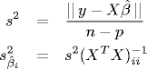
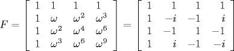

# 9.7   数据分析

> 原文：[`introcs.cs.princeton.edu/java/97data`](https://introcs.cs.princeton.edu/java/97data)
> 
> 译者：[飞龙](https://github.com/wizardforcel)
> 
> 协议：[CC BY-NC-SA 4.0](https://creativecommons.org/licenses/by-nc-sa/4.0/)


本节正在大规模施工中。

**正态分布。** 一堆随机硬币翻转的总和。

**随机抽样。** 对某些未知常数进行物理测量，例如，重力常数。每次测量都会有一定的误差，因此我们每次都会得到略有不同的结果。我们的目标是尽可能准确和精确地估计未知数量。样本均值和样本方差定义如下：


样本均值估计未知常数，样本方差衡量估计的精确性。在相当一般的条件下，当 n 变大时，样本均值服从均值为未知常数，方差为样本方差的正态分布。95% 的近似置信区间为


置信区间衡量了我们对未知常数估计的不确定性。这意味着如果我们多次执行相同的实验，我们预计估计的均值会在给定的区间内出现的概率为 95%。数字 1.96 出现是因为正态随机变量在 -1.96 和 1.96 之间的概率恰好为 95%。如果我们想要 90% 或 99% 的置信区间，分别替换为 1.645 或 2.575。上述置信区间并非精确。这是因为我们正在估计标准差。如果 n 较小（比如小于 50），我们应该使用具有 n-1 自由度的学生 t 分布的精确 95% 置信区间。例如，如果有 n = 25 个样本，则我们应该使用 2.06 而不是 1.96。这些数字可以使用 [or124.jar](http://opsresearch.com/cgi-bin/freeware.cgi/or124.jar) 计算，其中包含 [OR-Objects library](http://opsresearch.com/OR-Objects/api/drasys/or/prob/package-summary.html)。程序 ProbDemo.java 演示了如何使用它。

```java
NormalDistribution normal = new NormalDistribution(0, 1);
System.out.println(normal.cdf(1.9605064392089844));
System.out.println(normal.inverseCdf(0.975));

StudentsTDistribution students = new StudentsTDistribution(25 - 1);
System.out.println(students.cdf(2.0638981368392706));
System.out.println(students.inverseCdf(0.975));

```

*实现.* 程序 Average.java 是上述公式的��接实现。这个公式涉及对数据的两次遍历：一次计算样本均值，一次计算样本方差。因此，我们将数据存储在一个数组中。这看起来有些浪费，因为我们可以使用备用的样本方差的教科书公式一次计算两者。


我们避免使用这种单次算法，因为它在数值上是不稳定的。（参见练习 XYZ 和 XYZ。）当数据方差较小但有效数字位数较多时，这种不稳定性最为明显。事实上，它可能导致程序对负数进行平方根运算！（参见练习 XYZ。）这种微妙之处会让许多未经培训的程序员感到惊讶。事实上，甚至有些经验丰富的程序员也会感到惊讶。微软 Excel 版本 1.0 到 2002 实现了不稳定的单次算法在超过十几个统计库函数中。因此，您可能会在没有警告的情况下遇到不准确的结果。[这些错误已经在 Excel 2003 发布时得到修复](http://support.microsoft.com/default.aspx?kbid=826393)。

*置信区间.* 一月与七月的温度。

*调查抽样。* 人口普查调查、温度读数、选举出口民意调查、制造过程的质量控制、审计财务记录、流行病学等。通常，报纸会将某项调查的结果报告为类似于 47% ± 3%。这到底意味着什么？通常隐含地假定为 95%的置信区间。我们假设人口由 N 个元素组成，我们抽取大小为 n 的样本，样本 i 有一个关联的实际值 x[i]，它可以代表重量或年龄。它也可以表示 0 或 1 来表示某种特征是否存在或不存在（例如，计划投票给 Kerry）。随机抽样的技术适用，只是我们需要对有限人口规模进行修正。


当 N 相对于 n 很大（只抽取了人口的一小部分）时，可以忽略有限人口效应。

*直方图。* 程序`Histogram.java`在数据累积时动态显示直方图。

[数据集](http://www.oswego.edu/~kane/econometrics/data.htm)

**简单线性回归。** 1800 年，朱塞佩·皮亚齐发现了一个看似新星，并在 41 天内追踪了它的运动，然后由于恶劣天气而失去了踪迹。他感到惊讶，因为它的运动方向与其他星星相反。卡尔·弗里德里希·高斯利用他新发明的最小二乘法预测了星星的位置。高斯因根据他的预测找到了这颗星星而变得著名。事实证明，这颗天体是一颗小行星，是有史以来发现的第一颗小行星。现在，最小二乘法在许多学科中应用，从心理学到流行病学再到物理学。高斯的著名计算涉及使用 6 个变量预测物体的位置。我们首先考虑[简单线性回归](http://www.wikipedia.org/wiki/Linear_regression)，它只涉及一个预测变量 x，并且我们对响应建模 y = &beta[0] + β[1]x。给定一系列 n 对实数(x[i], y[i])，我们定义 x[i]处的残差为 r[i] = (y[i] - β[0] - β[1]x[i])。目标是估计未观察到的参数β[0]和β[1]的值，使得残差尽可能小。最小二乘法是选择参数使残差的平方和最小化。使用基本微积分，我们可以得到经典的最小二乘估计：


程序 LinearRegression.java 从标准输入读取 n 个测量值，绘制它们，并根据最小二乘度量计算最适合数据的直线。

**评估拟合解。** 为了衡量拟合的好坏，我们可以计算决定系数 R²，它衡量数据中可以由变量 x 解释的变异性的比例。


我们还可以估计标准误差，β[0]和β[1]的回归估计的标准误差，以及两个未知系数的 95%近似置信区间。


*算法的运行时间。* 对两边取对数。斜率是指数，截距是常数。

绘制纬度与一月温度的关系。在 2 个标准偏差内的点用黑色表示，在 2 到 3 之间用蓝色表示，在 3 以上用绿色表示。19 个异常值中有 18 个在加利福尼亚州或俄勒冈州。另一个在科罗拉多州冈尼森县，那里的海拔非常高。也许需要将经度和海拔高度纳入模型中...

**正态性检验。**

**多元线性回归。** 多元线性回归通过允许多个预测变量而不仅仅是一个来推广简单线性回归。我们对响应 y = β[0] + β[1]x[1] + ... + β[p]x[p] 进行建模。现在，我们有一系列 n 个响应值 y[i]，以及一系列 n 个预测 *向量*（x[i1]，x[i2]，...，x[ip]）。目标是估计参数向量（β[0]，...，β[p]），以使平方误差的总和最小化。在矩阵表示中，我们有一个过度确定的方程组 y = Xβ。


我们的目标是找到一个最小化 ||X^(β - y|| 的向量 β。假设 X 具有完整的列秩，我们可以通过解决 *正规方程* X^TXβ = X^Ty 来计算 β 的估计值。解决正规方程的最简单方法是显式计算 A = X^TX 和 b = X^Ty，并使用高斯消元法解方程组 Ax = b。计算 β 的一个数值稳定的算法是计算 QR 分解 X = QR，然后通过回代解三角形系统 Rβ = Q^Ty 来解决。这正是 Jama 的 `solve` 方法在面对一个过度确定系统时所做的（假设矩阵具有完整的列秩）。程序 MultipleLinearRegression.java 是这种方法的一个直接实现。参见练习 XYZ，其中介绍了一种基于 SVD 的方法，即使系统没有完整的列秩也可以工作。)

**一个例子。** 天气数据集和来自这个[参考资料](http://www.stat.lsa.umich.edu/~kshedden/Courses/Stat401/Notes/401-multreg.pdf)的例子。2001 年 3 月，美国 1070 个气象站的平均最高日温度。预测因子 = 纬度（X1）、经度（X2）和海拔（X3）。模型 Y = 101 - 2 X1 + 0.3 X2 - 0.003 X3。随着经度增加（向西），温度增加，但随着纬度增加（向北）和海拔增加，温度降低。纬度对温度的影响在西部和东部哪个更大？绘制 3 月份温度与纬度的散点图（以 93 度为中位数的经度分割）。绘制残差与拟合值的图。不应显示任何模式。

**评估模型。** 误差方差 s² 是平方误差之和除以自由度（n - p - 1）。标准方差矩阵的对角线条目是 σ²(X^TX)^(-1) 估计参数估计的方差。



**多项式回归。** 预测变量不只是一个。我们对响应 y = β[0] + β[1]x¹ + ... + β[p]x^p 进行建模。PolynomialRegression.java 是执行多项式回归的数据类型。

## 离散傅立叶变换。

发现高效算法可以产生深远的社会和文化影响。离散傅立叶变换是一种将 N 个样本（例如声音）的波形分解为周期分量的方法。暴力解决方案的时间复杂度与 N²成正比。27 岁时，高斯提出了一种仅需 N log N 步的方法，并用它来分析小行星谷神星的周期运动。这种方法后来被库利和图基在 1965 年重新发现并推广，他们描述了如何在数字计算机上高效实现它。他们的动机是监视苏联的核试验和跟踪苏联潜艇。快速傅立叶变换已成为信号处理的基石，并是 DVD 播放器、手机和磁盘驱动器等设备的关键组件。它还构成许多流行数据格式的基础，包括 JPEG、MP3 和 DivX。还有语音分析、音乐合成、图像处理。医生们经常在医学成像中使用快速傅立叶变换，包括磁共振成像（MRI）、磁共振光谱（MRS）、计算机辅助断层扫描（CAT 扫描）。另一个重要应用是快速解决具有周期边界条件的偏微分方程，尤其是泊松方程和非线性薛定谔方程。还用于模拟分数布朗运动。如果没有快速计算 DFT 的方��，这一切都将不可能。查尔斯·范·洛恩写道：“快速傅立叶变换是本世纪真正伟大的计算发展之一。它已经改变了科学和工程的面貌，可以毫不夸张地说，*没有快速傅立叶变换，我们所知道的生活将会截然不同*。”

*傅立叶分析*是一种通过不同频率的正弦波（复指数）的和来近似函数（信号）的方法。在使用计算机时，我们还假设连续函数由在规则间隔上采样的有限数量点来近似。正弦波在物理学中起着至关重要的作用，用于描述振荡系统，包括简谐运动。人耳是声音的傅立叶分析器。粗略地说，人类听觉通过将声波分解为正弦分量来工作。每个频率在耳蜗膜中的不同位置共振，并将这些信号沿听神经传递到大脑。DFT 的主要应用之一是识别数据中的周期性及其相对强度，例如在声学数据中滤除高频噪声，分离天气中的昼夜和年度循环，分析天文数据，执行大气成像，并识别经济数据中的季节性趋势。

长度为 N 的复向量 x 的*离散傅立叶变换*（DFT）定义为


其中 i 是-1 的平方根，ω = e^(-2iπ/N)是主 N 次单位根。我们还可以将 DFT 解释为矩阵-向量乘积 y = F[N] x，其中 F[N]是 N×N 矩阵，其第 j 行第 k 列为ω^(jk)。例如，当 N = 4 时，



我们注意到一些作者将傅立叶矩阵定义为我们的傅立叶矩阵的共轭，并通过因子 1 / sqrt(N)对其进行归一化，使其成为幺正的。直觉：设 x[i]为时间间隔从 0 到 T 的信号样本，f[i]为 DFT。那么 f[0] / n 是信号在该间隔内的平均值的近似值。复数 f[j]的模（绝对值）和幅角（角度）表示频率为 j / T 的信号分量的振幅和相位（一半）。

*快速傅里叶变换。* 直接从定义或通过密集矩阵-向量乘法计算 N 长度向量的 DFT 是直截了当的。这两种方法都需要二次时间。快速傅里叶变换（FFT）是一种巧妙的方法，它以与 N log N 成比例的时间计算 DFT。它通过利用傅里叶矩阵 F 的对称性来工作。关键思想是利用 n 次单位根的性质将大小为 n 的向量的傅里叶变换与大小为 n/2 的两个向量上的两个傅里叶变换相关联。


其中 x[even]表示大小为 n/2 的向量，由 x[0]、x[2]、...、x[n-2]组成，x[odd]表示由 x[1]、x[3]、...、x[n-1]组成的向量，矩阵 I[n/2]是 n/2 乘 n/2 的单位矩阵，矩阵 D[n/2]是对角线条目为ω^k 的对角矩阵。*基数 2 Cooley-Tukey FFT* 使用这个递归公式以分治风格的框架计算 DFT。请注意，我们隐含地假设 N 是 2 的幂。程序 FFT.java 是这个方案的基本实现。它依赖于在第 xyz 节中开发的 Complex.java ADT。程序 InplaceFFT.java 是*原位*变体：它只使用 O(1)额外内存。

**逆 FFT。** *逆 DFT* 定义为：F[N]的逆是其复共轭，缩小了 N 倍。因此，要计算 x 的逆 DFT：计算 x 的共轭的 DFT，取结果的共轭，并将每个值乘以 N。

*按键电话。* *触摸音* ® 电话使用称为*双音多频*（DTMF）的系统将按键编码为音频信号。根据下表，每个按键按键与两个音频频率相关联

```java
Freqs   1209 Hz   1336 Hz   1477 Hz   1633Hz
--------------------------------------------
697 Hz    1          2        3         A
770 Hz    4          5        6         B
852 Hz    7          8        9         C
941 Hz    *          0        #         D

```

例如，当按下键 7 时，电话会在频率为 770 Hz 和 1209 Hz 的信号之间发出信号，并将它们相加。频率应该在规定值的 1.5%范围内，否则电话公司会忽略它。高频率必须至少与低频率一样响亮，但不能比低频率响亮超过 3 分贝。

[笔记](http://www.physik.uni-hannover.de/cip/fourier.pdf)

[按键音乐](http://www.twpyhr.com/tttfaq.shtml)，[按键声音](http://rl.se/polisradio/dtmf.php)

*商业实现。* 由于 FFT 的重要性，有许多高效的 FFT 算法的丰富文献，还有许多高度优化的库实现可用（例如，Matlab 和[Fastest Fourier Transform in the West](http://fftw.org)）。我们的实现是一个基本版本，捕捉了最显著的思想，但可以通过多种方式改进。例如，商业实现适用于任何 N，而不仅仅是 2 的幂。如果输入是实数（而不是复数），它们会利用额外的对称性并运行得更快。它们还可以处理多维 FFT。我们的 FFT 实现的内存占用比所需的要高得多。经过精心设计，甚至可以在原地执行 FFT，即除了 x 之外不需要额外的数组。商业 FFT 实现还使用迭代算���而不是递归。这可以使代码更高效，但更难理解。高性能计算机具有专门的矢量处理器，可以比等效的标量操作序列更快地执行矢量操作。尽管计算科学家通常根据浮点操作的数量来衡量性能，但对于 FFT 来说，内存访问的数量也至关重要。商业 FFT 算法特别关注在内存中移动数据所带来的成本。并行 FFT。在硬件中实现。

**卷积。** 两个向量的[卷积](http://en.wikipedia.org/wiki/Convolution)是表示两个向量之间重叠的第三个向量。它在许多应用中出现：统计学中的加权移动平均、光学中的阴影和声学中的回声。给定长度为 N 的两个周期信号 a 和 b，a 和 b 的*循环卷积*定义为


我们使用符号 c = a ⊗ b。向量 b 称为脉冲响应、滤波器、模板或点扩散函数。为了看到卷积的重要性，考虑两个 N 次多项式 p(x)和 q(x)。观察到 r(x) = p(x) q(x)的系数为


通过将 p 和 q 的系数进行卷积得到，其中 p 和 q 在长度为 2N 的情况下填充了前导 0。为了便于计算，我们还可以填充额外的前导 0，使其长度成为 2 的幂。这模拟了*线性卷积*，因为我们不希望周期性边界条件。

傅里叶分析的一个基石结果是卷积定理。它表明两个向量卷积的 DFT 是两个向量的 DFT 的逐点乘积。

```java
DFTN(a ⊗ b) =  DFTN(a) · DFTN(b)

```

卷积定理很有用，因为*逆 DFT*很容易计算。这意味着我们可以通过进行三次单独的 FFT 来在 N log N 步骤中计算循环卷积（从而进行多项式乘法）。

```java
a ⊗ b =  (DFTN)-1 (DFTN(a) · DFTN(b))

```

这在两个层面上都是令人惊奇的。首先，这意味着我们可以比蛮力更快地相乘两个实（或复）多项式。其次，这种方法依赖于复数，即使相乘两个实多项式似乎与虚数无关。

Matlab 提供了一个名为`conv`的函数，用于执行两个向量的线性卷积。然而，他们的实现需要二次时间。在许多应用中，向量很大，比如有 100 万个条目，使用这个库函数作为黑匣子是不可接受的。通过利用我们对算法和复杂性的理解，我们可以用 FFT 替换库解决方案，从而得到优化的解决方案！

```java
X = fft( [x zeros(1, length(y) - 1)] )
Y = fft( [y zeros(1, length(x) - 1)] )
c = ifft(X .* Y)

```

正如我们刚刚见证的，通过首先将数据从时域转换到频域，我们可以在计算卷积时取得显著的性能改进。这个原则也适用于相关问题，包括交叉相关、自相关、多项式乘法、离散正弦和余弦变换。这也意味着我们对循环矩阵和 Toeplitz 矩阵有快速矩阵-向量乘法算法，这些矩阵出现在偏微分方程的数值解中。f = 信号，y = 频谱。f = 脉冲响应，y = 频率响应。

**2D DFT。**（练习）通过对每一列进行 DFT，然后对结果值的每一行进行 DFT，计算一个 N×N 矩阵的 2D DFT。N² log N。

参考资料：[图像压缩](http://www.cs.berkeley.edu/~demmel/cs267/lecture24/lecture24.html#link_6)，[DFT 书籍](http://ccrma.stanford.edu/~jos/r320/)

#### Q + A

Q. 为什么称之为学生 T 分布？

A. 由吉尼斯啤酒公司的一名名叫威廉·高斯特的员工于 1908 年发现，但吉尼斯不允许他以自己的名义发表，所以他使用了“学生”。

Q. 为什么要最小化平方误差的总和而不是绝对误差的总和或其他度量？

A. 简短回答：这是科学家在实践中所做的事情。还有一些数学上的理由。[高斯-马尔可夫定理](http://www.wikipedia.org/wiki/Gauss-Markov_theorem)说，如果你有一个线性模型，其中误差均值为零，方差相等，并且不相关，那么 a 和 b 的最小二乘估计（最小化平方误差和的那些）在所有无偏估计中具有最小的方差。如果我们进一步假设误差是独立的并且服从正态分布，那么我们可以推导出*95%或 99%的置信区间*...

Q. 我在哪里可以获得一个图表库？

A. 查看[JFreeChart](http://www.jfree.org/jfreechart/)。这里有一些关于如何使用它的[说明](http://www.javaworld.com/javaworld/jw-12-2002/jw-1227-opensourceprofile.html)。或者查看[科学图形工具包](http://www.epic.noaa.gov/java/sgt/index.html)，用于创建科学数据的交互式、出版质量的图形。

#### 练习

1.  **棒球统计。** 对[棒球统计](http://www.baseball1.com/statistics/)进行一些分析。

1.  **直方图。** 修改`Histogram.java`，使其无需提前输入范围。

1.  **直方图。** 修改`Histogram.java`，使其具有 10 个桶。

1.  **饼图。**

1.  **茎叶图。**

1.  **简单线性回归。** 修改程序 LinearRegression.java 以绘制和缩放数据。再次，我们要谨慎选择一个稳定的算法，而不是稍微简单的一次遍历替代方案。

#### 创意练习

1.  **一次遍历算法。** 编写一个程序 OnePass.java，使用备用教科书公式一次计算样本均值和方差（而不是两次）。

    ```java
    sum  = x1 + ... + xN
    sum2 = x1x1 + ... + xNxN
    σ = sqrt ( (N sum2 - sum * sum) / (N*(N-1)) )

    ```

    通过插入 n = 3, x[1] = 1000000000, x[2] = 1000000001 和 x[3] = 1000000002 来验证它在数值上不稳定。一次遍历算法给出方差为 0，但真实答案是 1。另外，通过插入 n = 2, x[1] = 0.5000000000000002 和 x[2] = 0.5000000000000001 的输入来验证它可能导致对负数求平方根。与 Average.java 进行比较。

1.  **样本方差。** 实现以下稳定的一次遍历算法来计算样本方差。验证公式是否正确。

    ```java
    m1 = x1, mk = mk-1 + (xk - mk-1)/k
    s1 = 0, sk = sk-1 + ((k-1)/k)(xk - mk-1)2
    μ = mN
    σ = sqrt(sN/(N-1))

    ```

1.  **正态分位数图。** 为了测试给定数据集是否遵循正态分布，创建一个*正态分位数图*并检查数据点是否位于(或接近)一条直线上。要创建正态分位数图，对 N 个数据点进行排序。然后将第 i 个数据点绘制在Φ^(-1)(i / N)上。

1.  **钻石 3D 图。** 编写一个程序来读取一组三维数据并绘制类似下面的[钻石图](http://www.jhsph.edu/Press_Room/Press_Releases/Munoz_diamond_graph.html)的数据。钻石图比 3D 条形图有几个优点

    

1.  **多项式曲线拟合。** 假设我们有一组 N 个观测值(x[i], y[i])，我们想要使用低次多项式对数据进行建模。

    实证收集 n 个样本：(x[i], y[i])。用矩阵表示，我们的最小二乘问题是：

    

    矩阵 X 称为*范德蒙德矩阵*，如果 n ≥ p 且 x[i]不同，则具有完整的列秩。我们的问题是一般线性回归的特例。解向量β是最佳拟合度 p 多项式的系数。

1.  **秩亏线性回归。** 更好的方法：使用 SVD。具有更好的数值稳定性特性。即使 A 没有满秩，也可以工作。计算[瘦 SVD](http://element.stanford.edu/~lall/courses/current/engr207a/svd_2004_01_13_01.pdf)：A = U[r]Σ[r]V[r]^T。这里 r 是 A 的秩，U[r]，Σ[r]和 V[r]分别是 U，Σ和 V 的前 r 列。伪逆 A^† = Ur^(-1)V[r]^T 和最小二乘估计 x* = A^†b。伪逆很好地推广了矩阵的逆：如果 A 是方阵且可逆，则 A^† = A^(-1)。如果 A 是瘦的且具有满秩，则 A^† = (A^TA)^(-1)A^T。要计算 A^†b，不要显式形成伪逆。相反，计算 v = V^Tb，w = Σ^(-1)u，x* = Uw。注意Σ^(-1)易于计算，因为Σ是对角线的。

    在 Matlab 中，`pinv(A)`给出伪逆，`svd(A, 0)`给出瘦 SVD 用于瘦矩阵（但不适用于胖矩阵！）

1.  **欠定系统。** 在数据拟合应用中，方程组通常是过度确定的且 A 是瘦的。在控制系统中，我们有一个欠定的方程组，目标是找到一个解 Ax* = b，使得 x*的范数最小化。同样，SVD 拯救了我们。如果 A 具有完整的列秩，则 A^†b 就是这样一个解。

1.  **多项式乘法。** 给定两个分别为 m 和 n 次的多项式，描述如何在 O(m log n)的时间内计算它们的乘积。

**聚类。** 生物学中的进化树，商业中的市场研究，文理学中的画家和音乐家分类，社会学中的调查响应分类，[参考：盖伊·布洛克]
