# 1.2 数据的内置类型

> 原文：[`introcs.cs.princeton.edu/python/12types`](https://introcs.cs.princeton.edu/python/12types)

*数据类型*是一组值和在这些值上定义的一组操作。许多数据类型内置于 Python 语言中。在本节中，我们考虑 Python 内置的数据类型`int`（用于整数）、`float`（用于浮点数）、`str`（用于字符序列）和`bool`（用于真假值）。

> 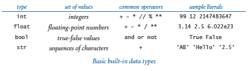

* * *

## 定义

要讨论数据类型，我们需要介绍一些术语。为此，我们从以下代码片段开始：

```py
a = 1234
b = 99
c = a + b

```

这段代码创建了三个类型为`int`的*对象*，使用*字面值*`1234`和`99`以及*表达式*`a + b`，并使用*赋值语句*将*变量*`a`、`b`和`c`绑定到这些对象。最终结果是变量`c`绑定到一个类型为`int`、值为`1333`的对象。

### 对象。

Python 程序中的所有数据值都由*对象*和对象之间的关系表示。对象是特定数据类型的值在计算机内存中的表示。每个对象由其*标识*、*类型*和*值*特征化。

+   *标识*唯一标识一个对象。你应该将其视为计算机内存中对象存储的位置（或内存地址）。

+   对象的*类型*完全指定了其行为——它可能表示的值集合和可以对其执行的操作集合。

+   对象的*值*是它所代表的数据类型值。

每个对象存储一个值；例如，类型为`int`���对象可以存储值`1234`、值`99`或值`1333`。不同对象可能存储相同的值。例如，一个类型为`str`的对象可能存储值`'hello'`，另一个类型为`str`的对象也可能存储相同的值`'hello'`。我们可以对对象应用其类型定义的任何操作（仅限于这些操作）。例如，我们可以将两个`int`对象相乘，但不能将两个`str`对象相乘。

### 对象引用。

*对象引用*只不过是对象标识（对象存储的内存地址）的具体表示。Python 程序使用对象引用来访问对象的值或操作对象引用本身。

### 字面值。

*字面值*是数据类型值的 Python 代码表示。它创建一个具有指定值的对象。

### 操作符。

*操作符*是 Python 代码中数据类型操作的表示。例如，Python 使用`+`和`*`表示整数和浮点数的加法和乘法；Python 使用`and`、`or`和`not`表示布尔操作；等等。

### 标识符。

*标识符*是一个名称的 Python 代码表示。每个标识符是一个字母、数字和下划线的序列，第一个不是数字。以下关键字是保留的，你不能将它们用作标识符：

```py
False      class      finally    is         return
None       continue   for        lambda     try
True       def        from       nonlocal   while
and        del        global     not        with
as         elif       if         or         yield
assert     else       import     pass
break      except     in         raise

```

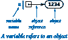

### 变量。

*变量*是对象引用的名称。我们使用变量来跟踪随着计算的展开而变化的值。我们使用像右侧的图表来显示变量与对象的绑定。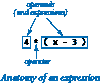

### 表达式。

*表达式*是由文字、变量和操作符组合而成的，Python 评估后会产生一个对象。每个操作数可以是任何表达式，可能在括号内。例如，我们可以组合表达式如`4 * (x - 3)`或`5 * x - 6`，Python 会理解我们的意思。

### 操作符优先级。

表达式是一系列操作的简写。Python 的*优先级规则*指定应用操作的顺序。对于算术运算，乘法和除法在加法和减法之前执行，因此`a - b * c`和`a - (b * c)`表示相同的操作序列。当算术运算符具有相同的优先级时，它们是左结合的，这意味着`a - b - c`和`(a - b) - c`表示相同的操作序列。您可以使用括号覆盖规则，因此如果您想要，可以编写`a - (b - c)`。有关完整详情，请参阅附录 A：Python 中的运算符优先级。

### 赋值语句。

*赋值语句*是对 Python 的指令，将=运算符左侧的变量绑定到右侧表达式评估产生的对象。例如，当我们写`c = a + b`时，我们表达了这个动作：“将变量`c`与变量`a`和`b`关联的值的和关联起来。”

### 非正式追踪。

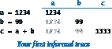跟踪与变量关联的值的有效方法是使用右侧的表格，其中一行给出每个语句执行后的值。这样的表称为*追踪*。

### 对象级别的追踪。

为了更全面地理解，我们有时会在追踪中跟踪对象和引用。右侧的对象级别追踪说明了我们的三个赋值语句的全部效果：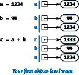

+   语句`a = 1234`创建一个值为`1234`的`int`对象；然后将变量`a`绑定到这个新的`int`对象。

+   语句`b = 99`创建一个值为`99`的`int`对象；然后将变量`b`绑定到这个新的`int`对象。

+   语句`c = a + b`创建值为`1333`的`int`对象，作为绑定到`a`的`int`对象的值和绑定到`b`的`int`对象的值的和；然后将变量`c`绑定到新的`int`对象。

* * *

## 字符串

`str`数据类型表示字符串，用于文本处理。

> 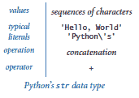

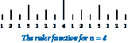

`str`对象的值是一系列字符。您可以通过将一系列字符括在匹配的单引号中来指定`str`文字。您可以使用运算符`+`连接两个字符串。例如，ruler.py 计算了描述标尺上标记相对长度的标尺函数值的表。

### 将数字转换为字符串以进行输出。

Python 提供了内置函数`str()`来将数字转换为字符串。我们最常用的字符串连接运算符是将计算结果与`stdio.write()`和`stdio.writeln()`一起链在一起进行输出，通常与`str()`函数一起使用，就像这个例子中一样：

```py
stdio.writeln(str(a) + ' + ' + str(b) + ' = ' + str(a+b))

```

如果`a`和`b`是值分别为`1234`和`99`的`int`对象，则该语句写出输出行`1234 + 99 = 1333`。

### 将字符串转换为数字以进行输入。

Python 还提供了内置函数来将字符串（例如我们作为命令行参数键入的字符串）转换为数字对象。我们使用 Python 内置函数`int()`和`float()`来实现这一目的。如果用户将`1234`键入为第一个命令行参数，则代码`int(sys.argv[1])`评估为值为`1234`的`int`对象。

* * *

## 整数

`int`数据类型表示整数或自然数。

> 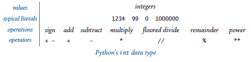

Python 包括用于整数的常见算术运算符，包括加法`+`，减法`-`，乘法`*`，向下取整除法`//`，取余`%`和指数运算`**`。所有这些运算符都与小学定义的一样（请记住，向下取整除法运算符的结果是整数）。程序 intops.py 演示了操作`int`对象的基本操作。

|

### Python 2 中的除法。

在 Python 3 中，当两个操作数都是整数时，`/`运算符的行为与浮点除法运算符相同。在 Python 2 中，当两个操作数都是整数时，`/`运算符的行为与向下取整除法运算符`//`相同。例如，在 Python 3 中，`17 / 2`的结果为`8.5`，在 Python 2 中为`8`。为了在不同版本的 Python 中保持兼容性，在本书站点中不使用带有两个`int`操作数的`/`运算符。

* * *

## 浮点数

`float`数据类型用于表示浮点数，用于科学和商业应用。

> 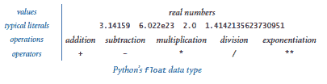

Python 包括用于浮点数的常见算术运算符，包括加法`+`，减法`-`，乘法`*`，除法`/`和指数运算`**`。程序 floatops.py 演示了操作`float`对象的基本操作。程序 quadratic.py 展示了使用二次方程公式计算二次方程的两个根时使用`float`对象。

我们使用浮点数来表示实数，但它们与实数并不相同！实数有无限多个，但我们只能在任何数字计算机中表示有限数量的浮点数。例如，`5.0/2.0`的结果为`2.5`，但`5.0/3.0`的结果为`1.6666666666666667`。通常，浮点数具有 15-17 位的*精度*。

注意在 quadratic.py���序中使用`math.sqrt()`函数。标准的`math`模块定义三角函数，对数/指数函数和其他常见的数学函数。要使用`math`模块，请在程序开头附近放置语句`import math`，然后使用语法调用函数，例如`math.sqrt(x)`。

* * *

## 布尔值

`bool`数据类型只有两个值：`True`和`False`。

> 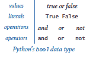

表面上看起来很简单，但布尔值是计算机科学的基础。对于布尔值定义的最重要运算符是*逻辑运算符*：`and`，`or`和`not`：

+   如果`a`和`b`都是`True`，则`a`和`b`为`True`，如果其中一个为`False`，则`a`和`b`为`False`。

+   如果`a`或`b`都是`False`，则`a`或`b`为`False`，如果其中一个为`True`，则`a`或`b`为`True`。

+   如果`a`为`False`，则`not a`为`True`，如果`a`为`True`，则`not a`为`False`。

我们可以使用真值表正式指定每个操作的定义：

> 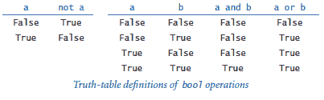

* * *

## 比较

比较运算符`==`，`!=`，`<`，`<=`，`>`和`>=`对整数和浮点数都定义，并计算为布尔结果。

> 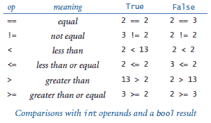

程序 leapyear.py 展示了使用布尔表达式和比较运算来计算给定年份是否为闰年。本书站点的第 1.3 节描述了比较运算符的更常见用法。

* * *

## 函数和 APIs

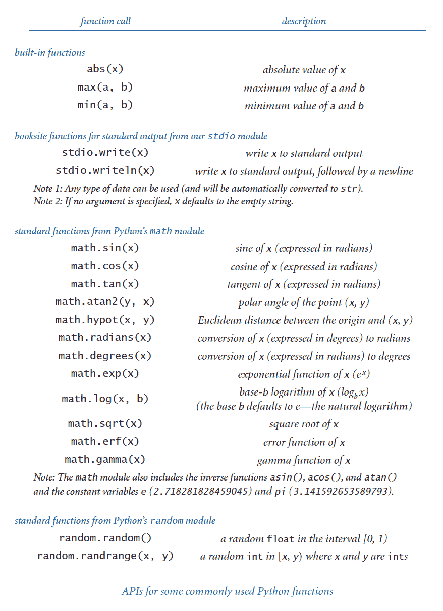

正如我们所见，许多编程任务涉及使用*函数*。我们区分三种函数：*内置函数*（如 `int()`、`float()` 和 `str()`）可以直接在任何 Python 程序中使用，*标准函数*（如 `math.sqrt()`）在 Python 标准模块中定义，并在导入模块的任何程序中可用，以及书站函数（如 `stdio.write()` 和 `stdio.writeln()`）在本书站模块中定义，并在你将它们提供给 Python 并导入它们后可供你使用。我们在本节中描述了一些更有用的函数。在后面的章节中，你将学习不仅如何使用其他函数，还将学习如何定义和使用自己的函数。

为方便起见，我们总结了你需要了解如何使用的函数，就像右侧显示的表格所示。这样的表格称为*应用程序���程接口（API）*。下面的表格显示了一些典型的函数调用。

* * *

## 类型转换

我们经常需要使用以下方法之一将数据从一种类型转换为另一种类型。

### 显式类型转换。

调用函数，如 `int()`、`float()`、`str()` 和 `round()`。

> 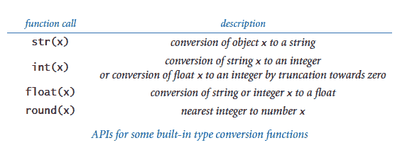

### 隐式类型转换（从整数到浮点数）。

当需要浮点数时，你可以使用整数，因为 Python 会在适当的时候自动将整数转换为浮点数。例如，`10/4.0` 的结果是 `2.5`，因为 `4.0` 是浮点数，两个操作数需要是相同的类型；因此，`10` 被转换为浮点数，然后两个浮点数相除的结果是浮点数。这种转换称为*自动提升*或*强制转换*。

* * *

## 交互式 Python

如果在终端窗口中输入命令 `python`（即，单独输入单词 `python`，后面没有文件名），Python 会识别自身并显示 `>>>` 提示符。此时你可以输入一个 Python 语句，Python 将执行它。或者，你可以输入一个 Python 表达式，Python 将评估它并输出结果值。或者，你可以输入 `help()` 来访问 Python 的广泛交互式文档。这是一个方便的测试新构造和访问文档的方式。

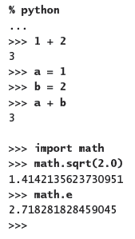 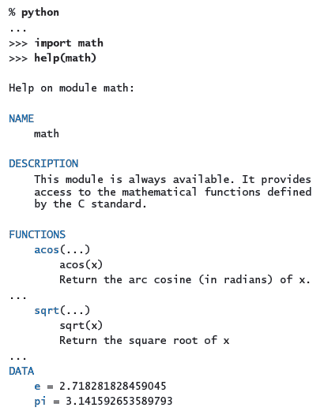

* * *

#### 问与答：字符串

**Q.** Python 如何在内部存储字符串？

**A.** 字符串是使用 Unicode 编码的字符序列，Unicode 是一种现代文本编码标准。Unicode 支持超过 100,000 个不同的字符，包括 100 多种不同的语言以及数学和音乐符号。

**Q.** Python 提供哪种数据类型用于字符？

**A.** Python 没有专门的字符数据类型。字符只是由一个元素组成的字符串，比如 `'A'`。

**Q.** 我可以使用比较运算符（如 `==` 和 <）或内置函数（如 `max()` 和 `min()`）来比较字符串吗？

**A.** 是的。非正式地，Python 使用*词典顺序*来比较两个字符串，就像书索引或字典中的单词一样。例如，`'hello'` 和 `'hello'` 相等，`'hello'` 和 `'goodbye'` 不相等，`'goodbye'` 小于 `'hello'`。

**Q.** 我可以使用匹配的双引号来表示字符串文字，而不是单引号吗？

**A.** 是的。例如，`'hello'` 和 `"hello"` 是相同的文字。双引号可用于指定包含单引号的字符串，这样你就不需要转义它们。例如，`'Python\'s'` 和 `"Python's"` 是相同的字符串文字。你也可以使用匹配的三引号来表示多行字符串。例如，以下代码创建一个两行字符串并将其赋值给变量 `s`：

```py
s = """Python's "triple" quotes are useful to
specify string literals that span multiple lines
"""

```

在本书站点中，我们不使用双引号或三引号来界定字符串文字。

| **Python 2 中的字符串。** Python 2 使用 ASCII 而不是 Unicode 来编码字符。ASCII 是一个支持 128 个字符的传统标准，包括英文字母、数字和标点符号。Python 2 为由 Unicode 字符组成的字符串提供了一个单独的数据类型 unicode，但许多 Python 2 库不支持它。 |
| --- |

* * *

#### Q & A：整数

**Q.** Python 是如何在内部存储整数的？

**A.** 最简单的表示是对于小的正整数，使用二进制数系统将每个整数表示为固定数量的计算机内存。

**Q.** 什么是二进制数系统？

**A.** 在二进制数系统中，我们将整数表示为一系列位。一个位是一个单一的二进制（基数 2）数字 —— 要么是 0，要么是 1 —— 是计算机中表示信息的基础。在这种情况下，位是 2 的幂的系数。具体来说，位序列*b[n]b[n-1]...b[2]b[1]b[0]*表示整数

> *b[n]2^n + b[n-1]2^(n-1) + ... + b[2]2² + b[1]2¹ + b[0]2⁰*

例如，1100011 表示整数

> 99 = 1 · 64 + 1 · 32 + 0 · 16 + 0 · 8 + 0 · 4 + 1 · 2 + 1 · 1。

更熟悉的十进制数系统与此相同，只是数字在 0 到 9 之间，我们使用 10 的幂。将一个数字转换为二进制是一个有趣的计算问题，我们将在下一节中考虑。对于小整数，Python 使用固定数量的位，通常由计算机的基本设计参数决定 —— 通常是 32 或 64。例如，整数 99 可能用 32 位表示为`00000000000000000000000001100011`。

**Q.** 负数呢？

**A.** 小的负数使用一种称为*二进制补码*的约定处理，我们不需要详细考虑。"小"的定义取决于底层计算机系统。在旧的 32 位机器上，“小”通常涵盖范围为-2147483648（-2³¹）到 2147483647（2³¹ - 1）。在新的 64 位机器上，“小”通常涵盖范围为-2⁶³到 2⁶³ - 1，这种情况下，“小”并不那么小！如果一个整数��是“小”，那么 Python 会自动使用一个更复杂的表示，其范围仅受计算机系统上可用内存量的限制。请注意，这些内部表示的细节对于您的程序是隐藏的，因此您可以在具有不同表示的系统中使用它们，而无需更改它们。

**Q.** 在 Python 中，表达式`1/0`的结果是什么？

**A.** 在运行时引发`ZeroDivisionError`。注意：回答这类问题最简单的方法是使用 Python 的交互模式。试试看！

**Q.** 负操作数上的地板除法运算符`//`和余数运算符`%`是如何工作的？

**A.** 试一试！`-47 // 5`的结果是`-10`，`-47 % 5`的结果是`3`。一般来说，地板除法运算符`//`产生地板商；也就是说，商向负无穷大取整。余数运算符`%`的行为更复杂。在 Python 中，如果`a`和`b`是整数，则表达式`a % b`的结果是一个与`b`具有相同符号的整数。这意味着对于任何整数`a`和`b`，都有`b * (a // b) + a % b == a`。在一些其他语言（如 Java）中，表达式`a % b`的结果是一个与`a`具有相同符号的整数。

**Q.** 指数运算符`**`如何处理负操作数？

**A.** 亲自尝试一下。请注意，`**`运算符比左侧的一元加/减运算符具有更高的优先级，但比右侧的一元加/减运算符具有更低的优先级。例如，`-3**4`的结果是`-81`（而不是`81`）。此外，它可能导致不同类型的对象。例如，`10**-2`的结果是浮点数`0.01`，而`(-10)**(10**-2)`在 Python 3 中的结果是一个复数（但在 Python 2 中会引发运行时错误）。

**Q.** 为什么`10⁶`的结果是`12`而不是`1000000`？

**A.** `^`运算符不是指数运算符，你可能一直在想。相反，它是一个我们在本书中不使用的运算符。你想要的是字面值`1000000`。你可以使用表达式`10**6`，但在只需字面值时使用表达式（需要在运行时评估）是浪费的。

| **Python 2 中的整数**。Python 2 支持两种不同类型的整数 — `int`（用于小整数）和`long`（用于较大整数）。Python 2 会在必要时自动从`int`类型提升为`long`类型。 |
| --- |

* * *

#### Q & A：浮点数

**Q.** 为什么实数的类型被命名为`float`？

**A.** 小数点可以在构成实数的数字之间“浮动”。相比之下，对于整数，（隐式）小数点在最低有效数字之后是固定的。

**Q.** Python 如何在内部存储浮点数？

**A.** 一般来说，Python 使用对底层计算机系统自然的表示。大多数现代计算机系统按照 IEEE 754 标准存储浮点数。该标准规定浮点数使用三个字段存储：符号、尾数和指数。如���你感兴趣，可以查看维基百科的[IEEE 浮点数](http://en.wikipedia.org/wiki/IEEE_floating_point)页面了解更多细节。IEEE 754 标准还规定了如何处理特殊浮点值 — 正零、负零、正无穷大、负无穷大和`NaN`（不是一个数字）。例如，它规定`-0.0/3.0`应该评估为`-0.0`，`1.0/0.0`应该评估为正无穷大，`0.0/0.0`应该评估为`NaN`。你可以在一些简单计算中使用（相当不寻常的）表达式`float('inf')`和`float('-inf')`表示正无穷大和负无穷大，但 Python 不符合 IEEE 754 标准的这一部分。例如，在 Python 中，`-0.0/3.0`正确评估为`-0.0`，但`1.0/0.0`和`0.0/0.0`都会在运行时引发`ZeroDivisionError`。

**Q.** 浮点数的十五位数字对我来说肯定足够了。我真的需要太在意精度吗？

**A.** 可以，因为你习惯于基于具有无限精度的实数的数学，而计算机总是处理近似值。例如，在 IEEE 754 浮点数中，表达式`(0.1 + 0.1 == 0.2)`评估为`True`，但`(0.1 + 0.1 + 0.1 == 0.3)`评估为`False`！在科学计算中遇到这样的陷阱并不罕见。初学者程序员应避免将两个浮点数进行相等比较。

**Q.** 写入浮点数时看到所有那些数字很烦人。是否可以让`stdio.write()`和`stdio.writeln()`只写入小数点后的两三个数字？

**A.** booksite 函数`stdio.writef()`是一种方法 — 它类似于 C 编程语言和许多其他现代语言中的基本格式化写入函数，如 1.5 节所讨论的那样。在那之前，我们将接受额外的数字（这并不全是坏事，因为这样做有助于我们适应不同类型的数字）。

**Q.** 我可以将地板除法运算符`//`应用于两个浮点操作数吗？

**A.** 是的，它产生其操作数的地板除法。也就是说，结果是商，小数点后的数字被移除。我们在本书中不对浮点数使用地板除法运算符。

**Q.** 如果其参数的小数部分为`0.5`，`round()`会返回什么？

**A.** 在 Python 3 中，它返回最接近的偶数，因此`round(2.5)`是`2`，`round(3.5)`是`4`，`round(-2.5)`是`-2`。但在 Python 2 中，`round()`函数远离零四舍五入（并返回一个浮点数），因此`round(2.5)`是`3.0`，`round(3.5)`是`4.0`，`round(-2.5)`是`-3.0`。

**Q.** 我可以比较`float`和`int`吗？

**A.** 没有进行类型转换的话是不行的，但要记住 Python 会自动进行必要的类型转换。例如，如果`x`是整数`3`，那么表达式`(x < 3.1)`的结果是`True`，因为 Python 将整数`3`提升为生成浮点数`3.0`，然后将`3.0`与`3.1`进行比较。

**Q.** Python 的`math`模块中是否有其他三角函数，如反正弦、双曲正弦和正割函数？

**A.** 是的，Python 的`math`模块包括反三角函数和双曲函数。然而，没有正割、余割和余切函数，因为你可以使用`math.sin()`、`math.cos()`和`math.tan()`来轻松计算它们。选择在 API 中包含哪些函数是方便性和烦恼之间的权衡：方便性在于拥有你需要的每个函数，而烦恼在于必须在一个长列表中找到你需要的少数几个函数。没有选择会满足所有用户，Python 设计者有很多用户要满足。请注意，即使在我们列出的 API 中也有很多冗余。例如，你可以使用`math.sin(x) / math.cos(x)`代替`math.tan(x)`。

* * *

#### Q & A

**Q.** 如果我访问一个未绑定到对象的变量会发生什么？

**A.** Python 会在运行时引发`NameError`。

**Q.** 我如何确定一个变量的类型？

**A.** 这是一个诡计问题。与许多编程语言（如 Java）中的变量不同，Python 变量没有类型。相反，变量绑定的对象才有类型。你可以将同一个变量绑定到不同类型的对象，就像这个代码片段中：

```py
x = 'Hello, World'
x = 17
x = True

```

然而，为了清晰起见，通常这样做是一个坏主意。

**Q.** 我如何确定一个对象的类型、标识和值？

**A.** Python 提供了用于此目的的内置函数。函数`type()`返回对象的类型；函数`id()`返回对象的标识；函数`repr()`返回对象的一个明确的字符串表示。

```py
>>> import math
>>> a = math.pi
>>> id(a)
140424102622928
>>> type(a)
 >>> repr(a)
'3.141592653589793' 
```

在日常编程中你很少会使用这些函数，但在调试时可能会发现它们很有用。

**Q.** `=`和`==`之间有什么区别？

**A.** 是的，它们是完全不同的！第一个指定对变量的赋值，第二个是一个比较运算符，产生一个布尔结果。你能理解这个答案是对你是否理解本节内容的一个确定测试。想想你如何向朋友解释这个区别。

**Q.** `a < b < c`会测试这三个数字`a`、`b`和`c`是否按顺序排列吗？

**A.** 是的，Python 支持任意链式比较，比如`a < b < c`，它们遵循标准的数学约定。然而，在许多编程语言（如 Java）中，表达式`a < b < c`是非法的，因为子表达式`a < b`评估为布尔值，然后将该布尔值与一个数字进行比较，这是没有意义的。我们在��书中不使用链式比较；相反，我们更喜欢像`(a < b) and (b < c)`这样的表达式。

**Q.** `a = b = c = 17`会将这三个变量设置为 17 吗？

**A.** 可以，尽管 Python 赋值语句不是表达式，但 Python 支持任意链式赋值语句。我们在书中不使用链式赋值，因为许多 Python 程序员认为这是不好的风格。

**Q.** 我可以在不是布尔值的操作数上使用逻辑运算符`and`、`or`和`not`吗？

**A.** 是的，但为了清晰起见，通常这样做是一个坏主意。在这种情况下，Python 认为`0`、`0.0`和空字符串`''`表示`False`，而任何其他整数、浮点数或字符串表示`True`。

**Q.** 我可以在布尔操作数上使用算术运算符吗？

**A.** 是的，但再次这样做通常是不好的。当你将布尔操作数与算术运算符一起使用时，它们会被提升为整数：`False`为`0`，`True`为`1`。例如，`(False - True - True) * True`的结果是`int`值`-2`。

**Q.** 我可以将变量命名为`max`吗？

**A.** 是的，但如果这样做，你就无法使用内置函数`max()`。对于`min()`、`sum()`、`float()`、`eval()`、`open()`、`id()`、`type()`、`file()`和其他内置函数也是如此。

* * *

#### 练习

1.  假设`a`和`b`是整数。以下语句序列做什么？绘制该计算的对象级跟踪。

    ```py
    t = a
    b = t
    a = b

    ```

    *解决方案:* 该序列将`a`、`b`和`t`设置为`a`的原始值。

1.  编写一个程序，使用`math.sin()`和`math.cos()`来检查对于任何作为命令行参数输入的θ，*cos² θ + sin² θ*的值是否大约为`1.0`。只需写出值。为什么这些值不总是完全等于`1.0`？

*解决方案（来自 Hassan Alam 和 Lee Jong Gil）：*

> ```py
> import sys
> import math
> 
> theta = float(sys.argv[1])
> theta_in_rad = math.radians(theta)
> 
> val_of_sin = math.sin(theta_in_rad)
> val_of_cos = math.cos(theta_in_rad)
> 
> result = (val_of_sin**2) + (val_of_cos**2)
> sys.stdout.write(str(result))
> 
> ```

1.  假设`a`和`b`是布尔值。展示这个表达式的计算结果为`True`：

    ```py
    (not (a and b) and (a or b)) or ((a and b) or not (a or b))

    ```

1.  假设`a`和`b`是整数。简化以下表达式：

    ```py
    (not (a < b) and not (a > b))

    ```

    *解决方案:* `a == b`

1.  每个语句会写入什么？解释每个结果。

    ```py
    stdio.writeln(2 + 3)
    stdio.writeln(2.2 + 3.3)
    stdio.writeln('2' + '3')
    stdio.writeln('2.2' + '3.3')
    stdio.writeln(str(2) + str(3))
    stdio.writeln(str(2.2) + str(3.3))
    stdio.writeln(int('2') + int('3'))
    stdio.writeln(int('2' + '3'))
    stdio.writeln(float('2') + float('3'))
    stdio.writeln(float('2' + '3'))
    stdio.writeln(int(2.6 + 2.6))
    stdio.writeln(int(2.6) + int(2.6))

    ```

1.  解释如何使用 quadratic.py 来找到一个数的平方根。

    *解决方案:* 要找到`c`的平方根，找到`x² + 0x - c`的根。

1.  `stdio.writeln((1.0 + 2 + 3 + 4) / 4)`会写入什么？

1.  假设`a`是`3.14159`。每个语句会写入什么？解释每个结果。

    ```py
    stdio.writeln(a)
    stdio.writeln(a + 1.0)
    stdio.writeln(8 // int(a))
    stdio.writeln(8.0 / a)
    stdio.writeln(int(8.0 / a))

    ```

1.  描述在 quadratic.py 中写入`sqrt`而不是`math.sqrt`的效果。

1.  `(math.sqrt(2) * math.sqrt(2) == 2)`的计算结果是 True 还是 False？

1.  编写一个程序，从命令行获取两个正整数，如果其中一个可以整除另一个，则写入`True`。

1.  编写一个程序，从命令行获取三个正整数，并在任何一个大于或等于另外两个之和时写入`False`，否则写入`True`。（注意：这个计算测试这三个数字是否可以是某个三角形的边长。）

1.  在执行以下序列后，`a`的值是多少：

    ```py
    a = 1                 a = True              a = 2
    a = a + a             a = not a             a = a * a
    a = a + a             a = not a             a = a * a
    a = a + a             a = not a             a = a * a

    ```

1.  一个物理学生在使用代码时得到了意外的结果

    ```py
    force = G * mass1 * mass2 / radius * radius

    ```

    根据公式*F = Gm[1]m[2] / r²*计算值。解释问题并纠正代码。

    *解决方案:* 代码除以`r`，然后乘以`r`。实际上应该除以`r`的平方。使用括号：

    ```py
    F = G * mass1 * mass2 / (r * r)

    ```

    或者使用乘方运算符：

    ```py
    F = G * mass1 * mass2 / r ** 2

    ```

    或者，为了更清晰起见，同时使用括号和乘方运算符：

    ```py
    F = (G * mass1 * mass2) / (r ** 2)

    ```

1.  假设`x`和`y`是表示平面上点*(x, y)*的两个浮点数。给出一个表达式，计算出点到原点的距离。

    *解决方案:* `math.sqrt(x*x + y*y)`

1.  编写一个程序，从命令行获取两个整数`a`和`b`，然后写入一个介于`a`和`b`之间的随机整数。

1.  编写一个程序，写入两个介于 1 和 6 之间的随机整数的和（例如掷骰子时可能得到的值）。

*解决方案:* 参见 sumoftwodice.py。

1.  编写一个程序，从命令行获取一个浮点数`t`，然后写入*sin(2t) + sin(3t)*的值。

1.  编写一个程序，从命令行获取三个浮点数*x[0]*、*v[0]*和*t*，计算*x[0] + v[0]t - Gt² / 2*的值，并写入结果。（*注意*：*G*是常数 9.80665。这个值是物体从初始位置*x[0]*以速度*v[0]*米每秒向上抛出后*t*秒后的位移。）

1.  编写一个程序，从命令行获取两个整数`m`和`d`，如果月份`m`的第`d`天在 3 月 20 日和 6 月 20 日之间，则写入`True`，否则写入`False`。（将`m`解释为 1 代表一月，2 代表二月，依此类推。）

    *解决方案:* 参见 spring.py。

* * *

#### 创意练习

1.  **连续复利。** 编写一个程序，计算并写出以给定利率连续复利投资后的金额，将年数*t*、本金*P*和年利率*r*作为命令行参数。所需值由公式*pe^(rt)*给出。

1.  **风寒。** 给定温度*t*（华氏度）和风速*v*（英里/小时），国家气象局定义有效温度��[风寒](http://www.nws.noaa.gov/om/windchill/index.shtml)）为：

    > | *w* = 35.74 + 0.6215 *t* + (0.4275 *t* - 35.75) *v*^(0.16) |
    > | --- |

    编写一个程序，从命令行接受两个浮点数`t`和`v`，并写出风寒。*注意*：如果*t*的绝对值大于 50 或者*v*大于 120 或小于 3，则该公式无效（您可以假设您得到的值在这个范围内）。

    *解决方案*: 请查看 windchill.py。

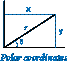

1.  **极坐标。** 编写一个程序，将笛卡尔坐标转换为[极坐标](http://mathworld.wolfram.com/PolarCoordinates.html)。您的程序应该从命令行接受两个浮点数`x`和`y`，并写出极坐标*r*和*θ*。使用 Python 函数`math.atan2(y, x)`，计算*y/x*的反正切值，范围为*-π*到`π`。

    *解决方案*: 请查看 polar.py。

1.  **高斯随机数。** 生成服从高斯分布的随机数的一种方法是使用*Box-Muller*公式：

    > | *Z* = sin(2 π *v*) (-2 ln *u*)^(1/2) |
    > | --- |

    其中*u*和*v*是由`random.random()`函数生成的 0 到 1 之间的实数。编写一个程序，写出一个标准高斯随机变量。

1.  **顺序检查。** 编写一个程序，将三个浮点数`x`、`y`和`z`作为命令行参数，并在值严格递增或递减（`x < y < z`或`x > y > z`）时写出`True`，否则写出`False`。

1.  **星期几。** 编写一个程序，接受日期作为输入，并写出该日期所在的星期几。您的程序应该接受三个命令行参数：`m`（月份），`d`（日期）和`y`（年份）。对于`m`，使用 1 表示一月，2 表示二月，依此类推。对于输出，写出 0 表示星期日，1 表示星期一，2 表示星期二，依此类推。使用以下[公历日历公式](https://www.tondering.dk/claus/cal/julperiod.php)：

    > | *y[0]* = *y* - (14 - *m*) / 12 *x* = *y[0]* + *y[0]/4* - *y[0]*/100 + *y[0]*/400
    > 
    > *m[0]* = *m* + 12 * ((14 - *m*) / 12) - 2
    > 
    > *d[0]* = (*d* + *x* + (31**m[0]*)/ 12) mod 7 |

    例如，1953 年 8 月 2 日是星期几？

    > | *y* = 1953 - 0 = 1953 *x* = 1953 + 1953/4 - 1953/100 + 1953/400 = 2426
    > 
    > *m* = 8 + 12*0 - 2 = 6
    > 
    > *d* = (2 + 2426 + (31*6) / 12) mod 7 = 2443 mod 7 = 0 (星期日)
    > 
    > |

    *解决方案*: 请查看 day.py。

1.  **均匀随机数。** 编写一个程序，写出五个介于 0 和 1 之间的均匀随机浮点数，它们的平均值以及最小值和最大值。使用内置的`max()`和`min()`函数。

    *解决方案*: 请查看 stats1.py。

1.  **墨卡托投影。** [墨卡托投影](http://en.wikipedia.org/wiki/Mercator_projection)是一种保角（保持角度）投影，将纬度*φ*和经度*λ*映射到矩形坐标*(x, y)*。它被广泛使用，例如在航海图和从网络打印的地图中。该投影由以下方程定义：

> | *x* = λ - λ[0] *y* = 1/2 * ln((1 + sin(φ)) / (1 - sin(φ))) |
> | --- |

其中λ[0]是地图中心点的经度。编写一个程序，接受λ[0]以及从命令行接受的点的纬度和经度，并写出其投影。

1.  **颜色转换。** 有几种不同的格式用于表示颜色。例如，LCD 显示器、数码相机和网页的主要格式，称为 RGB 格式，指定了红色（R）、绿色（G）和蓝色（B）的级别，范围从 0 到 255 的整数。出版书籍和杂志的主要格式，称为 CMYK 格式，指定了青色（C）、品红色（M）、黄色（Y）和黑色（K）的级别，范围从 0.0 到 1.0 的实数。编写一个程序，将 RGB 转换为 CMYK。从命令行接受三个整数 —— r、g 和 b —— 并写入相应的 CMYK 值。如果 RGB 值都为 0，则 CMY 值都为 0，K 值为 1；否则，使用以下公式：

    > | *w* = max(*r*/255, *g*/255, *b*/255) |
    > | --- |
    > | *c* = (*w* - *r*/255) / *w* |
    > | *m* = (*w* - *g*/255) / *w* |
    > | *y* = (*w* - *b*/255) / *w* |
    > | *k* = 1 - *w* |

    这是一个示例运行：

    > ```py
    > $ python rgbtocmyk.py 75 0 130       # indigo
    > cyan    = 0.4230769230769229
    > magenta = 1.0
    > yellow  = 0.0
    > black   = 0.4901960784313726
    > 
    > ```


1.  **大圆。** 编写一个程序，接受四个浮点命令行参数 `x1`、`y1`、`x2` 和 `y2`（地球上两点的纬度和经度，以度为单位），并计算它们之间的大圆距离。大圆距离 `d`（以海里为单位）由根据余弦定理推导的公式给出：

    > | *d = 60 * arccos(sin(x[1]) * sin(x[2]) + cos(x[1]) * cos(x[2]) * cos(y[1] - y[2]))* |
    > | --- |

    请注意，此方程式使用的是度数，而 Python 的三角函数使用的是弧度。使用 `math.radians()` 和 `math.degrees()` 在两者之间进行转换。使用您的程序计算巴黎（48.87° N，-2.33° W）和旧金山（37.8° N，122.4° W）之间的大圆距离。

    注意：地球的形状更像是一个扁平的椭球体，而不是一个球体，因此上面的公式只是一个近似值（误差约为 0.5%）。此外，这个公式对于小距离是[不可靠的](http://www.movable-type.co.uk/scripts/GIS-FAQ-5.1.html)，因为反余弦函数是病态的。

    这里是[Haversine 公式](http://en.wikipedia.org/wiki/Haversine_formula)：

    > | *a = sin²((L2-L1)/2) + cos(L1) * cos(L2) * sin²((G2-G1)/2) c = 2 * arcsin(min(1, sqrt(a))) # 以弧度表示的距离 distance = 60 * c # 海里* |
    > | --- |

    Haversine 公式对大多数距离是准确的，但当点（几乎）是对极点时，会出现舍入误差。以下[公式](http://en.wikipedia.org/wiki/Great-circle_distance#The_formula)对所有距离都是准确的。

    > | *delta = G1 - G2 p1 = cos(L2) * sin(delta) p2 = cos(L1) * sin(L2) - sin(L1) * cos(L2) * cos(delta) p3 = sin(L1) * sin(L2) + cos(L1) * cos(L2) * cos(delta) distance = 60 * atan2(sqrt(p1*p1 + p2*p2), p3)* |
    > | --- |

    这里的[Kahan 参考](http://www.cs.berkeley.edu/~wkahan/Math128/angle.pdf)提供了更多细节。

    *解决方案*：参见大圆.py。

1.  **三排序。** ��写一个程序，从命令行接受三个整数，并按升序写出它们。使用内置的 `min()` 和 `max()` 函数。

    *解决方案*：参见三排序.py。

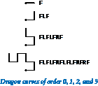

1.  **龙曲线。** 编写一个程序，以绘制[龙曲线](http://www.jimloy.com/fractals/dragon.htm)的指令，从 0 到 5 阶。指令是由字符 `F`、`L` 和 `R` 组成的字符串，其中 `F` 表示“向前移动 1 个单位时画线”，`L` 表示“向左转”，`R` 表示向右转。当您将一条纸折叠 n 次，然后展开成直角时，就形成了 n 阶龙曲线。解决这个问题的关键是注意到 n 阶曲线是 n-1 阶曲线后跟一个 *L*，然后是以相反顺序遍历的 n-1 阶曲线，然后找出相反曲线的类似描述。

    *解决方案*：参见龙 1.py。
