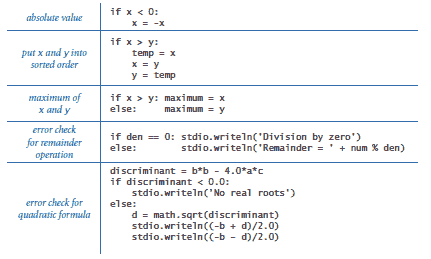
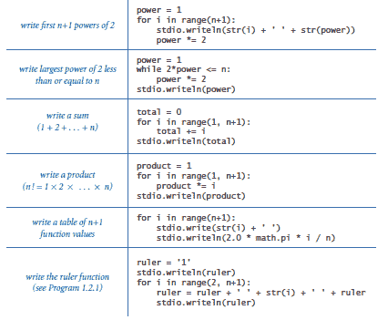
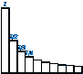
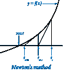
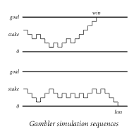
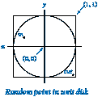

# 1.3 条件语句和循环

> 原文：[`introcs.cs.princeton.edu/python/13flow`](https://introcs.cs.princeton.edu/python/13flow)

我们使用术语*控制流*来指代程序中执行的语句序列。到目前为止，我们检查过的所有程序都具有简单的控制流：语句按给定顺序依次执行。大多数程序具有更复杂的结构，其中语句可能会根据某些条件（条件语句）而执行或不执行，或者一组语句会多次执行（循环）。

* * *

## `if`语句

大多数计算需要针对不同的输入采取不同的操作。程序 flip.py 使用`if-else`语句来编写硬币翻转的结果。下表总结了一些典型情况，您可能需要使用`if`或`if-else`语句。

> 

请注意，在 Python 中缩进是有意义的。例如，考虑这两个代码片段：

```py
if x >= 0:                      if x >= 0:
    stdio.write('not ')             stdio.write('not ')
stdio.writeln('negative')           stdio.writeln('negative')

```

如果`x`大于或等于 0，则两个片段都写出'not negative'。如果`x`小于 0，则左侧的代码写出'negative'，但右侧的代码根本不写出任何内容。

* * *

## `while`语句

许多计算本质上是重复的。`while`语句使我们能够多次执行一组语句。这使我们能够表达冗长的计算而不需要编写大量代码。程序 tenhellos.py 会写出"Hello, World"十次。程序 powersoftwo.py 接受一个命令行参数`n`，并写出所有小于或等于`n`的 2 的幂。

顺便提一下，在 Python 中，我们可以用简写符号`i += 1`来缩写形式为`i = i + 1`的赋值语句。相同的符号也适用于其他二元运算符，包括`-`、`*`和`/`。例如，大多数程序员会使用`power *= 2`而不是`power = 2 * power`在 powersoftwo.py 中。

* * *

## `for`语句

许多循环遵循相同的基本方案：将索引变量初始化为某个值，然后使用`while`循环测试涉及索引变量的退出条件，使用`while`循环中的最后一个语句修改索引变量。Python 的`for`语句是表达这种循环的直接方式。例如，以下两行代码等同于 tenhellos.py 中相应的代码行：

```py
for i in range(4, 11):
    stdio.writeln(str(i) + 'th Hello')

```

如果`range()`只有一个参数，则范围值的起始值默认为 0。例如，以下`for`循环比 powersoftwo.py 中的`while`循环更好：

```py
power = 1
for i in range(n+1):
    stdio.writeln(str(i) + ' ' + str(power))
    power *= 2

```

下表总结了一些典型情况，您可能需要使用`while`或`for`语句。

> 

* * *

## 嵌套

我们可以在其他`if`、`while`或`for`语句中嵌套`if`、`while`或`for`语句。例如，divisorpattern.py 有一���`for`循环，其嵌套语句是一个`for`循环（其嵌套语句是一个`if`语句）和一个`stdio.writeln()`语句。

作为嵌套的第二个示例，考虑一个包含以下代码的税务准备程序：

```py
if income < 0.0:
    rate = 0.00
else:
    if income < 8925:
        rate = 0.10
    else:
        if income < 36250:
            rate = 0.15
        else:
            if income < 87850:
               rate = 0.25
            ...

```

Python 允许`if`语句包含`elif`（"else if"）子句。使用`elif`子句会产生更紧凑的代码：

```py
if   income < 0:      rate = 0.00
elif income < 8925:   rate = 0.10
elif income < 36250:  rate = 0.15
elif income < 87850:  rate = 0.23
elif income < 183250: rate = 0.28
elif income < 398350: rate = 0.33
elif income < 400000: rate = 0.35
else:                 rate = 0.396

```

* * *

## 应用

能够使用条件语句和循环进行编程立即为我们打开了计算世界的大门。



### 有限和。

powersoftwo.py 使用的计算范式是您经常会使用的范式之一。它使用两个变量 — 一个作为控制循环的索引，另一个用于累积计算结果。程序 harmonic.py 使用相同的范式来计算有限和*H[n]* = 1 + 1/2 + 1/3 + ... + 1/*n*。这些数字被称为*调和数*。

### 计算平方根。

`math.sqrt()`函数是如何实现的？程序 sqrt.py 演示了一种技术。它使用了艾萨克·牛顿和约瑟夫·拉夫逊开发的一般计算技术的一个特例，被广泛称为*牛顿法*。要计算正数*t*的平方根，从估计*t* = *c*开始。如果*t*等于*c* / *t*，那么*t*等于*c*的平方根，计算完成。如果不是，则通过用*t*和*c* / *t*的平均值替换*t*来改进估计。每次执行此更新时，我们都会更接近所需的答案。

### 数字转换。

程序 binary.py 将作为命令行参数键入的十进制数的二进制（基数 2）表示写入。它基于将数字分解为二的幂的和。例如，106 的二进制表示是 1101010，这意味着 106 = 64 + 32 + 8 + 2，或者用二进制表示，1101010 = 1000000 + 100000 + 1000 + 10。要计算*n*的二进制表示，我们按递减顺序考虑小于或等于*n*的 2 的幂，以确定哪些属于二进制分解（因此对应于二进制表示中的 1 位）。

### 蒙特卡洛模拟。

我们的下一个示例代表了一类广泛使用的程序，我们在其中使用计算机模拟真实世界可能发生的情况，以便在各种复杂情况下做出明智的决策。假设一个赌徒进行一系列公平的$1 赌注，从$50 开始，并继续玩直到她破产或拥有$250。她带着$250 回家的机会有多大，以及在赢或输之前她可能会做多少赌注？程序 gambler.py 是一个可以帮助回答这些问题的模拟。它接受三个命令行参数，初始赌注($50)，目标金额($250)，以及我们想要模拟游戏的次数。

### 因式分解。

*素数*是大于 1 的整数，其唯一的正因子是 1 和它本身。一个整数的素数分解是其乘积为该整数的素数的多重集。例如，3757208 = 2*2*2*7*13*13*397。factors.py 程序计算任何给定正整数的素数分解。当`factor`*`factor`大于`n`时，我们可以停止寻找因子，因为如果整数`n`有一个因子，那么它小于或等于`n`的平方根。

* * *

## 半循环

假设我们想要一个循环，重复执行以下操作：执行一些语句序列，如果满足某个循环终止条件，则退出循环，并执行一些其他语句序列。也就是说，我们希望将循环控制条件放在循环中间，而不是在开头。这被称为*半循环*，因为你必须在达到循环终止测试之前走过循环的一部分。Python 提供`break`语句来实现这一目的。当 Python 执行`break`语句时，它立即退出（最内层）循环。



例如，考虑生成一个在单位圆盘中随机分布的点的问题。由于我们总是希望生成至少一个点，我们构建一个`while`循环，其循环继续条件总是满足，生成 2x2 方形中的随机点(*x*, *y*)，并使用`break`语句来终止循环，如果(*x*, *y*)在单位圆盘中。

```py
while True:
    x = -1.0 + 2.0*random.random()
    y = -1.0 + 2.0*random.random()
    if x*x + y*y <= 1.0:
        break

```

* * *

#### 问与答

**Q.** `=`和`==`之间有什么区别？

**A.** 我们在这里重复这个问题，提醒您在条件表达式中不要使用`=`而应该使用`==`。语句`x = y`将`y`赋给`x`，而表达式`x == y`测试当前两个变量是否相等。在某些编程语言中，这种差异可能会在程序中造成混乱并难以检测。在 Python 中，赋值语句不是表达式。例如，如果我们在 gambler.py 中犯了错误，将`cash = goal`而不是`cash == goal`，编译器会为我们找到错误：

```py
% python gambler.py 10 20 1000
File "gambler.py", line 21
  if cash = goal:
          ^
SyntaxError: invalid syntax

```

**Q.** 如果我在`if`、`while`或`for`语句中省略冒号会发生什么？

**A.** Python 在编译时会引发`SyntaxError`。

**Q.** 缩进语句块的规则是什么？

**A.** 块中的每个语句必须具有相同的缩进；如果没有，Python 会在编译时引发`IndentationError`。Python 程序员通常使用四个空格的缩进方案，我们在本书中遵循这种方式。

**Q.** 我应该使用制表符来缩进我的代码吗？

**A.** 不可以，在`.py`文件中避免使用制表符。然而，许多编辑器在您按下<Tab>键时提供自动将一系列空格放入程序中的选项；在编写 Python 程序时使用该选项是合适的。

**Q.** 我可以将一条长语句分布在多行吗？

**A.** 是的，但是由于 Python 处理缩进的方式，需要一些小心。如果跨越多行的表达式被括在括号（或方括号或大括号）中，则不需要做任何特殊处理。例如，这是一条跨越三行的单个语句：

```py
stdio.write(a0 + a1 + a2 + a3 +
            a4 + a5 + a6 + a7 +
            a8 + a9)

```

然而，如果没有暗示的行继续，你必须在每行末尾使用反斜杠字符以继续。

```py
total = a0 + a1 + a2 + a3 + \
        a4 + a5 + a6 + a7 + \
        a8 + a9

```

**Q.** 假设我想在某些情况下跳过循环中的一些代码，或者假设我希望条件语句的主体为空，以便不执行任何语句。Python 是否支持这样的语言特性？

**A.** 是的，Python 分别为这些情况提供了`continue`和`pass`语句。然而，真正需要它们的情况很少，我们在本书中不使用它们。此外，Python 中没有`switch`语句（用于互斥的替代方案），尽管在其他语言中通常可以找到一个，也没有`goto`语句（用于非结构化控制流）。

**Q.** 我可以在`if`或`while`语句中使用非布尔表达式吗？

**A.** 可以，但这可能不是一个好主意。评估为零或空字符串的表达式被视为`False`；所有其他数字和字符串表达式被视为`True`。

**Q.** 是否有必须使用`for`语句而不使用`while`语句的情况，反之亦然？

**A.** 您可以使用`while`语句来实现任何类型的循环，但是，如此定义，您只能使用`for`语句来迭代有限整数序列的循环。稍后（第 1.4、3.3 和 4.4 节），我们将考虑使用`for`语句的其他方法。

**Q.** 我可以使用内置的`range()`函数来创建步长不为 1 的整数序列吗？

**A.** 是的，`range()`支持一个可选的第三个参数步长，默认为 1。也就是说，`range(start, stop, step)`生成整数序列`start`、`start` + `step`、`start` + 2 * `step`等。如果`step`是正整数，则序列会继续，直到`start` + i * `step`小于`stop`；如果`step`是负整数，则序列会继续，直到`start` + i * `step`大于`stop`。例如，`range(0, -100, -1)`返回整数序列 0, -1, -2, ..., -99。

**Q.** 我可以将浮点数用作`range()`的参数吗？

**A.** 不行，所有参数必须是整数。

**Q.** 我可以在`for`循环中更改循环索引变量吗？

**A.** 是的，但它不会影响`range()`生成的整数序列。例如，以下循环写入从 0 到 99 的 100 个整数：

```py
for i in range(100):
    stdio.writeln(i)
    i += 10

```

**Q.** 在`for`循环中，循环控制变量在循环终止后的值是多少？

**A.** 它是循环结束时的循环控制变量的最后一个值。在上面的 for 循环终止后，`i`指的是整数 109。在 for 循环终止后使用循环控制变量通常被认为是不良风格，因此我们在任何程序中都不这样做。

**Q.** 我的程序陷入了无限循环。我该如何停止它？

**A.** 输入`Ctrl-c`。也就是，按住标有`Ctrl`或`control`的键，然后按`c`键。对于 Windows 命令提示符，请输入`Ctrl-z`。

**Q.** 是否有一个示例表明以下`for`和`while`循环不等价？

> ```py
> for *variable* in range(*start*, *stop*):
>     *statement1*
>     *statement2*
>     ...
> 
> *variable* = *start*
> while *variable* < *stop*:
>     *statement1*
>     *statement2*
>     ...
>     *variable* += 1
> 
> ```

**A.** 是的。提示：使用`continue`语句。

* * *

#### 练习

1.  编写一个程序，接受三个整数命令行参数，如果三个数都相等则写入`'equal'`，否则写入`'not equal'`。

1.  编写一个更通用和健壮的版本的 quadratic.py（来自第 1.2 节），该程序写入多项式*ax²*bx + *c*的根，如果判别式为负则写入适当的错误消息，并且如果*a*为零则适当地行为（避免除以零）。

1.  编写一个代码片段，接受两个浮点数命令行参数，如果两者都严格介于 0 和 1 之间则写入`True`，否则写入`False`。

1.  通过添加代码来检查命令行参数的值是否在公式有效范围内，并添加代码来写入错误消息（如果不在范围内），改进第 1.2 节中“风寒”练习的解决方案。

1.  在执行以下代码片段后，`j`的值是多少？

    ```py
    a. j = 0
       for i in range(0, 10):
           j += i

    b. j = 1
       for i in range(0, 10):
           j += j

    c. for j in range(0, 10):
           j += j

    ```

1.  重新设计 tenhellos.py 以编写一个接受要写入的行数作为命令行参数的程序。您可以假设参数小于 1000。*提示*：考虑使用`i % 10`和`i % 100`来确定写入第`i`个 Hello 时是否使用`st`、`nd`、`rd`或`th`。

1.  编写一个程序，使用一个`for`循环和一个`if`语句，每行写入从 1000（包括）到 2000（不包括）的整数，每行写入五个整数。*提示*：使用`%`运算符。

    *解决方案*：参见 fiveperline.py。

1.  将第 1.2 节中的“均匀随机数”练习进行泛化，编写一个程序，接受一个整数`n`作为命令行参数，使用`random.random()`写入`n`个介于 0 和 1 之间的均匀随机数，然后写入它们的平均值、最小值和最大值。

1.  描述当使用一个太大的参数调用 rulern.py 时会发生什么。例如，尝试执行命令`python rulern 100`。

1.  编写一个程序，为*n* = 2, 4, 8, 16, 32, 64, 128 时，写入*log n*, *n*, *n* log *n*, *n*²和*n*³的值表。使用制表符（`'\t'`字符）对齐列。

*解决方案*：参见 functiongrowth.py。

1.  当执行以下代码后，`m`和`n`是什么？

    ```py
    n = 123456789
    m = 0
    while n != 0:
        m = (10 * m) + (n % 10)
        n //= 10

    ```

    *解决方案*：运行程序 digitreverser.py。

1.  这段代码会写入什么？

    ```py
    f = 0
    g = 1
    for i in range(0, 16):
        f = f + g
        g = f - g
        stdio.writeln(f)

    ```

    *解决方案*：运行程序 fibonacci.py。

1.  编写一个程序，接受一个命令行参数`n`，并写出小于或等于`n`的所有正数的 2 的幂。确保您的程序对所有`n`的值都能正常工作。（如果`n`为负数或零，则您的程序不应写出任何内容。）

1.  扩展您对第 1.2 节中“连续复利”练习的解决方案，编写一个表格，列出每次月付款后支付的总金额和剩余本金。

1.  组合一个使用`while`循环而不是`for`循环的 divisorpattern.py 版本。

1.  与调和数不同，和 1/1² + 1/2² + ... + 1/*n*²随着*n*增长到无穷大时会收敛到一个常数。 （实际上，该常数是π²/6，因此可以使用此公式来估计π的值。）以下哪个`for`循环计算这个和？假设`n`是整数 1000000，`total`是初始化为 0.0 的浮点数。

    ```py
    a. for i in range(1, n+1):
           total += 1 / (i*i)

    b. for i in range(1, n+1):
           total += 1.0 / i*i

    c. for i in range(1, n+1):
           total += 1.0 / (i*i)

    d. for i in range(1, n+1):
           total += 1 / (1.0*i*i)

    ```

1.  证明 sqrt.py 实现了用于找到*c*的平方根的牛顿法。*提示*：使用切线的斜率等于函数*f*(*x*)在*x* = *t*处的导数*f*'(*t*)来找到切线方程，然后使用该方程找到切线与*x*轴相交的点，以显示您可以使用牛顿法来找到任何函数的根，方法如下：在每次迭代时，将估计值*t*替换为*t* - *f*(*t*) / *f*'(*t*)。

1.  使用牛顿法，开发一个程序，该程序将整数 n 和 k 作为命令行参数，并写出 n 的第 k 个根（*提示*：参考前一个练习）。

1.  修改 binary.py 以创建一个程序，该程序将`i`和`k`作为命令行参数，并将`i`转换为基数`k`。假设`k`是介于 2 和 16 之间的整数。对于大于 10 的基数，使用字母`A`到`F`分别表示第 11 到第 16 位数字。

1.  编写一个名为的程序，接受一个正整数命令行参数`n`，将`n`的二进制表示放入一个字符串中，然后写出该字符串。

    *解决方案*：参见 binary2.py。

1.  组合一个版本的 gambler.py，该版本使用两个嵌套的`while`循环或两个嵌套的`for`循环，而不是在`for`循环内部使用`while`循环。

1.  编写一个程序，通过在每次下注后写一行来跟踪赌徒破产模拟，每个星号对应赌徒所持有的每一美元。

1.  修改 gambler.py 以接受额外的命令行参数，指定赌徒每次下注赢得的（固定）概率。使用您的程序尝试了解这个概率如何影响获胜的机会和预期下注次数。尝试一个接近 0.5 的*p*值（例如，0.48）。

1.  修改 gambler.py 以接受额外的命令行参数，指定赌徒愿意进行的下注次数，以便游戏以三种可能的方式结束：赌徒赢了、输了或时间用尽。添加输出以给出赌徒在游戏结束时预期拥有的金额。*额外奖励*：使用您的程序计划下次前往蒙特卡洛的旅行。

1.  修改 factors.py 以仅写出每个质因数的一个副本。

1.  运行快速实验，以确定在 factors.py 中使用终止条件`factor <= n`而不是`factor*factor <= n`的影响。对于每种方法，找到最大的*n*，以便当您输入一个*n*位数时，程序肯定会在 10 秒内完成。

1.  编写一个程序，接受一个整数命令行参数`n`，并写出一个二维`n`×`n`的棋盘图案，交替使用空格和星号，就像以下 4×4 的图案一样。

    > ```py
    > * * * *
    >  * * * *
    > * * * *
    >  * * * *
    > 
    > ```

1.  编写一个程序，从命令行接受两个整数`x`和`y`，并使用*欧几里德算法*找到并写出`x`和`y`的最大公约数(gcd)，这是一种基于以下观察的迭代计算：如果`x > y`，那么如果`y`整除`x`，则`x`和`y`的最大公约数是`y`；否则`x`和`y`的最大公约数与`x % y`和`y`的最大公约数相同。

1.  编写一个程序，接受一个命令行参数`n`，并写出一个`n`×`n`表格，如果`i`和`j`的最大公约数是 1（`i`和`j`是互质的），则在第`i`行和第`j`列中有一个`*`，否则在该位置有一个空格。

1.  编写一个程序，生成一个在单位圆盘中随机分布的点，但不使用`break`语句。将你的解决方案与本节末尾给出的解决方案进行比较。

1.  编写一个程序，写出单位球面上一个随机点(*a*, *b*, *c*)的坐标。要生成这样一个点，使用*Marsaglia 方法*：首先，在单位圆盘中选择一个随机点(*x*, *y*)，方法如本节末尾所述。然后，将*a*设置为 2 x sqrt(1 - *x*² - *y*²)，将*b*设置为 2 y sqrt(1 - *x*² - *y*²)，将*c*设置为 1 - 2 (*x*² + *y*²)。

* * *

#### 创意练习

1.  **拉马努金的出租车。** S.拉马努金是一位印度数学家，以他对数字的直觉而闻名。有一天，英国数学家 G.H.哈代来医院看望他时，哈代说他的出租车号码是 1729，一个相当乏味的数字。拉马努金回答说：“不，哈代！不，哈代！这是一个非常有趣的数字。它是可以用两种不同方式的两个立方数之和来表示的最小数字。”通过编写一个程序验证这一说法，该程序接受一个命令行参数`n`，并写出所有小于或等于`n`的整数，这些整数可以用两种不同方式的两个立方数之和来表示。换句话说，找到不同的正整数*a*, *b*, *c*和*d*，使得*a*³ + *b*³ = *c*³ + *d*³。使用四个嵌套的`for`循环。

    *解决方案*: 请参见 ramanujanwhile.py 和 ramanujanfor.py。

    现在，车牌号 87539319 似乎是一个相当乏味的数字。确定它为什么不是。

1.  **校验和。** 国际标准书号([ISBN](http://mathworld.wolfram.com/ISBN.html))是一个 10 位代码，可以唯一指定一本书。最右边的数字是一个*校验和*数字，可以根据其他 9 位数字唯一确定，条件是 10*d*[10] + 9*d*[9] + ... + 2*d*[2] + *d*[1]必须是 11 的倍数（这里*d[i]*表示从右边数第*i*位数字）。校验和数字*d*[1]可以是 0 到 10 之间的任何值：ISBN 约定使用值'X'表示 10。*示例*: 对应于 020131452 的校验和数字是 5，因为它是 0 到 10 之间的唯一值，使得 10*0 + 9*2 + 8*0 + 7*1 + 6*3 + 5*1 + 4*4 + 3*5 + 2*2 + *d*[1]是 11 的倍数。编写一个程序，接受一个 9 位整数作为命令行参数，计算校验和，并写出 10 位 ISBN 号码。如果程序不写任何前导 0，那也没关系。

    *解决方案*: 请参见 isbn.py。

1.  **计算素数。** 编写一个程序，接受一个命令行参数`n`，并写出小于`n`的素数数量。使用它来计算小于 1000 万的素数数量。*注意:* 如果你不小心让你的程序变得高效，它可能无法在合理的时间内完成。在第 1.4 节中，你将学习一种更有效的计算方法，称为*埃拉托斯特尼筛法*。

1.  **二维随机漫步。** 二维[随机漫步](http://en.wikipedia.org/wiki/Random_walk)模拟了一个粒子在点阵中移动的行为。在每一步中，随机漫步者以 1/4 的概率向北、南、东或西移动，与之前的移动无关。编写一个程序，接受一个命令行参数 `n`，并估计一个随机漫步者击中以起始点为中心的一个 2`n`+1×2`n`+1 正方形边界需要多长时间。

1.  **五数中位数。** 编写一个程序，从命令行获取五个不同的整数，并写出中位数（即其他两个整数较小，另外两个整数较大的值）。*额外加分*：使用比给定输入少于七次比较值的程序解决该问题。

1.  **指数函数。** 假设 `x` 是一个浮点数。编写一个代码片段，使用泰勒级数展开将 *e*^x = 1 + *x* + *x*²/2! + *x*³/3! + ... 赋值给 `total`。

*解决方案*：这个练习的目的是让你思考一个类似 `math.exp()` 这样的库函数如何通过基本运算符实现。尝试解决它，然后将你的解决方案与这里开发的解决方案进行比较。我们首先考虑计算一个项的问题。假设 `x` 是一个浮点数，`n` 是一个整数。以下代码使用直接方法为 `term` 赋值 *x*^(*n*) / *n*!，其中分子和分母分别有一个循环，然后将结果相除：

```py
num = 1.0
den = 1.0
for i in range(1, n+1):
    num *= x
for i in range(1, n+1):
    den *= i
term = num / den

```

更好的方法是只使用一个 for 循环：

```py
term = 1.0
for i in range(1, n+1):
    term *= x / i

```

除了更紧凑和优雅外，后一种解决方案更可取，因为它避免了由于使用巨大数字进行计算而引起的不准确性。例如，对于像 *x* = 10 和 *n* = 100 这样的值，两个循环的方法会出现问题，因为 100! 太大，无法准确表示为浮点数。

要计算 *e^x*，我们将这个 `for` 循环嵌套在一个 `while` 循环中：

```py
term = 1.0
total = 0.0
n = 1
while total != total + term:
    total += term
    term = 1.0
    for i in range(1, n+1):
        term *= x / i
    n += 1

```

`while`

`total`

`(term > 0)`

`for`

`while`

`while`

```py
term = 1.0
total = 0.0
n = 1
while total != total + term:
    total += term
    term *= x / n
    n += 1

```

1.  **实验分析。** 运行实验以确定计算 *e^x* 问题时 `Math.exp()` 和来自练习 2.3.36 的以下三种方法的相对成本：具有嵌套循环的直接方法，具有单个循环的改进方法，以及具有循环继续条件 `(term > 0)` 的后者。对于每种方法，使用命令行参数进行试错，以确定您的计算机在 10 秒内可以执行多少次计算。

1.  **三角函数。** 编写程序，使用泰勒级数展开计算 sin *x* 和 cos *x*：

    > sin *x* = *x* - *x*³/3! + *x*⁵/5! - *x*⁷/7! + ...
    > 
    > cos *x* = 1 - *x*²/2! + *x*⁴/4! - *x*⁶/6! + ...

    *部分解决方案*：参见 sine.py。

1.  **皮皮斯问题。** 在 1693 年，塞缪尔·皮皮斯问艾萨克·牛顿，掷一个公平骰子六次至少得到一个 1 的概率和掷它十二次至少得到两个 1 的概率哪个更大。编写一个程序，可以为牛顿提供一个快速答案。

1.  **游戏模拟。** 在 1970 年代的游戏节目 *让我们来做个交易* 中，一个参赛者面前有三扇门。其中一扇门后面有一个有价值的奖品。在参赛者选择一扇门后，主持人会打开其他两扇门中的一扇（当然不会透露奖品）。然后参赛者有机会换到另一扇未打开的门。参赛者应该这样做吗？直观上，参赛者最初选择的门和另一扇未打开的门被认为是同等可能包含奖品的，因此没有换门的动机。编写一个程序通过模拟来测试这种直觉。您的程序应该接受一个命令行参数 `n`，使用两种策略（换门或不换门）玩 `n` 次游戏，并写出两种策略的成功概率。或者您可以[在这里玩游戏](http://www.stat.sc.edu/~west/javahtml/LetsMakeaDeal.html)。

    *解决方案*：参见 montehall.py。

1.  **混沌。** 编写一个程序来研究以下简单的人口增长模型，该模型可以应用于研究池塘中的鱼、试管中的细菌或类似情况。我们假设人口从 0（灭绝）到 1（可维持的最大人口）范围内。如果时间为*t*时的人口为*x*，那么我们假设时间为*t* + 1 时的人口为*r*x*(1-*x*)，其中参数*r*，称为*生育参数*，控制增长速率。从一个小的人口开始 — 比如，*x* = 0.01 — 并研究模型的迭代结果，对于不同的*r*值。在哪些*r*值下，人口会稳定在*x* = 1 - 1/*r*？当*r*为 3.5 时，你能说些什么？3.8？5？

    生物学家使用[Logistic 方程](http://mathworld.wolfram.com/LogisticEquation.html)来模拟池塘中鱼类的人口增长。研究一些混沌行为。

1.  **欧拉的幂求和猜想**。1769 年，莱昂哈德·欧拉提出了费马大定理的一个广义版本，猜想至少需要*n*个正整数的*n*次幂来得到一个本身也是*n*次幂的和，对于*n* > 2。编写一个程序来反驳欧拉的猜想（直到 1967 年仍然有效），使用五重嵌套循环来找到四个正整数，它们的 5 次幂之和等于另一个正整数的 5 次幂。也就是说，找到五个整数*a*、*b*、*c*、*d*和*e*，使得*a*⁵ + *b*⁵ + *c*⁵ + *d*⁵ = *e*⁵。

1.  **龙曲线。** 这个练习是从第 1.2 节的“龙曲线”练习推广而来。编写一个程序，接受一个整数命令行参数`n`，并编写绘制一个阶为`n`的龙曲线的指令。

    *解决方案*：参见 dragon2.py。
